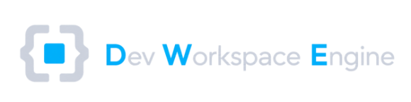
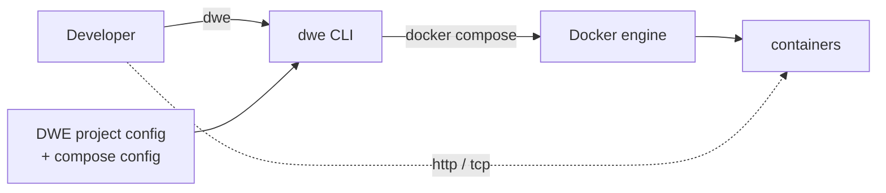

# DWE — Dev Workspace Engine

*Languages: 🇬🇧 **English** · 🇷🇺 [Русский](docs/i18n/ru/README.md)*

<div align="center">
  
</div>

A single-binary CLI for running, configuring, and maintaining containerised local development environments declaratively.

## Why dwe

- One descriptive tree (`workspace.yml` + `workspace/`) drives the whole project — services, pipelines, commands, info dashboard, templates, translations.
- Deploy, run, stop, restart, reset, and snapshot share the same pipeline engine, so behaviour is consistent across operations.
- Container orchestration sits on top of plain Docker Compose files the project already owns — no synthetic compose generation, no hidden lock-in.
- Per-developer overrides live in tracked `defaults.yml` plus gitignored `local.yml`; the same project boots cleanly on every workstation.
- The [host bridge](docs/reference/concepts/bridge.md) mounts a tiny `dwe` shim into dev containers, so git hooks and project commands work identically on the host and inside a devcontainer terminal.
- Embedded docs and i18n make `dwe docs` and translated UIs work without network access or out-of-band assets.

## Install

DWE ships as a single static Go binary. Pick whichever channel fits.

### Using Homebrew

```sh
brew install semsemyonoff/tap/dwe
```

Installs the binary plus bash, zsh, and fish completion to the standard Homebrew paths. Works on macOS (Intel + Apple Silicon) and Linux (linuxbrew).

### From releases

Download the appropriate archive or package from [GitHub releases](https://github.com/semsemyonoff/dwe/releases):

- `dwe_<version>_macos_{x86_64,arm64}.tar.gz` and `dwe_<version>_linux_{x86_64,arm64}.tar.gz` — extract and drop `dwe` into `/usr/local/bin` (or any directory on `$PATH`); the archive bundles a `completions/` folder for use with `dwe completion install`.
- `dwe_<version>_{amd64,arm64}.deb` — `sudo dpkg -i dwe_*.deb`; completion is installed automatically under `/usr/share/{bash-completion,zsh/site-functions,fish/vendor_completions.d}`.
- `dwe-<version>-1.{x86_64,aarch64}.rpm` — `sudo rpm -i dwe-*.rpm`; completion paths match the deb package.

File integrity can be verified against the published `checksums.txt`.

### From source

```sh
git clone https://github.com/semsemyonoff/dwe.git
cd dwe
make build
```

`make build` runs `go mod tidy`, syncs `docs/` into `internal/core/docs/embedded/`, regenerates `internal/core/docs/content_hashes_gen.go`, compiles `./cmd/dwe`, and writes `bin/dwe`. The binary is self-contained: docs, translations, default pipelines, and built-in steps are embedded. Drop it on `$PATH`:

```sh
install -m 0755 bin/dwe /usr/local/bin/dwe
```

> `go install github.com/semsemyonoff/dwe/cmd/dwe@latest` is intentionally unsupported: the embedded docs tree (`internal/core/docs/embedded/`) is generated by `scripts/sync-embedded-docs.sh` at build time and is gitignored, so a `go install` build would ship with empty docs.

### Shell completion (tar.gz only)

If the binary came from a tar.gz archive, completion is installed via a separate command:

```sh
dwe completion install            # autodetect $SHELL
dwe completion install zsh        # or specify the shell explicitly
```

Supported shells: bash, zsh, fish, powershell. See `dwe completion install --help` for details and dry-run.

### Runtime dependencies

`docker` (with `docker compose`), `git`, and a POSIX shell on the host. If they live in non-standard locations, override their paths in the user-level config at `~/.config/dwe/config` via `binary_<name> = <path>` entries — see [`docs/reference/config/userconfig.md`](docs/reference/config/userconfig.md#binary-overrides).

### Optional: AI agent skill

The repository ships an agent skill at [`skills/dwe/`](skills/dwe/SKILL.md) — a thin navigator that teaches Claude Code, Codex, Cursor, OpenCode, and other compatible agents how to detect a DWE project, which `dwe` commands to use for inspection vs mutation, and how to look up everything else through the built-in `dwe docs` subsystem.

#### Claude Code — as a plugin

This repository is also a Claude Code [plugin marketplace](https://code.claude.com/docs/en/discover-plugins). Add the marketplace and install the `dwe` plugin (which bundles the skill) from inside Claude Code:

```text
/plugin marketplace add semsemyonoff/dwe
/plugin install dwe@dwe
```

`dwe@dwe` is `<plugin>@<marketplace>` — both are named `dwe`. Run `/plugin` (no arguments) for the interactive browser instead. Once installed, the skill activates automatically whenever you work in a directory containing `workspace.yml`. To enable it across a team or in CI, commit the marketplace and plugin to `.claude/settings.json`:

```json
{
  "extraKnownMarketplaces": {
    "dwe": { "source": { "source": "github", "repo": "semsemyonoff/dwe" } }
  },
  "enabledPlugins": { "dwe@dwe": true }
}
```

#### Any agent — via the skills CLI

The [vercel-labs/skills](https://github.com/vercel-labs/skills) CLI installs the same skill into Claude Code, Codex, Cursor, OpenCode, and others:

```sh
# install into the current project (./<agent>/skills/)
npx skills add semsemyonoff/dwe --skill dwe

# or install globally for all your projects
npx skills add semsemyonoff/dwe --skill dwe -g

# target a specific agent (claude-code, codex, cursor, opencode, ...)
npx skills add semsemyonoff/dwe --skill dwe -a claude-code
```

## Quickstart

**Starting from scratch?** Scaffold a new project with a single command:

```sh
dwe init my-project    # interactive: prompts for name, prefix, branding
cd my-project
dwe validate           # check the scaffolded config
```

**Joining an existing project?** Enter a project directory containing `workspace.yml` and run any command — DWE walks upward from the working directory to locate the project root.

Validate the project before the first deploy:

```sh
cd my-project
dwe validate
```

Build and start the stack:

```sh
dwe deploy run    # idempotent: install, configure, migrate, bring up
dwe info          # rendered URLs, hosts, command groups
```

Drive the runtime lifecycle:

```sh
dwe run           # before-hooks → docker up → after-hooks → ready
dwe stop          # before-stop → docker down → after-stop
dwe restart       # stop + run
dwe status        # services, ports, hosts, git, env
```

Plan-only previews are read-only:

```sh
dwe deploy plan   # resolved phase/step tree, no execution
dwe validate      # readiness checks
```

The deploy journal lives at `.dwe/deploy/state.yml`. Repeat runs skip steps whose `action_hash` and inputs are unchanged. Deploy logs are written to `.dwe/logs/deploy.log` by default (suppress with `log: false`); lifecycle logs (`run`/`stop`/`reset`) are written only when `log: true` is set.

## Architecture

DWE sits between the developer and a Dockerized stack: it reads a project's YAML tree, renders a small amount of generated state next to it, and drives `docker compose` to actually run the containers. The developer never types `docker compose` directly.



- DWE owns the project model, the ordered compose file list, env rendering, lifecycle orchestration, locks, and the state journal under `.dwe/`.
- Docker owns containers, networks, volumes, image layers, and health reporting. The only handshake is the argv DWE passes to `docker compose` and the exit code it returns.
- Every invocation is short-lived and stateless: no plugin loader, no network on the normal path, and no resident process except the per-project [host-bridge](docs/reference/concepts/bridge.md) daemon that serves dev containers while the stack is up. Uninstalling DWE leaves the compose files under `compose/` as valid standalone `docker compose` input.

Full write-up: [`docs/reference/concepts/architecture.md`](docs/reference/concepts/architecture.md).

## Project layout

A typical project keeps its declarative tree under `workspace/`, Docker Compose overlays under `compose/`, and runtime data under `.dwe/` / `snapshots/` / `backups/`.

```text
my-project/
├── workspace.yml              # project identity
├── workspace/                 # tracked config tree
│   ├── defaults.yml           # versioned defaults (optional)
│   ├── local.yml              # per-developer overrides (gitignored, optional)
│   ├── services/<name>/       # per-service folders (service.yml + optional pipelines)
│   ├── commands/              # declarative user commands (optional)
│   ├── templates/             # template packs for `dwe render` (optional)
│   ├── deploy.yml             # top-level deploy orchestrator (optional)
│   ├── lifecycle.yml          # run / stop / restart (optional)
│   ├── reset.yml              # reset pipeline (optional)
│   ├── info.yml               # info dashboard (optional)
│   ├── validate.yml           # readiness checks (optional)
│   └── docker.yml             # compose file list + topology (optional)
├── compose/                   # tracked Docker Compose overlays (per service)
├── images/                    # tracked image builds (<service>/Dockerfile)
├── services/                  # gitignored service sources (<hub>/src/)
├── snapshots/                 # gitignored snapshot stash
├── backups/                   # gitignored DB/other dumps
└── .dwe/                      # gitignored CLI runtime data (state, locks, logs)
```

Full write-up: [`docs/reference/concepts/project-layout.md`](docs/reference/concepts/project-layout.md).

## Documentation

Reference documentation lives under `docs/reference/` and is also embedded in the binary. Browse it offline with `dwe docs` (interactive TUI) or `dwe docs show <topic>` (plain text).

- [Concepts](docs/reference/concepts/index.md) — high-level orientation: getting started, architecture, project layout, Docker integration, Git integration, pipelines, state and locks.
- [Configuration](docs/reference/config/index.md) — field-level reference for `workspace.yml`, services, commands, deploy/reset/lifecycle pipelines, snapshot, info, validate, setup, styles, UI, state, i18n, notifications, docker.
- [Render packs](docs/reference/render/index.md) — `dwe render env / ide / ai / git / config` — manifest schema, collision policies, local overrides.
- [Documentation subsystem](docs/reference/docs/index.md) — the `dwe docs` browser, non-interactive subcommands, translations, content-hash staleness.
- [Templates](docs/reference/templates.md) — the shared template engine: `{{ ... }}` vs `${ ... }`, sprout registries, render context per site.
- [Guides](docs/guides/index.md) — task-oriented recipes and integrations (e.g. Starship prompt).

Run `dwe --help` (or any subcommand with `--help`) for the live CLI surface.

Useful one-liners:

```sh
dwe docs                 # interactive browser
dwe docs list            # enumerate every topic
dwe docs show <topic>    # render one page
dwe docs search <term>   # cross-tree search
dwe docs llms-txt        # compact AI-agent project index
```

## License

Released under the [MIT License](LICENSE).
