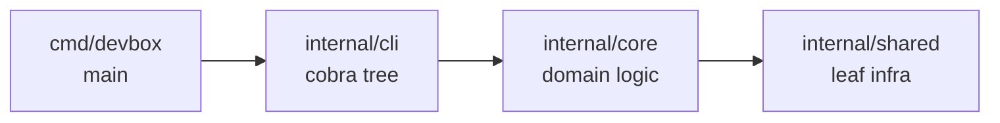

# Devbox

A single-binary CLI for running, configuring, and maintaining containerised local development environments declaratively.

## Why devbox

- One descriptive tree (`devbox.yml` + `devbox/`) drives the whole project — services, pipelines, commands, info dashboard, templates, translations.
- Deploy, run, stop, restart, reset, and snapshot share the same pipeline engine, so behaviour is consistent across operations.
- Container orchestration sits on top of plain Docker Compose files the project already owns — no synthetic compose generation, no hidden lock-in.
- Per-developer overrides live in tracked `defaults.yml` plus gitignored `local.yml`; the same project boots cleanly on every workstation.
- Embedded docs and i18n make `devbox docs` and translated UIs work without network access or out-of-band assets.

## Status

Devbox is in active pre-release development. Field names, commands, config layout, and surfaces all change without backwards-compatibility shims. There are no released versions and no third-party projects depending on the schema. Treat live projects in the monorepo as fixtures, not as compatibility constraints.

## Install

Devbox builds from source and ships as one static Go binary at `bin/devbox`.

```sh
make build
```

`make build` runs `go mod tidy`, syncs `docs/` into `internal/core/docs/embedded/`, regenerates `internal/core/docs/content_hashes_gen.go`, compiles `./cmd/devbox`, and writes `bin/devbox`. The binary is self-contained: docs, translations, default pipelines, and built-in steps are embedded.

Run it directly from the repository root:

```sh
./bin/devbox version
```

Optional system-wide install:

```sh
install -m 0755 bin/devbox /usr/local/bin/devbox
```

Runtime dependencies on the host: `docker` (with `docker compose`), `git`, and a POSIX shell. Override binary paths in `devbox.yml` if they live in non-standard locations — see [`docs/reference/config/devbox.md`](docs/reference/config/devbox.md).

## Quickstart

Enter a project directory containing `devbox.yml` and run any command — Devbox walks upward from the working directory to locate the project root.

Validate the project before the first deploy:

```sh
cd my-project
devbox validate
```

Build and start the stack:

```sh
devbox deploy run    # idempotent: install, configure, migrate, bring up
devbox info          # rendered URLs, hosts, command groups
```

Drive the runtime lifecycle:

```sh
devbox run           # before-hooks → docker up → after-hooks → ready
devbox stop          # before-stop → docker down → after-stop
devbox restart       # stop + run
devbox status        # services, ports, hosts, git, env
```

Plan-only previews are read-only:

```sh
devbox deploy plan   # resolved phase/step tree, no execution
devbox validate      # readiness checks
```

The deploy journal lives at `.devbox/deploy/state.yml`. Repeat runs skip steps whose `action_hash` and inputs are unchanged. Logs land under `.devbox/logs/` when `log: true` is set.

## Architecture

Devbox is a single Go binary built from a three-layer internal structure.



- `internal/cli/` — cobra commands, flag parsing, I/O routing. No domain logic.
- `internal/core/` — project model, pipeline engine, workflows (deploy, lifecycle, reset, snapshot, setup), validation, docs, notifications, UI sink.
- `internal/shared/` — Docker, Git, locks, templates, i18n, render, live UI, version.

The composition root in `internal/cli/root.go` registers every command into five groups (`core`, `environment`, `configuration`, `pipelines`, `advanced`) and threads the shared `*cmdctx.RootFlags` bundle through every subcommand. There is no plugin loader, no companion daemon, and no network on the normal path.

Full write-up: [`docs/reference/concepts/architecture.md`](docs/reference/concepts/architecture.md).

## Project layout

A typical project keeps its declarative tree under `devbox/`, Docker Compose overlays under `compose/`, and runtime data under `.devbox/` / `volumes/` / `snapshots/`.

```text
my-project/
├── devbox.yml              # project identity
├── devbox/                 # tracked config tree
│   ├── defaults.yml        # versioned defaults
│   ├── local.yml           # per-developer overrides (gitignored)
│   ├── services/<name>/    # per-service folders (service.yml + optional pipelines)
│   ├── commands/           # declarative user commands
│   ├── templates/          # template packs for `devbox render`
│   ├── deploy.yml          # top-level deploy orchestrator
│   ├── lifecycle.yml       # run / stop / restart
│   ├── reset.yml           # reset pipeline
│   ├── info.yml            # info dashboard
│   ├── validate.yml        # readiness checks
│   └── docker.yml          # compose file list + topology
├── compose/                # tracked Docker Compose overlays
├── configs/                # tracked per-service config templates
├── volumes/                # gitignored bind-mount targets
├── snapshots/              # gitignored snapshot stash
└── .devbox/                # gitignored CLI runtime data (state, locks, logs)
```

Full write-up: [`docs/reference/concepts/project-layout.md`](docs/reference/concepts/project-layout.md).

## Documentation

Reference documentation lives under `docs/reference/` and is also embedded in the binary. Browse it offline with `devbox docs` (interactive TUI) or `devbox docs show <topic>` (plain text).

- [Concepts](docs/reference/concepts/index.md) — high-level orientation: getting started, architecture, project layout, Docker integration, Git integration, pipelines, state and locks.
- [Configuration](docs/reference/config/index.md) — field-level reference for `devbox.yml`, services, commands, deploy/reset/lifecycle pipelines, snapshot, info, validate, setup, styles, UI, state, i18n, notifications, docker.
- [Render packs](docs/reference/render/index.md) — `devbox render env / ide / ai / git` — manifest schema, collision policies, local overrides.
- [Documentation subsystem](docs/reference/docs/index.md) — the `devbox docs` browser, non-interactive subcommands, translations, content-hash staleness.
- [Templates](docs/reference/templates.md) — the shared template engine: `{{ ... }}` vs `${ ... }`, sprout registries, render context per site.
- [CLI reference](docs/reference/cli/index.md) — auto-generated command tree (regenerate with `devbox docs generate`).

Useful one-liners:

```sh
devbox docs                 # interactive browser
devbox docs list            # enumerate every topic
devbox docs show <topic>    # render one page
devbox docs search <term>   # cross-tree search
devbox docs llms-txt        # compact AI-agent project index
```

## Contributing

Contributor-facing guidance lives in [`AGENTS.md`](AGENTS.md) (and the symlink `CLAUDE.md`). It covers the per-layer package boundaries, load-bearing patterns (JSON output mode, display-string localization, preflight + lock ordering, completion-path safety, pipeline defaults), and the docs/i18n hash-tracking workflow.

Common workflows:

```sh
make build       # tidy + sync embedded docs + regen hashes + build
make test        # full test suite (depends on embedded-docs sync)
make test-race   # focused race detector on lock + pipeline + journal
make lint        # golangci-lint (installs if missing)
make tidy        # go.mod / go.sum maintenance
```

Run `make build` after editing anything under `docs/reference/`, `docs/internals/`, or `docs/i18n/`. The sync step keeps the embedded copy and `internal/core/docs/content_hashes_gen.go` in step with the source tree.

Per-package responsibilities, invariants, and cross-package contracts are documented in [`docs/internals/packages.md`](docs/internals/packages.md) — read the relevant section before modifying internal packages.

## License

License terms are not yet finalised for this pre-release. A `LICENSE` file will be added at the repository root before the first tagged release.
