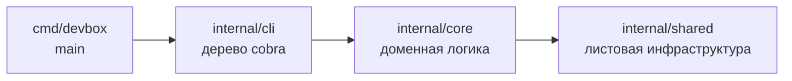

> Translated from: README.md @ 54377d0210e9

# Devbox

*Языки: [English](../../../README.md) · **Русский***

CLI в виде одного бинарника для декларативного запуска, настройки и обслуживания контейнеризованных локальных окружений разработки.

## Зачем devbox

- Одно описательное дерево (`devbox.yml` + `devbox/`) управляет всем проектом — сервисами, пайплайнами, командами, информационной панелью, шаблонами, переводами.
- Команды deploy, run, stop, restart, reset и snapshot работают на одном движке пайплайнов, поэтому поведение согласовано между операциями.
- Оркестрация контейнеров строится поверх обычных файлов Docker Compose, которыми уже владеет проект — без синтетической генерации compose, без скрытой привязки.
- Оверрайды для разработчика лежат в отслеживаемом `defaults.yml` плюс gitignored `local.yml`; один и тот же проект чисто поднимается на любой рабочей станции.
- Встроенные документация и i18n позволяют `devbox docs` и переведённым интерфейсам работать без сети и внешних ресурсов.

## Установка

Devbox поставляется как один статический Go-бинарник. Выбирайте удобный канал.

### Через Homebrew

```sh
brew install semsemyonoff/tap/devbox
```

Устанавливает бинарник и completion для bash, zsh, fish по стандартным путям Homebrew. Работает на macOS (Intel + Apple Silicon) и Linux (linuxbrew).

### Из релизов

Скачайте подходящий архив или пакет с [GitHub releases](https://github.com/semsemyonoff/devbox/releases):

- `devbox_<version>_macos_{x86_64,arm64}.tar.gz` и `devbox_<version>_linux_{x86_64,arm64}.tar.gz` — распакуйте и положите `devbox` в `/usr/local/bin` (или в любую директорию из `$PATH`); внутри архива лежит папка `completions/` со скриптами для `devbox completion install`.
- `devbox_<version>_{amd64,arm64}.deb` — `sudo dpkg -i devbox_*.deb`; completion ставится автоматически в `/usr/share/{bash-completion,zsh/site-functions,fish/vendor_completions.d}`.
- `devbox-<version>-1.{x86_64,aarch64}.rpm` — `sudo rpm -i devbox-*.rpm`; пути для completion те же, что у deb.

Целостность файлов проверяется по опубликованному `checksums.txt`.

### Из исходников

```sh
git clone https://github.com/semsemyonoff/devbox.git
cd devbox
make build
```

`make build` запускает `go mod tidy`, синхронизирует `docs/` в `internal/core/docs/embedded/`, перегенерирует `internal/core/docs/content_hashes_gen.go`, компилирует `./cmd/devbox` и пишет `bin/devbox`. Бинарник самодостаточен: документация, переводы, дефолтные пайплайны и встроенные шаги вшиты внутрь. Положите на `$PATH`:

```sh
install -m 0755 bin/devbox /usr/local/bin/devbox
```

> `go install github.com/semsemyonoff/devbox/cmd/devbox@latest` намеренно не поддерживается: дерево встроенной документации (`internal/core/docs/embedded/`) генерируется build-time скриптом `scripts/sync-embedded-docs.sh` и не коммитится — сборка через `go install` приехала бы с пустыми docs.

### Shell completion (только для tar.gz)

Если бинарник получен из tar.gz, completion ставится отдельной командой:

```sh
devbox completion install            # автоопределение $SHELL
devbox completion install zsh        # или явно указать шелл
```

Поддерживаемые шеллы: bash, zsh, fish, powershell. Подробности и dry-run — `devbox completion install --help`.

### Runtime-зависимости

`docker` (с `docker compose`), `git` и POSIX-shell на хосте. Если они лежат в нестандартных местах, переопределите их пути в пользовательском конфиге `~/.config/devbox/config` через записи `binary_<name> = <path>` — см. [`docs/reference/config/userconfig.md`](../../reference/config/userconfig.md#переопределения-бинарей).

### Опционально: скил для AI-агентов

Репозиторий поставляет агентский скил в [`skills/devbox/`](../../../skills/devbox/SKILL.md) — тонкий навигатор, который объясняет Claude Code, Codex, Cursor, OpenCode и другим совместимым агентам, как обнаружить Devbox-проект, какие команды `devbox` использовать для инспекции vs изменения и как смотреть всё остальное через встроенную подсистему `devbox docs`. Установка через CLI [vercel-labs/skills](https://github.com/vercel-labs/skills):

```sh
# установить в текущий проект (./<agent>/skills/)
npx skills add semsemyonoff/devbox --skill devbox

# или установить глобально для всех проектов
npx skills add semsemyonoff/devbox --skill devbox -g

# выбрать конкретного агента (claude-code, codex, cursor, opencode, ...)
npx skills add semsemyonoff/devbox --skill devbox -a claude-code
```

## Быстрый старт

Войдите в директорию проекта, содержащую `devbox.yml`, и запустите любую команду — Devbox идёт вверх от рабочей директории, чтобы найти корень проекта.

Перед первым деплоем проверьте проект:

```sh
cd my-project
devbox validate
```

Соберите и запустите стек:

```sh
devbox deploy run    # идемпотентно: установить, настроить, мигрировать, поднять
devbox info          # отрендеренные URL, хосты, группы команд
```

Управляйте жизненным циклом:

```sh
devbox run           # before-хуки → docker up → after-хуки → готово
devbox stop          # before-stop → docker down → after-stop
devbox restart       # stop + run
devbox status        # сервисы, порты, хосты, git, env
```

Plan-only превью — только чтение:

```sh
devbox deploy plan   # разрешённое дерево фаз/шагов, без выполнения
devbox validate      # проверки готовности
```

Журнал деплоя живёт в `.devbox/deploy/state.yml`. Повторные запуски пропускают шаги, у которых `action_hash` и входы не изменились. Логи попадают в `.devbox/logs/`, когда выставлен `log: true`.

## Архитектура

Devbox — один Go-бинарник, собранный из трёхслойной внутренней структуры.



- `internal/cli/` — команды cobra, парсинг флагов, маршрутизация I/O. Без доменной логики.
- `internal/core/` — модель проекта, движок пайплайнов, workflow'ы (deploy, lifecycle, reset, snapshot, setup), валидация, документация, нотификации, UI-сток.
- `internal/shared/` — Docker, Git, блокировки, шаблоны, i18n, render, live UI, версия.

Композиционный корень в `internal/cli/root.go` регистрирует каждую команду в одну из пяти групп (`core`, `environment`, `configuration`, `pipelines`, `advanced`) и протаскивает общий бандл `*cmdctx.RootFlags` через каждую подкоманду. Нет загрузчика плагинов, нет демона-компаньона и нет сети на штатном пути.

Полное описание: [`docs/reference/concepts/architecture.md`](../../reference/concepts/architecture.md).

## Раскладка проекта

Типичный проект держит декларативное дерево под `devbox/`, оверлеи Docker Compose под `compose/` и runtime-данные под `.devbox/` / `volumes/` / `snapshots/`.

```text
my-project/
├── devbox.yml              # идентичность проекта
├── devbox/                 # отслеживаемое дерево конфигурации
│   ├── defaults.yml        # версионированные дефолты
│   ├── local.yml           # оверрайды на разработчика (gitignored)
│   ├── services/<name>/    # папки сервисов (service.yml + опциональные пайплайны)
│   ├── commands/           # декларативные пользовательские команды
│   ├── templates/          # template-паки для `devbox render`
│   ├── deploy.yml          # верхнеуровневый оркестратор деплоя
│   ├── lifecycle.yml       # run / stop / restart
│   ├── reset.yml           # пайплайн reset
│   ├── info.yml            # информационная панель
│   ├── validate.yml        # проверки готовности
│   └── docker.yml          # список compose-файлов + топология
├── compose/                # отслеживаемые оверлеи Docker Compose
├── configs/                # отслеживаемые шаблоны конфигов сервисов
├── volumes/                # gitignored bind-mount цели
├── snapshots/              # gitignored хранилище снапшотов
└── .devbox/                # gitignored runtime-данные CLI (state, locks, logs)
```

Полное описание: [`docs/reference/concepts/project-layout.md`](../../reference/concepts/project-layout.md).

## Документация

Справочная документация живёт в `docs/reference/` и также встроена в бинарник. Просматривайте её офлайн через `devbox docs` (интерактивный TUI) или `devbox docs show <topic>` (обычный текст).

- [Концепции](../../reference/concepts/index.md) — высокоуровневая ориентация: начало работы, архитектура, раскладка проекта, интеграция с Docker, интеграция с Git, пайплайны, состояние и блокировки.
- [Конфигурация](../../reference/config/index.md) — справочник по полям для `devbox.yml`, сервисов, команд, пайплайнов deploy/reset/lifecycle, snapshot, info, validate, setup, styles, UI, state, i18n, нотификаций, docker.
- [Render-паки](../../reference/render/index.md) — `devbox render env / ide / ai / git` — схема манифеста, политики коллизий, локальные оверрайды.
- [Подсистема документации](../../reference/docs/index.md) — браузер `devbox docs`, неинтерактивные подкоманды, переводы, проверка свежести через хэш контента.
- [Шаблоны](../../reference/templates.md) — общий шаблонизатор: `{{ ... }}` против `${ ... }`, реестры sprout, контекст рендеринга по местам использования.
- [Справочник CLI](../../reference/cli/index.md) — автогенерируемое дерево команд (перегенерируется через `devbox docs generate`).

Полезные однострочники:

```sh
devbox docs                 # интерактивный браузер
devbox docs list            # перечислить все топики
devbox docs show <topic>    # отрендерить одну страницу
devbox docs search <term>   # поиск по всему дереву
devbox docs llms-txt        # компактный индекс проекта для AI-агентов
```

## Контрибьюция

Руководство для контрибьюторов живёт в [`AGENTS.md`](../../../AGENTS.md) (и в симлинке `CLAUDE.md`). Оно покрывает межслоевые границы пакетов, несущие паттерны (режим JSON-вывода, локализация display-строк, упорядочивание preflight + lock, безопасность пути completion, дефолты пайплайнов) и рабочий процесс отслеживания хэшей docs/i18n.

Типичные сценарии:

```sh
make build       # tidy + синк встроенных docs + регенерация хэшей + сборка
make test        # полный набор тестов (зависит от синка embedded-docs)
make test-race   # фокусный race-детектор на lock + pipeline + journal
make lint        # golangci-lint (устанавливает, если отсутствует)
make tidy        # обслуживание go.mod / go.sum
```

Запускайте `make build` после редактирования чего-либо под `docs/reference/`, `docs/internals/` или `docs/i18n/`. Шаг синхронизации держит встроенную копию и `internal/core/docs/content_hashes_gen.go` в соответствии с деревом исходников.

Ответственности отдельных пакетов, инварианты и межпакетные контракты задокументированы в [`docs/internals/packages.md`](../../internals/packages.md) — прочитайте соответствующий раздел перед изменением внутренних пакетов.

## Лицензия

Распространяется под лицензией [MIT](../../../LICENSE).
