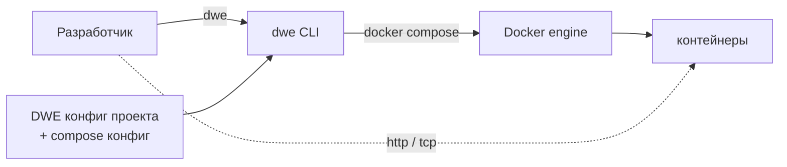

> Translated from: README.md @ 1e328aa5e19f

# DWE — Dev Workspace Engine

*Языки: 🇬🇧 [English](../../../README.md) · 🇷🇺 **Русский***

<div align="center">
  
</div>

CLI в виде одного бинарника для декларативного запуска, настройки и обслуживания контейнеризованных локальных окружений разработки.

## Зачем DWE

- Одно описательное дерево (`workspace.yml` + `workspace/`) управляет всем проектом — сервисами, пайплайнами, командами, информационной панелью, шаблонами, переводами.
- Команды deploy, run, stop, restart, reset и snapshot работают на одном движке пайплайнов, поэтому поведение согласовано между операциями.
- Оркестрация контейнеров строится поверх обычных файлов Docker Compose, которые уже есть в проекте — без синтетической генерации compose, без скрытой привязки.
- Оверрайды для разработчика лежат в отслеживаемом `defaults.yml` плюс gitignored `local.yml`; один и тот же проект чисто поднимается на любой рабочей станции.
- [Хост-бридж](../../reference/concepts/bridge.md) монтирует крошечный shim `dwe` в dev-контейнеры, поэтому git-хуки и проектные команды работают одинаково на хосте и в терминале devcontainer.
- Встроенные документация и i18n позволяют `dwe docs` и переведённым интерфейсам работать без сети и внешних ресурсов.

## Установка

DWE поставляется как один статический Go-бинарник. Выбирайте удобный канал.

**Поддерживаемые платформы:** macOS (Intel + Apple Silicon) и Linux (x86_64 + arm64). Сборки под Windows нет — под Windows запускайте DWE внутри WSL2, установив его в дистрибутив.

### Через Homebrew

```sh
brew install semsemyonoff/tap/dwe
```

Устанавливает бинарник и completion для bash, zsh, fish по стандартным путям Homebrew. Работает на macOS (Intel + Apple Silicon) и Linux (linuxbrew).

### Из релизов

Скачайте подходящий архив или пакет с [GitHub releases](https://github.com/semsemyonoff/dwe/releases):

- `dwe_<version>_macos_{x86_64,arm64}.tar.gz` и `dwe_<version>_linux_{x86_64,arm64}.tar.gz` — распакуйте и положите `dwe` в `/usr/local/bin` (или в любую директорию из `$PATH`); внутри архива лежит папка `completions/` со скриптами для `dwe completion install`.
- `dwe_<version>_{amd64,arm64}.deb` — `sudo dpkg -i dwe_*.deb`; completion ставится автоматически в `/usr/share/{bash-completion,zsh/site-functions,fish/vendor_completions.d}`.
- `dwe-<version>-1.{x86_64,aarch64}.rpm` — `sudo rpm -i dwe-*.rpm`; пути для completion те же, что у deb.

Целостность файлов проверяется по опубликованному `checksums.txt`.

### Из исходников

```sh
git clone https://github.com/semsemyonoff/dwe.git
cd dwe
make build
```

`make build` запускает `go mod tidy`, синхронизирует `docs/` в `internal/core/docs/embedded/`, перегенерирует `internal/core/docs/content_hashes_gen.go`, компилирует `./cmd/dwe` и пишет `bin/dwe`. Бинарник самодостаточен: документация, переводы, дефолтные пайплайны и встроенные шаги вшиты внутрь. Положите на `$PATH`:

```sh
install -m 0755 bin/dwe /usr/local/bin/dwe
```

> `go install github.com/semsemyonoff/dwe/cmd/dwe@latest` намеренно не поддерживается: дерево встроенной документации (`internal/core/docs/embedded/`) генерируется во время сборки скриптом `scripts/sync-embedded-docs.sh` и не коммитится — сборка через `go install` оказалась бы с пустой документацией.

### Shell completion (только для tar.gz)

Если бинарник получен из tar.gz, completion ставится отдельной командой:

```sh
dwe completion install            # автоопределение $SHELL
dwe completion install zsh        # или явно указать шелл
```

Поддерживаемые шеллы: bash, zsh, fish, powershell. Подробности и dry-run — `dwe completion install --help`.

### Runtime-зависимости

`docker` (с `docker compose`), `git` и POSIX-shell на хосте. Если они лежат в нестандартных местах, переопределите их пути в пользовательском конфиге `~/.config/dwe/config` через записи `binary_<name> = <path>` — см. [`docs/reference/config/userconfig.md`](../../reference/config/userconfig.md#переопределения-бинарей).

### Опционально: скил для AI-агентов

Репозиторий поставляет агентский скил в [`skills/dwe/`](../../../skills/dwe/SKILL.md) — тонкий навигатор, который объясняет Claude Code, Codex, Cursor, OpenCode и другим совместимым агентам, как обнаружить DWE-проект, какие команды `dwe` использовать для инспекции, а какие — для изменений, и как находить остальное через встроенную подсистему `dwe docs`.

#### Claude Code — как плагин

Этот репозиторий также является [маркетплейсом плагинов](https://code.claude.com/docs/en/discover-plugins) Claude Code. Добавьте маркетплейс и установите плагин `dwe` (он включает скил) прямо из Claude Code:

```text
/plugin marketplace add semsemyonoff/dwe
/plugin install dwe@dwe
```

`dwe@dwe` — это `<плагин>@<маркетплейс>`; оба называются `dwe`. Либо запустите `/plugin` без аргументов для интерактивного браузера. После установки скил активируется автоматически в любом каталоге, содержащем `workspace.yml`. Чтобы включить его для всей команды или в CI, закоммитьте маркетплейс и плагин в `.claude/settings.json`:

```json
{
  "extraKnownMarketplaces": {
    "dwe": { "source": { "source": "github", "repo": "semsemyonoff/dwe" } }
  },
  "enabledPlugins": { "dwe@dwe": true }
}
```

#### Любой агент — через CLI skills

CLI [vercel-labs/skills](https://github.com/vercel-labs/skills) ставит тот же скил в Claude Code, Codex, Cursor, OpenCode и другие:

```sh
# установить в текущий проект (./<agent>/skills/)
npx skills add semsemyonoff/dwe --skill dwe

# или установить глобально для всех проектов
npx skills add semsemyonoff/dwe --skill dwe -g

# выбрать конкретного агента (claude-code, codex, cursor, opencode, ...)
npx skills add semsemyonoff/dwe --skill dwe -a claude-code
```

## Быстрый старт

**Начинаете с нуля?** Создайте новый проект одной командой:

```sh
dwe init my-project    # интерактивно: спросит имя, префикс и брендирование
cd my-project
dwe validate           # проверить сгенерированную конфигурацию
```

**Подключаетесь к существующему проекту?** Перейдите в директорию проекта, содержащую `workspace.yml`, и запустите любую команду — DWE поднимается вверх от рабочей директории, пока не найдёт корень проекта.

Перед первым деплоем проверьте проект:

```sh
cd my-project
dwe validate
```

Соберите и запустите стек:

```sh
dwe deploy run    # идемпотентно: установить, настроить, мигрировать, поднять
dwe info          # отрендеренные URL, хосты, группы команд
```

Управляйте жизненным циклом:

```sh
dwe run           # before-хуки → docker up → after-хуки → готово
dwe stop          # before-stop → docker down → after-stop
dwe restart       # stop + run
dwe status        # сервисы, порты, хосты, git, env
```

Plan-only превью — только чтение:

```sh
dwe deploy plan   # разрешённое дерево фаз/шагов, без выполнения
dwe validate      # проверки готовности
```

Журнал деплоя хранится в `.dwe/deploy/state.yml`. Повторные запуски пропускают шаги, у которых `action_hash` и входы не изменились. Логи деплоя по умолчанию пишутся в `.dwe/logs/deploy.log` (отключается через `log: false`); логи жизненного цикла (`run`/`stop`/`reset`) пишутся только при указании `log: true`.

## Архитектура

DWE стоит между разработчиком и контейнерным стеком: читает YAML-дерево проекта, рендерит небольшой объём сгенерированного состояния рядом с ним и вызывает `docker compose`, чтобы реально поднять контейнеры. Разработчик никогда не набирает `docker compose` руками.



- DWE отвечает за модель проекта, упорядоченный список compose-файлов, рендер env, оркестрацию жизненного цикла, блокировки и журнал состояния в `.dwe/`.
- Docker отвечает за контейнеры, сети, volume'ы, слои образов и отчёты о healthcheck. Единственная точка стыка — argv, который DWE передаёт в `docker compose`, и код возврата, который тот возвращает.
- Каждый вызов короткоживущий и stateless: нет загрузчика плагинов, нет сети на штатном пути, а единственный резидентный процесс — per-project демон [хост-бриджа](../../reference/concepts/bridge.md), обслуживающий dev-контейнеры, пока стек запущен. После удаления DWE compose-файлы в `compose/` остаются валидным самостоятельным вводом для `docker compose`.

Полное описание: [`docs/reference/concepts/architecture.md`](../../reference/concepts/architecture.md).

## Раскладка проекта

Типичный проект хранит декларативное дерево в `workspace/`, оверлеи Docker Compose в `compose/` и runtime-данные в `.dwe/` / `snapshots/` / `backups/`.

```text
my-project/
├── workspace.yml              # идентичность проекта
├── workspace/                 # отслеживаемое дерево конфигурации
│   ├── defaults.yml        # версионированные дефолты (опционально)
│   ├── local.yml           # оверрайды на разработчика (gitignored, опционально)
│   ├── services/<name>/    # папки сервисов (service.yml + опциональные пайплайны)
│   ├── commands/           # декларативные пользовательские команды (опционально)
│   ├── templates/          # template-паки для `dwe render` (опционально)
│   ├── deploy.yml          # верхнеуровневый оркестратор деплоя (опционально)
│   ├── lifecycle.yml       # run / stop / restart (опционально)
│   ├── reset.yml           # пайплайн reset (опционально)
│   ├── info.yml            # информационная панель (опционально)
│   ├── validate.yml        # проверки готовности (опционально)
│   ├── tests/              # сценарии интеграционных тестов для `dwe test` (опционально)
│   └── docker.yml          # список compose-файлов + топология (опционально)
├── compose/                # отслеживаемые оверлеи Docker Compose (по сервисам)
├── images/                 # отслеживаемые сборки образов (<service>/Dockerfile)
├── services/               # gitignored исходники сервисов (<hub>/src/)
├── snapshots/              # gitignored хранилище снапшотов
├── backups/                # gitignored дампы БД и прочее
└── .dwe/                # gitignored runtime-данные CLI (state, locks, logs)
```

Полное описание: [`docs/reference/concepts/project-layout.md`](../../reference/concepts/project-layout.md).

## Документация

📖 Полная документация доступна онлайн на **[semsemyonoff.github.io/dwe/ru](https://semsemyonoff.github.io/dwe/ru/)**.

Справочная документация живёт в `docs/reference/` и также встроена в бинарник. Просматривайте её офлайн через `dwe docs` (интерактивный TUI) или `dwe docs show <topic>` (обычный текст).

- [Концепции](../../reference/concepts/index.md) — высокоуровневая ориентация: начало работы, архитектура, раскладка проекта, интеграция с Docker, интеграция с Git, пайплайны, состояние и блокировки.
- [Конфигурация](../../reference/config/index.md) — справочник по полям для `workspace.yml`, сервисов, команд, vars, зашифрованных секретов, пайплайнов deploy/reset/lifecycle, snapshot, info, validate, setup, styles, UI, state, i18n, нотификаций, docker.
- [Render-паки](../../reference/render/index.md) — `dwe render env / ide / ai / git / config` — схема манифеста, политики коллизий, локальные оверрайды.
- [Подсистема документации](../../reference/docs/index.md) — браузер `dwe docs`, неинтерактивные подкоманды, переводы, проверка свежести через хэш контента.
- [Шаблоны](../../reference/templates.md) — общий шаблонизатор: `{{ ... }}` против `${ ... }`, реестры sprout, контекст рендеринга по местам использования.
- [Руководства](../../guides/index.md) — практические рецепты и интеграции (например, Starship-промт).

Запустите `dwe --help` (или любую подкоманду с `--help`), чтобы увидеть актуальный CLI-интерфейс.

Полезные однострочники:

```sh
dwe docs                 # интерактивный браузер
dwe docs list            # перечислить все топики
dwe docs show <topic>    # отрендерить одну страницу
dwe docs search <term>   # поиск по всему дереву
dwe docs llms-txt        # компактный индекс проекта для AI-агентов
```

## Лицензия

Распространяется под лицензией [MIT](../../../LICENSE).
