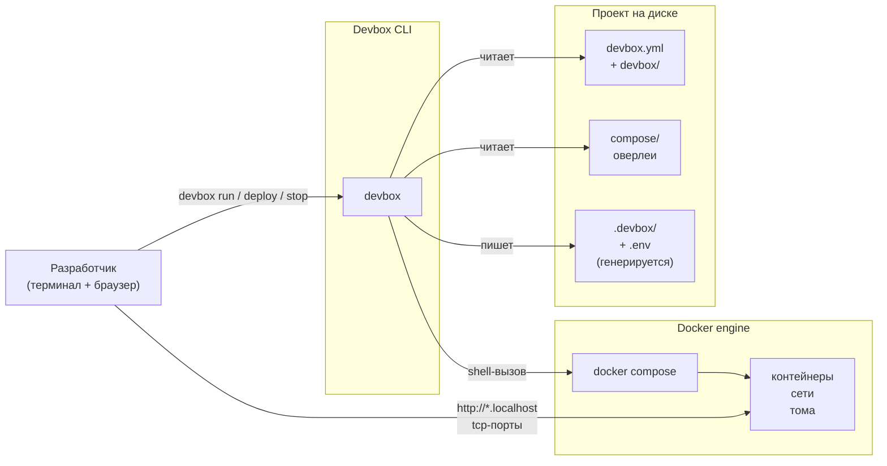
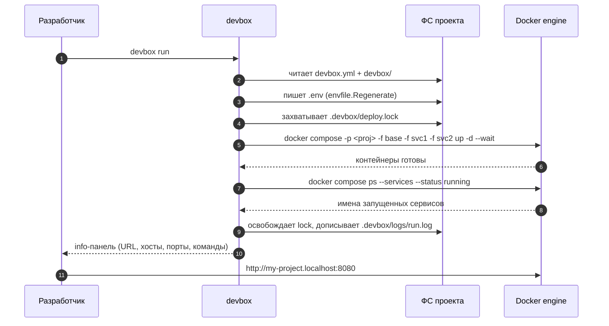

> Translated from: reference/concepts/architecture.md @ 759b88ac3161

# Архитектура

Высокоуровневый взгляд на то, как Devbox и Docker сложены вместе: Devbox — это CLI, который превращает YAML-дерево проекта в вызовы Docker Compose, журналирует результат локально и даёт разработчику способ говорить с контейнерами. Эта страница — про границу: что владеет Devbox, что владеет Docker и где одно заканчивается, а другое начинается.

## Содержание

- [Общая картина](#общая-картина)
- [Распределение ответственности](#распределение-ответственности)
- [От команды до контейнера](#от-команды-до-контейнера)
- [Где что живёт](#где-что-живёт)
- [Границы, которые Devbox не пересекает](#границы-которые-devbox-не-пересекает)
- [Что читать дальше](#что-читать-дальше)

## Общая картина

Devbox стоит между разработчиком и Docker-стеком. Он читает проект с диска, пишет рядом небольшое количество сгенерированного состояния и драйвит Docker Compose, который реально поднимает контейнеры. Разработчик никогда не печатает `docker compose` напрямую.

Сам CLI — это один статически слинкованный бинарник с встроенными документацией и пайплайнами. У Devbox нет демона, нет компаньонского процесса, нет загрузчика плагинов — каждый запуск короткоживущий и не имеет состояния, кроме того, что пишется под `.devbox/`.

## Распределение ответственности

Devbox и Docker владеют каждый своим чистым срезом системы. Именно это разделение делает Devbox заменимым вокруг существующего Compose-стека и позволяет стеку выжить без установленного Devbox.

| Область | Владеет Devbox | Владеет Docker / Compose |
|---------|----------------|--------------------------|
| Модель проекта | `devbox.yml` + дерево `devbox/`, включение/выключение сервисов | — |
| Список compose-файлов | Упорядоченный список `-f` (база + оверлеи), детерминированный порядок мержа | Семантика мержа |
| Имя проекта | Разрешается из `${project.prefix}-${project.name}` и передаётся как `-p` | Именование ресурсов (`<project>_<svc>_<n>`) |
| Команды жизненного цикла | Оркестрация `devbox run` / `deploy` / `stop` / `restart` / `reset` | Реальные `up` / `down` / `stop` / `rm` / `wait` |
| Env контейнеров | Рендерит `.env` перед `up`, `run`, `exec`, `restart`, `build` | Читает `.env` и `environment:` в контейнеры |
| Сети | Объявлены в compose-файлах | Создаются при `up`, удаляются при `down` |
| Тома | Конвенция именования (`<project>_<vol>`), политика shared/non-shared, sweep при reset | Реальная персистентность данных |
| Health / готовность | Опрашивает через `docker compose ps` и `docker inspect` | Сообщает состояние health |
| Хуки / скрипты | Рендерит Git-хуки, запускает пайплайны deploy/reset/lifecycle | — |
| Журнал состояния | `.devbox/deploy/state.yml`, решения о пропуске, блокировки | — |
| Логи | Зеркалит вывод пайплайнов в `.devbox/logs/` | Логи контейнеров (через `docker compose logs`) |
| Сборка / pull образов | Драйвит `docker compose build` / `pull` с policy-аргументами | Слои образа, I/O с реестром |

Между ними нет разделяемого мутируемого состояния: Devbox пишет YAML и `.env`, Docker пишет состояние контейнеров. Единственное рукопожатие — это argv, которое Devbox передаёт `docker compose`, и код возврата, который Docker возвращает.

## От команды до контейнера

Вызов `devbox run` — это канонический цикл: прочитать конфиг, отрендерить env, собрать argv, exec в compose, дождаться health, напечатать info. Всё остальное (`devbox deploy run`, `devbox stop`, `devbox reset run`) повторяет ту же форму с другими пайплайнами и другими compose-подкомандами.

Три свойства этого цикла критичны:

- **Детерминированный argv.** Список compose-файлов отсортирован (tools → infra → apps, по алфавиту внутри каждой группы). Имя проекта шаблонизируется один раз и переиспользуется. Два вызова `devbox run` на одинаковом конфиге дают побайтово идентичные команды `docker compose`.
- **Env свежий перед каждым релевантным вызовом.** Devbox перегенерирует `.env` непосредственно перед `up` / `run` / `exec` / `restart` / `build`. Переменные, видимые контейнеру, всегда синхронизированы с разрешённым конфигом.
- **Никакого долгоживущего процесса.** CLI завершается, как только Docker принял команду (или после того, как `--wait` отработал). Docker engine держит контейнеры живыми; Devbox их не нянчит.

Полный пайплайн деплоя разворачивает этот цикл в фазы — preflight, шаги деплоя по сервисам, создание томов, `up --wait`, info — но форма каждого листового вызова в Docker та же.

## Где что живёт

Полезная ментальная модель: есть три концентрических хранилища, у каждого свой владелец.

| Хранилище | Живёт в | Владелец | Переживает `devbox reset`? |
|-----------|---------|----------|----------------------------|
| Исходники проекта | `devbox.yml`, `devbox/`, `compose/`, ваш код | Вы / git | Да |
| Сгенерированные артефакты | `.env`, `.devbox/`, логи, журнал состояния | Devbox | `.devbox/` пересобирается; `.env` ре-рендерится при следующем run |
| Runtime-состояние | Контейнеры, именованные тома, сети, образы | Docker engine | Non-shared тома сметаются; shared тома выживают |

Два следствия, которые стоит знать:

- **Удаление Devbox не ломает ваш стек.** Файлы в `compose/` остаются валидным входом для `docker compose`. Можно поднять руками: `docker compose -f compose/base.yml -f ... up`. Ценность Devbox — в автоматизации, не в lock-in.
- **Клонирование проекта не требует состояния Docker.** `.devbox/` и `.env` генерируются. Свежий клон идёт от нуля до запущенного состояния через `devbox deploy run` — никаких снапшотов состояния engine копировать не надо.

## Границы, которые Devbox не пересекает

Несколько жёстких линий, которые держат архитектуру предсказуемой:

- **Devbox не заменяет `docker` или `docker compose`.** Любая операция с контейнерами — это shell-вызов. Никакого встроенного compose-движка.
- **Devbox не устанавливает Docker.** Ожидается, что на хосте есть `docker` и `docker compose` на пути. Devbox shell-вызывает их через конфигурируемые переопределения (`docker_bin`), но не бутстрапит engine.
- **Devbox не работает как демон.** Никакого фонового процесса, сокета, tray-приложения. Каждая команда начинается заново, читает конфиг, делает свою работу, выходит.
- **Devbox не делает сетевых вызовов на нормальном пути.** Никакого phone-home, проверки обновлений, скачивания шаблонов. Сетевой трафик возникает только из того, что пользователь сам положил в шаг пайплайна или пользовательскую команду (`curl` в шаге `type: shell`, `docker pull` из реестра, `git push` в хуке).
- **Devbox не управляет `/etc/hosts` или прокси.** Имена вроде `my-project.localhost` резолвятся через системный резолвер (`*.localhost` — это loopback по RFC) или через локальный DNS / reverse proxy, который запускает разработчик. Devbox рендерит имена в конфиг и в info-панель; маршрутизация — вне его scope.

Эта узкая поверхность — то, что делает Devbox полезным в CI, на изолированных машинах и рядом с существующими Compose-воркфлоу.

## Что читать дальше

- [Интеграция с Docker](docker.md) — глубокое погружение в сборку compose-файлов, именование проекта, проброс env, конвенции для томов и несколько случаев, когда Devbox обходит compose и вызывает `docker stop` / `docker rm` напрямую.
- [Раскладка проекта](project-layout.md) — для чего каждая папка под `devbox/` и что генерируется под `.devbox/`.
- [Пайплайны](pipelines.md) — модель выполнения phase / step / condition, которую разделяют deploy, reset и lifecycle.
- [Состояние и блокировки](state-and-locks.md) — что записывает `state.yml` и как `deploy.lock` / `snapshot.lock` сериализуют мутации.
- [Интеграция с Git](git.md) — что Devbox рендерит в `.git/hooks/` проекта и как собирается обзор workspace.
- Для контрибьюторов: [`docs/internals/architecture.md`](../../internals/architecture.md) — внутреннее разделение `cli/` ↔ `core/` ↔ `shared/` внутри бинарника, и [`docs/internals/packages.md`](../../internals/packages.md) для ответственностей пакетов.
