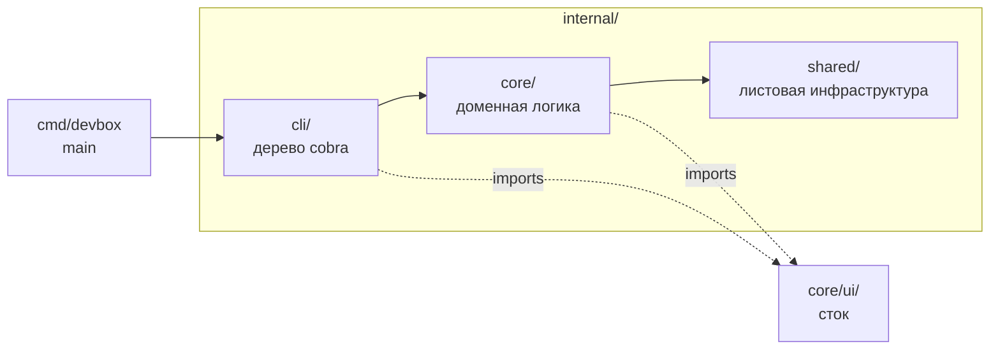

> Translated from: reference/concepts/architecture.md @ 9849e0789409

# Архитектура

Как устроен Devbox CLI: один Go-бинарник с трёхслойной внутренней структурой, встроенными документацией и переводами, и без сетевых вызовов на штатном пути.

## Содержание

- [Один бинарник, один композиционный корень](#один-бинарник-один-композиционный-корень)
- [Три внутренних слоя](#три-внутренних-слоя)
- [Дерево команд cobra](#дерево-команд-cobra)
- [Встроенная документация и переводы](#встроенная-документация-и-переводы)
- [Без сети на штатном пути](#без-сети-на-штатном-пути)
- [Что читать дальше](#что-читать-дальше)

## Один бинарник, один композиционный корень

Devbox поставляется как один статически слинкованный Go-бинарник `bin/devbox`. Нет загрузчика плагинов, нет демона-компаньона и нет внешнего runtime помимо хостового Docker.

Запуск процесса проходит через единый композиционный корень:

1. `cmd/devbox/main.go` — точка входа исполняемого файла.
2. Он определяет быстрый путь `devbox prompt` до запуска cobra и диспетчеризует в `internal/shared/prompt` для shell-промптов.
3. Для любого другого вызова он зовёт `cli.NewRootCmdWithFlags()`, который строит всё дерево команд cobra.
4. Передаёт дерево в `fang.Execute` с кастомным обработчиком ошибок, который подавляет вывод для `pipeline.ErrSilent`, уважает ошибки, несущие `ExitCode()`, и эмитит JSON-конверт в stderr, когда выставлен `--output json`.
5. На выходе обработчик переводит возвращённую ошибку в процессный exit-код через `cmdctx.ExitCodeFor`.

Композиционный корень в `internal/cli/root.go` регистрирует команды в пять групп (`core`, `environment`, `configuration`, `pipelines`, `advanced`) и протаскивает общий бандл `*cmdctx.RootFlags` в каждую подкоманду. Нет глобального состояния, нет `init()`-регистрации команд из соседних пакетов; каждая команда добавляется явно в `NewRootCmdWithFlags`.

## Три внутренних слоя

`internal/` организован в три слоя. Заявленные правила зависимостей сегодня обеспечиваются по соглашению; активация `depguard` ожидается. Полный инвентарь живёт в [`docs/internals/packages.md`](../../internals/packages.md).



| Слой | Путь | Роль | Правило зависимостей |
|-------|------|------|------|
| CLI | `internal/cli/` | Команды cobra, парсинг флагов, маршрутизация I/O. Без доменной логики. | Может импортировать `core/` и `shared/`. |
| Core | `internal/core/` | Доменная логика: модель проекта, пайплайны, workflow'ы, валидация, документация. | Может импортировать `shared/`. Не должен импортировать `cli/`. |
| Shared | `internal/shared/` | Листовая инфраструктура: Docker, Git, блокировки, шаблоны, i18n. | Не должен импортировать `cli/` или `core/`. |

`core/ui/` — особый сток: любой пакет в `core/`, которому надо рендерить в терминал, выставляет функцию, возвращающую строку, и только `cli/` импортирует `core/ui/`. То же правило не даёт коллекторам `stack/` и рендерерам `render/` держать writer'ы — CLI-слой является единственным писателем в stdout и stderr.

Внутри `core/` действует мягкий порядок: `project ← execution ← workflow`. Пакет, определяющий «что такое проект», живёт в `project/`; пакет, запускающий пайплайн, живёт в `execution/`; пакет, именующий пользовательскую операцию, живёт в `workflow/`.

## Дерево команд cobra

Дерево cobra имеет одну форму на подпакет команды. Каждый подпакет под `internal/cli/<name>/` экспортирует `NewCmd(groupID string, flags *cmdctx.RootFlags) *cobra.Command`, и корень зовёт её один раз. Существует три варианта:

- Стандартный: одна точка входа `NewCmd` (`info`, `status`, `logs`, `validate`, `render`, `service`, `snapshot`, `deploy`, `docker`, `compose`, `docs`, `command`, `shell`).
- Multi-export для группировки в Go-домене: `lifecycle/` выставляет `NewRunCmd` / `NewStopCmd` / `NewRestartCmd` / `NewResetCmd`, потому что четыре команды разделяют test-шов `preflightRun` и lock-паттерн, даже будучи независимыми top-level командами.
- Особый: `completion/` выставляет `AttachInstallUninstall(parent, flags)`, потому что его подкоманды цепляются к авто-генерируемой cobra-командой `completion`.

`PersistentPreRunE` корня делает пять вещей до запуска любого `RunE`:

1. Валидирует `--output` (`text` или `json`) и отвергает `--pretty` без JSON.
2. Выставляет `NO_COLOR=1`, `SilenceErrors` и `SilenceUsage` в JSON-режиме.
3. Находит проект. `validate` и его потомки используют `project.Locate` (без проверки схемы), чтобы ошибки схемы всплывали как диагностики; любая другая команда использует `project.Resolve` (с проверкой схемы). Небольшой allowlist (`version`, `prompt`, `completion …`, `docs …`) допущен к запуску без проекта.
4. Загружает `devbox/styles.yml` и применяет палитру к `core/ui/styles`.
5. Разрешает локаль через `i18n.ResolveLocale` и загружает i18n-стор.

Два сквозных паттерна текут через `cmdctx.RootFlags`:

- Режим JSON-вывода: read-only команды диспетчеризуются через `cmdctx.WriteData[T]` для text vs JSON. Ошибки текут через `cmdctx.Err` / `cmdctx.ErrWrap` и сериализуются в `{"error":{code,message,hint,details}}` на stderr. `validate` — исключение: он эмитит диагностики как данные даже при severity=error, exit-код передаёт severity.
- Локализация display-строк: любое место вызова, рендерящее описание user-команды, описание параметра, имя группы или заголовок doc-генератора, использует типизированные `store.*` хелперы (`store.CommandDescription`, `store.ParamDescription`, …) и протаскивает локаль через `rflags.I18n`. Места хранения и хэширования остаются английскими.

Скрытый путь cobra `__complete` обходит `PersistentPreRunE`. Каждый колбэк `ValidArgsFunction` сначала зовёт `cmdctx.CompletionConfigPath(flags, cmd)` и возвращает пустые completion'ы + `cobra.ShellCompDirectiveNoFileComp` при ошибке, чтобы устаревший или сломанный конфиг никогда не крашил путь shell-completion.

## Встроенная документация и переводы

Документация встроена в бинарник. Шаг сборки `scripts/sync-embedded-docs.sh` зеркалит `docs/{reference,internals,i18n}` в `internal/core/docs/embedded/`, и пакет использует `//go:embed embedded`, чтобы сделать её частью бинарника во время компиляции.

Раскладка во время выполнения проста:

```text
embedded/
├── reference/   # пользовательский справочник по схемам и командам
├── internals/   # внутренние документы для контрибьюторов
└── i18n/<lang>/ # зеркалированные переведённые деревья
```

Три свойства важны:

- `BuiltinFS` — это `fs.Sub(embedFS, "embedded")`, поэтому вызывающие видят `reference/`, `internals/` и `i18n/` в корне.
- Хэши контента для каждого файла впечены в `internal/core/docs/content_hashes_gen.go` через `scripts/gen-docs-content-hashes.sh` во время сборки. Хэш — это пофайловый якорь свежести.
- Каждый переведённый файл начинается с `> Translated from: <relPath> @ <hash>`. `internal/core/docs/lang.go` парсит заголовок, сравнивает хэш с `ContentHashFor(relPath)` и выводит предупреждение о устаревании при расхождении.

`devbox docs` читает только из `BuiltinFS` — никакого обхода файловой системы под корнем проекта, никакой удалённой загрузки. Подсистема только для чтения: без захвата блокировок, без preflight, и разрешение локали использует `i18n.ResolveLocale(flagLang, cfgLang, sysLang)` напрямую (cobra-зажатая `rflags.Locale` — это не тот неймспейс для markdown).

`devbox docs llms-txt` эмитит компактный индекс для AI-агента, который комбинирует встроенную документацию с проектными данными (сервисы, команды, info), собранными на CLI-слое. Сам генератор остаётся свободным от импорта конфигурации.

## Без сети на штатном пути

Devbox не «звонит домой», не запрашивает обновления и не тянет шаблоны по сети при обычном вызове. Каждое поведение, которым управляет CLI, локально:

- Обнаружение проекта идёт вверх от рабочей директории.
- Конфигурация — YAML на диске под `devbox.yml` и `devbox/`.
- Шаблоны, валидаторы и пайплайны вычисляются in-process.
- Документация и переводы встроены.
- Оркестрация контейнеров шеллит в локальные `docker` и `docker compose`.
- Взаимодействие с Git шеллит в локальный `git`.

Единственный сетевой трафик, который CLI инициирует — это то, что пользователь явно просит внутри шага пайплайна или пользовательской команды: например, `type: shell` шаг, зовущий `curl`, `type: builtin` шаг, пробующий `tcp_reachable`, или Git-хук, делающий push. Сам CLI не открывает сокеты на штатном пути.

Это делает Devbox безопасным для запуска на отключённых от сети машинах, простым для понимания в CI и предсказуемым в политиках с ограниченным исходящим трафиком.

## Что читать дальше

- [Раскладка проекта](project-layout.md) — для чего каждая папка под `devbox/`, и что генерируется под `.devbox/`.
- [Пайплайны](pipelines.md) — модель выполнения phase / step / condition, разделяемая deploy, reset и lifecycle.
- [Интеграция с Docker](docker.md) — как собирается список compose-файлов и когда lifecycle-команды обходят compose.
- [Интеграция с Git](git.md) — где рендерятся хуки и как собирается отображение рабочего пространства.
- [Состояние и блокировки](state-and-locks.md) — что записывает `state.yml` и как `deploy.lock` / `snapshot.lock` сериализуют мутации.
- [`docs/internals/packages.md`](../../internals/packages.md) — ответственности отдельных пакетов, инварианты и межпакетные контракты для контрибьюторов.
