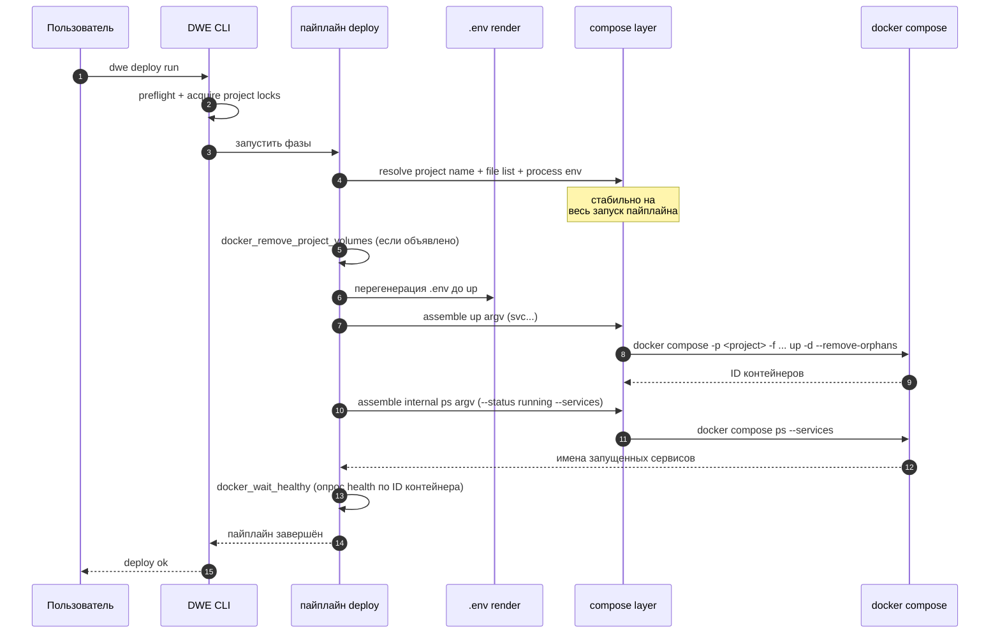

> Translated from: reference/concepts/docker.md @ bd45f3552625

# Интеграция с Docker

Как DWE управляет Docker Compose: имя compose-проекта, список собираемых файлов, окружение, пробрасываемое в каждый дочерний процесс, тома, за которые он отвечает, и редкие места, где он обходит compose и вызывает `docker stop` / `docker rm` напрямую.

## Содержание

- [Две точки входа: `dwe docker` vs `dwe compose`](#две-точки-входа-dwe-docker-vs-dwe-compose)
- [Имя проекта](#имя-проекта)
- [Список compose-файлов](#список-compose-файлов)
- [Окружение процесса](#окружение-процесса)
- [Тома](#тома)
- [Обход compose на пути сервисов](#обход-compose-на-пути-сервисов)
- [`dwe deploy` от начала до конца](#dwe-deploy-от-начала-до-конца)
- [Что читать дальше](#что-читать-дальше)

## Две точки входа: `dwe docker` vs `dwe compose`

DWE никогда не предлагает пользователю вводить `docker compose` напрямую. Каждый lifecycle-вызов проходит через одну из двух поверхностей CLI:

| Поверхность | Назначение | Применяются policy-аргументы? |
|---------|---------|----------------------|
| `dwe docker <sub>` | Публичный lifecycle-API, используемый Makefile, deploy-шагами и пользовательскими командами. | Да (`global` + дефолты per-subcommand). |
| `dwe compose raw <args...>` | Низкоуровневая диагностическая прокидка. | Нет. |
| `dwe compose files` / `compose argv` | Просмотр активного списка файлов или полного итогового argv. | n/a (только чтение). |

Обе поверхности разрешаются через один и тот же сборщик argv и порождают два варианта compose-вызова:

- **Публичные lifecycle-вызовы** собирают `compose -p <project> -f <file>… <globalArgs> <command> <commandDefaultArgs> <extraArgs>`. Это то, что используют `dwe docker` и pipeline-билтины `docker.*`.
- **Внутренние probe-вызовы** (health-проверки, запросы «работает ли контейнер») строят тот же скелет, но пропускают и `globalArgs`, и per-command дефолты, так что пользовательское переопределение вроде `args.ps: ["--services"]` не может их сломать.

## Имя проекта

Имя compose-проекта — это значение `-p <name>`, передаваемое в каждый вызов `docker compose`. Это также префикс, который Docker Compose использует для собственных конвенций именования ресурсов: контейнеры (`<project>-<service>-<n>`), сети (`<project>_default`) и именованные тома (`<project>_<vol>`).

DWE разрешает имя из `workspace/docker.yml`:

```yaml
# workspace/docker.yml
project_name: "${project.prefix}-${project.name}"
```

Плейсхолдеры `${dot.path}` разрешаются по объединённой конфигурации проекта (каскад `workspace.yml` → `defaults.yml` → `local.yml`). То же имя возвращается в:

- Каждый вызов compose (`compose -p <name>`).
- Резолвер имени не-shared тома (`<project>_<volume>` — см. [Тома](#тома)).
- Резолвер имени контейнера сервиса, используемый per-service stop и reset (см. [Обход compose](#обход-compose-на-пути-сервисов)).
- Билтин удаления томов в обход compose, который использует имя проекта как префикс-фильтр при сборе томов.

Типичное разрешённое имя выглядит как `myorg-shop` или `dwe-laravel`. Точная форма — часть публичной поверхности: переименование проекта требует обновления `local.yml`, чтобы префикс совпадал, иначе следующий вызов `docker compose` обратится к другому проекту, а старые контейнеры и тома осиротеют.

## Список compose-файлов

DWE не пишет один `compose.yaml`, импортирующий всё. Он передаёт *список* флагов `-f`, по порядку, и предоставляет Docker Compose их смержить. Список собирается детерминированно:

1. Базовый файл из `compose.base` в `workspace.yml` (всегда включается).
2. Включённые оверлеи **tool**, отсортированные по ключу сервиса.
3. Включённые оверлеи **infra**, отсортированные по ключу сервиса.
4. Включённые оверлеи **app**, отсортированные по ключу сервиса.

Порядок типов сервисов важен: сначала tools, потом infra, потом apps. Внутри группы — алфавитная сортировка по ключу сервиса (имени директории в `workspace/services/<name>/`). Явная сортировка делает список файлов детерминированным, так что `docker compose` всегда видит оверлеи в одном и том же порядке merge.

`dwe docker pull --all` и `dwe docker build --all` работают с тем же упорядоченным списком, но игнорируют флаг `enabled`, чтобы разработчик мог тянуть или собирать образы для оверлеев, отключённых локально, — без правки `workspace/local.yml`.

Каждая запись в списке указывает на файл внутри дерева проекта, обычно под `compose/`:

```text
compose/base.yml                  # compose.base
compose/tools/redis-insight.yml   # tool оверлей
compose/services/api.yml          # app оверлей
```

Переопределения списка compose-файлов на уровне `docker.local.yml` нет. Локальные оверрайды лежат в:

- `workspace/local.yml` — `enabled: true|false` на сервис, порты, хосты, пользовательские env. Влияет на содержимое списка через набор enabled.
- `workspace/docker.local.yml` — переопределения политики (имя проекта, args, process env, топология). **Не** добавляет и не удаляет `-f` файлы.

Чтобы посмотреть итоговый список, запустите `dwe compose files`.

## Окружение процесса

Каждый дочерний процесс `docker compose` наследует окружение родительского процесса плюс оверлей, определённый в `workspace/docker.yml`:

```yaml
process_env:
  DOCKER_CLI_HINTS: "false"
```

`Compose.BuildEnv()` возвращает `os.Environ()` с наложенными ключами — существующие значения заменяются, новые ключи добавляются, и результат стабильно отсортирован для детерминированного вывода тестов. Если `process_env` пуст, `BuildEnv()` возвращает `nil`, и потомок наследует родительское окружение без изменений (типичный случай).

`process_env` влияет на **процесс compose CLI**, а не на запущенные контейнеры. Env, видимый контейнеру, приходит из `.env` (и блоков `environment:` в compose-файле). DWE автоматически перегенерирует `.env` из актуальной конфигурации перед пятью подкомандами — `up`, `run`, `exec`, `restart`, `build`. Этот шаг намеренно не конфигурируется. Другие подкоманды (`down`, `stop`, `ps`, `logs`, `pull`) пропускают его, потому что им не нужен свежий `.env`.

## Тома

Docker Compose создаёт именованные тома лениво: первый `docker compose up`, ссылающийся на том, создаёт его. DWE добавляет сверху два слоя:

- **Привязка к проекту.** Тома, объявленные в `resources.volumes` в `workspace/docker.yml`, получают префикс `<project_name>_`, соответствующий собственной конвенции имён Compose для `volumes:`, объявленных внутри `compose.yaml`. Том с `name: build_artifacts` и `shared: false` становится фактическим Docker-томом `myorg-shop_build_artifacts` (префикс применяется к полю `name:`, а не к ключу map).
- **Shared-режим.** `shared: true` отказывается от префикса. Том создаётся с именем как есть, переживает запуски `dwe reset` на этом проекте — и переиспользуется любым другим проектом DWE, объявляющим то же shared-имя. Канонический пример — кэш тулчейна языка (composer, npm, go-build), разделяемый между проектами.

`ensure_before: [up, deploy]` запускает идемпотентное создание в этих точках входа. Не-shared тома, привязанные к проекту, — это также то, что собирает `docker_remove_project_volumes` во время reset: билтин перечисляет каждый Docker-том, имя которого начинается с `<project_name>_`, и удаляет его. Shared-тома под префикс не подпадают и выживают.

## Обход compose на пути сервисов

Для full-stack lifecycle (`dwe run`, `dwe stop`, `dwe restart` без аргумента-сервиса) DWE вызывает `docker compose up` / `down` / `stop`. Список compose-файлов и policy-аргументы применяются, как описано выше.

Два сценария намеренно обходят compose:

- **`dwe stop <service>`.** Когда пользователь называет конкретный сервис, DWE разрешает имя контейнера через `daemon.ResolveContainerName(projectFull, svc.Container)` и вызывает `docker stop <name>` напрямую. Это работает даже после того, как сервис отключён в `local.yml` — в этот момент оверлей сервиса уже не в списке `-f`, и `docker compose stop <name>` контейнер вообще не увидит. Поведение с точки зрения пользователя: «я всегда могу остановить этот сервис по имени».
- **`dwe reset run --service <name>`.** Per-service reset предваряет пайплайн сервиса синтетическим builtin-шагом `docker_stop_remove_container`. Билтин останавливает и удаляет именованный контейнер двумя вызовами `docker`, опять же в обход compose. Тело пайплайна reset затем выполняется как объявлено; очистка томов происходит только при явном согласии пользователя через `docker_remove_project_volumes`.

Для всего остального — `dwe docker up`, `down`, `logs`, `ps`, `exec`, `run`, `pull`, `build`, плюс `dwe stop` без аргумента-сервиса — DWE общается с `docker compose`.

## `dwe deploy` от начала до конца

Вызов `dwe deploy run` проходит пайплайн деплоя (preflight → фазы оркестратора → оверлеи сервисов → infra `after:` → финальные хуки). В нескольких точках пайплайн обращается к Docker-слою, описанному выше:



Три свойства, которые стоит заметить:

- Compose-слой разрешается один раз за запуск пайплайна из объединённой конфигурации и переиспользуется для каждого вызова. Имя проекта, список файлов, args и process env стабильны на протяжении всего деплоя.
- Lifecycle-команды и внутренние probe-вызовы используют одно и то же имя проекта и список файлов, но собирают argv по-разному. Пользовательское переопределение вроде `args.ps: ["--services"]` не может сломать пробу running-services, потому что проба пропускает policy-аргументы, заданные пользователем.
- Перегенерация `.env` происходит **до** вызова compose, никогда параллельно с ним. Вызов compose всегда видит актуальный `.env`.

## Что читать дальше

- [Справочник по полям `docker.yml`](../config/docker.md) — каждое поле `workspace/docker.yml` и `workspace/docker.local.yml`.
- [Render env](../render/env.md) — что попадает в `.env` и как разрешается `${...}`.
- [Deploy](../config/deploy/index.md) — пайплайн, оборачивающий эти compose-вызовы.
- [Состояние и блокировки](state-and-locks.md) — почему `deploy.lock` и `snapshot.lock` сериализуют пайплайн выше.
- [Раскладка проекта](project-layout.md) — где оверлеи `compose/` лежат на диске.
