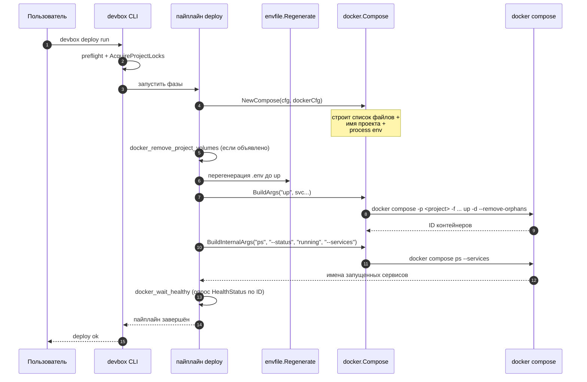

> Translated from: reference/concepts/docker.md @ 93d8a00617e2

# Интеграция с Docker

Как Devbox управляет Docker Compose: имя compose-проекта, список собираемых файлов, окружение, пробрасываемое в каждый дочерний процесс, тома, которыми он владеет, и немногие места, где он обходит compose и вызывает `docker stop` / `docker rm` напрямую.

## Содержание

- [Две точки входа: `devbox docker` против `devbox compose`](#две-точки-входа-devbox-docker-против-devbox-compose)
- [Имя проекта](#имя-проекта)
- [Список compose-файлов](#список-compose-файлов)
- [Окружение процесса](#окружение-процесса)
- [Тома](#тома)
- [Обход compose на пути сервисов](#обход-compose-на-пути-сервисов)
- [`devbox deploy` от начала до конца](#devbox-deploy-от-начала-до-конца)
- [Что читать дальше](#что-читать-дальше)

## Две точки входа: `devbox docker` против `devbox compose`

Devbox никогда не просит пользователя вводить `docker compose` напрямую. Каждый lifecycle-вызов проходит через одну из двух поверхностей CLI:

| Поверхность | Назначение | Применяются policy-аргументы? |
|---------|---------|----------------------|
| `devbox docker <sub>` | Публичный lifecycle-API, используемый Makefile, deploy-шагами и user-командами. | Да (`global` + дефолты per-subcommand). |
| `devbox compose raw <args...>` | Низкоуровневая диагностическая прокидка. | Нет. |
| `devbox compose files` / `compose argv` | Просмотр активного списка файлов или полного эффективного argv. | n/a (только чтение). |

Обе поверхности разрешаются через одну и ту же структуру `docker.Compose` в `internal/shared/docker/`. Структура выставляет два строителя argv:

- `BuildArgs(command, extraArgs…)` собирает `compose -p <project> -f <file>… <globalArgs> <command> <commandDefaultArgs> <extraArgs>`. Это то, что использует `devbox docker`.
- `BuildInternalArgs(command, extraArgs…)` строит тот же скелет, но пропускает и `globalArgs`, и per-command дефолты, так что внутренние пробы (health-проверки, запросы «работает ли контейнер») не могут быть сломаны пользовательским переопределением вроде `args.ps: ["--services"]`.

## Имя проекта

Имя compose-проекта — это значение `-p <name>`, передаваемое в каждый вызов `docker compose`. Это также префикс, который Docker Compose использует для собственных конвенций именования ресурсов: контейнеры (`<project>_<service>_<n>`), сети (`<project>_default`) и именованные тома (`<project>_<vol>`).

Devbox разрешает имя из `devbox/docker.yml`:

```yaml
# devbox/docker.yml
project_name: "${project.prefix}-${project.name}"
```

Плейсхолдеры `${dot.path}` разрешаются против смерженного `DevboxConfig` (каскад `devbox.yml` → `defaults.yml` → `local.yml`) через `resolveVarTemplate`. То же имя возвращается в:

- Каждый вызов compose (`compose -p <name>`).
- Резолвер имени не-shared тома (`<project>_<volume>` — см. [Тома](#тома)).
- Резолвер имени контейнера сервиса в `internal/shared/daemon/`, используемый per-service stop и reset (см. [Обход compose](#обход-compose-на-пути-сервисов)).
- Билтин удаления томов в обход compose, который использует имя проекта как фильтр-префикс при подметании томов.

Типичное разрешённое имя выглядит как `myorg-shop` или `devbox-laravel`. Точная форма — часть публичной поверхности — переименование проекта требует обновления `local.yml`, чтобы префикс совпадал, иначе следующий вызов `docker compose` обратится к другому проекту, а старые контейнеры и тома осиротеют.

## Список compose-файлов

Devbox не пишет один `compose.yaml`, который импортирует всё. Он передаёт *список* флагов `-f`, по порядку, и позволяет Docker Compose их смержить. Список строится через `DevboxConfig.ComposeFiles()`:

1. Базовый файл из `compose.base` в `devbox.yml` (всегда включается).
2. Включённые оверлеи **tool**, отсортированные по ключу сервиса.
3. Включённые оверлеи **infra**, отсортированные по ключу сервиса.
4. Включённые оверлеи **app**, отсортированные по ключу сервиса.

Порядок типов сервисов важен: сначала tools, потом infra, потом apps. Внутри группы сортировка алфавитная по ключу сервиса (имя директории под `devbox/services/<name>/`). Итерация по map в Go рандомизирована; явная сортировка делает список файлов детерминированным, чтобы золотые тесты оставались зелёными, и чтобы `docker compose` всегда видел оверлеи в одном и том же порядке merge.

Второй вариант, `ComposeFilesAll()`, возвращает тот же упорядоченный список, но игнорирует флаг `enabled`. Это то, что использует `devbox docker pull --all` и `devbox docker build --all`, чтобы оперировать оверлеями, которые разработчик отключил локально — без модификации `devbox/local.yml`.

Каждая запись в списке указывает на файл внутри дерева проекта, обычно под `compose/`:

```text
compose/base.yml                  # compose.base
compose/tools/redis-insight.yml   # tool оверлей
compose/services/api.yml          # app оверлей
```

Нет переопределения списка compose-файлов на уровне `docker.local.yml`. Локальные оверрайды живут в:

- `devbox/local.yml` — per-service `enabled: true|false`, порты, хосты, кастомные env. Влияет на содержимое списка через набор enabled.
- `devbox/docker.local.yml` — переопределения политики (имя проекта, args, process env, топология). **Не** добавляет и не удаляет `-f` файлы.

Чтобы посмотреть эффективный список, запустите `devbox compose files`.

## Окружение процесса

Каждый дочерний процесс `docker compose` наследует окружение родительского процесса плюс оверлей, определённый в `devbox/docker.yml`:

```yaml
process_env:
  DOCKER_CLI_HINTS: "false"
```

`Compose.BuildEnv()` возвращает `os.Environ()` с наложенными ключами — существующие значения заменяются, новые ключи добавляются, и результат стабильно отсортирован для детерминированного вывода тестов. Когда `process_env` пуст, `BuildEnv()` возвращает `nil`, и потомок наследует родительское окружение без изменений (распространённый путь).

`process_env` влияет на **процесс compose CLI**, а не на запущенные контейнеры. Видимый контейнеру env приходит из `.env` (и блоков `environment:` в compose-файле). Devbox автоматически перегенерирует `.env` перед пятью подкомандами — `up`, `run`, `exec`, `restart`, `build` — вызывая `envfile.Regenerate` на активной конфигурации. Этот шаг специально не конфигурируется. Другие подкоманды (`down`, `stop`, `ps`, `logs`, `pull`) пропускают его, потому что им не нужен актуальный `.env`.

## Тома

Docker Compose создаёт именованные тома лениво: первый `docker compose up`, ссылающийся на том, создаёт его. Devbox добавляет два слоя сверху:

- **Скоупинг по проекту.** Тома, объявленные под `resources.volumes` в `devbox/docker.yml`, получают префикс `<project_name>_`, соответствующий собственной конвенции имён Compose для `volumes:`, объявленных внутри `compose.yaml`. Том с ключом `build_artifacts` и `shared: false` становится фактическим Docker-томом `myorg-shop_build_artifacts`.
- **Shared-режим.** `shared: true` отказывается от префикса. Том создаётся с буквальным именем и переживает запуски `devbox reset` на этом проекте — и переиспользуется любым другим проектом Devbox, объявляющим то же shared-имя. Каноничный кейс — кэш тулчейна языка (composer, npm, go-build), разделяемый между проектами.

`ensure_before: [up, deploy]` запускает идемпотентное создание на этих точках входа. Не-shared, скоупенные по проекту тома — это также то, что подметает `docker_remove_project_volumes` во время reset: билтин перечисляет каждый Docker-том, чьё имя начинается с `<project_name>_`, и удаляет его. Shared-тома не подходят под префикс и выживают.

## Обход compose на пути сервисов

Для full-stack lifecycle (`devbox run`, `devbox stop`, `devbox restart` без аргумента-сервиса) Devbox вызывает `docker compose up` / `down` / `stop`. Список compose-файлов и policy-аргументы применяются, как описано выше.

Два потока намеренно обходят compose:

- **`devbox stop <service>`.** Когда пользователь именует один сервис, Devbox разрешает имя контейнера через `daemon.ResolveContainerName(projectFull, svc.Container)` и зовёт `docker stop <name>` напрямую. Это работает даже после того, как сервис отключён в `local.yml` — в этой точке оверлей сервиса больше не в списке `-f`, и `docker compose stop <name>` вообще не увидит контейнер. Видимое пользователю поведение: «я всегда могу остановить этот сервис по имени».
- **`devbox reset run --service <name>`.** Per-service reset предваряет пайплайн сервиса синтетическим builtin-шагом `docker_stop_remove_container`. Билтин останавливает и удаляет именованный контейнер двумя вызовами `docker`, опять же вне compose. Тело пайплайна reset затем выполняется как объявлено; очистка томов происходит только при явном согласии пользователя через `docker_remove_project_volumes`.

Для всего остального — `devbox docker up`, `down`, `logs`, `ps`, `exec`, `run`, `pull`, `build`, плюс `devbox stop` без аргумента-сервиса — Devbox говорит с `docker compose`.

## `devbox deploy` от начала до конца

Вызов `devbox deploy run` проходит пайплайн деплоя (preflight → фазы оркестратора → оверлеи сервисов → infra `after:` → финальные хуки). В нескольких точках пайплайн зовёт Docker-слой, описанный выше:



Три свойства, которые стоит заметить:

- Структура `Compose` строится один раз за запуск пайплайна из разрешённых конфигов и переиспользуется для каждого вызова. Имя проекта, список файлов, args и process env стабильны на протяжении всего деплоя.
- Lifecycle-команды и внутренние пробы делят одно и то же имя проекта и список файлов, но используют разные строители argv. Пользовательский оверрайд вроде `args.ps: ["--services"]` не может сломать пробу running-services, потому что проба идёт через `BuildInternalArgs`.
- Перегенерация `.env` происходит **до** вызова compose, никогда параллельно с ним. Вызов compose всегда видит актуальный `.env`.

## Что читать дальше

- [Справочник по полям `docker.yml`](../config/docker.md) — каждое поле `devbox/docker.yml` и `devbox/docker.local.yml`.
- [Render env](../render/env.md) — что попадает в `.env` и как разрешается `${...}`.
- [Deploy](../config/deploy/index.md) — пайплайн, оборачивающий эти compose-вызовы.
- [Состояние и блокировки](state-and-locks.md) — почему `deploy.lock` и `snapshot.lock` сериализуют пайплайн выше.
- [Раскладка проекта](project-layout.md) — где живут оверлеи `compose/` на диске.
