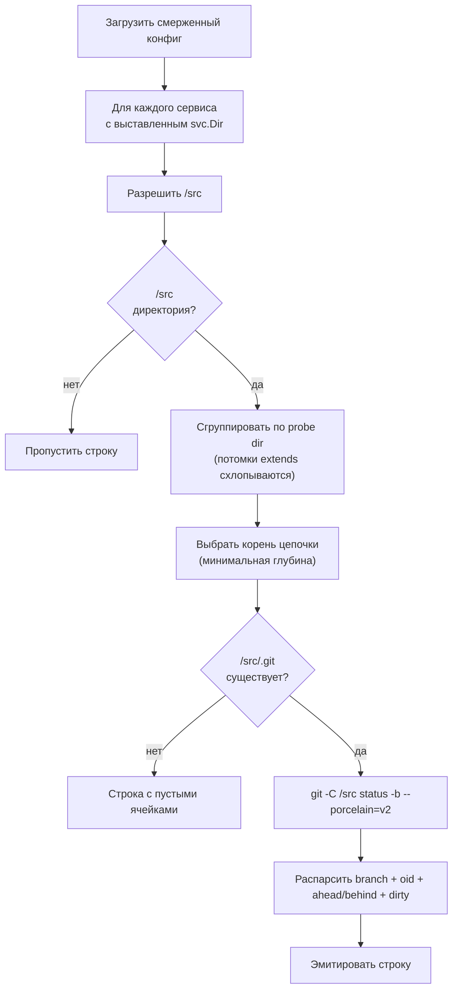

> Translated from: reference/concepts/git.md @ bd5e782e6911

# Интеграция с Git

Как DWE взаимодействует с Git: пайплайн рендеринга хуков по сервисам, проба рабочего пространства за `dwe status git`, опциональная проба обновления при `dwe run` и конвенции `.gitignore` для runtime-управляемых путей.

## Содержание

- [У двух сервисов есть рабочее дерево](#у-двух-сервисов-есть-рабочее-дерево)
- [Рендеринг хуков](#рендеринг-хуков)
- [Проба рабочего пространства (`dwe status git`)](#проба-рабочего-пространства-dwe-status-git)
- [Проба обновления (`dwe run`)](#проба-обновления-dwe-run)
- [Конвенции `.gitignore`](#конвенции-gitignore)
- [Никакого checkout, fetch или push](#никакого-checkout-fetch-или-push)
- [Что читать дальше](#что-читать-дальше)

## У двух сервисов есть рабочее дерево

У проекта DWE есть *собственный* Git-репозиторий в корне проекта — тот, что отслеживает `workspace.yml`, дерево конфигурации `workspace/` и оверлеи `compose/`. У большинства проектов также есть один или несколько прикладных сервисов, исходный код которых лежит в `<svc.Dir>/src/`. По конвенции у каждого такого сервиса — отдельная выгрузка Git в `<svc.Dir>/src/.git/`.

DWE обращается с этими двумя слоями одинаково: он никогда не предполагает, что в корне проекта обязательно конкретная VCS, и никогда не лезет в репозиторий одного сервиса, чтобы узнать о другом. Каждая Git-операция нацелена либо на корень проекта (проба обновления), либо ровно на один `<svc.Dir>/src/` (рендеринг хуков, проба рабочего пространства). Общей поверхности «забрать всё разом» нет.

CLI вызывает хостовый бинарник `git` через shell. Путь к бинарнику разрешается через стандартный аксессор (`config.GitBin(cfg)`), так что проект при необходимости может закрепить конкретную версию через `binaries.git` в `workspace.yml`. Пустое значение означает «искать `git` в `$PATH`».

## Рендеринг хуков

`dwe render git` рендерит shell-хуки в директорию `<svc.Dir>/src/.git/hooks/` каждого включённого сервиса из template-пака под `workspace/templates/git/`.

Механизм такой же, как у `render ide` и `render ai` — та же модель выбора, та же цепочка разрешения пака, те же защитные проверки path-safety, та же схема манифеста. Рендеринг Git-хуков отличается тремя моментами:

- **Назначение находится внутри `.git/`**, которое Git никогда не отслеживает. Отрендеренные файлы не коммитятся; повторный рендеринг — источник истины. Ручное редактирование `src/.git/hooks/pre-commit` с расчётом, что изменения переживут, — концептуальная ошибка.
- **`to` в манифесте ограничен basename'ами**, потому что Git не заходит в поддиректории `hooks/`. Строка манифеста вида `to: subdir/pre-commit` отклоняется на загрузке.
- **Дефолт активации совпадает с `render ide`**: только сервисы `type: app` рендерят хуки по умолчанию. Tool и infra сервисы явно соглашаются через `services.<name>.render.git.enabled: true`.

Сквозной поток для одного сервиса:

1. **Гейт активации.** И `services.<name>.enabled`, и `services.<name>.render.git.enabled` должны быть true (политический дефолт зависит от типа сервиса).
2. **Преflight хаба.** `<svc.Dir>` должен разрешаться внутрь корня проекта и не достигаться через симлинк.
3. **Проба директории git.** `<svc.Dir>/src/.git` должен быть директорией. Обычный файл (указатель `gitdir:` от `git worktree` или субмодуль) приводит к пропуску сервиса с предупреждением — см. [Worktrees and submodules](../render/git.md#worktrees-and-submodules) в справочнике команд. Отсутствующий `.git/` тоже пропускается с предупреждением.
4. **Разрешение коллизий.** Когда два сервиса делят один `<svc.Dir>` (обычно базовый `main` и `extends:`-потомок `main-debug`), побеждает самый глубокий extender.
5. **Разрешение пака.** `render.git.template` фиксирует пак; иначе цепочка пробует `workspace/templates/git/<service-name>/`, затем `workspace/templates/git/default/`.
6. **Рендер по каждому файлу.** Каждая запись в `manifest.yml` пака читается, вычисляется как [строгий Go text template](../templates.md), пишется в `<svc.Dir>/src/.git/hooks/<basename>` и получает `chmod 0755` на каждом запуске.

Полный справочник по полям и проработанные примеры — в [`dwe render git`](../render/git.md). Справочник блока активации (`services.<name>.render.git`) — в [`config/services/fields.md`](../config/services/fields.md#rendergit-block).

### Наследование шаблонов хуков

Пак — это просто директория. Композиция происходит через два механизма:

- **Оверлей `<pack>.local/`.** Для любого пака в `workspace/templates/git/<pack>/` соседняя директория `workspace/templates/git/<pack>.local/` может перекрывать отдельные файлы по относительному пути. Резолвер packroot пробует сначала `<pack>.local/<rel>` и затем переходит к `<pack>/<rel>`. Это точка кастомизации на разработчика — `.local/` обычно gitignored.
- **`extends:` сервиса.** Когда `service-b` расширяет `service-a`, и у `service-b` нет своего `render.git.template`, он наследует значение родителя. Правило коллизии deepest-extends затем определяет, какой сервис побеждает для общего `<svc.Dir>`. Шаблонная переменная `.Resolved` именует рендерящий сервис (самый глубокий extender — его оверлей решает container/dir), а `.Service` именует канонический корень конфигурации (используйте его, чтобы получить сырую конфигурацию по имени сервиса).

Сам пак не поддерживает директиву наследования «из другого пака». Если два пака разделяют содержимое, выносите общие части в тело шаблона через `{{ template "name" . }}` или дублируйте их. DWE не вводит языка композиции паков; модель файлового оверлея — единственная точка кастомизации.

## Проба рабочего пространства (`dwe status git`)

`dwe status` и `dwe status git` рендерят по одной строке на каждый сервис, у которого есть рабочее дерево в `<svc.Dir>/src/`. Проба только читает данные, выполняется параллельно и никогда не изменяет репозиторий.



Граничные случаи:

- **Нет собственного `.git/` → пустые ячейки, не ошибка.** Сервис, у которого `<svc.Dir>/src/` существует, но нет своего `.git/`, получает строку с пустыми branch/SHA/ahead-behind. Проба намеренно завершает работу до любого вызова shell — иначе `git -C` поднялся бы вверх к ближайшему охватывающему репозиторию (часто корню проекта), и сообщать его как статус сервиса было бы неверно.
- **Отсутствующий `src/` → строки нет вовсе.** Сервисы без рабочего дерева полностью опускаются из вывода. Отдельного флага «отказаться от секции workspace» помимо отсутствия директории `src/` нет.
- **Потомки extends дедуплицируются.** Когда два сервиса разделяют один `<svc.Dir>` через `extends:`, они пробуют одно и то же дерево. Коллектор группирует кандидатов по probe-директории и оставляет корень цепочки extends (минимальная глубина, ничьи разрешаются алфавитно). Sidecar-варианты вроде `main-debug` не дают дублирующих строк.
- **Параллельные shell-вызовы с ограничением.** Пробы запускаются внутри `errgroup`, ограниченного 8 одновременными вызовами. Каждая горутина пишет в заранее выделенный слот строки, так что падения на строку изолированы и никогда не отменяют соседей.
- **Отображаемый путь.** Пробуемая директория, показанная в таблице статуса, указывается относительно корня проекта с префиксом `…/` (`…/services/main/src`). Сама проба использует абсолютные пути.

Проба никогда не делает fetch. Branch / OID / ahead-behind / dirty приходят из одного вызова `git status -b --porcelain=v2`. Актуальность относительно удалённого репозитория требует отдельной пробы обновления, описанной ниже.

## Проба обновления (`dwe run`)

Пайплайн `run:` в `workspace/lifecycle.yml` может объявить блок `update:`. Если он присутствует, `dwe run` проверяет репозиторий корня проекта до выполнения любой фазы:

```yaml
# workspace/lifecycle.yml
run:
  update:
    mode: on   # on | off
```

Два режима:

| Режим | Fetch | Pull |
|------|---------|-------|
| `on` | да | по согласию (TTY-промпт; не-TTY понижается до check-семантики) |
| `off` | нет | нет — проба отключена |

Проба запускается на корне проекта, никогда не на `src/` сервиса. Она вызывает `git fetch --quiet <remote>` (таймаут 15 с), затем `git rev-list --left-right --count`, чтобы получить `behind` / `ahead`. Грязное дерево, отсутствующий upstream или сбой fetch выдают предупреждение и продолжают — пайплайн run никогда не блокируется.

Когда режим `on`, рабочее дерево чистое, behind > 0, ahead = 0 и сессия интерактивна, DWE запрашивает подтверждение перед запуском `git pull --ff-only` (таймаут 2 мин). Успешный pull перезагружает `DweConfig`, `LifecycleConfig` и реестр команд in-process до выполнения фаз, так что остаток `dwe run` видит состояние после обновления.

Приоритет в runtime: флаг `--no-update` > флаг `--update <mode>` > YAML `update.mode`. Справочник по полю: [`config/lifecycle.md`](../config/lifecycle.md#runupdate).

## Конвенции `.gitignore`

Типичный `.gitignore` проекта исключает четыре дерева, управляемых DWE:

```text
# DWE runtime artifacts
/.dwe/

# Service sources (root-anchored — keeps workspace/services/ tracked)
/services/

# Unpacked snapshot stash
/snapshots/

# Database and other dumps
/backups/
```

Обоснование, по папкам:

- **`.dwe/`** содержит журнал деплоя (`state.yml`), блокировки проекта (`deploy.lock`, `snapshot.lock`), логи команд (`logs/`) и переопределения user-config на уровне проекта. Всё это перегенерируется из дерева конфигурации и запущенных контейнеров. Отслеживание этой папки только связало бы историю коммитов с локальными таймингами.
- **`/services/`** содержит чекауты исходников сервисов-приложений (`<hub>/src/` и рабочие папки). Каждый `src/` — это отдельный репозиторий, выкачиваемый на каждой машине; репозиторий проекта не должен отслеживать содержимое другого репозитория. Ведущий слеш привязывает паттерн к корню проекта, так что отслеживаемое дерево `workspace/services/` не затрагивается.
- **`snapshots/`** содержит распакованную рабочую копию активного снапшота. Сами snapshot-архивы лежат там, куда их кладёт snapshot-workflow — обычно отдельный путь или общий том. Runtime-стэш отслеживать не нужно.
- **`backups/`** содержит дампы БД и прочее, создаваемые во время разработки. Это сгенерированные артефакты, различающиеся от машины к машине, поэтому отслеживание связало бы репозиторий с локальными данными.

Две связанные конвенции находятся в других местах:

- **`<svc.Dir>/src/` для каждого сервиса** — это обычный вложенный репозиторий (или worktree). Его `.gitignore` — забота приложения, а не DWE.
- **Директории `workspace/templates/<kind>.local/`** по конвенции gitignored. Резолвер packroot ищет их первыми и переходит к каноническому паку — это точка переопределений на разработчика для шаблонов IDE, AI и Git.

## Никакого checkout, fetch или push

DWE не выполняет Git-операций, о которых пользователь не просил:

- Он никогда не запускает `git checkout`, `git switch`, `git reset --hard`, `git stash` или что-либо ещё, что могло бы потерять работу.
- Он запускает только `git fetch` и `git pull --ff-only` из пробы обновления, и только когда настроен `update.mode: on` (или передан `--update on`) и рабочее дерево чистое.
- Он никогда не делает push. Единственное место, где может произойти push, — это написанные пользователем Git-хуки, которые пользователь сам положил в template-пак; хуки — это пользовательский код, запускаемый Git, а не DWE.
- Проба рабочего пространства строго read-only — `git status --porcelain=v2` без флагов, которые могли бы изменить индекс.

В сочетании с принципом отсутствия сети ([Архитектура → Без сети на штатном пути](architecture.md#без-сети-на-штатном-пути)) это означает, что любой вызов `dwe`, кроме `dwe run` с `update.mode: on`, не выполняет вообще никаких удалённых Git-операций.

## Что читать дальше

- [`dwe render git`](../render/git.md) — полный справочник по полям рендеринга хуков: схема манифеста, шаблонные переменные, защитные проверки path-safety, выходные сообщения.
- [`services.<name>.render.git`](../config/services/fields.md#rendergit-block) — активация на сервис, закрепление шаблона, наследование.
- [`lifecycle.yml` → run.update](../config/lifecycle.md#runupdate) — конфигурация пробы обновления.
- [Шаблоны](../templates.md) — Go text template движок, реестры хелперов, строгий режим.
- [Раскладка проекта](project-layout.md) — где `workspace/templates/git/`, `<svc.Dir>/src/` и `.dwe/` располагаются в дереве проекта.
