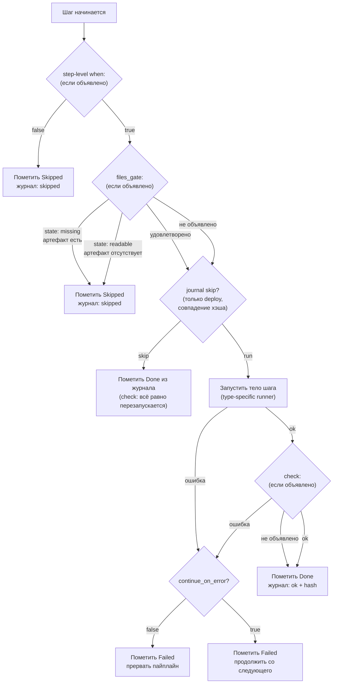

> Translated from: reference/concepts/pipelines.md @ 2f98eeebd73f

# Пайплайны

Модель выполнения phase → step → condition, общая для `dwe deploy`, `dwe run`, `dwe stop` и `dwe reset`. Одна грамматика, один runner, один журнал.

## Содержание

- [Одна грамматика, три команды](#одна-грамматика-три-команды)
- [Фазы и шаги](#фазы-и-шаги)
- [Типы шагов](#типы-шагов)
- [Условия: `when:`, `check:`, `files_gate:`](#условия-when-check-files_gate)
- [Поток выполнения шага](#поток-выполнения-шага)
- [Параллельные группы шагов](#параллельные-группы-шагов)
- [Sub-step переопределения на целях workflow](#sub-step-переопределения-на-целях-workflow)
- [Что читать дальше](#что-читать-дальше)

## Одна грамматика, три команды

Пять пользовательских команд запускают пайплайн:

| Команда | Файл | Дефолт при отсутствии |
|---------|------|---------------------|
| `dwe deploy run` | `workspace/deploy.yml` + `workspace/services/<svc>/deploy.yml` на каждый сервис | Встроенный пайплайн `services → start → post-deploy`. |
| `dwe run` | `lifecycle.yml` → `run:` | Встроенная фаза `start`, вызывающая `docker up --wait`. |
| `dwe stop` | `lifecycle.yml` → `stop:` | Встроенная фаза `stop`, вызывающая `docker down`. |
| `dwe restart` | `lifecycle.yml` (обе секции) | Запускает `stop`, потом `run --no-update`. |
| `dwe reset run` | `workspace/reset.yml` (+ `reset.yml` на каждый сервис) | Встроенный пайплайн `pre → stop → cleanup`. |

Каждый файл объявляет одну и ту же структуру — упорядоченный список фаз, каждая содержит упорядоченный список шагов. Один runner запускает их все и не знает, какая команда его вызвала. Поэтому per-service deploy-файлы, deploy-файл оркестратора, блоки `run:` / `stop:` в lifecycle и reset-файл используют одну и ту же грамматику шагов.

Два расширения грамматики привязаны к конкретной команде:

- **`deploy_services: true`** на фазе — это маркер оркестратора, встраивающий per-service deploy-пайплайны. Допустимо только в `workspace/deploy.yml`, в `lifecycle.yml` и `reset.yml` отклоняется на загрузке.
- **`after:`** на верхнем уровне per-service `deploy.yml` задаёт порядок между сервисами на этапе деплоя. Отклоняется в файле оркестратора, в `reset.yml` и в per-service `reset.yml`.

Всё остальное — `when:`, `check:`, `files_gate:`, `continue_on_error:`, `skip_confirm:`, `untracked:`, `parallel:` — общее.

## Фазы и шаги

Фаза группирует шаги, логически связанные между собой: `pre`, `start`, `services`, `post-deploy`, `cleanup`. Фазы упорядочены; падение внутри фазы прерывает её и пропускает всё после неё (если только упавший шаг не объявил `continue_on_error: true`).

Шаг — это листовая единица работы. Каждый реально выполняющийся шаг объявляет `type:` плюс полезную нагрузку `cmd:`. Счётчик шагов `[N/M]` в подвале репортёра перечисляет листовые шаги по всему пайплайну.

Три настройки регулируют, как фаза или шаг отображаются:

- **`untracked: true`** на фазе или шаге исключает её/его из счётчика `[N/M]` и подавляет строки start/done. Падения всё равно показываются. Полезно для info-выдач `post-deploy` и для учёта `_auto_reap_daemons`, который пайплайн stop добавляет автоматически.
- **`continue_on_error: true`** превращает падение из «прервать» в «сообщить и идти дальше». Следующий шаг запускается как обычно. Используйте это в опциональных фазах pre/post-хуков; никогда — в основных lifecycle-шагах, которые должны успешно завершаться.
- **`skip_confirm: true`** пробрасывает `--yes` в один шаг независимо от флага пайплайна. Объединяется по OR с флагом пайплайна и (в параллельных группах) с групповым флагом — монотонно, не снимается.

## Типы шагов

Поле `type:` выбирает runner:

| `type:` | Runner | Применение |
|---------|--------|----------|
| `shell` | `sh -c` через `config.ShellBin` | Inline shell с полной shell-семантикой (globs, pipes, redirection). |
| `dwe` | Рекурсивный вызов в DWE бинарник | Compose passthrough'и (`docker up`, `docker down`), render-команды, `info`, всё, доступное как dwe-подкоманда. |
| `command` | Декларативная команда из `workspace/commands/` | Workflow / service-exec / service-run / builtin / daemon / script / shell / dwe команды, объявленные в реестре. |
| `builtin` | Внутренняя Go-функция движка | In-process действие с доступом к смерженному конфигу. Тот же реестр, что используют user-команды. |

Два коротких имени выглядят похоже, но это не одно и то же:

- **`type: shell` шаг** запускает ваш `cmd:` через настроенный shell проекта (`config.ShellBin`). Проект может зафиксировать `zsh`, и тело шага будет использовать `zsh`.
- **`cmd: shell` builtin** запускает значение `with.cmd:` через жёстко зафиксированный `sh -c` для POSIX-переносимости. Используется внутри `when:` предикатов и внутри `check:` действий, где переносимость через CI важнее, чем равенство возможностей.

`when:` предикаты всегда используют жёстко зафиксированный `sh` для переносимости. `check:` действия могут использовать любой вариант: выбирайте `cmd: shell` (builtin) для переносимых утверждений, выбирайте `type: shell` (step-shape действие), когда вам нужны возможности shell проекта.

Полный справочник по типам: [`config/deploy/steps.md`](../config/deploy/steps.md). Каталог билтинов: [`config/deploy/builtins.md`](../config/deploy/builtins.md).

## Условия: `when:`, `check:`, `files_gate:`

Три директивы стробируют шаг:

- **`when:`** — предусловие. Вычисляется до запуска тела. Falsy → шаг пропущен (не упал). Имеет один из типов: `builtin` (предикаты файловой системы вроде `dir-empty`), `shell` (жёстко зафиксированный `sh -c`) или `template` (Go-шаблон поверх смерженного `DweConfig`).
- **`check:`** — постусловие. Вычисляется после успешного завершения тела. Падение → шаг отмечается как упавший. Та же форма `type:`, что и у тела шага (`shell` / `dwe` / `command` / `builtin`), но его возвращаемое значение стробирует статус успеха шага, а не производит видимый пользователю вывод.
- **`files_gate:`** — гейт по file-spec. Ссылается на объявленный блок `files:` команды. `state: readable` запускает шаг, только если все проверяемые файлы существуют; `state: missing` запускает шаг, только если ни одного из них нет.

Важны два момента взаимодействия:

- `when:` и `files_gate:` объединяются по AND. Если `when:` ложно, гейт не вычисляется.
- `files_gate:` асимметрично взаимодействует с журналом deploy-состояния. `state: missing` обходит journal-skip (producer-паттерн — перезапускается, когда артефакта нет). `state: readable` соблюдает journal-skip (consumer-паттерн — запускается один раз, дальше работу несёт журнал). Добавление или изменение `files_gate:` инвалидирует записанный хэш шага, так что следующий запуск переоценивает с нуля.

Каталог условий (предикаты, действия, шаблонные хелперы) — в [`config/conditions.md`](../config/conditions.md). Семантика со стороны deploy — в [`config/deploy/conditions.md`](../config/deploy/conditions.md).

## Поток выполнения шага

Как только фаза стартует и её фазовый `when:` проходит, каждый шаг внутри фазы проходит ту же последовательность:



Три момента на диаграмме, которые стоит заметить:

- Решение о journal-skip принадлежит только `dwe deploy run`. `dwe run` / `stop` / `restart` и `dwe reset run` выполняют каждый достижимый шаг при каждом вызове — оптимизации «это уже запускалось» вне deploy нет.
- `check:` пропускается, когда `continue_on_error: true` и тело упало. Он также переоценивается, когда журнал иначе пропустил бы шаг — именно это удерживает `check:` как честное утверждение идемпотентности.
- Шаг, пропущенный по журналу, всё равно занимает один слот в `[N/M]` и одну строку в живом репортёре; он просто сразу отображается как `◎ Skipped (cached)`.

## Параллельные группы шагов

Шаг может объявить блок `parallel:` вместо листового тела. Runner запускает каждый sub-step в своей горутине через `errgroup.WithContext`, ограниченный семафором:

```yaml
steps:
  - name: db-dumps
    skip_confirm: true            # OR-мержится в каждый sub-step
    parallel:
      max_concurrent: 4           # дефолт min(NumCPU, len(steps))
      fail_fast: true             # дефолт true
      steps:                      # обязательно, >= 2
        - name: download-main
          type: command
          cmd: services.main.db.dump-download
        - name: download-stock
          type: command
          cmd: services.stock.db.dump-download
        - name: download-price
          type: command
          cmd: services.price.db.dump-download
```

Пять правил, вытекающих из дизайна:

- **Плоские группы.** Sub-step не может сам объявить блок `parallel:`. Если нужен DAG, разбейте его по фазам.
- **`when:` на уровне группы** вычисляется один раз до запуска sub-step'ов. Собственный `when:` каждого sub-step всё равно вычисляется внутри горутины.
- **`fail_fast: true`** отменяет соседей через родительский `context.Context`. `exec.CommandContext` шлёт SIGTERM, потом SIGKILL после 5-секундной `WaitDelay`. Никаких висячих `docker compose` или `sleep` после чистого прерывания.
- **Журналирование по каждому sub-step.** Журнал deploy записывает каждый sub-step под `(phase, sub-step.name)`. Перестановка или добавление sub-step'ов не инвалидирует соседей, потому что `journal.StepHash` вычисляется только по самому sub-step.
- **Никакого PTY в sub-step'ах.** Передача PTY потомку, когда stdin — пустой reader, ломает `docker compose exec/run`. Используйте последовательный шаг, когда нужна интерактивная консоль.

Репортёр заменяет подвал LiveLine на LiveBlock на время параллельной группы, по одной строке на sub-step, с пайплайн-индексом `[N/M]` на строку и frame-aware парсером, который нормализует `\r` progress-строки в один фрейм на видимую строку. Полный вывод пишется в `.dwe/logs/parallel/<pipeline>/<group>/<sub>.log`.

Полная схема, дефолты, правила валидации и семантика выполнения: [`config/deploy/examples.md → Parallel step groups`](../config/deploy/examples.md#parallel-step-groups).

## Sub-step переопределения на целях workflow

Шаг `type: command`, нацеленный на workflow, может прикрепить стробирование на уровне отдельных sub-step к этому workflow без правки определения самого workflow:

```yaml
- name: db-dumps-deploy
  type: command
  cmd: services.main.db.dumps-deploy   # workflow с parallel-блоком
  skip_confirm: true
  sub_step_overrides:
    deploy-main:
      files_gate:
        state: readable
        command: services.main.db.dump-deploy
    deploy-stock:
      files_gate:
        state: readable
        command: services.main.db.dump-deploy
        with: { database: "${db.stock_database}" }
```

Workflow остаётся непрозрачным и переиспользуемым; решение о стробировании принадлежит шагу пайплайна, который его вызвал. Переопределения применяются только тогда, когда workflow вызван через породивший шаг; тот же workflow, вызванный ad-hoc (`dwe commands run …`) или как sub-step другого workflow, запускается как написано. В v1 переопределяется только `files_gate`, и переопределения не могут нацеливаться на sub-step, чья команда сама является workflow.

Это канонический ответ на «хочу стробирование отдельных элементов в workflow без форка workflow на N вариантов».

## Что читать дальше

- [Справочник `deploy.yml` / `reset.yml`](../config/deploy/index.md) — поля верхнего уровня, поля фаз, поля шагов, идемпотентность и взаимодействие с журналом состояния.
- [Типы выполнения шагов](../config/deploy/steps.md) — `shell`, `dwe`, `command`, `builtin`; `cmd: shell` builtin vs `type: shell` step.
- [Каталог условий](../config/conditions.md) — каждый предикат и типизированное действие, доступные для `when:` / `check:` / `files_gate:`.
- [`lifecycle.yml`](../config/lifecycle.md) — пайплайны `run:` / `stop:`, проба `run.update`, конвенции hook-фаз.
- [Reset](../config/reset.md) — общий и сервисный reset, всегда включённая базовая линия, жизненный цикл pending-состояния.
- [Состояние и блокировки](state-and-locks.md) — как журнал deploy записывает хэши и решает, что пропустить, и как `deploy.lock` / `snapshot.lock` сериализуют конкурентные запуски.
