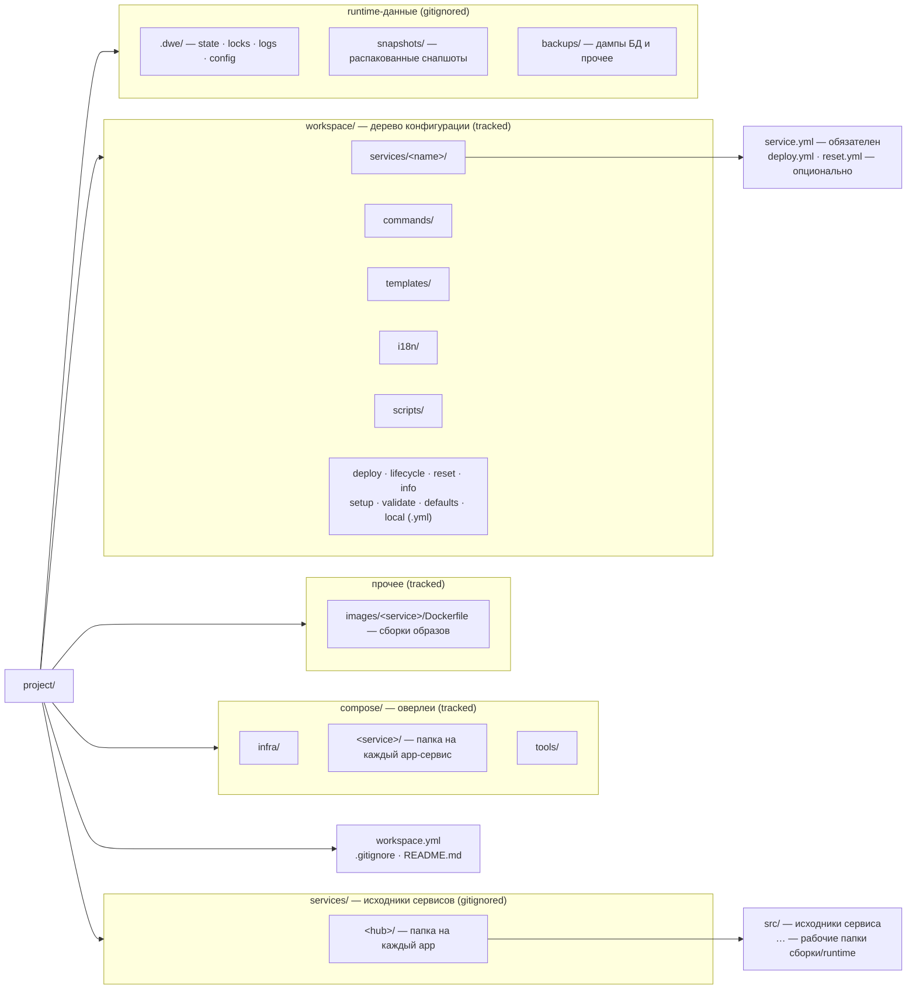

> Translated from: reference/concepts/project-layout.md @ c2f49aa986b9

# Раскладка проекта

Как типичный проект DWE выглядит на диске: отслеживаемое дерево конфигурации в `workspace.yml` + `workspace/`, параллельные оверлеи `compose/`, runtime-артефакты `.dwe/` и стандартные папки для конфигов, томов и снапшотов.

## Содержание

- [Форма проекта](#форма-проекта)
- [Корневые файлы](#корневые-файлы)
- [Дерево конфигурации `workspace/`](#дерево-конфигурации-workspace)
- [Оверлеи `compose/`](#оверлеи-compose)
- [Образы сервисов (`images/`)](#образы-сервисов-images)
- [Отрендеренные конфиги и дампы](#отрендеренные-конфиги-и-дампы)
- [Исходники сервисов (`services/`)](#исходники-сервисов-services)
- [Управляемый runtime каталог `.dwe/`](#управляемый-runtime-каталог-dwe)
- [Сводка по отслеживанию в git](#сводка-по-отслеживанию-в-git)
- [Вне проекта: `~/.config/dwe/`](#вне-проекта-configdwe)
- [Что читать дальше](#что-читать-дальше)

## Форма проекта

Проект DWE — это любая директория, корень которой содержит `workspace.yml`. CLI поднимается вверх от текущей рабочей директории, чтобы найти его. Вокруг этого якоря сосуществуют три семейства папок:

- **Отслеживаемое дерево конфигурации** в `workspace/` и корневые конфигурационные файлы — закоммичены, версионируются, источник истины для структуры проекта.
- **Отслеживаемые runtime-оверлеи** — файлы Docker Compose в `compose/` и контексты сборки образов (`images/<service>/Dockerfile`) для сервисов, собираемых из исходников. DWE не генерирует их; они лежат рядом с деревом конфигурации, и на них ссылаются из него. (Рантайм-конфиги сервисов — `.env`, `env.php`, … — *рендерятся* из [config-пака шаблонов](../render/config.md) прямо в hub-каталог каждого сервиса.)
- **Runtime-данные**, которые производят DWE и контейнеры — `.dwe/` (служебные данные CLI), `snapshots/` (распакованное хранилище снапшотов) и `backups/` (дампы БД и прочее). Gitignored. Персистентные данные контейнеров живут в именованных томах Docker.



Имена папок, отличные от `workspace.yml` и `workspace/`, — это конвенции, а не требования. CLI спокойно находит `compose/`-файлы где угодно — сервисы ссылаются на них относительным путём в `service.yml` (`compose: [compose/web/overlay.yml]`). Папки ниже описывают раскладку, к которой приходит большинство проектов; единственные ограничения, которые накладывает CLI, — папка на сервис в `workspace/services/` и `workspace.yml` в корне проекта.

## Корневые файлы

| Файл | Назначение | Читатель | Писатель | Отслеживается |
|------|---------|--------|--------|---------|
| `workspace.yml` | Идентификация проекта: `project.name`, `project.prefix` и recipient блока `secrets:` | CLI на каждом вызове | Автор вручную (`secrets.recipient` — командами `dwe secrets init` / `rekey`) | да |
| `.gitignore` | Исключает `.dwe/`, `/services/`, `snapshots/`, `backups/` и `workspace/local.yml` из контроля версий | git | Автор вручную | да |
| `README.md` | Точка входа в документацию проекта (не README DWE CLI) | люди | Автор вручную | да |

Минимальный `workspace.yml`:

```yaml
project:
  name: my-project
  prefix: myprefix
```

Полный справочник по полям — в [`workspace.yml`](../config/workspace.md).

## Дерево конфигурации `workspace/`

Всё декларативное в проекте — сервисы, пайплайны, команды, шаблоны, переводы — лежит в `workspace/`. CLI загружает это дерево на старте; ничто вне него (кроме `workspace.yml` и compose-файлов, на которые он ссылается) в конфигурации проекта не участвует.

| Путь | Назначение | Читатель | Писатель | Отслеживается |
|------|---------|--------|--------|---------|
| `workspace/defaults.yml` | Версионированные значения по умолчанию: `services.<name>.enabled`, `runtime`, `state`, `exports.env`, `compose`, `services.<name>.render.ide` | CLI (слой merge 2) | Автор вручную | да |
| `workspace/local.yml` | Переопределения на разработчика поверх `defaults.yml`: порты, флаги enabled, креды, ответы мастера | CLI (слой merge 3) | Автор вручную + setup wizard + `dwe services enable/disable` | нет |
| `workspace/services/<name>/` | Одна папка на сервис. Имя папки — это ID сервиса, поля `name:` нет. | Загрузчик сервисов CLI | Автор вручную | да (кроме оверрайдов `local.yml`) |
| `workspace/commands/` | Декларативные пользовательские команды, доступные как `dwe <name>` | Реестр команд CLI | Автор вручную | да |
| `workspace/templates/` | Template-паки для `dwe render` — по подкаталогу на вид: `config/`, `ai/`, `git/`, `ide/`, в каждом `<pack>/manifest.yml` + файлы (`render env` пак не использует). Паки `config/` рендерят рантайм-конфиги сервисов (`.env`, …) в hub сервиса | Render-пайплайн CLI | Автор вручную | да |
| `workspace/i18n/` | Переопределения строк по локалям (`<lang>.yml`); сливаются со встроенными дефолтами | i18n-стор CLI | Автор вручную + переводчики | да |
| `workspace/scripts/` | Shell-скрипты, на которые ссылаются декларативные команды и пайплайны | Шаги пайплайна + пользовательские команды | Автор вручную | да |
| `workspace/deploy.yml` | Верхнеуровневый оркестратор пайплайна деплоя. Опционально — у DWE есть встроенный дефолт. | Исполнитель deploy | Автор вручную | да |
| `workspace/lifecycle.yml` | Фазы и хуки `run` / `stop` / `restart` | Исполнитель lifecycle | Автор вручную | да |
| `workspace/reset.yml` | Пайплайн сброса проекта | Исполнитель reset | Автор вручную | да |
| `workspace/info.yml` | Элементы информационной панели (заголовок, URL, хосты, команды, пользовательские секции) | Рендерер `dwe info` | Автор вручную | да |
| `workspace/setup.yml` | Вопросы мастера настройки (input / confirm / select / multiselect) | Workflow setup | Автор вручную | да |
| `workspace/validate.yml` | Проверки готовности проекта (`shell` / `file_exists` / `tcp_reachable` / …) | `dwe validate` + preflight | Автор вручную | да |
| `workspace/tests/` | Сценарии интеграционных тестов (`<name>.yml`), запускаемые на одноразовой копии проекта | `dwe test` / `dwe validate tests` | Автор вручную | да |
| `workspace/docker.yml` | Слой оркестрации compose: шаблон имени проекта, список файлов, топология, скрытые сервисы | Подсистема Docker | Автор вручную | да |
| `workspace/docker.local.yml` | Переопределения compose на разработчика, глубоко смерженные поверх `docker.yml` | Подсистема Docker | Автор вручную | нет |
| `workspace/styles.yml` | Палитра семантических токенов (accent / success / warning / danger / muted / border / text) | UI-стилизация | Автор вручную | да |

### Папка на сервис

Конфигурация каждого сервиса лежит в `workspace/services/<name>/`. Имя папки — это канонический ID сервиса; переименование папки переименовывает и сервис. Папка всегда содержит `service.yml`; опциональные `deploy.yml` и `reset.yml` объявляют пайплайны конкретного сервиса, которые оркестратор встраивает в нужной точке в топологическом порядке.

```text
workspace/services/web/
├── service.yml      # обязательный: type, container, compose, ports, hosts, configs, dirs
├── deploy.yml       # опциональный: пайплайн деплоя сервиса
└── reset.yml        # опциональный: пайплайн сброса сервиса
```

Allowlist полей по типу (какие поля может объявлять `type: app` / `type: tool` / `type: infra`) проверяется строго — см. [`services/fields.md`](../config/services/fields.md).

### `defaults.yml` vs `local.yml` vs `workspace.yml`

Эти три файла сливаются в одну эффективную конфигурацию:

1. `workspace.yml` задаёт структуру (идентификацию проекта, версию схемы).
2. `workspace/defaults.yml` заполняет отслеживаемые значения по умолчанию.
3. `workspace/local.yml` переопределяет значения на стороне разработчика (gitignored).

Каждый слой опционален; отсутствующие ключи берутся со слоя ниже. Карты портов и хостов сервисов глубоко мержатся по имени записи, так что `local.yml` может переопределить один порт без перечисления остальных. Детальная модель merge — в [`workspace.yml`](../config/workspace.md).

## Оверлеи `compose/`

`compose/` содержит файлы Docker Compose, на которые ссылается `workspace/services/<name>/service.yml`. DWE не генерирует эти файлы и не управляет ими — он собирает их список в runtime и передаёт как `docker compose -f a.yml -f b.yml …`.

| Путь | Назначение | Читатель | Писатель | Отслеживается |
|------|---------|--------|--------|---------|
| `compose/infra/` | Оверлеи для сервисов `type: infra` (БД, очереди, кэши) | Docker Compose через DWE | Автор вручную | да |
| `compose/<service>/` | Оверлей конкретного сервиса `type: app` — папка на каждый app | Docker Compose через DWE | Автор вручную | да |
| `compose/tools/` | Оверлеи для сервисов `type: tool` (админ-UI, одноразовые утилиты) | Docker Compose через DWE | Автор вручную | да |

Типичный оверлей сервиса объявляет образ контейнера, монтирование из hub-каталога сервиса (куда попадают отрендеренные конфиги) и любое окружение, экспортированное из `defaults.yml`:

```yaml
services:
  web:
    image: nginx:latest
    container_name: ${PROJECT}-web
    volumes:
      - ./services/web/src:/var/www/html
      - ./services/web/nginx.conf:/etc/nginx/conf.d/default.conf  # отрендерено `dwe render config`
    ports:
      - "${WEB_HTTP_PORT}:80"
```

Список compose-файлов также включает `workspace/docker.local.yml` в самом конце, так что переопределения на разработчика (альтернативные образы, debug-порты, дополнительные тома) накладываются поверх отслеживаемых оверлеев без их редактирования. Полная сборка — в [`docker.yml`](../config/docker.md) и [Интеграции с Docker](docker.md).

## Образы сервисов (`images/`)

Сервисы, собираемые из исходников (а не тянущиеся из реестра), хранят контекст сборки в `images/<service>/` с `Dockerfile` в корне. Compose-оверлей указывает `build:` на эту папку:

```yaml
services:
  web:
    build:
      context: ../images/web
    container_name: ${PROJECT}-web
```

`images/` отслеживается: Dockerfile и контекст сборки — часть проекта. Имя папки — это имя сервиса, на которое ссылается `build.context` оверлея.

## Отрендеренные конфиги и дампы

Рантайм-конфиги (`.env`, `env.php`, какой-нибудь `nginx.conf`, …) **рендерятся** из [config-пака шаблонов](../render/config.md) под `workspace/templates/config/<pack>/` прямо в hub-каталог каждого сервиса, откуда их монтирует compose-оверлей. Секреты, чеканенные сервисом (Laravel `APP_KEY`, …), харвестятся в gitignore'нутое хранилище `.dwe/generated.yml` и переигрываются при каждом рендере. Пак авторьте под `workspace/templates/config/`.

Рядом с деревом конфигурации обычно остаётся одна папка:

| Путь | Назначение | Читатель | Писатель | Отслеживается |
|------|---------|--------|--------|---------|
| `backups/…` | Дампы БД и прочее, создаваемые во время разработки | Оператор / команды проекта | Оператор / команды проекта | нет |

`backups/` gitignored, потому что содержит сгенерированные дампы, которые различаются от машины к машине. Персистентные данные контейнеров (БД, загрузки, кэши) живут в именованных томах Docker.

## Исходники сервисов (`services/`)

Gitignored project-root каталог `services/` хранит **исходный код** сервисов-приложений — он выкачивается/клонируется на каждой машине и никогда не отслеживается репозиторием проекта. Создаётся по требованию (например, шагом деплоя или командой проекта), а не скаффолдингом.

Внутри — по одной папке на приложение (его *хаб*), которая группирует всё, чем владеет это приложение; в каждом хабе есть как минимум `src/` с исходниками сервиса:

```text
services/                # gitignored
└── <hub>/               # папка на каждое приложение
    ├── src/             # исходники сервиса (свой git-репозиторий / worktree)
    └── …                # вывод сборки, рабочие папки и т.п.
```

Чекаут `src/` — это обычный вложенный репозиторий, его `.gitignore` — забота приложения, а не DWE. Compose-оверлеи монтируют отсюда (`./services/<hub>/src:/var/www/html`), а `dwe render git` ставит хуки в `services/<hub>/src/.git/hooks/`. Поскольку всё дерево привязано к корню как `/services/` в `.gitignore`, отслеживаемое дерево `workspace/services/` не затрагивается.

## Управляемый runtime каталог `.dwe/`

Всё, что DWE пишет во время нормальной работы, попадает в `.dwe/`. Папка gitignored и её безопасно удалить — следующий запуск пайплайна пересоберёт всё, что нужно.

| Путь | Назначение | Читатель | Писатель | Отслеживается |
|------|---------|--------|--------|---------|
| `.dwe/deploy/state.yml` | Идемпотентный журнал деплоя: `action_hash`, `status`, `started_at`, `duration` по каждому шагу | Исполнитель deploy + `dwe deploy state show` | Исполнитель deploy | нет |
| `.dwe/deploy/deploy.lock` | Эксклюзивный `flock`, удерживаемый во время `dwe deploy run` | Подсистема блокировок | Подсистема блокировок | нет |
| `.dwe/snapshots/snapshot.lock` | Эксклюзивный `flock`, удерживаемый во время изменений снапшотов | Подсистема блокировок | Подсистема блокировок | нет |
| `.dwe/snapshots/current` | Указатель на активный снапшот, выставляется командами `snapshot create` и `snapshot restore` (очищается при `snapshot remove`) | Подсистема снапшотов | Подсистема снапшотов | нет |
| `.dwe/snapshots/.pre-restore-backup/` | Резервная копия `workspace/local.yml` + deploy state перед restore, для ручного восстановления | Оператор (вручную) | Подсистема снапшотов | нет |
| `.dwe/logs/deploy.log` | Объединённый stdout/stderr последнего `dwe deploy run` (пишется по умолчанию; отключается через `log: false`) | Оператор (вручную) | Исполнитель deploy | нет |
| `.dwe/logs/run.log` · `stop.log` · `reset.log` | Объединённый stdout/stderr соответствующей фазы lifecycle (при `log: true`) | Оператор (вручную) | Исполнители lifecycle / reset | нет |
| `.dwe/config` | Переопределение user-config на проект (язык, тема mermaid, условия уведомлений) | CLI на каждом вызове | Автор вручную | нет |

### Порядок блокировок

Команды, изменяющие проект, берут `deploy.lock` до `snapshot.lock` (алфавитный порядок) и освобождают в обратном. Чтения (docs, status) блокировок не берут. См. [Состояние и блокировки](state-and-locks.md).

### Восстановление после падения

Файл состояния пишется атомарно после каждого шага. Если деплой прерван, следующий `dwe deploy run` находит последний известный статус, трактует in-progress шаг как упавший и продолжает с этого места. Устаревшие `flock`-файлы, оставшиеся после `kill -9`, распознаются (lock-файл содержит PID держателя; если процесса нет, lock считается устаревшим) и тихо переподбираются.

## Сводка по отслеживанию в git

Минимальный `.gitignore` для проекта DWE покрывает пути, которыми управляет runtime. Сам runtime никогда не пишет вне этих папок.

```text
.dwe/
/services/
snapshots/
backups/
workspace/local.yml
workspace/docker.local.yml
```

Всё остальное — `workspace.yml`, остальная часть `workspace/` (включая паки `workspace/templates/config/`), весь `compose/` — отслеживается. Авторы редактируют отслеживаемое дерево; CLI пишет только внутрь gitignored-папок (с одним исключением: setup wizard и `dwe services enable/disable` дописывают в `workspace/local.yml`, который и сам gitignored).

Значения в отслеживаемом дереве могут быть **зашифрованы at rest** — скаляр `ENC[age:…]` в любом файле слоя или целый источник `*.age` под `workspace/templates/config/`. Они коммитятся намеренно; вне репозитория остаётся только приватный ключ, который их открывает. См. [Вне проекта: `~/.config/dwe/`](#вне-проекта-configdwe) и [`secrets.md`](../config/secrets.md).

## Вне проекта: `~/.config/dwe/`

Две вещи живут в конфиг-директории пользователя, а не в проекте, потому что они привязаны к машине и не должны попадать в коммиты:

| Путь | Назначение | Отслеживается |
|------|------------|---------------|
| `~/.config/dwe/config` | Пользовательские настройки (плоский `key = value`, не YAML): переопределения бинарей, язык, тема mermaid — см. [Пользовательский конфиг](../config/userconfig.md) | никогда |
| `~/.config/dwe/keys/<recipient>.key` | Приватный age-identity одного проекта, `0600`. Директория — `0700`. Пишется командами `dwe secrets init` / `key import` / `rekey` | никогда |

Keyfile называется по **публичному recipient**, которому он принадлежит, поэтому одна машина может держать identity любого числа проектов рядом. `DWE_AGE_KEY` (текст identity) и `DWE_AGE_KEY_FILE` (путь) перекрывают поиск keyfile для CI. См. [`secrets.md` → Ключи](../config/secrets.md#ключи-где-живёт-identity).

## Что читать дальше

- [Начало работы](getting-started.md) — собрать бинарник, зайти в проект, запустить первый `dwe deploy`.
- [Архитектура](architecture.md) — как устроен сам CLI и что встроено, а что читается с диска.
- [Интеграция с Docker](docker.md) — как собирается список compose-файлов из папок выше.
- [Состояние и блокировки](state-and-locks.md) — что записывает `.dwe/deploy/state.yml` и как блокировки сериализуют изменения.
- [`workspace.yml`](../config/workspace.md) — справочник по полям трёхслойного конфига.
- [`services/`](../config/services/index.md) — структура папки сервиса и allowlist полей по типу.
