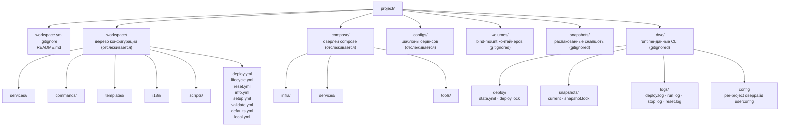

> Translated from: reference/concepts/project-layout.md @ fe1231fae96f

# Раскладка проекта

Как типичный проект DWE выглядит на диске: отслеживаемое дерево конфигурации в `workspace.yml` + `workspace/`, параллельные оверлеи `compose/`, runtime-артефакты `.dwe/` и стандартные папки для конфигов, томов и снапшотов.

## Содержание

- [Форма проекта](#форма-проекта)
- [Корневые файлы](#корневые-файлы)
- [Дерево конфигурации `workspace/`](#дерево-конфигурации-workspace)
- [Оверлеи `compose/`](#оверлеи-compose)
- [Runtime-данные сервисов](#runtime-данные-сервисов)
- [Управляемый runtime каталог `.dwe/`](#управляемый-runtime-каталог-dwe)
- [Сводка по отслеживанию в git](#сводка-по-отслеживанию-в-git)
- [Что читать дальше](#что-читать-дальше)

## Форма проекта

Проект DWE — это любая директория, корень которой содержит `workspace.yml`. CLI поднимается вверх от текущей рабочей директории, чтобы найти его. Вокруг этого якоря сосуществуют три семейства папок:

- **Отслеживаемое дерево конфигурации** в `workspace/` и корневые конфигурационные файлы — закоммичены, версионируются, источник истины для структуры проекта.
- **Отслеживаемые runtime-оверлеи** — файлы Docker Compose в `compose/` и шаблоны конфигов сервисов в `configs/`. DWE не генерирует их; они лежат рядом с деревом конфигурации, и на них ссылаются из него.
- **Runtime-данные**, которые производят DWE и контейнеры — `.dwe/` (служебные данные CLI), `volumes/` (цели bind-mount) и `snapshots/` (распакованное хранилище снапшотов). Gitignored.



Имена папок, отличные от `workspace.yml` и `workspace/`, — это конвенции, а не требования. CLI спокойно находит `compose/`-файлы где угодно — сервисы ссылаются на них относительным путём в `service.yml` (`compose: [compose/services/web.yml]`). Папки ниже описывают раскладку, к которой приходит большинство проектов; единственные ограничения, которые накладывает CLI, — папка на сервис в `workspace/services/` и `workspace.yml` в корне проекта.

## Корневые файлы

| Файл | Назначение | Читатель | Писатель | Отслеживается |
|------|---------|--------|--------|---------|
| `workspace.yml` | Идентификация проекта: `project.name`, `project.prefix`, опциональные переопределения бинарников | CLI на каждом вызове | Автор вручную | да |
| `.gitignore` | Исключает `.dwe/`, `volumes/`, `snapshots/` и `workspace/local.yml` из контроля версий | git | Автор вручную | да |
| `README.md` | Точка входа в документацию проекта (не README DWE CLI) | люди | Автор вручную | да |

Минимальный `workspace.yml`:

```yaml
project:
  name: my-project
  prefix: myprefix
```

Полный справочник по полям — в [`workspace.yml`](../config/workspace.md).

## Дерево конфигурации `workspace/`

Всё декларативное в проекте — сервисы, пайплайны, команды, шаблоны, переводы — лежит в `workspace/`. CLI загружает это дерево на старте; ничто вне него (кроме `workspace.yml` и compose-файлов, на которые он ссылается) в конфигурации проекта не участвует.

| Путь | Назначение | Читатель | Писатель | Отслеживается |
|------|---------|--------|--------|---------|
| `workspace/defaults.yml` | Версионированные значения по умолчанию: `services.<name>.enabled`, `runtime`, `state`, `exports.env`, `compose`, `ide` | CLI (слой merge 2) | Автор вручную | да |
| `workspace/local.yml` | Переопределения на разработчика поверх `defaults.yml`: порты, флаги enabled, креды, ответы мастера | CLI (слой merge 3) | Автор вручную + setup wizard | нет |
| `workspace/services/<name>/` | Одна папка на сервис. Имя папки — это ID сервиса, поля `name:` нет. | Загрузчик сервисов CLI | Автор вручную | да (кроме оверрайдов `local.yml`) |
| `workspace/commands/` | Декларативные пользовательские команды, доступные как `dwe <name>` | Реестр команд CLI | Автор вручную | да |
| `workspace/templates/` | Template-паки для `dwe render` (env / ide / ai / git) | Render-пайплайн CLI | Автор вручную | да |
| `workspace/i18n/` | Переопределения строк по локалям (`<lang>.yml`); сливаются со встроенными дефолтами | i18n-стор CLI | Автор вручную + переводчики | да |
| `workspace/scripts/` | Shell-скрипты, на которые ссылаются декларативные команды и пайплайны | Шаги пайплайна + пользовательские команды | Автор вручную | да |
| `workspace/deploy.yml` | Верхнеуровневый оркестратор пайплайна деплоя. Опционально — у DWE есть встроенный дефолт. | Исполнитель deploy | Автор вручную | да |
| `workspace/lifecycle.yml` | Фазы и хуки `run` / `stop` / `restart` | Исполнитель lifecycle | Автор вручную | да |
| `workspace/reset.yml` | Пайплайн сброса проекта | Исполнитель reset | Автор вручную | да |
| `workspace/info.yml` | Элементы информационной панели (заголовок, URL, хосты, команды, пользовательские секции) | Рендерер `dwe info` | Автор вручную | да |
| `workspace/setup.yml` | Вопросы мастера настройки (input / confirm / select / multiselect) | Workflow setup | Автор вручную | да |
| `workspace/validate.yml` | Проверки готовности проекта (`shell` / `file_exists` / `tcp_reachable` / …) | `dwe validate` + preflight | Автор вручную | да |
| `workspace/docker.yml` | Слой оркестрации compose: шаблон имени проекта, список файлов, топология, скрытые сервисы | Подсистема Docker | Автор вручную | да |
| `workspace/docker.local.yml` | Переопределения compose на разработчика, глубоко смерженные поверх `docker.yml` | Подсистема Docker | Автор вручную | нет |
| `workspace/styles.yml` | Палитра семантических токенов (info / success / warn / error / muted / heading / link) | UI-стилизация | Автор вручную | да |
| `workspace/ui.yml` | Настройки поведения TUI (`default_expanded_depth`, `auto_collapse_empty`, `show_type_badges`) | TUI-рендереры | Автор вручную | да |
| `workspace/notifications.yml` | Условия desktop-уведомлений по операциям | Подсистема notify | Автор вручную | да |

### Папка на сервис

Каждый сервис лежит в `workspace/services/<name>/`. Имя папки — это канонический ID сервиса; переименование папки переименовывает и сервис. Папка всегда содержит `service.yml`; опциональные `deploy.yml` и `reset.yml` объявляют пайплайны конкретного сервиса, которые оркестратор встраивает в нужной точке в топологическом порядке.

```text
workspace/services/web/
├── service.yml      # обязательный: type, container, compose, ports, hosts, configs, dirs
├── deploy.yml       # опциональный: пайплайн деплоя сервиса
└── reset.yml        # опциональный: пайплайн сброса сервиса
```

Allowlist полей по типу (какие поля может объявлять `type: app` / `type: tool` / `type: infra`) проверяется строго — см. [`services/fields.md`](../config/services/fields.md).

### `defaults.yml` vs `local.yml` vs `workspace.yml`

Эти три файла сливаются в одну эффективную конфигурацию:

1. `workspace.yml` задаёт структуру (идентификацию проекта, версию схемы).
2. `workspace/defaults.yml` заполняет отслеживаемые значения по умолчанию.
3. `workspace/local.yml` переопределяет значения на стороне разработчика (gitignored).

Каждый слой опционален; отсутствующие ключи берутся со слоя ниже. Карты портов и хостов сервисов глубоко мержатся по имени записи, так что `local.yml` может переопределить один порт без перечисления остальных. Детальная модель merge — в [`workspace.yml`](../config/workspace.md).

## Оверлеи `compose/`

`compose/` содержит файлы Docker Compose, на которые ссылается `workspace/services/<name>/service.yml`. DWE не генерирует эти файлы и не управляет ими — он собирает их список в runtime и передаёт как `docker compose -f a.yml -f b.yml …`.

| Путь | Назначение | Читатель | Писатель | Отслеживается |
|------|---------|--------|--------|---------|
| `compose/infra/` | Оверлеи для сервисов `type: infra` (БД, очереди, кэши) | Docker Compose через DWE | Автор вручную | да |
| `compose/services/` | Оверлеи для сервисов `type: app` | Docker Compose через DWE | Автор вручную | да |
| `compose/tools/` | Оверлеи для сервисов `type: tool` (админ-UI, одноразовые утилиты) | Docker Compose через DWE | Автор вручную | да |

Типичный оверлей сервиса объявляет образ контейнера, монтирование из `volumes/` и `configs/` проекта и любое окружение, экспортированное из `defaults.yml`:

```yaml
services:
  web:
    image: nginx:latest
    container_name: ${PROJECT}-web
    volumes:
      - ./services/web/src:/var/www/html
      - ./configs/web/nginx.conf:/etc/nginx/conf.d/default.conf
    ports:
      - "${WEB_HTTP_PORT}:80"
```

Список compose-файлов также включает `workspace/docker.local.yml` в самом конце, так что переопределения на разработчика (альтернативные образы, debug-порты, дополнительные тома) накладываются поверх отслеживаемых оверлеев без их редактирования. Полная сборка — в [`docker.yml`](../config/docker.md) и [Интеграции с Docker](docker.md).

## Runtime-данные сервисов

Две папки обычно соседствуют с деревом конфигурации и хранят runtime-данные, которые читают или пишут контейнеры.

| Путь | Назначение | Читатель | Писатель | Отслеживается |
|------|---------|--------|--------|---------|
| `configs/<service>/…` | Шаблоны конфигов сервиса, копируемые в контейнеры через `service.yml.configs:` | Контейнеры (чтение) | Автор вручную | да |
| `volumes/<service>/…` | Цели bind-mount для персистентных данных контейнеров (БД, загрузки, кэши) | Контейнеры (чтение/запись) | Контейнеры (запись) | нет |

`configs/` отслеживается, потому что шаблоны — часть проекта; `volumes/` gitignored, потому что содержит сгенерированные runtime-данные, которые различаются от машины к машине.

Точные имена папок — это конвенции: сервисы ссылаются на них относительным путём в compose-оверлее и в блоке `configs:` `service.yml`. Проект может использовать `etc/` вместо `configs/` или разбить тома по папкам сервисов (`workspace/services/<name>/var/`). Раскладка выше — самая распространённая форма.

## Управляемый runtime каталог `.dwe/`

Всё, что DWE пишет во время нормальной работы, попадает в `.dwe/`. Папка gitignored и её безопасно удалить — следующий запуск пайплайна пересоберёт всё, что нужно.

| Путь | Назначение | Читатель | Писатель | Отслеживается |
|------|---------|--------|--------|---------|
| `.dwe/deploy/state.yml` | Идемпотентный журнал деплоя: `action_hash`, `status`, `started_at`, `duration` по каждому шагу | Исполнитель deploy + `dwe deploy state show` | Исполнитель deploy | нет |
| `.dwe/deploy/deploy.lock` | Эксклюзивный `flock`, удерживаемый во время `dwe deploy run` | Подсистема блокировок | Подсистема блокировок | нет |
| `.dwe/snapshots/snapshot.lock` | Эксклюзивный `flock`, удерживаемый во время изменений снапшотов | Подсистема блокировок | Подсистема блокировок | нет |
| `.dwe/snapshots/current` | Указатель на активный снапшот, выставляется командой `snapshot restore` | Подсистема снапшотов | Подсистема снапшотов | нет |
| `.dwe/snapshots/.pre-restore-backup/` | Резервная копия `workspace/local.yml` + deploy state перед restore, для ручного восстановления | Оператор (вручную) | Подсистема снапшотов | нет |
| `.dwe/logs/deploy.log` | Объединённый stdout/stderr последнего `dwe deploy run` (при `log: true`) | Оператор (вручную) + `dwe logs` | Исполнитель deploy | нет |
| `.dwe/logs/run.log` · `stop.log` · `reset.log` | Объединённый stdout/stderr соответствующей фазы lifecycle (при `log: true`) | Оператор (вручную) + `dwe logs` | Исполнители lifecycle / reset | нет |
| `.dwe/config` | Переопределение user-config на проект (язык, тема mermaid, условия уведомлений) | CLI на каждом вызове | Автор вручную | нет |

### Порядок блокировок

Команды, изменяющие проект, берут `deploy.lock` до `snapshot.lock` (алфавитный порядок) и освобождают в обратном. Чтения (docs, status) блокировок не берут. См. [Состояние и блокировки](state-and-locks.md).

### Восстановление после падения

Файл состояния пишется атомарно после каждого шага. Если деплой прерван, следующий `dwe deploy run` находит последний известный статус, трактует in-progress шаг как упавший и продолжает с этого места. Устаревшие `flock`-файлы, оставшиеся после `kill -9`, распознаются (lock-файл содержит PID держателя; если процесса нет, lock считается устаревшим) и тихо переподбираются.

## Сводка по отслеживанию в git

Минимальный `.gitignore` для проекта DWE покрывает пути, которыми управляет runtime. Сам runtime никогда не пишет вне этих папок.

```text
.dwe/
volumes/
snapshots/
workspace/local.yml
workspace/docker.local.yml
```

Всё остальное — `workspace.yml`, остальная часть `workspace/`, весь `compose/`, весь `configs/` — отслеживается. Авторы редактируют отслеживаемое дерево; CLI пишет только внутрь gitignored-папок (с одним исключением: setup wizard добавляет смерженные ответы в `workspace/local.yml`, который и сам gitignored).

## Что читать дальше

- [Начало работы](getting-started.md) — собрать бинарник, зайти в проект, запустить первый `dwe deploy`.
- [Архитектура](architecture.md) — как устроен сам CLI и что встроено, а что читается с диска.
- [Интеграция с Docker](docker.md) — как собирается список compose-файлов из папок выше.
- [Состояние и блокировки](state-and-locks.md) — что записывает `.dwe/deploy/state.yml` и как блокировки сериализуют изменения.
- [`workspace.yml`](../config/workspace.md) — справочник по полям трёхслойного конфига.
- [`services/`](../config/services/index.md) — структура папки сервиса и allowlist полей по типу.
