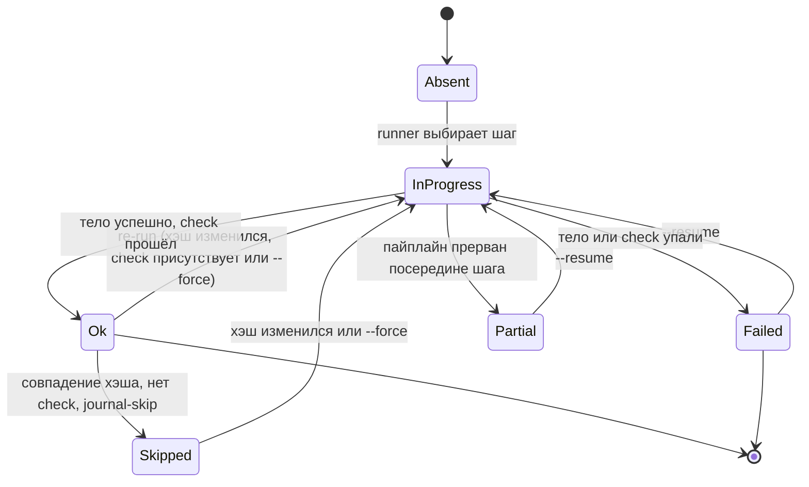

> Translated from: reference/concepts/state-and-locks.md @ 4ede6d512f0e

# Состояние и блокировки

Как DWE помнит, что уже было задеплоено, как сериализует конкурентные запуски, как восстанавливается после падения посреди пайплайна и как pending-состояние откладывает работу между `dwe services enable` и следующим `dwe deploy run`.

## Содержание

- [Зачем вообще журнал](#зачем-вообще-журнал)
- [Журнал состояния](#журнал-состояния)
- [Хэши управляют решениями о пропуске](#хэши-управляют-решениями-о-пропуске)
- [Переходы статусов шага](#переходы-статусов-шага)
- [Блокировки проекта](#блокировки-проекта)
- [Восстановление после падения](#восстановление-после-падения)
- [Pending-состояние](#pending-состояние)
- [Что читать дальше](#что-читать-дальше)

## Зачем вообще журнал

Пайплайн деплоя задуман безопасным для повторного запуска. Редактирование конфига одного сервиса должно перезапускать шаги, касающиеся именно этого сервиса, а не всего проекта. Повторный запуск деплоя на неизменённом коде должен укладываться в секунды, а не минуты. Деплой, прерванный `Ctrl+C` посередине, должен уметь продолжить с того места, где остановился.

DWE достигает этого одним файлом на диске на проект — `.dwe/deploy/state.yml` — и двумя кооперирующими файловыми блокировками: `.dwe/deploy/deploy.lock` и `.dwe/snapshots/snapshot.lock`. Журнал записывает, что запускалось и как выглядело тело каждого шага; блокировки сериализуют конкурентные изменения, так что журнал никогда не может быть записан двумя процессами одновременно.

> Журнал — только для пайплайна deploy. `dwe run`, `dwe stop`, `dwe restart` и `dwe reset run` выполняют каждый достижимый шаг при каждом вызове — оптимизации «это уже запускалось» вне deploy нет. У демонов (команд `type: daemon`) журнала тоже нет: `docker ps`, отфильтрованный по стандартным лейблам `dwe.*`, — единственный источник истины о том, какие демоны запущены.

## Журнал состояния

`.dwe/deploy/state.yml` создаётся и поддерживается командой `dwe deploy run`. Он не коммитится в систему контроля версий (префикс `.dwe/` — в `.gitignore` проекта). Его структура:

- Блок **project**: `status`, `config_hash`, `deployed_at`, `last_run` и `phases` для проектных (не-сервисных) фаз.
- Карта **services**, ключи которой — имена папок сервисов. Каждая запись повторяет проектную структуру: `status`, `config_hash`, `deployed_at`, `last_run`, `phases`.
- Блок **pending**, присутствующий только когда есть отложенные операции (см. [Pending-состояние](#pending-состояние)).

Каждый шаг внутри фазы записывает свой `status`, `finished_at`, `action_hash` и `duration_ms`. Этого достаточно, чтобы на следующем запуске решить, нужно ли пропустить шаг, перезапустить его как resume или перезапустить, потому что его тело изменилось.

Справочник по полям: [`config/state/schema.md`](../config/state/schema.md). Просматривать через `dwe deploy state show`, очищать через `dwe deploy state clear`, пересчитать агрегаты через `dwe deploy state repair` ([`config/state/management.md`](../config/state/management.md)).

## Хэши управляют решениями о пропуске

Два вида хэшей определяют, остаётся ли записанный статус шага достоверным.

- **`action_hash`** — это SHA-256 от `type`, `cmd` и `with:` шага. YAML-форматирование, комментарии и порядок ключей его не меняют (хэш видит распарсенную Go-структуру, а не сырые байты). Если вы редактируете тело шага, его хэш меняется, и шаг перезапускается.
- **`config_hash`** имеет две области действия. Хэш **сервиса** покрывает `workspace/services/<name>/service.yml` + `workspace/services/<name>/deploy.yml` и инвалидирует каждый шаг этого сервиса при изменении. Хэш **проекта** покрывает отслеживаемые сервисы + `workspace/deploy.yml` + per-service `deploy.yml` файлы для отслеживаемых сервисов и инвалидирует проектные шаги тем же образом. «Отслеживаемый» означает, что сервис появляется в итоговом плане (enabled + встроен фазой `deploy_services: true`). Tools никогда не отслеживаются.

Runner сверяется с журналом в два этапа. Сначала проверяет, что `config_hash` соответствующей области всё ещё совпадает; если не совпадает, каждый шаг внутри этой области считается отсутствующим. Только если область не изменилась, runner применяет таблицу пропуска шага:

| Предыдущий статус | Совпадение хэша | Есть `check:` | Решение |
|---|---|---|---|
| absent | — | — | Run |
| ok | да | нет | Skip |
| ok | да | да | Run (check валидирует повторно) |
| ok | нет | — | Run |
| failed / partial / in_progress | — | — | Run (resume) |

Два следствия, которые стоит запомнить:

- Шаг с действием `check:` никогда не пропускается только по совпадению хэша. Check считается доказательством того, что задуманный эффект шага всё ещё на месте, поэтому он запускается всегда.
- Изменение `when:` не отражается в `action_hash` — оно вычисляется на каждом запуске независимо от журнала, поэтому укорачивает выполнение лишь тела. Изменение `files_gate:` **отражается**: `StepHash` сворачивает каноническое представление `files_gate` в записанный хэш, поэтому его правка перезапускает шаг так же, как и правка тела.

Полные детали хэширования: [`config/state/hashing.md`](../config/state/hashing.md).

## Переходы статусов шага

За свою жизнь записанный статус шага проходит небольшой конечный автомат.

Две неочевидные дуги:

- `Ok → Skipped` — кэшированный путь. Шаг не выполняется заново, но всё равно занимает один слот в счётчике шагов `[N/M]` и одну строку в репортёре, отрендеренную как `◎ Skipped (cached)`.
- `InProgress → Partial` случается, когда пайплайн прерван, пока тело шага ещё выполняется (родительский context отменён, сосед в параллельной группе падает с fail-fast, или хост получает `SIGTERM`). На следующем запуске `--resume` трактует `Partial` так же, как `Failed`: перезапуск с этого шага.

Значения `status` для фаз, сервисов и самого проекта агрегируются с уровня шагов. `dwe deploy state repair` пересчитывает эти агрегаты из записей по каждому шагу, если что-то расходится.

## Блокировки проекта

Две файловые блокировки защищают проект от конкурентных мутаторов:

| Lock | Путь | Удерживается |
|------|------|---------|
| `deploy.lock` | `.dwe/deploy/deploy.lock` | `dwe deploy run`, `dwe run`, `dwe stop`, `dwe restart`, `dwe reset run` |
| `snapshot.lock` | `.dwe/snapshots/snapshot.lock` | `dwe snapshot create / restore / rollback / remove / pack / unpack` |

Каждая команда lifecycle и snapshot берёт **обе** блокировки через единственный хелпер `lock.AcquireProjectLocks(baseDir)`. Хелпер берёт их **в алфавитном порядке** (`deploy`, затем `snapshot`), а функция release разлокирует их **в обратном порядке**. Дизайн с двумя блокировками позволяет deploy и snapshot исключать друг друга без deadlock, потому что каждый вызывающий берёт их в одном и том же фиксированном порядке.

Захват блокировки использует `flock(LOCK_EX | LOCK_NB)`:

- Если блокировка свободна, вызывающий берёт её и пишет свой PID в файл.
- Если блокировка удерживается живым процессом, вызов возвращает `ProjectLockHeldError` с PID держателя и exit-кодом 2. CLI показывает это как `deploy operation in progress: pid 12345 (wait for it to finish or kill it and retry)`.
- Если lock-файл существует, но PID мёртв (`syscall.Kill(pid, 0)` возвращает `ESRCH`), блокировка считается устаревшей: файл усекается, и блокировка берётся. Именно это делает `kill -9` восстановимым на следующем вызове.

Команды только для чтения (`dwe status`, `dwe docs ...`, `dwe info`, `dwe validate`) проектных блокировок не берут. Подсистема docs в частности явно только для чтения и никогда не запускает preflight, поэтому открывать документацию во время запущенного deploy всегда безопасно.

> Никогда не вызывайте `lock.Acquire` на `deploy.lock` или `snapshot.lock` напрямую из кода команды. Всегда идите через `AcquireProjectLocks`. Это сохраняет контракт алфавитного захвата / обратного освобождения и не даёт одной команде пропустить парную блокировку.

## Восстановление после падения

Сочетание журнал + блокировка + атомарные записи — это то, что делает прерванный деплой возобновляемым.

1. Перед запуском любого шага сервиса `last_run.status` **на уровне сервиса и проекта** переключается на `in_progress` и сбрасывается в `state.yml`. Сами записи шагов не несут статуса `in_progress` — собственный `status` шага пишется только после его завершения.
2. При успехе статус шага пишется как `ok`, с `finished_at`, `action_hash` и `duration_ms`.
3. Если процесс убит (`Ctrl+C`, `SIGTERM`, `kill -9`, паника, OOM), файл на диске всё ещё отражает последнюю запись — шаг, убитый посреди тела, не оставляет **никакой записи шага вообще** (она просто отсутствует, что возобновляется через путь «отсутствует → run»); незавершённый `last_run.status` остаётся `in_progress`. Шаг записывается как `failed` только когда его тело возвращает корректную ошибку.
4. На следующем запуске деплоя (или `dwe deploy state repair`) `journal.Recompute` проходит журнал: любая застрявшая запись `last_run.status: in_progress` переводится в `failed` (процесса, владевшего ею, уже нет), и агрегаты проекта/сервиса пересчитываются.
5. Оставшаяся блокировка считается устаревшей на следующем захвате (PID мёртв), так что следующий запуск проходит без ручной очистки.
6. Таблица пропуска трактует `failed` / `partial` / `in_progress` как «run (resume)», так что `dwe deploy run --resume` подхватывает с первого шага, не помеченного `ok`. В TTY runner предлагает выбор (resume / re-run all / cancel); в неинтерактивном режиме требуется `--resume` или `--force`.

Можно принудительно начать с чистого листа через `dwe deploy run --force` (очищает `state.yml` и перезапускает каждый шаг) или сбросить и журнал, и pending-состояние через `dwe reset run`.

## Pending-состояние

Блок `pending` в `state.yml` фиксирует работу, которая поставлена в очередь, но ещё не применена. Канонический источник — `dwe services enable / disable` без `--apply`: локальное переопределение пишется в `workspace/local.yml` сразу, но restart или deploy, который реально внёс бы изменение, откладывается.

Существует два вида операций:

- **`restart`** — нужен общий restart стека (например, сервис был отключён, и его контейнер должен остановиться).
- **`deploy`** — нужен deploy конкретного сервиса (например, сервис был включён, и его deploy-пайплайн ещё не запускался); затронутые имена сервисов перечислены в операции.

Pending-операции сливаются между сессиями: два вызова `services enable a` и `services enable b` без `--apply` дают одну операцию `deploy` со списком `[a, b]`. Когда потребляющая команда отрабатывает успешно, очищаются только операции, относящиеся к этому потребителю:

| Событие | Эффект |
|-------|--------|
| Успех `dwe restart` | очищает операцию `restart`; любая операция `deploy` выживает |
| Успех `dwe deploy run` (полный проект) | очищает операцию `deploy`; любая операция `restart` выживает |
| Успех `dwe deploy run --service <name>` | удаляет `<name>` из операции `deploy`; удаляет операцию, когда она пуста |
| Успех `dwe reset run` (проектный) | очищает всё pending (полная очистка журнала) |
| Успех `dwe reset run --service <name>` | пишет `{kind: deploy, services: [<name>]}` |

Селективная очистка важна: pending-запись другого оператора, лежащая в том же журнале, не должна стираться несвязанным переключением. Поэтому исполнитель переключений использует `ClearPendingOps` со списком, полученным из источника, и никогда — `ClearPending`.

Пока `pending` не nil, `dwe status` (и его подкоманды) печатает предупреждающий баннер в верху вывода, называя отложенное действие и команду для его запуска. Баннер исчезает, как только соответствующий потребитель успешно отработал. Справочник по схеме и lifecycle: [`config/state/schema.md`](../config/state/schema.md#pending-state).

## Что читать дальше

- [`config/state/index.md`](../config/state/index.md) — расположение файла, назначение журнала, поведение snapshot-restore.
- [`config/state/schema.md`](../config/state/schema.md) — каждое поле на каждом уровне `state.yml`.
- [`config/state/hashing.md`](../config/state/hashing.md) — полное вычисление хэша, правила областей действия и таблица решения о пропуске.
- [`config/state/management.md`](../config/state/management.md) — `dwe deploy state show / clear / repair`, флаги `--force` и `--resume`, неинтерактивное поведение.
- [Пайплайны](pipelines.md) — как решение о journal-skip встраивается в поток выполнения шага.
- [Reset](../config/reset.md) — что очищает `dwe reset run` и всегда включённая базовая линия, возвращающая проект в известное чистое состояние.
