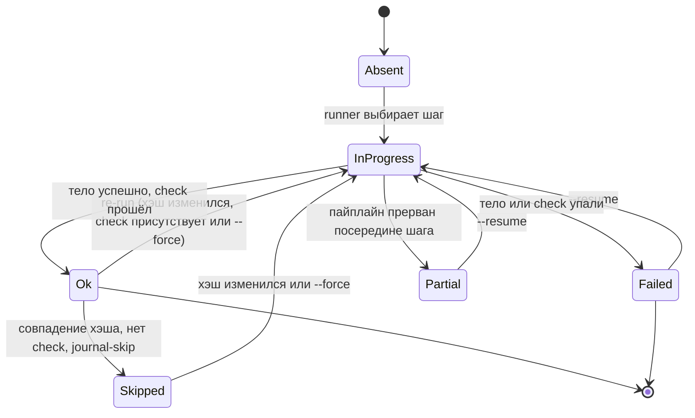

> Translated from: reference/concepts/state-and-locks.md @ 814275d4ac51

# Состояние и блокировки

Как Devbox помнит, что уже было задеплоено, как сериализует конкурентные запуски, как восстанавливается после краха посреди пайплайна и как pending-состояние откладывает работу между `devbox services enable` и следующим `devbox deploy run`.

## Содержание

- [Зачем вообще журнал](#зачем-вообще-журнал)
- [Журнал состояния](#журнал-состояния)
- [Хэши управляют решениями о пропуске](#хэши-управляют-решениями-о-пропуске)
- [Переходы статусов шага](#переходы-статусов-шага)
- [Блокировки проекта](#блокировки-проекта)
- [Восстановление после краха](#восстановление-после-краха)
- [Pending-состояние](#pending-состояние)
- [Что читать дальше](#что-читать-дальше)

## Зачем вообще журнал

Пайплайн деплоя задуман как безопасный для повторного запуска. Редактирование конфига одного сервиса должно перезапустить шаги, касающиеся именно этого сервиса, а не всего проекта. Повторный запуск деплоя на неизменённом коде должен заканчиваться за секунды, а не за минуты. Деплой, убитый `Ctrl+C` посередине, должен мочь подхватить с того места, где остановился.

Devbox достигает этого одним файлом на диске на проект, `.devbox/deploy/state.yml`, и двумя кооперирующими файловыми блокировками, `.devbox/deploy/deploy.lock` и `.devbox/snapshots/snapshot.lock`. Журнал записывает, что запускалось и как выглядело тело каждого шага; блокировки сериализуют конкурентных мутаторов, так что журнал никогда не может быть записан двумя процессами одновременно.

> Журнал — только для пайплайна deploy. `devbox run`, `devbox stop`, `devbox restart` и `devbox reset run` выполняют каждый достижимый шаг на каждом вызове — нет оптимизации «это уже запускалось» вне deploy. У демонов (команд `type: daemon`) журнала тоже нет: `docker ps`, отфильтрованный по стандартным лейблам `devbox.*`, является единственным источником истины о том, какие демоны запущены.

## Журнал состояния

`.devbox/deploy/state.yml` создаётся и поддерживается командой `devbox deploy run`. Он не закоммичен в систему контроля версий (префикс `.devbox/` — в `.gitignore` проекта). Его форма:

- Блок **project**: `status`, `config_hash`, `deployed_at`, `last_run` и `phases` для проектных (не-сервисных) фаз.
- Карта **services**, ключёванная по имени папки сервиса. Каждая запись зеркалит проектную форму: `status`, `config_hash`, `deployed_at`, `last_run`, `phases`.
- Блок **pending**, присутствующий только когда есть отложенные операции (см. [Pending-состояние](#pending-состояние)).

Каждый шаг под фазой записывает свой `status`, `finished_at`, `action_hash` и `duration_ms`. Этого достаточно, чтобы на следующем запуске решить, должен ли шаг быть пропущен, перезапущен как resume или перезапущен, потому что его тело изменилось.

Справочник по полям: [`config/state/schema.md`](../config/state/schema.md). Инспектируйте через `devbox deploy state show`, очищайте через `devbox deploy state clear`, пересчитайте агрегаты через `devbox deploy state repair` ([`config/state/management.md`](../config/state/management.md)).

## Хэши управляют решениями о пропуске

Два вида хэшей решают, остаётся ли записанный статус шага доверенным.

- **`action_hash`** — это SHA-256 от `type`, `cmd` и payload `with:` шага. YAML-форматирование, комментарии и порядок ключей не меняют его (хэш видит распарсенную Go-структуру, а не сырые байты). Если вы редактируете тело шага, его хэш меняется, и шаг перезапускается.
- **`config_hash`** имеет два скоупа. Хэш **сервиса** покрывает `devbox/services/<name>/service.yml` + `devbox/services/<name>/deploy.yml` и инвалидирует каждый шаг под этим сервисом при изменении. Хэш **проекта** покрывает отслеживаемые сервисы + `devbox/deploy.yml` + per-service `deploy.yml` файлы для отслеживаемых сервисов, и инвалидирует проектные шаги тем же способом. «Отслеживаемый» означает, что сервис появляется в разрешённом плане (enabled + инлайнен фазой `deploy_services: true`). Tools никогда не отслеживаются.

Runner советуется с журналом в два слоя. Сначала он проверяет, что `config_hash` соответствующего скоупа всё ещё совпадает; если не совпадает, каждый шаг внутри этого скоупа трактуется как отсутствующий. Только если скоуп не изменился, runner применяет таблицу пропуска шага:

| Предыдущий статус | Совпадение хэша | Есть `check:` | Решение |
|---|---|---|---|
| absent | — | — | Run |
| ok | да | нет | Skip |
| ok | да | да | Run (check валидирует повторно) |
| ok | нет | — | Run |
| failed / partial / in_progress | — | — | Run (resume) |

Два следствия, которые стоит запомнить:

- Шаг с действием `check:` никогда не пропускается только по совпадению хэша. Check трактуется как доказательство того, что задуманный эффект шага всё ещё на месте, поэтому он всегда запускается.
- Изменение `when:` или `files_gate:` не показывается в `action_hash`. Они оцениваются на каждом запуске независимо от журнала. Журнал лишь сокращает выполнение тела.

Полные детали хэширования: [`config/state/hashing.md`](../config/state/hashing.md).

## Переходы статусов шага

Записанный статус шага проходит малую state-machine за свою жизнь.

Две неочевидные дуги:

- `Ok → Skipped` — кэшированный путь. Шаг не перевыполняется, но всё равно занимает один слот в счётчике шагов `[N/M]` и одну строку в репортёре, отрендеренную как `◎ Skipped (cached)`.
- `InProgress → Partial` случается, когда пайплайн прерван, пока тело шага в полёте (родительский context отменён, сосед в параллельной группе падает с fail-fast, или хост получает `SIGTERM`). На следующем запуске `--resume` трактует `Partial` так же, как `Failed`: перезапуск с этого шага.

Значения `status` для фаз, сервисов и самого проекта агрегируются с уровня шагов. `devbox deploy state repair` пересчитывает эти агрегаты из per-step записей, когда что-то дрейфует.

## Блокировки проекта

Две файловые блокировки защищают проект от конкурентных мутаторов:

| Lock | Путь | Удерживается |
|------|------|---------|
| `deploy.lock` | `.devbox/deploy/deploy.lock` | `devbox deploy run`, `devbox run`, `devbox stop`, `devbox restart`, `devbox reset run` |
| `snapshot.lock` | `.devbox/snapshots/snapshot.lock` | `devbox snapshot create / restore / rollback / remove / pack / unpack` |

Каждая lifecycle и snapshot команда берёт **обе** блокировки через единственный хелпер `lock.AcquireProjectLocks(baseDir)`. Хелпер берёт их **в алфавитном порядке** (`deploy`, потом `snapshot`), а функция release разлокирует их **в обратном порядке**. Дизайн с двумя блокировками позволяет deploy и snapshot исключать друг друга без deadlock, потому что каждый вызывающий берёт их в одном фиксированном порядке.

Захват блокировки использует `flock(LOCK_EX | LOCK_NB)`:

- Если блокировка свободна, вызывающий берёт её и пишет свой PID в файл.
- Если блокировка удерживается живым процессом, вызов возвращает `ProjectLockHeldError` с PID держателя и exit-кодом 2. CLI поднимает это как `deploy operation in progress: pid 12345`.
- Если lock-файл существует, но PID мёртв (`syscall.Kill(pid, 0)` возвращает `ESRCH`), блокировка трактуется как устаревшая: файл усекается, и блокировка берётся. Это то, что делает `kill -9` восстановимым на следующем вызове.

Команды только для чтения (`devbox status`, `devbox docs ...`, `devbox info`, `devbox validate`) не берут проектных блокировок. Подсистема docs в частности явно только для чтения и никогда не запускает preflight, поэтому открытие документации, пока запущен deploy, всегда безопасно.

> Никогда не зовите `lock.Acquire` на `deploy.lock` или `snapshot.lock` напрямую из кода команды. Всегда идите через `AcquireProjectLocks`. Это держит контракт алфавитного захвата / обратного освобождения целым и не даёт одной команде пропустить парную блокировку.

## Восстановление после краха

Сочетание журнал + блокировка + атомарные записи — это то, что делает убитый деплой resumable.

1. Статус каждого шага переключается на `in_progress` и пишется в `state.yml` **до** запуска тела.
2. На успехе статус переключается на `ok`, с `finished_at`, `action_hash` и `duration_ms`, и пишется снова.
3. Если процесс убит (`Ctrl+C`, `SIGTERM`, `kill -9`, паника, OOM), файл на диске всё ещё отражает последнюю запись — шаг, который выполнялся, записан как `in_progress` или `failed`.
4. На следующем старте `RepairProjectStatus` проходит журнал: любые `in_progress` записи продвигаются в `failed` (процесс, владевший ими, мёртв), и агрегаты пересчитываются.
5. Блокировка, оставшаяся позади, трактуется как устаревшая на следующем захвате (PID мёртв), так что следующий запуск проходит без ручной очистки.
6. Таблица пропуска трактует `failed` / `partial` / `in_progress` как «run (resume)», так что `devbox deploy run --resume` подхватывает с первого шага, не помеченного `ok`. В TTY runner предлагает выбор (resume / re-run all / cancel); в неинтерактивном режиме требуется `--resume` или `--force`.

Форсируйте чистый лист через `devbox deploy run --force` (очищает `state.yml` и перезапускает каждый шаг) или сметите и журнал, и pending-состояние через `devbox reset run`.

## Pending-состояние

Блок `pending` в `state.yml` захватывает работу, которая поставлена в очередь, но ещё не применена. Каноничный производитель — `devbox services enable / disable` без `--apply`: локальный оверрайд пишется в `devbox/local.yml` немедленно, но restart или deploy, которые реализовали бы изменение, отложены.

Существует два вида операций:

- **`restart`** — нужен stack-wide restart (например, сервис был отключён, и его контейнер должен остановиться).
- **`deploy`** — нужен per-service deploy (например, сервис был включён, и его deploy-пайплайн ещё не запускался); затронутые имена сервисов перечислены на операции.

Pending-операции мержатся между сессиями: два вызова `services enable a` и `services enable b` без `--apply` производят одну операцию `deploy`, перечисляющую `[a, b]`. Когда потребляющая команда успешна, очищаются только операции, принадлежащие контрибьютору:

| Событие | Эффект |
|-------|--------|
| Успех `devbox restart` | очищает операцию `restart`; любая операция `deploy` выживает |
| Успех `devbox deploy run` (полный проект) | очищает операцию `deploy`; любая операция `restart` выживает |
| Успех `devbox deploy run --service <name>` | удаляет `<name>` из операции `deploy`; удаляет операцию, когда она пуста |
| Успех `devbox reset run` (проектный) | очищает всё pending (полная очистка журнала) |
| Успех `devbox reset run --service <name>` | пишет `{kind: deploy, services: [<name>]}` |

Селективная очистка важна: pending-запись другого оператора, сидящая в том же журнале, не должна стираться несвязанным переключением. Поэтому исполнитель переключений использует `ClearPendingOps` со списком, выведенным из контрибьютора, никогда не `ClearPending`.

Пока `pending` не nil, `devbox status` (и его подкоманды) печатает предупреждающий баннер в верху вывода, называющий pending-действие и команду для запуска. Баннер исчезает, как только соответствующий потребитель успешен. Справочник по схеме и lifecycle: [`config/state/schema.md`](../config/state/schema.md#pending-state).

## Что читать дальше

- [`config/state/index.md`](../config/state/index.md) — расположение файла, назначение журнала, поведение snapshot-restore.
- [`config/state/schema.md`](../config/state/schema.md) — каждое поле на каждом уровне `state.yml`.
- [`config/state/hashing.md`](../config/state/hashing.md) — полное вычисление хэша, правила скоупа и таблица решения о пропуске.
- [`config/state/management.md`](../config/state/management.md) — `devbox deploy state show / clear / repair`, флаги `--force` и `--resume`, неинтерактивное поведение.
- [Пайплайны](pipelines.md) — как решение о journal-skip укладывается в поток выполнения шага.
- [Reset](../config/reset.md) — что очищает `devbox reset run` и всегда-включённая базовая линия, возвращающая проект в известное чистое состояние.
