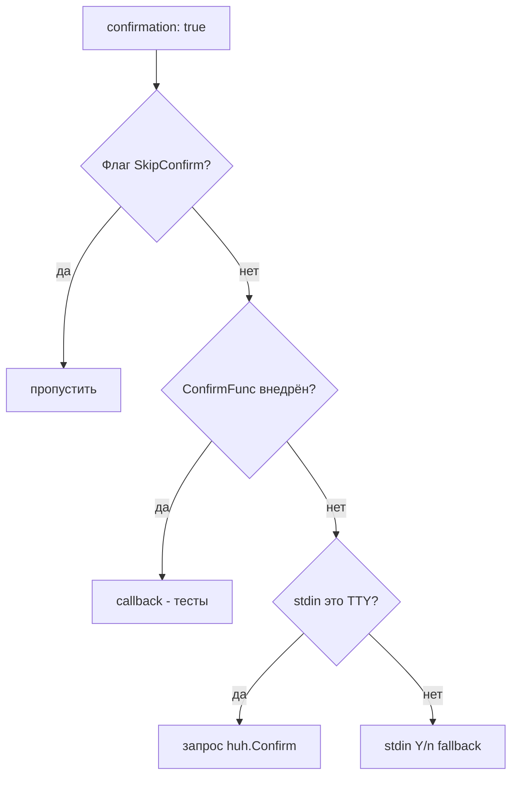

> Translated from: reference/config/commands/directives.md @ 2d0e1c7894ae

# Директивы команд

Директивы, общие для **всех** типов команд, если не указано иное. Директивы, специфичные для конкретных типов, перечислены в [types.md](types.md).

## Содержание

- [Идентичность и видимость](#идентичность-и-видимость)
- [Видимость через bridge](#видимость-через-bridge)
- [Подтверждение](#подтверждение)
- [Поток подтверждения](#поток-подтверждения)
- [Сообщения](#сообщения)
- [Уведомления](#уведомления)
- [Params](#params)
- [Виджеты параметров](#виджеты-параметров)
- [Сквозные аргументы](#сквозные-аргументы)
- [Вычисляемые аргументы (`argv_append_from`)](#вычисляемые-аргументы-argv_append_from)
- [Context](#context)
- [Env](#env)
- [Files](#files)

## Идентичность и видимость

| Поле | Тип | По умолчанию | Описание |
|-------|------|---------|-------------|
| `type` | enum | обязательно | Одно из `shell`, `dwe`, `script`, `service_exec`, `service_run`, `workflow`, `builtin`, `daemon` |
| `description` | string | — | Человекочитаемое описание, отображаемое в DWE CLI (селекторы, `commands list`, `commands -i`) |
| `private` | bool | `false` | Скрывает из `dwe commands list` и блокирует прямой `commands run`; всё ещё вызываема из сценариев и пайплайнов |
| `hide` | string | `""` | Выражение-условие. Когда вычисляется в truthy на runtime — команда трактуется как несуществующая: не отображается в `dwe commands`, completion и TUI; отклоняется при прямом вызове; шаги workflow, ссылающиеся на неё, авто-скипаются с `SkipReason="hidden"`. Синтаксис тот же, что у workflow `when:` — см. [Условие hide](#условие-hide) ниже. |
| `bridge` | block | отсутствует | Включает команду в контейнерную поверхность [host bridge](../../concepts/bridge.md) — без него команда host-only и невидима для in-container шима `dwe`. См. [Видимость через bridge](#видимость-через-bridge) ниже. |
| `notify` | bool | `false` | Отправить десктопное уведомление по завершении команды. См. [Уведомления](#уведомления) ниже. |

## Условие hide

`hide:` — это runtime-условие видимости, отличающееся от `private:`:

- `private:` — статичный developer-intent: команда всегда невидима конечным пользователям.
- `hide:` — per-invocation условие: команда видна, когда выражение falsy, и исчезает, когда truthy. Типовое применение — привязка команд к включённым сервисам.

Синтаксис выражения совпадает с workflow `when:` — поддерживает Go-шаблоны (`{{ ... }}`), подстановку переменных `${...}`, префикс `cmd:` для предикатов shell-команд и дефисные предикаты файловой системы вроде `file-exists` / `file-missing` / `dir-exists` (префикса `file:` не существует). Полную грамматику см. в [conditions](../conditions.md).

Правила каскада:

- `hide:` в блоке `group:` группы скрывает её целиком **и все потомки** (команды и подгруппы). Каскад односторонний: ребёнок не может явно вернуть видимость через `hide: false`. Если нужны исключения, реструктурируй группы.
- Когда шаг workflow ссылается на скрытую команду, шаг скипается на runtime с `SkipReason="hidden: <id>"` в stderr. Сам workflow продолжается нормально.

`dwe commands -i <id>` (inspect) работает и на скрытых командах — показывает выражение `hide:` и резолвленный `Hidden: true`, что удобно для отладки исчезновения команд.

```yaml
# workspace/services/db/commands.yml — исчезает, когда db выключен
group:
  title: База данных
  hide: '{{ not (index .services "db" "enabled") }}'

commands:
  migrate:
    type: shell
    cmd: db migrate
  # команда тоже может быть скрыта индивидуально:
  reset_engine:
    type: shell
    hide: '{{ eq (index .services "db" "engine") "sqlite" }}'
    cmd: db reset --engine
```

## Видимость через bridge

`bridge:` управляет тем, можно ли видеть и вызывать команду **изнутри контейнера** через шим [host bridge](../../concepts/bridge.md). По умолчанию действует opt-in: команда без блока `bridge:` где-либо — host-only: не видна в контейнерных листингах/completion и отклоняется при прямом вызове с ошибкой `command_not_bridged`.

| Поле | Тип | По умолчанию | Описание |
|------|-----|--------------|----------|
| `bridge.enabled` | bool | `false` | Включить команду в контейнерную поверхность. |
| `bridge.services` | list | все | Ограничить видимость контейнерами перечисленных сервисов (имена папок `workspace/services/<name>`). Отсутствует — наследуется от группы (или «все сервисы», если не задано нигде); явный `services: []` сбрасывает унаследованное ограничение обратно на все сервисы. |

Тот же блок допустим в заголовке `group:` файла — там он задаёт дефолт для всех команд файла. Наследование **пополевое**: незаданное поле команды наследует значение группы, заданное — переопределяет. Команда может выставить `enabled: false` под включающей группой или расширить/сузить `services` самостоятельно. Для `services` различие «отсутствует» / «пустой» значимо: пропущенное поле наследует список группы, а явный `services: []` — декларированный сброс на «все сервисы» (`dwe validate` помечает пустой список, чтобы намерение оставалось видимым).

```yaml
group:
  title: Code style
  bridge:
    enabled: true          # все команды файла…
    services: [main]       # …но только из контейнера main

commands:
  all:
    type: service_exec
    cmd: composer cs       # наследует: bridged, только main
  fix-deps:
    type: shell
    cmd: brew install something
    bridge:
      enabled: false       # host-only исключение
  report:
    type: service_exec
    cmd: composer cs:report
    bridge:
      services: [main, admin]   # расширено, enabled — от группы
```

Важная семантика:

- **Исполнение не гейтится.** Bridged-сценарий спокойно выполняет не-bridged подкоманды — гейт закрывает контейнерную *поверхность вызова*, а не то, что хост может выполнить по поручению контейнера.
- **Дети по `extends:` наследуют права родителя.** Матчинг идёт по цепочке [`extends:`](../services/extends.md) вызывающего сервиса: если `admin` расширяет `main`, команда со `services: [main]` видна и из контейнера `admin`. В обратную сторону не работает — запись `admin` не открывает доступ для `main`.
- **Никакой магии от `service:`.** Команда `service_exec`, нацеленная на `main`, не привязывается к контейнеру `main` автоматически; ограничение всегда явное, через `bridge.services`.
- **Идентичность вызывающего — advisory.** Шим сообщает свой сервис через `DWE_BRIDGE_SERVICE` (инжектится overlay-ем); контейнер может назваться чужим именем. `bridge.services` — UX-граница между контейнерами одного проекта; границей безопасности остаётся [верхнеуровневый allowlist команд](../../concepts/bridge.md#политика-команд-внутри-контейнеров) бриджа.
- `dwe validate` предупреждает, когда `bridge.services` ссылается на неизвестный сервис или на сервис с выключенным в `service.yml` бриджем (кроме случая, когда его расширяет bridge-enabled сервис — для таких детей запись продолжает работать).

## Подтверждение

| Поле | Тип | По умолчанию | Описание |
|-------|------|---------|-------------|
| `confirmation` | bool | `false` | Если true, запрашивать подтверждение пользователя перед выполнением |
| `confirmation_text` | string | `Are you sure?` | Текст запроса при `confirmation: true`; поддерживает шаблоны `${...}` |

Запрос обходится только если в процессном `RunContext` установлен `SkipConfirm`. Это происходит для:

- `commands --yes` / `-y`,
- дочерних шагов сценария, наследующих `SkipConfirm` от родителя, запущенного с `--yes`,
- вызовов в тестах, которые напрямую конструируют `RunContext{SkipConfirm: true}`.

Не-TTY stdin **не** пропускает запрос — он маршрутизируется через простой Y/n fallback (`render.Writer.Confirm`). Этот fallback автоматически отвечает «yes», если установлена переменная окружения `CI`; иначе любой ответ кроме `y` прерывает команду.

```yaml
db.drop:
  type: service_exec
  confirmation: true
  confirmation_text: "Drop database `${param.database}`?"
  ...
```

## Поток подтверждения

Каждая команда проходит ту же четырёхуровневую диспетчеризацию при `confirmation: true` (или для builtin/workflow-шагов `confirm`):



Операционные замечания:

- `commands --yes` устанавливает `SkipConfirm` и `NonInteractive` в процессном `RunContext`, так что каждый вызов confirm (верхнеуровневая команда, builtin `confirm`, confirm-шаги сценария) пропускает запрос на всё время вызова.
- Проброс env в подпроцесс **ограничен раннером скриптов**: `type: script` внедряет `DWE_NONINTERACTIVE=1` (вместе с `DWE_PARAMS_JSON`, `DWE_CONTEXT_JSON` и т. п.) в окружение скрипта. `type: shell` экспортирует меньший контракт — `DWE_BIN`, `COMPOSE_PROJECT_NAME`, `COMPOSE_FILE` (см. [Контракт env для shell](types.md#контракт-env-для-shell)) — но **не** `DWE_NONINTERACTIVE`. `type: dwe`, `service_exec` и `service_run` не экспортируют ничего из этого — пропуск подтверждения внутри них обеспечивается `RunContext`, под которым они запущены, а не окружением.
- Внутри сценария дочерние команды наследуют `NonInteractive` и `SkipConfirm` от родительского `RunContext`.
- Fallback для не-TTY — `render.Writer.Confirm`; при `CI=1` он автоматически подтверждает.

## Сообщения

| Поле | Тип | Описание |
|-------|------|-------------|
| `messages.success` | string | Выводится при успехе; поддерживает `${...}` и Go-шаблоны |
| `messages.error` | string | Выводится при неуспехе (в дополнение к собственной ошибке раннера) |

```yaml
messages:
  success: "Database `${param.database}` is ready."
  error: "Failed to create database `${param.database}`."
```

## Уведомления

`notify: true` включает команду в десктопное уведомление по её завершении (успех или неуспех). Уведомление срабатывает только когда **все** перечисленные условия истинны:

- `CommandDef` объявляет `notify: true` (по умолчанию `false`);
- команда — **верхнеуровневый** вызов, `dwe commands <id>`, набранный пользователем. Команды, вызванные транзитивно как подшаг сценария (последовательного или параллельного), из действия пайплайна деплоя или из действия пайплайна reset, **всегда подавляются во время выполнения** независимо от их собственного значения `notify:`;
- пользовательский главный переключатель `notify_enabled` и поканальный гейт `notify_commands_enabled` оба истинны;
- окружение интерактивное (не CI / `DWE_NONINTERACTIVE` / не-TTY).

Правило: «уведомление срабатывает для команды, которую вы набрали, а не для любых команд, которые она запускает внутри».

```yaml
db.import:
  type: script
  notify: true            # fires once when `dwe commands db.import` finishes
  script:
    path: workspace/scripts/db-import.sh
```

Правила валидации:

- `notify: true` на команде `type: daemon` — **ошибка валидатора**: у демонов нет события завершения, поэтому уведомления бессмысленны. Уберите `notify:` или смените тип.
- `notify: true` на прямом подшаге внутри блока `parallel:` создаёт **info**-диагностику — это чисто раннее предупреждение, так как runtime в любом случае его подавляет. Сделайте команду верхнеуровневой, если хотите уведомление.

Полный справочник: [Уведомления](../notifications.md) — пользовательские ключи конфига, расположения файлов, матрица гейтов, переопределения через переменные окружения.

## Params

`params:` объявляет типизированные входы, которые команда принимает через `--set key=value` или через `with:` из шага сценария / деплоя.

```yaml
params:
  database:
    type: string                # string (default), bool, int, path
    description: Database name to create
    required: true
    default: "laravel"          # literal fallback
    default_from: vars.db.database   # dot-path into merged config
    env: DB_NAME                # injected as env var
    pattern: ^[a-zA-Z0-9_-]+$   # anchored regex (string/path only)
```

| Поле | Тип | Описание |
|-------|------|-------------|
| `type` | enum | `string` (по умолчанию), `bool`, `int`, `path` |
| `description` | string | Человекочитаемое описание, отображаемое в DWE CLI (справка по параметру в селекторах и `commands -i`) |
| `required` | bool | Ошибка, если значение не передано и не разрешается default |
| `default_from` | string | Точечный путь в объединённый DWE-конфиг; предпочтительный источник для default |
| `default` | string | Литеральный fallback, используемый когда ничто иное не разрешилось |
| `env` | string | Если задано, разрешённое значение экспортируется под этим env-именем |
| `pattern` | string | Якорный regex, которому разрешённое значение должно полностью соответствовать (только string/path) |

Порядок разрешения:


Источник `default_from`, управляемый конфигом, является предпочтительным — это соответствует стандартному паттерну «конфиг побеждает, код даёт страховочную сетку» и позволяет переопределениям в `local.yml` доходить до команд без переписывания их литеральных default. Пустая строка, возвращённая `default_from`, трактуется как «не найдено», так что литеральный `default` по-прежнему работает как настоящая страховочная сетка.

## Виджеты параметров

Параметры могут объявлять **тип виджета**, чтобы управлять тем, как они представляются в интерактивной форме, и список **опций**, направляющий пользователя к корректным выборам. Это особенно полезно, когда корректные варианты хранятся в вашем dwe-конфиге и вы хотите, чтобы форма оставалась синхронизированной без дублирования списка в файле команды.

```yaml
params:
  # Static list of options
  format:
    type: string
    widget: select
    description: Output format
    options: [json, yaml, toml]

  # List with custom labels
  driver:
    type: string
    widget: select
    description: Database driver
    options:
      - { value: pg,    label: "PostgreSQL 16" }
      - { value: mysql, label: "MySQL 8" }

  # Dynamic options from config (e.g., defaults.yml or local.yml)
  database:
    type: string
    widget: select
    description: Database to use
    options: ${vars.databases}
    default_from: vars.default_db

  # Multiple selections
  services:
    type: string
    widget: multiselect
    description: Services to enable
    options: ${vars.services_list}
    separator: ","
```

| Поле | Тип | По умолчанию | Описание |
|-------|------|---------|-------------|
| `widget` | enum | выводится из `type` | Одно из `input`, `select`, `multiselect`, `confirm`. Выводится как `confirm` для `bool`; `select` если присутствует `options`; `input` для string/int/path без options |
| `options` | список или ссылка | — | Статический список значений-опций, список объектов `{value, label}`, либо ссылка-точечный путь в конфиг (например, `${vars.databases}`) |
| `separator` | string | `" "` | Разделитель для склейки результатов multiselect; используется только при `widget: multiselect` |

Рендеринг виджета:

- **`input`** — текстовое поле; пользователь вводит свободно. Используется для string/int/path без `options`.
- **`select`** — одиночный выбор из списка/меню. Используется когда доступны `options` и нужно выбрать ровно один вариант.
- **`multiselect`** — множественный выбор; выбранные элементы соединяются разделителем `separator` в строку. По умолчанию значения разделены пробелами или вашим пользовательским `separator`.
- **`confirm`** — запрос yes/no. Используется для параметров `bool`; разрешённое значение — либо `"true"`, либо `"false"`.

Разрешение options:

- **Статический список** (`options: [a, b, c]`) — список литеральный.
- **Опции с метками** (`options: [{value: x, label: X}, ...]`) — value используется внутренне, label показывается пользователю.
- **Ссылка на конфиг** (`options: ${vars.databases}`) — форма разрешает точечный путь из вашего объединённого конфига (workspace.yml + defaults.yml + local.yml) во время выполнения. Разрешённое значение может быть скалярным списком (`[a, b, c]`) или картой (`{x: X, y: Y}` → опции с value=ключ, label=значение). Пустые или отсутствующие ссылки ловятся с понятной ошибкой при попытке открыть форму.

Валидация:

- `options` и `pattern` взаимоисключающи — выберите одно или другое.
- Для `select` или `multiselect` поле `options` должно присутствовать и быть непустым (статически либо разрешимо из конфига).
- Значение `default_from` или `default` должно существовать в разрешённом списке options, иначе команда выдаст ошибку при попытке запуска.
- `--set key=value` с некорректным выбором (не из options) выдаст ошибку, если только `options` не разрешилось в пустое — в этом случае вы можете обойти валидацию и подставить явное переопределение.

## Сквозные аргументы

Всё, что вызывающий написал после `--`, предлагается команде как `${args}`:

```sh
dwe cmd site.test -- --run src/map/engine.test.ts
```

Это **включается отдельно у каждой команды**. Команда получает аргументы только
если называет `${args}` в своём `cmd:` или `argv:`; та, что не называет,
отвергается с ошибкой, где указаны имя команды и однострочная правка, дающая ей
такое право. Безопасного места для подстановки по умолчанию не существует:
`npm test <файлы>` требует `--`, который npm иначе съест сам; `go test -race
./... <пакет>` назвал бы два набора пакетов; а многострочному shell-скрипту
аргументы прилепились бы к последней строке.

Допустимо для `shell`, `dwe`, `service_exec` и `service_run` — типов, у которых
есть `cmd:`/`argv:` для подстановки. У `script`, `workflow`, `builtin` и `daemon`
их нет, поэтому сквозные аргументы они принять не могут.

### Место подстановки

В строке `cmd:` слот `${args}` превращается в **`"$@"`**, а сами аргументы
передаются shell как позиционные параметры. В текст программы они не попадают
вовсе, поэтому ничто внутри аргумента не может изменить структуру команды: имя
файла с пробелом остаётся одним аргументом, а `;`, обратные кавычки и `$(…)`
остаются буквальным текстом.

Пишите слот **без кавычек** — `${args}`, а не `"${args}"` или `'${args}'`. Он уже
разворачивается в корректно закавыченное `"$@"`, поэтому собственная пара кавычек
вкладывается неудачно, и обе записи **отвергаются при загрузке**:

| Вы пишете | Развернулось бы в | Что это делает |
| --- | --- | --- |
| `'${args}'` | `'"$@"'` | один буквальный четырёхсимвольный аргумент; все аргументы вызывающего теряются |
| `"${args}"` | `""$@""` | `$@` оказывается *без кавычек*: аргументы разбиваются по пробелам, а содержащий `*` или `?` попадает под развёртку имён файлов (`-- '*.txt'` дойдёт подходящими именами файлов, а не шаблоном). А при полном отсутствии аргументов схлопывается в один пустой аргумент — `npm test ""` это не `npm test`. |

Проверка ищет именно пару кавычек вокруг самого слота; кавычки в других местах
команды не трогаются (`printf "%s\n" ${args}` — нормально). Слот внутри более
длинного закавыченного фрагмента текстуально не определить, и он остаётся на
вашей ответственности.

Два места молча теряют аргументы, потому что `"$@"` привязано к текущим
позиционным параметрам shell:

- **внутри тела shell-функции** — там `$@` это аргументы *функции*, поэтому слот,
  написанный внутри тела, развернётся в пустоту. Либо держите слот на верхнем
  уровне, либо пробрасывайте явно: пишите `"$@"` сами в месте вызова, а слот
  ставьте снаружи функции (`f() { … "$@"; }; f ${args}`).
- **после `set --`** — этот оператор заменяет позиционные параметры, поэтому слот
  ниже по скрипту получит значения самого скрипта. Ставьте слот до `set --`.

Исполнить что-либо ни один из случаев не может — теряется аргумент, а не
внедряется чужой, — но и не сообщает о себе, поэтому в многострочном `cmd:`
с такими конструкциями слот надо размещать осознанно.

```yaml
test:
  type: service_exec
  service: site
  cmd: "npm test ${args}"
```

В векторе `argv:` элемент, равный **ровно** `${args}`, разворачивается
поэлементно — там аргументы уже отдельные записи и повторно экранировать их
нельзя. Пустой набор разворачивается в ничто, поэтому элемент исчезает, а не
оставляет после себя пустой аргумент:

```yaml
test:
  type: service_exec
  service: backend
  argv: [go, test, -count=1, -race, "${args}"]
```

Элемент, который лишь *содержит* токен (`--filter=${args}`), **отвергается на
загрузке**: элемент argv никто повторно не разбивает, поэтому получился бы один
искажённый аргумент.

### Блок `args:`

Необязателен и осмыслен только рядом со ссылкой `${args}` — объявленный без неё,
он сообщается как бездействующий.

| Поле | Тип | Описание |
|------|-----|----------|
| `default` | список | Подставляется, когда вызывающий **не** передал аргументов |
| `prefix` | список | Вставляется непосредственно перед аргументами вызывающего и **только** если они есть |

Асимметрия намеренная. `default` нужен команде, у которой слот аргументов не
опционален — `argv: [go, test, -race, "${args}"]` обязан откатываться к `./...`,
иначе протестирует текущий каталог вместо модуля. `prefix` несёт разделитель,
которым обёртка передаёт флаги нижележащему инструменту, и для `default` не
выводится (голый вызов не должен давать `npm test --`).

```yaml
# site: npm съедает голый --run, флагам вызывающего нужен свой --
test:
  cmd: "npm test ${args}"
  args:
    prefix: ["--"]

# backend: список пакетов обязателен, пустому вызову нужен запасной
test:
  argv: [go, test, -count=1, -race, "${args}"]
  args:
    default: ["./..."]
```

```sh
dwe cmd site.test -- --run x.test.ts   # → npm test -- --run x.test.ts
dwe cmd site.test                      # → npm test
dwe cmd backend.test -- ./internal/api # → go test -count=1 -race ./internal/api
dwe cmd backend.test                   # → go test -count=1 -race ./...
```

`dwe cmd -i <id>` сообщает, принимает ли команда сквозные аргументы и какие
prefix/default действуют.

## Вычисляемые аргументы (`argv_append_from`)

`argv_append_from` — это shell-выражение, **строки stdout которого дописываются
в `argv:` отдельными элементами**, по одному на строку. Так команда вычисляет
собственный список аргументов — список staged-файлов для линтера, изменившиеся
пакеты для тестов — не перестраивая раннер вокруг себя.

```yaml
quality.staged:
  type: service_exec
  service: backend
  argv: [ruff, check]
  argv_append_from: "git diff --cached --name-only --diff-filter=ACM -- '*.py'"
```

`dwe cmd quality.staged` тогда запустит `ruff check a.py b.py` внутри
контейнера. Без этого поля то же самое — это ~40 строк bash, вручную
пересобирающих `docker compose exec`, потому что список файлов надо вычислить на
хосте, а команду выполнить в контейнере.

**Где выполняется выражение.** На **хосте**, через настроенный проектом shell
(`binaries.shell`), даже для команды `service_exec` / `service_run`, тело
которой идёт в контейнере. Оно вычисляет список аргументов, а не выполняет
работу в контейнере. Рабочий каталог — **корень проекта** (не `workdir:`,
который для сервисной команды указывает путь внутри контейнера), поэтому
относительные пути означают одно и то же независимо от каталога, из которого
вызван `dwe`.

**Вывод — это данные, а не текст программы.** stdout разбивается по переводам
строки, и каждая строка становится одним элементом argv байт в байт: имя файла с
пробелами, кавычками или `$(…)` остаётся одним аргументом и никогда не
переразбирается shell'ом. Завершающий перевод строки игнорируется (пустого
последнего элемента не будет), пустые строки отбрасываются — ни один аргумент,
который несёт это поле, не является пустой строкой, а случайная `""` в argv
молча меняет поведение инструмента. stdout захватывается; **stderr идёт
пользователю**, так что упавшее выражение объясняет себя само. stdin не
подключён: выражение не должно потреблять ввод пользователя.

**Пустой вывод пропускает команду** — ничего не выполняется, код возврата 0, в
stderr печатается пометка. Это осознанный выбор вместо «запустить без
дополнительных аргументов»: `ruff check` с пустым списком файлов линтит всё
дерево — ровно противоположное намерению. Пропущенная команда не печатает
`messages.success`, не шлёт desktop-уведомление, а её объявленные файловые
эффекты откатываются точно так же, как на пути ошибки.

> В пайплайне как шаг `type: command` пропуск журналируется как **успех** —
> значит следующий деплой пропустит шаг по хешу, даже если список уже не пуст.
> Дайте такому шагу `files_gate:` или `check:` (см.
> [deploy/conditions.md](../deploy/conditions.md)).

**Порядок относительно `${args}`.** Сначала объявленный `argv:` с уже
подставленным на своё место `${args}`, затем вычисленные элементы:

```yaml
# argv: [ruff, check, "${args}"] + `-- --fix` + два изменённых файла
#   → ruff check --fix a.py b.py
```

**Правила поля** (все проверяются во время загрузки):

| Правило | Причина |
|---|---|
| Допустимо только для `shell`, `service_exec`, `service_run` | типы, которые строят вектор аргументов |
| Требует `argv:`; отвергается вместе с `cmd:` | дописывание к shell-строке вклеило бы вычисленные значения в текст программы |
| Отвергается для `type: daemon` | daemon разворачивает свой `argv` в синтетическую команду `.start`, где «пусто → пропуск» читалось бы как молчаливый отказ запустить демона |
| Литеральный `${args}` внутри выражения отвергается | сквозные аргументы передаются позиционными параметрами и намеренно не видны здесь; ссылайтесь на них из `argv:` |

`${param.*}`, `${vars.*}`, `${files.*}` и остальное шаблонное пространство
команд рендерятся в выражении ровно так же, как в `cmd:`.

`dwe cmd -i <id>` показывает это поле, как и генерируемая документация команд
(`dwe docs generate`).

## Context

`context:` объявляет значения, извлекаемые из объединённого DWE-конфига и доступные команде для шаблонизации и (опционально) как env-переменные. В отличие от params, значения context не переопределяемы пользователем — они всегда приходят из конфига.

```yaml
context:
  internal_workdir:
    from: services.main.work_dir_internal
    required: true
    env: APP_WORKDIR
```

| Поле | Тип | Описание |
|-------|------|-------------|
| `from` | string | Точечный путь в объединённый `DweConfig.Raw` |
| `required` | bool | Ошибка, если путь разрешается в nil или пустую строку |
| `env` | string | Опциональное имя env-переменной для внедрения |

## Env

`env:` — свободная карта env-переменных, добавляемых прямо в дочерний процесс. Значения поддерживают полный синтаксис `${...}` и Go-шаблонов.

```yaml
env:
  MYSQL_PWD: "${vars.db.password}"
  TIMESTAMP: "{{ now | date \"2006-01-02_15-04-05\" }}"
  NON_INTERACTIVE: "{{ if .Params.no_prompt }}1{{ else }}0{{ end }}"
```

Каждое имя env-переменной должно быть объявлено ровно один раз среди `context.<key>.env`, `params.<key>.env`, `files.<id>.env` и блока `env:` — дублирование имени между любыми из этих источников отвергается на этапе загрузки (нет переопределения/приоритета, коллизии — это ошибки).

## Files

`files:` объявляет внешние файловые артефакты, которые команда читает или производит. CLI разрешает пути, опционально создаёт родительские директории, открывает их через `${files.<id>.path}` и как env-переменные, а также безопасно вычищает неудачные записи.

Объявленная здесь файловая спецификация — **единственный источник истины** для условного деплоя: используйте `files_gate:` в `deploy.yml` / `lifecycle.yml` / `reset.yml`, чтобы пропускать или выполнять шаги в зависимости от существования этих самых файлов. Подробности см. в [files_gate: (предусловие по файлам)](../deploy/conditions.md#files_gate-предусловие-по-файлам) в справочнике по деплою.

```yaml
files:
  dump:
    access: write
    path: "${param.dump_dir}/${param.database}_{{ now | date \"2006-01-02\" }}.sql.gz"
    mkdir: true
    overwrite: true
    on_error: remove
    env: DUMP_FILE
```

### Грамматика File ID

File ID должны соответствовать `^[a-zA-Z_][a-zA-Z0-9_]*$` — буквы, цифры, подчёркивание. Без дефисов и точек.

### Поля файловой спецификации

| Поле | Тип | Описание |
|-------|------|-------------|
| `access` | enum | `read`, `write`, `read_write` (обязательно) |
| `path` | string | Литеральный путь (взаимоисключающий с `candidates`). Обязателен для `write`. |
| `candidates` | список | Упорядоченный fallback-список (только read/read_write) |
| `required` | bool | Для `read`: ошибка, если не найдено. Для `read_write`: всегда требуется. |
| `mkdir` | bool | Создавать родительские директории перед записью (только write) |
| `overwrite` | bool | Разрешить замену существующего файла (только write) |
| `on_error` | enum | `keep` (по умолчанию) или `remove` (только write/read_write) |
| `env` | string | Внедрить разрешённый абсолютный путь в эту env-переменную |

### Candidate fallback

`candidates` — список. Каждая запись — либо литеральный путь, либо glob с опциональным regex-совпадением и сортировкой.

```yaml
files:
  dump:
    access: read
    candidates:
      - glob: "${param.dump_dir}/${param.database}_*.sql.gz"
        match: '\d{4}-\d{2}-\d{2}'   # regex on basename
        sort: name_desc              # name_asc | name_desc | modtime_asc | modtime_desc
      - path: "${param.dump_dir}/${param.database}.sql.gz"
    required: true
    env: DUMP_FILE
```

CLI обходит `candidates` по порядку, беря первый разрешившийся. Для glob-записей совпадения фильтруются по `match` (regex по basename) и сортируются, затем побеждает первое отсортированное совпадение.

### Режимы доступа

| Режим | Предварительное существование | Допустимые поля | Поведение |
|------|---------------|----------------|----------|
| `read` | проверяется при `required: true` | `path` или `candidates` | Файл должен существовать (или быть опциональным) |
| `write` | не проверяется | `path`, `mkdir`, `overwrite`, `on_error` | Файл создаётся/перезаписывается |
| `read_write` | всегда проверяется | `path` или `candidates`, `on_error` | Файл должен существовать; может быть изменён |

Безопасность очистки: `on_error: remove` удаляет только файлы, которые **не** существовали до вызова. Предсуществующие файлы никогда не удаляются cleanup-ом при ошибке, даже в режиме `read_write`.

### Шаблонизация в путях файлов

`path`, `candidates[].path`, `candidates[].glob` и `candidates[].match` все поддерживают шаблоны. Они рендерятся до проверок существования. Разрешённые пути становятся доступны для последующих шаблонов через `${files.<id>.path}` (в `confirmation_text`, `cmd`, `argv`, `workdir`, `env:` и т. д.).
