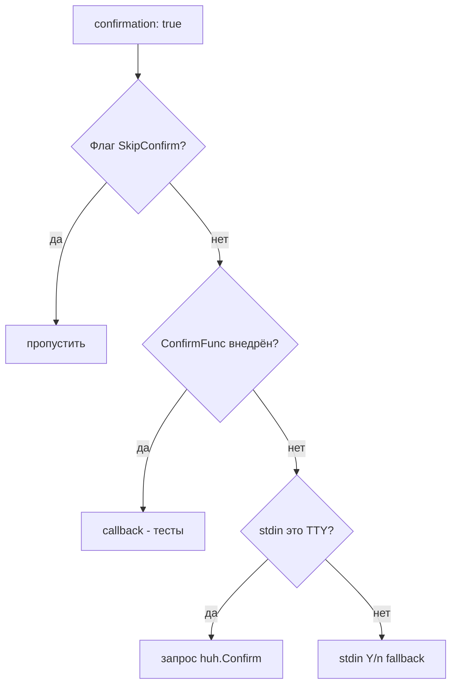
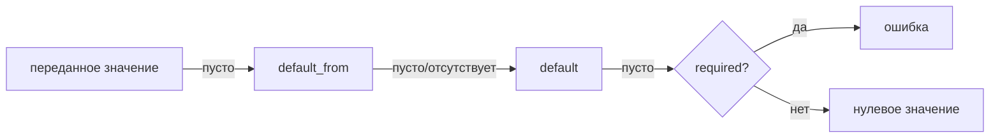

> Translated from: reference/config/commands/directives.md @ f7ecd310ec7f

# Директивы команд

Директивы, общие для **всех** типов команд, если не указано иное. Директивы, специфичные для конкретных типов, перечислены в [types.md](types.md).

## Содержание

- [Идентичность и видимость](#идентичность-и-видимость)
- [Подтверждение](#подтверждение)
- [Поток подтверждения](#поток-подтверждения)
- [Сообщения](#сообщения)
- [Уведомления](#уведомления)
- [Params](#params)
- [Виджеты параметров](#виджеты-параметров)
- [Context](#context)
- [Env](#env)
- [Files](#files)

## Идентичность и видимость

| Поле | Тип | По умолчанию | Описание |
|-------|------|---------|-------------|
| `type` | enum | обязательно | Одно из `shell`, `devbox`, `script`, `service_exec`, `service_run`, `workflow`, `builtin`, `daemon` |
| `description` | string | — | Человекочитаемое описание, отображаемое в devbox CLI (селекторы, `commands list`, `commands inspect`) |
| `private` | bool | `false` | Скрывает из `devbox commands list` и блокирует прямой `commands run`; всё ещё вызываема из сценариев и пайплайнов |
| `notify` | bool | `false` | Отправить десктопное уведомление по завершении команды. См. [Уведомления](#уведомления) ниже. |

## Подтверждение

| Поле | Тип | По умолчанию | Описание |
|-------|------|---------|-------------|
| `confirmation` | bool | `false` | Если true, запрашивать подтверждение пользователя перед выполнением |
| `confirmation_text` | string | `Are you sure?` | Текст запроса при `confirmation: true`; поддерживает шаблоны `${...}` |

Запрос обходится только если в процессном `RunContext` установлен `SkipConfirm`. Это происходит для:

- `commands --yes` / `-y`,
- дочерних шагов сценария, наследующих `SkipConfirm` от родителя, запущенного с `--yes`,
- вызовов в тестах, которые напрямую конструируют `RunContext{SkipConfirm: true}`.

Не-TTY stdin **не** пропускает запрос — он маршрутизируется через простой Y/n fallback (`render.Writer.Confirm`). Этот fallback автоматически отвечает «yes», если установлена переменная окружения `CI`; иначе любой ответ кроме `y` прерывает команду.

```yaml
db.drop:
  type: service_exec
  confirmation: true
  confirmation_text: "Drop database `${param.database}`?"
  ...
```

## Поток подтверждения

Каждая команда проходит ту же четырёхуровневую диспетчеризацию при `confirmation: true` (или для builtin/workflow-шагов `confirm`):



Операционные замечания:

- `commands --yes` устанавливает `SkipConfirm` и `NonInteractive` в процессном `RunContext`, так что каждый вызов confirm (верхнеуровневая команда, builtin `confirm`, confirm-шаги сценария) пропускает запрос на всё время вызова.
- Проброс env в подпроцесс **ограничен раннером скриптов**: `type: script` внедряет `DEVBOX_NONINTERACTIVE=1` (вместе с `DEVBOX_PARAMS_JSON`, `DEVBOX_CONTEXT_JSON` и т. п.) в окружение скрипта. `type: shell` экспортирует меньший контракт — `DEVBOX_BIN`, `COMPOSE_PROJECT_NAME`, `COMPOSE_FILE` (см. [Контракт env для shell](types.md)) — но **не** `DEVBOX_NONINTERACTIVE`. `type: devbox`, `service_exec` и `service_run` не экспортируют ничего из этого — пропуск подтверждения внутри них обеспечивается `RunContext`, под которым они запущены, а не окружением.
- Внутри сценария дочерние команды наследуют `NonInteractive` и `SkipConfirm` от родительского `RunContext`.
- Fallback для не-TTY — `render.Writer.Confirm`; при `CI=1` он автоматически подтверждает.

## Сообщения

| Поле | Тип | Описание |
|-------|------|-------------|
| `messages.success` | string | Выводится при успехе; поддерживает `${...}` и Go-шаблоны |
| `messages.error` | string | Выводится при неуспехе (в дополнение к собственной ошибке раннера) |

```yaml
messages:
  success: "Database `${param.database}` is ready."
  error: "Failed to create database `${param.database}`."
```

## Уведомления

`notify: true` включает команду в десктопное уведомление по её завершении (успех или неуспех). Уведомление срабатывает только когда **все** перечисленные условия истинны:

- `CommandDef` объявляет `notify: true` (по умолчанию `false`);
- команда — **верхнеуровневый** вызов, `devbox commands <id>`, набранный пользователем. Команды, вызванные транзитивно как подшаг сценария (последовательного или параллельного), из действия пайплайна деплоя или из действия пайплайна reset, **всегда подавляются во время выполнения** независимо от их собственного значения `notify:`;
- пользовательский главный переключатель `notify_enabled` и поканальный гейт `notify_commands_enabled` оба истинны;
- окружение интерактивное (не CI / `DEVBOX_NONINTERACTIVE` / не-TTY).

Правило: «уведомление срабатывает для команды, которую вы набрали, а не для любых команд, которые она запускает внутри».

```yaml
db.import:
  type: script
  notify: true            # fires once when `devbox commands db.import` finishes
  script:
    inline: ...
```

Правила валидации:

- `notify: true` на команде `type: daemon` — **ошибка валидатора**: у демонов нет события завершения, поэтому уведомления бессмысленны. Уберите `notify:` или смените тип.
- `notify: true` на прямом подшаге внутри блока `parallel:` создаёт **info**-диагностику — это чисто раннее предупреждение, так как runtime в любом случае его подавляет. Сделайте команду верхнеуровневой, если хотите уведомление.

Полный справочник: [Уведомления](../notifications.md) — пользовательские ключи конфига, расположения файлов, матрица гейтов, переопределения через переменные окружения.

## Params

`params:` объявляет типизированные входы, которые команда принимает через `--set key=value` или через `with:` из шага сценария / деплоя.

```yaml
params:
  database:
    type: string                # string (default), bool, int, path
    description: Database name to create
    required: true
    default: "laravel"          # literal fallback
    default_from: db.database   # dot-path into merged config
    env: DB_NAME                # injected as env var
    pattern: ^[a-zA-Z0-9_-]+$   # anchored regex (string/path only)
```

| Поле | Тип | Описание |
|-------|------|-------------|
| `type` | enum | `string` (по умолчанию), `bool`, `int`, `path` |
| `description` | string | Человекочитаемое описание, отображаемое в devbox CLI (справка по параметру в селекторах и `commands inspect`) |
| `required` | bool | Ошибка, если значение не передано и не разрешается default |
| `default_from` | string | Точечный путь в объединённый devbox-конфиг; предпочтительный источник для default |
| `default` | string | Литеральный fallback, используемый когда ничто иное не разрешилось |
| `env` | string | Если задано, разрешённое значение экспортируется под этим env-именем |
| `pattern` | string | Якорный regex, которому разрешённое значение должно полностью соответствовать (только string/path) |

Порядок разрешения:



Источник `default_from`, управляемый конфигом, является предпочтительным — это соответствует стандартному паттерну «конфиг побеждает, код даёт страховочную сетку» и позволяет переопределениям в `local.yml` доходить до команд без переписывания их литеральных default. Пустая строка, возвращённая `default_from`, трактуется как «не найдено», так что литеральный `default` по-прежнему работает как настоящая страховочная сетка.

## Виджеты параметров

Параметры могут объявлять **тип виджета**, чтобы управлять тем, как они представляются в интерактивной форме, и список **опций**, направляющий пользователя к корректным выборам. Это особенно полезно, когда корректные варианты хранятся в вашем devbox-конфиге и вы хотите, чтобы форма оставалась синхронизированной без дублирования списка в файле команды.

```yaml
params:
  # Static list of options
  format:
    type: string
    widget: select
    description: Output format
    options: [json, yaml, toml]

  # List with custom labels
  driver:
    type: string
    widget: select
    description: Database driver
    options:
      - { value: pg,    label: "PostgreSQL 16" }
      - { value: mysql, label: "MySQL 8" }

  # Dynamic options from config (e.g., defaults.yml or local.yml)
  database:
    type: string
    widget: select
    description: Database to use
    options: ${databases}
    default_from: config.default_db

  # Multiple selections
  services:
    type: string
    widget: multiselect
    description: Services to enable
    options: ${services_list}
    separator: ","
```

| Поле | Тип | По умолчанию | Описание |
|-------|------|---------|-------------|
| `widget` | enum | выводится из `type` | Одно из `input`, `select`, `multiselect`, `confirm`. Выводится как `confirm` для `bool`; `select` если присутствует `options`; `input` для string/int/path без options |
| `options` | список или ссылка | — | Статический список значений-опций, список объектов `{value, label}`, либо ссылка-точечный путь в конфиг (например, `${databases}`) |
| `separator` | string | `" "` | Разделитель для склейки результатов multiselect; используется только при `widget: multiselect` |

Рендеринг виджета:

- **`input`** — текстовое поле; пользователь вводит свободно. Используется для string/int/path без `options`.
- **`select`** — одиночный выбор из списка/меню. Используется когда доступны `options` и нужно выбрать ровно один вариант.
- **`multiselect`** — множественный выбор; выбранные элементы соединяются разделителем `separator` в строку. По умолчанию значения разделены пробелами или вашим пользовательским `separator`.
- **`confirm`** — запрос yes/no. Используется для параметров `bool`; разрешённое значение — либо `"true"`, либо `"false"`.

Разрешение options:

- **Статический список** (`options: [a, b, c]`) — список литеральный.
- **Опции с метками** (`options: [{value: x, label: X}, ...]`) — value используется внутренне, label показывается пользователю.
- **Ссылка на конфиг** (`options: ${databases}`) — форма разрешает точечный путь из вашего объединённого конфига (devbox.yml + defaults.yml + local.yml) во время выполнения. Разрешённое значение может быть скалярным списком (`[a, b, c]`) или картой (`{x: X, y: Y}` → опции с value=ключ, label=значение). Пустые или отсутствующие ссылки ловятся с понятной ошибкой при попытке открыть форму.

Валидация:

- `options` и `pattern` взаимоисключающи — выберите одно или другое.
- Для `select` или `multiselect` поле `options` должно присутствовать и быть непустым (статически либо разрешимо из конфига).
- Значение `default_from` или `default` должно существовать в разрешённом списке options, иначе команда выдаст ошибку при попытке запуска.
- `--set key=value` с некорректным выбором (не из options) выдаст ошибку, если только `options` не разрешилось в пустое — в этом случае вы можете обойти валидацию и подставить явное переопределение.

## Context

`context:` объявляет значения, извлекаемые из объединённого devbox-конфига и доступные команде для шаблонизации и (опционально) как env-переменные. В отличие от params, значения context не переопределяемы пользователем — они всегда приходят из конфига.

```yaml
context:
  internal_workdir:
    from: services.main.work_dir_internal
    required: true
    env: APP_WORKDIR
```

| Поле | Тип | Описание |
|-------|------|-------------|
| `from` | string | Точечный путь в объединённый `DevboxConfig.Raw` |
| `required` | bool | Ошибка, если путь разрешается в nil или пустую строку |
| `env` | string | Опциональное имя env-переменной для внедрения |

## Env

`env:` — свободная карта env-переменных, добавляемых прямо в дочерний процесс. Значения поддерживают полный синтаксис `${...}` и Go-шаблонов.

```yaml
env:
  MYSQL_PWD: "${db.password}"
  TIMESTAMP: "{{ now | date \"2006-01-02_15-04-05\" }}"
  NON_INTERACTIVE: "{{ if .Params.no_prompt }}1{{ else }}0{{ end }}"
```

Порядок разрешения, когда одно и то же env-имя объявлено в нескольких местах:

1. `context.<key>.env`
2. `params.<key>.env`
3. `files.<id>.env`
4. Блок `env:` (высший приоритет)

Дублирование имени между любыми из этих источников отвергается на этапе загрузки — объявляйте каждую env-переменную ровно один раз.

## Files

`files:` объявляет внешние файловые артефакты, которые команда читает или производит. CLI разрешает пути, опционально создаёт родительские директории, открывает их через `${files.<id>.path}` и как env-переменные, а также безопасно вычищает неудачные записи.

Объявленная здесь файловая спецификация — **единственный источник истины** для условного деплоя: используйте `files_gate:` в `deploy.yml` / `lifecycle.yml` / `reset.yml`, чтобы пропускать или выполнять шаги в зависимости от существования этих самых файлов. Подробности см. в [files_gate: (предусловие для files)](../deploy/conditions.md) в справочнике по деплою.

```yaml
files:
  dump:
    access: write
    path: "${param.dump_dir}/${param.database}_{{ now | date \"2006-01-02\" }}.sql.gz"
    mkdir: true
    overwrite: true
    on_error: remove
    env: DUMP_FILE
```

### Грамматика File ID

File ID должны соответствовать `^[a-zA-Z_][a-zA-Z0-9_]*$` — буквы, цифры, подчёркивание. Без дефисов и точек.

### Поля файловой спецификации

| Поле | Тип | Описание |
|-------|------|-------------|
| `access` | enum | `read`, `write`, `read_write` (обязательно) |
| `path` | string | Литеральный путь (взаимоисключающий с `candidates`). Обязателен для `write`. |
| `candidates` | список | Упорядоченный fallback-список (только read/read_write) |
| `required` | bool | Для `read`: ошибка, если не найдено. Для `read_write`: всегда требуется. |
| `mkdir` | bool | Создавать родительские директории перед записью (только write) |
| `overwrite` | bool | Разрешить замену существующего файла (только write) |
| `on_error` | enum | `keep` (по умолчанию) или `remove` (только write/read_write) |
| `env` | string | Внедрить разрешённый абсолютный путь в эту env-переменную |

### Candidate fallback

`candidates` — список. Каждая запись — либо литеральный путь, либо glob с опциональным regex-совпадением и сортировкой.

```yaml
files:
  dump:
    access: read
    candidates:
      - glob: "${param.dump_dir}/${param.database}_*.sql.gz"
        match: '\d{4}-\d{2}-\d{2}'   # regex on basename
        sort: name_desc              # name_asc | name_desc | modtime_asc | modtime_desc
      - path: "${param.dump_dir}/${param.database}.sql.gz"
    required: true
    env: DUMP_FILE
```

CLI обходит `candidates` по порядку, беря первый разрешившийся. Для glob-записей совпадения фильтруются по `match` (regex по basename) и сортируются, затем побеждает первое отсортированное совпадение.

### Режимы доступа

| Режим | Предварительное существование | Допустимые поля | Поведение |
|------|---------------|----------------|----------|
| `read` | проверяется при `required: true` | `path` или `candidates` | Файл должен существовать (или быть опциональным) |
| `write` | не проверяется | `path`, `mkdir`, `overwrite`, `on_error` | Файл создаётся/перезаписывается |
| `read_write` | всегда проверяется | `path` или `candidates`, `on_error` | Файл должен существовать; может быть изменён |

Безопасность очистки: `on_error: remove` удаляет только файлы, которые **не** существовали до вызова. Предсуществующие файлы никогда не удаляются cleanup-ом при ошибке, даже в режиме `read_write`.

### Шаблонизация в путях файлов

`path`, `candidates[].path`, `candidates[].glob` и `candidates[].match` все поддерживают шаблоны. Они рендерятся до проверок существования. Разрешённые пути становятся доступны для последующих шаблонов через `${files.<id>.path}` (в `confirmation_text`, `cmd`, `argv`, `workdir`, `env:` и т. д.).
