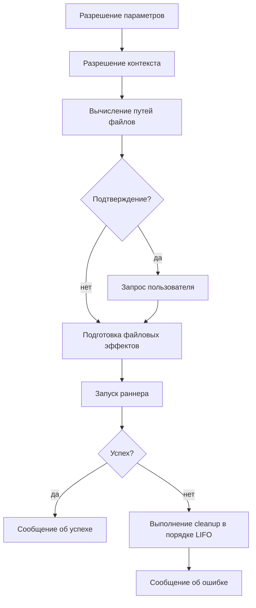

> Translated from: reference/config/commands/index.md @ 055fe21afec8

# commands/

Декларативные определения команд для DWE-проекта.

## Содержание

- [Назначение](#назначение)
- [Структура файлов и идентификаторы команд](#структура-файлов-и-идентификаторы-команд)
- [Структура файла](#структура-файла)
- [Жизненный цикл выполнения](#жизненный-цикл-выполнения)
- [Видимость, регистрация и обнаружение](#видимость-регистрация-и-обнаружение)
- [Сквозные примеры](#сквозные-примеры)
- [Связанные команды](#связанные-команды)
- [Дополнительное чтение](#дополнительное-чтение)

## Назначение

`workspace/commands/` — дом для каждого переиспользуемого, скриптуемого действия, которое проект предоставляет через CLI: shell-доступ к контейнерам, шаги сборки, операции с базой данных, многошаговые сценарии, хуки деплоя, пользовательские скрипты и т. д.

Каждый YAML-файл объявляет одну или несколько именованных команд. Команды обнаруживаются автоматически обходом дерева каталогов, адресуются через точечный идентификатор и могут выполняться напрямую (`dwe commands <id>`) либо ссылаться из сценариев и пайплайнов (`deploy.yml`, `lifecycle.yml`).

Эта страница — точка входа в справочник по конфигурации. Директивы, типы, шаблонизация и валидация описаны на отдельных соседних страницах — см. [Дополнительное чтение](#дополнительное-чтение) в конце.

## Структура файлов и идентификаторы команд

Структура каталогов определяет префикс **группы**, а имя файла без расширения определяет конечный сегмент. Имена файлов и подкаталогов полностью на усмотрение проекта — приведённые ниже названия иллюстративны, и допускается произвольное количество файлов любой вложенности.

```
workspace/commands/
├── <top-group>.yml              → group: <top-group>
├── …                            → any number of top-level groups
└── <parent-group>/              → optional subdirectory expands a group
    ├── <child>.yml              → group: <parent-group>.<child>
    ├── <child>/                 → optional deeper subdirectory
    │   └── <leaf>.yml           → group: <parent-group>.<child>.<leaf>
    └── …                        → any number of children, any depth
```

Конкретный проект может организовать всё, например, так — каждое имя здесь выбрано проектом, это не соглашение, навязываемое CLI:

```
workspace/commands/
├── db.yml                       → group: db
├── app.yml                      → group: app
└── services/
    ├── <service-a>.yml          → group: services.<service-a>
    ├── <service-a>/
    │   └── db.yml               → group: services.<service-a>.db
    └── <service-b>.yml          → group: services.<service-b>
```

Полный идентификатор каждой команды — `<group>.<name>`, где `<name>` — ключ в карте `commands:` внутри файла.

Шаблон: размещайте **основные** команды группы в одном файле, названном по группе (`services/<service>.yml`), и разделяйте большие группы в соседний подкаталог только тогда, когда команд достаточно, чтобы оправдать логические подгруппы (`services/<service>/db.yml`, `services/<service>/cache.yml`). Подкаталог опционален — маленькие группы остаются в одном файле. Обязательных файлов нет: у проекта может быть ноль, одна или десятки групп на любой глубине.

```yaml
# workspace/commands/db.yml  →  group "db"
commands:
  cli:                          # full ID: db.cli
    type: service_exec
    ...
  dump-create:                  # full ID: db.dump-create
    type: script
    ...
```

Зарезервированных имён файлов нет — каждый файл `*.yml` вносит сегмент, выводимый из его пути.

## Структура файла

У каждого файла два ключа верхнего уровня: опциональный блок метаданных `group:` и обязательная карта `commands:`.

```yaml
group:
  title: Database
  description: Database container management commands

commands:
  <local-name>:
    type: <type>
    description: <text>
    # ... directives below ...
```

| Поле | Тип | Описание |
|-------|------|-------------|
| `group.title` | string | Отображаемый заголовок, показываемый в `dwe commands list` |
| `group.description` | string | Короткое описание, отображаемое рядом с группой |
| `group.hide` | string | Опциональное выражение-условие; когда truthy, скрывает группу и каскадно — все её потомки (команды и подгруппы). См. [Условие hide](directives.md#условие-hide). |
| `commands` | map | Именованные определения команд (ключ = локальное имя) |

## Жизненный цикл выполнения

Каждая команда, независимо от типа, проходит один и тот же пайплайн выполнения:



Фазы:

1. **Разрешение параметров** — для каждого объявленного параметра пробуются по очереди: переданное значение → `default_from` (точечный путь в объединённый конфиг; пустой результат считается отсутствием) → литеральный `default` → ошибка обязательности. Затем значение приводится к объявленному типу и проверяется на `pattern`.
2. **Разрешение контекста** — каждый точечный путь `context.<key>.from` читается из объединённого конфига.
3. **Вычисление путей файлов** — рендерятся шаблоны `path` / `candidates`, пути нормализуются в абсолютные, выполняется поиск файлов. Без побочных эффектов.
4. **Подтверждение** — при `confirmation: true` запрашивается подтверждение пользователя; запрос обходится только через `SkipConfirm` (устанавливается флагом `--yes` / `-y` и наследуется дочерними шагами сценария). Иначе диспетчеризация по stdin: TTY → `huh.Confirm`, не-TTY → простой fallback Y/n, который автоматически отвечает «yes», когда переменная окружения `CI` установлена (в любое непустое значение). Отказ прерывает команду. Полное дерево решений см. в [Поток подтверждения](directives.md#поток-подтверждения).
5. **Подготовка файловых эффектов** — `mkdir`, проверки `overwrite`, регистрация cleanup-колбэков.
6. **Запуск** — диспетчеризация в раннер, специфичный для типа (host shell, DWE CLI, контейнерные exec/run, скрипт или сценарий).
7. **Успех / ошибка** — выводится `messages.success` или `messages.error`. При ошибке зарегистрированные cleanup-колбэки срабатывают в порядке LIFO до сообщения об ошибке.

## Видимость, регистрация и обнаружение

- Файлы под `workspace/commands/` рекурсивно обнаруживаются на старте.
- Каждый файл парсится и валидируется; сбой загрузки останавливает запуск со структурированной ошибкой, указывающей на файл и поле.
- `private: true` скрывает команды из `dwe commands list` и отвергает прямой вызов через `dwe commands`. На приватные команды по-прежнему можно ссылаться из сценариев и пайплайнов — полезно для шагов, которые должны запускаться только как часть более крупной последовательности.

```yaml
db.up:
  type: dwe
  private: true              # used only inside db.start workflow
  cmd: "docker up db"
```

## Сквозные примеры

### Самодостаточная команда service_exec

```yaml
db.create:
  type: service_exec
  description: Create a database in the db container
  service: db
  mode: exec-or-run
  params:
    database:
      type: string
      required: true
      pattern: ^[a-zA-Z0-9_-]+$
  env:
    MYSQL_PWD: "${vars.db.password}"
  messages:
    success: "Database `${param.database}` is ready."
    error: "Failed to create database `${param.database}`."
  cmd: "mariadb -u${vars.db.user} -e 'CREATE DATABASE IF NOT EXISTS `${param.database}` CHARACTER SET utf8mb4 COLLATE utf8mb4_unicode_ci;'"
```

### Команда script с файловыми артефактами

```yaml
db.dump-create:
  type: script
  description: Create a database dump file
  params:
    database:
      type: string
      default_from: vars.db.database
      pattern: ^[a-zA-Z0-9_-]+$
    dump_dir:
      type: string
      default_from: vars.db.backup_dir
      required: true
      pattern: ^[^*?\[\]]+$
    dump_date:
      type: bool
      default: true
  env:
    DB_NAME: "${param.database}"
    DB_USER: "${vars.db.user}"
    MYSQL_PWD: "${vars.db.password}"
  files:
    dump:
      access: write
      path: "${param.dump_dir}/${param.database}{{ if .Params.dump_date }}_{{ now | date \"2006-01-02\" }}{{ end }}.sql.gz"
      mkdir: true
      overwrite: true
      on_error: remove
      env: DUMP_FILE
  script:
    path: workspace/scripts/db/dump-create.sh
    shell: bash
  messages:
    success: "Database dump created at ${files.dump.path}"
    error: "Failed to create database dump"
```

### Файловая спецификация чтения с fallback-ом

```yaml
db.dump-deploy:
  type: script
  confirmation: true
  confirmation_text: "This will DROP and recreate `${param.target_database}`. Continue?"
  params:
    target_database:
      default_from: vars.db.database
      required: true
    dump_dir:
      default_from: vars.db.backup_dir
      required: true
  files:
    dump:
      access: read
      candidates:
        - glob: "${param.dump_dir}/${param.target_database}_*.sql.gz"
          match: '\d{4}-\d{2}-\d{2}'
          sort: name_desc
        - path: "${param.dump_dir}/${param.target_database}.sql.gz"
      required: true
      env: DUMP_FILE
  script:
    path: workspace/scripts/db/dump-deploy.sh
    shell: bash
```

### Сценарий с условными шагами и шагом подтверждения

```yaml
reset-and-bootstrap:
  type: workflow
  description: Drop, recreate, and bootstrap the main service
  steps:
    - confirm: "Drop and re-bootstrap `${vars.db.database}`?"

    - command: db.drop
      with:
        database: "${vars.db.database}"

    - command: services.main.db.create

    - command: services.main.composer-install
      when: "file-missing services/main/src/vendor/autoload.php"

    - command: services.main.migrate

    - command: optional-cache-warm
      continue_on_error: true
```

### Приватная композиция

```yaml
# workspace/commands/db.yml
db.up:
  type: dwe
  private: true
  description: Start the database container in the background
  cmd: "docker up db"

db.wait:
  type: builtin
  private: true
  description: Wait for the db container to become healthy
  cmd: docker_wait_healthy
  with:
    services: [db]
    timeout: 120s
    interval: 2s

db.start:
  type: workflow
  private: true
  description: Start the database container and wait until healthy
  steps:
    - command: db.up
    - command: db.wait
```

`db.start` нельзя вызвать напрямую через `dwe commands db.start`, но `bootstrap` может ссылаться на неё из своих `steps:`. Композиция выше — каноничный шаблон: тонкий `type: dwe` для запуска, `type: builtin` для ожидания и `type: workflow`, связывающий их вместе.

> **Кастомные имена сетей + частичный `up`/`run`.** Если ваш compose-файл задаёт сети явное `networks.<x>.name:`, учитывайте квирк docker-compose: labels сети выигрывает та команда, которая **первой** её материализует. Частичный `docker up db` или шаг `type: service_run` (запускающий `docker compose run --rm --no-deps …`), выполненный **до** полного подъёма стека, может создать именованную сеть с labels, которые последующий `up --wait` затем отвергнет (`network <x> … has incorrect label com.docker.compose.network`). Это поведение самого compose, а не баг DWE — DWE не объявляет собственных сетей и передаёт один и тот же project/`-f` во все вызовы. Решение — порядок: поднимите весь стек (`docker up --wait`, встроенная финальная фаза деплоя) до любого частичного `up <svc>` или `run --rm`, который трогает кастомно-именованную сеть, либо уберите явное `name:` и дайте compose заскоупить сеть на проект.

## Связанные команды

- `dwe commands list` — перечислить все публичные команды, сгруппированные по файлам
- `dwe commands <id> [--set k=v] [--yes] [-- <args>]` — выполнить команду (псевдоним: `dwe cmd <id>`). Всё, что после `--`, предлагается команде как `${args}` — включается для каждой команды отдельно, см. [директивы § Сквозные аргументы](directives.md#сквозные-аргументы)
- `dwe commands --inspect <id>` (или `-i`) — показать разрешённое определение (params, context, env, runner)
- `dwe docs generate` — перегенерировать справочник по командам в `docs/reference/commands/`

Когда `dwe commands` вызывается без точного идентификатора команды на интерактивном терминале, открывается интерактивный двухпанельный браузер команд. Его поведение (глубина раскрытия по умолчанию, автосворачивание во время нечёткой фильтрации, бейджи типов) настраивается через [блок `ui:` в `workspace.yml`](../ui.md).

`--inspect` / `-i` взаимоисключающие с `--set` и `--yes`; требует точного идентификатора команды и печатает определение, не запуская её.

## Дополнительное чтение

- [directives.md](directives.md) — общие поля: идентичность, подтверждение, сообщения, уведомления, params, context, env, files
- [types.md](types.md) — восемь типов команд и их специфичные поля, плюс разрешение workdir
- [templating.md](templating.md) — контекст рендера, резолверы уровня команды, справочник по template-пространству
- [validation.md](validation.md) — шпаргалка по правилам валидации и типичные подводные камни
