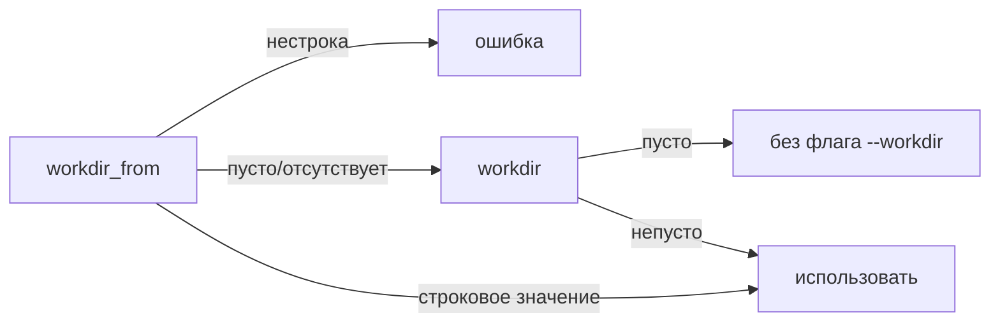

> Translated from: reference/config/commands/types.md @ 1d9d18f2d930

# Типы команд

Типы команд определяют разные контексты выполнения. У каждого типа собственная диспетчерская полезная нагрузка и собственный allowlist полей.

## Содержание

- [Обзор](#обзор)
- [Тип: shell](#тип-shell)
- [Тип: dwe](#тип-dwe)
- [Тип: script](#тип-script)
- [Тип: service_exec](#тип-service_exec)
- [Тип: service_run](#тип-service_run)
- [Тип: workflow](#тип-workflow)
- [Тип: builtin](#тип-builtin)
- [Тип: daemon](#тип-daemon)
- [Разрешение workdir](#разрешение-workdir)

## Обзор

| Тип | Исполнитель | Полезная нагрузка | Применение |
|------|----------|---------|----------|
| `shell` | Host shell | `cmd` или `argv` | Задачи на хосте (скрипты, git, сборка) |
| `dwe` | DWE CLI | `cmd` | Вызов подкоманды |
| `script` | Script runner | блок `script:` | Структурированное многофазное выполнение |
| `service_exec` | Docker Compose exec/run | `cmd` или `argv` | Операции в контейнере на существующих/новых контейнерах |
| `service_run` | Docker Compose run | `cmd` или `argv` | Выполнение в одноразовом контейнере |
| `workflow` | Оркестратор команд | `steps[]` | Многокомандные последовательности (отдельный синтаксис, см. ниже) |
| `builtin` | Внутреннее действие движка | `cmd` (имя builtin) + `with` | Вызов общего builtin движка (например, wait-for-healthy) без подпроцесса |
| `daemon` | Сахар реестра | блок `daemon:` + `service` + `argv` | Объявить долгоживущий фоновый контейнер; разворачивается в четыре виртуальные команды (`.start` / `.logs` / `.stop` / `.restart`) |

Все типы кроме `script` и `workflow` используют каноничное поле `cmd:` для своей полезной нагрузки. `type: script` использует собственный блок `script:` с фазами `run`, `plan`, `cleanup`. `type: workflow` использует собственный блок `steps:` со строковым синтаксисом `command:` / `confirm:` / `with:` / `when:` — см. [Тип: workflow](#тип-workflow) ниже. `type: builtin` кладёт имя builtin в `cmd:`, а его параметры в `with:` — см. [Тип: builtin](#тип-builtin) ниже.

## Тип: shell

Запускает shell-команду на **хостовой** машине. Используйте для задач, которым не нужен контейнер или DWE binary.

| Поле | Обязательно | Описание |
|-------|----------|-------------|
| `cmd` | одно из cmd/argv | Строка shell-команды, передаваемая в `sh -c` (полная семантика shell) |
| `argv` | одно из cmd/argv | Вектор аргументов, исполняемый напрямую без shell |
| `workdir` | опционально | Рабочая директория; относительные пути разрешаются относительно корня проекта |

```yaml
chmod-scripts:
  type: shell
  description: Make all scripts executable
  cmd: chmod +x workspace/scripts/**/*.sh
```

```yaml
commit-config:
  type: shell
  description: Commit a generated config file
  argv:
    - git
    - commit
    - -m
    - "chore: regen config"
    - "${files.cfg.path}"
  files:
    cfg:
      access: read
      path: "config/generated.yml"
      required: true
```

`cmd` и `argv` взаимоисключающи.

### Контракт env для shell

Подпроцессы `type: shell` наследуют окружение родительского процесса плюс значения из блока `env:` команды. Поверх этого раннер экспортирует небольшой контракт, чтобы shell-сниппеты могли обращаться к хостовому DWE CLI и активному compose-проекту без переоткрытия:

| Переменная | Значение |
|----------|-------|
| `DWE_BIN` | Абсолютный путь к запущенному DWE-бинарнику — используйте его вместо жёсткого пути `./bin/dwe` |
| `COMPOSE_PROJECT_NAME` | Имя активного compose-проекта (например, `dwe-laravel`) — `docker compose ...` подхватывает его без `-p` |
| `COMPOSE_FILE` | Объединённый через двоеточие список путей активных оверлеев, приведённых к абсолютным относительно корня проекта — `docker compose ...` подхватывает их без флагов `-f` |

Именно это позволяет команде `type: shell` достучаться до docker compose с тем же набором оверлеев, что и остальной DWE:

```yaml
hub.chown-src-host:
  type: shell
  description: Chown the host-side mount via the running container
  cmd: |
    "$DWE_BIN" docker exec -u root app-main -- \
      chown -R www-data:www-data /workspace/src
```

`COMPOSE_FILE` опускается, если файлы оверлеев не настроены; `COMPOSE_PROJECT_NAME` опускается, если имя проекта не задано. Записи, уже объявленные в блоке `env:` команды, сохраняются, но запись из контракта побеждает при коллизии ключей — `os/exec` Go использует последнюю запись для дубликатов ключей, а контракт дописывается после `env:`.

## Тип: dwe

Вызывает другую подкоманду dwe, используя текущий запущенный бинарник. Это позволяет избежать жёсткого пути `./bin/dwe` в определениях команд и делает вызовы переносимыми.

| Поле | Обязательно | Описание |
|-------|----------|-------------|
| `cmd` | да | Строка подкоманды (без пути к бинарнику); передаётся через `sh -c` |

```yaml
db.up:
  type: dwe
  private: true
  description: Start the database container in the background
  cmd: "docker up db"

app.install:
  type: dwe
  description: Install the Laravel application via installer container
  cmd: "compose raw --bare -- --progress tty -f compose/installer.yml run --rm -u ${host.uid}:${host.gid} app-install"
```

`workdir` не допускается для `type: dwe` (подкоманда наследует корень проекта).

## Тип: script

Выполняет файл shell-скрипта со строгим контрактом окружения, внедряемым раннером. **Скрипты — структурное исключение в системе команд**: команда `type: script` использует собственный блок `script:` с полями `run`, `plan`, `cleanup` вместо каноничного поля `cmd:`. Это сделано намеренно: скрипты — это конфигурации запуска, а не отдельные команды.

```yaml
db.dump-create:
  type: script
  description: Create a database dump file
  params:
    database: { default_from: db.database, pattern: ^[a-zA-Z0-9_-]+$ }
    dump_dir: { default_from: db.backup_dir, required: true }
  files:
    dump:
      access: write
      path: "${param.dump_dir}/${param.database}_{{ now | date \"2006-01-02\" }}.sql.gz"
      mkdir: true
      overwrite: true
      on_error: remove
      env: DUMP_FILE
  env:
    DB_NAME: "${param.database}"
    MYSQL_PWD: "${db.password}"
  script:
    path: workspace/scripts/db/dump-create.sh
    shell: bash
```

### Блок script

| Поле | Описание |
|-------|-------------|
| `script.shell` | Интерпретатор для вызова (по умолчанию `sh`) |
| `script.path` | Одиночный скрипт (простой режим) |
| `script.run` | Основной скрипт (фазовый режим) |
| `script.plan` | Опциональный пре-скрипт (фазовый режим) |
| `script.cleanup` | Опциональный always-runs-after скрипт (фазовый режим) |

Режимы взаимоисключающи: либо `path` отдельно, либо `run` (с опциональными `plan` / `cleanup`).

### Пути скриптов

Пути скриптов в `script.path`, `script.run` и т. д. разрешаются **относительно корня проекта** — никогда относительно `workdir`. Это делает безопасным размещение скриптов под `workspace/scripts/` независимо от того, откуда команда запущена.

### Контракт окружения скрипта

Раннер всегда внедряет следующие env-переменные в процесс скрипта:

| Переменная | Описание |
|----------|-------------|
| `DWE_ROOT` | Абсолютный корень проекта |
| `DWE_BIN` | Абсолютный путь к запущенному DWE бинарнику |
| `DWE_COMMAND_ID` | Полный идентификатор данного вызова |
| `DWE_TEMP_DIR` | Writable temp-директория, ограниченная этим вызовом (автоудаление) |
| `DWE_NONINTERACTIVE` | `1`, когда родительский `RunContext` имеет `NonInteractive: true` (установлено `commands --yes` / `-y`), **или** раннер наследует `DWE_NONINTERACTIVE=1` из собственного окружения (например, вложенные вызовы). Иначе `0`. Само по себе обнаружение TTY этого не переключает — скрипты, которым нужно по-разному вести себя на не-TTY, должны проверять собственный stdin. |
| `DWE_PARAMS_JSON` | Разрешённые params как JSON-объект |
| `DWE_CONTEXT_JSON` | Разрешённый context как JSON-объект |
| `DWE_FILES_JSON` | JSON-объект, отображающий идентификаторы файлов в `{path}` |

Используйте `DWE_BIN` вместо жёсткого пути `./bin/dwe`:

```bash
#!/bin/bash
set -euo pipefail

TMPFILE=$(mktemp "${DUMP_FILE}.XXXXXX")
trap 'rm -f "$TMPFILE"' EXIT

"$DWE_BIN" docker exec -T -e MYSQL_PWD db -- \
  mariadb-dump -u"$DB_USER" "$DB_NAME" | gzip > "$TMPFILE"
mv "$TMPFILE" "$DUMP_FILE"
```

### Линтинг скриптов

DWE не линтит shell-скрипты. Мы **рекомендуем** установить [ShellCheck](https://github.com/koalaman/shellcheck) и прогонять его по `workspace/scripts/` как часть вашего локального процесса или CI. Это внешний инструмент, полностью опциональный, но он ловит классы багов, которые в этом контексте наиболее болезненны: неэкранированные подстановки, отсутствующий `set -euo pipefail`, сломанные обработчики `trap`, тонкие проблемы с кавычками вокруг `$DUMP_FILE` / `$DWE_BIN` и несоответствующий синтаксис тестов.

```bash
# one-off check
shellcheck workspace/scripts/db/dump-create.sh

# whole tree
shellcheck workspace/scripts/**/*.sh
```

Если вы его внедрите, зафиксируйте диалект shebang-ом или директивой, чтобы ShellCheck выбрал правильные правила (особенно когда задано `script.shell: bash`):

```bash
#!/bin/bash
# shellcheck shell=bash
set -euo pipefail
```

Рекомендуемые соглашения для скриптов под `workspace/scripts/` (независимо от ShellCheck — это хорошие практики в любом случае):

- Начинайте с `set -euo pipefail` — fail fast, никаких тихих багов с unset-переменными.
- Экранируйте каждую подстановку: `"$DUMP_FILE"`, `"$DWE_BIN"`, `"$DB_NAME"`.
- Используйте `trap 'rm -f "$TMPFILE"' EXIT` для временных файлов; раннер очищает `$DWE_TEMP_DIR` за вас, но временные файлы отдельных шагов всё равно требуют собственных trap.
- Считайте unset env-переменные ошибками через `${VAR:?error message}`, когда скрипт не должен запускаться без них.

## Тип: service_exec

Запускает команду внутри существующего контейнера через `docker compose exec`. Поле `mode:` управляет тем, что происходит, когда целевой контейнер не запущен — см. [разрешение mode](#разрешение-mode) ниже.

| Поле | Обязательно | Описание |
|-------|----------|-------------|
| `service` | да | Имя compose-сервиса |
| `cmd` / `argv` | одно из | Строка shell-команды ИЛИ сырой argv |
| `mode` | опционально | `exec-or-fail` (по умолчанию), `exec`, `run` или `exec-or-run` — см. [разрешение mode](#разрешение-mode) |
| `user` | опционально | Контейнерный пользователь, под которым запускаться. Полный список принимаемых значений и правила fallback см. в [Разрешение user](#разрешение-user). |
| `workdir` | опционально | Контейнерный workdir; рендерится через шаблоны |
| `workdir_from` | опционально | Точечный путь в объединённый конфиг, разрешающийся в строку workdir |
| `compose_args` | опционально | Дополнительные флаги, передаваемые в `docker compose exec/run` (шаблонизированные) |

### Разрешение mode

| Режим | Когда контейнер запущен | Когда контейнер не запущен |
|------|---------------------------|-------------------------------|
| `exec-or-fail` (по умолчанию) | запускается через `docker compose exec` | отказывает с ясной ошибкой DWE, предлагающей `dwe docker up <svc>` |
| `exec` | запускается через `docker compose exec` | всё равно вызывает `compose exec`; docker выдаёт собственную (загадочную) ошибку |
| `run` | всегда запускает свежий эфемерный контейнер через `docker compose run --rm` | то же |
| `exec-or-run` | запускается через `docker compose exec` | тихо переключается на `docker compose run --rm`; выводит жёлтое предупреждение, чтобы поведение с эфемерным контейнером было видно |

Выбирайте `exec-or-fail` (значение по умолчанию) для обычных интерактивных инструментов, зависящих от персистентного состояния контейнера (базы данных, серверы приложений и т. д.) — отсутствующий контейнер должен проявиться как actionable ошибка, а не как разовый запуск с побочными эффектами. Выбирайте `exec-or-run` только для инструментов, которые легитимно работают как эфемерные запуски (mc, composer install на свежем checkout и т. д.), и где вы понимаете, что между вызовами состояние не сохранится. `runner.mode` подчиняется тому же enum и тем же правилам приоритета, что и `runner.user`.

### Разрешение user

Поле `user:` на `service_exec` / `service_run` (и в блоке переопределения `runner:`) принимает следующие значения:

| Значение | Эффект |
|-------|--------|
| _(опущено / пусто)_ | Откатывается к `services.<svc>.cli.user` целевого сервиса. Если `cli.user` тоже пуст, флаг `--user` не передаётся и контейнер запускается под директивой `USER` образа. Это значение по умолчанию для новых команд — объявите `cli.user` один раз на сервисе, и каждая команда, нацеленная на этот сервис, наследует его. |
| `current` | Передаёт `--user <HOST_UID>:<HOST_GID>`, чтобы процесс контейнера запускался под хостовым пользователем. Используйте это, когда команда пишет файлы в bind-mount директории и они должны принадлежать хостовому пользователю. |
| `root` | Передаёт `--user root`. Используйте для разовых операций, требующих повышенных привилегий внутри контейнера (установка пакетов, chown и т. д.). |
| `internal` | **Не** передаёт флаг `--user` и **пропускает** fallback к `cli.user`. Контейнер запускается под встроенной директивой `USER` образа (или `root`, если образ её не объявляет). Используйте это для явного отказа от `cli.user` для конкретной команды (например, entrypoint, который должен запускаться под пользователем по умолчанию образа). |
| любая другая строка | Передаётся как есть в `--user <value>`. Принимает те же формы, что и `docker --user`: имя пользователя (`www-data`), числовой UID (`1000`) или `UID:GID` (`1000:1000`). |

Приоритет сверху вниз:

1. `runner.user` (если блок `runner:` его задаёт).
2. Верхнеуровневый `user:` на команде.
3. `services.<svc>.cli.user` разрешённого целевого сервиса (после редиректа `runner.service`).
4. Без флага `--user` (`USER` образа).

`runner.service` перенаправляет цель до lookup-а `cli.user`, поэтому fallback читает `cli.user` из **перенаправленного** сервиса, а не из исходного.

Установка `user: internal` коротко замыкает шаг 3 — резолвер трактует `internal` как явное решение и никогда не читает `cli.user`.

```yaml
composer-install:
  type: service_exec
  description: Install PHP dependencies via Composer
  service: app-main
  user: current
  workdir_from: services.main.work_dir_internal
  mode: exec-or-run
  argv:
    - composer
    - install
    - --prefer-dist
    - --no-interaction
```

```yaml
db.create:
  type: service_exec
  description: Create a database in the db container
  service: db
  mode: exec-or-run
  params:
    database: { required: true, pattern: ^[a-zA-Z0-9_-]+$ }
  env:
    MYSQL_PWD: "${db.password}"
  cmd: "mariadb -u${db.user} -e 'CREATE DATABASE IF NOT EXISTS `${param.database}`;'"
```

### compose_args

`compose_args` — это список дополнительных флагов, вставляемых **перед** генерируемыми раннером флагами `--user` / `--workdir` / `-e`. Используйте его для `-T`, `-d`, `--name`, `--rm` и т. д.

```yaml
compose_args:
  - "-T"                    # disable TTY (useful when piping)
  - "--name"
  - "${param.database}_loader"
```

### Внедрение env в раннеры сервисов

Для контейнеров env-переменные внедряются через окружение docker-процесса плюс флаги `-e KEY` (только имя), так что секретные значения никогда не появляются в `argv` (и потому не попадают в `ps` или `/proc/<pid>/cmdline`).

## Тип: service_run

То же, что `service_exec`, но всегда использует `docker compose run --rm`, чтобы запустить свежий, одноразовый контейнер. Используйте для разовых задач, которые не должны требовать уже запущенного контейнера.

```yaml
artisan-tinker:
  type: service_run
  service: app-main
  user: current
  workdir_from: services.main.work_dir_internal
  argv: [php, artisan, tinker]
```

`mode` для этого типа фиксирован как `run` — поле может быть опущено (значение по умолчанию) или явно задано как `run`; любое другое значение отвергается на этапе загрузки.

### Блок переопределения runner

И `service_exec`, и `service_run` принимают блок `runner:` для переопределения `service` / `user` / `workdir` / `workdir_from` / `mode` без дублирования остального определения. Ненулевые поля в `runner:` побеждают верхнеуровневые поля.

```yaml
queue-worker:
  type: service_exec
  service: app-main
  argv: [php, artisan, queue:work]
  runner:
    user: root
    workdir: /workspace
    mode: run
```

## Тип: workflow

Workflow запускает упорядоченную последовательность других команд с опциональными подтверждениями и условными шагами. Workflow — единственный способ скомпоновать несколько команд за одним идентификатором.

**Примечание:** Шаги workflow используют строковый синтаксис `command:` / `confirm:` / `with:` / `when:`. Условия `when:` внутри workflow — выражения на мини-языке строк, отличные от типизированных `when:` / `check:`, используемых в шагах пайплайнов (см. [deploy](../deploy/index.md)).

```yaml
bootstrap:
  type: workflow
  description: Full bootstrap — start db, create database, install deps, migrate
  steps:
    - command: db.start
    - command: services.main.db.create
    - command: services.main.composer-install
    - command: services.main.key-generate
    - command: services.main.migrate
```

### Форма шага

Каждый шаг — это либо **command**-шаг, либо **confirm**-шаг, либо **parallel**-шаг (взаимоисключающи).

| Поле | Используется в | Описание |
|-------|---------|-------------|
| `command` | command-шаг | Полный идентификатор вызываемой команды |
| `with` | command-шаг | Карта переопределений параметров (шаблонизированные значения) |
| `confirm` | confirm-шаг | Текст запроса, показываемый перед продолжением |
| `parallel` | parallel-шаг | Конкурентная группа листовых подшагов-команд (см. [Параллельные подшаги](#параллельные-подшаги)) |
| `when` | command / parallel-шаг | Условие; шаг (или вся группа) пропускается, если ложь |
| `continue_on_error` | command / parallel-шаг | Ошибка логируется как warning; workflow продолжается |

### with: переопределения параметров

Значения `with:` рендерятся относительно контекста рендера родительского workflow, поэтому могут тянуть из конфига, параметров и хостовых хелперов:

```yaml
- command: db.create
  with:
    database: "${db.database}"

- command: services.main.db.dump-deploy
  with:
    target_database: "${param.target_db}"
    dump_dir: "${param.backup_dir}"
```

### when: условия

Выражения `when:` сначала рендерятся, затем классифицируются в одну из трёх форм:

1. **Булев литерал** — `true`, `false`, `1`, `0`, пустая строка. После рендера это быстрый путь.
2. **Builtin-предикат** — файловые проверки относительно корня проекта.
3. **Shell-команда** — `cmd: <command>`; вычисляется через `sh -c`; exit 0 = true.

```yaml
steps:
  - command: services.main.composer-install
    when: "file-missing services/main/src/vendor/autoload.php"

  - command: bootstrap-cache-warm
    when: "{{ if .Params.warm }}1{{ else }}0{{ end }}"

  - command: install-deps
    when: "cmd: test ! -d services/main/src/vendor"
```

Builtin-предикаты (путь — относительно корня проекта):

| Предикат | Истина когда |
|-----------|-----------|
| `dir-exists <path>` | путь — существующая директория |
| `dir-missing <path>` | путь отсутствует или не директория |
| `dir-empty <path>` | путь отсутствует или не имеет записей |
| `dir-not-empty <path>` | путь — директория с как минимум одной записью |
| `file-exists <path>` | путь — существующий обычный файл |
| `file-missing <path>` | путь отсутствует или не обычный файл |

### continue_on_error

Помечает шаг, который может упасть без прерывания workflow. Ошибка логируется как warning, затем выполнение продолжается:

```yaml
steps:
  - command: optional-cache-warm
    continue_on_error: true
  - command: services.main.migrate
```

Недопустимо на `confirm`-шагах.

### confirm-шаги

```yaml
steps:
  - confirm: "This will drop the database. Continue?"
  - command: db.drop
    with:
      database: "${db.database}"
```

Confirm-шаги тихо пропускаются под `--yes` или `DWE_NONINTERACTIVE=1`. Иначе huh выводит запрос на TTY, а fallback `[y/N]` через stdin обрабатывает piped-ввод.

### Параллельные подшаги

Шаг workflow может объявить блок `parallel:`, который разворачивает группу подшагов конкурентно. Это зеркалит схему `parallel:` пайплайна в [deploy → Группы параллельных шагов](../deploy/examples.md) — те же регуляторы `max_concurrent` / `fail_fast` и тот же live-block UI — но живёт внутри workflow, чтобы группу можно было переиспользовать между пайплайнами и вызывать ad-hoc через `dwe commands`.

```yaml
services.all.composer-install:
  type: workflow
  description: Run composer install across every app service in parallel
  steps:
    - parallel:
        max_concurrent: 4
        fail_fast: true
        steps:
          - command: services.main.composer-install
          - command: services.api.composer-install
          - command: services.worker.composer-install
          - command: services.admin.composer-install
```

| Поле | Обязательно | По умолчанию | Описание |
|-------|----------|---------|-------------|
| `max_concurrent` | опционально | `min(NumCPU, len(steps))` | Верхняя граница одновременно работающих горутин |
| `fail_fast` | опционально | `true` | При true первая ошибка подшага отменяет соседей через context; при false все подшаги выполняются, а ошибки агрегируются через `errors.Join` |
| `always_show_output` | опционально | `false` | При true захваченные stdout/stderr каждого подшага выгружаются между полосами `───── output: <command> ─────` / `──────────────────` после завершения группы — включая успешные подшаги. По умолчанию сохраняется поведение «только при ошибках». Пропущенные и отменённые подшаги никогда не дают вывода и не затрагиваются. |
| `steps` | обязательно | — | Подшаги; каждый должен быть листовым command-шагом (без `confirm`, без вложенного `parallel`) |

`when:` и `continue_on_error:` уровня группы допустимы на шаге, несущем `parallel:` (они управляют всей группой). Per-подшаговые `when:` и `continue_on_error:` тоже допустимы и ведут себя так же, как в последовательном workflow. Подшаговый `when:` вычисляется один раз на preflight (до запуска любой горутины), так что предикаты с побочными эффектами не выполняются дважды.

#### Ограничения

1. **Минимум два подшага** — список `parallel.steps:` длиной 0 или 1 отвергается на этапе валидации.
2. **Без вложенных parallel** — подшаг не может сам объявить `parallel:`. Распрямите структуру или разделите на отдельные шаги workflow.
3. **Без confirm в подшагах** — `confirm:`-шаги интерактивно запрашивают подтверждение; параллельный live-block UI владеет терминалом и не может разместить запрос. Подшаг, ссылающийся на команду с `confirmation: true`, требует `--yes` (или `DWE_NONINTERACTIVE=1`); preflight иначе отвергает группу, а runtime-гард ловит транзитивные вызовы подтверждения.
4. **Без `with:` на контейнере** — параллельный контейнер не имеет собственных параметров; каждый подшаг несёт собственный `with:`.

#### Композиция

- **Ad-hoc**: `dwe commands run <workflow-id>` запускает live-block самого workflow на терминале. Ctrl-C распространяется как SIGINT через `signal.NotifyContext`, что отменяет группу и даёт детям до 5 с на выход до эскалации до SIGTERM.
- **Внутри последовательного шага пайплайна**: когда `cmd:` последовательного шага пайплайна разрешается в workflow с блоком `parallel:`, футер пайплайна приостанавливается на время тела шага (существующий контракт `SuspendForExec` / `ResumeAfterExec`), и workflow рендерит собственные строки блока в этом промежутке. Счётчик шагов пайплайна продвигается ровно на один — подшаги НЕ считаются шагами пайплайна.
- **Внутри параллельной группы пайплайна ИЛИ другого параллельного workflow**: отвергается во время выполнения. Только один live-block может владеть терминалом одновременно. Ошибка — сентинел `ErrWorkflowNestedParallel`.

#### Живой рендеринг и отчётность

- **Строки блока (TTY)**: у каждого подшага есть строка вида `<спиннер-или-глиф> [<elapsed>] [<i>/<N>] <command>[: <последняя-строка>]`. Последняя строка отслеживает как вывод, завершённый переводом строки, ТАК И кадры carriage-return, поэтому прогресс-бары `curl` / `wget` / `docker pull` видны на месте (строка обновляется каждый раз, когда дочерний процесс пишет кадр).
- **Сводка в конце блока (TTY)**: когда параллельная группа завершается, строки замораживаются с финальными глифами (✓/✗/◎) в scrollback, а вместо них печатается однострочный сводный футер: `✓ [<elapsed>] parallel: <workflow-id>` зелёным при успехе, `✗ ...` красным, когда хотя бы один подшаг упал. Per-подшаговые строки `✓ [i/N] Done: …` НЕ переиздаются на TTY, потому что та же информация уже есть в замороженных строках блока выше.
- **Не-TTY режим** (CI / piped stdout): нет live-блока. Каждый подшаг печатает строку терминального состояния (`✓ [i/N] Done`, `◎ [i/N] Skipped`, `✗ [i/N] Failed`, `◎ [i/N] Cancelled`), за которой следует обычный текстовый сводный футер (`✓ [<elapsed>] parallel: <workflow-id>`).
- **Дампы при сбое**: захваченный вывод упавшего подшага воспроизводится между полосами `───── output: <command> ─────` / `──────────────────` на stderr в ОБОИХ режимах — TTY и не-TTY — потому что live-строка не может показать весь буфер. Верхняя полоса именует подшаг, чтобы дампы при множественных сбоях оставались атрибутируемыми, а ANSI escape-последовательности в выводе ребёнка пересылаются как есть, чтобы цвета пережили round-trip.
- **Цвет для параллельных подшагов**: каждый ребёнок запускается с per-подшаговым псевдо-терминалом, чтобы инструменты, выбирающие цветной вывод по `isatty(STDOUT)` — Pest, PHPUnit/Symfony Console, ripgrep, fzf, CLI на базе lipgloss и т. д. — продолжали испускать ANSI-коды, несмотря на то что захваченный вывод потребляется внутренним line tee, а не терминалом пользователя. Мастер-сторона PTY читается в tee, так что прогресс по строкам (например, `\r`-кадры `docker pull`) и буферизованный дамп видят один и тот же поток байтов. В качестве страховки дети также наследуют `CLICOLOR_FORCE=1`, `FORCE_COLOR=1` и `COLORTERM=truecolor` (пересылаются в контейнер через `-e` для `type: service_exec` / `service_run`), чтобы env-зависимые инструменты тоже сохраняли цвет независимо от обнаружения PTY.

#### Per-подшаговые логи

Объединённые stdout/stderr каждого подшага захватываются в `.dwe/logs/parallel/workflow/<workflow-id>/<sub-command>.log`. Только кадры, завершённые переводом строки, пишутся в файл лога (прогресс-кадры с carriage-return остаются в live-строке и отбрасываются из логов), так что файл остаётся читаемым без спама `\r`.

#### Именование подшагов и переопределения из пайплайна

Каждый подшаг workflow может задать явный `name:` (опционально). При отсутствии эффективное имя по умолчанию — указанная `command`. Это имя — ручка, которую пайплайн использует для `sub_step_overrides:` — см. [deploy → Нацеливание на подшаги workflow с переопределениями](../deploy/examples.md). Когда два подшага в одном workflow имеют одно и то же эффективное имя, переопределение из пайплайна, нацеленное на это имя, отвергается на этапе планирования как неоднозначное; задайте подшагам явные `name:`, чтобы их различать.

```yaml
commands:
  dumps-deploy:
    type: workflow
    steps:
      - parallel:
          steps:
            - name: deploy-main          # explicit name → pipeline can target it
              command: services.main.db.dump-deploy
            - name: deploy-stock
              command: services.main.db.dump-deploy-stock
```

Workflow никогда не знают, прикреплены ли к ним переопределения, — они непрозрачны для решений о гейтировании. Вызов workflow с переопределениями случается только через шаг пайплайна, объявляющий `sub_step_overrides:`.

## Тип: builtin

Вызывает по имени внутреннее builtin-действие движка — тот же реестр, что пайплайны используют в `deploy.yml` / `reset.yml` / `lifecycle.yml`. Подпроцесс не порождается; builtin работает in-process на Go.

Используйте `type: builtin`, когда команда иначе переизобретёт логику, которую движок уже предоставляет (ожидание здоровых контейнеров, удаление томов проекта, обеспечение директорий сервисов, …). Это правильный выбор для любого листового шага, которому нужно структурированное, аудитируемое выполнение вместо shell-пайплайна, — и это обходит ловушку встраивания `{{...}}` из других инструментов (например, `docker inspect --format`) внутрь `cmd:` команды `type: shell`, которые иначе столкнулись бы с рендером шаблонов команды.

| Поле | Обязательно | Описание |
|-------|----------|-------------|
| `cmd` | да | Имя builtin (например, `docker_wait_healthy`) |
| `with` | опционально | Карта параметров, передаваемых builtin |

```yaml
db.wait:
  type: builtin
  private: true
  description: Wait for the db container to become healthy
  cmd: docker_wait_healthy
  with:
    services: [db]
    timeout: 120s
    interval: 2s
```

### Шаблонизация внутри with

Строковые значения внутри `with:` — включая записи во вложенных списках и картах — рендерятся в template-пространстве команды (`${...}`, `{{ ... }}`) до того, как builtin их увидит. Это позволяет параметризовать builtin lookup-ами из конфига, параметрами или контекстом:

```yaml
db.wait-target:
  type: builtin
  cmd: docker_wait_healthy
  params:
    service: { required: true }
  with:
    services: ["${param.service}"]
    timeout: "${docker.wait_timeout}"
```

Не-строковые скаляры (булевы, целые) пропускаются без изменений.

### Реестр builtin

Список доступных builtin, их параметры и поведение задокументированы один раз в [deploy → Доступные builtin](../deploy/builtins.md). Те же builtin доступны из команд `type: builtin` — один общий реестр.

Наиболее полезные для экспозиции в качестве команд builtin, как правило, — это долгоживущие, идемпотентные: в особенности `docker_wait_healthy`, который предназначен для вызова всякий раз, когда проекту нужно блокироваться до тех пор, пока стек (или конкретный сервис) не станет здоровым.

### Недопустимые поля

`type: builtin` — это листовое действие; он отвергает каждое поле, специфичное для других типов: `argv`, `script:`, `steps:`, `service`, `compose_args`, `workdir` / `workdir_from`, `user`, `mode` и `runner:`. Используйте `params:` / `context:` / `env:` / `files:` / `messages:` как на любом другом типе для входов, экспозиции env и стилизованного вывода.

## Тип: daemon

`type: daemon` — декларативная форма для долгоживущих, параметризованных фоновых процессов внутри сервисов DWE (канонический пример: Laravel queue worker). Один YAML-блок разворачивается во время загрузки реестра в **четыре полноценные виртуальные команды**:

| Виртуальный ID | Поведение | Блокирующая |
|---|---|---|
| `<base>.start` | `docker compose run -d --name <full> ...` | нет |
| `<base>.logs` | `docker logs -f --tail=100 <full>` | да — Ctrl-C отсоединяется (контейнер продолжает работать) |
| `<base>.stop` | `docker stop -t <timeout> <full>` | нет |
| `<base>.restart` | `<base>.stop` затем `<base>.start` | нет |

Каждая виртуальная команда появляется в реестре, браузере `dwe cmd`, completion, `inspect` и может ссылаться из workflow. Исходная команда `<base>` **не** запускается сама по себе — запускаются только четыре виртуальные команды.

Имена контейнеров автоматически префиксуются разрешённым именем compose-проекта — `project_name` из `workspace/docker.yml`, если оно задано, иначе `ProjectConfig.FullName()` (`<prefix>-<name>`) — так что демоны попадают в ту же project-область, что и сервисы под управлением compose (и один проект может работать на нескольких checkout-ах одновременно). Каждый контейнер несёт стандартизированные метки, чтобы `dwe status daemons`, completion и `_auto_reap_daemons` могли найти их через `docker ps` — **без отдельного файла состояния**.

### YAML-форма

```yaml
commands:
  queue:
    type: daemon
    description: "Laravel queue worker"
    service: app-main             # literal compose service name (no ${...})
    workdir_from: services.main.work_dir_internal
    user: www-data
    env:
      QUEUE_CONNECTION: redis
    params:
      name:
        default: default
        pattern: ^[a-zA-Z0-9_-]+$
    argv:
      - php
      - artisan
      - queue:listen
      - --timeout=0
      - --queue=${param.name}
    daemon:
      container_template: "php_queue_${param.name}"
      on_already_running: error   # error | noop
      auto_remove: true           # default true → adds --rm
      stop_timeout: 10s
```

`service`, `workdir`/`workdir_from`, `user`, `env`, `params`, `argv`, `compose_args` следуют той же семантике, что и [`type: service_run`](#тип-service_run). Конфигурация, специфичная для daemon, целиком живёт под блоком `daemon:`.

### Поля блока `daemon:`

| Поле | Обязательно | По умолчанию | Описание |
|-------|----------|---------|-------------|
| `container_template` | да | — | Шаблон имени контейнера; рендерится в template-пространстве команды и префиксуется `<project.full>-`. После рендера должен соответствовать `^[a-zA-Z0-9_][a-zA-Z0-9_.-]*$`. |
| `on_already_running` | опционально | `error` | `error` прерывает `.start`, если контейнер уже существует; `noop` делает `.start` идемпотентным. |
| `auto_remove` | опционально | `true` | При true `.start` добавляет `--rm`, чтобы контейнер удалялся по остановке. |
| `stop_timeout` | опционально | `10s` | Строка длительности. Конвертируется в целые секунды для `docker stop -t <secs>`; значения ниже 1s округляются вверх до 1s (никогда `0`). |

### Именование контейнера

```
<project.full>-<rendered container_template>
```

`project.full` — это `ProjectConfig.FullName()` — `<prefix>-<name>`, если задано `prefix:`, иначе `<name>`. Post-render regex `^[a-zA-Z0-9_][a-zA-Z0-9_.-]*$` — авторитетная защита; недопустимые символы в отрендеренных значениях шаблона дают сбой во время выполнения, даже если `pattern:` параметра случайно их разрешил.

### Стандартные метки

Каждый контейнер daemon несёт три метки, чтобы `docker ps` был единственным источником истины:

- `dwe.project=<project.full>`
- `dwe.daemon.id=<base>` (например, `services.main.queue`)
- `dwe.daemon.params=<json>` (например, `{"name":"emails"}`) — производится через `encoding/json.Marshal` для безопасного round-trip через кавычки, обратные слэши и управляющие символы

`dwe status daemons`, completion `--set` и `_auto_reap_daemons` все фильтруют по этим меткам.

### Поведение виртуальных команд

- **`.start`** — выпускает `docker compose run -d --name <full> --no-deps --entrypoint "" [--rm] [--user …] [--workdir …] -e K1 -e K2 --label dwe.project=… --label dwe.daemon.id=… --label dwe.daemon.params=… <service> <argv…>`. **Значения** env передаются через окружение дочернего процесса (`cmd.Env`), никогда через хостовый argv, так что секреты не появляются в `ps` или `/proc/<pid>/cmdline`. `--no-deps` оставляет работающий стек нетронутым; `--entrypoint ""` гарантирует, что фактически запускается пользовательский `argv:`. При `on_already_running: error` плюс ошибке конфликта имён docker builtin выдаёт `ErrDaemonAlreadyRunning`; при `noop` та же ошибка проглатывается, и `.start` завершается успешно.
- **`.logs`** — запускает `docker logs -f --tail=100 <full>` на переднем плане. Ctrl-C посылает `SIGINT` только процессу `docker logs` (мягкое отсоединение через `cmd.Cancel`); контейнер никогда не получает сигнал. Если контейнер не запущен, `.logs` ошибается с подсказкой, указывающей на `.start`.
- **`.stop`** — запускает `docker stop -t <stop_timeout-в-секундах> <full>`. Отсутствующий контейнер **не** ошибка (идемпотентная остановка).
- **`.restart`** — виртуальный `type: workflow` из `<base>.stop`, за которым следует `<base>.start`. Шаги workflow явно прокидывают каждый объявленный `param.<name>` через `with:`, так что `dwe cmd queue.restart --set name=emails` перезапускает демон `emails` (а не default).

### Валидация

`dwe validate` и загрузочный `cmd.Validate()` обеспечивают:

- `service:` обязателен и **должен быть литеральным** — никаких `${...}` или `{{...}}`. (Параметризованный `service:` намеренно вне области v1, чтобы метка `dwe.daemon.id` оставалась стабильной.)
- `daemon.container_template` обязателен и непуст.
- `daemon.on_already_running` — одно из `error` / `noop` (пусто = default `error`).
- `daemon.stop_timeout` парсится через `time.ParseDuration` и строго положителен.
- Каждый `${param.X}`, упомянутый в `container_template`, должен быть объявлен в `params:` И нести `pattern:` (рекомендательно — runtime-регекс на отрендеренном имени контейнера — авторитетный гейт).
- Синтетические идентификаторы (`<base>.start`, `.logs`, `.stop`, `.restart`) не должны конфликтовать ни с одной явной командой в реестре.

### Ограничения parallel и workflow

`.logs` **интерактивна** — она тейлит вывод контейнера на переднем плане и отсоединяется через Ctrl-C. Как и `confirm`, она отвергается где бы то ни было внутри группы шагов `parallel:` на этапе планирования (deploy / lifecycle пайплайны и parallel-блоки workflow), независимо от `--yes`. `.start`, `.stop` и `.restart` могут появляться внутри параллельных групп.

### Интеграция с lifecycle

Всякий раз, когда запускается `dwe stop` (независимо от наличия `lifecycle.yml`), синтетическая фаза `_auto_reap_daemons` дописывается в начало stop-пайплайна. Она перечисляет каждый контейнер, помеченный `dwe.project=<full>` с непустым `dwe.daemon.id`, и останавливает их параллельно. Опций отказа нет; фаза видна в выводе плана. Форму stop-пайплайна см. в [lifecycle.md](../lifecycle.md).

Если `lifecycle.yml` отсутствует, `dwe stop` всё равно работает (только с фазой `_auto_reap_daemons` плюс дефолтным сообщением `Project is stopped. Have a nice day!`) — `lifecycle.yml` больше не требуется для `stop`.

### Безопасность и приватность

- **Значения параметров попадают в `dwe.daemon.params` как JSON-метки**, которые `docker inspect` экспонирует любому с доступом к docker-сокету на хосте. **Не помещайте секреты в `params:`.** Используйте вместо этого `env:` — env-значения передаются через окружение контейнера (`docker compose run -e KEY` со значением в `cmd.Env`), никогда через хостовый процессный argv, так что не появляются в `ps` или `/proc/<pid>/cmdline`.
- **Регекс имени контейнера применяется после рендера** — недопустимые символы в отрендеренных значениях параметров — жёсткая runtime-ошибка, даже если YAML-`pattern:` случайно их разрешил. Проверка `pattern:` параметров валидатором рекомендательна; регекс отрендеренного имени — авторитетная защита.
- **Параметризация `service:` отвергается** в v1 — метка `dwe.daemon.id` должна быть стабильной между перезапусками, чтобы completion, status и reap могли надёжно соотносить состояние между вызовами.

### Недопустимые поля

Исходная команда daemon отвергает поля, конфликтующие с её декларативной формой: `script:`, `steps:`, `cmd:` (действие неявно), `mode`, `runner:` (у каждой виртуальной команды свой раннер). Используйте `params:` / `context:` / `env:` / `files:` / `messages:` / `argv` / `service` / `workdir` / `workdir_from` / `user` / `compose_args` как на любом раннере сервиса. Всё это перетекает в виртуальный вызов `.start`.

### Сквозной поток

```bash
# Start a worker for the "emails" queue
dwe cmd queue.start --set name=emails

# Tail it (Ctrl-C detaches, container stays)
dwe cmd queue.logs --set name=emails

# Check what's running
dwe status daemons

# Restart it
dwe cmd queue.restart --set name=emails

# Stop one daemon
dwe cmd queue.stop --set name=emails

# Stop everything (reaps all daemons in this project automatically)
dwe stop
```

## Разрешение workdir

`workdir` принимает шаблонизированный путь. Относительные пути разрешаются относительно корня проекта для хостовых раннеров (`type: shell`, `type: script`) и относительно файловой системы контейнера для раннеров сервисов.

`workdir_from` **допустим только** для `service_exec` / `service_run` и читает строку из объединённого конфига:

```yaml
workdir_from: services.main.work_dir_internal
```

Когда заданы и `workdir`, и `workdir_from`, побеждает `workdir_from` — тот же паттерн «конфиг побеждает, литерал — страховочная сетка», что и у `params.*.default_from`. Внутри блока `runner:` действует то же правило между `runner.workdir_from` и `runner.workdir`.

Порядок разрешения:



- `workdir_from` разрешается в непустую строку → использовать её.
- `workdir_from` отсутствует в конфиге или разрешается в пустую строку → откатиться к литеральному `workdir`.
- `workdir_from` разрешается в нестроковое значение → жёсткая ошибка (баг конфигурации).
- Ни одно не задано → раннер не передаёт `--workdir` (применяется default контейнера).

### Шаблонизированные service / workdir / workdir_from

`service`, `workdir` и `workdir_from` рендерятся через template-пространство команды до разрешения, так же как `argv`, `cmd` и `compose_args`. Это позволяет одному определению нацеливаться на несколько сервисов без дублирования:

```yaml
hub.chown-src:
  type: service_run
  private: true
  params:
    service: { type: string, required: true, pattern: '^[a-z0-9_-]+$' }
  service: app-${param.service}
  workdir_from: services.${param.service}.work_dir_internal
  user: root
  argv: [sh, -c, "chown -R www-data:www-data /workspace/src"]
```

Затем пайплайн (или другая команда) вызывает то же определение per-сервис через `--set service=<name>`. Поля блока `runner:` (`runner.service`, `runner.workdir`, `runner.workdir_from`) рендерятся идентично.
