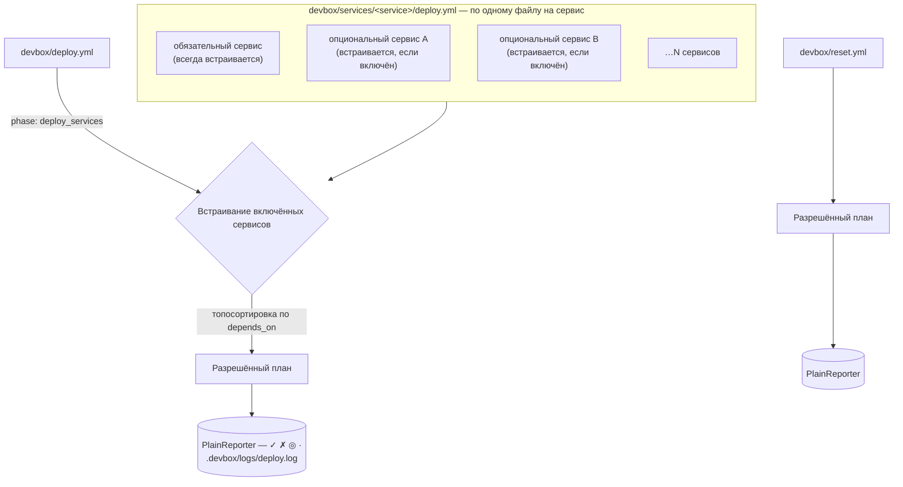

> Translated from: reference/config/deploy/index.md @ 180dac2dd8ec

# deploy.yml / reset.yml

Декларации пайплайнов деплоя и сброса.

## Содержание

- [Назначение](#назначение)
- [Роли файлов](#роли-файлов)
- [Структура](#структура)
- [Поля верхнего уровня](#поля-верхнего-уровня)
- [Поля фазы](#поля-фазы)
- [Поля шага](#поля-шага)
- [Семантика post-deploy](#семантика-post-deploy)
- [Маркер `deploy_services`](#маркер-deploy_services)
- [Идемпотентный деплой и состояние](#идемпотентный-деплой-и-состояние)
- [Страницы](#страницы)
- [Связанные команды](#связанные-команды)

## Назначение

`devbox/deploy.yml` декларирует пайплайн деплоя оркестратора. `devbox/reset.yml` декларирует деструктивный пайплайн сброса. Пайплайны деплоя отдельных сервисов лежат в `devbox/services/<service>/deploy.yml`.

Все три файла загружаются раздельно и не сливаются с 3-слойным конфигом.

И `devbox/deploy.yml`, и `devbox/reset.yml` опциональны. При их отсутствии Devbox подставляет встроенный пайплайн по умолчанию и выводит одну info-строку в stderr: `Using built-in default <deploy|reset> pipeline (override with devbox/<deploy|reset>.yml).` Эта строка подавляется в режиме `--output json`.

**Дефолтный пайплайн деплоя** (срабатывает, когда `devbox/deploy.yml` отсутствует):

Фазы: `services` (запускает `deploy_services: true` для встраивания пайплайнов включённых сервисов) → `start` (`type: devbox`, `cmd: "docker up --wait"`) → `post-deploy` (отображение info + сообщение об успехе).

**Дефолтный пайплайн сброса** (срабатывает, когда `devbox/reset.yml` отсутствует):

Фазы: `pre` (промпт подтверждения) → `stop` (`type: devbox`, `cmd: "docker down"`) → `cleanup` (удаление томов, удаление директории `services/`).

## Роли файлов

| Файл | Загрузчик | Роль |
|------|-----------|------|
| `devbox/deploy.yml` | `LoadProjectDeployConfig` | Оркестратор верхнего уровня: перечисляет фазы по порядку, ссылается на пайплайны сервисов |
| `devbox/services/<svc>/deploy.yml` | `LoadServiceDeployConfigs` | Фазы и шаги отдельного сервиса (встраиваются оркестратором при `deploy_services: true`). Пайплайн деплоя может быть у сервиса любого типа (app, tool, infra). |
| `devbox/reset.yml` | `LoadResetConfig` | Отдельный пайплайн сброса, исполняемый через `devbox reset run`. Фазы `deploy_services` отвергаются. |



Сервис любого типа (app, tool или infra) может иметь `devbox/services/<name>/deploy.yml`. На этапе планирования оркестратор отфильтровывает этот набор до **включённых** сервисов (обязательные всегда включены) и встраивает их в топологическом порядке `depends_on`. Сервисы без файла деплоя молча пропускаются — не каждому сервису он нужен.

Поле `after:` в `devbox/services/<name>/deploy.yml` декларирует порядок деплоя между сервисами (отдельно от рантайм-зависимости `depends_on:`). Подробности см. в [Поля верхнего уровня](#поля-верхнего-уровня).

## Структура

```yaml
log: true                          # optional: tee output to .devbox/logs/<pipeline>.log

phases:
  # Normal phase: supports when, untracked, and steps
  - name: <phase-name>
    description: Human-readable description
    when:                          # optional: pre-condition (typed condition)
      type: builtin|shell|template
      cmd: <string>                # for builtin/shell
      expr: <string>               # for template
    untracked: true                # optional: suppress step output for this phase
    steps:
      - name: <step-name>
        description: Human-readable description
        type: shell|devbox|command|builtin  # execution type (required)
        cmd: <value>               # command payload (required)
        when:                      # optional: pre-condition (typed condition)
          type: builtin|shell|template
          cmd: <string>            # for builtin/shell
          expr: <string>           # for template
        check:                     # optional: post-condition (typed action)
          type: shell|devbox|command|builtin
          cmd: <value>
          with:                    # optional: parameters
            key: value
        continue_on_error: true    # optional: failure does not abort the pipeline
        skip_confirm: true         # optional: bypass confirmation prompts for this step
        untracked: true            # optional: exclude this step from [N/M] counter and suppress its output
        files_gate: readable       # short form: state must be readable|missing
        # or long form:
        files_gate:
          state: readable|missing  # required
          command: <cmd-id>        # default: step.cmd (only valid for type: command)
          require: required|all|[id1, id2]  # default: required
          with:                    # default: step.with
            key: value
        with:                      # parameters (for command and builtin types)
          key: value

  # deploy_services phase (deploy.yml only): no steps or when allowed
  - name: services
    description: Human-readable description
    deploy_services: true          # orchestrator marker; mutually exclusive with steps and when
```

## Поля верхнего уровня

| Поле | Тип | По умолчанию | Описание |
|------|-----|--------------|----------|
| `log` | bool | `deploy.yml`: `true`; `reset.yml`: `false` | Дублировать статусные сообщения devbox и stdout/stderr дочерних процессов в `.devbox/logs/<pipeline>.log` (ANSI-коды вырезаются). |
| `phases` | list | — | Упорядоченный список фаз. |
| `after` | list of strings | `[]` | **Только в `deploy.yml` отдельного сервиса.** Декларирует порядок деплоя: данный сервис деплоится после перечисленных. Опущенное или пустое значение означает отсутствие ограничения порядка. Отличается от рантайм-зависимости `depends_on:` (которая управляет порядком запуска контейнеров) — используйте `after:`, когда хотите, чтобы шаги деплоя одного сервиса завершились до начала шагов другого. Недопустимо в `devbox/deploy.yml`, `devbox/reset.yml` и `devbox/services/<name>/reset.yml` (ошибка на этапе загрузки). Полный деплой (`devbox deploy run`) топосортирует сервисы по `after:`; `devbox deploy run --service <name>` НЕ каскадирует на объявленные `after:` зависимости (явный выбор перекрывает порядок). |

## Поля фазы

| Поле | Тип | По умолчанию | Описание |
|------|-----|--------------|----------|
| `name` | string | обязательно | Уникальный ключ фазы внутри пайплайна |
| `description` | string | опционально | Показывается в выводе `deploy plan` |
| `when` | typed condition | — | Предусловие; фаза пропускается при ложном значении (см. [Условия](conditions.md)). Не допускается на фазах `deploy_services`. |
| `untracked` | bool | false | Если true, шаги фазы исключаются из счётчика шагов и не дают системного вывода |
| `deploy_services` | bool | false | Маркер оркестратора: CLI встраивает сюда пайплайны сервисов в порядке зависимостей. Фаза `deploy_services` не должна содержать `steps` или условие `when` — оба случая являются жёсткими ошибками на этапе загрузки. |

## Поля шага

| Поле | Тип | Описание |
|------|-----|----------|
| `name` | string | Уникальный ключ шага внутри фазы |
| `description` | string | Показывается в выводе `deploy plan` |
| `type` | enum | Тип исполнения: один из `shell`, `devbox`, `command`, `builtin` (обязательно). См. [Типы исполнения шагов](steps.md). |
| `cmd` | string | Полезная нагрузка команды (обязательно); содержимое зависит от `type` |
| `with` | mapping | Параметры, передаваемые в команду или билтин (опционально; обязательно для большинства билтинов) |
| `when` | typed condition | Предусловие, вычисляемое до запуска шага; шаг пропускается при ложном значении. См. [Условия](conditions.md). |
| `check` | typed action | Постусловие, вычисляемое после успеха шага; пайплайн прерывается, если действие провалилось. Пропускается, когда `continue_on_error: true` и шаг провалился. См. [Условия](conditions.md). |
| `files_gate` | typed gate | Предусловие на основе наличия/отсутствия файлов из блока `files:` команды. Шаг пропускается, если не удовлетворено. См. [`files_gate:`](conditions.md). |
| `continue_on_error` | bool | Когда `true`, упавший шаг рапортуется через `FailStep` (красный ✗), но пайплайн не прерывается. После такого шага пропускаются `check` и хук следующего шага. Полезно для опциональных хук-фаз — см. [lifecycle.yml](../lifecycle.md). Когда тело шага успешно, но `check:` падает и `continue_on_error: true`, шаг рапортуется как упавший, а пайплайн переходит к следующему шагу (симметрично семантике падения тела). |
| `skip_confirm` | bool | Когда `true`, обходит промпты подтверждения только для этого шага — эквивалент шагового `-y` / `--yes`. Распространяется на тело шага и его действие `check:`. Объединяется по ИЛИ с пайплайновым флагом skip-confirm, поэтому шаг становится неинтерактивным, если выставлен хотя бы один из них. Полезно, когда основная часть пайплайна интерактивна, но один шаг (например, билтин `confirm`, защищающий идемпотентное действие, или команда с внутренним перепромптом) должен всегда продолжать. |
| `untracked` | bool | Когда `true`, шаг исключается из счётчика `[N/M]` и его lifecycle-вывод (строки start/done) подавляется. Падения всё равно проявляются. Объединяется по ИЛИ с фазовым `untracked` — используйте шаговый флаг, чтобы скрыть единственный шаг stack-up или wait-healthy без вынесения в отдельную untracked-фазу. Допустим на шагах параллельной группы; под-шаги наследуют untracked-статус от группы. |

Шаг также может объявить блок `parallel:` вместо листовых полей тела (`type` / `cmd`). См. [Параллельные группы шагов](examples.md).

## Семантика post-deploy

Фаза `post-deploy` (по соглашению — последняя фаза в `deploy.yml`) выполняется только если все предыдущие фазы успешны. Это не магия — это следует из существующего поведения, при котором деплой прерывается на первой ошибке. Назовите финальную фазу-сводку `post-deploy`, и она естественно получит это свойство.

Используйте `untracked: true` на фазе `post-deploy`, чтобы подавить системные сообщения о шагах (билтины сами производят вывод через свой уровень сообщений):

```yaml
- name: post-deploy
  description: Post-deploy summary
  untracked: true
  steps:
    - name: info
      type: devbox
      cmd: "info"
    - name: success
      type: builtin
      cmd: message
      with:
        level: success
        text: Deploy completed successfully
```

## Маркер `deploy_services`

В `deploy.yml` фаза с `deploy_services: true` является плейсхолдером. CLI заменяет её встраиваемыми пайплайнами сервисов на этапе выполнения, упорядочивая по зависимостям (`depends_on` в `devbox/services/<name>/service.yml` каждого сервиса). Включены только активные сервисы.

```yaml
phases:
  - name: services
    deploy_services: true
    description: Deploy all enabled services
```

## Идемпотентный деплой и состояние

По умолчанию `devbox deploy run` отслеживает исход и хеш каждого выполненного шага в `.devbox/deploy/state.yml`. На следующем запуске деплоя шаги, успешно завершившиеся с неизменным `action_hash`, **пропускаются** (если у них нет действия `check:`, которое всегда выполняется для повторной проверки идемпотентности).

Это делает деплои идемпотентными: повторный запуск неизменённого проекта быстр (неизменённые шаги пропускаются), а правка тела шага автоматически перезапускает его. Правки в конфигурационных файлах сервисов (`devbox/services/<name>/service.yml`) или в конфигах деплоя (`devbox/deploy.yml`, `devbox/services/<name>/deploy.yml`) инвалидируют затронутую область и заставляют эти шаги выполниться заново.

Ключевые модели поведения:

- **Изменение хеша шага** → шаг перезапускается
- **Изменение конфига сервиса** → все шаги сервиса перезапускаются
- **Изменение конфига проекта** → все шаги уровня проекта перезапускаются
- **Есть действие `check:`** → шаг всегда выполняется (даже если хеш совпадает), чтобы check повторно проверил идемпотентность
- **Есть `files_gate: state: missing`** → пропуск по журналу обходится, а гейт переоценивается на каждом деплое (паттерн «продьюсер»: удаление артефакта должно повторно запустить производство независимо от содержимого журнала)
- **Есть `files_gate: state: readable`** → пропуск по журналу учитывается первым, как у любого другого шага; гейт срабатывает только тогда, когда журнал иначе позволил бы шагу выполниться (паттерн «консьюмер»: деструктивные потребители остаются идемпотентными). Используйте явный `check:`, чтобы принудительно переоценивать на каждом запуске
- В обоих случаях журнал фиксирует шаг для аудита и отображения статуса через `step_hash`, который включает конфигурацию гейта — поэтому изменение гейта инвалидирует записанный хеш и перезапускает шаг
- **Предыдущий шаг провалился** → шаг перезапускается на следующем деплое (позволяет `--resume` продолжить с места падения)

Используйте `devbox deploy state show` для инспекции журнала, `devbox deploy state clear` для его сброса и `devbox deploy state repair` для починки повреждённых агрегатов.

Полные сведения о хешировании, решениях о пропуске и восстановлении после крахов посреди деплоя см. в [state/index.md](../state/index.md).

## Страницы

- [Типы исполнения шагов](steps.md) — `shell`, `devbox`, `command`, `builtin`; различие билтина `cmd: shell` и шага `type: shell`
- [Доступные билтины](builtins.md) — каждый билтин с входами и примерами; внутренние билтины движка
- [Условия](conditions.md) — семантика `when:`, `check:` и `files_gate:`
- [Примеры](examples.md) — оркестратор, отдельный сервис, infra-`after:`, параллельные группы, переопределения под-шагов в воркфлоу, типичные ловушки

## Связанные команды

- `devbox deploy plan` — показать разрешённый пайплайн (с встраиваемыми фазами сервисов)
- `devbox deploy run` — выполнить пайплайн деплоя с отслеживанием состояния
- `devbox deploy state show` — инспекция журнала состояния деплоя
- `devbox deploy state clear` — сброс состояния деплоя
- `devbox deploy state repair` — пересборка агрегатов состояния
- `devbox reset plan` — показать пайплайн сброса
- `devbox reset run [--yes]` — выполнить пайплайн сброса
- См. также [lifecycle.yml](../lifecycle.md) — пайплайны `run` / `stop` переиспользуют ту же грамматику фаз/шагов с опциональной пробой обновлений и хук-фазами.
