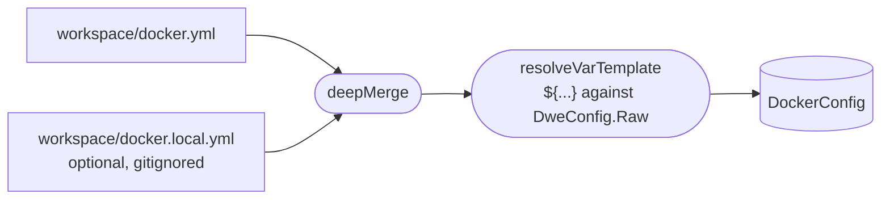

> Translated from: reference/config/docker.md @ 42382c74ee85

# docker.yml / docker.local.yml

Политика выполнения Compose для dwe-проекта.

## Содержание

- [Назначение](#назначение)
- [dwe docker vs dwe compose](#dwe-docker-vs-dwe-compose)
- [Структура](#структура)
- [Справочник полей](#справочник-полей)
  - [`project_name`](#project_name)
  - [`args`](#args)
  - [`process_env`](#process_env)
  - [`topology`](#topology)
  - [`resources`](#resources)
- [docker.local.yml](#dockerlocalyml)
- [Частые ловушки](#частые-ловушки)
- [Связанные команды](#связанные-команды)

## Назначение

`workspace/docker.yml` определяет, как `dwe docker` собирает и выполняет команды `docker compose`: имя проекта, args для каждой подкоманды и process environment. Файл `.env` автоматически регенерируется CLI до `{up, run, exec, restart, build}` — это поведение **не настраивается**.

Файл загружается отдельно и не участвует в трёхслойном мердже.

Локальные переопределения кладутся в `workspace/docker.local.yml` (gitignored). Шаблон — в `workspace/docker.local.example.yml`. Локальные переопределения глубоко мержатся в `docker.yml` до распаковки — local выигрывает при конфликте ключей, списки заменяются.



## dwe docker vs dwe compose

| Команда | Назначение |
|---------|---------|
| `dwe docker <subcommand>` | Публичный lifecycle API. Применяются policy-args. Используйте в Makefile'ах, шагах деплоя и YAML-командах. |
| `dwe compose raw <args...>` | Низкоуровневая диагностическая прокидка. Без policy-args. Используйте только для отладки. |
| `dwe compose files` | Показать список активных compose-файлов (диагностика). |
| `dwe compose argv` | Показать полный итоговый argv, включая policy-args (диагностика). |

В Makefile'ах, декларациях YAML-команд и шагах деплоя разрешены только подкоманды `dwe docker`. Прямые вызовы `docker compose` обходят политику и не должны появляться ни в какой автоматизации.

## Структура

```yaml
project_name: "${project.prefix}-${project.name}"

args:
  global: ["--ansi", "always", "--progress", "tty"]
  up: ["-d", "--remove-orphans"]
  logs: ["-f"]
  run: ["--rm"]
  pull: []
  build: []

process_env:
  DOCKER_CLI_HINTS: "false"

topology:
  hidden: [redis-insight-setup]

resources:
  volumes:
    composer_cache:
      name: dwe_composer_cache
      shared: true
      ensure_before: [up, deploy]
```

## Справочник полей

### `project_name`

```yaml
project_name: "${project.prefix}-${project.name}"
```

Имя Docker Compose-проекта, передаваемое как `-p <name>` в каждый compose-вызов. Поддерживает `${dot.path}` lookup'ы по смерженному DWE-конфигу (см. [Шаблоны](../templates.md) — пространства имён `${...}`). По умолчанию разрешается в `dwe-laravel`.

Локальное переопределение:
```yaml
# docker.local.yml
project_name: "my-custom-project"
```

### `args`

Списки args для каждой подкоманды. Каждый ключ — это имя docker-подкоманды; `global` применяется к каждому вызову перед args, специфичными для подкоманды.

```yaml
args:
  global: ["--ansi", "always", "--progress", "tty"]
  up: ["-d", "--remove-orphans"]
  logs: ["-f"]
  run: ["--rm"]
  pull: ["--policy", "always"]
  build: ["--progress", "plain"]
```

Доступные ключи подкоманд: `global`, `up`, `down`, `stop`, `restart`, `logs`, `ps`, `exec`, `run`, `pull`, `build`. (Health-чеки контейнеров используют билтин `docker_wait_healthy` в шагах пайплайна, настраиваемый параметрами `timeout` и `interval`.)

**Дефолты на ключ:**

Четыре подкоманды имеют встроенные дефолты, применяемые автоматически, когда ключ отсутствует и в `docker.yml`, и в `docker.local.yml`:

| Ключ | По умолчанию |
|-----|---------|
| `up` | `["-d", "--remove-orphans"]` |
| `logs` | `["-f"]` |
| `run` | `["--rm"]` |
| `down` | `["--remove-orphans"]` |

Другие ключи (`global`, `stop`, `restart`, `ps`, `exec`, `pull`, `build`) дефолтов не имеют — они nil, если отсутствуют, пустые, если явно `[]`, и заполнены, если явно заданы.

**Nil vs. явный empty:**

Дефолты применяются **только когда ключ отсутствует в YAML-источнике**. Явный пустой список (`key: []`) отменяет дефолт:

```yaml
# Отсутствующий ключ up → используется дефолт [-d, --remove-orphans]
args:
  logs: []  # Явный empty → дефолт не применяется, остаётся []

# Явный up → используется указанное значение, без слияния с дефолтом
args:
  up: ["--no-deps"]  # Заменяет дефолт, без слияния
```

При переопределении в `docker.local.yml` список заменяет отслеживаемый дефолт целиком (списки не сливаются):

```yaml
# docker.local.yml — убрать --progress tty (не поддерживается некоторыми терминалами)
args:
  global: ["--ansi", "always"]
  # up, logs, run, down не указаны → дефолты по-прежнему применяются из docker.yml или встроенные
```

**Подкоманды управления образами (`pull` и `build`)**

Подкоманды `pull` и `build` включают опциональные флаги для контроля набора файлов и поведения кеша:

- `dwe docker pull [--all] [services...]` — притянуть образы для сервисов. По умолчанию использует активный набор compose-файлов (base + включённые оверлеи). Флаг `--all` тянет образы по всем настроенным оверлеям, независимо от локального состояния enable, без правки `workspace/local.yml`.

- `dwe docker build [--all] [--force] [services...]` — собрать образы для сервисов. По умолчанию ведёт себя так же, как pull. Флаг `--force` дописывает `--no-cache --pull` для обхода layer-кеша Docker и повторного pull базовых слоёв. `--all` и `--force` можно комбинировать.

Если `args.pull` или `args.build` заданы, они применяются перед позиционными сервисами или force-флагами. Пример:

```yaml
args:
  pull: ["--policy", "always"]
  build: ["--progress", "plain"]
```

Флаг `--all` — это переопределение только на один вызов: он НЕ изменяет `workspace/local.yml` и не сохраняется между командами.

### `process_env`

Переменные окружения, передаваемые в каждый дочерний процесс `docker compose`. Не влияет на окружение контейнера — только на сам процесс CLI compose.

```yaml
process_env:
  DOCKER_CLI_HINTS: "false"
```

Полезно, чтобы подавить шум Docker CLI, появляющийся даже когда вывод направляется в пайп.

### `topology`

```yaml
topology:
  hidden: [redis-insight-setup]
```

| Поле | Описание |
|-------|-------------|
| `hidden` | Имена compose-сервисов, исключаемые из дерева топологии и health-чеков |

Полезно для init-контейнеров, которые отрабатывают один раз и выходят — скрытие не даёт билтину `docker_wait_healthy` их ждать.

### `resources`

Объявляет Docker-ресурсы, которые должны существовать перед определёнными командами.

```yaml
resources:
  volumes:
    composer_cache:
      name: dwe_composer_cache
      shared: true
      ensure_before: [up, deploy]
```

| Поле | Описание |
|-------|-------------|
| `volumes.<key>.name` | Базовое имя тома. Реальное имя в Docker зависит от `shared`: shared-тома используют `name` как есть; non-shared тома сохраняются как `<project_name>_<name>`, чтобы разделять жизненный цикл и область действия с compose-проектом (соответствуя соглашению Docker Compose для именованных томов, объявленных внутри `compose.yaml`). |
| `volumes.<key>.shared` | Если `true`, том независим от проекта: реальное имя в Docker равно `name`, и том переживает project reset'ы. Если `false` (по умолчанию), том привязан к проекту — runtime добавляет префикс `<project_name>_`, и `docker_remove_project_volumes` (reset-билтин) удаляет его вместе с проектом. |
| `volumes.<key>.ensure_before` | Триггеры, идемпотентно создающие том при его отсутствии. Поддерживаемые значения: `up`, `deploy`. |

```yaml
resources:
  volumes:
    composer_cache:                 # логический ключ
      name: dwe_composer_cache   # реальное имя в Docker (shared)
      shared: true
      ensure_before: [up, deploy]

    build_artifacts:                # реальное имя в Docker = "<project_name>_build_artifacts"
      name: build_artifacts
      ensure_before: [deploy]
```

`docker_remove_project_volumes` (reset-билтин) удаляет каждый том, имя которого начинается с `<project_name>_`, поэтому non-shared тома сбрасываются вместе с проектом, а shared-тома выживают.

## docker.local.yml

Локальные переопределения для политики docker. Gitignored. Используйте `workspace/docker.local.example.yml` как стартовый шаблон.

Распространённые переопределения:

```yaml
# Переопределить имя проекта
project_name: "personal-laravel"

# Убрать --progress tty (не поддерживается некоторыми терминалами)
args:
  global: ["--ansi", "always"]

# Отключить авто-генерацию .env (пре-генерируется в CI)
env:
  auto_generate: false

# Подавить Docker-подсказки
process_env:
  DOCKER_CLI_HINTS: "false"
```

## Частые ловушки

- **Прямые `docker compose` в Makefile'ах или YAML** — всегда используйте `dwe docker`. Прямые вызовы обходят policy-args, имя проекта и авто-генерацию `.env`.
- **Добавление compose-флагов в Make-рецептах** — флаги должны быть в секции args в `docker.yml`, а не в Make. Lifecycle-таргеты Make вызывают `dwe docker` без флагов.
- **Частичное переопределение args** — `args.up` в `docker.local.yml` заменяет отслеживаемый список, а не дописывает к нему. Указывайте все нужные флаги.
- **Глобальное отключение `auto_generate`** — если вы его отключили, нужно вручную регенерировать `.env` перед compose-командами, которые от него зависят.

## Связанные команды

- `dwe docker up|down|stop|restart|logs|ps|exec|run|wait|pull|build` — команды lifecycle и управления образами
- `dwe compose files` — показать список активных compose-файлов
- `dwe compose argv` — показать полный итоговый argv
- `dwe render env` — вручную регенерировать `.env`
