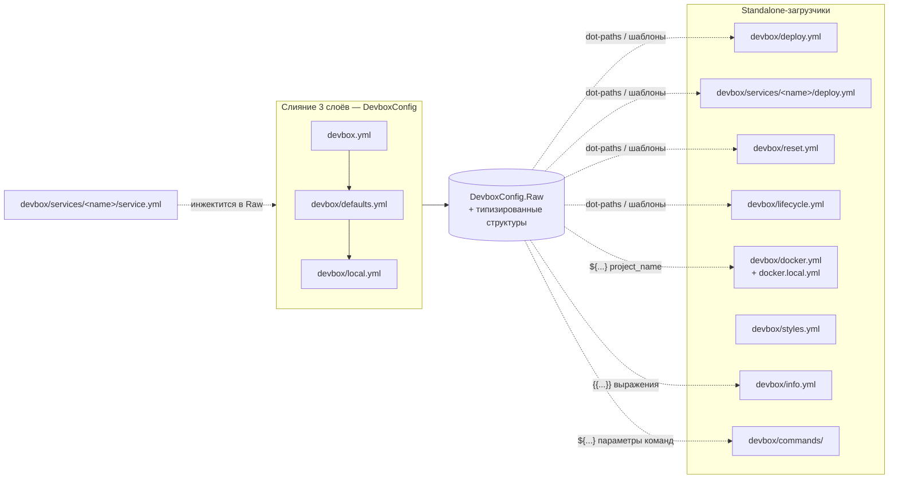

> Translated from: reference/config/index.md @ bbcd6968acb4

# Справочник конфигурации

Обзор всех конфигурационных файлов в системе devbox.

> Впервые сталкиваетесь с devbox? Начните с [Getting started](../concepts/getting-started.md), чтобы пройти сценарий от начала до конца, и возвращайтесь сюда за пофайловым справочником.

## Содержание

- [Инвентарь файлов](#инвентарь-файлов)
- [Топология загрузчиков](#топология-загрузчиков)
- [Слитые vs standalone](#слитые-vs-standalone)
- [Страницы](#страницы)
- [Связанные команды](#связанные-команды)

## Инвентарь файлов

| Файл | Трекается | Загрузчик | Назначение |
|------|-----------|-----------|------------|
| `devbox.yml` | да | layer 1 | Идентичность проекта и структура сервисов |
| `devbox/defaults.yml` | да | layer 2 | Версионированные дефолты: runtime, экспорты, тумблеры enabled сервисов |
| `devbox/local.yml` | нет (gitignored) | layer 3 | Per-user override'ы: состояние, тумблеры enabled сервисов |
| `devbox/services/<name>/service.yml` | да | standalone | Per-service декларация (dirs, cli, configs, порты) |
| `devbox/deploy.yml` | да | standalone | Deploy-пайплайн оркестратора (фазы + шаги) |
| `devbox/services/<name>/deploy.yml` | да | standalone | Per-service deploy-пайплайны |
| `devbox/reset.yml` | да | standalone | Reset-пайплайн |
| `devbox/lifecycle.yml` | да | standalone | Пайплайны run / stop (драйверы для `devbox run`/`stop`/`restart`) |
| `devbox/docker.yml` | да | standalone | Политика выполнения compose |
| `devbox/docker.local.yml` | нет (gitignored) | сливается в `docker.yml` | Локальные override'ы compose-политики |
| `devbox/styles.yml` | да | standalone | ASCII header, цветовая палитра, разделитель |
| `devbox/info.yml` | да | standalone | Секции info-дашборда |
| `devbox/commands/` | да | standalone | Декларативные определения команд (per-file группы) |
| `devbox/validate.yml` | да | standalone | Проверки готовности проекта (preflight + `devbox validate`) |
| `devbox/snapshot.yml` | да | standalone | Snapshot-workflow'ы: create / restore / remove (`devbox snapshot`) |
| `devbox/i18n/*.yml` | нет (ignored) | standalone | Переводы пользовательских команд и UI-строк (опционально; один файл на язык) |

## Runtime-артефакты

Директория `.devbox/` содержит управляемые Devbox артефакты и **gitignored**:

- `.devbox/logs/` — логи пайплайнов (deploy, reset, lifecycle run/stop)
- `.devbox/deploy/deploy.lock` — lock-файл деплоя (только Unix; предотвращает параллельные деплои)
- `.devbox/deploy/state.yml` — журнал состояния деплоя (трекает deploy-статус и хэши сервисов)
- `.devbox/snapshots/snapshot.lock` — snapshot lock-файл (только Unix; сериализует snapshot-мутации и совместно захватывается lifecycle-командами деплоя)
- `.devbox/snapshots/current` — указатель текущего снапшота (последний созданный или восстановленный)
- `.devbox/snapshots/.pre-restore-backup/` — бэкап `devbox/local.yml` + `.devbox/deploy/state.yml`, снимаемый перед каждым restore; цель ручного восстановления при сбое restore

Добавьте `.devbox/` в `.gitignore` проекта, если ещё не добавлено.

## Топология загрузчиков

## Слитые vs standalone

**Слитые (3-слойный конфиг)**: `devbox.yml` → `devbox/defaults.yml` → `devbox/local.yml` глубоко сливаются на старте. Поздние слои выигрывают; map'ы сливаются рекурсивно. Результат — эффективный конфиг, используемый для генерации `.env`, резолва топологии и правил экспорта. Каждый `devbox/services/<name>/service.yml` грузится отдельно и затем инжектится в слитый raw-map, чтобы dot-пути вроде `services.main.container` резолвились.

**Standalone**: `devbox/services/<name>/service.yml`, `deploy.yml`, `devbox/services/<name>/deploy.yml`, `reset.yml`, `lifecycle.yml`, `docker.yml` (+ `docker.local.yml`), `styles.yml`, `info.yml` и `commands/*.yml` грузятся выделенными функциями в `internal/core/project/config/` и `internal/core/usercommands/`. Они не часть 3-слойного слияния, но большинство из них резолвят template-выражения против слитого конфига.

## Файлы, поддерживающие локальные override'ы

На данный момент только `docker.local.yml` поддерживает вариант `.local.yml` для per-developer кастомизации. Паттерн такой:

**Docker**: `devbox/docker.yml` (трекаемый, общий на весь проект) + `devbox/docker.local.yml` (gitignored, per-developer). Локальный файл сливается поверх базового, позволяя разработчикам кастомизировать политику выполнения compose — например, добавить дополнительные volume'ы, смонтировать локальные директории с исходниками или переопределить platform/args, не задевая коллег.

**Почему только docker?** Docker-настройки по своей природе персональные — они зависят от локального окружения разработчика (доступные бинарники, монтирование volume'ов, различия платформ). Другие конфиги вроде `lifecycle.yml`, `info.yml` и `styles.yml` общие на весь проект и не выигрывают от per-developer override'ов.

Подробнее о семантике и примерах `docker.local.yml` см. [docker.yml](docker.md#dockerlocalyml).

## Страницы

- [devbox / defaults / local](devbox.md) — 3-слойный слитый конфиг: порядок слияния, приоритет, резолв dot-path'ов, справочник полей
- [services/<name>/service.yml](services/index.md) — per-service декларации, extends, dirs, cli-конфиг
- [deploy.yml / reset.yml](deploy/index.md) — deploy- и reset-пайплайны, шаги, билтины, file-логирование, идемпотентный деплой
- [state.yml](state/index.md) — трекинг состояния деплоя, таблица skip-решений, хэширование, lock-файл, восстановление после крашей
- [lifecycle.yml](lifecycle.md) — пайплайны run/stop, проба обновлений, hook-фазы, гейт обязательных сервисов
- [Условия и действия](conditions.md) — типизированные условия для `when:`, типизированные действия для `check:` и тел шагов, различие predicate vs engine-builtin
- [docker.yml](docker.md) — политика выполнения Compose, имя проекта, env-триггеры
- [styles.yml](styles.md) — ASCII header, цветовая палитра, разделитель
- [info.yml](info.md) — секции info-дашборда, template-выражения
- [commands/](commands/index.md) — декларативные команды: типы, параметры, контекст, файлы, workflow'ы, шаблоны
- [validate.yml](validate.md) — проверки готовности проекта: env-пробы, декларативные проверки, билтины, стадии, preflight
- [snapshot.yml](snapshot.md) — snapshot-workflow'ы: блоки create/restore/remove, варианты, неймспейс `${snapshot.*}`, manifest, взаимодействие с lock, безопасность архивов
- [Локализация (i18n)](i18n.md) — переводы пользовательских команд и UI-строк: разрешение локали, формат файла, справочник ключей, валидация
- [Уведомления](notifications.md) — user-level desktop-уведомления: расположение конфиг-файлов, ключи, gate-матрица, env-override'ы
- [UI](ui.md) — конфигурация интерактивного браузера команд: глубина, collapse, бэйджи, хоткеи, fallback-лестница
- [Шаблоны](../templates.md) — Go-шаблоны, shorthand `${...}`, sprout-хелперы (общие для info, commands, пайплайнов, render-паков)

## Связанные команды

- `devbox render env` — генерирует `.env` из правил экспорта слитого конфига
- `devbox render ide` — генерирует IDE-конфиги
- `devbox render ai` — генерирует hub-level AGENTS.md и симлинки CLAUDE.md
- `devbox render git` — генерирует shell-хуки git в `<svc.Dir>/src/.git/hooks/`
- `devbox info` — рендерит info-дашборд из `info.yml`
- `devbox deploy plan` — показывает разрешённый deploy-пайплайн
- `devbox compose files` — показывает список активных compose-файлов (диагностика)
- `devbox status apps` — показывает app-сервисы с health и deploy-статусом
- `devbox status tools` — показывает таблицу tool-сервисов (read-only)
- `devbox status infra` — показывает таблицу infra-сервисов (read-only)
