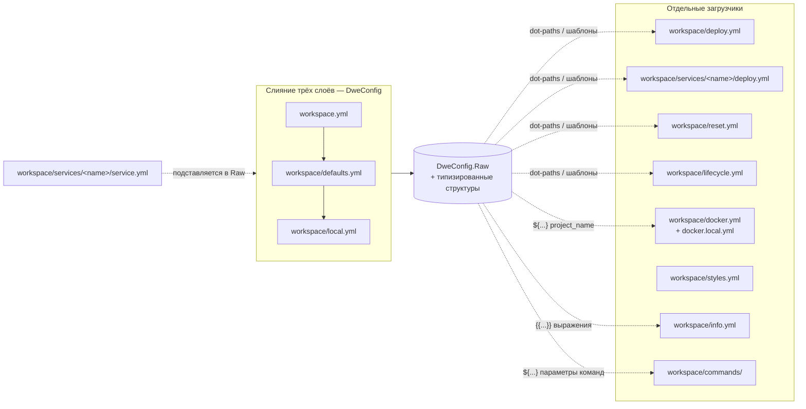

> Translated from: reference/config/index.md @ 00a1843a72e3

# Справочник конфигурации

Обзор всех конфигурационных файлов в системе DWE.

> Впервые сталкиваетесь с DWE? Начните с [Getting started](../concepts/getting-started.md), чтобы пройти сценарий от начала до конца, а затем возвращайтесь сюда за пофайловым справочником.

## Содержание

- [Инвентарь файлов](#инвентарь-файлов)
- [Топология загрузчиков](#топология-загрузчиков)
- [Смерженные vs standalone](#смерженные-vs-standalone)
- [Страницы](#страницы)
- [Связанные команды](#связанные-команды)

## Инвентарь файлов

| Файл | Трекается | Загрузчик | Назначение |
|------|-----------|-----------|------------|
| `workspace.yml` | да | слой 1 | Идентификация проекта, структура сервисов и recipient блока `secrets:` |
| `workspace/defaults.yml` | да | слой 2 | Версионированные значения по умолчанию: runtime, экспорты, переключатели enabled сервисов |
| `workspace/local.yml` | нет (gitignored) | слой 3 | Переопределения на пользователя: переключатели enabled сервисов, личные vars |
| `workspace/services/<name>/service.yml` | да | отдельный | Декларация сервиса (dirs, cli, configs, порты) |
| `workspace/deploy.yml` | да | отдельный | Deploy-пайплайн оркестратора (фазы + шаги) |
| `workspace/services/<name>/deploy.yml` | да | отдельный | Deploy-пайплайны на каждый сервис |
| `workspace/reset.yml` | да | отдельный | Reset-пайплайн |
| `workspace/lifecycle.yml` | да | отдельный | Пайплайны run / stop (драйверы для `dwe run`/`stop`/`restart`) |
| `workspace/docker.yml` | да | отдельный | Политика выполнения compose |
| `workspace/docker.local.yml` | нет (gitignored) | сливается с `docker.yml` | Локальные переопределения политики compose |
| `workspace/styles.yml` | да | отдельный | ASCII header, цветовая палитра, разделитель |
| `workspace/info.yml` | да | отдельный | Секции info-дашборда |
| `workspace/commands/` | да | отдельный | Декларативные определения команд (по группе на файл) |
| `workspace/validate.yml` | да | отдельный | Проверки готовности проекта (preflight + `dwe validate`) |
| `workspace/snapshot.yml` | да | отдельный | Snapshot-workflow'ы: create / restore / remove (`dwe snapshot`) |
| `workspace/tests/<scenario>.yml` | да | отдельный | Сценарии интеграционных тестов: изолированный деплой + шаги-проверки (`dwe test`) |
| `workspace/i18n/*.yml` | да | отдельный | Переводы пользовательских команд и UI-строк (опционально; один файл на язык) |

## Runtime-артефакты

Директория `.dwe/` содержит управляемые DWE артефакты и **gitignored**:

- `.dwe/logs/` — логи пайплайнов (deploy, reset, lifecycle run/stop)
- `.dwe/deploy/deploy.lock` — lock-файл деплоя (только Unix; предотвращает параллельные деплои)
- `.dwe/deploy/state.yml` — журнал состояния деплоя (отслеживает deploy-статус и хэши сервисов)
- `.dwe/snapshots/snapshot.lock` — snapshot lock-файл (только Unix; сериализует изменения снапшотов и совместно захватывается lifecycle-командами деплоя)
- `.dwe/snapshots/current` — указатель текущего снапшота (последний созданный или восстановленный)
- `.dwe/snapshots/.pre-restore-backup/` — резервная копия `workspace/local.yml` + `.dwe/deploy/state.yml`, снимаемая перед каждым restore; используется для ручного восстановления при сбое restore
- `.dwe/tests/runs/<scenario>/`, `.dwe/tests/locks/<scenario>.lock`, `.dwe/tests/manifests/<scenario>-<run-id>.yml`, `.dwe/tests/reports/<scenario>/` — копии сценариев `dwe test`, per-scenario flock'и, durable-манифесты запусков и артефакты отчётов об ошибках (собираются только при сбое)

Добавьте `.dwe/` в `.gitignore` проекта, если ещё не добавлено.

## Топология загрузчиков

## Смерженные vs standalone

**Смерженные (трёхслойный конфиг)**: `workspace.yml` → `workspace/defaults.yml` → `workspace/local.yml` глубоко сливаются на старте. Поздние слои перекрывают предыдущие; map'ы сливаются рекурсивно. Результат — эффективный конфиг, используемый для генерации `.env`, разрешения топологии и правил экспорта. Каждый `workspace/services/<name>/service.yml` грузится отдельно и затем подставляется в смерженный raw-map, чтобы dot-пути вроде `services.main.container` корректно резолвились.

**Отдельные**: `workspace/services/<name>/service.yml`, `deploy.yml`, `workspace/services/<name>/deploy.yml`, `reset.yml`, `lifecycle.yml`, `docker.yml` (+ `docker.local.yml`), `styles.yml`, `info.yml` и `commands/*.yml` грузятся выделенными функциями в `internal/core/project/config/` и `internal/core/usercommands/`. Они не участвуют в трёхслойном слиянии, но большинство из них разрешают template-выражения по смерженному конфигу.

## Файлы, поддерживающие локальные переопределения

На данный момент только `docker.local.yml` поддерживает вариант `.local.yml` для кастомизации на разработчика. Паттерн такой:

**Docker**: `workspace/docker.yml` (отслеживаемый, общий на весь проект) + `workspace/docker.local.yml` (gitignored, на разработчика). Локальный файл сливается поверх базового, позволяя разработчикам кастомизировать политику выполнения compose — например, добавить дополнительные volume'ы, смонтировать локальные директории с исходниками или переопределить platform/args, не задевая коллег.

**Почему только docker?** Docker-настройки по своей природе персональные — они зависят от локального окружения разработчика (доступные бинарники, монтирование volume'ов, различия платформ). Другие конфиги вроде `lifecycle.yml`, `info.yml` и `styles.yml` общие на весь проект и не выигрывают от переопределений на разработчика.

Подробнее о семантике и примерах `docker.local.yml` см. [docker.yml](docker.md#dockerlocalyml).

## Страницы

- [workspace / defaults / local](workspace.md) — трёхслойный смерженный конфиг: порядок слияния, приоритет, разрешение dot-путей, справочник полей
- [vars](vars.md) — команда `dwe vars`: перечисление/чтение/редактирование/трассировка песочницы `vars:`, запись с сохранением комментариев, статическое сканирование использований, allowlist контейнерной записи `bridge.vars_writable`
- [secrets](secrets.md) — зашифрованные at rest значения, закоммиченные в репозиторий: recipient блока `secrets:`, маркеры `ENC[age:…]`, источники паков `.age`, ключи и переменные окружения, подкоманды `dwe secrets`, защита рендеров и preflight
- [services/<name>/service.yml](services/index.md) — декларации сервисов, extends, dirs, cli-конфиг
- [deploy.yml / reset.yml](deploy/index.md) — deploy- и reset-пайплайны, шаги, билтины, file-логирование, идемпотентный деплой
- [state.yml](state/index.md) — отслеживание состояния деплоя, таблица skip-решений, хэширование, lock-файл, восстановление после падений
- [lifecycle.yml](lifecycle.md) — пайплайны run/stop, проба обновлений, hook-фазы, гейт обязательных сервисов
- [Условия и действия](conditions.md) — типизированные условия для `when:`, типизированные действия для `check:` и тел шагов, различие predicate vs engine-builtin
- [docker.yml](docker.md) — политика выполнения Compose, имя проекта, env-триггеры
- [styles.yml](styles.md) — ASCII header, цветовая палитра, разделитель
- [info.yml](info.md) — секции info-дашборда, template-выражения
- [commands/](commands/index.md) — декларативные команды: типы, параметры, контекст, файлы, workflow'ы, шаблоны
- [validate.yml](validate.md) — проверки готовности проекта: env-пробы, декларативные проверки, билтины, стадии, preflight
- [snapshot.yml](snapshot.md) — snapshot-workflow'ы: блоки create/restore/remove, варианты, неймспейс `${snapshot.*}`, manifest, взаимодействие с lock, безопасность архивов
- [tests/](tests.md) — сценарии интеграционных тестов: схема, `auto`-порты, модель изоляции, teardown, `dwe test run/list/clean`, отчёты об ошибках, коды выхода
- [Локализация (i18n)](i18n.md) — переводы пользовательских команд и UI-строк: разрешение локали, формат файла, справочник ключей, валидация
- [Пользовательский конфиг](userconfig.md) — пользовательские настройки: расположение файла, синтаксис, переопределения бинарей, язык, тема mermaid
- [Уведомления](notifications.md) — desktop-уведомления на уровне пользователя: расположение конфиг-файлов, ключи, матрица условий, env-переопределения
- [Шаблоны](../templates.md) — Go-шаблоны, shorthand `${...}`, sprout-хелперы (общие для info, commands, пайплайнов, render-паков)

## Связанные команды

- `dwe secrets status` — сообщает про каждое зашифрованное значение и можно ли его прочитать здесь
- `dwe render env` — генерирует `.env` из правил экспорта смерженного конфига
- `dwe render ide` — генерирует IDE-конфиги
- `dwe render ai` — генерирует hub-level AGENTS.md и симлинки CLAUDE.md
- `dwe render git` — генерирует shell-хуки git в `<svc.Dir>/src/.git/hooks/`
- `dwe info` — рендерит info-дашборд из `info.yml`
- `dwe deploy plan` — показывает итоговый deploy-пайплайн
- `dwe compose files` — показывает список активных compose-файлов (диагностика)
- `dwe status apps` — показывает app-сервисы с health и deploy-статусом
- `dwe status tools` — показывает таблицу tool-сервисов (read-only)
- `dwe status infra` — показывает таблицу infra-сервисов (read-only)
- `dwe test run` — запускает изолированные сценарии интеграционных тестов на одноразовой копии проекта
- `dwe test list` — список доступных сценариев интеграционных тестов
- `dwe test clean` — убирает сохранённые/оставшиеся окружения интеграционных тестов и сообщает (никогда не удаляет автоматически) об осиротевших compose-проектах (на основе манифестов; `--dry-run`, `[scenario...]`)
