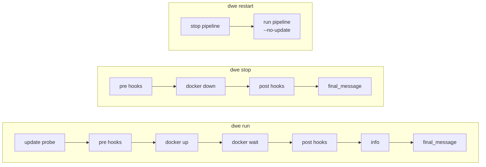

> Translated from: reference/config/lifecycle.md @ 1db04b2f2749

# lifecycle.yml

Декларации пайплайнов run / stop, управляющие `dwe run`, `dwe stop` и `dwe restart`.

## Содержание

- [Назначение](#назначение)
- [Форма пайплайна](#форма-пайплайна)
- [Структура](#структура)
- [Проба самообновления](#проба-самообновления)
- [`run.show_info` / `run.final_message`](#runshow_info--runfinal_message)
- [`stop.final_message`](#stopfinal_message)
- [`log` (логирование в файл)](#log-логирование-в-файл)
- [Hook-фазы](#hook-фазы)
- [Минимальный пример](#минимальный-пример)
- [Валидация](#валидация)
- [Параллельные группы шагов](#параллельные-группы-шагов)
- [Частые ловушки](#частые-ловушки)
- [Связанные команды](#связанные-команды)

## Назначение

`workspace/lifecycle.yml` декларирует два пайплайна:

- **`run:`** — выполняется командой `dwe run` (и `dwe restart` после stop). Оборачивает стандартную последовательность `docker up` + `docker wait` опциональными pre/post hook-фазами. Проба самообновления настраивается отдельно в верхнеуровневом [блоке `update:`](workspace.md#блок-update), а не здесь.
- **`stop:`** — выполняется командой `dwe stop` (и первой половиной `dwe restart`). Оборачивает `docker down` опциональными pre/post hook-фазами.

Файл загружается отдельно и **не** участвует в трёхслойном мердже.

Файл опционален для всех команд, которые его используют.

Если `lifecycle.yml` отсутствует или отсутствует секция, DWE подставляет встроенный пайплайн по умолчанию и печатает одну info-строку в stderr: `Using built-in default <run|stop> pipeline (override with workspace/lifecycle.yml).` Info-строка подавляется в режиме `--output json`.

**Дефолтный пайплайн `run:`** (срабатывает, когда `lifecycle.yml` отсутствует или не имеет секции `run:`):

| Поле | Значение |
|-------|-------|
| `show_info` | `true` |
| `final_message` | `Project is ready for work!` |
| Фазы | Одна фаза `start`: один шаг `type: dwe` с `cmd: "docker up --wait"` |

**Дефолтный пайплайн `stop:`** (срабатывает, когда `lifecycle.yml` отсутствует или не имеет секции `stop:`):

| Поле | Значение |
|-------|-------|
| `final_message` | `Project is stopped. Have a nice day!` |
| Фазы | Auto-reap фаза (см. ниже) + одна фаза `stop`: один шаг `type: dwe` с `cmd: "docker down"` |

Всякий раз, когда запускается пайплайн `stop:` (дефолтный или пользовательский), автоматически прижимается фаза `_auto_reap_daemons`; opt-out нет, и она видна в plan output для прозрачности. Она останавливает все фоновые демоны, запущенные через команды [`type: daemon`](commands/types.md#type-daemon).

`dwe docker up` и `dwe docker down` — тонкие проводники к Docker Compose и никогда не используют этот пайплайн; сырые `docker compose stop` / `restart` остаются доступны через `dwe docker stop` / `dwe docker restart`.

## Форма пайплайна



`docker up` выполняется как единственный шаг `type: dwe` с `cmd: "docker up --wait"` внутри фазы `start`; флаг `--wait` выполняет ожидание health встроенно (без отдельного шага `docker_wait_healthy`). В нём нет магии — исполнитель пайплайна вызывает его как любой другой шаг, поэтому он подхватывает политику из `docker.yml`.

## Структура

```yaml
run:
  show_info: true
  final_message: "Project is ready for work!"
  log: false            # tee status + child stdout/stderr to .dwe/logs/run.log
  phases:
    - name: <phase>
      description: <text>
      when:             # optional: typed condition (see deploy/conditions.md)
        type: builtin|shell|template
        cmd: <string>
        expr: <string>
      steps:
        - name: <step>
          type: shell|dwe|command|builtin
          cmd: <value>
          with:         # optional: parameters
            key: value

stop:
  final_message: "Project is stopped. Have a nice day!"
  log: false            # tee status + child stdout/stderr to .dwe/logs/stop.log
  phases:
    - name: <phase>
      description: <text>
      when:             # optional: typed condition
        type: builtin|shell|template
        cmd: <string>
        expr: <string>
      steps:
        - name: <step>
          type: shell|dwe|command|builtin
          cmd: <value>
          with:         # optional: parameters
            key: value
```

Фазы и шаги используют ту же форму, что [deploy.yml](deploy/index.md): `name`, `description`, `when`, `untracked`, `steps[]`, плюс per-step `type` / `cmd` / `with`, `when`, `check`, `files_gate`, `continue_on_error`. См. справочник deploy для полной грамматики шага, включая [`files_gate:` (предусловие для файлов)](deploy/conditions.md#files_gate-pre-condition-for-files).

`deploy_services: true` **не** разрешено в lifecycle-пайплайнах.

## Проба самообновления

Опциональная проба самообновления запускается до любой фазы. Она может фетчить из upstream-ремоута, детектить drift и (с согласия) пуллить `--ff-only`. Успешный pull триггерит in-process перезагрузку `DweConfig`, `LifecycleConfig` и реестра команд до выполнения фаз.

Проба управляется формализованным верхнеуровневым [блоком `update:`](workspace.md#блок-update) в `workspace.yml` / `local.yml` (`mode: on | off`), который участвует в трёхслойном мердже. Включение обновления — это однострочник, который не обнуляет `run.phases`.

Приоритет в runtime при `dwe run`: флаг `--no-update` > флаг `--update <mode>` > `update.mode` из смердженной конфигурации. Полное описание поведения — в [справочнике блока `update:`](workspace.md#блок-update) и [интеграции с git → проба обновления](../concepts/git.md#проба-обновления-dwe-run).

## `run.show_info` / `run.final_message`

| Поле | Тип | По умолчанию | Описание |
|-------|------|---------|-------------|
| `show_info` | bool | `false` | Дописать рендер `dwe info` после последней фазы. |
| `final_message` | string | `Project is ready for work!` | Сообщение об успехе, печатаемое в самом конце. |

## Гейт деплоя required-сервисов

`dwe run` автоматически гейтит на том, чтобы required-сервисы были задеплоены. До старта пайплайна run команда проверяет, что все **tracked**-сервисы (те, что появляются в разрешённом плане деплоя) имеют `status: deployed` в state-файле.

Если какой-то tracked-сервис ещё не задеплоен, `dwe run` выходит с ошибкой: "run `dwe deploy run` first". Это предотвращает запуск против частично инициализированного окружения — обход гейта просто отдал бы `docker compose up` сервис, чьи тома/конфиги/база данных никогда не провижились, и run упал бы почти сразу с несвязанной ошибкой. Всегда сначала деплойте.

Подробности см. в [state/index.md](state/index.md).

## `stop.final_message`

| Поле | Тип | По умолчанию | Описание |
|-------|------|---------|-------------|
| `final_message` | string | `Project is stopped. Have a nice day!` | Сообщение об успехе, печатаемое в самом конце. |

## `log` (логирование в файл)

Верхнеуровневое поле и на `run:`, и на `stop:`. По умолчанию `false` для lifecycle-пайплайнов (в отличие от `deploy.yml`, где дефолт — `true`).

Когда включено, статус-сообщения DWE и stdout/stderr дочерних процессов теются в `.dwe/logs/<name>.log` (с убранными ANSI-кодами) — `.dwe/logs/run.log` для run, `.dwe/logs/stop.log` для stop.

```yaml
run:
  log: true     # tee to .dwe/logs/run.log
```

## Hook-фазы

Hook-фазы — это конвенциональные имена (`pre` / `post`), используемые для оборачивания стандартной работы start/stop. Добавляйте `continue_on_error: true` на каждый шаг, чтобы упавший хук не прерывал основной lifecycle:

```yaml
run:
  phases:
    - name: pre
      description: Before-run hooks (continue on failure)
      steps:
        - name: before-run
          type: command
          cmd: project.before-run
          continue_on_error: true

    - name: start
      description: Start containers and wait for health
      steps:
        - name: up
          type: dwe
          cmd: "docker up"
        - name: wait
          type: builtin
          cmd: docker_wait_healthy

    - name: post
      description: After-run hooks (continue on failure)
      steps:
        - name: after-run
          type: command
          cmd: project.after-run
          continue_on_error: true
```

`continue_on_error: true` приводит к тому, что падение фиксируется через `FailStep` (красный ✗), но выполнение переходит к следующему шагу, а пост-шаговый `check` не вычисляется.

## Минимальный пример

```yaml
# workspace/lifecycle.yml
run:
  show_info: true
  final_message: "Project is ready for work!"
  phases:
    - name: start
      description: Start containers and wait for health
      steps:
        - name: up
          type: dwe
          cmd: "docker up"
        - name: wait
          type: builtin
          cmd: docker_wait_healthy

stop:
  final_message: "Project is stopped. Have a nice day!"
  phases:
    - name: stop
      description: Stop and remove containers
      steps:
        - name: down
          type: dwe
          cmd: "docker down"
```

## Валидация

При загрузке файла проверяется:

- Каждый шаг в `run.phases` и `stop.phases` имеет поле `type:` с одним из `shell`, `dwe`, `command`, `builtin`.
- Блок `run.update` отвергается — проба самообновления настраивается в верхнеуровневом [блоке `update:`](workspace.md#блок-update). Строгий декодер `lifecycle.yml` жёстко падает на неизвестном ключе `update` под `run:`.
- `deploy_services: true` отвергается (валидно только в `deploy.yml`).
- `final_message` и `log` нормализуются в значения по умолчанию при отсутствии.

## Параллельные группы шагов

Lifecycle-фазы используют тот же контейнер step-group `parallel:`, что и `deploy.yml`. Шаг может объявить `parallel: { max_concurrent, fail_fast, steps }` вместо листового тела, и внутренние под-шаги запускаются параллельно с той же семантикой отмены, журнала и репортёра. Схему, дефолты, правила валидации и модель выполнения см. в [deploy → Параллельные группы шагов](deploy/examples.md#parallel-step-groups).

## Частые ловушки

- **Забыть `continue_on_error: true` на hook-шагах** — без него упавший pre-stop хук прерывает всю последовательность stop, и контейнеры не останавливаются.
- **Размещение `update:` под `run:`** — проба самообновления настраивается в верхнеуровневом [блоке `update:`](workspace.md#блок-update) в `workspace.yml` / `local.yml`, а не в `lifecycle.yml`. Блок `run.update` отвергается при загрузке.
- **Добавление фаз `deploy_services`** — они только для деплоя. Lifecycle-пайплайны вызывают сервисы через ссылки `type: command`.
- **Редактирование `lifecycle.yml` для использования прямых вызовов `docker compose`** — публичный API — это `type: dwe` с `cmd: "docker up"`. Прямые вызовы `docker compose` обходят политику из `docker.yml`.

## Связанные команды

- `dwe run` — выполнить пайплайн run (с опциональным update-пробом)
- `dwe run --no-update` — пропустить update-проб
- `dwe run --update <mode>` — переопределить настроенный режим
- `dwe stop` — выполнить пайплайн stop
- `dwe restart` — `stop`, затем `run --no-update`
- `dwe docker up` / `dwe docker down` — сырая прокидка к Docker Compose (не использует этот пайплайн)
