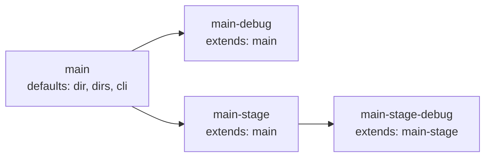

> Translated from: reference/config/services/extends.md @ 820d54a1850b

# Наследование через `extends`

Дочерний сервис `type: app` наследует все поля у указанного родителя. Затем потомок переопределяет только те поля, которые объявляет сам. Многоуровневые цепочки поддерживаются и разрешаются в топологическом порядке — внук получает значения родителя косвенно через своего прямого родителя.

## Содержание

- [Защита «только app»](#защита-только-app)
- [Правила разрешения](#правила-разрешения)
- [Топологическая сортировка](#топологическая-сортировка)
- [Разбор примера](#разбор-примера)

## Защита «только app»

`extends:` отклоняется при загрузке для любой записи `type: tool` или `type: infra`. Дискриминатор проверяется до слияния, поэтому межтиповые цепочки никогда не разрешаются.



## Правила разрешения

- Скалярные поля (`dir`, `dir_internal`, `work_dir_internal`, `cli.mode`, `cli.shell`, `cli.user`, `cli.workdir`) — потомок побеждает, если задан, родитель заполняет только когда значение потомка пусто. `type` обязателен в каждом `service.yml` и никогда не наследуется.
- `dirs` — список родителя идёт первым; записи потомка дописываются; дубликаты удаляются (порядок родителя сохраняется).
- `configs` — потомок полностью заменяет родителя, если задан (у потомка свой список); список родителя используется только когда потомок опускает ключ.
- `cli.env` — рекурсивное слияние карт: родитель даёт значения по умолчанию, потомок переопределяет по ключу.
- `render.ide.enabled`, `render.ide.template`, `render.ai.enabled`, `render.ai.template`, `render.git.enabled` и `render.git.template` — наследуются как скалярные поля. Явные `enabled: true|false` или непустой `template` потомка переопределяют родительские; опущенные значения наследуются от родителя. Это позволяет внукам наследовать настройки косвенно.
- `compose` — наследуется, когда потомок не объявляет собственного списка `compose:` (список родителя клонируется); собственный список потомка полностью заменяет родительский, не сливается.
- `container`, `required`, `depends_on` — никогда не наследуются. Потомок, опускающий `container`, по умолчанию получает имя папки сервиса при загрузке. Каждый потомок указывает собственный `depends_on`.

## Топологическая сортировка

`LoadServices` разрешает граф `extends:` в топологическом порядке, поэтому многоуровневые цепочки (`C → B → A`) сливаются корректно независимо от порядка обхода карты. Циклы и неизвестные родители сообщаются как ошибки загрузки. Для каждого потомка от родителя наследуются только поля с нулевым значением; при конфликтах поля потомка имеют приоритет. Наследуемые слайсы / карты копируются защитно (`slices.Clone` / `maps.Clone`), поэтому мутация потомка никогда не повреждает родителя.

## Разбор примера

```yaml
# workspace/services/main/service.yml
type: app
container: app-main
required: true
dir: ./services/main
dirs: [logs, home, runtime]
cli:
  shell: bash
  user: www-data
render:
  ide:
    enabled: true
```

```yaml
# workspace/services/main-debug/service.yml
type: app
extends: main            # наследует dir, dirs, cli, render и т.д.
container: app-main-debug
required: false
compose:
  - compose/services/main/debug.yml
cli:
  env:
    - XDEBUG_CONFIG="cli_color=1"
render:
  ide:
    template: main-debug  # переопределить template, оставить enabled: true от родителя
```

`main-debug` получает `dir`, `dirs`, базовый `cli` и `render.ide.enabled: true` от `main`. Он переопределяет `render.ide.template`, чтобы использовать пользовательский подкаталог шаблона (`workspace/templates/ide/main-debug/`), и добавляет собственный оверлей `compose` и дополнительные env. Когда запускается `dwe render ide`, оба сервиса разделяют `dir: ./services/main`, поэтому самый дочерний (`main-debug`) побеждает и рендерит свой пользовательский шаблон; `main` пропускается с предупреждением о коллизии.
