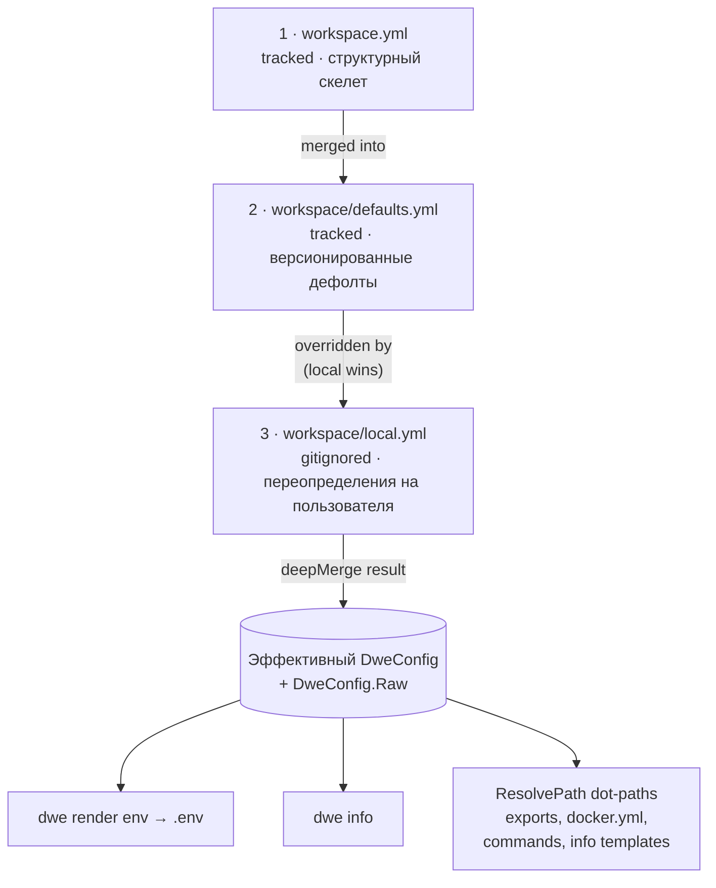

> Translated from: reference/config/workspace.md @ 48f7ba4797ce

# workspace.yml / defaults.yml / local.yml

Три слоя смерженного конфига DWE.

## Содержание

- [Обзор мерджа](#обзор-мерджа)
- [Что принадлежит каждому слою](#что-принадлежит-каждому-слою)
- [Разрешение dot-path](#разрешение-dot-path)
  - [Откуда берутся поля сервисов](#откуда-берутся-поля-сервисов)
- [Строгий корень + песочница `vars:`](#строгий-корень--песочница-vars)
  - [Ошибки о неизвестных полях](#ошибки-о-неизвестных-полях)
- [workspace.yml](#workspaceyml)
  - [Справочник полей](#справочник-полей)
  - [Блок `secrets:`](#блок-secrets)
  - [Блок `update:`](#блок-update)
  - [Блок `stop:`](#блок-stop)
- [Рекомендуемое соглашение о раскладке файлов](#рекомендуемое-соглашение-о-раскладке-файлов)
- [workspace/defaults.yml](#workspacedefaultsyml)
  - [Оверлей `services`](#оверлей-services)
  - [`runtime`](#runtime)
  - [`exports.env`](#exportsenv)
  - [`compose`](#compose)
- [workspace/local.yml](#workspacelocalyml)
  - [Compose-оверлеи](#compose-оверлеи)
- [Частые ловушки](#частые-ловушки)
- [Связанные команды](#связанные-команды)

## Обзор мерджа



Читайте сверху вниз: каждая стрелка — это «следующий слой накладывается сверху». `local.yml` идёт последним, поэтому любой ключ, который он задаёт, перекрывает тот же ключ из `defaults.yml` или `workspace.yml`. Ключи, отсутствующие в `local.yml`, проваливаются к `defaults.yml`, затем к `workspace.yml`, и в конце — к Go-zero value.

Три файла используют одно пространство имён — один и тот же ключ в разных слоях — это одна и та же настройка. Слой 1 задаёт структуру, слой 2 заполняет значения по умолчанию, слой 3 переопределяет для локальной машины. Ни один из трёх не обязан объявлять каждый ключ; отсутствующие ключи просто проваливаются к слою, где они заданы, и в конце — к Go-zero value.

`workspace/local.yml` опционален: если он отсутствует, мердж молча пропускает слой 3.

## Что принадлежит каждому слою

| Назначение | Слой |
|---------|-------|
| Имя и префикс проекта | `workspace.yml` |
| Порты / хосты сервисов (apps, tools, infra) | [`workspace/services/<name>/service.yml`](services/index.md) (per-entry карты `ports:` / `hosts:`) |
| Структурные определения сервисов (container / compose / status / render) | [`workspace/services/<name>/service.yml`](services/index.md) |
| Опциональное состояние enabled для сервисов (для всех типов) | `defaults.yml` (переопределяемо в `local.yml`) |
| Правила экспорта (`exports.env`) | `defaults.yml` |
| Дефолты блока `vars.db.*` | `defaults.yml` |
| Значения портов / хостов сервисов | [`workspace/services/<name>/service.yml`](services/index.md) (проектные определения) и `local.yml` (переопределения на разработчика, deep-merge по имени записи) |
| Личные креды (`vars.db.user`, `vars.db.password`) | `local.yml` |
| Общекомандные креды (токен бота, JSON сервис-аккаунта) | `defaults.yml`, в зашифрованном виде — см. [`secrets.md`](secrets.md) |
| Age-recipient проекта (`secrets.recipient`) | только `workspace.yml` — во всех остальных слоях отклоняется с ошибкой |
| Включение debug / опциональных сервисов | `local.yml` |
| Конфигурация, сгенерированная мастером | `local.yml` (пишется `dwe deploy` при ответе на вопросы setup или конфликты портов) |

Сами определения сервисов (apps, tools, infra — включая их порты / хосты) лежат в per-folder файлах [`workspace/services/<name>/service.yml`](services/index.md), которые загружаются отдельно и не участвуют в этом мердже. Трёхслойный оверлей содержит `services.<name>.enabled`, `services.<name>.ports` и `services.<name>.hosts`. Карты портов и хостов глубоко мержатся по имени записи, поэтому частичное переопределение затрагивает только перечисленные ключи.

Команда `dwe deploy` включает интерактивный мастер, запускающийся на свежих проектах (когда `workspace/local.yml` отсутствует или пуст). Мастер собирает ответы на вопросы, объявленные в [`workspace/setup.yml`](setup.md), и предлагает переопределить порты при наличии конфликтов. Все ответы глубоко мержатся в `local.yml` и атомарно записываются до того, как деплой продолжится. Подробности схемы см. в [`workspace/setup.yml`](setup.md).

## Разрешение dot-path

CLI хранит смерженный результат в двух местах: в типизированной структуре `DweConfig` (с полями вроде `DweConfig.Services` и `DweConfig.Runtime.UseHTTPS`) и в обычной мапе `DweConfig.Raw`. Мапа Raw используется для разрешения dot-path.

Dot-path — это цепочка ключей через `.`, проходящая по смерженной YAML-мапе. Примеры:

- `services.main.ports.http` → `80`
- `services.adminer.enabled` → `false`
- `services.main.container` → `"app-main"`
- `services.main.hosts.web` → `"app.localhost"`
- `vars.db.user` → `"root"` (свободные значения живут под [`vars:`](#строгий-корень--песочница-vars))

Dot-path'ы используются:

- правилами экспорта в `defaults.yml` (`from:`, `when:`)
- шаблонными выражениями `${...}` в `docker.yml` (`project_name`)
- шаблонными выражениями `${...}` в декларативных командах (`workspace/commands/`)
- Go-шаблонами `{{ ... }}` в `info.yml` (через типизированную структуру, не Raw)

### Откуда берутся поля сервисов

Пути `services.<name>.*` в смерженной мапе наполняются из каждого `workspace/services/<name>/service.yml` (канонической декларации сервиса с полем `type:`). Каждый оверлейный слой валидируется по декларированному набору полей, три слоя сливаются, затем определяется `enabled` для каждого сервиса (required выигрывает; иначе берётся значение из смерженного оверлея, по умолчанию `false`). Каждый разрешённый сервис — включая вложенные карты `ports` / `hosts` и разрешённые поля вроде `container`, `dir`, `compose` — становится доступен под `services.<name>` в смерженном конфиге. Поэтому правила экспорта и шаблоны могут использовать `services.main.container`, `services.main.ports.http`, `services.adminer.hosts.web`, `services.catalog.enabled` и т.д., не зная о внутренней структуре per-service папок.

## Строгий корень + песочница `vars:`

**Корень** смерженного трёхслойного конфига строгий. После слияния трёх слоёв DWE проверяет ключи верхнего уровня по фиксированному allowlist'у:

```text
project · runtime · exports · compose · docs · services · vars · update · bridge · stop · secrets
```

(`schema_version` также входит в allowlist как зарезервированные forward-compat метаданные — обычный член списка, не отдельное исключение.) Любой другой ключ верхнего уровня — в *любом* слое — это жёсткая ошибка при загрузке:

```text
workspace.yml: unknown top-level key "db" — move custom values under "vars:" (e.g. vars.db.*); allowed top-level keys: schema_version, project, runtime, exports, compose, docs, services, vars, update, bridge, stop, secrets; a key you did not invent may come from a newer dwe version — check `dwe version`
```

Так опечатки в формализованных ключах (`runtim:`, `exprots:`) падают громко, а не проглатываются молча, и схему можно ужесточать, не конфликтуя со специфичными для проекта значениями. Та же ошибка выводится как error-диагностика `dwe validate`.

### Ошибки о неизвестных полях

То же самое действует и *внутри* файла. Каждый строго декодируемый конфиг — пайплайны (`deploy.yml`, `lifecycle.yml`, `reset.yml`), `service.yml`, `snapshot.yml`, `validate.yml`, файлы команд, манифесты template-паков, сценарии тестов, `setup.yml` и бандлы переводов — сообщает о неизвестном ключе с файлом, строкой, ключом и набором полей, которые допустимы в этом месте:

```text
workspace/deploy.yml:12: unknown field "defaults" — allowed here: fail_fast, log, phases
(a field you did not invent may come from a newer dwe version — check `dwe version`)
```

Несколько неизвестных полей в одном файле перечисляются по строке на каждое, подсказка печатается один раз в конце.

### `vars:` — дом для свободных значений

Произвольные, специфичные для проекта значения живут в единственном типизированном блоке `vars:`. Корень строгий, но **внутри `vars:` можно всё** — любые ключи, любая вложенность, без валидации:

```yaml
vars:
  db:
    database: myapp
    user: root
    password: secret
  app:
    timeout: 30
    retries: 3
```

`vars` — обычный смерженный ключ, поэтому его содержимое достижимо через dot-path под префиксом `vars.`:

- Правила экспорта: `from: vars.db.user`
- Шаблоны `${...}`: `${vars.db.database}`
- Пользовательские команды / проверки `config_keys_present`: `vars.db.api_key`

`vars.*` резолвится через `DweConfig.Raw` по dot-path так же, как `services.*`.

Команда [`dwe vars`](vars.md) перечисляет, читает, редактирует и трассирует каждое значение под этим блоком — см. [`vars.md`](vars.md) про подкоманды, модель слоёв author/local/effective, запись в `local.yml` с сохранением комментариев, статическое сканирование использований и allowlist контейнерной записи `bridge.vars_writable`.

Значение `vars.*` также может быть **зашифрованным маркером `ENC[age:…]`**, закоммиченным в отслеживаемый слой и расшифровываемым в памяти при загрузке. Именно так общекомандные учётные данные живут в git, не лёжа там открытым текстом; см. [`secrets.md`](secrets.md).

### `bridge.vars_writable` — allowlist контейнерной записи

Когда включён [хост-бридж](../concepts/bridge.md), команда `dwe vars set` становится доступна изнутри dev-контейнера. Чтобы скомпрометированный или неаккуратный контейнер не мог переписать произвольные значения проекта на хосте, блок верхнего уровня `bridge.vars_writable` — это **deny-by-default** allowlist путей `vars.*`, которые контейнерный `vars set` может изменять. С хоста команда не ограничена; этот шлюз применяется **только** когда вызов приходит через бридж.

```yaml
# workspace/defaults.yml
bridge:
  vars_writable:
    - vars.app.timeout       # точный путь — записываем только этот лист
    - vars.feature_flags.*   # wildcard по границе точки — любой лист строго ниже
```

Сопоставление идёт **по границе точки**, а не наивным префиксом:

- Точный шаблон (`vars.db.host`) совпадает только с этим же путём.
- Шаблон с хвостовым wildcard'ом (`vars.db.*`) совпадает с путём *строго ниже* базы — он разрешает `vars.db.host`, но **запрещает** сам `vars.db`, а также похожие `vars.dbx.host` и `vars.database.host`.
- Пустой или отсутствующий список означает, что **ни одна переменная не записываема из контейнера** — безопасное значение по умолчанию. Некорректные шаблоны (одинокий `*`, `*` в середине) фейлятся закрыто.

`bridge.vars_writable` значение-мержится по трём слоям и читается nil-безопасно, поэтому ведёт себя как любой другой формализованный ключ верхнего уровня.

> **Рекомендация: объявляйте его в `workspace/defaults.yml`.** Это общекомандная политика безопасности уровня проекта — она должна быть в git и одинакова у всех, а не быть индивидуальной настройкой. Размещение в gitignore'нутом `workspace/local.yml` привело бы к молчаливому расхождению поверхности контейнерной записи на разных машинах и не путешествовало бы вместе с репозиторием. `local.yml` оставьте для индивидуальных значений (порты, креды, флаги enabled).

Этот блок управляет только тем, *что контейнеру можно писать*; он отличается от пер-сервисного блока [`services.<name>.bridge`](services/fields.md#bridge-block), который управляет тем, *подключён ли сервис к бриджу вообще*. Полная поверхность контейнера — в разделе [Хост-бридж → политика команд](../concepts/bridge.md#политика-команд-внутри-контейнеров).

## workspace.yml

**Назначение**: идентификация проекта и структурный скелет. Отслеживается git. Редко меняется после первоначальной настройки.

**Порядок загрузки**: слой 1 (базовый).

**Пример**:
```yaml
project:
  name: laravel
  prefix: myprefix
```

### Справочник полей

| Поле | Тип | Описание |
|-------|------|-------------|
| `project.name` | string | Короткий идентификатор проекта (используется в именах контейнеров, `.env`) |
| `project.prefix` | string | Префикс для имени Docker Compose-проекта и меток контейнеров |

`project.prefix` и `project.name` комбинируются, образуя имя Docker Compose-проекта через шаблон в `docker.yml` (`${project.prefix}-${project.name}`).

### Блок `secrets:`

Опциональный верхнеуровневый блок `secrets:` объявляет публичный age-recipient проекта — ключ, на который зашифрованы маркеры `ENC[age:…]` и источники конфиг-паков `*.age`.

```yaml
secrets:
  recipient: age1qyqszqgpqyqszqgpqyqszqgpqyqszqgpqyqszqgpqyqszqgpqyqs3fgh2p
```

| Поле | Тип | Описание |
|------|-----|----------|
| `secrets.recipient` | string | Публичный age-recipient проекта (`age1…`), записывается командой `dwe secrets init`. Коммитьте его. |

В отличие от всех остальных формализованных блоков, `secrets:` легален **только в `workspace.yml`**. Объявление его в `defaults.yml` или `local.yml` — жёсткая ошибка загрузки с именем файла: recipient «на разработчика» молча разбил бы команду на группы, которые не могут читать секреты друг друга. Значение `secrets:`, не являющееся мапой, или `recipient`, не являющийся корректным `age1…`, — тоже ошибка загрузки.

Соответствующий приватный identity никогда не попадает в git — он живёт в `~/.config/dwe/keys/<recipient>.key` либо в `DWE_AGE_KEY` / `DWE_AGE_KEY_FILE`. Для шифрования нужен только recipient, поэтому любой, у кого есть репозиторий, может добавить секрет; чтобы прочитать его обратно, нужен identity. Полная модель и вся поверхность команды `dwe secrets` — в [`secrets.md`](secrets.md).

### Блок `update:`

Опциональный верхнеуровневый блок `update:` управляет пробой самообновления, которую `dwe run` выполняет на git-репозитории корня проекта перед выполнением любой lifecycle-фазы. Это формализованный блок, участвующий в трёхслойном мердже (скаляр `mode` — last-layer-wins), поэтому автор проекта может задать политику в `workspace.yml`, а разработчик — переопределить её в `local.yml`.

```yaml
update:
  mode: on            # on | off
```

| Поле | Тип | По умолчанию | Описание |
|-------|------|---------|-------------|
| `update.mode` | string | `off`, когда блок отсутствует; `on`, когда блок присутствует, но `mode` не задан или пуст | Одно из `on`, `off`. Само написание ключа `update:` — это opt-in. |

Поведение mode:

| Mode | Фетчит | Пуллит | Поведение, когда отстаёт |
|------|---------|-------|------------------------|
| `on` | да | с согласия | Интерактивный TTY: спрашивает перед `git pull --ff-only`. Non-TTY / CI: предупреждает «отстаёт, пропускаю» и продолжает. |
| `off` | нет | нет | Проба выключена (то же, что флаг `--no-update`). |

Семантика разрешения (`UpdateConfig.EffectiveMode()`): отсутствующий блок (`nil`) → `off`; присутствующий блок, у которого `mode` не задан или пуст → `on`; иначе буквальный `mode`. Плохое значение (например, `update: { mode: yes }`) — жёсткая ошибка при загрузке конфига и error-диагностика `dwe validate`.

Приоритет в runtime при `dwe run`: флаг `--no-update` > флаг `--update <mode>` > `update.mode` из смерженного конфига.

Этот блок отделяет *включение обновления* от lifecycle-фаз. (См. [`lifecycle.md`](lifecycle.md) и [интеграцию с git → проба обновления](../concepts/git.md#проба-обновления-dwe-run).)

### Блок `stop:`

Опциональный верхнеуровневый блок `stop:` настраивает поведение остановки всего стека. Это формализованный блок, участвующий в трёхслойном мердже, поэтому автор проекта может задать значение по умолчанию в `workspace.yml`, а разработчик — переопределить его в `local.yml`.

```yaml
stop:
  port_release_timeout: 60s   # Go-длительность ("60s", "2m", "1m30s") или просто секунды ("90"); "0" отключает
```

| Поле | Тип | По умолчанию | Описание |
|------|-----|--------------|----------|
| `stop.port_release_timeout` | строка-длительность | `60s` | Сколько `dwe stop` (и стоп-этап `dwe restart`) ждёт фактического освобождения опубликованных хостовых портов стека после `docker compose down`. `0` отключает ожидание. |

**Зачем это нужно.** На Docker Desktop / OrbStack (macOS) хостовый форвардер портов освобождает опубликованный порт (например, `:80` у caddy) на мгновение *позже*, чем контейнер исчезает из `docker ps` — и задержка растёт тем больше, чем дольше работал контейнер. Без ожидания run-этап `dwe restart` гонится с этим освобождением, и preflight-проверка `ports_free` ложно сообщает о конфликте с собственным, только что освобождённым портом проекта. Поэтому `dwe stop` ждёт реального освобождения портов перед возвратом, показывая живой спиннер + таймер с указанием порт(ов), которые ещё заняты.

Ожидается только порт, который занят **и** не принадлежит ни одному живому контейнеру. Обычно это «зависший» форвард только что снятого контейнера; не-Docker процесс на хосте, держащий порт, на этом уровне неотличим, поэтому он тоже ожидается до таймаута (затем выводится предупреждение). Порт, который всё ещё держит живой (чужой) контейнер, никогда не ожидается, поэтому стоп не может зависнуть на чужом контейнере. На нативном Linux порты освобождаются синхронно, поэтому ожидание завершается сразу. Превышение таймаута лишь печатает предупреждение и продолжает (повторная проба preflight при следующем старте — финальный страховочный механизм) — стоп при этом никогда не падает.

Поднимите значение, если у проекта есть медленно завершающиеся сервисы; задайте `0`, чтобы полностью отказаться от ожидания. Некорректное или отрицательное значение (например, `1minute`, `-5s`) — жёсткая ошибка при загрузке конфига; `0` — единственный «выключатель».

### `docs`

Конфигурирует поведение рендеринга документации и кеширования для команд `dwe docs`.

```yaml
docs:
  mermaid: auto        # auto | mmdc | off (default: auto)
  cache_size_mb: 100   # cache size in MB (default: 100)
```

**`docs.mermaid`**: контролирует, как рендерятся mermaid-диаграммы в документации.

- `auto` (по умолчанию): использовать `mmdc` (mermaid-cli), если найден в `$PATH`, иначе показать диаграммы как блоки кода.
- `mmdc`: требовать наличие `mmdc`; при отсутствии выводить error-плейсхолдер, но продолжать.
- `off`: никогда не рендерить диаграммы; всегда показывать блоки кода.

**`docs.cache_size_mb`**: максимальный размер в MB для кеша mermaid-диаграмм (PNG-файлы, хранящиеся в `$XDG_CACHE_HOME/dwe/mermaid/`). Кеш использует LRU-вытеснение при превышении лимита. По умолчанию 100 MB. Значение должно быть неотрицательным; ноль приводит к дефолту 100.

---

## Рекомендуемое соглашение о раскладке файлов

Все три слоя разделяют один строгий набор ключей, поэтому любой блок *может* появиться в любом слое. Следующее разделение — **только соглашение** (его нарушение не ошибка), но оно держит слои читаемыми:

| Слой | Содержит | Зачем |
|-------|-------|-----|
| `workspace.yml` | Компактные формализованные блоки: `project`, `update` | Маленькие, структурные, редко меняются |
| `defaults.yml` | Объёмные блоки: `vars`, `exports`, оверлей `services`, `runtime`, `bridge.vars_writable` | Версионированные командные дефолты; самый большой контент. `bridge.vars_writable` — общекомандная политика безопасности, держите её здесь, а не в `local.yml` (см. [замечание про allowlist выше](#bridgevars_writable--allowlist-контейнерной-записи)) |
| `local.yml` | Личные переопределения: `vars.db.password`, тогглы сервисов, `compose.extra`, `update.mode` | На разработчика, gitignored |

Например, автор проекта включает политику обновления в `workspace.yml` (`update: { mode: on }`), а разработчик, который хочет локально пропустить пробу, переопределяет её в `local.yml` (`update: { mode: off }`).

---

## workspace/defaults.yml

**Назначение**: версионированные дефолты для всего проекта. Отслеживается git. Содержит всю runtime-конфигурацию, не относящуюся к структурной идентификации проекта.

**Порядок загрузки**: слой 2 (мерджится поверх `workspace.yml`).

**Секции**:

### Оверлей `services`

Переключает опциональные сервисы любого типа (сервисы, объявленные в [`workspace/services/<name>/service.yml`](services/index.md) без `required: true`). Apps, tools и infra используют одно оверлейное пространство имён — дискриминатор `type:` находится в `service.yml` каждого сервиса, не здесь.

```yaml
services:
  main-debug:        # type: app
    enabled: false
  catalog:           # type: app
    enabled: true
  adminer:           # type: tool
    enabled: false
  mailpit:           # type: tool
    enabled: true
```

Разрешённые поля под `services.<name>` в любом оверлейном слое — это `enabled`, `ports` и `hosts`. Добавление структурных полей вроде `container:`, `compose:`, `extends:` и т.д. — это ошибка оверлея со слоевой проверкой — такие поля лежат в `workspace/services/<name>/service.yml`. Карты портов и хостов глубоко мержатся по имени записи. Required-сервисы всегда активны и переключателя не имеют.

### `runtime`

Runtime-настройки, влияющие на генерацию `.env` и info-дашборд, но не относящиеся к конкретному сервису. Порты / хосты на сервис находятся в [`workspace/services/<name>/service.yml`](services/index.md) в картах `ports:` / `hosts:` каждой записи (и доступны как dot-path'ы `services.<name>.ports.<port-name>` / `services.<name>.hosts.<host-name>`).

```yaml
runtime:
  use_https: false
  spx:
    path: ""
```

| Поле | Описание |
|-------|-------------|
| `runtime.use_https` | Используют ли URL'ы HTTPS (экспортируется как `USE_HTTPS`). |
| `runtime.spx.path` | URL-путь профайлера SPX (пусто = выключено). |

### `exports.env`

Декларативные правила экспорта, управляющие генерацией `.env`. Каждое правило сопоставляет dot-path в смерженном конфиге имени env-переменной. Все поля сервисов — `container`, `enabled`, `ports.<name>`, `hosts.<name>` — находятся под `services.<name>.*`.

```yaml
exports:
  env:
    - name: APP_PORT
      from: services.main.ports.http
      format: int
    - name: TOOL_ADMINER_ENABLED
      from: services.adminer.enabled
      format: bool
    - name: ADMINER_PORT
      from: services.adminer.ports.http
      format: int
      when: services.adminer.enabled
    - name: ADMINER_HOST
      from: services.adminer.hosts.web
      when: services.adminer.enabled
```

| Поле правила | Тип | Описание |
|------------|------|-------------|
| `name` | string | Имя env-переменной в `.env` |
| `from` | string | Dot-path в смерженный конфиг |
| `default` | string | Fallback-значение, когда путь отсутствует |
| `required` | bool | Ошибка, если путь отсутствует и нет дефолта |
| `format` | string | `string` (по умолчанию), `bool`, `int` |
| `when` | string | Dot-path; правило пропускается, когда значение falsy |
| `comment` | string | Пишется как `# comment` над переменной |

#### Неявные системные переменные

`dwe render env` выводит четыре переменные до выполнения любого правила, независимо от `exports.env`:

| Переменная | Источник | Заметки |
|----------|--------|-------|
| `PROJECT` | `project.name` | Имя как есть, включая верхний регистр. Используется Make-таргетами |
| `UID` | хостовый UID | Жёстко зафиксирован в `1000` на macOS, реальный UID на Linux/WSL — сборки контейнеров остаются детерминированными между хостами |
| `GID` | хостовый GID | Та же логика, что для `UID` |
| `COMPOSE_PROJECT_NAME` | имя compose-проекта, которое `dwe` передаёт в `-p` | `project_name` из [`docker.yml`](docker.md#project_name) / `docker.local.yml`, иначе `<project.prefix>-<project.name>`, всегда в нижнем регистре. Опускается, если разрешается в пустое значение; ошибка разрешения валит рендер |

Первые три есть всегда; `COMPOSE_PROJECT_NAME` выводится, когда имя разрешается в непустое значение. Все четыре управляются CLI; не декларируйте их повторно как правила экспорта — правило с таким именем даёт жёсткую ошибку загрузки конфигурации.

#### Только однострочные значения

Значения пишутся без кавычек, поэтому значение с переводом строки представить невозможно: compose разобрал бы вторую и последующие строки как отдельные записи `.env` — значение обрезалось бы до первой строки, а строка вида `NAME=…` внутри него объявила бы переменную, которую никто не декларировал. `dwe render env` отклоняет такое значение и называет правило и его исходный путь. Многострочный материал — PEM-ключ, JSON сервис-аккаунта — доставляйте через файл пака [`render config`](../render/config.md): там такого ограничения нет, и [зашифрованные секреты](secrets.md) поддерживают его нативно через источники `*.age`.

### `compose`

Конфигурация compose-файлов, используемая Docker control plane.

```yaml
compose:
  base: compose.yaml
```

| Поле | Описание |
|-------|-------------|
| `compose.base` | Базовый compose-файл (всегда подключается) |
| `compose.extra` | **Здесь невалидно.** Файлы оверлеев на разработчика принадлежат `local.yml`. См. [Compose-оверлеи](#compose-оверлеи). |

Оверлеи для конкретных сервисов находятся под `services.<name>.compose` (список путей к файлам для каждой записи сервиса) в [`workspace/services/<name>/service.yml`](services/index.md). Полный порядок вывода compose-файлов (включая оверлеи на разработчика) описан в разделе [Compose-оверлеи](#compose-оверлеи) в `local.yml`.

---

## workspace/local.yml

**Назначение**: переопределения на стороне пользователя. Gitignored, никогда не коммитится. Шаблон — в `workspace/local.example.yml`.

**Порядок загрузки**: слой 3 (мерджится последним — наивысший приоритет).

**Пример переопределений**:
```yaml
services:
  main-debug:
    enabled: true
  redis_insight:
    enabled: false

runtime:
  use_https: true
```

> Переопределения портов / хостов на разработчика поддерживаются через `local.yml`. Используйте `services.<name>.ports` или `services.<name>.hosts` для переопределения конкретных записей; значения глубоко мержатся по ключу поверх проектных деклараций в `workspace/services/<name>/service.yml`.

Если `local.yml` не существует, слой 3 молча пропускается.

### Compose-оверлеи

`local.yml` — единственное место, откуда можно подмешать дополнительные Docker Compose overlay-файлы в цепочку `docker compose -f …`, которую собирает `dwe`. Доступны два слоя:

- **На уровне проекта** — `compose.extra: [<path>, …]` добавляется в самый конец списка `-f` при каждом вызове `dwe docker`, независимо от того, какие сервисы включены.
- **На уровне сервиса** — `services.<name>.compose.extra: [<path>, …]` добавляется сразу после собственных compose-файлов сервиса (из `workspace/services/<name>/service.yml`). Сервисный блок переиспользует тот же enabled-gate: оверлеи отключённого сервиса **не** попадают в активный список `-f`, но появляются под `dwe docker --all`.

```yaml
# workspace/local.yml — gitignored, на разработчика

compose:
  extra:
    - compose.local.yml             # добавляется последним (на уровне проекта)

services:
  dev:
    compose:
      extra:
        - compose/dev.local.yml     # добавляется после compose-файлов services/dev
```

Итоговый порядок, собираемый `composeFiles()`:

```
compose.base
  → tools  (alpha-sorted) — каждый: svc.compose… + svc.local-extras…
  → infra  (alpha-sorted) — каждый: svc.compose… + svc.local-extras…
  → apps   (alpha-sorted) — каждый: svc.compose… + svc.local-extras…
  → compose.extra…                  (на уровне проекта, всегда последним)
```

Docker Compose мержит более поздние `-f`-файлы поверх более ранних — поэтому слой на уровне проекта может переопределить per-service оверлеи. Если это нежелательно, ограничьте переопределение блоком конкретного сервиса.

**Правила схемы:**

- Оба слоя принимают **только** ключ `extra:` внутри `compose:` — всё остальное считается жёсткой ошибкой.
- Пути **относительны корню проекта** (директории с `workspace.yml`) и хранятся как написаны; нижестоящий код выставляет `cmd.Dir` в корень проекта.
- **Абсолютные пути отвергаются** (`/etc/...` / `~/...` — обошли бы containment).
- **`..`-побеги отвергаются** через `pathsafe.ContainedRel`.
- **Каждый путь должен существовать** на момент загрузки конфига; отсутствие файла — жёсткая ошибка с указанием как написанного, так и резолвленного абсолютного пути. **Исключение:** проверка существования пропускается для отключённых сервисов — разработчик может заранее прописать пути в `local.yml` до создания файла, а отключённые сервисы всё равно исключаются из `ComposeFiles()` во время выполнения. Структурные проверки безопасности (отказ от абсолютных путей, containment, симлинки) для оверлеев отключённых сервисов по-прежнему выполняются, поскольку `ComposeFilesAll()` (используемый `dwe docker --all`) включает их.
- Дублирующиеся пути между слоями (или внутри слоя) **не** дедуплицируются — Docker Compose терпит дубликаты; пусть он сам сообщит о проблеме, если она будет.
- `compose.extra` в `workspace.yml`, `defaults.yml` или `service.yml` отвергается с диагностикой, указывающей на `workspace/local.yml`.

**Не путайте с `docker.local.yml`:** `docker.local.yml` переопределяет **политику** выполнения compose (имя проекта, аргументы подкоманд, окружение процесса). `local.yml → compose.extra` добавляет compose-**оверлеи сервисов** (env, тома, порты в контейнерах). Это независимые поверхности — см. [`docker.md`](docker.md) про файл политики.

**Наследование:** когда сервис имеет `extends: <parent>` в своём `service.yml`, ребёнок наследует `services.<parent>.compose.extra` из `local.yml` только если сам ребёнок ничего не объявил. Если у ребёнка есть собственный `services.<child>.compose.extra`, выигрывает список ребёнка (без мерджа).

**Мотивирующий пример — git-идентичность разработчика внутри контейнера `dev`:**

```yaml
# workspace/compose/dev.local.yml — также gitignored
services:
  dev:
    environment:
      GIT_CONFIG_COUNT: "2"
      GIT_CONFIG_KEY_0: user.name
      GIT_CONFIG_VALUE_0: Jane Doe
      GIT_CONFIG_KEY_1: user.email
      GIT_CONFIG_VALUE_1: jane@example.com
```

```yaml
# workspace/local.yml
services:
  dev:
    compose:
      extra:
        - compose/dev.local.yml
```

Коммиты, сделанные внутри контейнера `dev`, теперь используют project-specific идентичность разработчика без правки `~/.gitconfig` на хосте и без изменения какого-либо git-tracked файла в репозитории.

**Добавьте файлы оверлеев в gitignore** вместе с самим `local.yml` — это per-developer артефакты.

## Частые ловушки

- **Редактирование `defaults.yml` для личных настроек** — изменения отслеживаются и влияют на каждого члена команды. Личные переопределения всегда кладутся в `local.yml`.
- **Коммит `local.yml`** — он gitignored не просто так (может содержать креды).
- **Коллизия скаляров** — если `defaults.yml` выставляет `runtime.use_https: false`, а `local.yml` выставляет `runtime.use_https: true`, эффективное значение — `true`. Если `local.yml` опускает ключ, выигрывает значение из `defaults.yml`.
- **Списки заменяют, карты мерджатся** — карты deep-merge'атся: повторная декларация `services` в `local.yml` переопределяет только перечисленные ключи, остальные проваливаются из `defaults.yml`. Списки же заменяются целиком: выставление `bridge.vars_writable: ["vars.db.*"]` в `local.yml` отбрасывает каждую запись, которую имели нижние слои, поэтому включайте полный нужный список.

## Связанные команды

- `dwe secrets status` — сообщает про каждое зашифрованное значение в слоях и можно ли его прочитать здесь
- `dwe render env --out .env` — перегенерировать `.env` из смерженного конфига
- `dwe render ide` / `dwe render ai` / `dwe render git` — pack-based рендереры; см. [справочник render](../render/index.md)
- `dwe info` — показать дашборд (использует смерженный конфиг + `info.yml`)
- `dwe status` — композитный read-only view (apps + tools + infra + deploy + topology + git + daemons)
- `dwe status apps` / `dwe status tools` / `dwe status infra` — таблицы по типу
- `dwe compose argv` — показать эффективную compose-команду со всеми флагами (полезно для отладки разрешения dot-path в `docker.yml`)
