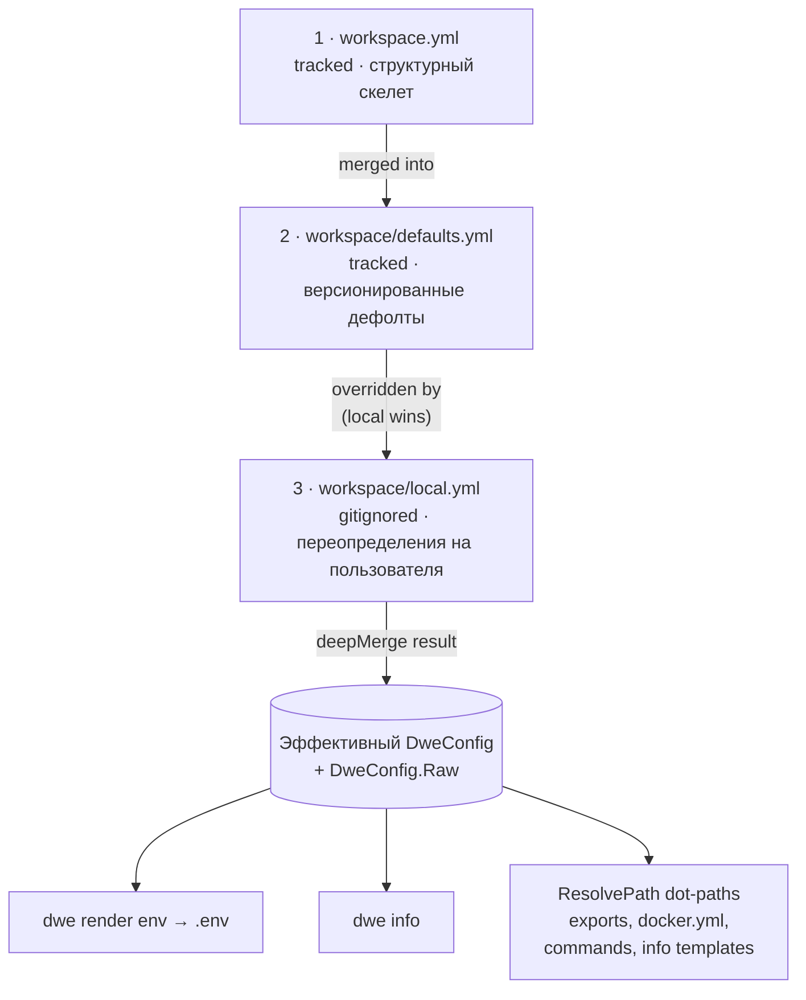

> Translated from: reference/config/workspace.md @ a5e61466665f

# workspace.yml / defaults.yml / local.yml

Три слоя смерженного конфига DWE.

## Содержание

- [Обзор мерджа](#обзор-мерджа)
- [Что принадлежит каждому слою](#что-принадлежит-каждому-слою)
- [Разрешение dot-path](#разрешение-dot-path)
  - [Откуда берутся поля сервисов](#откуда-берутся-поля-сервисов)
- [workspace.yml](#workspaceyml)
  - [Справочник полей](#справочник-полей)
  - [Ключи проектных соглашений](#ключи-проектных-соглашений)
- [workspace/defaults.yml](#workspacedefaultsyml)
  - [Оверлей `services`](#оверлей-services)
  - [`runtime`](#runtime)
  - [`state`](#state)
  - [`exports.env`](#exportsenv)
  - [`compose`](#compose)
  - [`ide`](#ide)
- [workspace/local.yml](#workspacelocalyml)
- [Частые ловушки](#частые-ловушки)
- [Связанные команды](#связанные-команды)

## Обзор мерджа



Читайте сверху вниз: каждая стрелка — это «следующий слой накладывается сверху». `local.yml` сидит в конце, поэтому любой ключ, который он выставляет, затеняет тот же ключ из `defaults.yml` или `workspace.yml`. Ключи, отсутствующие в `local.yml`, пропадают вниз к `defaults.yml`, затем к `workspace.yml`, затем к типовому Go zero value.

Три файла делят одно пространство имён — один и тот же ключ в разных слоях — это одна и та же настройка. Слой 1 устанавливает структуру, слой 2 заполняет дефолты, слой 3 переопределяет для локальной машины. Никто из трёх не обязан декларировать каждый ключ; отсутствующие ключи просто проваливаются к тому слою, который их выставил, с type-zero значениями как окончательным fallback'ом.

`workspace/local.yml` опционален: когда отсутствует, мердж молча пропускает слой 3.

## Что принадлежит каждому слою

| Назначение | Слой |
|---------|-------|
| Имя и префикс проекта | `workspace.yml` |
| Порты / хосты сервисов (apps, tools, infra) | [`workspace/services/<name>/service.yml`](services/index.md) (per-entry карты `ports:` / `hosts:`) |
| Структурные определения сервисов (container / compose / status / render) | [`workspace/services/<name>/service.yml`](services/index.md) |
| Опциональное состояние enabled для сервисов (для всех типов) | `defaults.yml` (переопределяемо в `local.yml`) |
| Правила экспорта (`exports.env`) | `defaults.yml` |
| Дефолты IDE-конфига | `defaults.yml` |
| Дефолты блока `db` | `defaults.yml` |
| Активное состояние | `local.yml` |
| Значения портов / хостов сервисов | [`workspace/services/<name>/service.yml`](services/index.md) (проектные определения) и `local.yml` (переопределения на разработчика, deep-merge по имени записи) |
| Личные креды (`db.user`, `db.password`) | `local.yml` |
| Включение debug / опциональных сервисов | `local.yml` |
| Конфигурация, сгенерированная мастером | `local.yml` (пишется `dwe deploy` при ответе на вопросы setup или конфликты портов) |

Сами определения сервисов (apps, tools, infra — включая их порты / хосты) живут в per-folder файлах [`workspace/services/<name>/service.yml`](services/index.md), которые загружаются отдельно и не являются частью этого мерджа. Трёхслойный оверлей несёт `services.<name>.enabled`, `services.<name>.ports` и `services.<name>.hosts`. Карты портов и хостов deep-merge'атся по имени записи, поэтому частичное переопределение затрагивает только перечисленные ключи.

Команда `dwe deploy` включает интерактивный мастер, запускающийся на свежих проектах (когда `workspace/local.yml` отсутствует или пуст). Мастер собирает ответы на вопросы, объявленные в [`workspace/setup.yml`](setup.md), и спрашивает переопределения портов при наличии конфликтов. Все ответы deep-merge'атся в `local.yml` и атомарно записываются до того, как продолжится деплой. Подробности схемы см. в [`workspace/setup.yml`](setup.md).

## Разрешение dot-path

CLI хранит смерженный результат в двух местах: типизированной структуре `DweConfig` (с полями вроде `DweConfig.Services` и `DweConfig.Runtime.UseHTTPS`) и обычной мапе `DweConfig.Raw`. Мапа Raw движёт разрешение dot-path.

Dot-path — это цепочка ключей через `.`, навигирующая смерженную YAML-мапу. Примеры:

- `services.main.ports.http` → `80`
- `services.adminer.enabled` → `false`
- `services.main.container` → `"app-main"`
- `services.main.hosts.web` → `"app.localhost"`

Dot-path'ы потребляются:

- правилами экспорта в `defaults.yml` (`from:`, `when:`)
- шаблонными выражениями `${...}` в `docker.yml` (`project_name`)
- шаблонными выражениями `${...}` в декларативных командах (`workspace/commands/`)
- Go-шаблонами `{{ ... }}` в `info.yml` (через типизированную структуру, не Raw)

### Откуда берутся поля сервисов

Пути `services.<name>.*` в смерженной мапе наполняются `LoadConfig`. После загрузки каждого `workspace/services/<name>/service.yml` (каноническая декларация с `type:`) загрузчик валидирует каждый оверлейный слой против декларированного набора (`validateServicesOverlay`), мерджит 3 слоя, затем разрешает `enabled` для каждого сервиса (required выигрывает; иначе значение из смерженного оверлея, по умолчанию `false`). Каждый разрешённый сервис — включая вложенные карты `ports` / `hosts` и разрешённые поля вроде `container`, `dir`, `compose` — инжектится в `raw["services"]`. Правила экспорта и шаблоны могут поэтому использовать `services.main.container`, `services.main.ports.http`, `services.adminer.hosts.web`, `services.catalog.enabled` и т.д. без отдельной осведомлённости о структуре per-service папок.

## workspace.yml

**Назначение**: идентичность проекта и структурный скелет. Отслеживается git. Редко меняется после первоначальной настройки.

**Порядок загрузки**: слой 1 (базовый).

**Пример**:
```yaml
project:
  name: laravel
  prefix: myprefix
```

### Справочник полей

| Поле | Тип | Описание |
|-------|------|-------------|
| `project.name` | string | Короткий идентификатор проекта (используется в именах контейнеров, `.env`) |
| `project.prefix` | string | Префикс для имени Docker Compose-проекта и меток контейнеров |

`project.prefix` и `project.name` комбинируются, образуя имя Docker Compose-проекта через шаблон в `docker.yml` (`${project.prefix}-${project.name}`).

## Ключи проектных соглашений

Помимо типизированных полей, документированных выше, `workspace.yml`, `defaults.yml` и `local.yml` поддерживают открытое пространство имён ключей-соглашений. Эти ключи не интерпретируются CLI напрямую — они экспонируются через dot-path'ы в смерженном конфиге и потребляются правилами экспорта, шаблонами и пользовательскими командами.

Распространённые ключи-соглашения:

- `db.*` — креды и метаданные базы данных (например, `db.database`, `db.user`, `db.password`) — потребляются правилами экспорта для заполнения env-переменных `DB_*`.
- Пользовательские настройки проекта — любой добавленный вами верхнеуровневый ключ доступен через dot-path (например, `my_setting.value` в шаблоне).

Пример:

```yaml
db:
  database: myapp
  user: root
  password: secret

my_custom:
  timeout: 30
  retries: 3
```

На них можно ссылаться в правилах экспорта (`from: db.user`), шаблонах (`${db.database}`) и использовать в пользовательских командах или скриптах. Открытое пространство имён позволяет проектам расширять схему конфига без изменений CLI.

### `docs`

Конфигурирует поведение рендеринга документации и кеширования для команд `dwe docs`.

```yaml
docs:
  mermaid: auto        # auto | mmdc | off (default: auto)
  cache_size_mb: 100   # cache size in MB (default: 100)
```

**`docs.mermaid`**: контролирует, как рендерятся mermaid-диаграммы в документации.

- `auto` (по умолчанию): использовать `mmdc` (mermaid-cli), если найден в `$PATH`, иначе показать диаграммы как блоки кода.
- `mmdc`: требовать наличие `mmdc`; при отсутствии эмитить error-плейсхолдер, но продолжать.
- `off`: никогда не рендерить диаграммы; всегда показывать блоки кода.

**`docs.cache_size_mb`**: максимальный размер в MB для кеша mermaid-диаграмм (PNG-файлы, хранящиеся в `$XDG_CACHE_HOME/dwe/mermaid/`). Кеш использует LRU-вытеснение при превышении лимита. По умолчанию 100 MB. Должно быть неотрицательным; ноль приводит к дефолту 100.

---

## workspace/defaults.yml

**Назначение**: версионированные дефолты для всего проекта. Отслеживается git. Предоставляет всю runtime-конфигурацию, не являющуюся структурной идентичностью.

**Порядок загрузки**: слой 2 (мерджится поверх `workspace.yml`).

**Секции**:

### Оверлей `services`

Переключает опциональные сервисы любого типа (сервисы, объявленные в [`workspace/services/<name>/service.yml`](services/index.md) без `required: true`). Apps, tools и infra делят одно оверлейное пространство имён — дискриминатор `type:` живёт в `service.yml` каждого сервиса, не здесь.

```yaml
services:
  main-debug:        # type: app
    enabled: false
  catalog:           # type: app
    enabled: true
  adminer:           # type: tool
    enabled: false
  mailpit:           # type: tool
    enabled: true
```

Разрешённые поля под `services.<name>` в любом оверлейном слое — это `enabled`, `ports` и `hosts`. Добавление структурных полей вроде `container:`, `compose:`, `extends:` и т.д. — это layer-aware overlay error — те поля живут в `workspace/services/<name>/service.yml`. Карты портов и хостов deep-merge'атся по имени записи. Required-сервисы всегда активны и не имеют переключателя.

### `runtime`

Runtime-настройки, влияющие на генерацию `.env` и info-дашборд, но не относящиеся к конкретному сервису. Per-service порты / хосты живут в [`workspace/services/<name>/service.yml`](services/index.md) под картами `ports:` / `hosts:` каждой записи (и доступны как dot-path'ы `services.<name>.ports.<port-name>` / `services.<name>.hosts.<host-name>`).

```yaml
runtime:
  use_https: false
  spx:
    path: ""
```

| Поле | Описание |
|-------|-------------|
| `runtime.use_https` | Используют ли URL'ы HTTPS (экспортируется как `USE_HTTPS`). |
| `runtime.spx.path` | URL-путь профайлера SPX (пусто = выключено). |

### `state`

```yaml
state: ""
```

Имя активного состояния. Пустая строка означает отсутствие состояния. Экспортируется как `STATE` в `.env`. Переопределяйте в `local.yml` (например, `state: staging`).

### `exports.env`

Декларативные правила экспорта, движущие генерацию `.env`. Каждое правило мапит dot-path в смерженном конфиге на имя env-переменной. Все per-service поля — `container`, `enabled`, `ports.<name>`, `hosts.<name>` — живут под `services.<name>.*`.

```yaml
exports:
  env:
    - name: APP_PORT
      from: services.main.ports.http
      format: int
    - name: TOOL_ADMINER_ENABLED
      from: services.adminer.enabled
      format: bool
    - name: ADMINER_PORT
      from: services.adminer.ports.http
      format: int
      when: services.adminer.enabled
    - name: ADMINER_HOST
      from: services.adminer.hosts.web
      when: services.adminer.enabled
```

| Поле правила | Тип | Описание |
|------------|------|-------------|
| `name` | string | Имя env-переменной в `.env` |
| `from` | string | Dot-path в смерженный конфиг |
| `default` | string | Fallback-значение, когда путь отсутствует |
| `required` | bool | Ошибка, если путь отсутствует и нет дефолта |
| `format` | string | `string` (по умолчанию), `bool`, `int` |
| `when` | string | Dot-path; правило пропускается, когда значение falsy |
| `comment` | string | Пишется как `# comment` над переменной |

#### Неявные системные переменные

`dwe render env` всегда эмитит три переменные до выполнения любого правила, независимо от `exports.env`:

| Переменная | Источник | Заметки |
|----------|--------|-------|
| `PROJECT` | `project.name` | Используется Docker labels и Make-таргетами |
| `UID` | хостовый UID | Хардкод в `1000` на macOS, реальный UID на Linux/WSL — держит сборки контейнеров детерминированными между хостами |
| `GID` | хостовый GID | Та же логика, что для `UID` |

Они управляются CLI; не декларируйте их повторно как правила экспорта.

### `compose`

Конфигурация compose-файлов, используемая Docker control plane.

```yaml
compose:
  base: compose.yaml
```

| Поле | Описание |
|-------|-------------|
| `compose.base` | Базовый compose-файл (всегда подключается) |

Service-specific оверлеи живут под `services.<name>.compose` (список путей к файлам для каждой записи сервиса) в [`workspace/services/<name>/service.yml`](services/index.md). Порядок эмиссии compose-файлов — `base → tools (sorted) → infra (sorted) → apps (sorted)`.

---

## workspace/local.yml

**Назначение**: переопределения на пользователя. Gitignored, никогда не коммитится. Шаблон в `workspace/local.example.yml`.

**Порядок загрузки**: слой 3 (мерджится последним — наивысший приоритет).

**Пример переопределений**:
```yaml
state: staging

services:
  main-debug:
    enabled: true
  redis_insight:
    enabled: false

runtime:
  use_https: true
```

> Переопределения портов / хостов на разработчика поддерживаются через `local.yml`. Используйте `services.<name>.ports` или `services.<name>.hosts` для переопределения конкретных записей; значения deep-merge'атся по ключу поверх проектных деклараций в `workspace/services/<name>/service.yml`.

Если `local.yml` не существует, слой 3 молча пропускается.

## Частые ловушки

- **Редактирование `defaults.yml` для личных настроек** — изменения отслеживаются и влияют на каждого члена команды. Личные переопределения всегда идут в `local.yml`.
- **Коммит `local.yml`** — он gitignored не просто так (может содержать креды).
- **Выставление `state:` в `defaults.yml`** — состояние по своей природе per-user, кладите его в `local.yml`.
- **Коллизия скаляров** — если `defaults.yml` выставляет `state: ""`, а `local.yml` выставляет `state: staging`, эффективное значение — `staging`. Если `local.yml` опускает `state`, выигрывает значение из `defaults.yml`.
- **Списки заменяют, карты мерджатся** — карты deep-merge'атся: повторная декларация `services` в `local.yml` переопределяет только перечисленные ключи, остальные проваливаются из `defaults.yml`. Списки же заменяются целиком: выставление `args.global: ["--ansi", "always"]` в `local.yml` отбрасывает каждую запись, которую имели нижние слои, поэтому включайте полный нужный список.

## Опциональный блок `ui:`

`workspace.yml` может нести опциональный верхнеуровневый блок `ui:`, конфигурирующий интерактивный браузер команд. См. [`ui.md`](ui.md) для схемы, дефолтов и семантики omit-vs-`false` для `*bool`. Поведение не меняется для проектов, опускающих блок.

## Связанные команды

- `dwe render env --out .env` — перегенерировать `.env` из смерженного конфига
- `dwe render ide` / `dwe render ai` / `dwe render git` — pack-based рендереры; см. [справочник render](../render/index.md)
- `dwe info` — показать дашборд (использует смерженный конфиг + `info.yml`)
- `dwe status` — композитный read-only view (apps + tools + infra + deploy + topology + git + daemons)
- `dwe status apps` / `dwe status tools` / `dwe status infra` — таблицы по типу
- `dwe compose argv` — показать эффективную compose-команду со всеми флагами (полезно для отладки разрешения dot-path в `docker.yml`)
