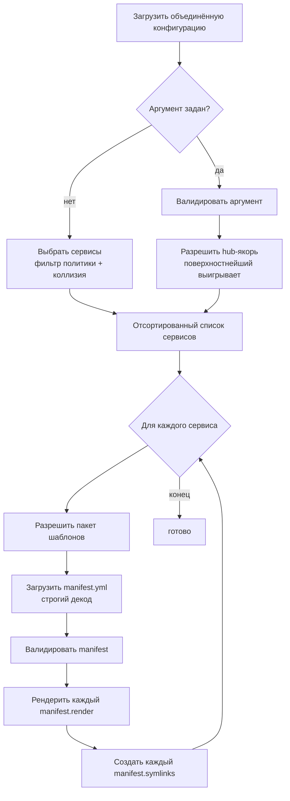
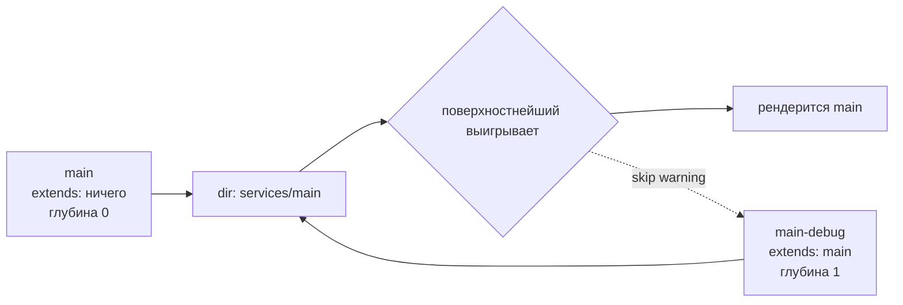
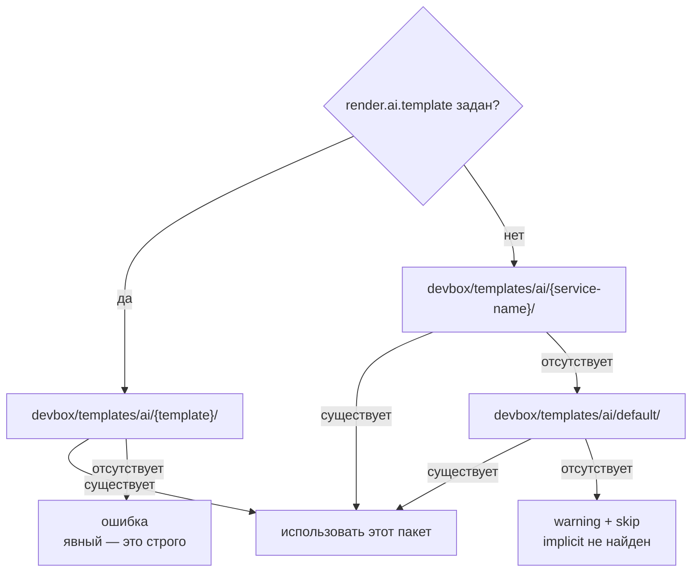

> Translated from: reference/render/ai.md @ a320984f18da

# devbox render ai

Сгенерировать hub-уровневую документацию для агентов для каждого включённого сервиса из пакета шаблонов. Пакет объявляет `manifest.yml`, перечисляющий файлы для рендера и симлинки для создания внутри hub-каталога сервиса (например, `services/main/AGENTS.md` плюс `services/main/CLAUDE.md → AGENTS.md`).

`render ai` и [`render ide`](ide.md) делят большую часть пер-сервисной инфраструктуры — выборку, разрешение шаблонов, гарды безопасности путей, схему manifest. Отличаются в одном важном месте: **политика коллизий** инвертирована (выигрывает поверхностнейший, а не глубочайший).

Пофайловые [локальные оверрайды](index.md) через соседний `<pack>.local/` shadow-tree применяются к AI-пакетам так же, как к IDE и git — положите файл в `devbox/templates/ai/<pack>.local/<rel>`, чтобы подменить им канонический без правки отслеживаемого пакета.

## Содержание

- [Конвейер](#pipeline)
- [Выборка сервисов](#service-selection)
  - [Гейт активации](#activation-gate)
  - [Нормализация каталога](#directory-normalization)
  - [Разрешение коллизий: выигрывает поверхностнейший](#collision-resolution-shallowest-wins)
  - [Явный аргумент `[service]`](#explicit-service-argument)
- [Разрешение пакета шаблонов](#template-pack-resolution)
- [Схема manifest](#manifest-schema)
  - [Записи `render`](#render-entries)
  - [Записи `symlinks`](#symlinks-entries)
  - [Правила валидации manifest](#manifest-validation-rules)
- [Пофайловый рендер](#per-file-rendering)
  - [Переменные шаблона](#template-variables)
  - [Гарды безопасности путей](#path-safety-guards)
- [Создание симлинков](#symlink-creation)
- [Проработанный пример](#worked-example)
- [Сообщения вывода](#output-messages)
- [Частые ловушки](#common-pitfalls)
- [Связанные справочники](#related-references)

## Конвейер



## Выборка сервисов

### Гейт активации

Сервис участвует в рендере agent-доков, только если **оба** флага истинны:

| Гейт | Источник | По умолчанию |
|------|----------|---------------|
| Уровень проекта | `services.<name>.enabled` (3-слойный merged + обязательный service override) | зависит от сервиса |
| Политика agent-доков | `services.<name>.render.ai.enabled` | `true` для **всех** типов сервисов |

Обратите внимание на контраст с IDE-рендером: agent-доки по умолчанию `true` для каждого типа. Обоснование: hub-идентичность (что этот каталог *есть* и как AI-агенту к нему подходить) полезна для каждого сервиса, не только для `app`.

Если хоть один гейт ложный — сервис пропускается. Пропуски делятся на две группы:

| Группа | Когда | Сообщается как warning? |
|--------|-------|-------------------------|
| Политические пропуски | сервис отключён на уровне проекта, или `render.ai.enabled` равен `false` | нет — это документированное opt-out поведение |
| Actionable-пропуски | у сервиса нет hub-каталога, или другой сервис выиграл коллизию каталога | да — обычно это указывает на неверную настройку |

### Нормализация каталога

Так же, как у `render ide`: сервисы без hub-каталога отбрасываются — либо `dir` пуст, либо он разрешается в корень проекта. Agent-докам нужен реальный hub-каталог для записи, и они не должны нацеливаться на корень проекта.

### Разрешение коллизий: выигрывает поверхностнейший

Когда более одного выживающего сервиса указывает на один и тот же `dir`, ровно один выигрывает:

1. Пройти цепочку `extends` каждого сервиса и вычислить глубину.
2. Выигрывает сервис с **самой поверхностной** цепочкой. Глубина ограничена (сейчас 32 хопа) как cycle-guard.
3. Ничьи на одной глубине ломаются лексикографически по имени, поэтому результат детерминирован.

Проигравшие сервисы выдают предупреждение, называющее победителя и спорный каталог.



Обоснование: agent-доки описывают **идентичность hub**. Когда ребёнок `extends` родителя и делит его `dir`, владельцем канонического hub является родитель; ребёнок — runtime-вариант той же рабочей среды, а не отдельная рабочая среда со своей идентичностью. Выбор родителя сохраняет содержимое AGENTS.md стабильным при переключении вариантов.

Это **противоположно** политике «глубочайший выигрывает» у `render ide`. Причина — разница в том, что рендерится:

| Команда | Что рендерится | Чья точка зрения? |
|---------|----------------|--------------------|
| `render ide` | per-variant конфигурации редактора (отладчик, launch-профиль) | вариант, с которым работают прямо сейчас |
| `render ai` | идентичность hub и ориентация для AI-агента | канонический владелец hub |

### Явный аргумент `[service]`

`devbox render ai <name>` трактует `<name>` как **hub-якорь** (та же модель, что у `render ide`).

Порядок валидации (первая ошибка побеждает):

1. Сервис не в конфигурации.
2. Сервис отключён на уровне проекта.
3. У сервиса нет hub-каталога, или его hub — корень проекта.
4. `render.ai.enabled` равен `false`.

После валидации применяется то же «поверхностнейший выигрывает», ограниченное сиблингами, делящими hub. Если победитель отличается, info-строка объявляет подмену.

Так `devbox render ai main-debug` всё равно рендерит родителя `main`, когда оба включены — вариант разрешается в канонического владельца hub.

## Разрешение пакета шаблонов

Для каждого выбранного сервиса рендерер выбирает один каталог-пакет под `devbox/templates/ai/`. Цепочка разрешения зеркалит IDE точно, различается только базовый каталог.



Правила:

- **Явный — это строго.** Заданный `render.ai.template`, которого не существует, — жёсткая ошибка, никакого тихого fallback.
- **Implicit-цепочка** (когда `render.ai.template` не задан): `<service-name>` → `default`. Если implicit-цепочка исчерпана без пакета, рендер пропускается с предупреждением.
- Пакет должен быть реальным каталогом; симлинки в корне пакета или в любом компоненте родителя отвергаются.
- Валидация ключа шаблона отвергает разделители путей, точки в начале и `..`.

## Схема manifest

Каждый пакет обязан содержать `manifest.yml` в корне. Manifest объявляет, что пакет производит; в отличие от IDE-рендера, **implicit-обхода нет**. Если файл в пакете не упомянут в `render`, он игнорируется.

```yaml
render:
  - from: AGENTS.md.tmpl
    to: AGENTS.md
  - from: .claude/CLAUDE.md.tmpl
    to: .claude/CLAUDE.md

symlinks:
  - link: CLAUDE.md
    to: AGENTS.md
```

Manifest загружается со **строгим YAML-декодом**: неизвестные поля — жёсткая ошибка, чтобы опечатки вроде `renders:` ловились рано. Пустой файл или manifest с обоими списками пустыми тоже отвергается.

### Записи `render`

| Поле | Обязательно | Описание |
|------|-------------|----------|
| `from` | да | путь к файлу шаблона относительно корня пакета. Должен оканчиваться на `.tmpl` и не быть абсолютным. Файл должен существовать как обычный (не симлинк, не каталог) |
| `to` | да | путь назначения относительно **hub-каталога сервиса**. Может быть вложенным (например, `.claude/CLAUDE.md`). Не должен выходить из hub. Пусто или `..` отвергается |

### Записи `symlinks`

| Поле | Обязательно | Описание |
|------|-------------|----------|
| `link` | да | путь создаваемого симлинка, относительно hub-каталога сервиса. Может быть вложенным. Не должен выходить из hub |
| `to` | да | цель симлинка, относительно hub-каталога сервиса. **Должна совпадать с `to` одной из записей `render`** — симлинки могут указывать только на файлы, которые производит этот manifest |

Симлинки записываются как **относительные пути**, вычисленные от каталога ссылки до абсолютного пути цели внутри hub. Они никогда не выходят за пределы hub.

### Правила валидации manifest

Manifest валидируется до записи любого файла:

| Правило | Применяется к |
|---------|---------------|
| хотя бы одна запись `render` или `symlinks` | manifest |
| `from` непуст, относителен, оканчивается на `.tmpl` | каждый render |
| `from` не выходит из пакета и не содержит симлинков в родительских компонентах | каждый render |
| `from` существует как обычный файл (не симлинк, не каталог) | каждый render |
| `to` непуст, относителен, не разрешается в `.` или `..` | каждый render |
| `to` уникален в пределах manifest | каждый render |
| `link` непуст, относителен, не выходит из hub | каждый symlink |
| `link` уникален среди symlinks | каждый symlink |
| `link` не пересекается ни с одним `to` из render (один путь не может быть и отрендеренным файлом, и симлинком) | каждый symlink |
| `to` совпадает с известным render-назначением | каждый symlink |

Сравнения путей выполняются на очищенных путях, поэтому `AGENTS.md` и `./AGENTS.md` трактуются как одно назначение.

## Пофайловый рендер

Для каждой записи `render` источник — файл шаблона внутри пакета, а назначение — путь `to`, объединённый с hub-каталогом сервиса. Рендерер:

1. Читает файл шаблона.
2. Парсит его как [Go text/template](../templates.md) в строгом режиме — любая ссылка на отсутствующее поле прерывает рендер вместо записи плейсхолдера `<no value>`.
3. Выполняет шаблон по [переменным шаблона](#template-variables).
4. Разрешает назначение и прогоняет [гарды безопасности путей](#path-safety-guards).
5. Создаёт отсутствующие родительские каталоги.
6. Отказывается перезаписывать назначение, если оно — предсуществующий симлинк.
7. Пишет отрендеренные байты.

### Переменные шаблона

Шаблоны получают ту же форму объекта, что и IDE-шаблоны:

| Переменная | Источник |
|------------|----------|
| `.Project` | блок `project:` из `devbox.yml` |
| `.Service` | **каноническая конфигурационная идентичность** — корень цепочки `extends:` рендерящегося сервиса. Используйте для raw-config поисков по имени сервиса. Равно `.Resolved` без цепочки extends. |
| `.Resolved` | **render-идентичность** — сервис, чей hub реально рендерится (победитель по политике коллизий). Для AI победитель — самый поверхностный расширитель, поэтому `.Resolved` обычно равно `.Service`. |
| `.ServiceCfg` | эффективная конфигурация сервиса `.Resolved` после разрешения `extends` |
| `.Runtime` | объединённый блок `runtime` |
| `.Cfg` | объединённый `DevboxConfig` (продвинутое). `.Cfg.Raw` — постмержовая мапа после нормализации devbox-ом (`services.*` инжектится из пер-сервисных `service.yml`) — см. [Шаблоны](../templates.md). Для обычных случаев предпочитайте выделенные поля выше. |

> **Совет.** AI-выход ложится в `<svc.Dir>/<entry.To>` — обычно в отслеживаемые проектные файлы (`AGENTS.md`, `.claude/CLAUDE.md`, …). Избегайте потребления developer-local или secret-ключей через `.Cfg.Raw` в AI-шаблонах: любое значение, налитое из `devbox/local.yml`, всплывёт в отрендеренном файле и даст пер-разработческие diff-ы в отслеживаемых артефактах. Используйте `.Cfg.Raw` только для проектно-широких соглашений.

Строгий режим рендера означает, что опечатка `{{.Servic.Name}}` прерывает рендер вместо вывода `<no value>`. Используйте `{{if ...}}` для полей, которые могут быть законно пустыми.

#### Доступ к `.Cfg.Raw`

Go-овский `text/template` разрешает dot-сегменты, только если каждый совпадает с `[A-Za-z_][A-Za-z0-9_]*`. До ключей с дефисами, точками, ведущими цифрами или любыми другими не-идентификаторными символами нельзя добраться dot-синтаксисом — используйте `index`.

```gotemplate
{{ .Cfg.Raw.ai.persona }}                      {{- /* точка — identifier-safe ключи */ -}}
{{ index .Cfg.Raw "my-tool" "api-key" }}       {{- /* index — ключи с дефисами */ -}}
```

Полный набор хелперов, доступных внутри `*.tmpl` (`appURL`, sprout-реестры, встроенные `text/template`), описан в [Шаблоны](../templates.md).

### Гарды безопасности путей

Рендерер применяет те же граничные проверки, что и IDE-рендер:

1. **Очистка пути.** Валидация manifest уже отвергла абсолютные пути, `..`-побеги и `.`-результаты.
2. **Containment hub.** Разрешённое назначение должно быть внутри абсолютного hub-каталога.
3. **Никаких симлинков в пути назначения.** Существующие компоненты пути проверяются до создания любого каталога.
4. **Границы реального пути после создания.** После создания родительских каталогов каталог назначения разрешается через любые симлинки и должен быть внутри и реального корня проекта, и реального hub. Это ловит гонку, когда симлинк подбрасывают между проверками.
5. **Никаких симлинков на месте файла назначения.** Предсуществующий симлинк по target-пути отвергается (а не следуется по ссылке с перезаписью того, на что она указывает).

Сам пакет тоже под охраной: проверки родительских путей корня пакета отвергают любые симлинкнутые компоненты, а валидатор manifest запрещает симлинки в любом пути `from`.

## Создание симлинков

Для каждой записи `symlinks` рендерер создаёт симлинк по `link`, указывающий на `to`. Оба пути трактуются как относительные к hub-каталогу сервиса.

Шаги:

1. Проверить, что и `link`, и `to` остаются внутри hub.
2. Создать родительский каталог ссылки с теми же гардами безопасности путей, что используются для рендерящихся файлов.
3. Вычислить относительный путь от каталога ссылки до цели внутри hub. Симлинк на диске всегда **относительный**, чтобы hub оставался переносимым между машинами.
4. Осмотреть существующий путь по местонахождению ссылки:
   - симлинк уже указывает на правильную относительную цель — no-op (идемпотентно).
   - симлинк указывает в другое место — удалить и пересоздать.
   - обычный файл или каталог — отказать с ошибкой, советующей либо удалить файл, либо задать `render.ai.enabled: false` для сервиса.
   - пути нет — создать симлинк.

Результат **идемпотентен по содержимому**: перезапуск `devbox render ai` приводит hub-каталог в то же финальное состояние. Учтите: отрендеренные файлы всегда перезаписываются на каждом прогоне (поэтому mtime обновляется), но байты полностью определены шаблонами и объединённой конфигурацией. Симлинки же пересоздаются только когда существующий отсутствует или указывает не туда.

## Проработанный пример

Раскладка:

```
devbox/services/
  main/
    service.yml
  main-debug/
    service.yml
devbox/templates/ai/
  default/
    manifest.yml
    AGENTS.md.tmpl
    .claude/CLAUDE.md.tmpl
```

Manifest `devbox/templates/ai/default/manifest.yml`:

```yaml
render:
  - from: AGENTS.md.tmpl
    to: AGENTS.md
  - from: .claude/CLAUDE.md.tmpl
    to: .claude/CLAUDE.md

symlinks:
  - link: CLAUDE.md
    to: AGENTS.md
```

Шаблон `devbox/templates/ai/default/AGENTS.md.tmpl`:

```markdown
# {{.Service}} Service Hub

This is the {{.Service}} service running inside a devbox-managed hub.
The application source code is at `src/`.

Service container: {{.ServiceCfg.Container}}
Workspace root: {{.ServiceCfg.DirInternal}}
```

`devbox/services/main/service.yml`:

```yaml
type: app
container: app-main
dir: ./services/main
```

`devbox/services/main-debug/service.yml`:

```yaml
type: app
extends: main
container: app-main-debug
dir: ./services/main          # тот же hub, что у родителя — коллизия
```

`devbox render ai`:

1. Выборка: оба сервиса проходят гейт активации (дефолтный `render.ai.enabled: true`). Они делят `dir: ./services/main`. У `main` цепочка extends поверхностнее (глубина 0 против 1 у `main-debug`), поэтому **выигрывает `main`**. `main-debug` сообщается как пропуск из-за коллизии.
2. Разрешение пакета для `main`: `render.ai.template` не задан; implicit-цепочка пробует `devbox/templates/ai/main/` (не найдено), затем `devbox/templates/ai/default/` (используется).
3. Manifest загружен и валиден: две записи рендера, один симлинк. Симлинк указывает на `AGENTS.md`, который и есть одно из render-назначений.
4. Каждая запись рендера обрабатывается: `AGENTS.md` и `.claude/CLAUDE.md` записываются в `services/main/`.
5. Создаётся симлинк `services/main/CLAUDE.md → AGENTS.md`.

Результат:

```
services/main/
  AGENTS.md           ← отрендерен из AGENTS.md.tmpl
  CLAUDE.md           ← симлинк на AGENTS.md
  .claude/
    CLAUDE.md         ← отрендерен из .claude/CLAUDE.md.tmpl
```

`devbox render ai main-debug` производит те же файлы — явный аргумент валидируется, но hub-anchor разрешение выбирает `main` (поверхностнейший) и печатает `ai [main-debug] — resolved to main (hub services/main)`.

## Сообщения вывода

| Поток | Триггер |
|-------|---------|
| info | Явный аргумент разрешился в другого сиблинга — называется выбранный победитель и общий hub-каталог. |
| warning | Выбранный сервис пропущен, потому что у него нет hub-каталога (или его hub — корень проекта). |
| warning | Выбранный сервис пропущен, потому что другой сервис выиграл коллизию каталога — победитель назван. |
| success | По одной строке на каждый отрендеренный файл, с относительным путём внутри проекта. |
| success | По одной строке на каждый симлинк (вновь созданный или уже корректный), показывая и ссылку, и её цель. |
| info | Ничего не выбрано после применения политики и правил коллизии. |

Ошибки возвращаются как падение команды и называют проблемный сервис, чтобы источник проблемы был очевиден.

## Частые ловушки

- **Предсуществующий не-симлинк по пути управляемого симлинка.** Если `CLAUDE.md` уже существует как обычный файл (например, после прошлой ручной правки), `render ai` откажется его перезаписать. Удалите файл или задайте `render.ai.enabled: false` для сервиса.
- **`to` симлинка должен ссылаться на render-назначение.** Валидатор manifest это обеспечивает; нельзя симлинкнуть на произвольный файл вне manifest.
- **Опечатки в manifest — жёсткие ошибки.** Строгий YAML-декод означает, что опечатанный ключ вроде `renders:` или `symlink:` прерывает загрузку. Исправьте написание.
- **Пустой manifest отвергается.** Manifest с обоими `render: []` и `symlinks: []` почти всегда ошибка.
- **Варианты разделяют идентичность родителя.** Это намеренно. Если runtime-варианту по-настоящему нужен свой AGENTS.md, дайте ему другой `dir`.
- **Шаблоны, ссылающиеся на отсутствующие поля, падают.** Строгий режим рендера прерывает рендер при любой ссылке на отсутствующее поле. Заворачивайте опциональные поля в `{{if ...}}`.
- **`render ai` не обходит пакет.** Файлы внутри пакета, не упомянутые в `manifest.yml`, на этапе рендера молча игнорируются. Добавьте запись под `render:`, чтобы включить их.

## Связанные справочники

- [блок `services.<name>.render.ai`](../config/services/fields.md) — `enabled`, `template`, наследование через `extends`
- [`render ide`](ide.md) — родственная команда с противоположной (глубочайший-выигрывает) политикой коллизий
- CLI-справочник: [`devbox render ai`](../cli/devbox_render_ai.md)
