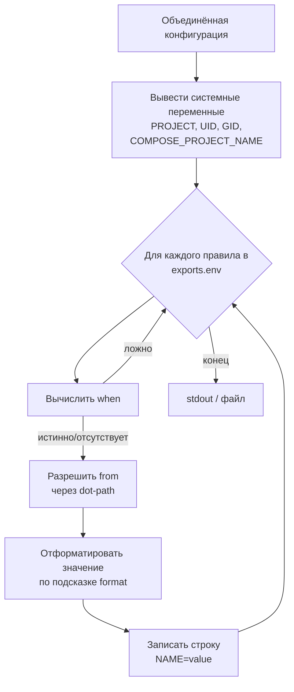
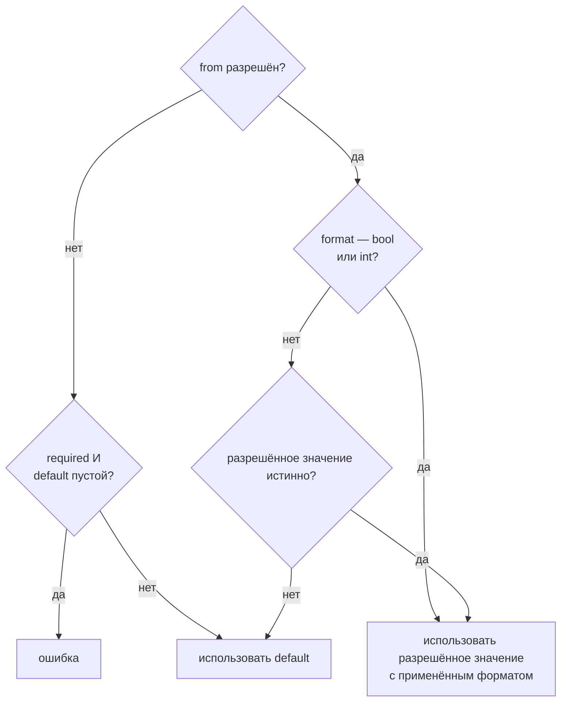

> Translated from: reference/render/env.md @ 6410a2486faf

# dwe render env

Сгенерировать содержимое `.env` из объединённой конфигурации. По умолчанию вывод идёт в stdout; передайте `--out <path>`, чтобы записать в файл (родительские каталоги создаются).

## Содержание

- [Конвейер](#pipeline)
- [Системные переменные](#system-variables)
- [Правила экспорта](#export-rules)
  - [Поля правила](#rule-fields)
  - [Порядок вычисления](#evaluation-order)
- [Разрешение значения](#value-resolution)
- [Истинность](#truthiness)
- [Зашифрованные значения и защита от маркера](#зашифрованные-значения-и-защита-от-маркера)
- [Формат вывода](#output-format)
- [Проработанный пример](#worked-example)
- [Частые ловушки](#common-pitfalls)
- [Связанные справочники](#related-references)

## Конвейер

`render env` не итерирует сервисы и не читает шаблоны с диска. Он проходит по упорядоченному списку правил экспорта в объединённой конфигурации и выводит по одной строке на правило.



Список правил экспорта живёт под `exports.env` в `workspace/defaults.yml` (см. [справочник по exports.env](../config/workspace.md#exportsenv)). Порядок правил в YAML задаёт порядок строк на выходе.

## Системные переменные

Четыре переменные выводятся до любых правил, независимо от `exports.env`. Первые три есть всегда; `COMPOSE_PROJECT_NAME` выводится, когда разрешается в непустое значение:

| Переменная | Источник | Замечания |
|------------|----------|-----------|
| `PROJECT` | `project.name` из `workspace.yml` | имя проекта **как есть**, включая верхний регистр. Используется Make-целями и именованием в рамках проекта |
| `UID` | UID хоста — `1000` на macOS, реальный UID хоста на Linux/WSL | жёстко прибит к `1000` на macOS, потому что Docker Desktop крутит контейнеры в Linux-VM, где UID хоста не маппятся напрямую |
| `GID` | GID хоста — та же платформенная логика, что и для `UID` | то же обоснование, что и у `UID` |
| `COMPOSE_PROJECT_NAME` | имя compose-проекта, которое `dwe` передаёт в `-p` | `project_name` из [`workspace/docker.yml`](../config/docker.md#project_name) (или `docker.local.yml`), иначе `<project.prefix>-<project.name>`, **всегда в нижнем регистре**. Опускается, если разрешается в пустое значение — в этом случае `dwe` тоже не передаёт `-p`. Ошибка разрешения (сломанный `${...}` в `project_name`) валит рендер |

**`COMPOSE_PROJECT_NAME` — это не `PROJECT`.** `PROJECT` — это сырое `project.name`; `COMPOSE_PROJECT_NAME` — разрешённое имя compose-проекта в нижнем регистре, которое `docker.yml` может переопределить целиком. Для `project.name: cueBreaker` с префиксом по умолчанию строки читаются как `PROJECT=cueBreaker` и `COMPOSE_PROJECT_NAME=dwe-cuebreaker`. Это то же значение, которое [контракт команд `type: shell`](../config/commands/types.md#контракт-env-для-shell) экспортирует в окружение host-команды — один резолвер, два способа доставки.

Поскольку `.env` лежит в каталоге compose-проекта, «сырой» `docker compose …` из корня проекта теперь работает в том же проекте, что и `dwe`, поверх любого верхнего `name:` в вашем compose-файле — см. [`docker.md` → `project_name`](../config/docker.md#project_name). Compose читает значение именно из этого файла, поэтому совпадение держится только из корня проекта и только пока `.env` актуален: без сгенерированного `.env` — или с файлом, записанным до смены `project_name`, — compose вернётся к собственному именованию и может выбрать другой проект. `dwe run` перегенерирует его; `dwe render env` пишет файл только с `--out .env` (без флага он печатает в stdout).

Имена `PROJECT`, `UID`, `GID` и `COMPOSE_PROJECT_NAME` **зарезервированы**: любое правило экспорта, пытающееся использовать одно из них как `name`, отвергается на этапе загрузки конфигурации с понятной ошибкой. Это касается любой команды, загружающей проектную конфигурацию, а не только `dwe render env` — поэтому опечатка ловится при первом же запуске после правки `defaults.yml`.

## Правила экспорта

Каждое правило сопоставляет dot-path в объединённой конфигурации имени env-переменной. Все значения по сервисам — `enabled`, `container`, `ports.<port-name>`, `hosts.<host-name>` — доступны под `services.<name>.*` независимо от типа (`app` / `tool` / `infra`).

```yaml
exports:
  env:
    - name: APP_PORT
      from: services.main.ports.http
      format: int

    - name: APP_HOST
      from: services.main.hosts.web

    - name: TOOL_ADMINER_ENABLED
      from: services.adminer.enabled
      format: bool

    - name: ADMINER_PORT
      from: services.adminer.ports.http
      format: int
      when: services.adminer.enabled

    - name: ADMINER_HOST
      from: services.adminer.hosts.web
      when: services.adminer.enabled

    - name: APP_URL
      from: runtime.urls.app
      default: http://localhost
      comment: Public application URL
```

### Поля правила

| Поле | Тип | Обязательно | Описание |
|------|-----|-------------|----------|
| `name` | string | да | имя env-переменной, записываемой в `.env` |
| `from` | string | да | dot-path, проходимый по объединённой конфигурации (например, `services.main.ports.http`, `services.main.container`) |
| `default` | string | нет | fallback, когда `from` не разрешается или разрешается в ложную строку (см. [Разрешение значения](#value-resolution)) |
| `required` | bool | нет | если `true`, путь отсутствует и `default` пустой — рендер падает с ошибкой |
| `format` | string | нет | один из `string` (по умолчанию), `bool`, `int` — контролирует, как разрешённое значение выводится |
| `when` | string | нет | dot-path; правило целиком пропускается, когда этот путь разрешается в ложное значение |
| `comment` | string | нет | записывается как `# comment` строкой над переменной |

### Порядок вычисления

Для каждого правила в исходном порядке:

1. **Гейт `when`** — если задан `when`, разрешить его dot-path в объединённой конфигурации. Если значение ложное — пропустить правило целиком (без строки и без комментария).
2. **Разрешить `from`** — получить значение по dot-path.
3. **Выбрать значение** — см. [Разрешение значения](#value-resolution).
4. **Проверка required** — если путь отсутствовал, `default` не задан, а `required: true`, упасть с ошибкой, называющей отсутствующий путь.
5. **Комментарий** — если задан `comment`, вывести `# <comment>` отдельной строкой.
6. **Вывести** — записать `<name>=<value>`.

## Разрешение значения

Выбранное значение зависит от трёх факторов: разрешился ли `from`, подсказки `format` и истинности разрешённого значения.



Асимметрия важна:

- `format: bool` и `format: int` всегда используют разрешённое значение, даже если оно `false` или `0`. Это гарантирует, что `TOOL_ADMINER=false` и `PORT=0` доедут до `.env`, а не молча сольются в default.
- `format: string` (по умолчанию) трактует ложные разрешённые значения как «толком не задано» и падает на `default`. Поэтому YAML-овая `""` в `runtime.urls.app` приведёт к `default: http://localhost`.

`format` формирует вывод:

| Format | Поведение |
|--------|-----------|
| `string` (по умолчанию) | привести разрешённое значение к строке как есть |
| `bool` | булево значение выводится как литерал `true` или `false`. Прочие типы откатываются к обычной стрингификации |
| `int` | разрешённое число выводится напрямую как строка (YAML-числа уже int-подобны) |

## Истинность

Одно и то же правило истинности применяется и к `when`, и к string-format fallback:

| Значение | Истинно? |
|----------|----------|
| отсутствующий путь | нет |
| `false` | нет |
| `0` (любой числовой тип) | нет |
| `""` | нет |
| `"false"` | нет |
| `"0"` | нет |
| что угодно ещё | да |

Пример: `when: services.adminer.enabled` пропускает правило всякий раз, когда сервис не задан, явно `false` или строка `"false"` / `"0"`.

**Замечание про синтаксис dot-path.** Поля `from:` / `when:` правил экспорта используют **голые dot-path** в объединённую конфигурацию, а не синтаксис шаблонов `{{ ... }}`. Значения по сервисам лежат под `services.<name>.*` для каждого типа — например, `from: services.adminer.ports.http`, `from: services.mailpit.hosts.web`, `from: services.main.container`, `when: services.adminer.enabled`.

## Зашифрованные значения и защита от маркера

Файл `.env` — единственный сток открытого текста, который читает контейнер; он в
gitignore и пишется с правами `0600` (существующий более свободный файл
ужимается при каждой записи). Поэтому правило вполне может экспортировать
[зашифрованное значение `vars.*`](../config/secrets.md) — загрузчик конфига
расшифровывает его в памяти, так что `from: vars.telegram.token` выдаёт открытый
текст ровно как любое другое значение.

Когда значение **не удаётся** расшифровать на этой машине, `render env`
**падает**, вместо того чтобы опубликовать шифротекст как учётные данные:

```text
exports.env[TELEGRAM_TOKEN]: value at vars.telegram.token is an undecrypted secret — see 'dwe secrets status'
```

Проверка покрывает каждое выдаваемое значение — системные переменные
(`PROJECT` берётся из `project.name`, `COMPOSE_PROJECT_NAME` — из имени
compose-проекта) **и** каждое правило экспорта, включая
значение, пришедшее из `default:` правила, а не из `from:`. Защита живёт здесь, а
не в preflight, потому что ни один путь записи `.env` preflight не запускает:

- `dwe render env`
- автоматическая регенерация перед `dwe docker up` / `run` / `exec` /
  `restart` / `build`
- `dwe services enable` / `disable`
- рендер `.env`, который `dwe run` делает **до** собственного preflight — поэтому
  на машине без ключа именно это `dwe run` сообщает первым

Все четыре падают одинаково и называют, что делать. См.
[`secrets.md` → Защита вывода](../config/secrets.md#защита-вывода-маркер-никогда-не-попадает-в-отрендеренный-файл).

## Формат вывода

```text
# Generated by dwe — do not edit manually

PROJECT=<project.name>
UID=<UID хоста или 1000>
GID=<GID хоста или 1000>
COMPOSE_PROJECT_NAME=<имя compose-проекта в нижнем регистре>
# <comment из правила, если есть>
<NAME>=<value>
...
```

После шапки идёт пустая строка, затем системные переменные, затем правила.
Системный блок выводится в этом фиксированном порядке; `COMPOSE_PROJECT_NAME`
из него выпадает, если имя разрешается в пустое значение.

При указании `--out <path>`:

- Путь трактуется относительно текущего рабочего каталога, не корня проекта. Указывайте абсолютный путь, если нужно детерминированное расположение независимо от того, откуда вызвана команда (например, при запуске с `-c /path/to/workspace.yml` из другого каталога).
- Отсутствующие родительские каталоги создаются.
- Существующий файл заменяется полностью (без слияния, без сохранения комментариев).

## Проработанный пример

`workspace/services/main/service.yml`:

```yaml
type: app
container: app-main
required: true
dir: ./services/main
ports:
  http: 8080
```

`workspace/services/adminer/service.yml`:

```yaml
type: tool
container: adminer
ports:
  http: 8027
```

`workspace/defaults.yml`:

```yaml
services:
  adminer:
    enabled: true
runtime:
  urls:
    app: ""
exports:
  env:
    - name: APP_PORT
      from: services.main.ports.http
      format: int
    - name: APP_URL
      from: runtime.urls.app
      default: http://localhost
    - name: TOOL_ADMINER
      from: services.adminer.enabled
      format: bool
      when: services.adminer.enabled
    - name: TOOL_REDIS
      from: services.redis_insight.enabled
      format: bool
      when: services.redis_insight.enabled
```

`workspace.yml`:

```yaml
project:
  name: demo
```

`dwe render env` на macOS произведёт:

```text
# Generated by dwe — do not edit manually

PROJECT=demo
UID=1000
GID=1000
COMPOSE_PROJECT_NAME=demo
APP_PORT=8080
APP_URL=http://localhost
TOOL_ADMINER=true
```

Разбор:

- `COMPOSE_PROJECT_NAME` — нет ни `workspace/docker.yml`, ни `project.prefix`, поэтому имя compose-проекта откатывается к `project.name` в нижнем регистре. При `project: {prefix: dwe, name: Demo}` эти две строки читались бы как `PROJECT=Demo` и `COMPOSE_PROJECT_NAME=dwe-demo`.
- `APP_PORT` — `format: int`, значение `8080`, выводится напрямую.
- `APP_URL` — `from` разрешается в пустую строку (ложное при `format: string`), поэтому используется `default`.
- `TOOL_ADMINER` — `when` истинно, значение `true` выводится как литерал `true`.
- `TOOL_REDIS` — `when` разрешается в отсутствующее (нет записи `redis_insight`), правило пропускается, строка не выводится.

## Частые ловушки

- **`format: string` глотает `false`/`0`/`""`** — если в выводе нужен литерал `false` или `0`, выбирайте `format: bool` или `format: int`. Иначе значение молча провалится в `default` (или в пустую строку).
- **`when` и `from` — независимые dot-path** — `when` необязательно указывает на тот же ключ, что и `from`. Используйте его, чтобы гейтить одну переменную по другой настройке (например, `from: services.second.container`, `when: services.second.enabled`).
- **`required: true` без `default`** — даёт жёсткую ошибку, если путь отсутствует. Применяйте для переменных, без которых не стартует ваш runtime; иначе полагайтесь на `default`, чтобы файл был полным.
- **Правка `.env` вручную** — файл перегенерируется через `dwe render env --out .env` и lifecycle-хуки. Правьте `exports` в `workspace/defaults.yml` или оверрайды в `workspace/local.yml`.
- **У `--out` нет короткой формы.** Флаг называется `--out`; алиаса `-o` нет. Используйте `dwe render env --out .env`.
- **Многострочное значение отвергается.** Значения пишутся без кавычек, поэтому compose прочитал бы вторую и последующие строки как отдельные записи `.env`: значение приедет обрезанным, а строка вида `NAME=…` объявит переменную, которую никто не объявлял. Вместо этого `dwe render env` падает и называет путь-источник. Доставляйте PEM-ключ или blob сервисного аккаунта через файл config-пака ([`render config`](config.md)), который умеет `.age`-источники нативно. См. [Только однострочные значения](../config/workspace.md#только-однострочные-значения).
- **Переобъявление `PROJECT`/`UID`/`GID`/`COMPOSE_PROJECT_NAME`** — эти имена зарезервированы и валидируются на загрузке конфигурации. Правило экспорта, использующее одно из них, даёт жёсткую ошибку при загрузке проектной конфигурации любой командой; уберите правило и берите то же значение из системной переменной. Имя compose-проекта задаётся через `project_name` в [`workspace/docker.yml`](../config/docker.md#project_name) — именно за ним следует выводимая строка.

## Связанные справочники

- [схема правил `exports.env`](../config/workspace.md#exportsenv) — полный справочник по полям и форматам
- [Разрешение dot-path](../config/workspace.md#разрешение-dot-path) — как пути `from` и `when` ходят по объединённой конфигурации
- [secrets](../config/secrets.md) — зашифрованные значения `vars.*`, ключи и почему нерасшифрованное значение здесь жёсткая ошибка
- Запустите `dwe render env --help`, чтобы увидеть актуальный CLI-интерфейс
