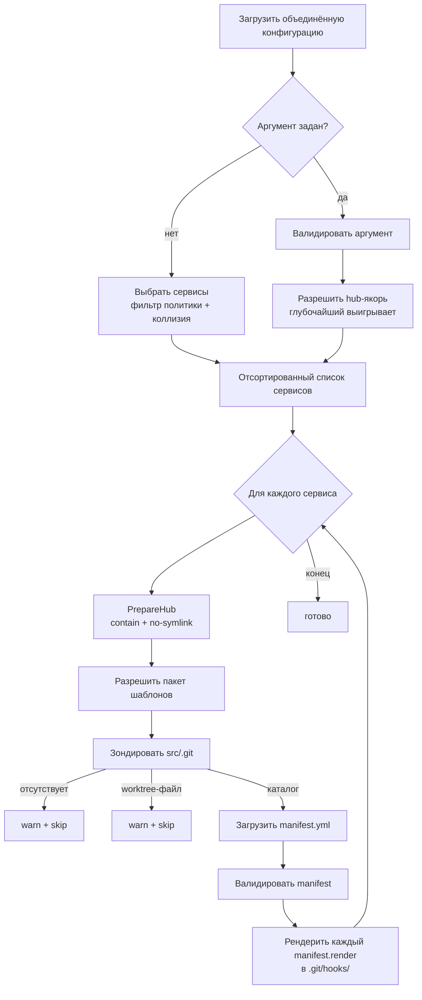

> Translated from: reference/render/git.md @ f8537aeb98f0

# dwe render git

Сгенерировать shell git-хуки для каждого включённого сервиса из пакета шаблонов. Вывод идёт в git-каталог хуков сервиса (например, `services/main/src/.git/hooks/pre-commit`), с исполняемым режимом `0755`.

`render git` разделяет пер-сервисную инфраструктуру с [`render ide`](ide.md) и [`render ai`](ai.md) — та же модель выборки, та же цепочка разрешения пакета, те же гарды безопасности путей, та же manifest-схема. Отличается в двух местах: назначение — внутри `.git/` каталога сервиса (который никогда не отслеживается git), а `to`-пути в manifest ограничены basename (без подкаталогов под `hooks/`).

## Содержание

- [Конвейер](#pipeline)
- [Выборка сервисов](#service-selection)
  - [Гейт активации](#activation-gate)
  - [Hub preflight и зонд git-каталога](#hub-preflight-and-git-directory-probe)
  - [Разрешение коллизий: выигрывает глубочайший](#collision-resolution-deepest-wins)
  - [Явный аргумент `[service]`](#explicit-service-argument)
- [Разрешение пакета шаблонов](#template-pack-resolution)
- [Схема manifest](#manifest-schema)
- [Пофайловый рендер](#per-file-rendering)
  - [Переменные шаблона](#template-variables)
  - [Гарды безопасности путей](#path-safety-guards)
  - [Нормализация режима файла](#file-mode-normalization)
- [Проработанный пример](#worked-example)
- [Сообщения вывода](#output-messages)
- [Worktree и submodule](#worktrees-and-submodules)
- [Частые ловушки](#common-pitfalls)
- [Связанные справочники](#related-references)

## Конвейер



## Выборка сервисов

### Гейт активации

Сервис участвует в рендере git-хуков, только если **оба** флага истинны:

| Гейт | Источник | По умолчанию |
|------|----------|---------------|
| Уровень проекта | `services.<name>.enabled` (3-слойный merged + обязательный service override) | зависит от сервиса |
| Политика git | `services.<name>.render.git.enabled` | `true` для `type: app`; `false` иначе |

Политика по умолчанию зеркалит [`render ide`](ide.md) (а не `render ai`): хуки рендерятся по умолчанию только для `type: app`, потому что там разработчики обычно коммитят код. Прочим типам сервисов нужно явно включить `render.git.enabled: true`.

Наследование через `extends` подчиняется тем же правилам, что у `render.ide` и `render.ai`: ребёнок без явного значения наследует у родителя `render.git.enabled` и `render.git.template`.

### Hub preflight и зонд git-каталога

До любой записи на диск каждый выбранный сервис проходит два preflight-чека:

1. **Containment hub.** `svc.Dir` должен разрешаться внутрь корня проекта и не достигаться через симлинк. Сервис с `dir: ../outside` или симлинкнутым каталогом `services/<name>` отвергается жёсткой ошибкой — рендерер никогда не создаёт `src/.git/hooks/` вне дерева проекта.
2. **Зонд git-каталога.** Инспектируется `<absHub>/src/.git`:
   - **каталог** → продолжить; хуки пишутся в `<absHub>/src/.git/hooks/`.
   - **обычный файл** (worktree или submodule `gitdir:`-указатель) → предупредить и пропустить сервис. См. [Worktree и submodule](#worktrees-and-submodules).
   - **отсутствует** → предупредить и пропустить сервис.

Симлинки в любом компоненте пути `<absHub>/src/.git/{hooks}` отвергаются.

### Разрешение коллизий: выигрывает глубочайший

Когда более одного выживающего сервиса указывает на один и тот же `dir`, ровно один выигрывает по тому же правилу «глубочайший extends побеждает», что и в [`render ide`](ide.md): вычисляется глубина цепочки, выигрывает самый глубокий сервис, лексикографическое имя ломает ничью. Проигравшие сервисы выдают предупреждение, называя победителя.

Обоснование совпадает с IDE: git-хуки отражают вариант, с которым работают прямо сейчас (вариант `main-debug` может хотеть дополнительные проверки, которые канонический `main` не делает), и самый специализированный сервис в цепочке владеет отрендеренными хуками общего `.git/`.

### Явный аргумент `[service]`

`dwe render git <name>` трактует `<name>` как hub-якорь. Аргумент валидируется по карте сервисов и гейту активации, затем применяется то же «глубочайший выигрывает» разрешение — поэтому `dwe render git main` может в итоге рендерить из конфигурации `main-debug`, когда оба делят `dir`.

## Разрешение пакета шаблонов

Для каждого выбранного сервиса рендерер выбирает один каталог-пакет под `workspace/templates/git/`. Цепочка точно совпадает с [`render ai`](ai.md) и [`render ide`](ide.md), различается только базовый каталог:

1. Если задано `render.git.template`, пробуется только `workspace/templates/git/<render.git.template>/`. Отсутствие пакета — жёсткая ошибка.
2. Иначе пробуется `workspace/templates/git/<service-name>/`. Если отсутствует — провалиться дальше.
3. Иначе обходится цепочка `extends:` предок-за-предком — `workspace/templates/git/<ancestor>/`. Побеждает первый существующий пакет.
4. Иначе используется `workspace/templates/git/default/`. Если отсутствует — пропуск с предупреждением (implicit missing pack).

Символы имени пакета ограничены (`^[A-Za-z0-9][A-Za-z0-9_-]*$`); небезопасное имя (точка в начале, дефис в начале, разделители путей) молча пропускает этого кандидата, и обход продолжается со следующим предком или `default/`.

## Схема manifest

Каждый пакет обязан содержать `manifest.yml` в своём корне по [общей схеме](index.md):

```yaml
render:
  - { from: pre-commit.tmpl,         to: pre-commit }
  - { from: prepare-commit-msg.tmpl, to: prepare-commit-msg }
  - { from: commit-msg.tmpl,         to: commit-msg }
  - { from: pre-push.tmpl,           to: pre-push }
```

`symlinks` для git-пакетов не используется и должен быть пуст или отсутствовать — git-открытие хуков не следует симлинкам внутри `.git/hooks/`.

Git-специфичные правила валидации (поверх общих правил формы):

| Правило | Поведение |
|---------|-----------|
| `to` — basename: без разделителей путей, без `..`, без `.`-сегментов | жёсткая ошибка |
| Список `symlinks` непустой | жёсткая ошибка |
| Каждый `from` разрешается либо в каноническом пакете, либо в `<pack>.local/`-оверрайде | жёсткая ошибка, если отсутствует |

Строгий YAML-декод означает, что опечатка в ключе (`renders:`, `symlink:`) отвергается на загрузке.

## Пофайловый рендер

Для каждой записи `render` источник разрешается через общий [packroot-resolver](index.md) (`<pack>.local/<rel>` → канонический `<pack>/<rel>`). Рендерер:

1. Читает разрешённый файл шаблона.
2. Парсит его как [Go text/template](../templates.md) в строгом режиме — любая ссылка на отсутствующее поле прерывает рендер вместо записи плейсхолдера `<no value>`.
3. Выполняет шаблон по [переменным шаблона](#template-variables).
4. Отказывается перезаписывать назначение, если оно уже существует как симлинк (симлинкнутый хук на многих платформах git молча игнорирует).
5. Пишет отрендеренные байты в `<svc.Dir>/src/.git/hooks/<basename>`.
6. Явно ставит режим файла `0755` через `chmod` — см. [Нормализация режима файла](#file-mode-normalization).

### Переменные шаблона

Та же форма, что у `render ide` и `render ai`:

| Переменная | Источник |
|------------|----------|
| `.Project` | блок `project:` из `workspace.yml` |
| `.Service` | **каноническая конфигурационная идентичность** — корень цепочки `extends:` рендерящегося сервиса. Используйте для raw-config поисков по имени сервиса (например, `(index .Cfg.Raw.git.hooks .Service)`). Равно `.Resolved`, когда у рендерящегося сервиса нет `extends:`. |
| `.Resolved` | **render-идентичность** — имя сервиса, чей hub реально рендерится (победитель коллизии по глубочайшему extends). Равно `.Service` без коллизии. |
| `.ServiceCfg` | эффективная конфигурация сервиса `.Resolved` (рендерящегося), после разрешения `extends`. Поля вроде `.ServiceCfg.Container` отражают overlay расширителя. |
| `.Runtime` | объединённый блок `runtime` |
| `.Cfg` | объединённый `DweConfig` (продвинутое). `.Cfg.Raw` — мапа конфигурации после слияния и нормализации DWE (`services.*` подставляется из per-service `service.yml`) — см. [Шаблоны](../templates.md). Для обычных случаев предпочитайте выделенные поля выше. |

> **Почему `.Service` и `.Resolved` различаются.** Когда два сервиса делят один `dir:` (обычно база + `extends:`-ребёнок типа `main` и `main-debug`), политика коллизий выбирает самого глубокого расширителя владельцем hub — это и есть `.Resolved`. Но user-facing секции конфигурации, ключёванные по имени сервиса (`git.hooks.<svc>`, `cs.<svc>`, …), по соглашению заполняются только на базе, поэтому raw-config поиски должны использовать `.Service` (корень цепочки), чтобы найтись. Эти два поля разделяют *поведенческую идентичность* (к какому контейнеру цепляться, какой overlay действует) и *конфигурационную идентичность* (где искать пользовательские значения).

Строгий режим рендера означает, что опечатка `{{.Servic.Name}}` прерывает рендер вместо вывода `<no value>`. Используйте `{{if ...}}` для полей, которые могут быть законно пустыми.

#### Доступ к `.Cfg.Raw`

Go-овский `text/template` разрешает dot-сегменты, только если каждый совпадает с `[A-Za-z_][A-Za-z0-9_]*`. До ключей с дефисами, точками, ведущими цифрами или любыми другими не-идентификаторными символами нельзя добраться dot-синтаксисом — используйте `index`.

```gotemplate
JIRA_PREFIX="{{ .Cfg.Raw.git.project_prefix }}"                  {{- /* точка — identifier-safe ключи */ -}}
TOKEN='{{ index .Cfg.Raw "my-tool" "api-key" }}'                {{- /* index — ключи с дефисами */ -}}
{{- $hooks := index .Cfg.Raw.git.hooks .Service }}{{ index $hooks "pre_commit" }}
```

Git-хуки рендерятся в `<svc.Dir>/src/.git/hooks/` (gitignored), поэтому значения из `local.yml` в `.Cfg.Raw` дают вариацию хуков на разработчика, которая не коммитится, — это и есть здесь целевой кейс, в отличие от `render ide` / `render ai`, которые пишут отслеживаемые файлы.

Полный набор хелперов, доступных внутри `*.tmpl` (`appURL`, sprout-реестры, встроенные `text/template`), описан в [Шаблоны](../templates.md).

### Гарды безопасности путей

Рендерер применяет ту же цепочку границ, что и IDE/AI, адаптированную под назначение `.git/hooks/`:

1. **Hub preflight.** Containment `svc.Dir` и проверка на отсутствие симлинков до любого `MkdirAll`.
2. **Зонд git-каталога.** `<absHub>/src/.git` должен быть реальным каталогом; любой симлинк-компонент в пути отвергается.
3. **`to` в manifest — basename.** Подкаталоги под `hooks/` не допускаются (git не спускается в подкаталоги `hooks/`).
4. **Граница реального пути после создания.** После `MkdirAll(<hooksDir>)` разрешённый реальный путь каталога хуков должен быть внутри и реального корня проекта, и реального `.git/`. Это ловит предсуществующий симлинк `hooks -> /tmp/...` в `.git/`.
5. **Никаких симлинков на месте файла назначения.** Предсуществующий симлинк `<hooksDir>/<basename>` отвергается, а не следуется.

### Нормализация режима файла

`os.WriteFile` ставит режим файла только на создании. Чтобы гарантировать, что перерендер существующего хука восстанавливает исполняемые биты, даже если он лёг как `0644` (например, после предыдущего тула или checkout-а на Windows), рендерер на каждом прогоне явно делает `chmod 0755` на каждый отрендеренный хук.

## Проработанный пример

Раскладка:

```
workspace/services/
  main/
    service.yml
workspace/templates/git/
  default/
    manifest.yml
    pre-commit.tmpl
    pre-push.tmpl
```

Manifest `workspace/templates/git/default/manifest.yml`:

```yaml
render:
  - { from: pre-commit.tmpl, to: pre-commit }
  - { from: pre-push.tmpl,   to: pre-push }
```

Шаблон `workspace/templates/git/default/pre-commit.tmpl`:

```sh
#!/usr/bin/env sh
# pre-commit hook for {{.Resolved}} ({{.ServiceCfg.Container}})
exec dwe run --service {{.Resolved}} lint
```

`workspace/services/main/service.yml`:

```yaml
type: app
container: app-main
dir: ./services/main
# render.git.enabled defaults to true (type: app)
```

`dwe render git`:

1. Выборка: `main` проходит гейт активации. Hub preflight успешен.
2. Разрешение пакета: implicit-цепочка — `workspace/templates/git/main/` отсутствует, поэтому используется `workspace/templates/git/default/`.
3. `services/main/src/.git/` — каталог → зонд успешен.
4. Manifest валиден: две записи рендера, без симлинков, basename-значения `to`, источники есть.
5. Каждая запись рендерится в `services/main/src/.git/hooks/` с режимом `0755`.

Результат:

```
services/main/src/.git/hooks/
  pre-commit       (0755)
  pre-push         (0755)
```

Если бы `services/main/src/.git` был файлом (worktree/submodule-указателем) или вовсе отсутствовал, `render git` выдал бы предупреждение и вышел успешно, ничего не записав.

## Сообщения вывода

| Поток | Триггер |
|-------|---------|
| info | Явный аргумент разрешился в другого сиблинга — называется выбранный победитель и общий hub-каталог. |
| info | Использован `<pack>.local/<rel>`-override вместо канонического файла. |
| warning | У выбранного сервиса нет каталога `src/.git` — пропущен. |
| warning | У выбранного сервиса `src/.git` — worktree/submodule-указатель (файл) — пропущен (см. [Worktree и submodule](#worktrees-and-submodules)). |
| warning | Выбранный сервис пропущен, потому что другой сервис выиграл коллизию каталога — победитель назван. |
| success | По одной строке на каждый отрендеренный хук, с относительным путём внутри проекта. |
| info | Ничего не выбрано после применения политики и правил коллизии. |

Ошибки возвращаются как падение команды и называют проблемный сервис, чтобы источник проблемы был очевиден.

## Worktree и submodule

Когда `<svc.Dir>/src/.git` — обычный файл, а не каталог, это `gitdir:`-указатель, используемый `git worktree` и submodule-ами. Следование за такими указателями требует прочесть файл, разрешить относительный путь к настоящему git-каталогу и заново применить гарды безопасности путей к разрешённой цели. Эта итерация **не** следует за `gitdir:`-указателями — сервис пропускается с предупреждением и хуки не рендерятся.

Дальнейший план добавит поддержку worktree. Пока сервисам с worktree-чекаутами нужны хуки, установленные вручную, или направить `core.hooksPath` на отслеживаемый каталог внутри репозитория.

## Частые ловушки

- **Сервисы не-`app` не рендерятся по умолчанию.** Явно задайте `services.<name>.render.git.enabled: true`, чтобы opt-in.
- **`to` в manifest должен быть basename.** Хуки живут прямо в `hooks/`; git туда не спускается. `to: subdir/pre-commit` отвергается.
- **`symlinks` для git не используется.** Многие установки git игнорируют симлинкнутые хуки. Перенесите содержимое в отдельную запись рендера.
- **Выход рендера лежит внутри `.git/`.** Он никогда не отслеживается. Источник правды — перерендер; не правьте `src/.git/hooks/<name>` руками и не ждите, что изменения выживут.
- **Worktree и submodule пропускаются.** См. [Worktree и submodule](#worktrees-and-submodules).
- **Предсуществующий не-исполняемый хук.** Перерендер нормализует режим обратно к `0755` на каждом прогоне.

## Связанные справочники

- [блок `services.<name>.render.git`](../config/services/fields.md) — `enabled`, `template`, наследование через `extends`
- [`render ide`](ide.md) — родственная команда с той же политикой «глубочайший выигрывает»
- [`render ai`](ai.md) — родственная команда (поверхностнейший выигрывает), разделяющая схему manifest
- [Обзор render](index.md) — общая схема manifest и механизм локальных оверрайдов
- Запустите `dwe render git --help`, чтобы увидеть актуальный CLI-интерфейс
