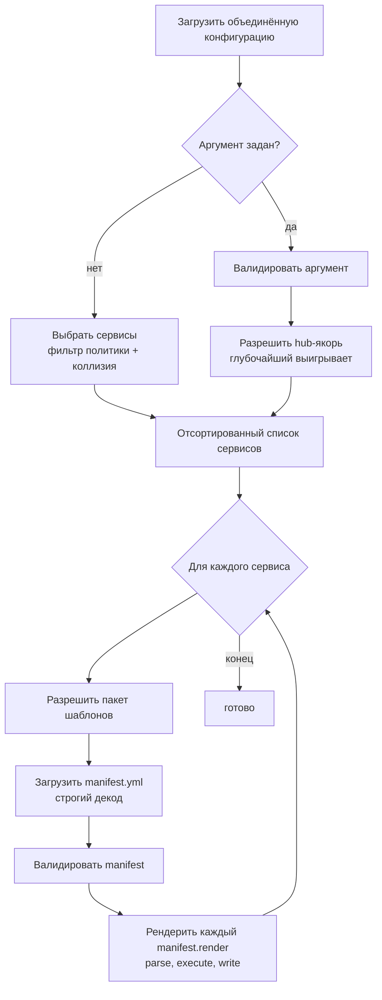
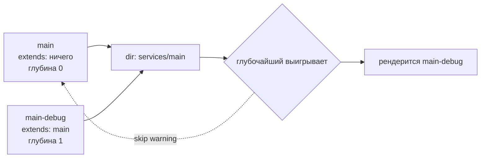
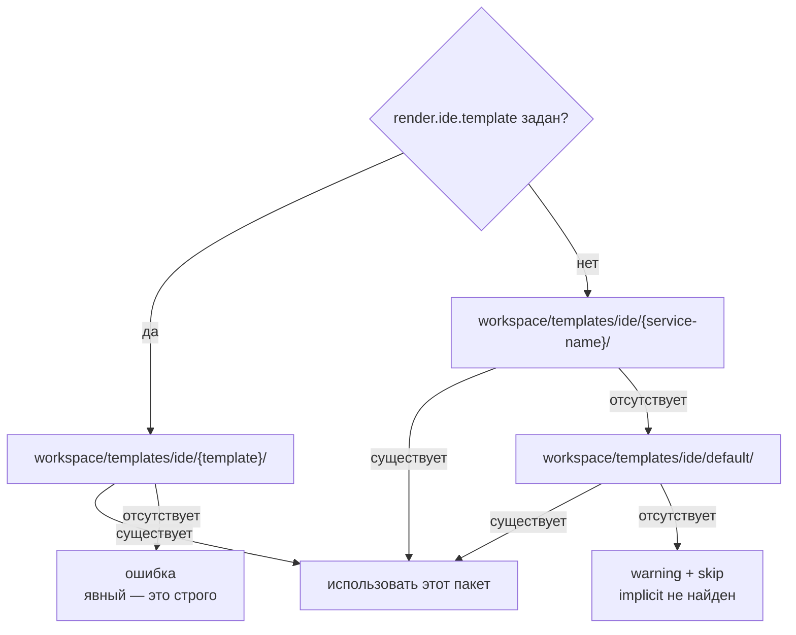

> Translated from: reference/render/ide.md @ 43038f7761e6

# dwe render ide

Сгенерировать IDE-специфичные файлы конфигурации для каждого включённого сервиса из пакета шаблонов. Вывод идёт в hub-каталог сервиса (например, `services/main/.vscode/settings.json`).

> **Manifest обязателен.** Каждый IDE-пакет обязан содержать `manifest.yml` в корне, перечисляющий каждый рендерящийся файл. Прежнее поведение с обходом каталога удалено; отсутствие manifest — жёсткая ошибка с миграционной подсказкой. Схема разделяется с `render ai` и `render git` — см. [Общая схема manifest](index.md). Пофайловые [локальные оверрайды](index.md) через соседний `<pack>.local/` shadow-tree применяются ко всем трём рендерерам одинаково.

## Содержание

- [Конвейер](#pipeline)
- [Выборка сервисов](#service-selection)
  - [Гейт активации](#activation-gate)
  - [Нормализация каталога](#directory-normalization)
  - [Разрешение коллизий: выигрывает глубочайший](#collision-resolution-deepest-wins)
  - [Явный аргумент `[service]`](#explicit-service-argument)
- [Разрешение пакета шаблонов](#template-pack-resolution)
- [Схема manifest](#manifest-schema)
- [Пофайловый рендер](#per-file-rendering)
  - [Переменные шаблона](#template-variables)
  - [Гарды безопасности путей](#path-safety-guards)
- [Проработанный пример](#worked-example)
- [Сообщения вывода](#output-messages)
- [Частые ловушки](#common-pitfalls)
- [Связанные справочники](#related-references)

## Конвейер



## Выборка сервисов

### Гейт активации

Сервис участвует в IDE-рендере, только если **оба** флага истинны:

| Гейт | Источник | По умолчанию |
|------|----------|---------------|
| Уровень проекта | `services.<name>.enabled` (3-слойный merged + обязательный service override) | зависит от сервиса |
| Политика IDE | `services.<name>.render.ide.enabled` | `true` для `type: app`; `false` иначе |

Если хоть один гейт ложный — сервис пропускается. Пропуски делятся на две группы:

| Группа | Когда | Сообщается как warning? |
|--------|-------|-------------------------|
| Политические пропуски | сервис отключён на уровне проекта, или `render.ide.enabled` равен `false` (явно или по дефолту типа) | нет — это документированное opt-in/opt-out поведение |
| Actionable-пропуски | у сервиса нет hub-каталога, или другой сервис выиграл коллизию каталога | да — обычно это указывает на неверную настройку |

### Нормализация каталога

После гейта активации сервисы без hub-каталога отбрасываются — либо `dir` пуст, либо он разрешается в корень проекта. У сервиса без hub нет куда писать, а hub, равный корню проекта, дал бы рендереру царапать `workspace.yml` поверх самого себя.

### Разрешение коллизий: выигрывает глубочайший

Когда более одного выживающего сервиса указывает на один и тот же `dir`, ровно один выигрывает:

1. Пройти цепочку `extends` каждого сервиса и вычислить глубину.
2. Выигрывает сервис с **самой глубокой** цепочкой. Глубина ограничена (сейчас 32 хопа) как cycle-guard.
3. Ничьи на одной глубине ломаются лексикографически по имени сервиса, поэтому результат детерминирован.

Проигравшие сервисы выдают предупреждение, называющее победителя и спорный каталог.



Обоснование: IDE-конфигурации — это про per-variant оверрайды (разные настройки отладчика для `main-debug`, разные launch-профили для stage-варианта), поэтому самый специализированный сервис в цепочке владеет отрендеренными файлами.

### Явный аргумент `[service]`

`dwe render ide <name>` трактует `<name>` как **hub-якорь**: это должен быть реальный, eligible-сервис, но дальше применяется политика «глубочайший выигрывает», чтобы понять, какой сиблинг действительно рендерится.

Порядок валидации (первая ошибка побеждает):

1. Сервис не в конфигурации.
2. Сервис отключён на уровне проекта.
3. У сервиса нет hub-каталога, или его hub — корень проекта.
4. `render.ide.enabled` вычисляется в `false` — либо явно, либо по дефолту типа (не-`app` типы выключены по умолчанию; сообщение об ошибке говорит, какой случай и как opt-in).

После валидации применяется то же «глубочайший выигрывает», ограниченное сиблингами, делящими тот же `dir`. Если победитель отличается от аргумента, info-строка объявляет подмену.

Так `dwe render ide main` из пер-сервисного deploy-пайплайна всё равно делает правильное, когда активный вариант — `main-debug`.

## Разрешение пакета шаблонов

Для каждого выбранного сервиса рендерер выбирает один каталог-пакет под `workspace/templates/ide/`.



Правила:

- **Явный — это строго.** Если `render.ide.template` задан, пробуется только этот пакет. Отсутствующий пакет — жёсткая ошибка, никакого тихого fallback. Это защищает от опечаток вроде `templete:`, случайно разрешающихся в `default/` и рендерящих сюрпризы.
- **Implicit-цепочка** (когда `render.ide.template` не задан): `<service-name>` → проход по цепочке `extends:` предок-за-предком → `default`. Побеждает первый существующий пакет. Провал-дальше происходит только если кандидатный каталог отсутствует; любая другая ошибка файловой системы — жёсткая. Если implicit-цепочка исчерпана без пакета, рендер пропускается с предупреждением. Невалидные имена пакетов в цепочке (точка в начале, разделитель пути) молча пропускаются, обход продолжается.
- **Почему предки.** `extends:`-потомок вроде `main-debug` обычно не несёт собственного пакета — он наследует IDE-конфигурацию родителя. Падение сразу на `default/` отрендерило бы не тот контент, потому что default-пакет настроен под другие сервисы.
- Пакет должен быть **реальным каталогом**. Симлинкнутые пакеты отвергаются.
- Выбранный пакет должен лежать внутри корня проекта без симлинкнутых компонентов родителя.

Валидация ключа шаблона отвергает:

- Разделители путей (`/`, `\`).
- Точку в начале (включает `..` и hidden-ключи).
- Пусто (трактуется как «не задано», что разрешено и запускает implicit-цепочку).

Имена сервисов, используемые как implicit-ключ пакета, валидируются менее строго (точка в начале разрешена, потому что имена сервисов — ключи YAML-мапы, а не вводимые пользователем пути), но всё равно не должны содержать разделителей путей или быть `..`.

## Схема manifest

Каждый IDE-пакет обязан содержать `manifest.yml` в корне по [общей схеме manifest](index.md):

```yaml
render:
  - from: .vscode/settings.json.tmpl
    to:   .vscode/settings.json
  - from: .devcontainer/devcontainer.json.tmpl
    to:   .devcontainer/devcontainer.json

# symlinks: опционально — та же семантика, что у render ai
```

Отсутствие `manifest.yml` — жёсткая ошибка: существующим пакетам, которые опирались на обход каталога, придётся добавить manifest, перечисляющий каждый файл. Файлы внутри пакета, не упомянутые в `render`, игнорируются (рендерер сам пакет никогда не обходит).

Валидация идёт в два прохода:

| Проход | Что проверяет |
|--------|----------------|
| Shape (чистый) | хотя бы одна запись `render` или `symlinks`; `to`-пути содержатся под hub; нет дублей `to`; каждый `to` симлинка ссылается на известный render-назначение |
| Sources (resolver-aware) | каждый `from` существует либо в каноническом `workspace/templates/ide/<pack>/<from>`, либо в overrid-е `workspace/templates/ide/<pack>.local/<from>` |

Строгий YAML-декод (`yaml.Decoder.KnownFields(true)`) отвергает опечатанные ключи вроде `renders:` на загрузке.

## Пофайловый рендер

Для каждой записи назначение строится конкатенацией hub-каталога сервиса с относительным путём записи (path внутри пакета без `.tmpl`). Рендерер:

1. Читает файл шаблона из пакета.
2. Парсит его как [Go text/template](../templates.md) в строгом режиме — любая ссылка на отсутствующее поле прерывает рендер вместо записи плейсхолдера `<no value>`.
3. Выполняет шаблон по [переменным шаблона](#template-variables).
4. Разрешает назначение и прогоняет [гарды безопасности путей](#path-safety-guards).
5. Создаёт отсутствующие родительские каталоги.
6. Отказывается перезаписывать назначение, если оно уже существует как симлинк.
7. Пишет отрендеренные байты.

Существующие обычные файлы по назначению перезаписываются без подтверждения — это и есть смысл команды.

### Переменные шаблона

Шаблоны получают один объект с такими полями верхнего уровня:

| Переменная | Источник | Замечания |
|------------|----------|-----------|
| `.Project` | блок `project:` из `workspace.yml` | например, `.Project.Name`, `.Project.Prefix` |
| `.Service` | **каноническая конфигурационная идентичность** — корень цепочки `extends:` рендерящегося сервиса | используйте для raw-config поисков по имени сервиса (`(index .Cfg.Raw.cs .Service).standard`). Равно `.Resolved` без цепочки extends. |
| `.Resolved` | **render-идентичность** — сервис, чей hub реально рендерится (победитель коллизии по глубочайшему extends). | Равно `.Service` без коллизии. |
| `.ServiceCfg` | эффективная конфигурация сервиса `.Resolved`, после разрешения `extends` | например, `.ServiceCfg.Container`, `.ServiceCfg.Dir`, `.ServiceCfg.DirInternal`, `.ServiceCfg.WorkDirInternal`, `.ServiceCfg.CLI.*` отражают overlay рендерящегося сервиса |
| `.Runtime` | объединённый блок `runtime` | `.Runtime.UseHTTPS`, `.Runtime.SPX.Path`. Порты/хосты на сервис находятся в записи каждого сервиса — используйте `((index .Services "<name>").Port "<port-name>")` / `((index .Services "<name>").Host "<host-name>")`. |
| `.Services` | `map[string]ServiceConfig`, ключёванная по имени сервиса | только индексный доступ (требование Go-шаблона): `(index .Services "main")`. Фильтруйте по типу через `.AppServices` / `.ToolServices` / `.InfraServices` (0-аргументные методы, возвращающие типизированные подмножества). |
| `.Cfg` | объединённый `DweConfig` (продвинутое) | `.Cfg.Raw` — мапа после слияния и нормализации DWE (`services.*` подставляется из per-service `service.yml`) — см. [Шаблоны](../templates.md). Для обычных случаев предпочитайте выделенные поля выше. |

> **Совет.** IDE-выход ложится в `<svc.Dir>/<entry.To>` — обычно в отслеживаемые проектные файлы (`.vscode/settings.json`, `.devcontainer/devcontainer.json`, …). Избегайте использования developer-local или секретных ключей через `.Cfg.Raw` в IDE-шаблонах: любое значение, попавшее из `workspace/local.yml`, всплывёт в отрендеренном файле и даст разные диффы у разных разработчиков в отслеживаемых артефактах. Используйте `.Cfg.Raw` только для общих для всего проекта соглашений.

Строгий режим означает, что опечатка `{{.Servic.Name}}` прерывает рендер вместо записи `<no value>`. Используйте `{{if ...}}`-гарды для полей, которые могут быть законно пустыми.

#### Доступ к `.Cfg.Raw`

Go-овский `text/template` разрешает dot-сегменты, только если каждый совпадает с `[A-Za-z_][A-Za-z0-9_]*`. До ключей с дефисами, точками, ведущими цифрами или любыми другими не-идентификаторными символами нельзя добраться dot-синтаксисом — используйте `index`.

```gotemplate
{{ .Cfg.Raw.ide.workspace_name }}              {{- /* точка — identifier-safe ключи */ -}}
{{ index .Cfg.Raw "my-tool" "api-key" }}       {{- /* index — ключи с дефисами */ -}}
```

Замечание: порты/хосты на сервис находятся в значении `ServiceConfig` этого сервиса — `((index .Services "main").Port "http")`, `((index .Services "adminer").Host "web")`. Отдельных namespace-ов `.Runtime.Ports` / `.Runtime.Hosts` / `.Tools` нет.

Полный набор хелперов, доступных внутри `*.tmpl` (`appURL`, sprout-реестры, встроенные `text/template`), описан в [Шаблоны](../templates.md).

### Гарды безопасности путей

Рендерер применяет множественные граничные проверки, потому что вредоносный или невнимательный путь шаблона иначе мог бы использоваться для записи файлов вне hub сервиса или корня проекта. Полная цепочка по порядку:

1. **Очистка пути.** Относительный путь каждой записи пакета нормализуется; абсолютные пути и `..`-побеги отвергаются при обходе пакета.
2. **Containment service-dir.** Разрешённое назначение должно быть внутри hub-каталога сервиса.
3. **Никаких симлинков в пути назначения.** Существующие компоненты пути проверяются до создания любого каталога. Это ловит предсуществующий симлинк `.devcontainer`, иначе позволивший бы созданию каталога уйти за пределы hub.
4. **Границы реального пути после создания.** После создания родительских каталогов каталог назначения разрешается через любые симлинки и должен по-прежнему быть внутри и реального корня проекта, и реального hub. Это ловит гонку, когда симлинк подбрасывают между проверками.
5. **Никаких симлинков на месте файла назначения.** Если по target-пути уже есть симлинк, запись отвергается (а не следуется по ссылке с перезаписью того, на что она указывает).

Те же гарды применяются к самому пакету: каталог пакета проверяется на симлинкнутые компоненты родителя, а walker отвергает любой симлинк внутри дерева.

## Проработанный пример

Раскладка:

```
workspace/services/
  main/
    service.yml
  main-debug/
    service.yml
workspace/templates/ide/
  default/
    .devcontainer/devcontainer.json.tmpl
    .vscode/settings.json.tmpl
  main-debug/
    .devcontainer/devcontainer.json.tmpl
    .vscode/settings.json.tmpl
    .vscode/launch.json.tmpl
```

`workspace/services/main/service.yml`:

```yaml
type: app
container: app-main
dir: ./services/main
# render.ide.enabled defaults to true (type: app)
```

`workspace/services/main-debug/service.yml`:

```yaml
type: app
extends: main
container: app-main-debug
dir: ./services/main          # тот же dir, что у родителя — коллизия
render:
  ide:
    template: main-debug       # использовать пакет main-debug
```

Шаблон `workspace/templates/ide/main-debug/.vscode/settings.json.tmpl`:

```json
{
  "container.name": "{{.ServiceCfg.Container}}",
  "workspace.root": "{{.ServiceCfg.DirInternal}}",
  "service": "{{.Resolved}}"
}
```

`dwe render ide` (без аргумента):

1. Выборка: и `main`, и `main-debug` проходят гейт активации. Они делят `dir: ./services/main`. У `main-debug` цепочка `extends` глубже (1 против 0), поэтому `main-debug` выигрывает. `main` сообщается как пропуск из-за коллизии, выводится предупреждение.
2. Разрешение пакета для `main-debug`: `render.ide.template: main-debug` явный; `workspace/templates/ide/main-debug/` существует — он и используется.
3. Обход пакета даёт три записи (отсортированы): `.devcontainer/devcontainer.json`, `.vscode/launch.json`, `.vscode/settings.json`.
4. Каждая рендерится с `.Service = "main"` (корень цепочки — по нему ключёваны user-config мапы), `.Resolved = "main-debug"` (рендерящийся сервис), `.ServiceCfg.Container = "app-main-debug"` и т. д.

Результат:

```
services/main/
  .devcontainer/
    devcontainer.json
  .vscode/
    launch.json
    settings.json
```

`dwe render ide main` даёт тот же результат — `main` валидируется, но hub-anchor разрешение выбирает `main-debug` и печатает `ide [main] — resolved to main-debug (hub services/main)`.

## Сообщения вывода

| Поток | Триггер |
|-------|---------|
| info | Явный аргумент разрешился в другого сиблинга — называется выбранный победитель и общий hub-каталог. |
| warning | Выбранный сервис пропущен, потому что у него нет hub-каталога (или его hub — корень проекта). |
| warning | Выбранный сервис пропущен, потому что другой сервис выиграл коллизию каталога — победитель назван. |
| info | Использован `<pack>.local/<rel>`-override вместо канонического файла. |
| success | По одной строке на каждый отрендеренный файл, с относительным путём внутри проекта. |
| info | Ничего не выбрано после применения политики и правил коллизии. |

Ошибки возвращаются как падение команды и называют проблемный сервис, чтобы источник проблемы был очевиден.

## Частые ловушки

- **Сервисы не-`app` не рендерятся по умолчанию.** Задайте `render.ide.enabled: true` в `workspace/services/<name>/service.yml`, чтобы opt-in.
- **Опечатки в `render.ide.template` — жёсткие ошибки.** Явные пакеты строгие; отсутствующий `workspace/templates/ide/<name>/` не проваливается тихо в `default/`. Либо исправьте имя, либо уберите `render.ide.template`.
- **Шаблоны, ссылающиеся на отсутствующие поля, падают.** Строгий режим рендера означает, что `{{.ServiceCfg.NoSuchField}}` прерывает рендер. Заворачивайте опциональные поля в `{{if ...}}`.
- **Симлинки на назначении отвергаются.** Если `.devcontainer/` или `settings.json` — симлинк, рендерер не перезапишет его. Уберите симлинк и перезапустите.
- **Файлы, не перечисленные в `manifest.yml`, молча игнорируются.** Рендерер больше не обходит пакет — добавьте запись под `render:`, чтобы включить шаблон.
- **`dir: "."` отвергается.** Сервис, чей hub — корень проекта, дал бы шаблонам царапать `workspace.yml` и другие корневые файлы. Дайте каждому IDE-рендерящемуся сервису реальный подкаталог.

## Связанные справочники

- [блок `services.<name>.render.ide`](../config/services/fields.md) — `enabled`, `template`, наследование через `extends`
- [`render ai`](ai.md) — родственная команда с противоположной политикой коллизий
- Запустите `dwe render ide --help`, чтобы увидеть актуальный CLI-интерфейс
