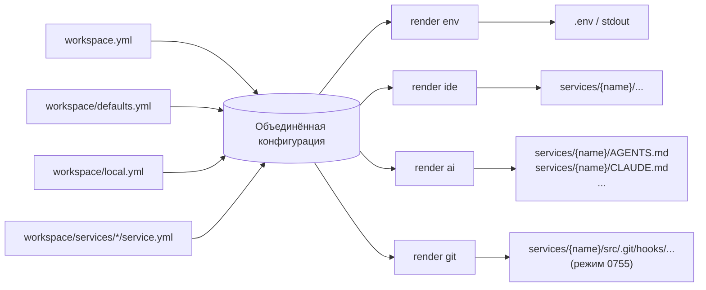

> Translated from: reference/render/index.md @ 5a0e41f982dc

# Справочник Render

`dwe render` производит файлы, выведенные из объединённой конфигурации DWE. Это единая точка входа для сгенерированных артефактов — ни один из этих файлов не должен править вручную; вместо этого перезапустите соответствующую подкоманду.

## Содержание

- [Подкоманды](#subcommands)
- [Общий конвейер](#common-pipeline)
- [Вход и выход одним взглядом](#inputs-and-outputs-at-a-glance)
- [Страницы](#pages)
- [Связанные справочники](#related-references)

## Подкоманды

| Команда | Вывод | Источник |
|---------|-------|----------|
| `dwe render env` | содержимое `.env` (stdout или `--out <path>`) | правила `exports.env` в `workspace/defaults.yml` + системные переменные |
| `dwe render ide` | IDE-файлы по каждому сервису внутри hub-каталога сервиса | пакеты шаблонов в `workspace/templates/ide/<pack>/`, управляемые `manifest.yml` |
| `dwe render ai` | agent-доки на уровне hub (`AGENTS.md`, симлинк `CLAUDE.md`, …) | пакеты шаблонов в `workspace/templates/ai/<pack>/`, управляемые `manifest.yml` |
| `dwe render git` | shell git-хуки на каждый сервис, в `<svc.Dir>/src/.git/hooks/<basename>` (режим `0755`) | пакеты шаблонов в `workspace/templates/git/<pack>/`, управляемые `manifest.yml` |
| `dwe render config` | config-файлы по каждому сервису (`.env`, `env.php`, …) внутри hub-каталога сервиса, с воспроизведением собранных секретов | пакеты шаблонов в `workspace/templates/config/<pack>/`, управляемые `manifest.yml` |

Все пять подкоманд читают одну и ту же объединённую конфигурацию (`workspace.yml` → `workspace/defaults.yml` → `workspace/local.yml`, с объявлениями сервисов из `workspace/services/<name>/service.yml`). Различаются они тем, что итерируют и куда пишут.

## Общий конвейер



Каждая подкоманда:

1. Загружает объединённую конфигурацию. Отсутствующая или невалидная проектная конфигурация — жёсткая ошибка.
2. Выбирает цели:
   - `env` — один артефакт, без выборки.
   - `ide` / `ai` / `git` — итерирует сервисы, применяет политику выборки, опционально сужает до одного сервиса через аргумент `[service]`.
3. Пишет выходные файлы. Куда они идут — зависит от подкоманды:
   - `render ide` и `render ai` пишут внутрь hub-каталога каждого сервиса, привязанного к корню проекта (каталог, содержащий `workspace.yml`), и применяют границы безопасности путей.
   - `render git` пишет в `<svc.Dir>/src/.git/hooks/` для каждого сервиса, у которого `src/.git` — реальный каталог; назначение никогда не отслеживается git.
   - `render env` пишет в stdout по умолчанию или в аргумент `--out <path>` как задано. Путь `--out` трактуется относительно текущего рабочего каталога, не корня проекта — указывайте абсолютный путь, если нужно детерминированное расположение независимо от того, откуда запущена команда.

## Вход и выход одним взглядом

| Аспект | `render env` | `render ide` | `render ai` | `render git` |
|--------|--------------|--------------|-------------|--------------|
| Итерирует сервисы | нет | да | да | да |
| Читает шаблоны с диска | нет | да (через manifest) | да (через manifest) | да (через manifest) |
| Пер-сервисное поле opt-in | — | `services.<name>.render.ide.enabled` | `services.<name>.render.ai.enabled` | `services.<name>.render.git.enabled` |
| Политика opt-in по умолчанию | — | `true` для `type: app`; `false` иначе | `true` для всех типов | `true` для `type: app`; `false` иначе |
| Политика коллизий при общем `dir` | — | выигрывает самый глубокий `extends` (per-variant override) | выигрывает самый поверхностный `extends` (каноническая идентичность hub) | выигрывает самый глубокий `extends` (per-variant хуки) |
| Файл manifest | — | `manifest.yml` объявляет `render` (+ `symlinks`) | `manifest.yml` объявляет `render` + `symlinks` | `manifest.yml` объявляет только `render` |
| Поддерживаются симлинки | нет | да (относительные, внутри hub) | да (относительные, внутри hub) | нет — `to` должен быть basename |
| Режим вывода | n/a | как написано | как написано | явный `chmod 0755` на каждый прогон |
| Защита путей | n/a | отказ от симлинков в пакете и назначении | отказ от симлинков в пакете и назначении | preflight hub-а + отказ от симлинков в `.git/hooks/` |

## Общая схема manifest

`render ide`, `render ai` и `render git` читают `manifest.yml` в корне выбранного пакета шаблонов по единой общей схеме:

```yaml
render:
  - from: <путь внутри пакета, оканчивающийся на .tmpl>
    to:   <путь назначения относительно dest-root конкретного типа>

symlinks:
  - link: <путь симлинка>
    to:   <существующий путь рендера>
```

Поверх — ограничения по типу:

| Тип | Dest root | Форма `to` | `symlinks` |
|-----|-----------|------------|------------|
| `ide` | hub-каталог сервиса | любой содержащийся относительный путь | разрешены |
| `ai` | hub-каталог сервиса | любой содержащийся относительный путь | разрешены, должны ссылаться на `to` из `render` |
| `git` | `<svc.Dir>/src/.git/hooks/` | **только basename** (без слешей, без `..`) | отвергаются — должны быть пусты |

Manifest загружается со строгим YAML-декодом (`yaml.Decoder.KnownFields(true)`); неизвестные поля — жёсткая ошибка. Пустой manifest (без `render` и `symlinks`) отвергается. Валидация разделена на **shape** (чистая, без файловой системы) и **sources** (resolver-aware проверка существования), чтобы shadow-pack override участвовал в валидации существования источников ровно так же, как их читает рендерер.

## Локальные оверрайды

Любой пакет шаблонов `workspace/templates/<kind>/<pack>/<rel>` может быть пофайлово переопределён соседним shadow-пакетом `workspace/templates/<kind>/<pack>.local/<rel>`. Resolver, применяемый всеми тремя подкомандами рендера:

1. Проверить `workspace/templates/<kind>/<pack>.local/<rel>`:
   - обычный файл → использовать; рендерер выводит одну info-строку `using local override: workspace/templates/<kind>/<pack>.local/<rel>`.
   - существует, но это каталог или симлинк → жёсткая ошибка; override не падает молча на канонический пакет (так плохой override обозначит себя сам).
   - отсутствует → провалиться дальше.
2. Проверить `workspace/templates/<kind>/<pack>/<rel>`:
   - обычный файл → использовать.
   - существует, но это каталог или симлинк → жёсткая ошибка с именем нарушающего пути.
   - отсутствует → обёрнутый `os.ErrNotExist`.

Каталог `<pack>.local/` — это **сосед** канонического пакета, не его потомок. Он лежит в отслеживаемом `workspace/templates/<kind>/` и игнорируется git по паттерну (`workspace/templates/*/*.local/` или более широкое правило `*.local/` — рекомендуется добавить в проектный `.gitignore`).

В override-пакете должны быть только переопределяемые файлы — это не полный пакет. `manifest.yml` читается **только** из канонического пакета; override не может переписать manifest, а только подменить отдельные `from:`-источники.

Это зеркалит существующее в проекте соглашение про user-local override:

| Каноническое (отслеживаемое) | Локальный сосед (gitignored) |
|------------------------------|-------------------------------|
| `workspace/workspace.yml` | `workspace/local.yml` (описан в [справочнике services](../config/services/index.md)) |
| `workspace/docker.yml` | `workspace/docker.local.yml` |
| `workspace/templates/<kind>/<pack>/` | `workspace/templates/<kind>/<pack>.local/` |

`.dwe/` (runtime-каталог) никогда не используется для пользовательских оверрайдов — он зарезервирован под управляемое DWE состояние (`state.yml`, `deploy.lock`, `logs/`).

### Вход vs выход

Override — это **подмена входа**, а не перенаправление выхода:

- Файл-override `workspace/templates/<kind>/<pack>.local/<rel>` игнорируется git по паттерну `.local/` и никогда не коммитится.
- Отрендеренный **выход** всё равно падает на `to`, объявленный в manifest.

Что это означает на практике:

| Тип | Путь вывода | Отслеживается? | Эффект локального override |
|-----|-------------|----------------|----------------------------|
| `git` | `<svc.Dir>/src/.git/hooks/<basename>` | никогда (внутри `.git/`) | override полностью приватен для разработчика |
| `ide` / `ai` | `<svc.Dir>/<rel>` (обычно отслеживается) | как правило да | перерендер меняет отслеживаемый артефакт; разработчик сам отвечает за то, чтобы не закоммитить эти изменения (`git stash`, `git checkout -- <path>` или личный pre-commit guard) |

Для IDE/AI локальный override, дающий другой выход, — это поток, в который вы намеренно входите; держите его вне коммитов так же, как и любую несвязанную WIP-правку.

## Страницы

- [`render env`](env.md) — генерация `.env`: системные переменные, правила экспорта, фильтрация через `when`, форматирование значений
- [`render ide`](ide.md) — IDE-пакеты шаблонов: разрешение пакета, схема manifest, политика «глубочайший выигрывает», пер-сервисный рендер
- [`render ai`](ai.md) — пакеты agent-доков: схема manifest, политика «поверхностнейший выигрывает», записи `render` + `symlinks`
- [`render git`](git.md) — shell git-хуки: manifest-driven рендер в `<svc.Dir>/src/.git/hooks/`, «глубочайший выигрывает», режим `0755`
- [`render config`](config.md) — config-файлы сервисов: подложка `${...}`, воспроизведение `${generated.<name>}`, секреты по принципу «собрать, а не выпустить», opt-in разрешение пакетов

## Связанные справочники

- [`workspace.yml` / `defaults.yml` / `local.yml`](../config/workspace.md) — слои объединённой конфигурации и разрешение dot-path (используется `render env`)
- [определения сервисов (`workspace/services/*/service.yml`)](../config/services/index.md) — определения сервисов, блоки `ide` / `ai` / `git`, цепочки `extends`
- [Шаблоны](../templates.md) — синтаксис Go-шаблонов, помощники sprout, render-контекст (общий с info / commands / pipelines)
- Запустите `dwe render --help` (или `dwe render <подкоманда> --help`), чтобы увидеть актуальный CLI-интерфейс
