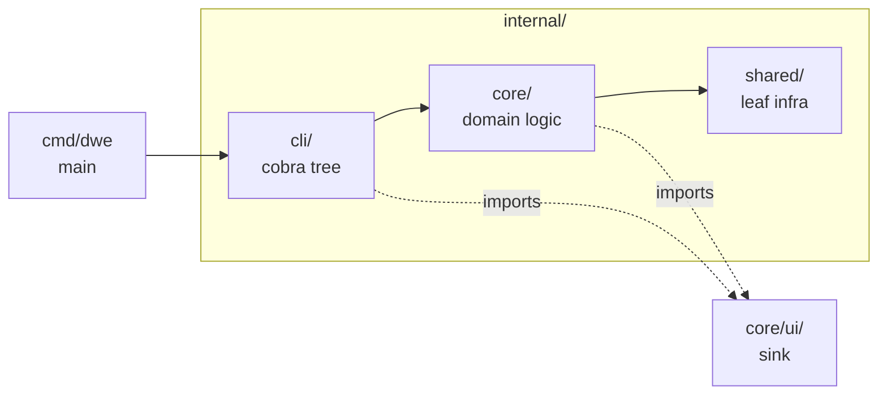

# Internal Architecture

How the DWE CLI is put together inside the binary: a single Go process with a three-layer internal structure, embedded docs and translations, and no network calls on the normal path. This is the contributor-facing companion to the user-facing [Architecture](../reference/concepts/architecture.md) page (which is the DWE ↔ Docker boundary view). For per-package responsibilities, invariants, and cross-package contracts, see [`packages.md`](packages.md).

## Contents

- [Single binary, single composition root](#single-binary-single-composition-root)
- [Three internal layers](#three-internal-layers)
- [Cobra command tree](#cobra-command-tree)
- [Embedded docs and translations](#embedded-docs-and-translations)
- [No network on the normal path](#no-network-on-the-normal-path)
- [Where to go next](#where-to-go-next)

## Single binary, single composition root

DWE ships as one statically linked Go binary at `bin/dwe`. There is no plugin loader, no companion daemon, and no external runtime besides the host Docker engine.

Process startup goes through a single composition root:

1. `cmd/dwe/main.go` is the executable entrypoint.
2. It detects the fast `dwe prompt` path before cobra runs and dispatches into `internal/shared/prompt` for shell prompts.
3. For every other invocation it calls `cli.NewRootCmdWithFlags()`, which builds the entire cobra command tree.
4. It hands the tree to `fang.Execute` with a custom error handler that suppresses output for `pipeline.ErrSilent`, honours `ExitCode()`-bearing errors, and emits a JSON envelope to stderr when `--output json` is set.
5. On exit the handler translates the returned error to a process exit code via `cmdctx.ExitCodeFor`.

The composition root in `internal/cli/root.go` registers commands into five groups (`core`, `environment`, `configuration`, `pipelines`, `advanced`) and wires the shared `*cmdctx.RootFlags` bundle into every subcommand. There is no global state, no `init()` registration of commands from sibling packages; every command is added explicitly in `NewRootCmdWithFlags`.

## Three internal layers

`internal/` is organized in three layers. The intended dependency rules are enforced by convention today; `depguard` activation is pending. The full inventory lives in [`packages.md`](packages.md).



| Layer | Path | Role | Dependency rule |
|-------|------|------|------|
| CLI | `internal/cli/` | Cobra commands, flag parsing, I/O routing. No domain logic. | May import `core/` and `shared/`. |
| Core | `internal/core/` | Domain logic: project model, pipelines, workflows, validation, docs. | May import `shared/`. Must not import `cli/`. |
| Shared | `internal/shared/` | Leaf infrastructure: Docker, Git, locks, templates, i18n. | Must not import `cli/` or `core/`. |

`core/ui/` is a special sink: any `core/` package that wants to render to the terminal exposes a string-returning function, and only `cli/` imports `core/ui/`. The same rule keeps the `stack/` collectors and `render/` renderers from holding writers — the cli layer is the single writer to stdout and stderr.

Inside `core/` there is a soft ordering: `project ← execution ← workflow`. A package defining "what is a project" lives in `project/`; a package that runs a pipeline lives in `execution/`; a package that names a user operation lives in `workflow/`.

## Cobra command tree

The cobra tree has one shape per command subpackage. Every subpackage under `internal/cli/<name>/` exports `NewCmd(groupID string, flags *cmdctx.RootFlags) *cobra.Command`, and the root calls it once. Three variants exist:

- Standard: a single `NewCmd` entry point (`info`, `status`, `logs`, `validate`, `render`, `service`, `snapshot`, `deploy`, `docker`, `compose`, `docs`, `command`, `shell`).
- Multi-export Go-domain grouping: `lifecycle/` exposes `NewRunCmd` / `NewStopCmd` / `NewRestartCmd` / `NewResetCmd` because the four commands share a `preflightRun` test seam and the lock pattern, even though they are independent top-level commands.
- Special: `completion/` exposes `AttachInstallUninstall(parent, flags)` because its subcommands attach to cobra's auto-generated `completion` command.

The root's `PersistentPreRunE` does five things before any `RunE` runs:

1. Validates `--output` (`text` or `json`) and rejects `--pretty` without JSON.
2. Sets `NO_COLOR=1`, `SilenceErrors`, and `SilenceUsage` in JSON mode.
3. Locates the project. `validate` and its descendants use `project.Locate` (no schema check) so schema errors surface as diagnostics; every other command uses `project.Resolve` (schema check). A small allowlist (`version`, `prompt`, `completion …`, `docs …`) is allowed to run without a project.
4. Loads `workspace/styles.yml` and applies the palette to `core/ui/styles`.
5. Resolves the locale via `i18n.ResolveLocale` and loads the i18n store.

Two cross-cutting patterns flow through `cmdctx.RootFlags`:

- JSON output mode: read-only commands dispatch via `cmdctx.WriteData[T]` for text vs JSON. Errors flow through `cmdctx.Err` / `cmdctx.ErrWrap` and serialize to `{"error":{code,message,hint,details}}` on stderr. `validate` is the exception: it emits diagnostics-as-data even at severity=error, with the exit code conveying severity.
- Display-string localization: any call site that renders a user-command description, parameter description, group name, or doc-generator header uses the typed `store.*` helpers (`store.CommandDescription`, `store.ParamDescription`, …) and threads the locale through `rflags.I18n`. Storage and hashing sites stay English.

Cobra's hidden `__complete` path bypasses `PersistentPreRunE`. Every `ValidArgsFunction` callback calls `cmdctx.CompletionConfigPath(flags, cmd)` first and returns empty completions + `cobra.ShellCompDirectiveNoFileComp` on error, so a stale or broken config never crashes the shell completion path.

## Embedded docs and translations

Documentation is embedded in the binary. The build step `scripts/sync-embedded-docs.sh` mirrors `docs/{reference,internals,i18n}` into `internal/core/docs/embedded/`, and the package uses `//go:embed embedded` to make it part of the binary at compile time.

The runtime layout is straightforward:

```text
embedded/
├── reference/   # user-facing schema and command reference
├── internals/   # contributor-facing internal docs
└── i18n/<lang>/ # mirrored translated trees
```

Three properties matter:

- `BuiltinFS` is `fs.Sub(embedFS, "embedded")`, so callers see `reference/`, `internals/`, and `i18n/` at the root.
- Content hashes for every file are baked into `internal/core/docs/content_hashes_gen.go` by `scripts/gen-docs-content-hashes.sh` at build time. The hash is the per-file freshness anchor.
- Each translated file starts with `> Translated from: <relPath> @ <hash>`. `internal/core/docs/lang.go` parses the header, compares the hash against `ContentHashFor(relPath)`, and surfaces a staleness warning when they diverge.

`dwe docs` reads from `BuiltinFS` only — no filesystem walk under the project root, no remote fetch. The subsystem is read-only: no lock acquisition, no preflight, and locale resolution uses `i18n.ResolveLocale(flagLang, cfgLang, sysLang)` directly (the cobra-clamped `rflags.Locale` is the wrong namespace for markdown).

`dwe docs llms-txt` emits a compact AI-agent index that combines the embedded docs with project-aware data (services, commands, info) collected in the cli layer. The generator itself stays config-import-free.

## No network on the normal path

DWE does not phone home, fetch updates, or pull templates over the network on a normal invocation. Every behavior the CLI drives is local:

- Project discovery walks upward from the working directory.
- Config is YAML on disk under `workspace.yml` and `workspace/`.
- Templates, validators, and pipelines are evaluated in-process.
- Docs and translations are embedded.
- Container orchestration shells out to local `docker` and `docker compose`.
- Git interaction shells out to local `git`.

The only network traffic the CLI initiates is whatever the user explicitly asks for inside a pipeline step or a user command — for example, a `type: shell` step that calls `curl`, a `type: builtin` step that probes `tcp_reachable`, or a Git hook that pushes. The CLI itself does not open sockets on the normal path.

This makes DWE safe to run on disconnected machines, easy to reason about in CI, and predictable under restricted egress policies.

## Where to go next

- [`packages.md`](packages.md) — per-package responsibilities, invariants, and cross-package contracts. The exhaustive companion to this overview.
- [Architecture (user-facing)](../reference/concepts/architecture.md) — the DWE ↔ Docker boundary view: what DWE owns vs what Docker owns.
- [Project layout](../reference/concepts/project-layout.md) — what each folder under `workspace/` is for, and what gets generated under `.dwe/`.
- [Pipelines](../reference/concepts/pipelines.md) — the phase / step / condition execution model that deploy, reset, and lifecycle share.
