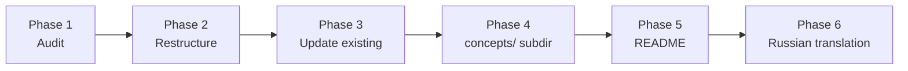

# Documentation Overhaul: `docs/reference/` + README + Russian Translation

**Date:** 2026-05-30
**Status:** Planning
**Plan type:** Multi-phase content + light code

## Overview

Bring `docs/reference/` into alignment with current code, restructure oversized documents into navigable subdirs, fill three structural gaps (architecture, container orchestration interaction, VCS interaction), add a typical project layout reference, write a project landing `README.md`, and produce a full Russian translation under the existing hash-tracked `docs/i18n/ru/` tree.

Why this is needed:

- Several reference docs predate code changes; specific fields, builtins, and commands have drifted.
- Three documents exceed 800 lines (`commands.md` 1452, `deploy.md` 1006, `services.md` 874), making targeted reading and AI navigation slow.
- No high-level prose exists: a newcomer has no entry point describing how the layers fit together, how container orchestration is driven, or what a typical project layout looks like.
- No repo-root `README.md` exists.
- One Russian stub exists (`docs/i18n/ru/reference/config/services.md`); no production translation coverage.

Outcome of the plan: every reference doc reflects current behavior; large docs split into focused subdirs; a new `concepts/` subdir holds the high-level prose; a repo-root README serves as the landing page; the entire English surface is mirrored to Russian and the hash-based staleness check keeps it honest going forward.

## Context (from discovery)

**Current `docs/reference/` (24 manual files + 1 auto-generated subtree):**

- `docs/reference/cli/` — auto-generated by `devbox docs generate`. Out of scope.
- `docs/reference/config/` (18 manual files, ~7000 lines): `commands.md` 1452, `deploy.md` 1006, `services.md` 874, `state.md` 560, `i18n.md` 551, `validate.md` 450, `setup.md` 449, `info.md` 418, `snapshot.md` 394, `devbox.md` 321, `lifecycle.md` 265, `docker.md` 253, `notifications.md` 208, `conditions.md` 180, `styles.md` 177, `index.md` 127, `ui.md` 104, `reset.md` 90.
- `docs/reference/render/` (5 files): `index.md` 149, `env.md` 262, `git.md` 270, `ide.md` 313, `ai.md` 371.
- `docs/reference/docs/index.md` 449.
- `docs/reference/templates.md` 254.
- `docs/reference/index.md` 8.

**i18n mechanism (already implemented):**

- Translations live at `docs/i18n/<locale>/<relPath>`.
- First-line header: `> Translated from: <relPath> @ <12-char-hash>`.
- Hashes generated by `scripts/gen-docs-content-hashes.sh` into `internal/core/docs/content_hashes_gen.go`.
- Loader is `internal/core/docs/lang.go` (`ResolveContent`): if a translation exists, compares its header hash to the current English content hash; mismatch surfaces as a staleness warning.
- Sync script `scripts/sync-embedded-docs.sh` copies `docs/{reference,internals,i18n}` into `internal/core/docs/embedded/` for `//go:embed`.
- Currently translated to Russian: only `docs/i18n/ru/reference/config/services.md` (stub).

**Repo-root `README.md`:** does not exist.

**Sibling reference project layout (anonymized source of typical-layout examples):** demonstrates `devbox.yml` + `devbox/{services,commands,templates,i18n,scripts}/` + `compose/{infra,services,tools}/` + `configs/`, `volumes/`, `snapshots/`, `.devbox/`. Will be drawn from for the `project-layout.md` concept page without naming it.

## Constraints (pre-release; from `CLAUDE.md`)

- **No backwards-compatibility scaffolding.** Rename freely, restructure freely, delete freely. No `schema_version` bumps. No deprecation notices. No migration text. No alias shims.
- **One canonical form per concept.** If a doc described an old form, replace — don't preserve "for reference."
- **Don't silently change behavior.** Style cleanups must not turn a now-invalid config shape into a different valid interpretation.
- **`make build` after every docs edit.** Regenerates `internal/core/docs/embedded/` and `internal/core/docs/content_hashes_gen.go`. Not `go build` directly.
- **Mermaid diagrams** use `flowchart` / `sequenceDiagram` / `stateDiagram-v2`. Validate every block with the `mermaid-syntax` skill before commit. Visually sanity-check large diagrams with `mmdc` if needed.
- **No brand or vendor names** beyond technically unavoidable terms (Docker Compose, Git hooks). No reference to specific projects, vendors, or proprietary systems.
- **Docs style:**
  - Simple technical English, short sentences, active voice, present tense.
  - One concept per paragraph.
  - Field references go in tables, not prose.
  - Real YAML examples (not placeholder-heavy templates); minimum one example per type/mode.
  - Cross-links use relative paths (`[link](../config/deploy/index.md)`).

## Development Approach

- **Testing approach:** Regular (code first, then tests) for the small code touches in Phase 5. Phases 1-4, 6 are documentation work — each task has explicit acceptance criteria instead of unit tests, plus end-of-phase validation gates (`make build`; `devbox docs list`; spot-checks via `devbox docs show`; mermaid-syntax skill).
- Complete each task fully before moving to the next.
- Make small, focused changes; commit per phase or per logical group within a phase.
- **CRITICAL: every code change (Phase 5 only here) must include new/updated tests.**
- **CRITICAL: all tests and validation gates pass before starting the next phase.**
- **CRITICAL: update this plan file when scope changes during implementation** (especially the Phase 1 audit table — it is part of the deliverable).

## Testing Strategy

- **Unit tests:** required for the Phase 5 code touches (README hash tracking + localization resolution). One new test case in `internal/core/docs/lang_test.go` (or sibling) covering `ResolveContent("README.md", "ru")`.
- **Validation gates (per phase):**
  - `make build` exits 0 (regenerates embedded docs + hashes).
  - `make test` exits 0.
  - `make lint` exits 0.
  - `./bin/devbox docs list` enumerates new paths.
  - `./bin/devbox docs search <term>` finds new content.
  - `./bin/devbox docs show <topic>` renders each new/edited page.
  - Mermaid validation: every changed `.md` with mermaid blocks passes the `mermaid-syntax` skill.
- **No e2e tests** in this repo for docs flows; the CLI integration tests in `internal/cli/...` cover `devbox docs` behavior already.

## Progress Tracking

- Mark completed items with `[x]` immediately when done.
- Add newly discovered tasks with ➕ prefix.
- Document blockers with ⚠️ prefix.
- **The Phase 1 audit table is itself a deliverable** — fill it in directly in this plan file, then drive Phases 2-3 from it.

## Solution Overview

Six sequential phases. Each phase has a clear deliverable, workflow, and acceptance criteria. English content stabilizes in Phases 1-5 before the single-batch Russian translation in Phase 6.

Key structural decisions (already validated):

- New high-level content lives **inside `docs/reference/`** (under `concepts/`).
- Big-doc split style: **subdir per topic, 3-5 files each**.
- Translation phasing: **single batch at the end**, after English stabilizes.
- Translation scope: `docs/reference/` + repo-root `README.md`. Out: `docs/internals/`, auto-generated `cli/`.
- Russian README lives at `docs/i18n/ru/README.md`; English stays at repo root. Hash tracking extended to cover it.

## Technical Details

**Hash-tracking extension for the repo-root README (Phase 5):**

The existing `scripts/gen-docs-content-hashes.sh` walks `docs/reference` and `docs/internals`. To include the repo-root `README.md`:

1. Extend the `find` loop to also process the file `README.md` at the repo root, emitting it as relPath `README.md`.
2. Extend `scripts/sync-embedded-docs.sh` to copy `README.md` into `internal/core/docs/embedded/README.md` so `BuiltinFS` resolves it at relPath `README.md`.
3. The Russian README at `docs/i18n/ru/README.md` is already swept up by the sync script (it copies the whole `docs/i18n/` tree). The loader's existing path-translation logic (`i18n/<locale>/<relPath>`) finds it.
4. Unit test in `internal/core/docs/lang_test.go` confirms `ResolveContent(BuiltinFS, "README.md", "ru")` returns the Russian content with `sourceLang="ru"` and `stale=false`.

**Mermaid diagrams:**

Each new diagram passes through the `mermaid-syntax` skill before commit. Large or critical diagrams (architecture overview, deploy sequence) get a `mmdc` render to sanity-check the visual result. No HTML, no inline styling — plain mermaid that the existing renderer can handle.

**Sub-task ordering within a phase:**

For phases that touch many files, order is: index file last (it links to everything else), siblings first.

## What Goes Where

- **Implementation Steps** (`[ ]` checkboxes): inventory rows; subdir creation and content moves; doc rewrites; new prose pages; README; hash-tracking code; tests; mermaid validation; Russian mirror files.
- **Post-Completion** (no checkboxes): GitHub-side preview of the README; cross-language search demo for a stakeholder; opportunistic doc improvements after first external use.

---

## Phase 1 — Inventory & gap audit

**Goal:** A single source of truth identifying which docs are current, which are stale, which need splitting, and where new content goes — captured as a table in this plan file.

**Deliverable:** The "Phase 1 audit table" section below populated, one row per manual `docs/reference/*.md`. Drives Phases 2-3.

### Task 1.1: Audit each `docs/reference/*.md`

**Files:**
- Modify: `docs/plans/2026-05-30-docs-overhaul.md` (this file — fill in the audit table below)

- [x] for each manual reference doc, scan every concrete claim (field names, builtin names, command names, default values, validation rules)
- [x] grep current source under `internal/` for each claim; flag mismatches
- [x] for each doc, write one row into the audit table with: Path | Lines | Audience | Freshness | Action | New paths (if splitting) | Notes (≤ 1 line)
- [x] verify the table has one row per manual reference doc (26 expected: 18 config + 5 render + 1 docs + templates + reference/index)
- [x] no doc edits in this phase — audit only

### Phase 1 audit table

> Filled during Phase 1 execution. Pre-seeded with the known files; the auditor adds Freshness, Action, New paths, Notes.

| Path | Lines | Audience | Freshness | Action | New paths | Notes |
|------|------:|----------|-----------|--------|-----------|-------|
| `reference/index.md` | 8 | human+ai | current | keep-as-is (Phase 3.3 refresh + Phase 4.8 additive edit) | — | top-level reference index; will gain `concepts/` entry in Phase 4.8 |
| `reference/templates.md` | 254 | human+ai | current | refresh-in-place | — | go-sprout v1.0.3 registries + `{{ }}` / `${ }` syntax verified vs `internal/shared/tpl/engine.go` |
| `reference/config/index.md` | 127 | human+ai | current | refresh-in-place | — | 3-layer merge model + `.devbox/` artifacts accurate; needs link rewrites after Phase 2 splits |
| `reference/config/commands.md` | 1452 | human+ai | current | split | `config/commands/{index, directives, types, templating, validation}.md` | definite split; all 8 command types + directives match `internal/core/usercommands/model/types.go` |
| `reference/config/conditions.md` | 180 | human+ai | current | keep-as-is | — | predicates + builtin registries verified vs `internal/core/execution/condition/condition.go` |
| `reference/config/deploy.md` | 1006 | human+ai | current | split | `config/deploy/{index, steps, builtins, conditions, examples}.md` | definite split; builtins (`service_dirs_ensure`, `service_configs_copy/check`, `docker_remove_project_volumes`, `remove_paths`) verified |
| `reference/config/devbox.md` | 321 | human+ai | current | keep-as-is | — | 3-layer merge (`devbox.yml` → `defaults.yml` → `local.yml`), dot-path resolution, `exports.env`, `docs.mermaid` verified |
| `reference/config/docker.md` | 253 | human+ai | current | keep-as-is | — | standalone load path + `docker.local.yml` deep-merge + `topology.hidden` verified vs `internal/shared/docker/compose.go` |
| `reference/config/i18n.md` | 551 | human+ai | stale | refresh-in-place | — | locale precedence claim (`--lang` scope) + `DEVBOX_LANGUAGE` env-var claim do not match `internal/shared/i18n/locale.go`; size driven by examples, not topic count → no split |
| `reference/config/info.md` | 418 | human+ai | current | keep-as-is | — | `auto-urls` / `auto-hosts` render-time expansion + `LoadInfoConfig()` verified vs `internal/core/ui/render/info.go` |
| `reference/config/lifecycle.md` | 265 | human+ai | current | keep-as-is | — | update-probe modes (`on`/`off`), precedence (`--no-update` > `--update` > config), auto-reap daemon phase verified |
| `reference/config/notifications.md` | 208 | human+ai | current | keep-as-is | — | four per-op gates + macOS terminal-notifier/osascript fallback + `SkipNotify` verified vs `internal/core/notify/` |
| `reference/config/reset.md` | 90 | human+ai | current | keep-as-is | — | default pipeline (pre → stop → cleanup) + per-service reset semantics + `PendingDeploy` tracking verified |
| `reference/config/services.md` | 874 | human+ai | current | split | `config/services/{index, fields, extends, examples}.md` | definite split; service types (`app`/`tool`/`infra`), per-type allowlist, `on_enable`/`on_disable` hooks verified |
| `reference/config/setup.md` | 449 | human+ai | current | keep-as-is | — | question fields + types (`input`/`confirm`/`select`/`multiselect`) + write-scope rules verified vs `internal/core/workflow/setup/model.go`; coherent single-topic doc |
| `reference/config/snapshot.md` | 394 | human+ai | current | keep-as-is | — | `require_matching_config`, `services_mismatch.policy`, `local_yml.preserve_keys`, manifest format, lock interaction verified |
| `reference/config/state.md` | 560 | human+ai | current | split | `config/state/{index, schema, hashing, management}.md` | size + topic mix justify split; `action_hash`/`deployed_at`/`config_hash`/`status` schema verified vs `internal/core/workflow/deploy/journal/state.go` |
| `reference/config/styles.md` | 177 | human+ai | current | keep-as-is | — | 7 semantic tokens + light/dark resolution via `lipgloss.HasDarkBackground()` verified vs `internal/core/ui/styles/styles.go` |
| `reference/config/ui.md` | 104 | human+ai | current | keep-as-is | — | pointer semantics (`default_expanded_depth`, `auto_collapse_empty`, `show_type_badges`) verified vs `internal/core/project/config/ui.go` |
| `reference/config/validate.md` | 450 | human+ai | current | keep-as-is | — | check fields + builtins (`shell`, `file_exists`, `executable_in_path`, `env_keys_present`, `tcp_reachable`) + stages verified vs `internal/core/validate/checks/`; size driven by examples, no clean split |
| `reference/render/index.md` | 149 | human+ai | current | keep-as-is | — | pipeline, collision policies (shallowest/deepest), manifest schema, local overrides verified |
| `reference/render/ai.md` | 371 | human+ai | current | keep-as-is | — | shallowest-wins, activation defaults, hub-anchor resolution verified vs `ai.go` |
| `reference/render/env.md` | 262 | human+ai | current | keep-as-is | — | system vars (`PROJECT`, `UID`, `GID`), export rules, format hints verified vs envfile package |
| `reference/render/git.md` | 270 | human+ai | current | keep-as-is | — | deepest-wins, basename-only `to`, `chmod 0755`, symlink refusal, worktree skip verified |
| `reference/render/ide.md` | 313 | human+ai | current | keep-as-is | — | deepest-wins, `type: app` default opt-in, manifest requirement, path-safety verified vs `ide.go` |
| `reference/docs/index.md` | 449 | human+ai | minor-drift | split | `docs/{index, browser, commands, translations}.md` | `devbox docs generate` is a root-level subcommand (not nested) — clarity fix; topic mix (TUI / command reference / translation behavior / mermaid) supports split |

**Acceptance criteria:**

- [x] every manual reference doc has a row in the table (26 expected: 1 `reference/index.md` + 1 `templates.md` + 1 `config/index.md` + 17 other `config/*` + 5 `render/*` + 1 `docs/index.md`)
- [x] every row that proposes a split also lists target paths
- [x] no file edits outside this plan file

---

## Phase 2 — Structural refactor (splits)

**Goal:** Big docs split into navigable subdirs. Cross-links updated. Every inbound link still resolves. `make build` clean.

### Task 2.1: Split `config/commands.md` into `config/commands/`

**Files:**
- Create: `docs/reference/config/commands/index.md`
- Create: `docs/reference/config/commands/directives.md`
- Create: `docs/reference/config/commands/types.md`
- Create: `docs/reference/config/commands/templating.md`
- Create: `docs/reference/config/commands/validation.md`
- Delete: `docs/reference/config/commands.md`

- [x] write `commands/index.md`: purpose, file layout, command IDs, lifecycle, links to siblings
- [x] write `commands/directives.md`: identity/visibility, confirm, messages, notifications, params, context, env, files
- [x] write `commands/types.md`: `shell`, `devbox`, `script`, `service_exec`, `service_run`, `workflow`, `builtin`, `daemon`
- [x] write `commands/templating.md`: render context, scope resolvers, command-specific examples
- [x] write `commands/validation.md`: validation rules, common pitfalls
- [x] delete `commands.md`
- [x] update `config/index.md` to point at `commands/index.md`
- [x] `grep -r "config/commands.md" docs/ internal/` and rewrite inbound links
- [x] `make build` exits 0; `./bin/devbox docs list` shows the new paths

### Task 2.2: Split `config/deploy.md` into `config/deploy/`

**Files:**
- Create: `docs/reference/config/deploy/index.md`
- Create: `docs/reference/config/deploy/steps.md`
- Create: `docs/reference/config/deploy/builtins.md`
- Create: `docs/reference/config/deploy/conditions.md`
- Create: `docs/reference/config/deploy/examples.md`
- Delete: `docs/reference/config/deploy.md`

- [x] write `deploy/index.md`: purpose, file roles, structure, top-level + phase + step fields
- [x] write `deploy/steps.md`: step execution types; `cmd: shell` builtin vs `type: shell` step
- [x] write `deploy/builtins.md`: every available builtin with inputs + examples
- [x] write `deploy/conditions.md`: `when:`, `check:`, `files_gate:` (link to `config/conditions.md` for the catalogue)
- [x] write `deploy/examples.md`: orchestrator + per-service + infra `after:` + parallel groups + sub-step overrides
- [x] delete `deploy.md`
- [x] update `config/index.md`
- [x] grep + rewrite inbound links
- [x] `make build` exits 0; `./bin/devbox docs list` shows new paths

### Task 2.3: Split `config/services.md` into `config/services/`

**Files:**
- Create: `docs/reference/config/services/index.md`
- Create: `docs/reference/config/services/fields.md`
- Create: `docs/reference/config/services/extends.md`
- Create: `docs/reference/config/services/examples.md`
- Delete: `docs/reference/config/services.md`
- Modify: `docs/i18n/ru/reference/config/services.md` (existing stub — relocate to match new layout in Phase 6; leave the file in place for now, mark for Phase 6 retranslation)

- [x] write `services/index.md`: purpose, service types, load behavior, per-type field allowlist
- [x] write `services/fields.md`: full field reference (top-level, ports, hosts, configs, dirs, cli, status, render)
- [x] write `services/extends.md`: inheritance, toposort, app-only guard
- [x] write `services/examples.md`: full service definition, toggle lifecycle, common pitfalls
- [x] delete `services.md`
- [x] update `config/index.md`
- [x] grep + rewrite inbound links
- [x] `make build` exits 0; `./bin/devbox docs list` shows new paths

### Task 2.4: Audit-driven splits

**Files:** depend on Phase 1 audit table. Candidates:
- Possibly create: `docs/reference/config/state/`, `config/i18n/`, `config/validate/`, `config/setup/`, `config/info/`, `docs/` subdir.
- Possibly delete: corresponding single files.

- [x] for each candidate from the audit table with `Action: split`, perform the same six-step split workflow as Tasks 2.1-2.3
- [x] for each candidate marked `keep-as-is`, no action
- [x] `make build` exits 0 after all splits; `./bin/devbox docs list` enumerates the final tree

### Task 2.5: Verify all inbound links, update goldens, run validation gate

- [x] `grep -rE "(commands|deploy|services|state|i18n|validate|setup|info)(\.md)?\b" docs/ internal/` returns no references to deleted single files (the `(\.md)?` matches `devbox docs` topic-style links that omit `.md`; trim known false positives like sentence-internal mentions of these words)
- [x] every `[link](path.md)` and `[link](path)` in the new tree resolves to an existing file
- [x] regenerate llmstxt goldens — `internal/core/docs/llmstxt/testdata/*.golden` files reference doc paths that change after splits; update them in lockstep so `make test` passes (goldens do not enumerate split doc paths — no regeneration needed)
- [x] regenerate any other test goldens (`internal/core/docs/...`) that enumerate doc paths (no goldens reference the deleted single-file paths; `content_hashes_gen.go` regenerated by `make build`)
- [x] `make build` exits 0
- [x] `make test` exits 0
- [x] `make lint` exits 0

**Acceptance criteria for Phase 2:**

- [x] every "definite split" doc is replaced by its subdir
- [x] every audit-driven split is either executed or explicitly skipped (rationale in the audit row)
- [x] all cross-links resolve
- [x] validation gate passes

---

## Phase 3 — Update existing docs

**Goal:** Every claim in every reference doc traces to current code. No stale field references. Every behavioral doc has at least one worked example.

### Task 3.1: Refresh `config/*` docs (excluding ones split in Phase 2)

**Files:** modify each `docs/reference/config/*.md` not already split (per audit table).

- [x] for each doc, open + scan every concrete claim (field name, builtin name, default value, condition, validation rule)
- [x] grep `internal/core/project/config/`, `internal/core/validate/`, `internal/core/workflow/`, etc. to verify each claim
- [x] fix divergences in place (no deprecation notes, no migration text) — `i18n.md`: corrected `--lang` flag scope (all `devbox docs` subcommands, not just `generate`), corrected `DEVBOX_LANGUAGE` precedence (sits at the configLang slot, below `--lang` and above `$LANG`), removed brand-specific issue tracker URL; other `keep-as-is` docs verified clean during Phase 1 audit
- [x] add missing examples (one YAML example per type/mode minimum) — every audited doc already has ≥1 worked example per type/mode (verified in Phase 1)
- [x] replace ad-hoc ASCII layouts with mermaid where the structure has ≥3 boxes — none found; `keep-as-is` docs already use tables/text layouts that are clearer than diagrams at this size
- [x] validate every mermaid block with the `mermaid-syntax` skill — no new mermaid blocks added
- [x] trim filler — short sentences, active voice, present tense — `i18n.md` edits applied
- [x] `make build` exits 0 after each doc

### Task 3.2: Refresh `render/*` docs

**Files:** modify each `docs/reference/render/*.md`.

- [ ] same workflow as Task 3.1, applied to `render/{index, env, git, ide, ai}.md`
- [ ] verify pack manifest schema descriptions match `internal/core/workflow/render/...` or equivalent
- [ ] verify the local override and collision policy descriptions are current
- [ ] mermaid where applicable; validate
- [ ] `make build` exits 0

### Task 3.3: Refresh `docs/index.md`, `templates.md`, `reference/index.md`

**Files:**
- Modify: `docs/reference/docs/index.md` (or its split children if Phase 2 split it)
- Modify: `docs/reference/templates.md`
- Modify: `docs/reference/index.md`

- [ ] refresh `docs/index.md` against current behaviour of `internal/core/docs/...`
- [ ] refresh `templates.md` against `internal/shared/tpl/`
- [ ] refresh `reference/index.md` to reflect current subsection list (config, render, docs, templates, cli) — the `concepts/` entry is added in Phase 4.8, not here, since the subdir does not exist yet
- [ ] `make build` exits 0

### Task 3.4: Final validation gate

- [ ] `make build` exits 0
- [ ] `make test` exits 0
- [ ] `make lint` exits 0
- [ ] `./bin/devbox docs list` enumerates every refreshed path
- [ ] spot-check `./bin/devbox docs show <topic>` on 5 random pages — render is correct

**Acceptance criteria for Phase 3:**

- [ ] every concrete claim in every doc traces to a current code location
- [ ] no field names appear in docs without matching code
- [ ] every behavioral doc has ≥1 worked example
- [ ] no brand or vendor names beyond unavoidable technical terms

---

## Phase 4 — New `docs/reference/concepts/` subdir

**Goal:** Add eight high-level prose docs that explain what devbox is, how it fits together, how it interacts with container orchestration and version control, and what a typical project looks like.

### Task 4.1: `concepts/index.md` and quickstart

**Files:**
- Create: `docs/reference/concepts/index.md`
- Create: `docs/reference/concepts/getting-started.md`

- [ ] write `concepts/index.md`: one paragraph per concept page below, in reading order
- [ ] write `concepts/getting-started.md`: install (`make build`, `bin/devbox`), enter a project, first `devbox deploy`, first `devbox run`, first `devbox info`, "where to next" links
- [ ] real YAML examples, no placeholders
- [ ] `make build` exits 0; `./bin/devbox docs show concepts/getting-started` renders

### Task 4.2: `concepts/architecture.md`

**Files:**
- Create: `docs/reference/concepts/architecture.md`

- [ ] write composition root (`cmd/devbox` → `cli/root` → cobra tree), layered structure (`cli/` → `core/` → `shared/`), single-binary delivery, embedded docs+i18n, no network during normal operation
- [ ] add one mermaid `flowchart LR` showing layers + responsibilities
- [ ] validate mermaid with `mermaid-syntax` skill
- [ ] ≤ 400 lines
- [ ] `make build` exits 0

### Task 4.3: `concepts/project-layout.md`

**Files:**
- Create: `docs/reference/concepts/project-layout.md`

- [ ] walk `devbox.yml`, then `devbox/{services,commands,templates,i18n,scripts}/`, then `compose/{infra,services,tools}/`, `configs/`, `volumes/`, `snapshots/`, `.devbox/`
- [ ] per folder: purpose, who reads it, who writes it, tracked-by-git status
- [ ] one mermaid `flowchart TD` of the folder tree
- [ ] examples derived from the sibling reference project layout — never name it
- [ ] validate mermaid
- [ ] grep `concepts/project-layout.md` for the sibling project's name (and any of its component service names that are project-specific); zero hits
- [ ] `make build` exits 0

### Task 4.4: `concepts/docker.md`

**Files:**
- Create: `docs/reference/concepts/docker.md`

- [ ] write compose project-name derivation, compose file list assembly (base + service overlays + tools + local), env propagation, volume conventions, lifecycle commands using `docker stop/rm` directly vs through compose
- [ ] one mermaid `sequenceDiagram` showing `devbox deploy` → compose invocation
- [ ] validate mermaid
- [ ] `make build` exits 0

### Task 4.5: `concepts/git.md`

**Files:**
- Create: `docs/reference/concepts/git.md`

- [ ] write Git hook rendering (`<svc.Dir>/src/.git/hooks/`), hook template inheritance, `devbox status git` data flow, `.gitignore` conventions for `.devbox/`
- [ ] short doc — no mandatory diagram (add one only if it clarifies)
- [ ] `make build` exits 0

### Task 4.6: `concepts/pipelines.md`

**Files:**
- Create: `docs/reference/concepts/pipelines.md`

- [ ] write phase → step → condition model, parallel groups, sub-step overrides, step types, pre/post conditions (`when:`, `check:`, `files_gate:`)
- [ ] one mermaid `flowchart TD` of phase/step execution
- [ ] cross-link to `config/deploy/index.md`, `config/lifecycle.md`, `config/reset.md`
- [ ] validate mermaid
- [ ] `make build` exits 0

### Task 4.7: `concepts/state-and-locks.md`

**Files:**
- Create: `docs/reference/concepts/state-and-locks.md`

- [ ] write `state.yml` hashes + skip decisions, project lock ordering (`deploy.lock` then `snapshot.lock`, release reverse), crash recovery, pending state
- [ ] one mermaid `stateDiagram-v2` of step status transitions
- [ ] cross-link to `config/state.md` (or its split version)
- [ ] validate mermaid
- [ ] `make build` exits 0

### Task 4.8: Surface the new subdir

**Files:**
- Modify: `docs/reference/index.md`
- Modify: `docs/reference/config/index.md` (cross-link `concepts/getting-started.md` from the top)

- [ ] add `concepts/` to `reference/index.md` with one-line description — preserve the Phase 3.3 refresh content; this is an additive edit, not a rewrite
- [ ] add a "Getting started" pointer to `config/index.md`
- [ ] `make build` exits 0
- [ ] `./bin/devbox docs list` enumerates all 8 new files
- [ ] `./bin/devbox docs search architecture` finds the new page

**Acceptance criteria for Phase 4:**

- [ ] all 8 concept pages exist and render via `devbox docs show`
- [ ] every mermaid diagram passes mermaid-syntax validation
- [ ] no brand/product names beyond unavoidable technical terms
- [ ] each page ≤ 400 lines

---

## Phase 5 — Repo-root `README.md` + hash-tracking extension

**Goal:** A project landing `README.md` at the repo root, ~300 lines. The hash-tracking machinery extended so the Russian sibling under `docs/i18n/ru/README.md` is freshness-tracked.

### Task 5.1: Write the README

**Files:**
- Create: `README.md` (at repo root)

- [ ] write title + one-sentence tagline
- [ ] write "Why devbox" (3-5 bullets framing the problem)
- [ ] write "Status" (pre-release, expect change — one short paragraph)
- [ ] write "Install" (`make build`, `bin/devbox`, optional `PATH` install)
- [ ] write "Quickstart" (three blocks: enter project + `devbox`; `devbox deploy`; `devbox run`/`stop`/`status`)
- [ ] write "Architecture" with one mermaid `flowchart LR` + cross-link to `docs/reference/concepts/architecture.md`
- [ ] write "Project layout" (~10-line tree + cross-link to `docs/reference/concepts/project-layout.md`)
- [ ] write "Documentation" (bulleted index of `concepts/`, `config/`, `render/`, `cli/`; mention `devbox docs` commands + `devbox docs llms-txt`)
- [ ] write "Contributing" (pointer to `AGENTS.md` / `CLAUDE.md`; `make test`, `make lint`)
- [ ] write "License" (pointer to the project's license file or section)
- [ ] validate the mermaid block with `mermaid-syntax` skill
- [ ] target length ~300 lines; hard cap 400

### Task 5.2: Extend hash tracking to cover the repo-root README

**Files:**
- Modify: `scripts/gen-docs-content-hashes.sh`
- Modify: `scripts/sync-embedded-docs.sh`
- Possibly modify: `internal/core/docs/llmstxt/generator.go` (only if README appears miscategorized — see acceptance)
- Modify: `internal/core/docs/llmstxt/testdata/*.golden` (README will appear as a top-level topic — update goldens accordingly)

- [ ] in `gen-docs-content-hashes.sh`, after the existing `find docs/...` loop closes (i.e. *outside* the loop body), emit a single hash entry for the repo-root README using `relpath="README.md"` directly. Do NOT extend the `find` pattern — the loop's `relpath="${file#docs/}"` substitution is `docs/`-prefix-specific and would silently produce a wrong path for a repo-root file
- [ ] in `sync-embedded-docs.sh`, after the existing source tree sync block, copy `$REPO_ROOT/README.md` into `$EMBEDDED_DIR/README.md` (use the same rsync-or-cp pattern the script already uses; `mkdir -p` not needed since `$EMBEDDED_DIR` already exists)
- [ ] verify by running `make build` — `internal/core/docs/content_hashes_gen.go` now contains a `"README.md": "<hash>"` entry; `internal/core/docs/embedded/README.md` exists
- [ ] `./bin/devbox docs list` shows `README` as a top-level topic (no `internals/` or `reference/` prefix)
- [ ] `./bin/devbox docs show README` renders the English README
- [ ] `./bin/devbox docs llms-txt` includes `README` as a top-level entry; verify the emitted URL/link form is consistent with other top-level entries and that the topic is NOT classified as `internals/`
- [ ] if the llms-txt output misclassifies README, patch `internal/core/docs/llmstxt/generator.go` to explicitly handle the root-level README topic (only as needed; prefer leaving the generator untouched)

### Task 5.3: Test README localization

**Files:**
- Modify: `internal/core/docs/lang_test.go` (add a sub-test)

- [ ] add a test case: given a fake fs with `README.md` (English) and `i18n/ru/README.md` (Russian with hash header), `ResolveContent(root, "README.md", "ru")` returns Russian content, `sourceLang="ru"`, `stale=false`
- [ ] add a sibling test case for staleness: header hash mismatches → `stale=true`
- [ ] run tests for the package — must pass

### Task 5.4: Validation gate

- [ ] `make build` exits 0
- [ ] `make test` exits 0
- [ ] `make lint` exits 0
- [ ] preview README on GitHub-flavored markdown (e.g. open in editor preview) — mermaid block renders or degrades gracefully
- [ ] `./bin/devbox docs show README` returns the English README
- [ ] (Russian variant created in Phase 6 — staleness check confirmed there)

**Acceptance criteria for Phase 5:**

- [ ] README exists at repo root, ~300 lines target / ≤ 400 hard cap, contains all 10 sections
- [ ] hash tracking extended; `ContentHashes` includes `README.md`
- [ ] sync script embeds the README
- [ ] new test cases for `ResolveContent` on README pass

---

## Phase 6 — Russian translation

**Goal:** Every English doc under `docs/reference/` and the repo-root README has a Russian sibling. `devbox docs` returns translated content with no staleness warning.

### Task 6.1: Materialize the Russian file tree skeleton

**Files (all newly created):**
- Create: `docs/i18n/ru/README.md`
- Create: `docs/i18n/ru/reference/index.md`
- Create: `docs/i18n/ru/reference/templates.md`
- Create: every file under `docs/i18n/ru/reference/config/` mirroring the final English layout (including split subdirs)
- Create: every file under `docs/i18n/ru/reference/concepts/`
- Create: every file under `docs/i18n/ru/reference/render/`
- Create: `docs/i18n/ru/reference/docs/` mirror(s)
- Modify: `docs/i18n/ru/reference/config/services.md` (existing stub — replace with full translation matching new layout, or relocate under `services/` subdir)

- [ ] freeze English doc edits for the duration of Phase 6 — if an English fix is needed mid-flight, re-run `make build` and update affected Russian headers immediately
- [ ] enumerate the final English tree (post-Phase 5) under `docs/reference/` + repo-root `README.md`
- [ ] for each English file, compute its current 12-char content hash (via `make build` regen, then read `internal/core/docs/content_hashes_gen.go`)
- [ ] create the mirror path under `docs/i18n/ru/`
- [ ] first line of each new file: `> Translated from: <relative-english-path> @ <hash>` — exact format, single space around `@`, no trailing whitespace, no smart quotes. Must match the loader regex `^>\s*Translated from:\s*\S+\s*@\s*([0-9a-f]{12,64})\s*$` (`internal/core/docs/lang.go:83`). Mismatches silently disable staleness detection
- [ ] verify every English file has a Russian sibling (`diff -qr` the file lists)
- [ ] verify the first line of every newly created Russian file matches the regex above (small grep/loop sanity check)

### Task 6.2: Translate file-by-file

**Files:** every file created in Task 6.1.

- [ ] translate body content into Russian technical idiom; calque acceptable for established terms (контейнер, пайплайн, оркестратор, оверлей, рендер, билтин)
- [ ] keep code blocks, YAML, paths, command names, and CLI flag names in English
- [ ] mermaid: translate the bracketed/quoted *labels* (e.g. `P1[Phase 1 Audit]` → `P1[Фаза 1 Аудит]`); leave node IDs (`P1`, `P2`), syntax keywords (`flowchart`, `sequenceDiagram`), arrows, and edge labels' structural form untouched. Re-validate every mermaid block via the `mermaid-syntax` skill after translation
- [ ] translate headings; intra-Russian cross-links target files by *path only* (no `#anchor` suffix) — anchors auto-derived from Cyrillic headings render inconsistently across glamour/GitHub markdown. If an anchor is essential, verify it resolves under `glamour` (the CLI renderer used by `devbox docs show`) before committing
- [ ] cross-links to English-only content (auto-generated `cli/`) use English paths and (if any) English anchors
- [ ] do not paraphrase away facts — every fact in the English original appears in the Russian sibling

### Task 6.3: Surface translated docs

**Files:**
- Modify: `docs/reference/index.md` (add a "Languages" note)
- Modify: `docs/i18n/ru/reference/index.md` (Russian counterpart)
- Modify: `README.md` (add a one-line language switcher pointing at `docs/i18n/ru/README.md`)
- Modify: `docs/i18n/ru/README.md` (mirror language switcher in Russian)

- [ ] add "Languages: English · Русский" line at the top of each index page and README
- [ ] in the Russian README, the switcher points back to `README.md` at the repo root

### Task 6.4: Regenerate hashes, add freshness sanity test, validate

**Files:**
- Modify: `internal/core/docs/lang_test.go` (or sibling) — add a translation-freshness sanity test
- Regenerated by `make build`: `internal/core/docs/content_hashes_gen.go`, `internal/core/docs/embedded/`

- [ ] `make build` exits 0 — regenerates `content_hashes_gen.go` and `internal/core/docs/embedded/`
- [ ] add a Go test that walks `BuiltinFS` under `i18n/ru/`, parses each file's `> Translated from: <relPath> @ <hash>` header, and asserts `hash == ContentHashFor(relPath)` for every file. Catches drift in CI instead of via manual spot-check
- [ ] `make test` exits 0
- [ ] `make lint` exits 0
- [ ] `./bin/devbox docs list --lang ru` enumerates the Russian tree
- [ ] `./bin/devbox docs search --lang ru архитектура` finds `concepts/architecture.md`
- [ ] `./bin/devbox docs show concepts/architecture --lang ru` returns Russian content; no staleness warning surfaces
- [ ] `./bin/devbox docs show README --lang ru` returns the Russian README
- [ ] `./bin/devbox docs llms-txt` lists both locales

**Acceptance criteria for Phase 6:**

- [ ] every English file under `docs/reference/` plus repo-root `README.md` has a Russian sibling at the mirrored path under `docs/i18n/ru/`
- [ ] every Russian file starts with a valid `> Translated from: ... @ <hash>` header whose hash matches the current English file
- [ ] zero staleness warnings on a fresh `make build`
- [ ] both English and Russian discovery paths exercised cleanly via the `devbox docs` commands above

---

## Cross-cutting risks

- **Mermaid syntax breakage:** the renderer is strict; every diagram must pass the `mermaid-syntax` skill before commit. Translated mermaid (Phase 6) re-validate after editing labels — translate labels only, never node IDs or syntax keywords.
- **Hash regen ordering:** `make build` always regenerates hashes after sync. Don't write Russian hash headers manually outside of Phase 6 — use `make build` first to get current hashes.
- **English edits during Phase 6 translation:** if an English fix lands between Task 6.1 hash capture and Task 6.4 validation, the Russian sibling's header silently goes stale. Freeze English `docs/reference/` edits during Phase 6, or re-run `make build` + refresh affected Russian headers on each unrelated change.
- **Inbound link drift during splits:** every split (Phase 2) requires `grep -r` to find inbound links before `delete <old>.md`. Missed inbound links cause `devbox docs show` to fail. The grep must include extension-less link forms (`devbox docs` accepts topic names with or without `.md`).
- **Markdown-anchor portability across renderers:** glamour (CLI) and GitHub-flavored markdown derive heading anchors slightly differently; Cyrillic headings produce anchors that often differ between renderers. Phase 6 cross-doc links target files by path only; intra-doc anchor links are avoided unless verified.
- **Brand-name leakage:** the sibling reference project is a real codebase with a real name. Phase 4 `project-layout.md` uses its structure as a reference but must not name it. Phase 4 acceptance includes a grep for the project name.
- **README hash tracking edge cases:** `internal/core/docs/embedded/README.md` lives outside the `reference/` and `internals/` subtrees the loader normally walks. Validate that `BuiltinFS.Open("README.md")` succeeds after Task 5.2.
- **Generated-file diff noise:** `content_hashes_gen.go` is regenerated wholesale on every split/new-file. Phase 2 and Phase 4 commits will show large diffs in this file. Reviewers should ignore line-count and focus on the doc-content diffs.

## Out of scope

- `docs/reference/cli/` — auto-generated by `devbox docs generate`. Regenerated at build, not hand-edited.
- `docs/internals/packages.md` — contributor-facing internals doc, current. Not translated in this plan.
- `schema_version` bumps, migration paths, deprecation notes.
- Translations to languages other than Russian.
- New end-user features outside of documentation.

## In scope (explicit)

- `README` appears as a top-level topic in `devbox docs list` and `devbox docs llms-txt` output after Phase 5.
- llmstxt and docs-tree test goldens get regenerated as part of Phase 2 (per split) and Phase 5 (when README enters the topic tree). `make test` must pass after each change.

## Post-Completion

*Items requiring manual intervention or external systems — informational only*

**Manual verification:**
- Open `README.md` on GitHub (after push) — verify mermaid renders (GitHub supports `flowchart`) and the language switcher resolves.
- Spot-check 5 random Russian translations with a native reader for clarity.
- Walk `./bin/devbox docs llms-txt` output and verify the index reflects new pages.

**External system updates:** none — this plan is self-contained within the CLI repo.

---

## Implementation Steps (summary checklist)

### Phase 1 — Audit
- [x] Task 1.1: fill in the Phase 1 audit table

### Phase 2 — Splits
- [x] Task 2.1: split `config/commands.md`
- [x] Task 2.2: split `config/deploy.md`
- [x] Task 2.3: split `config/services.md`
- [x] Task 2.4: audit-driven splits
- [x] Task 2.5: inbound links + validation gate

### Phase 3 — Updates
- [ ] Task 3.1: refresh remaining `config/*`
- [ ] Task 3.2: refresh `render/*`
- [ ] Task 3.3: refresh `docs/`, `templates.md`, `reference/index.md`
- [ ] Task 3.4: validation gate

### Phase 4 — New `concepts/`
- [ ] Task 4.1: `index.md` + `getting-started.md`
- [ ] Task 4.2: `architecture.md`
- [ ] Task 4.3: `project-layout.md`
- [ ] Task 4.4: `docker.md`
- [ ] Task 4.5: `git.md`
- [ ] Task 4.6: `pipelines.md`
- [ ] Task 4.7: `state-and-locks.md`
- [ ] Task 4.8: surface in index

### Phase 5 — README
- [ ] Task 5.1: write `README.md`
- [ ] Task 5.2: extend hash + sync scripts
- [ ] Task 5.3: test README localization
- [ ] Task 5.4: validation gate

### Phase 6 — Russian translation
- [ ] Task 6.1: file tree skeleton
- [ ] Task 6.2: translate
- [ ] Task 6.3: surface translations
- [ ] Task 6.4: validate

### Final
- [ ] verify every checkbox above marked `[x]`
- [ ] run full validation: `make build && make test && make lint`
- [ ] move this plan to `docs/plans/completed/`
