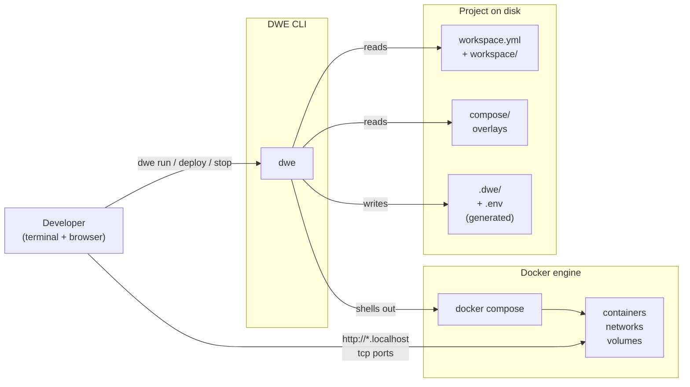
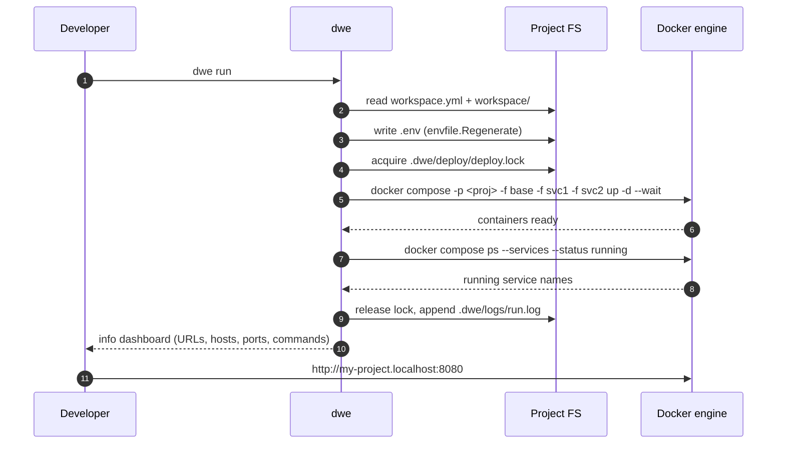

# Architecture

A high-level view of how DWE and Docker fit together: DWE is a CLI that turns a project's YAML tree into Docker Compose invocations, journals the result locally, and hands the developer a way to talk to the containers. This page is the boundary view — what DWE owns, what Docker owns, and where one ends and the other begins.

## Contents

- [The big picture](#the-big-picture)
- [Division of responsibility](#division-of-responsibility)
- [From a command to a container](#from-a-command-to-a-container)
- [Where things live](#where-things-live)
- [Boundaries DWE does not cross](#boundaries-dwe-does-not-cross)
- [Where to go next](#where-to-go-next)

## The big picture

DWE sits between the developer and a Dockerized stack. It reads a project on disk, writes a small amount of generated state next to it, and drives Docker Compose to actually run the containers. The developer never types `docker compose` directly.

The CLI itself is a single static binary with docs and pipelines embedded. There is no companion service, no plugin loader — every invocation is short-lived and stateless except for what it writes under `.dwe/`. The one resident piece is the optional [host-bridge daemon](bridge.md): a stateless forwarder spawned while the stack is up so dev containers can reach `dwe` on the host, stopping itself when the stack goes down.

## Division of responsibility

DWE and Docker each own a clean slice of the system. The split is what makes DWE swappable around an existing Compose stack and what makes the stack survive without DWE installed.

| Concern | Owned by DWE | Owned by Docker / Compose |
|---------|-----------------|---------------------------|
| Project model | `workspace.yml` + `workspace/` tree, services enabled/disabled | — |
| Compose file list | Ordered `-f` list (base + overlays), deterministic merge order | Merge semantics |
| Project name | Resolved from `${project.prefix}-${project.name}` and passed as `-p` | Resource naming (`<project>_<svc>_<n>`) |
| Lifecycle commands | `dwe run` / `deploy` / `stop` / `restart` / `reset` orchestration | `up` / `down` / `stop` / `rm` / `wait` actually run |
| Container env | Renders `.env` before `up`, `run`, `exec`, `restart`, `build` | Reads `.env` and `environment:` into containers |
| Networks | Declared in compose files | Created on `up`, torn down on `down` |
| Volumes | Naming convention (`<project>_<vol>`), shared/non-shared policy, reset sweep | Actual data persistence |
| Health / readiness | Polls via `docker compose ps` and `docker inspect` | Reports health state |
| Hooks / scripts | Renders Git hooks, runs deploy/reset/lifecycle pipelines | — |
| State journal | `.dwe/deploy/state.yml`, skip decisions, locks | — |
| Logs | Tees pipeline output to `.dwe/logs/` | Container logs (via `docker compose logs`) |
| Image build / pull | Drives `docker compose build` / `pull` with policy args | Image layers, registry I/O |

There is no shared mutable state between the two: DWE writes YAML and `.env`, Docker writes container state. The only handshake is the argv DWE passes to `docker compose` and the exit code Docker returns.

## From a command to a container

A `dwe run` invocation is the canonical loop: read config, render env, assemble argv, exec compose, wait for health, print info. Everything else (`dwe deploy run`, `dwe stop`, `dwe reset run`) follows the same shape with different pipelines and different compose subcommands.

Three properties of this loop are load-bearing:

- **Deterministic argv.** The compose file list is sorted (tools → infra → apps, alphabetical within each group). The project name is templated once and reused. Two `dwe run` invocations on the same config produce byte-identical `docker compose` commands.
- **Env is fresh before every relevant call.** DWE regenerates `.env` immediately before `up` / `run` / `exec` / `restart` / `build`. Container-visible variables are always in sync with the resolved config.
- **No long-lived process.** The CLI exits as soon as Docker accepts the command (or after `--wait` resolves). The Docker engine keeps the containers alive; DWE does not babysit them.

The full deploy pipeline expands this loop into phases — preflight, per-service deploy steps, volume creation, `up --wait`, info — but the shape of each leaf call to Docker is the same.

## Where things live

A useful mental model: there are three concentric stores, owned by three different things.

| Store | Lives in | Owner | Survives `dwe reset`? |
|-------|----------|-------|--------------------------|
| Project source | `workspace.yml`, `workspace/`, `compose/`, your app code | You / git | Yes |
| Generated artifacts | `.env`, `.dwe/`, logs, state journal | DWE | `.dwe/` rebuilt; `.env` re-rendered next run |
| Runtime state | Containers, named volumes, networks, images | Docker engine | Non-shared volumes are swept; shared volumes survive |

Two consequences worth knowing:

- **Uninstalling DWE does not break your stack.** The compose files under `compose/` remain valid `docker compose` input. You can `docker compose -f compose/base.yml -f ... up` by hand. DWE's value is automation, not lock-in.
- **Cloning a project does not require Docker state.** `.dwe/` and `.env` are generated. A fresh clone goes from zero to running via `dwe deploy run` — no snapshot of engine state to copy around.

## Boundaries DWE does not cross

A few hard lines that keep the architecture predictable:

- **DWE does not replace `docker` or `docker compose`.** Every container operation shells out. There is no embedded compose engine.
- **DWE does not install Docker.** The host is expected to have `docker` and `docker compose` on the path. DWE shells out via configurable binary overrides (`docker_bin`), but it does not bootstrap the engine.
- **DWE does not run as a daemon.** No background process, no socket, no tray app. Every command starts fresh, reads config, does its work, exits. The one exception is the [host bridge](bridge.md): while the stack is up, a per-project forwarder daemon serves `dwe` invocations from inside dev containers and auto-stops when the last container goes down.
- **DWE does not make network calls on the normal path.** No phone-home, no update check, no template fetch. The only network traffic is whatever the user puts inside a pipeline step or user command (a `curl` in a `type: shell` step, a `docker pull` from a registry, a `git push` in a hook).
- **DWE does not manage `/etc/hosts` or a proxy.** Hostnames like `my-project.localhost` resolve via the OS resolver (`*.localhost` is loopback by RFC), or via whatever local DNS / reverse proxy the developer runs. DWE renders the hostnames into config and into the info dashboard; routing them is outside its scope.

This narrow surface is what lets DWE be useful in CI, on air-gapped machines, and alongside existing Compose-based workflows.

## Where to go next

- [Docker integration](docker.md) — the deep dive on compose file assembly, project naming, env propagation, volume conventions, and the few cases where DWE bypasses compose and calls `docker stop` / `docker rm` directly.
- [Project layout](project-layout.md) — what each folder under `workspace/` is for, and what gets generated under `.dwe/`.
- [Pipelines](pipelines.md) — the phase / step / condition execution model that deploy, reset, and lifecycle share.
- [State and locks](state-and-locks.md) — what `state.yml` records and how `deploy.lock` / `snapshot.lock` serialise mutations.
- [Git integration](git.md) — what DWE renders into a project's `.git/hooks/` and how the workspace view is collected.
- For contributors: [`docs/internals/architecture.md`](../../internals/architecture.md) — the internal `cli/` ↔ `core/` ↔ `shared/` layering inside the binary, and [`docs/internals/packages.md`](../../internals/packages.md) for per-package responsibilities.
