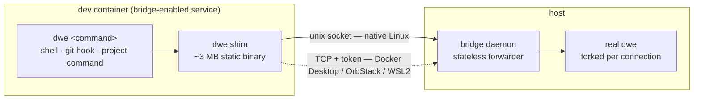
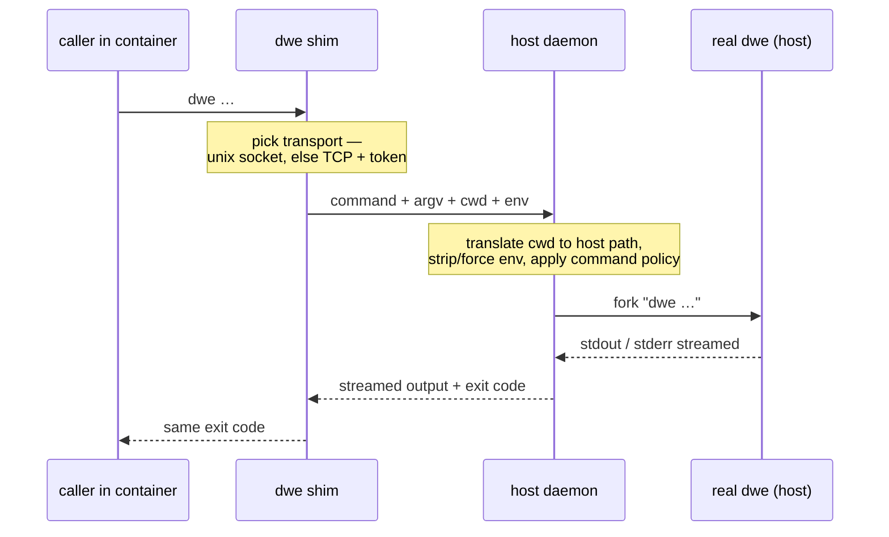
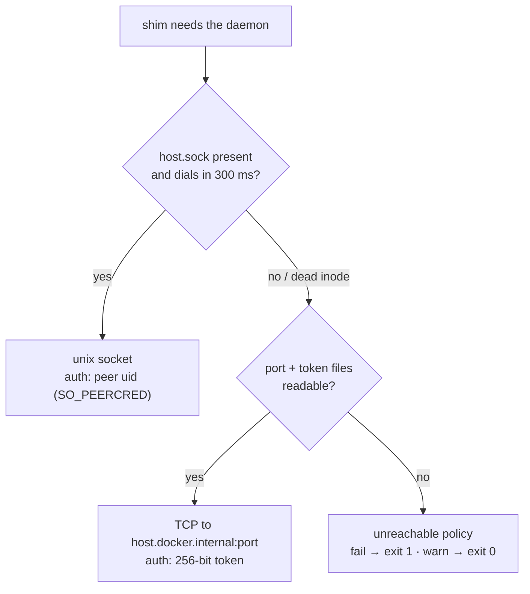

# Host bridge

The host bridge lets `dwe` commands run from **inside dev containers** — git hooks (`exec dwe commands lint`), project commands, and read-only diagnostics work identically on the host and in a container terminal (VS Code Dev Containers and similar). DWE mounts a small static shim binary into bridge-enabled service containers as `dwe`; the shim forwards every invocation to a host-side daemon, which runs the real `dwe` on the host and streams output and the exit code back.

The bridge is **off by default for every service type** — opt a service in with `bridge.enabled: true`. Everything below is reference detail: the `bridge:` schema, transports, the in-container command policy, the generated compose overlay, daemon lifecycle, and troubleshooting.

## Contents

- [How it works](#how-it-works)
- [Enabling the bridge: `bridge:` in service.yml](#enabling-the-bridge-bridge-in-serviceyml)
- [Transports](#transports)
- [Command policy inside containers](#command-policy-inside-containers)
- [The generated compose overlay](#the-generated-compose-overlay)
- [`.dwe/bridge/` contents](#dwebridge-contents)
- [Daemon lifecycle](#daemon-lifecycle)
- [`dwe bridge` subcommands](#dwe-bridge-subcommands)
- [Environment contract](#environment-contract)
- [Limitations](#limitations)
- [Troubleshooting](#troubleshooting)
- [See also](#see-also)

## How it works

The point of the bridge is simple: **inside a bridge-enabled container you can just run `dwe`** — typed at a shell, from a git hook, or from a project command — and it behaves like running it on the host. Two processes make that work: a tiny **shim** stands in for `dwe` inside the container, and a host **daemon** runs the real `dwe`. The container never executes DWE logic — it only forwards.



Any single invocation streams end to end and returns the host-side exit code:



- The **shim** is a ~3 MB static Linux binary (amd64 + arm64 builds are embedded in the host `dwe` and materialized into `.dwe/bridge/`). It carries no business logic: it picks a transport, sends the command, pumps stdio, and exits with the host-side exit code.
- The **daemon** (`dwe bridge daemon`, hidden) is a stateless forwarder: one connection per command, fork `dwe <argv>` per connection, no project model, no cache. It is started and stopped automatically by lifecycle commands.
- The shim's working directory is translated from the container path to the host path (see [Environment contract](#environment-contract)), so relative paths in hooks and project commands just work.

## Enabling the bridge: `bridge:` in service.yml

Per-service opt-in in `workspace/services/<name>/service.yml`:

```yaml
type: app
dir: ./services/main
dir_internal: /var/www/html
bridge:
  enabled: true                    # default: false — the bridge is strictly opt-in
  # shim_path: /usr/local/bin/dwe  # mount point override (base-image collision)
  # on_unreachable: fail           # fail | warn — shim policy when the daemon is down
```

| Field | Default | Meaning |
|---|---|---|
| `enabled` | `false` (every type) | inject the shim binary and bridge mounts into this service's container |
| `shim_path` | `/usr/local/bin/dwe` | absolute container path the shim is mounted at; override when the base image already ships a file there |
| `on_unreachable` | `fail` | `fail` — shim prints an error and exits 1 when the host daemon is unreachable (a hook blocks the commit); `warn` — print a warning and exit 0 |

`bridge.enabled` is a tristate and inherits through service [`extends:`](../config/services/extends.md) the same way `render.git.enabled` does: an explicit value in the child wins, an unset child inherits the parent, and the off default applies only when neither sets it. `shim_path` and `on_unreachable` inherit when the child leaves them empty.

A bridge-enabled service should declare the `dir` / `dir_internal` pair — it is what the shim's working-directory translation maps over. Without it there is no working-directory translation, so every in-container invocation runs from the project root instead of the current directory (`dwe validate` warns about this).

## Transports

The shim and the daemon both always support two transports; there is no platform detection on either side.

| Platform | Working transport | Auth |
|---|---|---|
| Linux (native Docker) | unix socket `.dwe/bridge/host.sock` | peer uid must equal the daemon's uid (`SO_PEERCRED`) |
| Linux rootless | unix socket (`host-gateway` is broken there) | peer uid |
| Docker Desktop (macOS / Windows) | TCP `host.docker.internal:<port>` (Desktop proxies to the loopback listener) | 256-bit per-project token |
| OrbStack / Colima | TCP | token |
| WSL2 (dwe inside the distro) | TCP | token |

Selection, per invocation:

1. If `host.sock` exists in the mounted bridge dir, dial it with a 300 ms timeout. On Docker Desktop and similar runtimes the socket inode is visible but dead (file sharing does not forward `connect()` across the VM boundary), so this refuses instantly — by design.
2. Fall back to TCP: read the `port` and `token` files from the bridge dir (retried briefly — a daemon restart can leave a short window) and connect to `host.docker.internal:<port>`, presenting the token.
3. Both failed → the [unreachable policy](#troubleshooting) applies.



The daemon always listens on the unix socket and on `127.0.0.1` with an ephemeral OS-assigned port (no port collisions, no LAN exposure — never `0.0.0.0`). On native Linux it additionally binds the docker bridge gateway IP (usually `172.17.0.1`) so containers can reach it; the generated overlay adds `extra_hosts: host.docker.internal:host-gateway` to every bridged service, which is required on Linux and harmless elsewhere. Exotic setups can override the listen addresses with the `DWE_BRIDGE_BIND` environment variable (a comma- or whitespace-separated address list) when starting the daemon. Wildcard addresses (`0.0.0.0`, `::`) are rejected from the override — binding all interfaces would break the no-LAN-exposure guarantee, so such an entry is ignored with a warning and the daemon falls back to the loopback default.

Isolation is per project: each project has its own socket, port, and token under its own `.dwe/bridge/`; a container of one project connecting to another project's port fails authentication, and the daemon never runs a command outside its own project root — an out-of-project working directory is replaced by the project root.

## Command policy inside containers

The container command surface is deliberately reduced — **allowlist, default-deny**. Two motives: `dwe stop` from inside a container would stop the caller's own container (the terminal/IDE session dies before the result arrives), and a token in a compromised container must not be able to destroy data.

| Allowed from a container | Why |
|---|---|
| `dwe commands <cmd>` / `dwe cmd <cmd>` | the primary case — hooks and project commands; only commands opted in via [`bridge:`](#per-command-opt-in) |
| bare `dwe commands` / `dwe cmd` | no TTY over the bridge → prints the `commands list` output (filtered to bridged commands) instead of the interactive browser |
| `status`, `info`, `logs` | read-only diagnostics |
| `docs` (including `llms-txt`) | read-only; useful to AI agents working in the devcontainer — bare `dwe docs` prints the `docs list` output (no TTY for the browser) |
| `prompt` | container terminal prompt segment |
| `vars` (`get`/`list`/`inspect`; `set` gated by `bridge.vars_writable`) | read the vars sandbox; container writes are deny-by-default per the top-level [`bridge.vars_writable`](../config/vars.md#container-behavior-and-bridgevars_writable) allowlist |
| `render config` | regenerate config files after a container-side `vars set` (`--harvest` stays host-only); other render subcommands (`env`/`ide`/`ai`/`git`) are host-only |
| `bridge status` | bridge self-diagnostics |
| `version`, help | service commands |

| Blocked | Why |
|---|---|
| `stop`, `restart`, `reset` | suicidal: they stop / recreate the container they were invoked from |
| `deploy`, `run`, `services` | the stack is managed from the host |
| `snapshot` | restore stops the stack; create is heavy and takes project locks |
| `render` (except `render config`), `setup`, `init`, `shell` | mutate workspace files or are interactive — only `render config` is carved out (see above) |
| `bridge` (everything except `status`) | `bridge stop` is suicide for the bridge itself |
| `validate`, `completion` | host-side concerns: validation targets the host workspace, completion scripts are installed on the host (a completion script already baked into an image keeps degrading silently — the hidden completion machinery stays reachable) |

### Per-command opt-in

Inside the allowlisted `dwe cmd` / `dwe commands` surface there is a second, per-command gate: a user command is reachable from a container **only when its definition opts in** via a `bridge:` block (on the command or its file's `group:` header) — see [command directives § Bridge visibility](../config/commands/directives.md#bridge-visibility). Without it the command stays host-only: filtered from container listings and completion, and rejected on direct invocation with `command_not_bridged` plus a remediation hint.

```yaml
commands:
  cs.all:
    type: service_exec
    cmd: composer cs
    bridge:
      enabled: true        # reachable from every bridged container
      services: [main]     # …or only from these (workspace service keys)
```

`bridge.services` matches against the calling container's identity, which the overlay injects as `DWE_BRIDGE_SERVICE=<service key>` and the shim forwards. The identity is container-reported and therefore **advisory** — a UX boundary that keeps, say, php commands out of an nginx container's listing, not a security boundary; the security boundary remains the top-level allowlist above plus the daemon's env hardening. Matching is `extends:`-aware: a service that [extends](../config/services/extends.md) another inherits the parent's command rights, so `services: [main]` also admits containers of services extending `main` (never the reverse). Workflow execution is never gated: a bridged workflow runs its non-bridged sub-commands host-side as usual.

Mechanics worth knowing:

- A blocked command fails with a `bridge_command_blocked` error and a run-on-host hint; the suicidal lifecycle commands additionally explain *why* (e.g. "it would stop the container it was invoked from").
- Blocked commands are **invisible** in `--help` listings and shell completion inside containers, not "visible but failing".
- The policy is inherited by nested invocations: a `type: dwe` user command spawns a child `dwe` with the same environment, so a hook hiding `dwe stop` inside a project command cannot kill the container.
- Every bridged command runs non-interactively (plain progress output, no prompts). Interactive TUIs are blocked outright; the bridge protocol itself never allocates a pseudo-terminal. Colors survive, though: when the shim's stdout is a terminal it forwards `CLICOLOR_FORCE=1` and `COLORTERM=truecolor`, so the host-side `dwe` keeps ANSI colors and the full host palette across the bridge pipe (help and long output always render the dark palette on pipes — the same default lipgloss uses). And when the container's stdin AND stdout are both terminals, the shim adds `DWE_BRIDGE_STDIN_TTY=1` and the host runners give user-command children a local PTY — `docker compose exec` then allocates a container TTY, so isatty-keyed tools (phpcs, PHPUnit, ripgrep, …) colorize exactly like a host run, with stderr merged into stdout just as in any terminal session. Set `NO_COLOR` in the container to opt out; piped shim output (`dwe cmd foo | grep …` or `cat dump.sql | dwe cmd db.import`) automatically stays plain and PTY-free.

## The generated compose overlay

`.dwe/compose.bridge.yml` is **dwe-owned machine state** — the same ownership model as the generated `.env` and rendered service configs. Every command that performs `compose up` (`dwe deploy run`, `dwe run`, `dwe services … --apply`, whole-stack `restart`) regenerates it atomically before starting the stack; when no enabled service has the bridge enabled, the file is deleted instead. Manual edits are unsupported and overwritten — the file says so in its header.

```yaml
# GENERATED by dwe — do not edit; customize via workspace/local.yml
services:
  app-main:
    volumes:
      - type: bind
        source: /Users/foo/projects/my-proj/.dwe/bridge
        target: /dwe-bridge
        read_only: true
      - type: bind
        source: /Users/foo/projects/my-proj/.dwe/bridge/shim-linux-arm64
        target: /usr/local/bin/dwe
        read_only: true
    environment:
      DWE_BRIDGE_DIR: /dwe-bridge
      DWE_HOST_WORKSPACE: /Users/foo/projects/my-proj/services/main
      DWE_CONTAINER_WORKSPACE: /var/www/html
      DWE_BRIDGE_PROJECT: my-proj
      DWE_BRIDGE_SERVICE: main
    extra_hosts:
      - host.docker.internal:host-gateway
```

- **Chain position**: the overlay sits after the project's own compose files and **before** the `workspace/local.yml` overlays — `local.yml` keeps the last word over anything the bridge sets (compose later-file-wins), so per-developer customization goes through [`local.yml`](../config/workspace.md), never through editing the generated file.
- **Self-healing**: the file always contains exactly the currently enabled and bridge-enabled services, so toggling a service off can never leave a stale fragment that breaks `compose up`. Moved project directories, changed image architectures, and edited `bridge:` settings are all picked up at the next start.
- **Shim architecture** is chosen per service at each regeneration from the image's reported architecture (`docker inspect` against the container named `<compose project name>-<container>`, honoring `docker.yml`'s `project_name`); when the container does not exist yet (first deploy, after a reset) the host architecture is used silently (a `-v` decision line records it), and any other resolution failure falls back the same way with a warning — both self-heal on the next regeneration.
- The TCP port and the token are deliberately **not** in the overlay — the shim reads them from the mounted `/dwe-bridge` files, so a daemon restart never requires regenerating the overlay or recreating containers.
- All mounts are read-only; connecting to a unix socket works on a read-only bind mount (the same mechanism that makes `docker.sock:ro` work).

## `.dwe/bridge/` contents

The bridge runtime directory on the host (`.dwe/` is gitignored):

| File | Written by | Purpose |
|---|---|---|
| `host.sock` | daemon, at startup | unix-socket transport (native Linux) |
| `port` | daemon, after bind | actual ephemeral TCP port |
| `token` | daemon, first start (mode 0600) | 256-bit auth token; stable project identity, survives daemon restarts |
| `daemon.pid` | daemon | PID + flock holder — the liveness probe |
| `daemon.log` | daemon | daemon stderr (append-only; no rotation) |
| `shim-linux-amd64`, `shim-linux-arm64` | host dwe, at each prepare | materialized shim binaries (bind-mount sources) |

The overlay itself lives one level up, at `.dwe/compose.bridge.yml`.

## Daemon lifecycle

The daemon is managed automatically — every lifecycle command that asserts "the stack is alive" ensures it first:

| Command | Daemon action |
|---|---|
| `dwe deploy run` | cycle (stop → start) — guarantees the daemon is not from an older dwe build |
| `dwe run` | ensure (start if not running) |
| `dwe restart` (whole stack) | cycle |
| `dwe services enable|disable <name> --apply` | ensure |
| `dwe status` (top-level) | best-effort ensure |
| `dwe bridge start` | ensure (manual) |
| `dwe stop` / `dwe reset run` (whole stack) | stop |
| `dwe stop <svc>` / `reset run --service <svc>` / `restart <svc>` | untouched |

The daemon also **auto-stops** when the stack is actually down: it watches docker events for the project's containers (with a 60 s poll fallback) and exits once zero remain, removing `host.sock` and `port` but keeping `token`. There is deliberately no idle timeout — a dead daemon cannot be revived from inside a container, so killing it under an active developer would brick their hooks.

When a project has no bridge-enabled service, no daemon is ever started and no overlay is generated.

## `dwe bridge` subcommands

Manual control and diagnostics; lifecycle commands make these unnecessary day-to-day. All support `--output json`.

| Command | Behavior |
|---|---|
| `dwe bridge start` | start the daemon (idempotent); refuses with `bridge_not_enabled` when no enabled service has the bridge enabled |
| `dwe bridge stop` | SIGTERM the daemon by pidfile (idempotent); in-container dwe stops working until it is started again |
| `dwe bridge status` | liveness (pid, uptime), transport endpoints (socket path, TCP port), shim materialization state; the only `bridge` subcommand allowed from inside containers |
| `dwe bridge logs [--tail N]` | show `.dwe/bridge/daemon.log` (default last 50 lines, `--tail 0` = all) |

## Environment contract

Inside a bridged container the overlay sets:

| Variable | Meaning |
|---|---|
| `DWE_BRIDGE_DIR` | in-container mount point of the host's `.dwe/bridge` (`/dwe-bridge`) |
| `DWE_HOST_WORKSPACE` / `DWE_CONTAINER_WORKSPACE` | the service's host hub dir (`<root>/<dir>`) and its in-container mount (`dir_internal`) — the prefix pair the shim rewrites working directories with |
| `DWE_BRIDGE_PROJECT` | project name, used in shim diagnostics |
| `DWE_BRIDGE_SERVICE` | the service's workspace key — the calling-container identity that per-command [`bridge.services`](../config/commands/directives.md#bridge-visibility) lists match against. The one bridge variable that IS forwarded to the host (its consumer is the host-side `dwe`); container-reported, hence advisory |
| `DWE_BRIDGE_UNREACHABLE` | only present with `on_unreachable: warn` |

The shim strips these — except `DWE_BRIDGE_SERVICE` — (plus any `DWE_PROJECT_ROOT*`) from the environment it forwards, and the daemon re-filters the same set on arrival. The daemon also drops execution-hijacking variables before forking — the dynamic-loader families (`LD_*`, `DYLD_*`), shell-startup hooks (`BASH_ENV`, `ENV`, `SHELLOPTS`, `BASHOPTS`), `IFS`, and `PATH` — and force-sets `PATH` to the host daemon's own value, so a container can never redirect the `docker`/`git`/`sh` binaries the host-side `dwe` invokes by bare name. Host-identity variables are replaced the same way: the container's `HOME`, `USER`, `LOGNAME`, `TMPDIR`, `SSH_AUTH_SOCK`, and the `DOCKER_*` / `COMPOSE_*` / `XDG_*` families are dropped and the daemon's own values forwarded instead — a container `HOME` would otherwise break docker context resolution on the host (the CLI would fall back to `/var/run/docker.sock`, absent on Docker Desktop / OrbStack macs). It then force-sets two host-controlled variables for the forked `dwe`: `DWE_INVOKED_FROM=container` (activates the command policy — client-sent values are discarded, so it cannot be spoofed from the container) and `DWE_NONINTERACTIVE=1`. `--output json` payloads are identical in both contexts.

The command's argument vector is passed through untranslated — only the working directory is rewritten. Relative paths therefore work everywhere; absolute container paths in arguments will not resolve on the host (a documented limitation).

## Limitations

- **No interactive commands.** The bridge never allocates a pseudo-terminal; the policy blocks interactive commands, and everything else runs in the same non-interactive mode as CI.
- **Absolute container paths in arguments** are not translated — use relative paths (the working directory is translated for you).
- **Services without a `dir` / `dir_internal` pair** get no working-directory translation; in-container invocations then run from the project root rather than the current directory. `dwe validate` flags this.
- **Windows containers** and a Windows host-side dwe are out of scope; WSL2 with dwe installed in the distro works as the Linux case.

## Troubleshooting

**"host daemon is not running for project …"** — the host stack is down or the daemon was stopped manually. Run `dwe run` (or `dwe bridge start`) on the host. With the default `on_unreachable: fail` the shim exits 1 so hooks block; set `on_unreachable: warn` on the service to turn this into a warning + exit 0 (e.g. for advisory hooks).

**"shim outdated, re-run `dwe deploy` to refresh shim binaries"** — the materialized shim and the host dwe speak different protocol versions (typically after upgrading dwe while the stack runs). `dwe deploy run` refreshes the shims and cycles the daemon even when the deploy itself has nothing to do.

**Bridged command hangs or fails only on native Linux** — UFW/firewalld may drop traffic arriving from the docker bridge network onto the gateway IP. The unix-socket transport is unaffected; if you need TCP, allow input from the docker bridge interface.

**Rootless Docker on Linux** — `host-gateway` is broken there, so TCP is unavailable; the unix-socket path covers rootless setups. Note that user-namespace remapping can shift the peer uid the daemon sees; if peercred auth fails, run the stack non-rootless or consult the project's issue tracker for the token-on-unix fallback status.

**A bridged command runs from the project root instead of the current directory** — the shim could not translate the container cwd to a host path (only the service's `dir` / `dir_internal` mapping is translatable), so the daemon fell back to the project root. Typical trigger: a git hook or script that `cd`'d out of the container mount before calling `dwe` (e.g. a host-layout `cd "$(git rev-parse --show-toplevel)/../../.."` lands on `/`). Commands keep working — `dwe bridge logs` records the fallback. Hooks don't need any `cd` at all: `dwe` discovers the project by walking up from any directory inside it.

**The base image already has `/usr/local/bin/dwe`** — set `bridge.shim_path` to a different absolute path that wins in the container's `PATH`.

**`dwe` in the container fails with "exec format error" right after the first start** — the shim architecture is resolved from the existing container, so the very first start of an *emulated foreign-arch* image (e.g. an amd64-only image on an arm64 mac) falls back to the host architecture and mounts the wrong shim. Start the stack again: with the container now present the architecture resolves from the image and the overlay self-heals. Native-arch images are unaffected.

**Where to look** — `dwe bridge status` (daemon liveness, transports, shim state), `dwe bridge logs` (daemon stderr, including startup panics), and `dwe validate` (the `bridge` domain checks `on_unreachable` values, `shim_path` absoluteness, and the workspace mapping; `dwe validate bridge` scopes to it).

## See also

- [Services configuration](../config/services/index.md) — `service.yml` fields, `extends:` inheritance
- [Workspace & local overlays](../config/workspace.md) — `workspace/local.yml`, compose file chain
- [User commands](../config/commands/index.md) — the `dwe commands` system that hooks call through the bridge
- [Validate](../config/validate.md) — project readiness checks; the bridge validation domain
