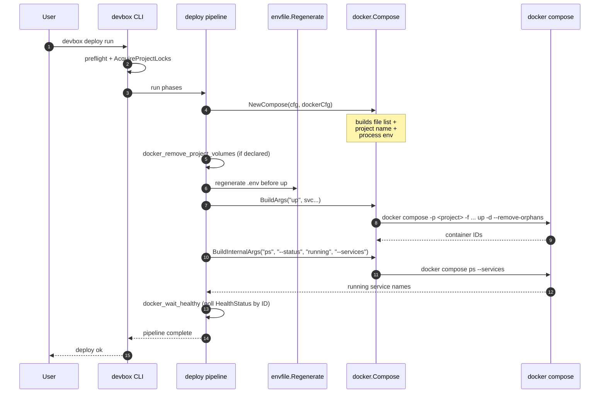

# Docker integration

How Devbox drives Docker Compose: the compose project name, the file list it assembles, the environment it propagates to every child process, the volumes it owns, and the few places it bypasses compose and calls `docker stop` / `docker rm` directly.

## Contents

- [Two entry points: `devbox docker` vs `devbox compose`](#two-entry-points-devbox-docker-vs-devbox-compose)
- [Project name](#project-name)
- [Compose file list](#compose-file-list)
- [Process environment](#process-environment)
- [Volumes](#volumes)
- [Compose-bypass on the per-service path](#compose-bypass-on-the-per-service-path)
- [`devbox deploy` end-to-end](#devbox-deploy-end-to-end)
- [Where to go next](#where-to-go-next)

## Two entry points: `devbox docker` vs `devbox compose`

Devbox never asks the user to type `docker compose` directly. Every lifecycle invocation routes through one of two CLI surfaces:

| Surface | Purpose | Policy args applied? |
|---------|---------|----------------------|
| `devbox docker <sub>` | Public lifecycle API used by Makefiles, deploy steps, and user commands. | Yes (`global` + per-subcommand defaults). |
| `devbox compose raw <args...>` | Low-level diagnostic pass-through. | No. |
| `devbox compose files` / `compose argv` | Inspect the active file list or the full effective argv. | n/a (read-only). |

Both surfaces resolve through the same `docker.Compose` struct in `internal/shared/docker/`. The struct exposes two argv builders:

- `BuildArgs(command, extraArgs…)` assembles `compose -p <project> -f <file>… <globalArgs> <command> <commandDefaultArgs> <extraArgs>`. This is what `devbox docker` uses.
- `BuildInternalArgs(command, extraArgs…)` builds the same skeleton but skips both `globalArgs` and per-command defaults, so internal probes (health checks, "is container running" queries) cannot be broken by a user-supplied `args.ps: ["--services"]` override.

## Project name

The compose project name is the `-p <name>` value passed to every `docker compose` invocation. It is also the prefix Docker Compose uses for its own resource naming conventions: containers (`<project>_<service>_<n>`), networks (`<project>_default`), and named volumes (`<project>_<vol>`).

Devbox resolves the name from `devbox/docker.yml`:

```yaml
# devbox/docker.yml
project_name: "${project.prefix}-${project.name}"
```

`${dot.path}` placeholders are resolved against the merged `DevboxConfig` (the `devbox.yml` → `defaults.yml` → `local.yml` cascade) by `resolveVarTemplate`. The same name is fed back into:

- Every compose invocation (`compose -p <name>`).
- The non-shared volume name resolver (`<project>_<volume>` — see [Volumes](#volumes)).
- The per-service container name resolver in `internal/shared/daemon/` used by per-service stop and reset (see [Compose-bypass](#compose-bypass-on-the-per-service-path)).
- The compose-bypass volume-removal builtin, which uses the project name as a prefix filter when sweeping volumes.

A typical resolved name looks like `myorg-shop` or `devbox-laravel`. The exact form is part of the public surface — renaming the project requires updating `local.yml` so the prefix matches, otherwise the next `docker compose` invocation talks to a different project and the old containers and volumes go orphan.

## Compose file list

Devbox does not write a single `compose.yaml` that imports everything. It passes a *list* of `-f` flags, in order, and lets Docker Compose merge them. The list is built by `DevboxConfig.ComposeFiles()`:

1. The base file from `compose.base` in `devbox.yml` (always included).
2. Enabled **tool** overlays, sorted by service key.
3. Enabled **infra** overlays, sorted by service key.
4. Enabled **app** overlays, sorted by service key.

Service type order matters: tools first, then infra, then apps. Within a group, sort is alphabetical by the service key (the directory name under `devbox/services/<name>/`). Map iteration in Go is randomized; the explicit sort keeps the file list deterministic so golden tests stay green and so `docker compose` always sees overlays in the same merge order.

A second variant, `ComposeFilesAll()`, returns the same ordered list but ignores the `enabled` flag. This is what `devbox docker pull --all` and `devbox docker build --all` use to operate on overlays a developer has toggled off locally — without modifying `devbox/local.yml`.

Each entry in the list points at a file inside the project tree, typically under `compose/`:

```text
compose/base.yml                  # compose.base
compose/tools/redis-insight.yml   # tool overlay
compose/services/api.yml          # app overlay
```

There is no `docker.local.yml`-level override of the compose file list. Local overrides live in:

- `devbox/local.yml` — per-service `enabled: true|false`, ports, hosts, custom envs. Affects the list contents via the enabled set.
- `devbox/docker.local.yml` — per-policy overrides (project name, args, process env, topology). Does **not** add or remove `-f` files.

To inspect the effective list run `devbox compose files`.

## Process environment

Every `docker compose` child process inherits the parent process environment plus an overlay defined in `devbox/docker.yml`:

```yaml
process_env:
  DOCKER_CLI_HINTS: "false"
```

`Compose.BuildEnv()` returns `os.Environ()` with these keys overlaid — existing values are replaced, new keys are appended, and the result is sorted-stable for deterministic test output. When `process_env` is empty, `BuildEnv()` returns `nil` and the child inherits the parent environment unchanged (the common path).

`process_env` affects the **compose CLI process**, not the running containers. Container-visible env comes from `.env` (and the compose file's `environment:` blocks). Devbox auto-regenerates `.env` before five subcommands — `up`, `run`, `exec`, `restart`, `build` — by calling `envfile.Regenerate` on the active config. This step is intentionally not configurable. Other subcommands (`down`, `stop`, `ps`, `logs`, `pull`) skip it because they do not need a current `.env`.

## Volumes

Docker Compose creates named volumes lazily: the first `docker compose up` that references a volume creates it. Devbox adds two layers on top:

- **Project scoping.** Volumes declared under `resources.volumes` in `devbox/docker.yml` get a `<project_name>_` prefix, matching Compose's own naming convention for `volumes:` declared inside `compose.yaml`. A volume keyed `build_artifacts` with `shared: false` becomes the actual Docker volume `myorg-shop_build_artifacts`.
- **Shared mode.** `shared: true` opts out of the prefix. The volume is created with its literal name and survives `devbox reset` runs on this project — and is reused by any other Devbox project that declares the same shared name. The canonical use case is a language-toolchain cache (composer, npm, go-build) shared across projects.

`ensure_before: [up, deploy]` triggers idempotent creation on those entry points. The non-shared, project-scoped volumes are also what `docker_remove_project_volumes` sweeps during reset: the builtin lists every Docker volume whose name begins with `<project_name>_` and removes it. Shared volumes do not match the prefix and survive.

## Compose-bypass on the per-service path

For full-stack lifecycle (`devbox run`, `devbox stop`, `devbox restart` with no service argument) Devbox calls `docker compose up` / `down` / `stop`. The compose file list and policy args apply as described above.

Two flows deliberately bypass compose:

- **`devbox stop <service>`.** When the user names a single service, Devbox resolves the compose container name through `daemon.ResolveContainerName(projectFull, svc.Container)` and calls `docker stop <name>` directly. This works even after the service has been disabled in `local.yml` — at which point the service's overlay is no longer in the `-f` list and `docker compose stop <name>` would not see the container at all. The user-visible behavior is "I can always stop this service by name".
- **`devbox reset run --service <name>`.** The per-service reset prepends a synthetic `docker_stop_remove_container` builtin step to the service's pipeline. The builtin stops and removes the named container in two `docker` calls, again outside compose. The reset pipeline body then runs as declared; volume cleanup happens only when the user opts in via `docker_remove_project_volumes`.

For everything else — `devbox docker up`, `down`, `logs`, `ps`, `exec`, `run`, `pull`, `build`, plus `devbox stop` with no service argument — Devbox talks to `docker compose`.

## `devbox deploy` end-to-end

A `devbox deploy run` invocation walks the deploy pipeline (preflight → orchestrator phases → per-service overlays → infra `after:` → final hooks). At several points the pipeline calls into the Docker layer described above:



Three properties to notice:

- The `Compose` struct is built once per pipeline run from the resolved configs and reused for every invocation. Project name, file list, args, and process env are stable across the whole deploy.
- Lifecycle commands and internal probes share the same project name and file list but use different argv builders. A user override like `args.ps: ["--services"]` cannot break the running-services probe because the probe goes through `BuildInternalArgs`.
- `.env` regeneration runs **before** the compose call, never in parallel with it. The compose invocation always sees a current `.env`.

## Where to go next

- [`docker.yml` field reference](../config/docker.md) — every field of `devbox/docker.yml` and `devbox/docker.local.yml`.
- [Render env](../render/env.md) — what goes into `.env` and how `${...}` is resolved.
- [Deploy](../config/deploy/index.md) — the pipeline that wraps these compose calls.
- [State and locks](state-and-locks.md) — why `deploy.lock` and `snapshot.lock` serialise the pipeline above.
- [Project layout](project-layout.md) — where the `compose/` overlays live on disk.
