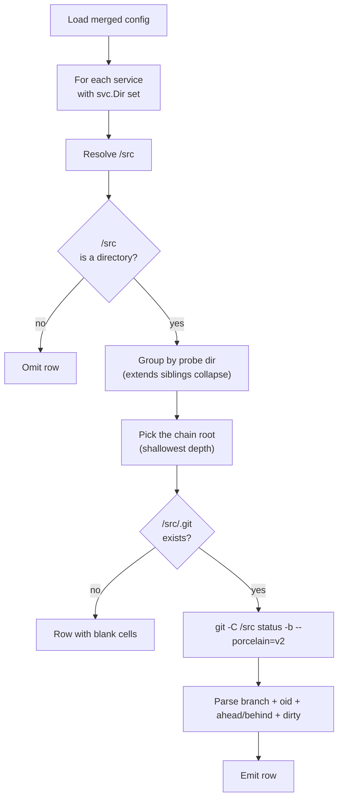

# Git integration

How DWE interacts with Git: the per-service hook rendering pipeline, the workspace probe behind `dwe status git`, the optional update probe on `dwe run`, and the `.gitignore` conventions for runtime-managed paths.

## Contents

- [Two services have a working tree](#two-services-have-a-working-tree)
- [Hook rendering](#hook-rendering)
- [Workspace probe (`dwe status git`)](#workspace-probe-dwe-status-git)
- [Update probe (`dwe run`)](#update-probe-dwe-run)
- [`.gitignore` conventions](#gitignore-conventions)
- [No checkout, no fetch, no push](#no-checkout-no-fetch-no-push)
- [Where to go next](#where-to-go-next)

## Two services have a working tree

A DWE project has its *own* Git repository at the project root — the one that tracks `workspace.yml`, the `workspace/` config tree, and the `compose/` overlays. Most projects also carry one or more application services whose source code lives under `<svc.Dir>/src/`. By convention each such service owns a separate Git checkout at `<svc.Dir>/src/.git/`.

DWE treats those two layers identically: it never assumes a particular VCS lives at the project root, and it never reaches into one service's repo to learn about another. Every Git operation either targets the project root (the update probe) or targets exactly one `<svc.Dir>/src/` (hook rendering, workspace probe). There is no global "fetch everything" surface.

The CLI shells out to the host `git` binary. The binary path resolves through the standard accessor (`config.GitBin(cfg)`) so a project can pin a specific version via `binaries.git` in `workspace.yml` if needed. Empty means "look up `git` on `$PATH`".

## Hook rendering

`dwe render git` renders shell hooks into each enabled service's `<svc.Dir>/src/.git/hooks/` directory from a template pack under `workspace/templates/git/`.

The mechanism is the same as `render ide` and `render ai` — same selection model, same pack resolution chain, same path-safety guards, same manifest schema. Three things make Git-hook rendering distinctive:

- **The destination is inside `.git/`**, which Git never tracks. The rendered files are not committed; re-rendering is the source of truth. Hand-editing `src/.git/hooks/pre-commit` and expecting changes to survive is a category mistake.
- **Manifest `to` is restricted to basenames**, because Git does not recurse into `hooks/` subdirectories. A manifest line like `to: subdir/pre-commit` is rejected at load time.
- **Default activation matches `render ide`**: only `type: app` services render hooks by default. Tool and infra services opt in explicitly with `services.<name>.render.git.enabled: true`.

The end-to-end flow per service is:

1. **Activation gate.** Both `services.<name>.enabled` and `services.<name>.render.git.enabled` must be true (the policy default depends on the service type).
2. **Hub preflight.** `<svc.Dir>` must resolve inside the project root and must not be reached through a symlink.
3. **Git directory probe.** `<svc.Dir>/src/.git` must be a directory. A regular file (a `gitdir:` pointer from `git worktree` or a submodule) causes the service to be skipped with a warning — see [Worktrees and submodules](../render/git.md#worktrees-and-submodules) in the command reference. Missing `.git/` also skips with a warning.
4. **Collision resolution.** When two services share the same `<svc.Dir>` (typically a base `main` and an `extends:` child `main-debug`), the deepest extender wins.
5. **Pack resolution.** `render.git.template` pins a pack; otherwise the chain tries `workspace/templates/git/<service-name>/` then `workspace/templates/git/default/`.
6. **Per-file render.** Each entry in the pack's `manifest.yml` is read, evaluated as a [strict Go text template](../templates.md), written to `<svc.Dir>/src/.git/hooks/<basename>`, and `chmod`-ed to `0755` on every run.

The full field reference and worked examples live in [`dwe render git`](../render/git.md). The activation block reference (`services.<name>.render.git`) is in [`config/services/fields.md`](../config/services/fields.md#rendergit-block).

### Hook template inheritance

A pack is just a directory. Composition happens through two mechanisms:

- **`<pack>.local/` overlay.** For any pack under `workspace/templates/git/<pack>/`, a sibling directory `workspace/templates/git/<pack>.local/` may shadow individual files by relative path. The packroot resolver tries `<pack>.local/<rel>` first and falls back to `<pack>/<rel>`. This is the per-developer customization seam — `.local/` is typically gitignored.
- **Service `extends:`.** When `service-b` extends `service-a` and `service-b` has no `render.git.template` of its own, it inherits the parent's value. The deepest-extends collision rule then resolves which service wins for a shared `<svc.Dir>`. The template variable `.Resolved` names the rendering service (the deepest extender — its overlay decides container/dir), while `.Service` names the canonical config root (use it to look up raw config keyed by service name).

The pack itself does not support a `from-another-pack` inheritance directive. If two packs share content, factor the shared parts into the template body via `{{ template "name" . }}` or duplicate them. DWE does not introduce a pack-composition language; the file-overlay model is the only customization surface.

## Workspace probe (`dwe status git`)

`dwe status` and `dwe status git` render one row per service that has a working tree at `<svc.Dir>/src/`. The probe is read-only, parallel, and never modifies the repository.



Notable boundary properties:

- **No own `.git/` → blank cells, not an error.** A service whose `<svc.Dir>/src/` exists but has no `.git/` of its own gets a row with empty branch/SHA/ahead-behind. The probe deliberately short-circuits before any shellout — `git -C` would otherwise walk up to the nearest enclosing repository (often the project root), and reporting that as the service's status would be wrong.
- **Missing `src/` → no row at all.** Services without a working tree are omitted from the output entirely. There is no opt-out flag for the workspace section beyond not having a `src/` directory.
- **Extends siblings deduplicate.** When two services share the same `<svc.Dir>` via `extends:`, they probe the same tree. The collector groups candidates by probe directory and keeps the extends-chain root (shallowest depth, ties broken alphabetically). Sidecar variants like `main-debug` do not produce duplicate rows.
- **Parallel shellout, bounded.** The probes run inside an `errgroup` capped at 8 concurrent invocations. Each goroutine writes into a pre-allocated row slot, so per-row failures stay isolated and never cancel siblings.
- **Display path.** The probed directory shown in the status table is project-relative with a `…/` prefix (`…/services/main/src`). The probe itself uses absolute paths.

The probe never fetches. Branch / OID / ahead-behind / dirty come from a single `git status -b --porcelain=v2` invocation. Up-to-date-ness relative to a remote requires the separate update probe described below.

## Update probe (`dwe run`)

The `run:` pipeline in `workspace/lifecycle.yml` may declare an `update:` block. When present, `dwe run` probes the project-root repository before executing any phase:

```yaml
# workspace/lifecycle.yml
run:
  update:
    mode: on   # on | off
```

Two modes:

| Mode | Fetches | Pulls |
|------|---------|-------|
| `on` | yes | with consent (TTY prompt; non-TTY downgrades to check semantics) |
| `off` | no | no — probe disabled |

The probe runs on the project root, never on a service `src/`. It calls `git fetch --quiet <remote>` (15 s timeout), then `git rev-list --left-right --count` to derive `behind` / `ahead`. A dirty tree, missing upstream, or fetch failure warns and continues — the run pipeline is never blocked.

When the mode is `on` and the working tree is clean, behind > 0, ahead = 0, and the session is interactive, DWE prompts before running `git pull --ff-only` (2 min timeout). A successful pull reloads `DweConfig`, `LifecycleConfig`, and the command registry in-process before phases execute, so the rest of `dwe run` sees the post-update state.

Runtime precedence: `--no-update` flag > `--update <mode>` flag > YAML `update.mode`. Field reference: [`config/lifecycle.md`](../config/lifecycle.md#runupdate).

## `.gitignore` conventions

A typical project's `.gitignore` excludes four DWE-owned trees:

```text
# DWE runtime artifacts
/.dwe/

# Service sources (root-anchored — keeps workspace/services/ tracked)
/services/

# Unpacked snapshot stash
/snapshots/

# Database and other dumps
/backups/
```

The rationale, per folder:

- **`.dwe/`** holds the deploy journal (`state.yml`), project locks (`deploy.lock`, `snapshot.lock`), command logs (`logs/`), and per-project user-config overrides. Everything in it is regenerable from the config tree and the running containers. Tracking it would just couple commit history to local timing.
- **`/services/`** holds the source checkouts of the application services (`<hub>/src/` and working dirs). Each `src/` is its own repository, checked out per machine — the project repo must not track another repo's contents. The leading slash anchors the pattern to the project root so the tracked `workspace/services/` config tree is untouched.
- **`snapshots/`** holds the unpacked working copy of an active snapshot. Snapshot archives themselves live wherever the snapshot workflow puts them — usually a separate path or a shared volume. The runtime stash should not be tracked.
- **`backups/`** holds database and other dumps produced during development. They are generated artifacts that vary per machine, so tracking them would couple the repo to local data.

Two related conventions live elsewhere:

- **Per-service `<svc.Dir>/src/`** is a normal nested repository (or worktree). Its `.gitignore` is the application's concern, not DWE's.
- **`workspace/templates/<kind>.local/`** directories are conventionally gitignored. The packroot resolver looks for them first and falls back to the canonical pack — that is the per-developer override seam for IDE, AI, and Git templates.

## No checkout, no fetch, no push

DWE does not perform Git operations the user did not ask for:

- It never runs `git checkout`, `git switch`, `git reset --hard`, `git stash`, or anything else that could lose work.
- It only runs `git fetch` and `git pull --ff-only` from the update probe, and only when `update.mode: on` is configured (or `--update on` is passed) and the working tree is clean.
- It never pushes. The only paths that could push are user-authored Git hooks that the user wrote into a template pack — the hooks are user code, run by Git, not by DWE.
- The workspace probe is strictly read-only — `git status --porcelain=v2` with no flags that could mutate the index.

Combined with the no-network principle ([Architecture → No network on the normal path](architecture.md#no-network-on-the-normal-path)), this means a `dwe` invocation other than `dwe run` with `update.mode: on` performs no Git remote operations at all.

## Where to go next

- [`dwe render git`](../render/git.md) — full field reference for hook rendering: manifest schema, template variables, path-safety guards, output messages.
- [`services.<name>.render.git`](../config/services/fields.md#rendergit-block) — per-service activation, template pinning, inheritance.
- [`lifecycle.yml` → run.update](../config/lifecycle.md#runupdate) — update probe configuration.
- [Templates](../templates.md) — Go text template engine, helper registries, strict mode.
- [Project layout](project-layout.md) — where `workspace/templates/git/`, `<svc.Dir>/src/`, and `.dwe/` live in the project tree.
