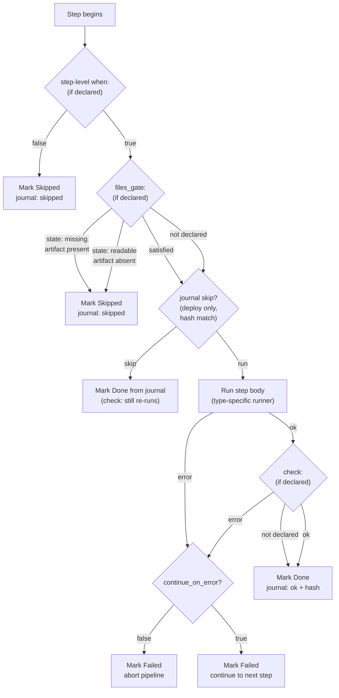

# Pipelines

The phase → step → condition execution model that `dwe deploy`, `dwe run`, `dwe stop`, and `dwe reset` all share. One grammar, one runner, one journal.

## Contents

- [One grammar, three commands](#one-grammar-three-commands)
- [Phases and steps](#phases-and-steps)
- [Step types](#step-types)
- [Conditions: `when:`, `check:`, `files_gate:`](#conditions-when-check-files_gate)
- [Per-step execution flow](#per-step-execution-flow)
- [Parallel step groups](#parallel-step-groups)
- [Sub-step overrides on workflow targets](#sub-step-overrides-on-workflow-targets)
- [Where to go next](#where-to-go-next)

## One grammar, three commands

Five user-facing commands run a pipeline:

| Command | File | Default when absent |
|---------|------|---------------------|
| `dwe deploy run` | `workspace/deploy.yml` + per-service `workspace/services/<svc>/deploy.yml` | Built-in `services → start → post-deploy` pipeline. |
| `dwe run` | `lifecycle.yml` → `run:` | Built-in `start` phase that calls `docker up --wait`. |
| `dwe stop` | `lifecycle.yml` → `stop:` | Built-in `stop` phase that calls `docker down`. |
| `dwe restart` | `lifecycle.yml` (both sections) | Runs `stop` then `run --no-update`. |
| `dwe reset run` | `workspace/reset.yml` (+ per-service `reset.yml`) | Built-in `pre → stop → cleanup` pipeline. |

Every file declares the same shape — an ordered list of phases, each holding an ordered list of steps. A single runner drives all of them and does not know which command called it. That is why per-service deploy files, the orchestrator deploy file, the lifecycle `run:` / `stop:` blocks, and the reset file all accept the same step grammar.

Two grammar extensions are command-scoped:

- **`deploy_services: true`** on a phase is the orchestrator marker that inlines per-service deploy pipelines. It is allowed in `workspace/deploy.yml` only — rejected at load time in `lifecycle.yml` and `reset.yml`.
- **`after:`** at the top level of a per-service `deploy.yml` declares deploy-time ordering between services. It is rejected in the orchestrator file, in `reset.yml`, and in per-service `reset.yml`.

Everything else — `when:`, `check:`, `files_gate:`, `continue_on_error:`, `skip_confirm:`, `untracked:`, `parallel:` — is shared.

## Phases and steps

A phase groups steps that belong together logically: `pre`, `start`, `services`, `post-deploy`, `cleanup`. Phases are ordered; a failure inside a phase aborts the phase and skips everything after it (unless the failing step opted into `continue_on_error: true`).

A step is the leaf unit of work. Every step that actually executes declares a `type:` plus a `cmd:` payload. The step counter `[N/M]` in the reporter footer enumerates leaf steps across the whole pipeline.

Three knobs adjust how a phase or step shows up:

- **`untracked: true`** on a phase or step excludes it from the `[N/M]` counter and suppresses start/done lines. Failures still surface. Useful for `post-deploy` info dumps and for `_auto_reap_daemons` book-keeping the stop pipeline prepends automatically.
- **`continue_on_error: true`** turns a failure from "abort" to "report and move on". The next step runs as usual. Use this on optional pre/post hook phases; never on the core lifecycle steps that must succeed.
- **`skip_confirm: true`** propagates `--yes` into a single step regardless of the pipeline-wide flag. ORed with the pipeline-level flag and (in parallel groups) with the group-level flag — monotonic, never un-set.

## Step types

The `type:` field selects the runner:

| `type:` | Runner | Use case |
|---------|--------|----------|
| `shell` | `sh -c` via `config.ShellBin` | Inline shell with full shell semantics (globs, pipes, redirection). |
| `dwe` | Recursive call into the DWE binary | Compose passthroughs (`docker up`, `docker down`), render commands, `info`, anything reachable as a dwe subcommand. |
| `command` | Declarative command from `workspace/commands/` | Workflow / service-exec / service-run / builtin / daemon / script / shell / dwe commands declared in the registry. |
| `builtin` | Engine-internal Go function | In-process action with access to the merged config. Same registry user commands use. |

Two short names look alike — they are not the same thing:

- **`type: shell` step** runs your `cmd:` through the project's configured shell (`config.ShellBin`). A project may pin `zsh` and the step body uses `zsh`.
- **`cmd: shell` builtin** runs the value of `with.cmd:` through a hardcoded `sh -c` for POSIX portability. Used inside `when:` predicates and inside `check:` actions where portability across CI matters more than feature parity.

`when:` predicates always use the hardcoded `sh` for portability. `check:` actions can use either: pick `cmd: shell` (builtin) for portable assertions, pick `type: shell` (step-shape action) when you need the project's shell features.

Full type reference: [`config/deploy/steps.md`](../config/deploy/steps.md). Builtin catalogue: [`config/deploy/builtins.md`](../config/deploy/builtins.md).

## Conditions: `when:`, `check:`, `files_gate:`

Three directives gate a step:

- **`when:`** — pre-condition. Evaluated before the body runs. Falsy → step skipped (not failed). Typed as `builtin` (filesystem predicates like `dir-empty`), `shell` (hardcoded `sh -c`), or `template` (Go template against the merged `DweConfig`).
- **`check:`** — post-action. Evaluated after the body succeeds. Failure → step is reported as failed. Same `type:` shape as a step body (`shell` / `dwe` / `command` / `builtin`), but its return value gates the step's success status rather than producing user-visible output.
- **`files_gate:`** — file-spec gate. References a command's declared `files:` block. `state: readable` runs the step iff every probed file exists; `state: missing` runs the step iff none of them do.

Two interactions matter:

- `when:` and `files_gate:` are **AND**'ed. If `when:` is false the gate is never evaluated.
- `files_gate:` interacts asymmetrically with the deploy state journal. `state: missing` bypasses journal-skip (producer pattern — re-runs whenever the artifact is missing). `state: readable` respects journal-skip (consumer pattern — runs once, then the journal carries the load). Adding or changing a `files_gate:` invalidates the recorded step hash, so the next run re-evaluates from scratch.

The condition catalogue (predicates, actions, template helpers) lives at [`config/conditions.md`](../config/conditions.md). The deploy-side semantics are at [`config/deploy/conditions.md`](../config/deploy/conditions.md).

## Per-step execution flow

Once a phase starts and its phase-level `when:` passes, each step inside the phase runs through the same sequence:



Three things to notice about the diagram:

- The journal-skip decision belongs to `dwe deploy run` only. `dwe run` / `stop` / `restart` and `dwe reset run` execute every reachable step on every invocation — there is no "this already ran" optimization outside deploy.
- `check:` is skipped when `continue_on_error: true` and the body failed. It is also re-evaluated when the journal would otherwise skip the step — that is what keeps `check:` honest as an idempotency assertion.
- A step that was journal-skipped still consumes one slot in `[N/M]` and one row in the live reporter; it just settles immediately as `◎ Skipped (cached)`.

## Parallel step groups

A step may declare a `parallel:` block instead of a leaf body. The runner spawns each sub-step in its own goroutine through `errgroup.WithContext`, bounded by a semaphore:

```yaml
steps:
  - name: db-dumps
    skip_confirm: true            # OR-merged into every sub-step
    parallel:
      max_concurrent: 4           # default min(NumCPU, len(steps))
      fail_fast: true             # default true
      steps:                      # required, >= 2
        - name: download-main
          type: command
          cmd: services.main.db.dump-download
        - name: download-stock
          type: command
          cmd: services.stock.db.dump-download
        - name: download-price
          type: command
          cmd: services.price.db.dump-download
```

Five rules that follow from the design:

- **Flat groups.** A sub-step cannot itself declare a `parallel:` block. If you need a DAG, split it across phases.
- **Group-level `when:`** is evaluated once before launching sub-steps. Each sub-step's own `when:` still runs inside the goroutine.
- **`fail_fast: true`** cancels siblings via the parent `context.Context`. `exec.CommandContext` sends SIGTERM, then SIGKILL after a 5-second `WaitDelay`. No orphan `docker compose` or `sleep` children after a clean abort.
- **Per-sub-step journaling.** The deploy journal records each sub-step under `(phase, sub-step.name)`. Reordering or adding sub-steps does not invalidate siblings, because `journal.StepHash` is computed from the sub-step alone.
- **No PTY in sub-steps.** Granting a child a PTY when stdin is the empty reader makes `docker compose exec/run` fail. Use a sequential step when you need an interactive console.

The reporter swaps the LiveLine footer for a LiveBlock during a parallel group, with one row per sub-step, the pipeline-wide `[N/M]` index per row, and a frame-aware parser that normalises `\r` progress lines into one frame per visible row. Full output goes to `.dwe/logs/parallel/<pipeline>/<group>/<sub>.log`.

Full schema, defaults, validation rules, and execution semantics: [`config/deploy/examples.md → Parallel step groups`](../config/deploy/examples.md#parallel-step-groups).

## Sub-step overrides on workflow targets

A `type: command` step that targets a workflow can attach per-sub-step gating to that workflow without modifying the workflow definition:

```yaml
- name: db-dumps-deploy
  type: command
  cmd: services.main.db.dumps-deploy   # a workflow with a parallel block
  skip_confirm: true
  sub_step_overrides:
    deploy-main:
      files_gate:
        state: readable
        command: services.main.db.dump-deploy
    deploy-stock:
      files_gate:
        state: readable
        command: services.main.db.dump-deploy
        with: { database: "${db.stock_database}" }
```

The workflow stays opaque and reusable; the gating decision belongs to the pipeline step that invoked it. Overrides only apply when the workflow is invoked via the originating step; the same workflow invoked ad-hoc (`dwe commands run …`) or as a sub-step of another workflow runs as written. In v1 only `files_gate` is overridable, and overrides cannot target a sub-step whose command is itself a workflow.

This is the canonical answer to "I want per-element gating in a workflow without forking the workflow into N variants".

## Where to go next

- [`deploy.yml` / `reset.yml` reference](../config/deploy/index.md) — top-level fields, phase fields, step fields, idempotency and state journal interaction.
- [Step execution types](../config/deploy/steps.md) — `shell`, `dwe`, `command`, `builtin`; `cmd: shell` builtin vs `type: shell` step.
- [Conditions catalogue](../config/conditions.md) — every predicate and typed action available to `when:` / `check:` / `files_gate:`.
- [`lifecycle.yml`](../config/lifecycle.md) — `run:` / `stop:` pipelines, `run.update` probe, hook phase conventions.
- [Reset](../config/reset.md) — project-wide and per-service reset, the always-on baseline, pending-state lifecycle.
- [State and locks](state-and-locks.md) — how the deploy journal records hashes and decides what to skip, and how `deploy.lock` / `snapshot.lock` serialise concurrent runs.
