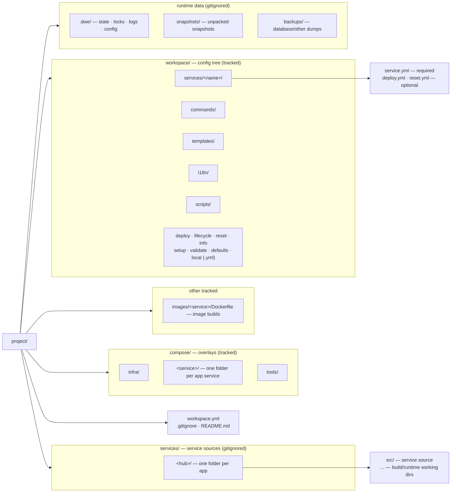

# Project layout

What a typical DWE project looks like on disk: the tracked config tree under `workspace.yml` + `workspace/`, the parallel `compose/` overlays, the runtime-managed `.dwe/` artifacts, and the conventional folders for configs, volumes, and snapshots.

## Contents

- [The shape of a project](#the-shape-of-a-project)
- [Root files](#root-files)
- [The `workspace/` config tree](#the-workspace-config-tree)
- [The `compose/` overlays](#the-compose-overlays)
- [Service images (`images/`)](#service-images-images)
- [Rendered config files and dumps](#rendered-config-files-and-dumps)
- [Service sources (`services/`)](#service-sources-services)
- [Runtime-managed `.dwe/`](#runtime-managed-dwe)
- [Tracked-by-git summary](#tracked-by-git-summary)
- [Where to go next](#where-to-go-next)

## The shape of a project

A DWE project is any directory whose root contains a `workspace.yml`. The CLI walks upward from the current working directory to find it. Around that anchor, three folder families coexist:

- The **tracked config tree** under `workspace/` and the project-root config files — checked in, versioned, the source of truth for project shape.
- The **tracked runtime overlays** — Docker Compose files under `compose/` and image build contexts (`images/<service>/Dockerfile`) for services built from source. DWE does not generate these; they live alongside the config tree and are referenced from it. (Per-service runtime config files — `.env`, `env.php`, … — are *rendered* from a [config template pack](../render/config.md) into each service's hub dir.)
- The **runtime data** that DWE and the containers produce — `.dwe/` (CLI bookkeeping), `snapshots/` (unpacked snapshot stash), and `backups/` (database and other dumps). Gitignored. Persistent container data lives in Docker-managed named volumes.



Folder names other than `workspace.yml` and `workspace/` are conventions, not requirements. The CLI is happy to find `compose/` files anywhere — services reference them by relative path in `service.yml` (`compose: [compose/web/overlay.yml]`). The folders below describe the layout most projects converge on; the only constraints the CLI imposes are the per-service folder under `workspace/services/` and the project-root `workspace.yml`.

## Root files

| File | Purpose | Reader | Writer | Tracked |
|------|---------|--------|--------|---------|
| `workspace.yml` | Project identity: `project.name`, `project.prefix` | CLI on every invocation | Author manually | yes |
| `.gitignore` | Hides `.dwe/`, `/services/`, `snapshots/`, `backups/`, and `workspace/local.yml` from version control | git | Author manually | yes |
| `README.md` | Project-specific entry point (not the DWE CLI README) | humans | Author manually | yes |

A minimal `workspace.yml`:

```yaml
project:
  name: my-project
  prefix: myprefix
```

The full field reference lives in [`workspace.yml`](../config/workspace.md).

## The `workspace/` config tree

Everything declarative about a project — services, pipelines, commands, templates, translations — lives under `workspace/`. The CLI loads this tree on startup; nothing outside it (apart from `workspace.yml` and the `compose/` files it references) participates in project configuration.

| Path | Purpose | Reader | Writer | Tracked |
|------|---------|--------|--------|---------|
| `workspace/defaults.yml` | Versioned project defaults: `services.<name>.enabled`, `runtime`, `state`, `exports.env`, `compose`, `services.<name>.render.ide` | CLI (merge layer 2) | Author manually | yes |
| `workspace/local.yml` | Per-developer overrides on top of `defaults.yml`: port overrides, enabled flags, credentials, wizard answers | CLI (merge layer 3) | Author manually + setup wizard + `dwe services enable/disable` | no |
| `workspace/services/<name>/` | One folder per service. Folder name is the service ID — there is no `name:` field. | CLI service loader | Author manually | yes (except `local.yml` overrides) |
| `workspace/commands/` | Declarative user commands surfaced under `dwe <name>` | CLI command registry | Author manually | yes |
| `workspace/templates/` | Template packs consumed by `dwe render` — one subdir per kind: `config/`, `ai/`, `git/`, `ide/`, each holding `<pack>/manifest.yml` + files (`render env` uses no pack). The `config/` packs render per-service runtime config files (`.env`, …) into the service hub | CLI render pipeline | Author manually | yes |
| `workspace/i18n/` | Per-locale string overrides (`<lang>.yml`); paired with embedded defaults | CLI i18n store | Author manually + translators | yes |
| `workspace/scripts/` | Shell scripts referenced from declarative commands and pipelines | Pipeline steps + user commands | Author manually | yes |
| `workspace/deploy.yml` | Top-level deploy orchestrator pipeline. Optional — DWE has a built-in default. | Deploy executor | Author manually | yes |
| `workspace/lifecycle.yml` | `run` / `stop` / `restart` phases and hooks | Lifecycle executor | Author manually | yes |
| `workspace/reset.yml` | Project reset pipeline | Reset executor | Author manually | yes |
| `workspace/info.yml` | Info dashboard items (header, URLs, hosts, commands, custom sections) | `dwe info` renderer | Author manually | yes |
| `workspace/setup.yml` | Setup wizard questions (input / confirm / select / multiselect) | Setup workflow | Author manually | yes |
| `workspace/validate.yml` | Project-readiness checks (`shell` / `file_exists` / `tcp_reachable` / …) | `dwe validate` + preflight | Author manually | yes |
| `workspace/tests/` | Integration-test scenarios (`<name>.yml`) run against a disposable project copy | `dwe test` / `dwe validate tests` | Author manually | yes |
| `workspace/docker.yml` | Compose orchestration layer: project-name template, file list, topology, hidden services | Docker subsystem | Author manually | yes |
| `workspace/docker.local.yml` | Per-developer compose overrides deep-merged on top of `docker.yml` | Docker subsystem | Author manually | no |
| `workspace/styles.yml` | Semantic-token palette (accent / success / warning / danger / muted / border / text) | UI styling | Author manually | yes |

### Per-service folder

The configuration for each service lives in `workspace/services/<name>/`. The folder name is the canonical service ID; renaming the folder renames the service. The folder always has `service.yml`; optional `deploy.yml` and `reset.yml` declare per-service pipelines that the orchestrator inlines at the right point in topological order.

```text
workspace/services/web/
├── service.yml      # required: type, container, compose, ports, hosts, configs, dirs
├── deploy.yml       # optional: per-service deploy pipeline
└── reset.yml        # optional: per-service reset pipeline
```

The per-type field allowlist (which fields a `type: app` / `type: tool` / `type: infra` may declare) is enforced strictly — see [`services/fields.md`](../config/services/fields.md).

### `defaults.yml` vs `local.yml` vs `workspace.yml`

These three files merge into a single effective configuration:

1. `workspace.yml` establishes structure (project identity, schema version).
2. `workspace/defaults.yml` fills in tracked defaults.
3. `workspace/local.yml` overrides per-developer values (gitignored).

Each layer is optional; missing keys fall through to the layer below. Service-port maps and host maps are deep-merged by entry name, so `local.yml` can override one port without re-listing the others. See [`workspace.yml`](../config/workspace.md) for the merge model in detail.

## The `compose/` overlays

`compose/` holds the Docker Compose files referenced from `workspace/services/<name>/service.yml`. DWE does not generate or own these files — it composes a list of them at runtime and passes that list to `docker compose -f a.yml -f b.yml …`.

| Path | Purpose | Reader | Writer | Tracked |
|------|---------|--------|--------|---------|
| `compose/infra/` | Overlays for `type: infra` services (databases, queues, caches) | Docker Compose via DWE | Author manually | yes |
| `compose/<service>/` | Overlay for a specific `type: app` service — one folder per app | Docker Compose via DWE | Author manually | yes |
| `compose/tools/` | Overlays for `type: tool` services (admin UIs, one-shot utilities) | Docker Compose via DWE | Author manually | yes |

A typical service overlay declares the container image, mounts from the service's hub dir (where rendered config files land), and any environment exported from `defaults.yml`:

```yaml
services:
  web:
    image: nginx:latest
    container_name: ${PROJECT}-web
    volumes:
      - ./services/web/src:/var/www/html
      - ./services/web/nginx.conf:/etc/nginx/conf.d/default.conf  # rendered by `dwe render config`
    ports:
      - "${WEB_HTTP_PORT}:80"
```

The compose file list also picks up `workspace/docker.local.yml` last, so per-developer overrides (alternate images, debug ports, extra volumes) compose on top of the tracked overlays without editing them. See [`docker.yml`](../config/docker.md) and [Docker integration](docker.md) for the full assembly.

## Service images (`images/`)

Services built from source — rather than pulled from a registry — keep their build context under `images/<service>/`, with a `Dockerfile` at its root. The compose overlay points `build:` at that folder:

```yaml
services:
  web:
    build:
      context: ../images/web
    container_name: ${PROJECT}-web
```

`images/` is tracked: the Dockerfile and its build context are part of the project. The folder name is the service name, referenced by the overlay's `build.context`.

## Rendered config files and dumps

Runtime config files (`.env`, `env.php`, an `nginx.conf`, …) are **rendered** from a [config template pack](../render/config.md) under `workspace/templates/config/<pack>/` straight into each service's hub dir, where the compose overlay mounts them. Service-minted secrets (Laravel `APP_KEY`, …) are harvested into the gitignored `.dwe/generated.yml` store and replayed on every render. Author the pack under `workspace/templates/config/`.

One conventional folder still sits next to the config tree:

| Path | Purpose | Reader | Writer | Tracked |
|------|---------|--------|--------|---------|
| `backups/…` | Database and other dumps produced during development | Operator / project commands | Operator / project commands | no |

`backups/` is gitignored because it holds generated dumps that vary per machine. Persistent container data (databases, uploads, caches) lives in Docker-managed named volumes.

## Service sources (`services/`)

The gitignored project-root `services/` directory holds the **source code** of the application services — checked out or cloned per machine, never tracked by the project repo. It is created on demand (e.g. by a deploy step or a project command) rather than scaffolded.

Inside it, one folder per app — its *hub* — groups everything that app owns; each hub has at least a `src/` directory with the service source:

```text
services/                # gitignored
└── <hub>/               # one folder per app
    ├── src/             # service source (its own git repo / worktree)
    └── …                # build output, working dirs, etc.
```

The `src/` checkout is a normal nested repository — its own `.gitignore` is the application's concern, not DWE's. Compose overlays bind-mount from here (`./services/<hub>/src:/var/www/html`), and `dwe render git` installs hooks at `services/<hub>/src/.git/hooks/`. Because the whole tree is root-anchored under `/services/` in `.gitignore`, the tracked `workspace/services/` config tree is unaffected.

## Runtime-managed `.dwe/`

Everything DWE writes during normal operation lands under `.dwe/`. The folder is gitignored and safe to delete — the next pipeline run rebuilds whatever it needs.

| Path | Purpose | Reader | Writer | Tracked |
|------|---------|--------|--------|---------|
| `.dwe/deploy/state.yml` | Idempotent deploy journal: per-step `action_hash`, `status`, `started_at`, `duration` | Deploy executor + `dwe deploy state show` | Deploy executor | no |
| `.dwe/deploy/deploy.lock` | Exclusive `flock` held during `dwe deploy run` | Lock subsystem | Lock subsystem | no |
| `.dwe/snapshots/snapshot.lock` | Exclusive `flock` held during snapshot mutations | Lock subsystem | Lock subsystem | no |
| `.dwe/snapshots/current` | Pointer to the active snapshot, set by `snapshot create` and `snapshot restore` (cleared on `snapshot remove`) | Snapshot subsystem | Snapshot subsystem | no |
| `.dwe/snapshots/.pre-restore-backup/` | Pre-restore copy of `workspace/local.yml` + deploy state, for manual recovery | Operator (manual) | Snapshot subsystem | no |
| `.dwe/logs/deploy.log` | Combined stdout/stderr of the most recent `dwe deploy run` (written by default; suppress with `log: false`) | Operator (manual) | Deploy executor | no |
| `.dwe/logs/run.log` · `stop.log` · `reset.log` | Combined stdout/stderr of the matching lifecycle phase (when `log: true`) | Operator (manual) | Lifecycle / reset executors | no |
| `.dwe/config` | Per-project user-config override (language, mermaid theme, notification gates) | CLI on every invocation | Author manually | no |

### Lock ordering

Project-mutating commands acquire `deploy.lock` before `snapshot.lock` (alphabetical order) and release them in reverse. Reads (docs, status) take no locks. See [State and locks](state-and-locks.md).

### Crash recovery

The state file is written atomically after every step. If a deploy is interrupted, the next `dwe deploy run` finds the last-known status, treats the in-progress step as failed, and re-runs from there. Stale `flock` files left by a `kill -9` are detected (the lock file holds the holding PID; if the process is gone, the lock is treated as stale) and silently reclaimed.

## Tracked-by-git summary

A clean `.gitignore` for a DWE project covers the runtime-managed paths. The runtime never writes outside these folders.

```text
.dwe/
/services/
snapshots/
backups/
workspace/local.yml
workspace/docker.local.yml
```

Everything else — `workspace.yml`, the rest of `workspace/` (including the `workspace/templates/config/` packs), all of `compose/` — is tracked. Authors edit the tracked tree; the CLI writes only inside the gitignored folders (with one exception: the setup wizard and `dwe services enable/disable` append to `workspace/local.yml`, which is itself gitignored).

## Where to go next

- [Getting started](getting-started.md) — build the binary, enter a project, run your first `dwe deploy`.
- [Architecture](architecture.md) — how the CLI itself is composed, and what is embedded vs read from disk.
- [Docker integration](docker.md) — how the compose file list is assembled from the folders above.
- [State and locks](state-and-locks.md) — what `.dwe/deploy/state.yml` records and how the locks serialise mutations.
- [`workspace.yml`](../config/workspace.md) — field-level reference for the three-layer config.
- [`services/`](../config/services/index.md) — per-service folder structure and the per-type field allowlist.
