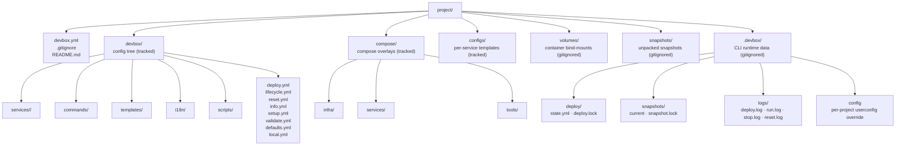

# Project layout

What a typical Devbox project looks like on disk: the tracked config tree under `devbox.yml` + `devbox/`, the parallel `compose/` overlays, the runtime-managed `.devbox/` artifacts, and the conventional folders for configs, volumes, and snapshots.

## Contents

- [The shape of a project](#the-shape-of-a-project)
- [Root files](#root-files)
- [The `devbox/` config tree](#the-devbox-config-tree)
- [The `compose/` overlays](#the-compose-overlays)
- [Per-service runtime data](#per-service-runtime-data)
- [Runtime-managed `.devbox/`](#runtime-managed-devbox)
- [Tracked-by-git summary](#tracked-by-git-summary)
- [Where to go next](#where-to-go-next)

## The shape of a project

A Devbox project is any directory whose root contains a `devbox.yml`. The CLI walks upward from the current working directory to find it. Around that anchor, three folder families coexist:

- The **tracked config tree** under `devbox/` and the project-root config files — checked in, versioned, the source of truth for project shape.
- The **tracked runtime overlays** — Docker Compose files under `compose/` and per-service config templates under `configs/`. Devbox does not generate these; they live alongside the config tree and are referenced from it.
- The **runtime data** that Devbox and the containers produce — `.devbox/` (CLI bookkeeping), `volumes/` (bind-mount targets), and `snapshots/` (unpacked snapshot stash). Gitignored.



Folder names other than `devbox.yml` and `devbox/` are conventions, not requirements. The CLI is happy to find `compose/` files anywhere — services reference them by relative path in `service.yml` (`compose: [compose/services/web.yml]`). The folders below describe the layout most projects converge on; the only constraints the CLI imposes are the per-service folder under `devbox/services/` and the project-root `devbox.yml`.

## Root files

| File | Purpose | Reader | Writer | Tracked |
|------|---------|--------|--------|---------|
| `devbox.yml` | Project identity: `schema_version`, `project.name`, `project.prefix`, optional binary overrides | CLI on every invocation | Author manually | yes |
| `.gitignore` | Hides `.devbox/`, `volumes/`, `snapshots/`, and `devbox/local.yml` from version control | git | Author manually | yes |
| `README.md` | Project-specific entry point (not the Devbox CLI README) | humans | Author manually | yes |

A minimal `devbox.yml`:

```yaml
schema_version: "2"

project:
  name: my-project
  prefix: devbox
```

The full field reference lives in [`devbox.yml`](../config/devbox.md).

## The `devbox/` config tree

Everything declarative about a project — services, pipelines, commands, templates, translations — lives under `devbox/`. The CLI loads this tree on startup; nothing outside it (apart from `devbox.yml` and the `compose/` files it references) participates in project configuration.

| Path | Purpose | Reader | Writer | Tracked |
|------|---------|--------|--------|---------|
| `devbox/defaults.yml` | Versioned project defaults: `services.<name>.enabled`, `runtime`, `state`, `exports.env`, `compose`, `ide` | CLI (merge layer 2) | Author manually | yes |
| `devbox/local.yml` | Per-developer overrides on top of `defaults.yml`: port overrides, enabled flags, credentials, wizard answers | CLI (merge layer 3) | Author manually + setup wizard | no |
| `devbox/services/<name>/` | One folder per service. Folder name is the service ID — there is no `name:` field. | CLI service loader | Author manually | yes (except `local.yml` overrides) |
| `devbox/commands/` | Declarative user commands surfaced under `devbox <name>` | CLI command registry | Author manually | yes |
| `devbox/templates/` | Template packs consumed by `devbox render` (env / ide / ai / git) | CLI render pipeline | Author manually | yes |
| `devbox/i18n/` | Per-locale string overrides (`<lang>.yml`); paired with embedded defaults | CLI i18n store | Author manually + translators | yes |
| `devbox/scripts/` | Shell scripts referenced from declarative commands and pipelines | Pipeline steps + user commands | Author manually | yes |
| `devbox/deploy.yml` | Top-level deploy orchestrator pipeline. Optional — Devbox has a built-in default. | Deploy executor | Author manually | yes |
| `devbox/lifecycle.yml` | `run` / `stop` / `restart` phases and hooks | Lifecycle executor | Author manually | yes |
| `devbox/reset.yml` | Project reset pipeline | Reset executor | Author manually | yes |
| `devbox/info.yml` | Info dashboard items (header, URLs, hosts, commands, custom sections) | `devbox info` renderer | Author manually | yes |
| `devbox/setup.yml` | Setup wizard questions (input / confirm / select / multiselect) | Setup workflow | Author manually | yes |
| `devbox/validate.yml` | Project-readiness checks (`shell` / `file_exists` / `tcp_reachable` / …) | `devbox validate` + preflight | Author manually | yes |
| `devbox/docker.yml` | Compose orchestration layer: project-name template, file list, topology, hidden services | Docker subsystem | Author manually | yes |
| `devbox/docker.local.yml` | Per-developer compose overrides deep-merged on top of `docker.yml` | Docker subsystem | Author manually | no |
| `devbox/styles.yml` | Semantic-token palette (info / success / warn / error / muted / heading / link) | UI styling | Author manually | yes |
| `devbox/ui.yml` | TUI behaviour pointers (`default_expanded_depth`, `auto_collapse_empty`, `show_type_badges`) | TUI renderers | Author manually | yes |
| `devbox/notifications.yml` | Desktop-notification gates per operation | Notify subsystem | Author manually | yes |

### Per-service folder

Each service lives in `devbox/services/<name>/`. The folder name is the canonical service ID; renaming the folder renames the service. The folder always has `service.yml`; optional `deploy.yml` and `reset.yml` declare per-service pipelines that the orchestrator inlines at the right point in topological order.

```text
devbox/services/web/
├── service.yml      # required: type, container, compose, ports, hosts, configs, dirs
├── deploy.yml       # optional: per-service deploy pipeline
└── reset.yml        # optional: per-service reset pipeline
```

The per-type field allowlist (which fields a `type: app` / `type: tool` / `type: infra` may declare) is enforced strictly — see [`services/fields.md`](../config/services/fields.md).

### `defaults.yml` vs `local.yml` vs `devbox.yml`

These three files merge into a single effective configuration:

1. `devbox.yml` establishes structure (project identity, schema version).
2. `devbox/defaults.yml` fills in tracked defaults.
3. `devbox/local.yml` overrides per-developer values (gitignored).

Each layer is optional; missing keys fall through to the layer below. Service-port maps and host maps are deep-merged by entry name, so `local.yml` can override one port without re-listing the others. See [`devbox.yml`](../config/devbox.md) for the merge model in detail.

## The `compose/` overlays

`compose/` holds the Docker Compose files referenced from `devbox/services/<name>/service.yml`. Devbox does not generate or own these files — it composes a list of them at runtime and passes that list to `docker compose -f a.yml -f b.yml …`.

| Path | Purpose | Reader | Writer | Tracked |
|------|---------|--------|--------|---------|
| `compose/infra/` | Overlays for `type: infra` services (databases, queues, caches) | Docker Compose via Devbox | Author manually | yes |
| `compose/services/` | Overlays for `type: app` services | Docker Compose via Devbox | Author manually | yes |
| `compose/tools/` | Overlays for `type: tool` services (admin UIs, one-shot utilities) | Docker Compose via Devbox | Author manually | yes |

A typical service overlay declares the container image, mounts from the project's `volumes/` and `configs/` folders, and any environment exported from `defaults.yml`:

```yaml
services:
  web:
    image: nginx:latest
    container_name: ${PROJECT}-web
    volumes:
      - ./services/web/src:/var/www/html
      - ./configs/web/nginx.conf:/etc/nginx/conf.d/default.conf
    ports:
      - "${WEB_HTTP_PORT}:80"
```

The compose file list also picks up `devbox/docker.local.yml` last, so per-developer overrides (alternate images, debug ports, extra volumes) compose on top of the tracked overlays without editing them. See [`docker.yml`](../config/docker.md) and [Docker integration](docker.md) for the full assembly.

## Per-service runtime data

Two folders typically sit next to the config tree and hold runtime data that the containers read or write.

| Path | Purpose | Reader | Writer | Tracked |
|------|---------|--------|--------|---------|
| `configs/<service>/…` | Per-service config templates copied into containers via `service.yml.configs:` | Containers (read) | Author manually | yes |
| `volumes/<service>/…` | Bind-mount targets for persisted container data (databases, uploads, caches) | Containers (read/write) | Containers (write) | no |

`configs/` is tracked because the templates are part of the project; `volumes/` is gitignored because it contains generated runtime data that varies per machine.

The exact folder names are conventions — services reference them by relative path in the compose overlay and the `configs:` block of `service.yml`. A project may use `etc/` instead of `configs/`, or split volumes per service folder (`devbox/services/<name>/var/`). The layout above is the most common shape.

## Runtime-managed `.devbox/`

Everything Devbox writes during normal operation lands under `.devbox/`. The folder is gitignored and safe to delete — the next pipeline run rebuilds whatever it needs.

| Path | Purpose | Reader | Writer | Tracked |
|------|---------|--------|--------|---------|
| `.devbox/deploy/state.yml` | Idempotent deploy journal: per-step `action_hash`, `status`, `started_at`, `duration` | Deploy executor + `devbox deploy state show` | Deploy executor | no |
| `.devbox/deploy/deploy.lock` | Exclusive `flock` held during `devbox deploy run` | Lock subsystem | Lock subsystem | no |
| `.devbox/snapshots/snapshot.lock` | Exclusive `flock` held during snapshot mutations | Lock subsystem | Lock subsystem | no |
| `.devbox/snapshots/current` | Pointer to the active snapshot, set by `snapshot restore` | Snapshot subsystem | Snapshot subsystem | no |
| `.devbox/snapshots/.pre-restore-backup/` | Pre-restore copy of `devbox/local.yml` + deploy state, for manual recovery | Operator (manual) | Snapshot subsystem | no |
| `.devbox/logs/deploy.log` | Combined stdout/stderr of the most recent `devbox deploy run` (when `log: true`) | Operator (manual) + `devbox logs` | Deploy executor | no |
| `.devbox/logs/run.log` · `stop.log` · `reset.log` | Combined stdout/stderr of the matching lifecycle phase (when `log: true`) | Operator (manual) + `devbox logs` | Lifecycle / reset executors | no |
| `.devbox/config` | Per-project user-config override (language, mermaid theme, notification gates) | CLI on every invocation | Author manually | no |

### Lock ordering

Project-mutating commands acquire `deploy.lock` before `snapshot.lock` (alphabetical order) and release them in reverse. Reads (docs, status) take no locks. See [State and locks](state-and-locks.md).

### Crash recovery

The state file is written atomically after every step. If a deploy is interrupted, the next `devbox deploy run` finds the last-known status, treats the in-progress step as failed, and re-runs from there. Stale `flock` files left by a `kill -9` are detected (the lock file holds the holding PID; if the process is gone, the lock is treated as stale) and silently reclaimed.

## Tracked-by-git summary

A clean `.gitignore` for a Devbox project covers the runtime-managed paths. The runtime never writes outside these folders.

```text
.devbox/
volumes/
snapshots/
devbox/local.yml
devbox/docker.local.yml
```

Everything else — `devbox.yml`, the rest of `devbox/`, all of `compose/`, all of `configs/` — is tracked. Authors edit the tracked tree; the CLI writes only inside the gitignored folders (with one exception: the setup wizard appends merged answers to `devbox/local.yml`, which is itself gitignored).

## Where to go next

- [Getting started](getting-started.md) — build the binary, enter a project, run your first `devbox deploy`.
- [Architecture](architecture.md) — how the CLI itself is composed, and what is embedded vs read from disk.
- [Docker integration](docker.md) — how the compose file list is assembled from the folders above.
- [State and locks](state-and-locks.md) — what `.devbox/deploy/state.yml` records and how the locks serialise mutations.
- [`devbox.yml`](../config/devbox.md) — field-level reference for the three-layer config.
- [`services/`](../config/services/index.md) — per-service folder structure and the per-type field allowlist.
