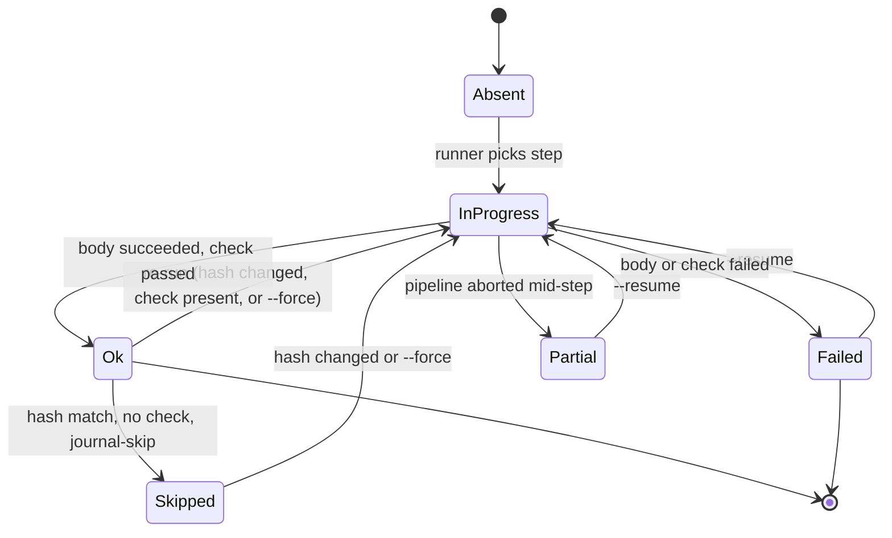

# State and Locks

How DWE remembers what has already been deployed, how it serialises concurrent runs, how it recovers from a crash mid-pipeline, and how pending state defers work between `dwe services enable` and the next `dwe deploy run`.

## Contents

- [Why a journal at all](#why-a-journal-at-all)
- [The state journal](#the-state-journal)
- [Hashes drive skip decisions](#hashes-drive-skip-decisions)
- [Step status transitions](#step-status-transitions)
- [Project locks](#project-locks)
- [Crash recovery](#crash-recovery)
- [Pending state](#pending-state)
- [Where to go next](#where-to-go-next)

## Why a journal at all

The deploy pipeline is meant to be safe to re-run. Editing one service config should re-run the steps that touch that service, not the whole project. Re-running a deploy on an unchanged codebase should finish in seconds, not minutes. A deploy killed by `Ctrl+C` halfway through should be able to pick up where it left off.

DWE achieves this with one on-disk file per project, `.dwe/deploy/state.yml`, and two cooperating file locks, `.dwe/deploy/deploy.lock` and `.dwe/snapshots/snapshot.lock`. The journal records what ran and what each step's body looked like; the locks serialise concurrent mutators so the journal can never be written by two processes at once.

> The journal is for the deploy pipeline only. `dwe run`, `dwe stop`, `dwe restart`, and `dwe reset run` execute every reachable step on every invocation — there is no "this already ran" optimisation outside deploy. Daemons (`type: daemon` commands) have no journal either: `docker ps` filtered on the standard `dwe.*` labels is the single source of truth for which daemons are running.

## The state journal

`.dwe/deploy/state.yml` is created and maintained by `dwe deploy run`. It is not checked into version control (the `.dwe/` prefix is in the project's `.gitignore`). Its shape is:

- A **project** block: `status`, `config_hash`, `deployed_at`, `last_run`, and `phases` for project-level (non-service) phases.
- A **services** map keyed by service folder name. Each entry mirrors the project shape: `status`, `config_hash`, `deployed_at`, `last_run`, `phases`.
- A **pending** block, present only while there are deferred operations (see [Pending state](#pending-state)).

Each step under a phase records its `status`, `finished_at`, `action_hash`, and `duration_ms`. That is enough to decide on the next run whether the step should be skipped, re-run as a resume, or re-run because its body changed.

Field-level reference: [`config/state/schema.md`](../config/state/schema.md). Inspect with `dwe deploy state show`, clear with `dwe deploy state clear`, recompute aggregates with `dwe deploy state repair` ([`config/state/management.md`](../config/state/management.md)).

## Hashes drive skip decisions

Two kinds of hashes settle whether a step's recorded status is still trustworthy.

- **`action_hash`** is a SHA-256 over the step's `type`, `cmd`, and `with:` payload. YAML formatting, comments, and key ordering do not change it (the hash sees the parsed Go struct, not the raw bytes). If you edit a step's body, its hash changes and the step re-runs.
- **`config_hash`** comes in two scopes. The **service** hash covers `workspace/services/<name>/service.yml` + `workspace/services/<name>/deploy.yml` and invalidates every step under that service when it changes. The **project** hash covers tracked services + `workspace/deploy.yml` + per-service `deploy.yml` files for tracked services, and invalidates project-level steps the same way. "Tracked" means the service appears in the resolved plan (enabled + inlined by a `deploy_services: true` phase). Tools are never tracked.

The runner consults the journal in two layers. First it checks that the relevant scope's `config_hash` still matches; if it does not, every step inside that scope is treated as absent. Only if the scope is unchanged does the runner apply the per-step skip table:

| Prior status | Hash match | Has `check:` | Decision |
|---|---|---|---|
| absent | — | — | Run |
| ok | yes | no | Skip |
| ok | yes | yes | Run (check re-validates) |
| ok | no | — | Run |
| failed / partial / in_progress | — | — | Run (resume) |

Two consequences worth remembering:

- A step with a `check:` action never skips on hash match alone. The check is treated as the proof that the step's intended effect is still there, so it always runs.
- Changing `when:` does not show up in `action_hash` — it is re-evaluated on every run regardless of the journal, so it only short-circuits the body. Changing `files_gate:` **does** show up: `StepHash` folds the canonical `files_gate` representation into the recorded hash, so editing it re-runs the step the same way editing the body does.

Full hashing details: [`config/state/hashing.md`](../config/state/hashing.md).

## Step status transitions

A step's recorded status walks a small state machine over its lifetime.

Two non-obvious arcs:

- `Ok → Skipped` is the cached path. The step is not re-executed but still consumes one slot in the `[N/M]` step counter and one row in the reporter, rendered as `◎ Skipped (cached)`.
- `InProgress → Partial` happens when the pipeline is aborted while the step body is mid-flight (the parent context is cancelled, a sibling in a parallel group fails fast, or the host receives `SIGTERM`). On the next run, `--resume` treats `Partial` the same as `Failed`: re-run from this step.

`status` values for phases, services, and the project itself aggregate from the step level. `dwe deploy state repair` recomputes those aggregates from per-step records when something drifts.

## Project locks

Two file locks protect the project from concurrent mutators:

| Lock | Path | Held by |
|------|------|---------|
| `deploy.lock` | `.dwe/deploy/deploy.lock` | `dwe deploy run`, `dwe run`, `dwe stop`, `dwe restart`, `dwe reset run` |
| `snapshot.lock` | `.dwe/snapshots/snapshot.lock` | `dwe snapshot create / restore / rollback / remove / pack / unpack` |

Every lifecycle and snapshot command acquires **both** locks via the single helper `lock.AcquireProjectLocks(baseDir)`. The helper acquires them in **alphabetical order** (`deploy`, then `snapshot`) and the release function unlocks them in **reverse order**. The two-lock design lets a deploy and a snapshot exclude each other without deadlocking, because every caller acquires in the same fixed order.

Lock acquisition uses `flock(LOCK_EX | LOCK_NB)`:

- If the lock is free, the caller takes it and writes its PID into the file.
- If the lock is held by a live process, the call returns a `ProjectLockHeldError` with the holding PID and exit code 2. The CLI surfaces it as `deploy operation in progress: pid 12345 (wait for it to finish or kill it and retry)`.
- If the lock file exists but the PID is dead (`syscall.Kill(pid, 0)` returns `ESRCH`), the lock is treated as stale: the file is truncated and the lock is acquired. This is what makes `kill -9` recoverable on the next invocation.

Read-only commands (`dwe status`, `dwe docs ...`, `dwe info`, `dwe validate`) take no project locks. The docs subsystem in particular is explicitly read-only and never runs preflight, so opening docs while a deploy is running is always safe.

> Never call `lock.Acquire` on `deploy.lock` or `snapshot.lock` directly from command code. Always go through `AcquireProjectLocks`. That keeps the alphabetical-acquire / reverse-release contract intact and prevents one command from skipping the partner lock.

## Crash recovery

The combination of journal + lock + atomic writes is what makes a killed deploy resumable.

1. Before any service step runs, the **service- and project-level** `last_run.status` flips to `in_progress` and is flushed to `state.yml`. Individual step records carry no `in_progress` status — a step's own `status` is written only after it finishes.
2. On success the step's status is written as `ok`, with `finished_at`, `action_hash`, and `duration_ms`.
3. If the process is killed (`Ctrl+C`, `SIGTERM`, `kill -9`, panic, OOM), the file on disk still reflects the last write — a step killed mid-body leaves **no step record at all** (it is simply absent, which resumes via the absent → run path); the in-flight `last_run.status` stays `in_progress`. A step is recorded as `failed` only when its body returns a graceful error.
4. On the next deploy run (or `dwe deploy state repair`), `journal.Recompute` walks the journal: any stuck `last_run.status: in_progress` entry is promoted to `failed` (the process that owned it is gone), and the project/service aggregates are recomputed.
5. The lock left behind is treated as stale on the next acquire (the PID is dead), so the next run proceeds without manual cleanup.
6. The skip table treats `failed` / `partial` / `in_progress` as "run (resume)", so `dwe deploy run --resume` picks up at the first non-`ok` step. In a TTY the runner offers a choice (resume / re-run all / cancel); in non-interactive mode, `--resume` or `--force` is required.

Force a clean slate with `dwe deploy run --force` (clears `state.yml` and re-runs every step) or wipe both journal and pending state with `dwe reset run`.

## Pending state

The `pending` block in `state.yml` captures work that has been queued but not yet applied. The canonical producer is `dwe services enable / disable` without `--apply`: the local override is written to `workspace/local.yml` immediately, but the restart or deploy that would actually realise the change is deferred.

Two operation kinds exist:

- **`restart`** — a stack-wide restart is needed (e.g., a service was disabled and its container should stop).
- **`deploy`** — a per-service deploy is needed (e.g., a service was enabled and its deploy pipeline has not yet run); the affected service names are listed on the op.

Pending operations are merged across sessions: two `services enable a` and `services enable b` calls without `--apply` produce a single `deploy` op listing `[a, b]`. When a consuming command succeeds, only the contributor-owned ops are cleared:

| Event | Effect |
|-------|--------|
| `dwe restart` success | clears the `restart` op; any `deploy` op survives |
| `dwe deploy run` (full project) success | clears the `deploy` op; any `restart` op survives |
| `dwe deploy run --service <name>` success | removes `<name>` from the `deploy` op; removes the op when empty |
| `dwe reset run` (project-wide) success | clears all pending (full journal wipe) |
| `dwe reset run --service <name>` success | writes `{kind: deploy, services: [<name>]}` |

The selective clearing matters: a different operator's pending entry sitting in the same journal must not be erased by an unrelated toggle. That is why the toggle executor uses `ClearPendingOps` with a contributor-derived list, never `ClearPending`.

While `pending` is non-nil, `dwe status` (and its subcommands) prints a warning banner at the top of the output naming the pending action and the command to run. The banner disappears once the corresponding consumer succeeds. Schema and lifecycle reference: [`config/state/schema.md`](../config/state/schema.md#pending-state).

## Where to go next

- [`config/state/index.md`](../config/state/index.md) — file location, journal purpose, snapshot-restore behaviour.
- [`config/state/schema.md`](../config/state/schema.md) — every field at every level of `state.yml`.
- [`config/state/hashing.md`](../config/state/hashing.md) — full hash computation, scope rules, and the skip decision table.
- [`config/state/management.md`](../config/state/management.md) — `dwe deploy state show / clear / repair`, the `--force` and `--resume` flags, non-interactive behaviour.
- [Pipelines](pipelines.md) — how the journal-skip decision fits into the per-step execution flow.
- [Reset](../config/reset.md) — what `dwe reset run` clears, and the always-on baseline that returns a project to a known clean state.
