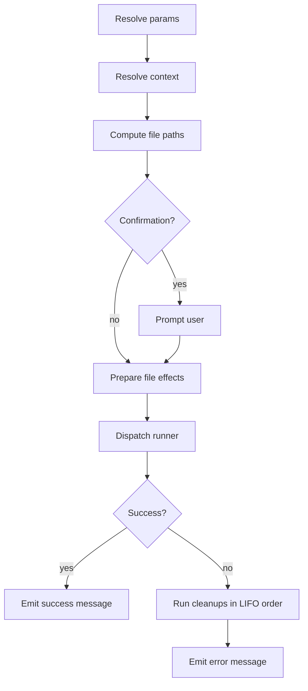
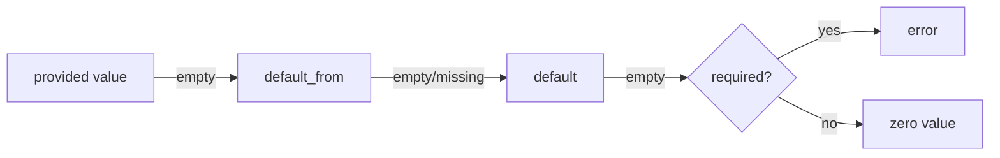
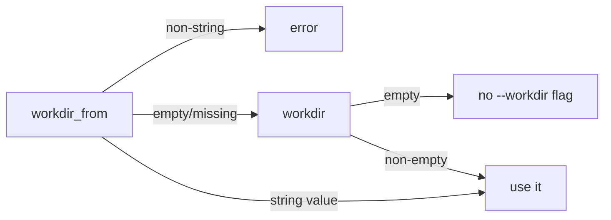
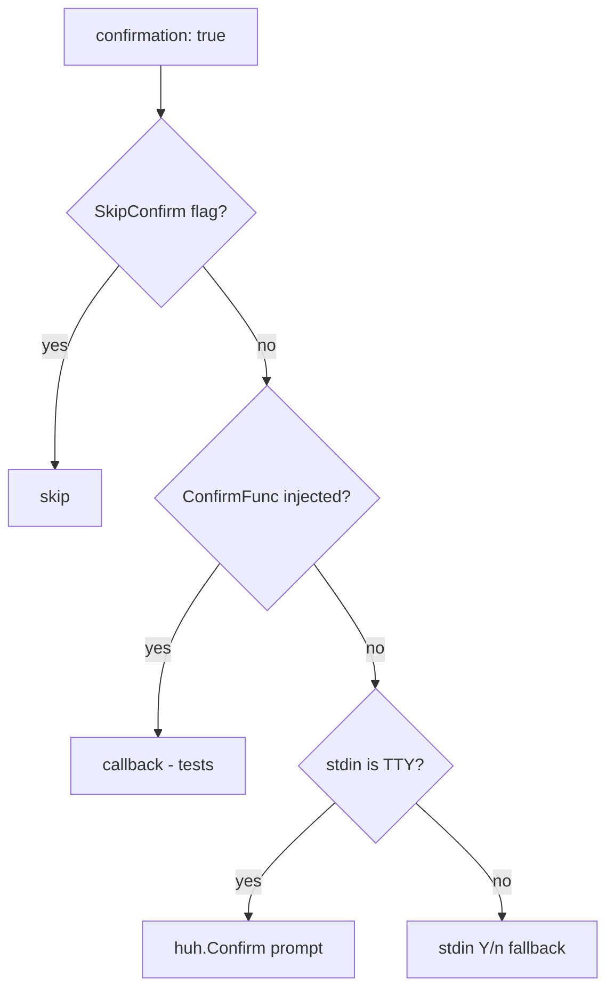

# commands/

Declarative command definitions for the devbox project.

## Contents

- [Purpose](#purpose)
- [File layout and command IDs](#file-layout-and-command-ids)
- [File structure](#file-structure)
- [Execution lifecycle](#execution-lifecycle)
- [Command directives](#command-directives)
  - [Identity and visibility](#identity-and-visibility)
  - [Confirmation](#confirmation)
  - [Messages](#messages)
  - [Params](#params)
  - [Context](#context)
  - [Env](#env)
  - [Files](#files)
- [Templating](#templating)
  - [Namespaces](#namespaces)
  - [Go templates](#go-templates)
  - [Where templates are evaluated](#where-templates-are-evaluated)
- [Command types](#command-types)
  - [`type: shell`](#type-shell)
  - [`type: devbox`](#type-devbox)
  - [`type: script`](#type-script)
  - [`type: service_exec`](#type-service_exec)
  - [`type: service_run`](#type-service_run)
  - [`type: workflow`](#type-workflow)
- [Workdir resolution](#workdir-resolution)
- [Confirmation flow](#confirmation-flow)
- [Visibility, registration, and discovery](#visibility-registration-and-discovery)
- [Command-template space (the full reference)](#command-template-space-the-full-reference)
- [End-to-end examples](#end-to-end-examples)
- [Validation rules (cheat sheet)](#validation-rules-cheat-sheet)
- [Common pitfalls](#common-pitfalls)
- [Related commands](#related-commands)

## Purpose

`devbox/commands/` is the home of every reusable, scriptable action the project exposes through the CLI: container shells, build steps, database operations, multi-step workflows, deploy hooks, custom scripts, etc.

Each YAML file declares one or more named commands. Commands are discovered automatically by walking the directory tree, are addressable by a dot-separated ID, and can be executed directly (`devbox commands run <id>`) or referenced from workflows and pipelines (`deploy.yml`, `lifecycle.yml`).

This page is the configuration reference: it lists every directive, explains how directives interact, and shows the patterns you will use when authoring new commands.

## File layout and command IDs

The directory layout determines the **group** prefix and the file's basename determines the leaf segment. Files and subdirectories are entirely up to the project — names below are illustrative, and any number of files at any depth may exist.

```
devbox/commands/
├── <top-group>.yml              → group: <top-group>
├── …                            → any number of top-level groups
└── <parent-group>/              → optional subdirectory expands a group
    ├── <child>.yml              → group: <parent-group>.<child>
    ├── <child>/                 → optional deeper subdirectory
    │   └── <leaf>.yml           → group: <parent-group>.<child>.<leaf>
    └── …                        → any number of children, any depth
```

Concretely, a project might lay things out like this — every name here is the project's choice, not a convention enforced by the CLI:

```
devbox/commands/
├── db.yml                       → group: db
├── app.yml                      → group: app
└── services/
    ├── <service-a>.yml          → group: services.<service-a>
    ├── <service-a>/
    │   └── db.yml               → group: services.<service-a>.db
    └── <service-b>.yml          → group: services.<service-b>
```

Each command's full ID is `<group>.<name>` where `<name>` is its key inside the file's `commands:` map.

Pattern: put the **core** commands of a group in a single file named after the group (`services/<service>.yml`), and split larger groups into a sibling subdirectory only when there are enough commands to warrant logical sub-groups (`services/<service>/db.yml`, `services/<service>/cache.yml`). The subdirectory is optional — small groups stay in one file. There are no required files: a project may have zero, one, or dozens of groups at any depth.

```yaml
# devbox/commands/db.yml  →  group "db"
commands:
  cli:                          # full ID: db.cli
    type: service_exec
    ...
  dump-create:                  # full ID: db.dump-create
    type: script
    ...
```

There are no reserved file names — every `*.yml` file contributes a segment derived from its path.

## File structure

Each file has two top-level keys: an optional `group:` block of metadata, and a required `commands:` map.

```yaml
group:
  title: Database
  description: Database container management commands

commands:
  <local-name>:
    type: <type>
    description: <text>
    # ... directives below ...
```

| Field | Type | Description |
|-------|------|-------------|
| `group.title` | string | Display title shown by `devbox commands list` |
| `group.description` | string | Short description shown next to the group |
| `commands` | map | Named command definitions (key = local name) |

## Execution lifecycle

Every command, regardless of type, flows through the same execution pipeline:



Phases:

1. **Resolve params** — for each declared parameter try, in order: caller-supplied value → `default_from` (dot-path into the merged config; empty result is treated as missing) → literal `default` → required-error. Then coerce to the declared type and validate `pattern`.
2. **Resolve context** — read each `context.<key>.from` dot-path out of the merged config.
3. **Compute file paths** — render `path` / `candidates` templates, normalise to absolute, discover files. Non-mutating.
4. **Confirmation** — when `confirmation: true`, prompt the user; the prompt is bypassed only by `SkipConfirm` (set by `--yes` / `-y` and inherited by workflow children). Otherwise dispatch is by stdin: TTY → `huh.Confirm`, non-TTY → plain Y/n fallback that auto-answers "yes" when `CI=1`. Refusal aborts the command. See [Confirmation flow](#confirmation-flow) for the full decision tree.
5. **Prepare file effects** — `mkdir`, `overwrite` checks, register cleanup callbacks.
6. **Run** — dispatch to the type-specific runner (host shell, devbox CLI, container exec/run, script, or workflow).
7. **Success / error** — emit `messages.success` or `messages.error`. On error, registered cleanups fire in LIFO order before the error message.

## Command directives

The directives below are common to **all** command types unless the table notes otherwise. Type-specific directives are listed in the dedicated sections.

### Identity and visibility

| Field | Type | Default | Description |
|-------|------|---------|-------------|
| `type` | enum | required | One of `shell`, `devbox`, `script`, `service_exec`, `service_run`, `workflow` |
| `description` | string | — | Human-readable description shown in the devbox CLI (selectors, `commands list`, `commands inspect`) |
| `private` | bool | `false` | Hides from `devbox commands list` and blocks direct `commands run`; still callable from workflows and pipelines |

### Confirmation

| Field | Type | Default | Description |
|-------|------|---------|-------------|
| `confirmation` | bool | `false` | If true, prompt the user before executing |
| `confirmation_text` | string | `Are you sure?` | Prompt shown when `confirmation: true`; supports `${...}` templates |

The prompt is bypassed only when `SkipConfirm` is set on the in-process `RunContext`. That happens for:

- `commands run --yes` / `-y`,
- workflow children inheriting `SkipConfirm` from a parent that was started with `--yes`,
- callers in tests that construct a `RunContext{SkipConfirm: true}` directly.

A non-TTY stdin does **not** skip the prompt — it routes through the plain Y/n fallback (`render.Writer.Confirm`). That fallback auto-answers "yes" when the `CI` environment variable is set; otherwise an answer other than `y` aborts the command.

```yaml
db.drop:
  type: service_exec
  confirmation: true
  confirmation_text: "Drop database `${param.database}`?"
  ...
```

### Messages

| Field | Type | Description |
|-------|------|-------------|
| `messages.success` | string | Emitted on success; supports `${...}` and Go templates |
| `messages.error` | string | Emitted on failure (in addition to the runner's own error) |

```yaml
messages:
  success: "Database `${param.database}` is ready."
  error: "Failed to create database `${param.database}`."
```

### Params

`params:` declares typed inputs the command accepts via `--set key=value` or via `with:` from a workflow / deploy step.

```yaml
params:
  database:
    type: string                # string (default), bool, int, path
    description: Database name to create
    required: true
    default: "laravel"          # literal fallback
    default_from: db.database   # dot-path into merged config
    env: DB_NAME                # injected as env var
    pattern: ^[a-zA-Z0-9_-]+$   # anchored regex (string/path only)
```

| Field | Type | Description |
|-------|------|-------------|
| `type` | enum | `string` (default), `bool`, `int`, `path` |
| `description` | string | Human-readable description shown in the devbox CLI (param help in selectors and `commands inspect`) |
| `required` | bool | Error if not supplied and no default resolves |
| `default_from` | string | Dot-path into the merged devbox config; preferred source for the default |
| `default` | string | Literal fallback used when nothing else resolves |
| `env` | string | If set, the resolved value is exported under this env name |
| `pattern` | string | Anchored regex that the resolved value must fully match (string/path only) |

Resolution order:



The config-driven `default_from` is the preferred source — this matches the standard "config wins, code provides safety net" pattern and lets `local.yml` overrides reach commands without rewriting their literal defaults. An empty string returned by `default_from` is treated as not-found so the literal `default` still acts as a true safety net.

### Context

`context:` declares values pulled from the merged devbox config and exposed to the command for templating and (optionally) as env vars. Unlike params, context values are not user-overridable — they always come from config.

```yaml
context:
  internal_workdir:
    from: services.main.work_dir_internal
    required: true
    env: APP_WORKDIR
```

| Field | Type | Description |
|-------|------|-------------|
| `from` | string | Dot-path into merged `DevboxConfig.Raw` |
| `required` | bool | Error if the path resolves to nil or empty string |
| `env` | string | Optional env var name to inject |

### Env

`env:` is a free-form map of env vars added directly to the child process. Values support full `${...}` and Go template syntax.

```yaml
env:
  MYSQL_PWD: "${db.password}"
  TIMESTAMP: "{{ now | date \"2006-01-02_15-04-05\" }}"
  NON_INTERACTIVE: "{{ if .Params.no_prompt }}1{{ else }}0{{ end }}"
```

Resolution order when the same env name is declared in multiple places:

1. `context.<key>.env`
2. `params.<key>.env`
3. `files.<id>.env`
4. `env:` block (highest precedence)

A duplicate name across any of these is rejected at load time — declare each env var exactly once.

### Files

`files:` declares external file artefacts the command reads or produces. The CLI resolves paths, optionally creates parent directories, exposes them via `${files.<id>.path}` and as env vars, and cleans up failed writes safely.

```yaml
files:
  dump:
    access: write
    path: "${param.dump_dir}/${param.database}_{{ now | date \"2006-01-02\" }}.sql.gz"
    mkdir: true
    overwrite: true
    on_error: remove
    env: DUMP_FILE
```

#### File ID grammar

File IDs must match `^[a-zA-Z_][a-zA-Z0-9_]*$` — letters, digits, underscore. No hyphens or dots.

#### File spec fields

| Field | Type | Description |
|-------|------|-------------|
| `access` | enum | `read`, `write`, `read_write` (required) |
| `path` | string | Literal path (mutually exclusive with `candidates`). Required for `write`. |
| `candidates` | list | Ordered fallback list (read/read_write only) |
| `required` | bool | For `read`: error if not found. For `read_write`: always required regardless. |
| `mkdir` | bool | Create parent directories before writing (write only) |
| `overwrite` | bool | Allow replacing an existing file (write only) |
| `on_error` | enum | `keep` (default) or `remove` (write/read_write only) |
| `env` | string | Inject the resolved absolute path as this env var |

#### Candidate fallback

`candidates` is a list. Each entry is either a literal path or a glob with optional regex match and sort.

```yaml
files:
  dump:
    access: read
    candidates:
      - glob: "${param.dump_dir}/${param.database}_*.sql.gz"
        match: '\d{4}-\d{2}-\d{2}'   # regex on basename
        sort: name_desc              # name_asc | name_desc | modtime_asc | modtime_desc
      - path: "${param.dump_dir}/${param.database}.sql.gz"
    required: true
    env: DUMP_FILE
```

The CLI walks `candidates` in order, taking the first that resolves. For glob entries, matches are filtered by `match` (regex against basename) and sorted, then the first sorted match wins.

#### Access modes

| Mode | Pre-existence | Allowed fields | Behavior |
|------|---------------|----------------|----------|
| `read` | enforced if `required: true` | `path` or `candidates` | File must exist (or be optional) |
| `write` | not checked | `path`, `mkdir`, `overwrite`, `on_error` | File is created/overwritten |
| `read_write` | always enforced | `path` or `candidates`, `on_error` | File must exist; may be modified |

Cleanup safety: `on_error: remove` only deletes files that did **not** exist before the invocation. Pre-existing files are never removed by failure cleanup, even in `read_write` mode.

#### Templating in file paths

`path`, `candidates[].path`, `candidates[].glob`, and `candidates[].match` all support templates. They are rendered before existence checks. The resolved paths become available to subsequent templates via `${files.<id>.path}` (in `confirmation_text`, `cmd`, `argv`, `workdir`, `env:`, etc.).

## Templating

Devbox uses two layers of interpolation in command definitions: the lightweight `${...}` syntax and full Go `text/template` blocks. Both are evaluated by the same engine and may be mixed freely.

### Namespaces

| Expression | Source |
|------------|--------|
| `${db.user}` | Dot-path into the merged devbox config (`Raw`) |
| `${param.<name>}` | Resolved param value |
| `${context.<name>}` | Resolved context value |
| `${files.<id>.path}` | Absolute path of a resolved file |
| `${host.uid}` / `${host.gid}` | Host UID/GID (1000:1000 on macOS, real values on Linux) |

Anything else (`${foo}`, `${a.b.c}`) defaults to a dot-path lookup against `Raw`.

### Go templates

Anything wrapped in `{{ ... }}` is evaluated by Go's [`text/template`](https://pkg.go.dev/text/template) engine. The `${...}` syntax compiles down to template calls under the hood, so you can mix both styles freely.

The render context exposes:

| Path | Contents |
|------|----------|
| `.Raw` | Merged `devbox.yml` + `defaults.yml` + `local.yml` as a nested map |
| `.Params` | Map of resolved param values (keyed by param name) |
| `.Context` | Map of resolved context values (keyed by context name) |
| `.Files` | Map of resolved file artefacts (keyed by file id; `.Path` field) |
| `.Host.UID` / `.Host.GID` | Host UID/GID strings |

Use `{{ ... }}` whenever you need logic that `${...}` can't express: conditionals, comparisons, loops, default values, string transforms, etc.

#### Conditionals

```yaml
# emit a flag only when a bool param is true
argv:
  - php
  - artisan
  - migrate
  - "{{ if .Params.fresh }}--fresh{{ end }}"

# pick one of two values
env:
  CACHE_DRIVER: "{{ if .Params.test_mode }}array{{ else }}redis{{ end }}"

# nested if / else if / else
env:
  LOG_LEVEL: |-
    {{ if eq .Params.profile "prod" }}error
    {{ else if eq .Params.profile "stage" }}warn
    {{ else }}debug{{ end }}
```

Common comparison operators: `eq`, `ne`, `lt`, `le`, `gt`, `ge`. Boolean combinators: `and`, `or`, `not`.

```yaml
# combined predicates
env:
  STRICT: "{{ if and .Params.ci (not .Params.dry_run) }}1{{ else }}0{{ end }}"
```

#### Default values with `with` and `or`

```yaml
# fall back to a literal when a value is empty/missing
cmd: "mariadb -u${db.user}{{ with .Params.database }} -D{{ . }}{{ end }}"

# inline default
env:
  REGION: "{{ or .Params.region "us-east-1" }}"
```

`{{ with X }}...{{ end }}` enters the block only if `X` is non-empty (and rebinds `.` to `X` inside). `{{ or A B }}` returns the first non-zero value.

#### Loops

```yaml
# join a list param into a comma-separated env var
env:
  TAGS: "{{ range $i, $t := .Params.tags }}{{ if $i }},{{ end }}{{ $t }}{{ end }}"
```

#### Trimming and whitespace

`{{- ... -}}` trims surrounding whitespace. Useful when a multi-line block is rendered into a single shell argument.

```yaml
cmd: |-
  echo "{{- if .Params.verbose -}}verbose{{- else -}}quiet{{- end -}}"
```

#### Built-in template functions

The standard `text/template` library provides these out of the box (full reference: [pkg.go.dev/text/template#hdr-Functions](https://pkg.go.dev/text/template#hdr-Functions)):

| Function | Use |
|----------|-----|
| `eq`, `ne`, `lt`, `le`, `gt`, `ge` | Comparison |
| `and`, `or`, `not` | Boolean logic |
| `len` | Length of string / slice / map |
| `index` | Map / slice indexing |
| `printf` | Formatted strings (Go format verbs) |
| `print`, `println` | Concatenation |
| `html`, `js`, `urlquery` | Escaping |

#### Devbox-specific helpers

Commands have access to the full template surface:

1. **Shared base** (with info.yml): `appURL` domain helper + all sprout registries (`std`, `strings`, `numeric`, `slices`, `maps`, `regexp`, `conversion`, `time`, `filesystem`, `semver`). See [info.md template functions](info.md#template-functions) for the full registry reference.

2. **Command-scope resolvers** (command-only; accept raw config maps):
   - `resolve <key>` — dot-path lookup in merged config (same as `{{ .Raw.<key> }}`)
   - `resolveMap <key>` — dot-path lookup returning a raw map
   - `resolveFile <key>` — dot-path lookup returning a file path

These are injected into the template context by the command runner and provide low-level access to the raw merged config for cases where the typed `.Params`, `.Context`, `.Raw` accessors are insufficient.

Common patterns:

| Task | Example |
|------|---------|
| Current date | `{{ now \| date "2006-01-02" }}` |
| Current datetime | `{{ now \| date "2006-01-02_15-04-05" }}` |
| Path basename | `{{ some_path \| pathBase }}` |
| Path directory | `{{ some_path \| pathDir }}` |
| Conditional value | `{{ if condition }}yes{{ else }}no{{ end }}` |
| Default/fallback | `{{ or .Params.value "default" }}` |
| Raw config lookup | `{{ resolve "db.host" }}` |

```yaml
# helpers chained via pipe
files:
  log:
    access: write
    path: "logs/{{ .Params.task }}_{{ now | date \"2006-01-02_15-04-05\" }}.log"
    mkdir: true

# pipeline form: pass a value through a function
env:
  SCRIPT_NAME: '{{ .Params.script_path | pathBase }}'
```

#### Legacy template helpers (migration guide)

Prior to the sprout migration, a small set of zero-arg helpers were provided directly. They have been removed. If you are maintaining projects that use them, use this table to update your templates:

| Removed helper | Replacement | Notes |
|---|---|---|
| `date` | `now \| date "2006-01-02"` | Sprout's `date` is a filter (piped), requires a format string |
| `datetime` | `now \| date "2006-01-02_15-04-05"` | Same as above with a different format |
| `base` | `pathBase` (sprout `filesystem`) | Forward-slash semantics; use `osBase` for OS-specific separator if needed |
| `dir` | `pathDir` (sprout `filesystem`) | Forward-slash semantics; use `osDir` for OS-specific separator if needed |

We recommend the `path*` variants (`pathBase`, `pathDir`) for cross-platform predictability of container paths, even on macOS hosts.

#### Mixing `${...}` and `{{ ... }}`

`${...}` is concise for plain lookups; `{{ ... }}` is for logic. They render against the same context and can be interleaved:

```yaml
path: "${param.dump_dir}/${param.database}{{ if .Params.dump_date }}_{{ now | date \"2006-01-02\" }}{{ end }}.sql.gz"
```

#### Further reading

- [`text/template` package docs](https://pkg.go.dev/text/template) — full language reference
- [Action syntax (`{{ if }}`, `{{ range }}`, `{{ with }}`)](https://pkg.go.dev/text/template#hdr-Actions)
- [Built-in functions reference](https://pkg.go.dev/text/template#hdr-Functions)
- [Pipelines and the `.` cursor](https://pkg.go.dev/text/template#hdr-Pipelines)

### Where templates are evaluated

| Location | Templated |
|----------|-----------|
| `messages.success`, `messages.error` | yes |
| `confirmation_text` | yes |
| `cmd`, `argv`, `workdir`, `compose_args` | yes |
| `env:` map values | yes |
| `files.*.path`, `files.*.candidates[].path/glob/match` | yes |
| `params.*.default_from`, `context.*.from` | no — plain dot-paths only |
| Workflow `steps[].with[<key>]`, `steps[].when` | yes |
| `description`, `group.title`, `group.description` | no — printed verbatim by `commands list` / `commands inspect` / completion |

## Command types

The six command types define different execution contexts:

| Type | Executor | Payload | Use case |
|------|----------|---------|----------|
| `shell` | Host shell | `cmd` or `argv` | Host tasks (scripts, git, build) |
| `devbox` | Devbox CLI | `cmd` | Subcommand invocation |
| `script` | Script runner | `script:` block | Structured multi-phase execution |
| `service_exec` | Docker Compose exec/run | `cmd` or `argv` | Container operations on existing/new containers |
| `service_run` | Docker Compose run | `cmd` or `argv` | Throwaway container execution |
| `workflow` | Command orchestrator | `steps[]` | Multi-command sequences (separate syntax, see below) |

All types except `script` use the canonical `cmd:` field for their payload. `type: script` is the structured exception, using its own `script:` block with `run`, `plan`, `cleanup` phases. **Workflow steps (`type: workflow`) are out of scope for the typed action model** — they keep their existing `command:` / `confirm:` / `with:` / `when:` (string) syntax and will be migrated in a separate plan.

## Type: shell

Runs a shell command on the **host** machine. Use this for tasks that don't need a container or the devbox binary.

| Field | Required | Description |
|-------|----------|-------------|
| `cmd` | one of cmd/argv | Shell command string passed to `sh -c` (full shell semantics) |
| `argv` | one of cmd/argv | Argument vector executed directly without a shell |
| `workdir` | optional | Working directory; relative paths resolve against project root |

```yaml
chmod-scripts:
  type: shell
  description: Make all scripts executable
  cmd: chmod +x devbox/scripts/**/*.sh
```

```yaml
commit-config:
  type: shell
  description: Commit a generated config file
  argv:
    - git
    - commit
    - -m
    - "chore: regen config"
    - "${files.cfg.path}"
  files:
    cfg:
      access: read
      path: "config/generated.yml"
      required: true
```

`cmd` and `argv` are mutually exclusive.

## Type: devbox

Invokes another devbox subcommand using the currently running binary. This avoids hard-coding `./bin/devbox` in command definitions and makes invocations relocatable.

| Field | Required | Description |
|-------|----------|-------------|
| `cmd` | yes | Subcommand string (without binary path); passed through `sh -c` |

```yaml
db.up:
  type: devbox
  private: true
  description: Start the database container in the background
  cmd: "docker up db"

app.install:
  type: devbox
  description: Install the Laravel application via installer container
  cmd: "compose raw --bare -- --progress tty -f compose/installer.yml run --rm -u ${host.uid}:${host.gid} app-install"
```

`workdir` is not allowed for `type: devbox` (the subcommand inherits the project root).

## Type: script

Executes a shell script file with a strict environment contract injected by the runner. **Scripts are the structured exception in the command system** — the `type: script` command uses its own `script:` block with `run`, `plan`, `cleanup` fields rather than the canonical `cmd:` field. This is intentional: scripts are configurations of a run, not individual commands.

```yaml
db.dump-create:
  type: script
  description: Create a database dump file
  params:
    database: { default_from: db.database, pattern: ^[a-zA-Z0-9_-]+$ }
    dump_dir: { default_from: db.backup_dir, required: true }
  files:
    dump:
      access: write
      path: "${param.dump_dir}/${param.database}_{{ now | date \"2006-01-02\" }}.sql.gz"
      mkdir: true
      overwrite: true
      on_error: remove
      env: DUMP_FILE
  env:
    DB_NAME: "${param.database}"
    MYSQL_PWD: "${db.password}"
  script:
    path: devbox/scripts/db/dump-create.sh
    shell: bash
```

### Script block

| Field | Description |
|-------|-------------|
| `script.shell` | Interpreter to invoke (default `sh`) |
| `script.path` | Single script (simple mode) |
| `script.run` | Main script (phased mode) |
| `script.plan` | Optional pre-script (phased mode) |
| `script.cleanup` | Optional always-runs-after script (phased mode) |

Modes are mutually exclusive: either `path` alone, or `run` (with optional `plan` / `cleanup`).

### Script paths

Script paths in `script.path`, `script.run`, etc. are resolved **against the project root** — never against `workdir`. This makes scripts safe to keep under `devbox/scripts/` regardless of where the command is run from.

### Script contract environment

The runner always injects the following env vars into the script process:

| Variable | Description |
|----------|-------------|
| `DEVBOX_ROOT` | Absolute project root |
| `DEVBOX_BIN` | Absolute path to the running devbox binary |
| `DEVBOX_COMMAND_ID` | Full ID of this invocation |
| `DEVBOX_TEMP_DIR` | Writable temp dir scoped to this invocation (auto-removed) |
| `DEVBOX_NONINTERACTIVE` | `1` when the parent `RunContext` has `NonInteractive: true` (set by `commands run --yes` / `-y`) **or** the runner inherits `DEVBOX_NONINTERACTIVE=1` from its own environment (e.g. nested invocations). Otherwise `0`. TTY detection alone does not flip this — scripts that need to behave differently on a non-TTY should test their own stdin. |
| `DEVBOX_PARAMS_JSON` | Resolved params as a JSON object |
| `DEVBOX_CONTEXT_JSON` | Resolved context as a JSON object |
| `DEVBOX_FILES_JSON` | JSON object mapping file IDs to `{path}` |

Use `DEVBOX_BIN` instead of hard-coding `./bin/devbox`:

```bash
#!/bin/bash
set -euo pipefail

TMPFILE=$(mktemp "${DUMP_FILE}.XXXXXX")
trap 'rm -f "$TMPFILE"' EXIT

"$DEVBOX_BIN" docker exec -T -e MYSQL_PWD db -- \
  mariadb-dump -u"$DB_USER" "$DB_NAME" | gzip > "$TMPFILE"
mv "$TMPFILE" "$DUMP_FILE"
```

### Linting scripts

Devbox itself does not lint shell scripts. We **recommend** installing [ShellCheck](https://github.com/koalaman/shellcheck) and running it over `devbox/scripts/` as part of your local workflow or CI. It is an external tool, completely optional, but catches the classes of bugs that hurt most in this context: unquoted expansions, missing `set -euo pipefail`, broken `trap` handlers, subtle quoting issues around `$DUMP_FILE` / `$DEVBOX_BIN`, and mismatched test syntax.

```bash
# one-off check
shellcheck devbox/scripts/db/dump-create.sh

# whole tree
shellcheck devbox/scripts/**/*.sh
```

If you adopt it, pin the dialect with a shebang or directive so ShellCheck picks the right rules (especially when `script.shell: bash` is set):

```bash
#!/bin/bash
# shellcheck shell=bash
set -euo pipefail
```

Suggested conventions for scripts under `devbox/scripts/` (independent of ShellCheck — these are good ideas regardless):

- Start with `set -euo pipefail` — fail fast, no silent unset-var bugs.
- Quote every expansion: `"$DUMP_FILE"`, `"$DEVBOX_BIN"`, `"$DB_NAME"`.
- Use `trap 'rm -f "$TMPFILE"' EXIT` for ephemeral files; the runner cleans `$DEVBOX_TEMP_DIR` for you, but per-step temps still need their own traps.
- Treat unset env vars as errors via `${VAR:?error message}` when a script must not run without them.

## Type: service_exec

Runs a command inside an existing container via `docker compose exec`. With `mode: exec-or-run`, falls back to `docker compose run --rm` if the container is not running.

| Field | Required | Description |
|-------|----------|-------------|
| `service` | yes | Compose service name |
| `cmd` / `argv` | one of | Shell command string OR raw argv |
| `mode` | optional | `exec` (default), `run`, or `exec-or-run` |
| `user` | optional | `current` (host UID:GID), `root`, or any literal `--user` value |
| `workdir` | optional | Container workdir; rendered with templates |
| `workdir_from` | optional | Dot-path into merged config resolving to the workdir string |
| `compose_args` | optional | Extra flags forwarded to `docker compose exec/run` (templated) |

```yaml
composer-install:
  type: service_exec
  description: Install PHP dependencies via Composer
  service: app-main
  user: current
  workdir_from: services.main.work_dir_internal
  mode: exec-or-run
  argv:
    - composer
    - install
    - --prefer-dist
    - --no-interaction
```

```yaml
db.create:
  type: service_exec
  description: Create a database in the db container
  service: db
  mode: exec-or-run
  params:
    database: { required: true, pattern: ^[a-zA-Z0-9_-]+$ }
  env:
    MYSQL_PWD: "${db.password}"
  cmd: "mariadb -u${db.user} -e 'CREATE DATABASE IF NOT EXISTS `${param.database}`;'"
```

### compose_args

`compose_args` is a list of extra flags inserted **before** the runner-generated `--user` / `--workdir` / `-e` flags. Use it for `-T`, `-d`, `--name`, `--rm`, etc.

```yaml
compose_args:
  - "-T"                    # disable TTY (useful when piping)
  - "--name"
  - "${param.database}_loader"
```

### Env injection in service runners

For containers, env vars are injected via the docker process environment plus `-e KEY` flags (name only), so secret values never appear in `argv` (and therefore not in `ps` or `/proc/<pid>/cmdline`).

## Type: service_run

Same as `service_exec` but always uses `docker compose run --rm` to start a fresh, throwaway container. Use for one-off jobs that should not require an already-running container.

```yaml
artisan-tinker:
  type: service_run
  service: app-main
  user: current
  workdir_from: services.main.work_dir_internal
  argv: [php, artisan, tinker]
```

`mode` is fixed to `run` for this type — the field may be omitted (default) or set explicitly to `run`; any other value is rejected at load time.

### Runner override block

Both `service_exec` and `service_run` accept a `runner:` block to override `service` / `user` / `workdir` / `workdir_from` / `mode` without duplicating the rest of the definition. Non-zero fields in `runner:` win over the top-level fields.

```yaml
queue-worker:
  type: service_exec
  service: app-main
  argv: [php, artisan, queue:work]
  runner:
    user: root
    workdir: /workspace
    mode: run
```

## Type: workflow

A workflow runs an ordered sequence of other commands, with optional confirmations and conditional steps. Workflows are the only way to compose multiple commands behind a single ID.

**Note:** Workflow step syntax is intentionally **out of scope** for the typed action model described in this documentation. Workflow steps keep their existing `command:` / `confirm:` / `with:` / `when:` (string) syntax. The `when:` conditions inside workflows remain string-based mini-language expressions; they are distinct from the typed `when:` / `check:` used in pipeline steps (see [deploy.yml](deploy.md)). Workflow steps will be migrated in a separate plan.

```yaml
bootstrap:
  type: workflow
  description: Full bootstrap — start db, create database, install deps, migrate
  steps:
    - command: db.start
    - command: services.main.db.create
    - command: services.main.composer-install
    - command: services.main.key-generate
    - command: services.main.migrate
```

### Step shape

Each step is either a **command** step or a **confirm** step (mutually exclusive).

| Field | Used in | Description |
|-------|---------|-------------|
| `command` | command step | Full ID of the command to invoke |
| `with` | command step | Map of param overrides (templated values) |
| `confirm` | confirm step | Prompt text shown before continuing |
| `when` | command step | Condition; step is skipped when falsy |
| `continue_on_error` | command step | Failure logged as warning; workflow proceeds |

### with: param overrides

`with:` values are rendered against the parent workflow's render context, so they can pull from config, params, and host helpers:

```yaml
- command: db.create
  with:
    database: "${db.database}"

- command: services.main.db.dump-deploy
  with:
    target_database: "${param.target_db}"
    dump_dir: "${param.backup_dir}"
```

### when: conditions

`when:` expressions are rendered first, then classified into one of three forms:

1. **Boolean literal** — `true`, `false`, `1`, `0`, empty string. After rendering, this is the fast-path.
2. **Builtin predicate** — filesystem checks against the project root.
3. **Shell command** — `cmd: <command>`; evaluated via `sh -c`; exit 0 = true.

```yaml
steps:
  - command: services.main.composer-install
    when: "file-missing services/main/src/vendor/autoload.php"

  - command: bootstrap-cache-warm
    when: "{{ if .Params.warm }}1{{ else }}0{{ end }}"

  - command: install-deps
    when: "cmd: test ! -d services/main/src/vendor"
```

Builtin predicates (path is project-root-relative):

| Predicate | True when |
|-----------|-----------|
| `dir-exists <path>` | path is an existing directory |
| `dir-missing <path>` | path is missing or not a directory |
| `dir-empty <path>` | path is missing or has no entries |
| `dir-not-empty <path>` | path is a directory with at least one entry |
| `file-exists <path>` | path is an existing regular file |
| `file-missing <path>` | path is missing or not a regular file |

### continue_on_error

Marks a step that may fail without aborting the workflow. The error is logged as a warning, then execution continues:

```yaml
steps:
  - command: optional-cache-warm
    continue_on_error: true
  - command: services.main.migrate
```

Not valid on `confirm` steps.

### confirm steps

```yaml
steps:
  - confirm: "This will drop the database. Continue?"
  - command: db.drop
    with:
      database: "${db.database}"
```

Confirm steps are silently skipped under `--yes` or `DEVBOX_NONINTERACTIVE=1`. Otherwise huh prompts on TTY, and a `[y/N]` stdin fallback handles piped inputs.

## Workdir resolution

`workdir` accepts a templated path. Relative paths resolve against the project root for host runners (`type: shell`, `type: script`) and against the container filesystem for service runners.

`workdir_from` is **only** valid for `service_exec` / `service_run` and reads a string out of the merged config:

```yaml
workdir_from: services.main.work_dir_internal
```

When both `workdir` and `workdir_from` are set, `workdir_from` wins — the same "config wins, literal is the safety net" pattern as `params.*.default_from`. Inside a `runner:` block the same rule applies between `runner.workdir_from` and `runner.workdir`.

Resolution order:



- `workdir_from` resolves to a non-empty string → use it.
- `workdir_from` is missing in config or resolves to an empty string → fall back to the literal `workdir`.
- `workdir_from` resolves to a non-string value → hard error (configuration bug).
- Neither set → the runner does not pass `--workdir` (container default applies).

## Confirmation flow

Every command goes through the same four-tier dispatch when `confirmation: true` (or for builtin/workflow `confirm` steps):



Operational notes:

- `commands run --yes` sets `SkipConfirm` and `NonInteractive` on the in-process `RunContext` so every confirm call (top-level command, builtin `confirm`, workflow confirm steps) skips the prompt for the duration of the invocation.
- Subprocess env propagation is **scoped to the script runner**: `type: script` injects `DEVBOX_NONINTERACTIVE=1` (along with `DEVBOX_BIN`, `DEVBOX_PARAMS_JSON`, etc.) into the script's environment. `type: shell`, `devbox`, `service_exec`, and `service_run` do not export this variable — confirmation skipping inside them is enforced by the `RunContext` they run under, not by the env.
- Inside a workflow, child commands inherit `NonInteractive` and `SkipConfirm` from the parent `RunContext`.
- The non-TTY fallback is `render.Writer.Confirm`; under `CI=1` it auto-confirms.

## Visibility, registration, and discovery

- Files under `devbox/commands/` are discovered recursively at startup.
- Each file is parsed and validated; a load failure halts startup with a structured error pointing to the file and field.
- `private: true` hides commands from `devbox commands list` and rejects direct invocation via `devbox commands run`. Private commands can still be referenced from workflows and pipelines — useful for steps that should only run as part of a larger sequence.

```yaml
db.up:
  type: devbox
  private: true              # used only inside db.start workflow
  cmd: "docker up db"
```

## Command-template space (the full reference)

When the docs say *"command template space"* this is the set of expressions available inside any templated field of a command:

| Expression | Meaning |
|------------|---------|
| `${<dot.path>}` | Lookup in merged `DevboxConfig.Raw` |
| `${param.<name>}` | Resolved param |
| `${context.<name>}` | Resolved context value |
| `${files.<id>.path}` | Absolute path of a file artefact |
| `${host.uid}` / `${host.gid}` | Effective UID/GID for container `--user` |
| `{{ .Raw.x.y }}` | Direct dot access on the merged config |
| `{{ .Params.<name> }}` | Direct dot access on params |
| `{{ .Context.<name> }}` | Direct dot access on context |
| `{{ .Host.UID }}` | Host info (Go template form) |
| `{{ now \| date "..." }}` / `{{ pathBase }}` / `{{ pathDir }}` / `{{ appURL ... }}` | Helper functions (sprout + domain) |

Use the simpler `${...}` form for one-off lookups; reach for `{{ ... }}` when you need conditionals, comparisons, or pipelines.

## End-to-end examples

### A self-contained service_exec command

```yaml
db.create:
  type: service_exec
  description: Create a database in the db container
  service: db
  mode: exec-or-run
  params:
    database:
      type: string
      required: true
      pattern: ^[a-zA-Z0-9_-]+$
  env:
    MYSQL_PWD: "${db.password}"
  messages:
    success: "Database `${param.database}` is ready."
    error: "Failed to create database `${param.database}`."
  cmd: "mariadb -u${db.user} -e 'CREATE DATABASE IF NOT EXISTS `${param.database}` CHARACTER SET utf8mb4 COLLATE utf8mb4_unicode_ci;'"
```

### A script command with file artefacts

```yaml
db.dump-create:
  type: script
  description: Create a database dump file
  params:
    database:
      type: string
      default_from: db.database
      pattern: ^[a-zA-Z0-9_-]+$
    dump_dir:
      type: string
      default_from: db.backup_dir
      required: true
      pattern: ^[^*?\[\]]+$
    dump_date:
      type: bool
      default: true
  env:
    DB_NAME: "${param.database}"
    DB_USER: "${db.user}"
    MYSQL_PWD: "${db.password}"
  files:
    dump:
      access: write
      path: "${param.dump_dir}/${param.database}{{ if .Params.dump_date }}_{{ now | date \"2006-01-02\" }}{{ end }}.sql.gz"
      mkdir: true
      overwrite: true
      on_error: remove
      env: DUMP_FILE
  script:
    path: devbox/scripts/db/dump-create.sh
    shell: bash
  messages:
    success: "Database dump created at ${files.dump.path}"
    error: "Failed to create database dump"
```

### A read-with-fallback file spec

```yaml
db.dump-deploy:
  type: script
  confirmation: true
  confirmation_text: "This will DROP and recreate `${param.target_database}`. Continue?"
  params:
    target_database:
      default_from: db.database
      required: true
    dump_dir:
      default_from: db.backup_dir
      required: true
  files:
    dump:
      access: read
      candidates:
        - glob: "${param.dump_dir}/${param.target_database}_*.sql.gz"
          match: '\d{4}-\d{2}-\d{2}'
          sort: name_desc
        - path: "${param.dump_dir}/${param.target_database}.sql.gz"
      required: true
      env: DUMP_FILE
  script:
    path: devbox/scripts/db/dump-deploy.sh
    shell: bash
```

### A workflow with conditional and confirm steps

```yaml
reset-and-bootstrap:
  type: workflow
  description: Drop, recreate, and bootstrap the main service
  steps:
    - confirm: "Drop and re-bootstrap `${db.database}`?"

    - command: db.drop
      with:
        database: "${db.database}"

    - command: services.main.db.create

    - command: services.main.composer-install
      when: "file-missing services/main/src/vendor/autoload.php"

    - command: services.main.migrate

    - command: optional-cache-warm
      continue_on_error: true
```

### A private composition

```yaml
# devbox/commands/db.yml
db.start:
  type: workflow
  private: true
  description: Start the database container and wait until healthy
  steps:
    - command: db.up
    - command: db.wait
```

`db.start` cannot be invoked directly via `devbox commands run db.start`, but `bootstrap` can reference it from its `steps:`.

## Validation rules (cheat sheet)

The loader enforces these rules and reports the offending file + field on failure:

- `type` is required and must be one of the documented values.
- `type: shell` requires exactly one of `cmd` / `argv`; `service_*` requires exactly one of `cmd` / `argv` plus `service`.
- `type: script` requires a `script:` block in either simple (`path`) or phased (`run` + optional `plan` / `cleanup`) form.
- `type: workflow` requires a non-empty `steps:` and forbids type-specific fields (`cmd`, `argv`, `service`, `script`, `workdir`, etc.).
- Each workflow step has exactly one of `command` / `confirm`; `with` / `continue_on_error` are valid only on command steps.
- Env variable names must be unique across `params.*.env`, `context.*.env`, `files.*.env`, and the `env:` block.
- File IDs must match `^[a-zA-Z_][a-zA-Z0-9_]*$`.
- File specs reject conflicting fields (e.g. `mkdir` outside `write`, `path` + `candidates`, `match` / `sort` without `glob`).
- `workdir_from` is only valid for `service_exec` / `service_run`.
- `compose_args` is only valid for `service_exec` / `service_run`.
- `mode` on `service_run` must be empty or `run`.

## Common pitfalls

- **Don't shell out to `./bin/devbox`** — use `type: devbox` or `$DEVBOX_BIN` (in scripts). Either form picks up the running binary, even when the build path changes.
- **Don't put secrets in `argv`** — use `env:` so values are injected through the container env, not the command line.
- **Don't reuse env names across sources** — declaring `MYSQL_PWD` in both `params.x.env` and `env:` is a load-time error.
- **Don't write to a path without `mkdir: true`** — write mode does not create parents on its own.
- **Don't expect `${...}` inside `params.*.default_from` / `context.*.from`** — those are plain dot-paths, not templated.
- **Don't run a private command directly** — reference it from a workflow or pipeline, or temporarily flip `private: false` for debugging.

## Related commands

- `devbox commands list` — list all public commands grouped by file
- `devbox commands inspect <id>` — show the resolved definition (params, context, env, runner)
- `devbox commands run <id> [--set k=v] [--yes]` — execute a command
- `devbox docs generate` — regenerate the per-command reference under `docs/reference/commands/`
