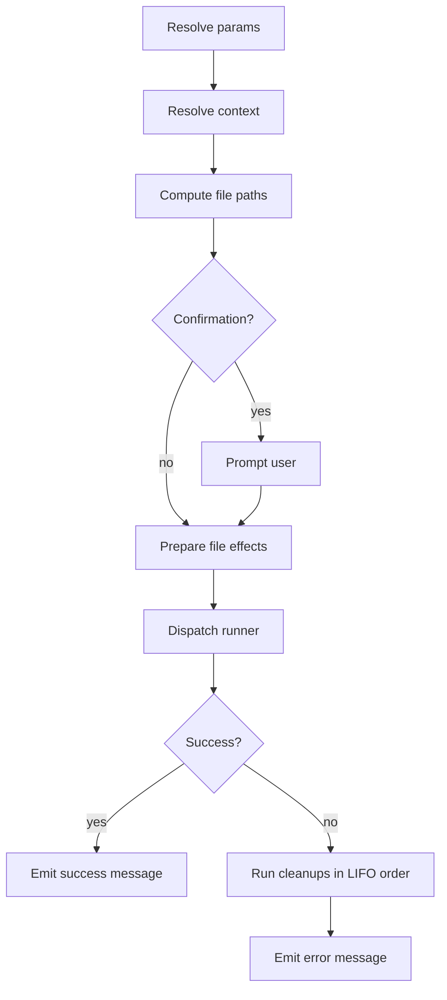
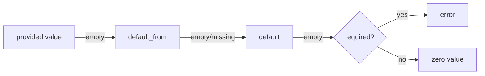
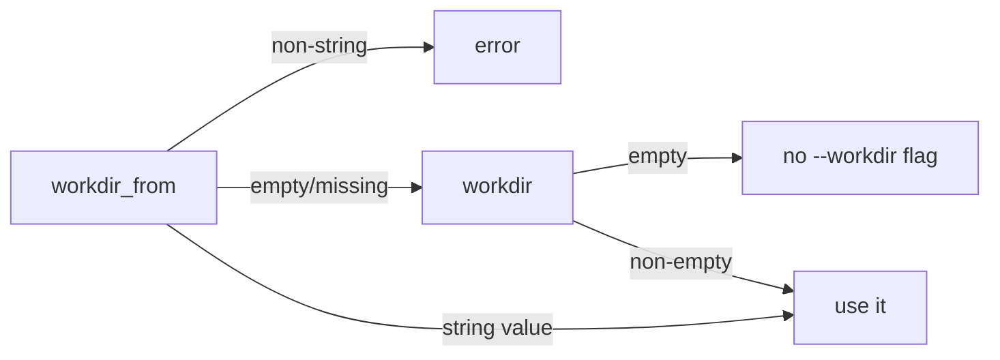
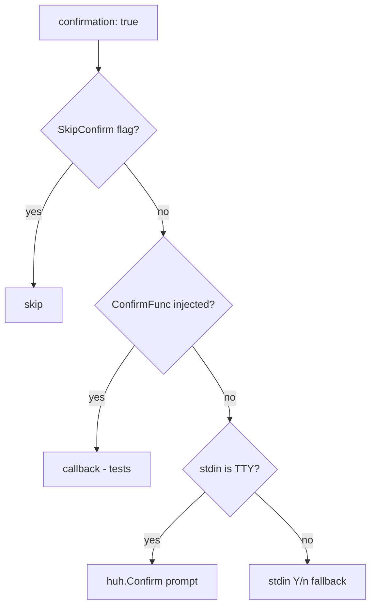

# commands/

Declarative command definitions for the devbox project.

## Contents

- [Purpose](#purpose)
- [File layout and command IDs](#file-layout-and-command-ids)
- [File structure](#file-structure)
- [Execution lifecycle](#execution-lifecycle)
- [Command directives](#command-directives)
  - [Identity and visibility](#identity-and-visibility)
  - [Confirmation](#confirmation)
  - [Messages](#messages)
  - [Notifications](#notifications)
  - [Params](#params)
  - [Context](#context)
  - [Env](#env)
  - [Files](#files)
- [Templating](#templating)
  - [Command render context](#command-render-context)
  - [Command-scope resolvers](#command-scope-resolvers)
  - [Examples specific to commands](#examples-specific-to-commands)
  - [Where templates are evaluated](#where-templates-are-evaluated)
- [Command types](#command-types)
  - [`type: shell`](#type-shell)
  - [`type: devbox`](#type-devbox)
  - [`type: script`](#type-script)
  - [`type: service_exec`](#type-service_exec)
  - [`type: service_run`](#type-service_run)
  - [`type: workflow`](#type-workflow)
  - [`type: builtin`](#type-builtin)
  - [`type: daemon`](#type-daemon)
- [Workdir resolution](#workdir-resolution)
- [Confirmation flow](#confirmation-flow)
- [Visibility, registration, and discovery](#visibility-registration-and-discovery)
- [Command-template space (the full reference)](#command-template-space-the-full-reference)
- [End-to-end examples](#end-to-end-examples)
- [Validation rules (cheat sheet)](#validation-rules-cheat-sheet)
- [Common pitfalls](#common-pitfalls)
- [Related commands](#related-commands)

## Purpose

`devbox/commands/` is the home of every reusable, scriptable action the project exposes through the CLI: container shells, build steps, database operations, multi-step workflows, deploy hooks, custom scripts, etc.

Each YAML file declares one or more named commands. Commands are discovered automatically by walking the directory tree, are addressable by a dot-separated ID, and can be executed directly (`devbox commands <id>`) or referenced from workflows and pipelines (`deploy.yml`, `lifecycle.yml`).

This page is the configuration reference: it lists every directive, explains how directives interact, and shows the patterns you will use when authoring new commands.

## File layout and command IDs

The directory layout determines the **group** prefix and the file's basename determines the leaf segment. Files and subdirectories are entirely up to the project — names below are illustrative, and any number of files at any depth may exist.

```
devbox/commands/
├── <top-group>.yml              → group: <top-group>
├── …                            → any number of top-level groups
└── <parent-group>/              → optional subdirectory expands a group
    ├── <child>.yml              → group: <parent-group>.<child>
    ├── <child>/                 → optional deeper subdirectory
    │   └── <leaf>.yml           → group: <parent-group>.<child>.<leaf>
    └── …                        → any number of children, any depth
```

Concretely, a project might lay things out like this — every name here is the project's choice, not a convention enforced by the CLI:

```
devbox/commands/
├── db.yml                       → group: db
├── app.yml                      → group: app
└── services/
    ├── <service-a>.yml          → group: services.<service-a>
    ├── <service-a>/
    │   └── db.yml               → group: services.<service-a>.db
    └── <service-b>.yml          → group: services.<service-b>
```

Each command's full ID is `<group>.<name>` where `<name>` is its key inside the file's `commands:` map.

Pattern: put the **core** commands of a group in a single file named after the group (`services/<service>.yml`), and split larger groups into a sibling subdirectory only when there are enough commands to warrant logical sub-groups (`services/<service>/db.yml`, `services/<service>/cache.yml`). The subdirectory is optional — small groups stay in one file. There are no required files: a project may have zero, one, or dozens of groups at any depth.

```yaml
# devbox/commands/db.yml  →  group "db"
commands:
  cli:                          # full ID: db.cli
    type: service_exec
    ...
  dump-create:                  # full ID: db.dump-create
    type: script
    ...
```

There are no reserved file names — every `*.yml` file contributes a segment derived from its path.

## File structure

Each file has two top-level keys: an optional `group:` block of metadata, and a required `commands:` map.

```yaml
group:
  title: Database
  description: Database container management commands

commands:
  <local-name>:
    type: <type>
    description: <text>
    # ... directives below ...
```

| Field | Type | Description |
|-------|------|-------------|
| `group.title` | string | Display title shown by `devbox commands list` |
| `group.description` | string | Short description shown next to the group |
| `commands` | map | Named command definitions (key = local name) |

## Execution lifecycle

Every command, regardless of type, flows through the same execution pipeline:



Phases:

1. **Resolve params** — for each declared parameter try, in order: caller-supplied value → `default_from` (dot-path into the merged config; empty result is treated as missing) → literal `default` → required-error. Then coerce to the declared type and validate `pattern`.
2. **Resolve context** — read each `context.<key>.from` dot-path out of the merged config.
3. **Compute file paths** — render `path` / `candidates` templates, normalise to absolute, discover files. Non-mutating.
4. **Confirmation** — when `confirmation: true`, prompt the user; the prompt is bypassed only by `SkipConfirm` (set by `--yes` / `-y` and inherited by workflow children). Otherwise dispatch is by stdin: TTY → `huh.Confirm`, non-TTY → plain Y/n fallback that auto-answers "yes" when `CI=1`. Refusal aborts the command. See [Confirmation flow](#confirmation-flow) for the full decision tree.
5. **Prepare file effects** — `mkdir`, `overwrite` checks, register cleanup callbacks.
6. **Run** — dispatch to the type-specific runner (host shell, devbox CLI, container exec/run, script, or workflow).
7. **Success / error** — emit `messages.success` or `messages.error`. On error, registered cleanups fire in LIFO order before the error message.

## Command directives

The directives below are common to **all** command types unless the table notes otherwise. Type-specific directives are listed in the dedicated sections.

### Identity and visibility

| Field | Type | Default | Description |
|-------|------|---------|-------------|
| `type` | enum | required | One of `shell`, `devbox`, `script`, `service_exec`, `service_run`, `workflow` |
| `description` | string | — | Human-readable description shown in the devbox CLI (selectors, `commands list`, `commands inspect`) |
| `private` | bool | `false` | Hides from `devbox commands list` and blocks direct `commands run`; still callable from workflows and pipelines |
| `notify` | bool | `false` | Fire a desktop notification when the command finishes. See [Notifications](#notifications) below. |

### Confirmation

| Field | Type | Default | Description |
|-------|------|---------|-------------|
| `confirmation` | bool | `false` | If true, prompt the user before executing |
| `confirmation_text` | string | `Are you sure?` | Prompt shown when `confirmation: true`; supports `${...}` templates |

The prompt is bypassed only when `SkipConfirm` is set on the in-process `RunContext`. That happens for:

- `commands --yes` / `-y`,
- workflow children inheriting `SkipConfirm` from a parent that was started with `--yes`,
- callers in tests that construct a `RunContext{SkipConfirm: true}` directly.

A non-TTY stdin does **not** skip the prompt — it routes through the plain Y/n fallback (`render.Writer.Confirm`). That fallback auto-answers "yes" when the `CI` environment variable is set; otherwise an answer other than `y` aborts the command.

```yaml
db.drop:
  type: service_exec
  confirmation: true
  confirmation_text: "Drop database `${param.database}`?"
  ...
```

### Messages

| Field | Type | Description |
|-------|------|-------------|
| `messages.success` | string | Emitted on success; supports `${...}` and Go templates |
| `messages.error` | string | Emitted on failure (in addition to the runner's own error) |

```yaml
messages:
  success: "Database `${param.database}` is ready."
  error: "Failed to create database `${param.database}`."
```

### Notifications

`notify: true` opts the command into a desktop notification when it finishes (success or failure). The notification only fires when **all** of the following hold:

- the `CommandDef` declares `notify: true` (default is `false`);
- the command is the **top-level** invocation — `devbox commands <id>` typed by the user. Commands invoked transitively as a workflow sub-step (sequential or parallel), from a deploy pipeline action, or from a reset pipeline action are **always suppressed at runtime** regardless of their own `notify:` value;
- the user's `notify_enabled` master switch and `notify_commands_enabled` per-op gate are both true;
- the environment is interactive (not CI / `DEVBOX_NONINTERACTIVE` / non-TTY).

The rule: "the notification fires for the command you typed, not for any command it runs internally."

```yaml
db.import:
  type: script
  notify: true            # fires once when `devbox commands db.import` finishes
  script:
    inline: ...
```

Validation rules:

- `notify: true` on a `type: daemon` command is a **validator error** — daemons have no completion event, so notifications are meaningless. Remove `notify:` or change the type.
- `notify: true` on a direct sub-step inside a `parallel:` block produces an **info** diagnostic — purely an early warning, since the runtime already suppresses it. Make the command top-level if you want a notification.

Full reference: [Notifications](notifications.md) — user-config keys, file locations, gate matrix, environment-variable overrides.

### Params

`params:` declares typed inputs the command accepts via `--set key=value` or via `with:` from a workflow / deploy step.

```yaml
params:
  database:
    type: string                # string (default), bool, int, path
    description: Database name to create
    required: true
    default: "laravel"          # literal fallback
    default_from: db.database   # dot-path into merged config
    env: DB_NAME                # injected as env var
    pattern: ^[a-zA-Z0-9_-]+$   # anchored regex (string/path only)
```

| Field | Type | Description |
|-------|------|-------------|
| `type` | enum | `string` (default), `bool`, `int`, `path` |
| `description` | string | Human-readable description shown in the devbox CLI (param help in selectors and `commands inspect`) |
| `required` | bool | Error if not supplied and no default resolves |
| `default_from` | string | Dot-path into the merged devbox config; preferred source for the default |
| `default` | string | Literal fallback used when nothing else resolves |
| `env` | string | If set, the resolved value is exported under this env name |
| `pattern` | string | Anchored regex that the resolved value must fully match (string/path only) |

Resolution order:



The config-driven `default_from` is the preferred source — this matches the standard "config wins, code provides safety net" pattern and lets `local.yml` overrides reach commands without rewriting their literal defaults. An empty string returned by `default_from` is treated as not-found so the literal `default` still acts as a true safety net.

### Context

`context:` declares values pulled from the merged devbox config and exposed to the command for templating and (optionally) as env vars. Unlike params, context values are not user-overridable — they always come from config.

```yaml
context:
  internal_workdir:
    from: services.main.work_dir_internal
    required: true
    env: APP_WORKDIR
```

| Field | Type | Description |
|-------|------|-------------|
| `from` | string | Dot-path into merged `DevboxConfig.Raw` |
| `required` | bool | Error if the path resolves to nil or empty string |
| `env` | string | Optional env var name to inject |

### Env

`env:` is a free-form map of env vars added directly to the child process. Values support full `${...}` and Go template syntax.

```yaml
env:
  MYSQL_PWD: "${db.password}"
  TIMESTAMP: "{{ now | date \"2006-01-02_15-04-05\" }}"
  NON_INTERACTIVE: "{{ if .Params.no_prompt }}1{{ else }}0{{ end }}"
```

Resolution order when the same env name is declared in multiple places:

1. `context.<key>.env`
2. `params.<key>.env`
3. `files.<id>.env`
4. `env:` block (highest precedence)

A duplicate name across any of these is rejected at load time — declare each env var exactly once.

### Files

`files:` declares external file artefacts the command reads or produces. The CLI resolves paths, optionally creates parent directories, exposes them via `${files.<id>.path}` and as env vars, and cleans up failed writes safely.

The file spec declared here is the **single source of truth** for conditional deployment: use `files_gate:` in `deploy.yml` / `lifecycle.yml` / `reset.yml` to skip or run steps based on whether these same files exist. See [files_gate: (pre-condition for files)](../deploy.md#files_gate-pre-condition-for-files) in the deploy reference for details.

```yaml
files:
  dump:
    access: write
    path: "${param.dump_dir}/${param.database}_{{ now | date \"2006-01-02\" }}.sql.gz"
    mkdir: true
    overwrite: true
    on_error: remove
    env: DUMP_FILE
```

#### File ID grammar

File IDs must match `^[a-zA-Z_][a-zA-Z0-9_]*$` — letters, digits, underscore. No hyphens or dots.

#### File spec fields

| Field | Type | Description |
|-------|------|-------------|
| `access` | enum | `read`, `write`, `read_write` (required) |
| `path` | string | Literal path (mutually exclusive with `candidates`). Required for `write`. |
| `candidates` | list | Ordered fallback list (read/read_write only) |
| `required` | bool | For `read`: error if not found. For `read_write`: always required regardless. |
| `mkdir` | bool | Create parent directories before writing (write only) |
| `overwrite` | bool | Allow replacing an existing file (write only) |
| `on_error` | enum | `keep` (default) or `remove` (write/read_write only) |
| `env` | string | Inject the resolved absolute path as this env var |

#### Candidate fallback

`candidates` is a list. Each entry is either a literal path or a glob with optional regex match and sort.

```yaml
files:
  dump:
    access: read
    candidates:
      - glob: "${param.dump_dir}/${param.database}_*.sql.gz"
        match: '\d{4}-\d{2}-\d{2}'   # regex on basename
        sort: name_desc              # name_asc | name_desc | modtime_asc | modtime_desc
      - path: "${param.dump_dir}/${param.database}.sql.gz"
    required: true
    env: DUMP_FILE
```

The CLI walks `candidates` in order, taking the first that resolves. For glob entries, matches are filtered by `match` (regex against basename) and sorted, then the first sorted match wins.

#### Access modes

| Mode | Pre-existence | Allowed fields | Behavior |
|------|---------------|----------------|----------|
| `read` | enforced if `required: true` | `path` or `candidates` | File must exist (or be optional) |
| `write` | not checked | `path`, `mkdir`, `overwrite`, `on_error` | File is created/overwritten |
| `read_write` | always enforced | `path` or `candidates`, `on_error` | File must exist; may be modified |

Cleanup safety: `on_error: remove` only deletes files that did **not** exist before the invocation. Pre-existing files are never removed by failure cleanup, even in `read_write` mode.

#### Templating in file paths

`path`, `candidates[].path`, `candidates[].glob`, and `candidates[].match` all support templates. They are rendered before existence checks. The resolved paths become available to subsequent templates via `${files.<id>.path}` (in `confirmation_text`, `cmd`, `argv`, `workdir`, `env:`, etc.).

## Templating

Devbox uses two layers of interpolation in command definitions: the lightweight `${...}` syntax and full Go `text/template` blocks. Both are evaluated by the same engine and may be mixed freely.

The full template engine — `${...}` namespaces, the render context, Go template control flow, built-in functions, sprout registries, and conventions — is documented in [Templates](../templates.md). This section only covers the parts that are specific to command files; everything else is cross-cutting.

### Command render context

Templates inside `devbox/commands/` render against `RenderContext`:

| Path | Contents |
|------|----------|
| `.Raw` | Merged `devbox.yml` + `defaults.yml` + `local.yml` as a nested map |
| `.Params` | Resolved param values (map keyed by param name) |
| `.Context` | Resolved context values (map keyed by context name) |
| `.Files` | Resolved file artefacts (map keyed by file id; each has a `.Path` field) |
| `.Host.UID` / `.Host.GID` | Host UID/GID strings |

The `${...}` namespaces (`${db.x}`, `${param.x}`, `${context.x}`, `${files.id.path}`, `${host.uid}`) route into these same fields. See [Templates](../templates.md) for the full namespace table.

### Command-scope resolvers

Three template helpers are available **only** in command files; they are not registered in info or render-pack templates:

| Helper | Use |
|--------|-----|
| `resolve .Raw <dot.path>` | Dot-path lookup in merged config (same as `${dot.path}`) |
| `resolveMap .Params <key>` | Key lookup in a flat map (same as `${param.key}` / `${context.key}`) |
| `resolveFile .Files <id> <subkey>` | Subkey lookup in a resolved file artefact |

They walk maps and return `""` on miss — useful when the key has a dot or a numeric segment that breaks the direct `.Raw.x.y` form.

### Examples specific to commands

```yaml
# helpers chained via pipe
files:
  log:
    access: write
    path: ".devbox/logs/{{ .Params.task }}_{{ now | date \"2006-01-02_15-04-05\" }}.log"
    mkdir: true

# pipeline form: pass a value through a function
env:
  SCRIPT_NAME: '{{ .Params.script_path | pathBase }}'

# mixing the two syntaxes
path: "${param.dump_dir}/${param.database}{{ if .Params.dump_date }}_{{ now | date \"2006-01-02\" }}{{ end }}.sql.gz"
```

### Where templates are evaluated

| Location | Templated |
|----------|-----------|
| `messages.success`, `messages.error` | yes |
| `confirmation_text` | yes |
| `cmd`, `argv`, `workdir`, `compose_args` | yes |
| `env:` map values | yes |
| `files.*.path`, `files.*.candidates[].path/glob/match` | yes |
| `params.*.default_from`, `context.*.from` | no — plain dot-paths only |
| Workflow `steps[].with[<key>]`, `steps[].when` | yes |
| `description`, `group.title`, `group.description` | no — printed verbatim by `commands list` / `commands inspect` / completion |

## Command types

The command types define different execution contexts:

| Type | Executor | Payload | Use case |
|------|----------|---------|----------|
| `shell` | Host shell | `cmd` or `argv` | Host tasks (scripts, git, build) |
| `devbox` | Devbox CLI | `cmd` | Subcommand invocation |
| `script` | Script runner | `script:` block | Structured multi-phase execution |
| `service_exec` | Docker Compose exec/run | `cmd` or `argv` | Container operations on existing/new containers |
| `service_run` | Docker Compose run | `cmd` or `argv` | Throwaway container execution |
| `workflow` | Command orchestrator | `steps[]` | Multi-command sequences (separate syntax, see below) |
| `builtin` | Engine-internal action | `cmd` (builtin name) + `with` | Invoke a shared engine builtin (e.g. wait-for-healthy) without a subprocess |
| `daemon` | Registry sugar | `daemon:` block + `service` + `argv` | Declare a long-running background container; expands to four virtual commands (`.start` / `.logs` / `.stop` / `.restart`) |

All types except `script` and `workflow` use the canonical `cmd:` field for their payload. `type: script` uses its own `script:` block with `run`, `plan`, `cleanup` phases. `type: workflow` uses its own `steps:` block with string-based `command:` / `confirm:` / `with:` / `when:` syntax — see [Type: workflow](#type-workflow) below. `type: builtin` puts the builtin name in `cmd:` and its parameters in `with:` — see [Type: builtin](#type-builtin) below.

## Type: shell

Runs a shell command on the **host** machine. Use this for tasks that don't need a container or the devbox binary.

| Field | Required | Description |
|-------|----------|-------------|
| `cmd` | one of cmd/argv | Shell command string passed to `sh -c` (full shell semantics) |
| `argv` | one of cmd/argv | Argument vector executed directly without a shell |
| `workdir` | optional | Working directory; relative paths resolve against project root |

```yaml
chmod-scripts:
  type: shell
  description: Make all scripts executable
  cmd: chmod +x devbox/scripts/**/*.sh
```

```yaml
commit-config:
  type: shell
  description: Commit a generated config file
  argv:
    - git
    - commit
    - -m
    - "chore: regen config"
    - "${files.cfg.path}"
  files:
    cfg:
      access: read
      path: "config/generated.yml"
      required: true
```

`cmd` and `argv` are mutually exclusive.

### Shell env contract

`type: shell` subprocesses inherit the parent process environment plus the values from the command's `env:` block. On top of that, the runner exports a small contract so shell snippets can talk back to the host devbox CLI and the active compose project without rediscovery:

| Variable | Value |
|----------|-------|
| `DEVBOX_BIN` | Absolute path to the running devbox binary — use it instead of hardcoding `./bin/devbox` |
| `COMPOSE_PROJECT_NAME` | Active compose project name (e.g. `devbox-laravel`) — `docker compose ...` picks this up without `-p` |
| `COMPOSE_FILE` | Colon-joined list of active overlay paths, made absolute against the project root — `docker compose ...` picks this up without any `-f` flags |

This is what lets a `type: shell` command reach docker compose with the same overlay set the rest of devbox uses:

```yaml
hub.chown-src-host:
  type: shell
  description: Chown the host-side mount via the running container
  cmd: |
    "$DEVBOX_BIN" docker exec -u root app-main -- \
      chown -R www-data:www-data /workspace/src
```

`COMPOSE_FILE` is omitted when no overlay files are configured; `COMPOSE_PROJECT_NAME` is omitted when no project name is set. Entries already declared in the command's `env:` block are kept but the contract entry wins when keys collide — Go's `os/exec` uses the last entry for duplicate keys, and the contract is appended after `env:`.

## Type: devbox

Invokes another devbox subcommand using the currently running binary. This avoids hard-coding `./bin/devbox` in command definitions and makes invocations relocatable.

| Field | Required | Description |
|-------|----------|-------------|
| `cmd` | yes | Subcommand string (without binary path); passed through `sh -c` |

```yaml
db.up:
  type: devbox
  private: true
  description: Start the database container in the background
  cmd: "docker up db"

app.install:
  type: devbox
  description: Install the Laravel application via installer container
  cmd: "compose raw --bare -- --progress tty -f compose/installer.yml run --rm -u ${host.uid}:${host.gid} app-install"
```

`workdir` is not allowed for `type: devbox` (the subcommand inherits the project root).

## Type: script

Executes a shell script file with a strict environment contract injected by the runner. **Scripts are the structured exception in the command system** — the `type: script` command uses its own `script:` block with `run`, `plan`, `cleanup` fields rather than the canonical `cmd:` field. This is intentional: scripts are configurations of a run, not individual commands.

```yaml
db.dump-create:
  type: script
  description: Create a database dump file
  params:
    database: { default_from: db.database, pattern: ^[a-zA-Z0-9_-]+$ }
    dump_dir: { default_from: db.backup_dir, required: true }
  files:
    dump:
      access: write
      path: "${param.dump_dir}/${param.database}_{{ now | date \"2006-01-02\" }}.sql.gz"
      mkdir: true
      overwrite: true
      on_error: remove
      env: DUMP_FILE
  env:
    DB_NAME: "${param.database}"
    MYSQL_PWD: "${db.password}"
  script:
    path: devbox/scripts/db/dump-create.sh
    shell: bash
```

### Script block

| Field | Description |
|-------|-------------|
| `script.shell` | Interpreter to invoke (default `sh`) |
| `script.path` | Single script (simple mode) |
| `script.run` | Main script (phased mode) |
| `script.plan` | Optional pre-script (phased mode) |
| `script.cleanup` | Optional always-runs-after script (phased mode) |

Modes are mutually exclusive: either `path` alone, or `run` (with optional `plan` / `cleanup`).

### Script paths

Script paths in `script.path`, `script.run`, etc. are resolved **against the project root** — never against `workdir`. This makes scripts safe to keep under `devbox/scripts/` regardless of where the command is run from.

### Script contract environment

The runner always injects the following env vars into the script process:

| Variable | Description |
|----------|-------------|
| `DEVBOX_ROOT` | Absolute project root |
| `DEVBOX_BIN` | Absolute path to the running devbox binary |
| `DEVBOX_COMMAND_ID` | Full ID of this invocation |
| `DEVBOX_TEMP_DIR` | Writable temp dir scoped to this invocation (auto-removed) |
| `DEVBOX_NONINTERACTIVE` | `1` when the parent `RunContext` has `NonInteractive: true` (set by `commands --yes` / `-y`) **or** the runner inherits `DEVBOX_NONINTERACTIVE=1` from its own environment (e.g. nested invocations). Otherwise `0`. TTY detection alone does not flip this — scripts that need to behave differently on a non-TTY should test their own stdin. |
| `DEVBOX_PARAMS_JSON` | Resolved params as a JSON object |
| `DEVBOX_CONTEXT_JSON` | Resolved context as a JSON object |
| `DEVBOX_FILES_JSON` | JSON object mapping file IDs to `{path}` |

Use `DEVBOX_BIN` instead of hard-coding `./bin/devbox`:

```bash
#!/bin/bash
set -euo pipefail

TMPFILE=$(mktemp "${DUMP_FILE}.XXXXXX")
trap 'rm -f "$TMPFILE"' EXIT

"$DEVBOX_BIN" docker exec -T -e MYSQL_PWD db -- \
  mariadb-dump -u"$DB_USER" "$DB_NAME" | gzip > "$TMPFILE"
mv "$TMPFILE" "$DUMP_FILE"
```

### Linting scripts

Devbox itself does not lint shell scripts. We **recommend** installing [ShellCheck](https://github.com/koalaman/shellcheck) and running it over `devbox/scripts/` as part of your local workflow or CI. It is an external tool, completely optional, but catches the classes of bugs that hurt most in this context: unquoted expansions, missing `set -euo pipefail`, broken `trap` handlers, subtle quoting issues around `$DUMP_FILE` / `$DEVBOX_BIN`, and mismatched test syntax.

```bash
# one-off check
shellcheck devbox/scripts/db/dump-create.sh

# whole tree
shellcheck devbox/scripts/**/*.sh
```

If you adopt it, pin the dialect with a shebang or directive so ShellCheck picks the right rules (especially when `script.shell: bash` is set):

```bash
#!/bin/bash
# shellcheck shell=bash
set -euo pipefail
```

Suggested conventions for scripts under `devbox/scripts/` (independent of ShellCheck — these are good ideas regardless):

- Start with `set -euo pipefail` — fail fast, no silent unset-var bugs.
- Quote every expansion: `"$DUMP_FILE"`, `"$DEVBOX_BIN"`, `"$DB_NAME"`.
- Use `trap 'rm -f "$TMPFILE"' EXIT` for ephemeral files; the runner cleans `$DEVBOX_TEMP_DIR` for you, but per-step temps still need their own traps.
- Treat unset env vars as errors via `${VAR:?error message}` when a script must not run without them.

## Type: service_exec

Runs a command inside an existing container via `docker compose exec`. With `mode: exec-or-run`, falls back to `docker compose run --rm` if the container is not running.

| Field | Required | Description |
|-------|----------|-------------|
| `service` | yes | Compose service name |
| `cmd` / `argv` | one of | Shell command string OR raw argv |
| `mode` | optional | `exec` (default), `run`, or `exec-or-run` |
| `user` | optional | Container user to run as. See [User resolution](#user-resolution) for the full list of accepted values and the fallback rules. |
| `workdir` | optional | Container workdir; rendered with templates |
| `workdir_from` | optional | Dot-path into merged config resolving to the workdir string |
| `compose_args` | optional | Extra flags forwarded to `docker compose exec/run` (templated) |

### User resolution

The `user:` field on `service_exec` / `service_run` (and on the `runner:` override block) accepts the following values:

| Value | Effect |
|-------|--------|
| _(omitted / empty)_ | Falls back to `services.<svc>.cli.user` of the target service. If `cli.user` is also empty, no `--user` flag is passed and the container runs under the image's `USER` directive. This is the default for new commands — declare `cli.user` once on the service and every command targeting that service inherits it. |
| `current` | Passes `--user <HOST_UID>:<HOST_GID>` so the container process runs as the host user. Use this when the command writes files into bind-mounted directories and you need them owned by the host user. |
| `root` | Passes `--user root`. Use for one-off operations that need elevated privileges inside the container (package install, chown, etc.). |
| `internal` | Passes **no** `--user` flag and **skips** the `cli.user` fallback. The container runs under the image's built-in `USER` directive (or `root` if the image declares none). Use this to explicitly opt out of `cli.user` for a specific command (e.g. an entrypoint that must run as the image's default user). |
| any other string | Passed verbatim as `--user <value>`. Accepts the same forms `docker --user` accepts: a user name (`www-data`), a numeric UID (`1000`), or `UID:GID` (`1000:1000`). |

Precedence, top to bottom:

1. `runner.user` (if the `runner:` block sets it).
2. Top-level `user:` on the command.
3. `services.<svc>.cli.user` of the resolved target service (after `runner.service` redirect).
4. No `--user` flag (image's `USER`).

`runner.service` redirects the target before the `cli.user` lookup, so the fallback reads `cli.user` from the **redirected** service, not the original.

Setting `user: internal` short-circuits step 3 — the resolver treats `internal` as an explicit decision and never reads `cli.user`.

```yaml
composer-install:
  type: service_exec
  description: Install PHP dependencies via Composer
  service: app-main
  user: current
  workdir_from: services.main.work_dir_internal
  mode: exec-or-run
  argv:
    - composer
    - install
    - --prefer-dist
    - --no-interaction
```

```yaml
db.create:
  type: service_exec
  description: Create a database in the db container
  service: db
  mode: exec-or-run
  params:
    database: { required: true, pattern: ^[a-zA-Z0-9_-]+$ }
  env:
    MYSQL_PWD: "${db.password}"
  cmd: "mariadb -u${db.user} -e 'CREATE DATABASE IF NOT EXISTS `${param.database}`;'"
```

### compose_args

`compose_args` is a list of extra flags inserted **before** the runner-generated `--user` / `--workdir` / `-e` flags. Use it for `-T`, `-d`, `--name`, `--rm`, etc.

```yaml
compose_args:
  - "-T"                    # disable TTY (useful when piping)
  - "--name"
  - "${param.database}_loader"
```

### Env injection in service runners

For containers, env vars are injected via the docker process environment plus `-e KEY` flags (name only), so secret values never appear in `argv` (and therefore not in `ps` or `/proc/<pid>/cmdline`).

## Type: service_run

Same as `service_exec` but always uses `docker compose run --rm` to start a fresh, throwaway container. Use for one-off jobs that should not require an already-running container.

```yaml
artisan-tinker:
  type: service_run
  service: app-main
  user: current
  workdir_from: services.main.work_dir_internal
  argv: [php, artisan, tinker]
```

`mode` is fixed to `run` for this type — the field may be omitted (default) or set explicitly to `run`; any other value is rejected at load time.

### Runner override block

Both `service_exec` and `service_run` accept a `runner:` block to override `service` / `user` / `workdir` / `workdir_from` / `mode` without duplicating the rest of the definition. Non-zero fields in `runner:` win over the top-level fields.

```yaml
queue-worker:
  type: service_exec
  service: app-main
  argv: [php, artisan, queue:work]
  runner:
    user: root
    workdir: /workspace
    mode: run
```

## Type: workflow

A workflow runs an ordered sequence of other commands, with optional confirmations and conditional steps. Workflows are the only way to compose multiple commands behind a single ID.

**Note:** Workflow steps use a string-based `command:` / `confirm:` / `with:` / `when:` syntax. The `when:` conditions inside workflows are string mini-language expressions, distinct from the typed `when:` / `check:` used in pipeline steps (see [deploy.yml](deploy.md)).

```yaml
bootstrap:
  type: workflow
  description: Full bootstrap — start db, create database, install deps, migrate
  steps:
    - command: db.start
    - command: services.main.db.create
    - command: services.main.composer-install
    - command: services.main.key-generate
    - command: services.main.migrate
```

### Step shape

Each step is either a **command** step, a **confirm** step, or a **parallel** step (mutually exclusive).

| Field | Used in | Description |
|-------|---------|-------------|
| `command` | command step | Full ID of the command to invoke |
| `with` | command step | Map of param overrides (templated values) |
| `confirm` | confirm step | Prompt text shown before continuing |
| `parallel` | parallel step | Concurrent group of leaf command sub-steps (see [Parallel sub-steps](#parallel-sub-steps)) |
| `when` | command / parallel step | Condition; step (or whole group) is skipped when falsy |
| `continue_on_error` | command / parallel step | Failure logged as warning; workflow proceeds |

### with: param overrides

`with:` values are rendered against the parent workflow's render context, so they can pull from config, params, and host helpers:

```yaml
- command: db.create
  with:
    database: "${db.database}"

- command: services.main.db.dump-deploy
  with:
    target_database: "${param.target_db}"
    dump_dir: "${param.backup_dir}"
```

### when: conditions

`when:` expressions are rendered first, then classified into one of three forms:

1. **Boolean literal** — `true`, `false`, `1`, `0`, empty string. After rendering, this is the fast-path.
2. **Builtin predicate** — filesystem checks against the project root.
3. **Shell command** — `cmd: <command>`; evaluated via `sh -c`; exit 0 = true.

```yaml
steps:
  - command: services.main.composer-install
    when: "file-missing services/main/src/vendor/autoload.php"

  - command: bootstrap-cache-warm
    when: "{{ if .Params.warm }}1{{ else }}0{{ end }}"

  - command: install-deps
    when: "cmd: test ! -d services/main/src/vendor"
```

Builtin predicates (path is project-root-relative):

| Predicate | True when |
|-----------|-----------|
| `dir-exists <path>` | path is an existing directory |
| `dir-missing <path>` | path is missing or not a directory |
| `dir-empty <path>` | path is missing or has no entries |
| `dir-not-empty <path>` | path is a directory with at least one entry |
| `file-exists <path>` | path is an existing regular file |
| `file-missing <path>` | path is missing or not a regular file |

### continue_on_error

Marks a step that may fail without aborting the workflow. The error is logged as a warning, then execution continues:

```yaml
steps:
  - command: optional-cache-warm
    continue_on_error: true
  - command: services.main.migrate
```

Not valid on `confirm` steps.

### confirm steps

```yaml
steps:
  - confirm: "This will drop the database. Continue?"
  - command: db.drop
    with:
      database: "${db.database}"
```

Confirm steps are silently skipped under `--yes` or `DEVBOX_NONINTERACTIVE=1`. Otherwise huh prompts on TTY, and a `[y/N]` stdin fallback handles piped inputs.

### Parallel sub-steps

A workflow step can declare a `parallel:` block that fans out a group of sub-steps concurrently. This mirrors the pipeline `parallel:` schema in [deploy.yml → Parallel step groups](deploy.md#parallel-step-groups) — the same `max_concurrent` / `fail_fast` knobs and the same live-block UI — but lives inside a workflow so the group is reusable across pipelines and invocable ad-hoc via `devbox commands`.

```yaml
services.all.composer-install:
  type: workflow
  description: Run composer install across every app service in parallel
  steps:
    - parallel:
        max_concurrent: 4
        fail_fast: true
        steps:
          - command: services.main.composer-install
          - command: services.api.composer-install
          - command: services.worker.composer-install
          - command: services.admin.composer-install
```

| Field | Required | Default | Description |
|-------|----------|---------|-------------|
| `max_concurrent` | optional | `min(NumCPU, len(steps))` | Upper bound on goroutines running at once |
| `fail_fast` | optional | `true` | When true, the first sub-step error cancels siblings via context; when false, all sub-steps run and errors aggregate via `errors.Join` |
| `always_show_output` | optional | `false` | When true, every sub-step's captured stdout/stderr is dumped between `───── output: <command> ─────` / `──────────────────` bars after the group finishes — including successful sub-steps. The default keeps the failure-only behaviour. Skipped and cancelled sub-steps never produce output and are unaffected. |
| `steps` | required | — | Sub-steps; each must be a leaf command step (no `confirm`, no nested `parallel`) |

Group-level `when:` and `continue_on_error:` are valid on the step that carries `parallel:` (they govern the whole group). Per-sub-step `when:` and `continue_on_error:` are also valid and behave the same as in a sequential workflow. Sub-step `when:` is evaluated once at preflight (before any goroutine launches) so predicates with side-effects do not double-execute.

#### Constraints

1. **At least two sub-steps** — a `parallel.steps:` list of length 0 or 1 is rejected at validate-time.
2. **No nested parallel** — a sub-step may not itself declare `parallel:`. Flatten the structure or split into separate workflow steps.
3. **No confirm in sub-steps** — `confirm:` steps interactively prompt; the parallel live-block UI owns the terminal and cannot host a prompt. A sub-step that references a command with `confirmation: true` requires `--yes` (or `DEVBOX_NONINTERACTIVE=1`); preflight rejects the group otherwise, and a runtime guard catches transitive confirmation calls.
4. **No `with:` on the container** — the parallel container holds no params of its own; each sub-step carries its own `with:`.

#### Composition

- **Ad-hoc**: `devbox commands run <workflow-id>` runs the workflow's own live-block on the terminal. Ctrl-C propagates as SIGINT through `signal.NotifyContext`, which cancels the group and gives children up to 5 s to exit before SIGTERM is escalated.
- **Inside a sequential pipeline step**: when a pipeline's sequential `cmd:` resolves to a workflow with a `parallel:` block, the pipeline's footer is paused for the duration of the step body (existing `SuspendForExec` / `ResumeAfterExec` contract), and the workflow renders its own block rows in the gap. The pipeline-step counter advances by exactly one — sub-steps are NOT counted as pipeline steps.
- **Inside a parallel pipeline group OR another parallel workflow**: rejected at runtime. Only one live-block can own the terminal at a time. The error is the `ErrWorkflowNestedParallel` sentinel.

#### Live rendering and reporting

- **Block rows (TTY)**: each sub-step has a row showing `<spinner-or-glyph> [<elapsed>] [<i>/<N>] <command>[: <latest-line>]`. The latest line tracks both newline-terminated output AND carriage-return frames, so `curl` / `wget` / `docker pull` progress bars are visible in-place (the row updates every time the child writes a frame).
- **End-of-block summary (TTY)**: when the parallel group finishes, the rows freeze with their final glyph (✓/✗/◎) in scrollback and a single one-line summary footer is printed in their place: `✓ [<elapsed>] parallel: <workflow-id>` in green on success, `✗ ...` in red when any sub-step failed. The per-sub-step `✓ [i/N] Done: …` lines are NOT re-emitted on TTY because the same information is already in the frozen block rows above.
- **Non-TTY mode** (CI / piped stdout): no live block. Each sub-step prints its terminal-state line (`✓ [i/N] Done`, `◎ [i/N] Skipped`, `✗ [i/N] Failed`, `◎ [i/N] Cancelled`) followed by a plain-text summary footer (`✓ [<elapsed>] parallel: <workflow-id>`).
- **Failure dumps**: a failed sub-step's captured output is replayed between `───── output: <command> ─────` / `──────────────────` bars on stderr in BOTH TTY and non-TTY modes — the live row cannot show the full buffer. The top bar names the sub-step so multi-failure dumps stay attributable, and ANSI escape sequences in the child's output are forwarded verbatim so colours survive the round-trip.
- **Colour for parallel sub-steps**: each child is launched with a per-sub-step pseudo-terminal so tools that key colour output off `isatty(STDOUT)` — Pest, PHPUnit/Symfony Console, ripgrep, fzf, lipgloss-based CLIs, … — keep emitting ANSI codes even though the captured output is consumed by an in-process line tee rather than the user's terminal. The PTY's master side is read into the tee, so per-row progress (e.g. `docker pull` `\r`-frames) and the buffered dump both see the same byte stream. As a belt-and-braces fallback the children also inherit `CLICOLOR_FORCE=1`, `FORCE_COLOR=1`, and `COLORTERM=truecolor` (forwarded into the container via `-e` for `type: service_exec` / `service_run`) so env-aware tools also keep colour without depending on PTY detection.

#### Per-sub-step logs

Each sub-step's combined stdout/stderr is captured to `.devbox/logs/parallel/workflow/<workflow-id>/<sub-command>.log`. Only newline-terminated frames are written to the log file (carriage-return progress frames stay on the live row and are dropped from logs), so the file stays readable without `\r`-spam.

#### Sub-step naming and pipeline overrides

Each workflow sub-step may set an explicit `name:` (optional). When absent the effective name defaults to the referenced `command`. This name is the handle the pipeline uses for `sub_step_overrides:` — see [deploy.md → Targeting workflow sub-steps with overrides](deploy.md#targeting-workflow-sub-steps-with-overrides). When two sub-steps in the same workflow share the same effective name, a pipeline override targeting that name is rejected at plan time as ambiguous; set explicit `name:` on the sub-steps to disambiguate.

```yaml
commands:
  dumps-deploy:
    type: workflow
    steps:
      - parallel:
          steps:
            - name: deploy-main          # explicit name → pipeline can target it
              command: services.main.db.dump-deploy
            - name: deploy-stock
              command: services.main.db.dump-deploy-stock
```

Workflows never know whether overrides are attached to them — they are opaque to gating decisions. Invoking a workflow with overrides only happens through a pipeline step that declares `sub_step_overrides:`.

## Type: builtin

Invokes an engine-internal builtin action by name — the same registry pipelines use in `deploy.yml` / `reset.yml` / `lifecycle.yml`. No subprocess is spawned; the builtin runs in-process in Go.

Use `type: builtin` whenever a command would otherwise re-implement logic the engine already provides (waiting for healthy containers, removing project volumes, ensuring service directories, …). It is the right choice for any leaf step that needs structured, auditable execution rather than a shell pipeline — and it sidesteps the trap of embedding `{{...}}` from other tools (e.g. `docker inspect --format`) inside a `type: shell` `cmd:`, which would otherwise collide with command template rendering.

| Field | Required | Description |
|-------|----------|-------------|
| `cmd` | yes | Builtin name (e.g. `docker_wait_healthy`) |
| `with` | optional | Map of parameters passed to the builtin |

```yaml
db.wait:
  type: builtin
  private: true
  description: Wait for the db container to become healthy
  cmd: docker_wait_healthy
  with:
    services: [db]
    timeout: 120s
    interval: 2s
```

### Templating inside with

String values inside `with:` — including entries in nested lists and maps — are rendered against the command template space (`${...}`, `{{ ... }}`) before the builtin sees them. This lets you parameterise a builtin with config lookups, params, or context:

```yaml
db.wait-target:
  type: builtin
  cmd: docker_wait_healthy
  params:
    service: { required: true }
  with:
    services: ["${param.service}"]
    timeout: "${docker.wait_timeout}"
```

Non-string scalars (booleans, integers) pass through untouched.

### Builtin registry

The list of available builtins, their parameters, and their behaviour are documented once in [deploy.yml → Available builtins](deploy.md#available-builtins). The same builtins are usable from `type: builtin` commands — there is one shared registry.

The most useful builtins to expose as commands tend to be the long-running, idempotent ones — `docker_wait_healthy` in particular, which is meant to be called whenever the project needs to block until the stack (or a specific service) is healthy.

### Invalid fields

`type: builtin` is a leaf action — it rejects every type-specific field of the other types: `argv`, `script:`, `steps:`, `service`, `compose_args`, `workdir` / `workdir_from`, `user`, `mode`, and `runner:`. Use `params:` / `context:` / `env:` / `files:` / `messages:` as on any other type for inputs, env exposure, and styled output.

## Type: daemon

`type: daemon` is the declarative shape for long-running, parameterised background processes inside devbox services (canonical example: a Laravel queue worker). One YAML block expands at registry-load time into **four first-class virtual commands**:

| Virtual ID | Behaviour | Blocking |
|---|---|---|
| `<base>.start` | `docker compose run -d --name <full> ...` | no |
| `<base>.logs` | `docker logs -f --tail=100 <full>` | yes — Ctrl-C detaches (the container keeps running) |
| `<base>.stop` | `docker stop -t <timeout> <full>` | no |
| `<base>.restart` | `<base>.stop` followed by `<base>.start` | no |

Each virtual command appears in the registry, the `devbox cmd` browser, completion, `inspect`, and is referenceable from workflows. The source `<base>` command is **not** runnable on its own — only the four virtual commands are.

Container names are auto-prefixed with `ProjectConfig.FullName()` (so the same project can run on multiple checkouts side by side) and every container carries standardised labels so `devbox status daemons`, completion, and `_auto_reap_daemons` can find them via `docker ps` — **no separate state file**.

### YAML form

```yaml
commands:
  queue:
    type: daemon
    description: "Laravel queue worker"
    service: app-main             # literal compose service name (no ${...})
    workdir_from: services.main.work_dir_internal
    user: www-data
    env:
      QUEUE_CONNECTION: redis
    params:
      name:
        default: default
        pattern: ^[a-zA-Z0-9_-]+$
    argv:
      - php
      - artisan
      - queue:listen
      - --timeout=0
      - --queue=${param.name}
    daemon:
      container_template: "php_queue_${param.name}"
      on_already_running: error   # error | noop
      auto_remove: true           # default true → adds --rm
      stop_timeout: 10s
      controls: [start, logs, stop, restart]
```

`service`, `workdir`/`workdir_from`, `user`, `env`, `params`, `argv`, `compose_args` follow the same semantics as [`type: service_run`](#type-service_run). The daemon-specific configuration lives entirely under the `daemon:` block.

### `daemon:` block fields

| Field | Required | Default | Description |
|-------|----------|---------|-------------|
| `container_template` | yes | — | Container-name template; rendered against the command template space and prefixed with `<project.full>-`. Post-render must match `^[a-zA-Z0-9_][a-zA-Z0-9_.-]*$`. |
| `on_already_running` | optional | `error` | `error` aborts `.start` if the container already exists; `noop` makes `.start` idempotent. |
| `auto_remove` | optional | `true` | When true, `.start` adds `--rm` so the container is removed when it stops. |
| `stop_timeout` | optional | `10s` | Duration string. Converted to integer seconds at `docker stop -t <secs>`; values below 1s round up to 1s (never `0`). |
| `controls` | optional | `[start, logs, stop, restart]` | Subset of the four virtual commands to generate. If `restart` is listed, both `start` AND `stop` must also be listed. |

### Container naming

```
<project.full>-<rendered container_template>
```

`project.full` is `ProjectConfig.FullName()` — `<prefix>-<name>` if `prefix:` is set, else `<name>`. The post-render regex `^[a-zA-Z0-9_][a-zA-Z0-9_.-]*$` is the authoritative defense; invalid characters in rendered template values fail at runtime even if the param's `pattern:` happened to permit them.

### Standard labels

Every daemon container carries three labels so `docker ps` is the single source of truth:

- `devbox.project=<project.full>`
- `devbox.daemon.id=<base>` (e.g. `services.main.queue`)
- `devbox.daemon.params=<json>` (e.g. `{"name":"emails"}`) — produced via `encoding/json.Marshal` to round-trip safely through quotes, backslashes, and control characters

`devbox status daemons`, `--set` completion, and `_auto_reap_daemons` all filter on these labels.

### Virtual command behaviour

- **`.start`** — issues `docker compose run -d --name <full> --no-deps --entrypoint "" [--rm] [--user …] [--workdir …] -e K1 -e K2 --label devbox.project=… --label devbox.daemon.id=… --label devbox.daemon.params=… <service> <argv…>`. Environment **values** are passed via the child process environment (`cmd.Env`), never the host argv, so secrets do not appear in `ps` or `/proc/<pid>/cmdline`. `--no-deps` keeps the running stack untouched; `--entrypoint ""` ensures the user's `argv:` is what actually runs. On `on_already_running: error` plus a docker name-conflict error, the builtin surfaces `ErrDaemonAlreadyRunning`; on `noop`, the same error is swallowed and `.start` succeeds.
- **`.logs`** — runs `docker logs -f --tail=100 <full>` foreground. Ctrl-C sends `SIGINT` to the `docker logs` process only (graceful detach via `cmd.Cancel`); the container is never signalled. If the container is not running, `.logs` errors with a hint pointing at `.start`.
- **`.stop`** — runs `docker stop -t <stop_timeout-as-seconds> <full>`. Missing container is **not** an error (idempotent stop).
- **`.restart`** — a virtual `type: workflow` of `<base>.stop` followed by `<base>.start`. Workflow steps explicitly forward each declared `param.<name>` via `with:`, so `devbox cmd queue.restart --set name=emails` restarts the `emails` daemon (not the default).

### Validation

`devbox validate` and load-time `cmd.Validate()` enforce:

- `service:` is required and **must be literal** — no `${...}` or `{{...}}`. (Parameterised `service:` is intentionally out of scope for v1 to keep the `devbox.daemon.id` label stable.)
- `daemon.container_template` is required and non-empty.
- `daemon.on_already_running` is one of `error` / `noop` (empty = default `error`).
- `daemon.stop_timeout` parses via `time.ParseDuration` and is strictly positive.
- `daemon.controls` is a subset of `{start, logs, stop, restart}`; if `restart` is listed, `start` and `stop` must also be listed.
- Every `${param.X}` referenced in `container_template` must be declared in `params:` AND carry a `pattern:` (advisory — the runtime regex on the rendered container name is the authoritative gate).
- Synthetic IDs (`<base>.start`, `.logs`, `.stop`, `.restart`) must not collide with any explicit command in the registry.

### Parallel and workflow restrictions

`.logs` is **interactive** — it tails container output foreground and is detached by Ctrl-C. Like `confirm`, it is rejected anywhere inside a `parallel:` step group at plan time (deploy / lifecycle pipelines and workflow parallel blocks), regardless of `--yes`. `.start`, `.stop`, and `.restart` may appear inside parallel groups.

### Lifecycle integration

Whenever `devbox stop` runs (whether `lifecycle.yml` exists or not), a synthetic `_auto_reap_daemons` phase is prepended to the stop pipeline. It enumerates every container labelled `devbox.project=<full>` with a non-empty `devbox.daemon.id` and stops them in parallel. There is no opt-out; the phase is visible in plan output. See [lifecycle.md](lifecycle.md) for the stop pipeline shape.

If `lifecycle.yml` is absent, `devbox stop` still runs (with only the `_auto_reap_daemons` phase plus the default `Project is stopped. Have a nice day!` message) — `lifecycle.yml` is no longer required for `stop`.

### Security & privacy

- **Param values land in `devbox.daemon.params` as JSON labels**, which `docker inspect` exposes to anyone with docker socket access on the host. **Do not put secrets in `params:`.** Use `env:` instead — env values are passed through the container environment (`docker compose run -e KEY` with the value in `cmd.Env`), never through the host process argv, so they do not appear in `ps` or `/proc/<pid>/cmdline`.
- **The container-name regex is enforced after rendering** — invalid characters in rendered param values are a hard runtime error even if the YAML `pattern:` happened to allow them. The validator's param-pattern check is advisory; the rendered-name regex is the authoritative defense.
- **`service:` parameterisation is rejected** in v1 — the `devbox.daemon.id` label needs to be stable across restarts so completion, status, and reap can reliably correlate state across invocations.

### Invalid fields

The source daemon command rejects fields that conflict with its declarative shape: `script:`, `steps:`, `cmd:` (the action is implicit), `mode`, `runner:` (each virtual command has its own runner). Use `params:` / `context:` / `env:` / `files:` / `messages:` / `argv` / `service` / `workdir` / `workdir_from` / `user` / `compose_args` as on any service runner. All of these flow into the virtual `.start` invocation.

### End-to-end flow

```bash
# Start a worker for the "emails" queue
devbox cmd queue.start --set name=emails

# Tail it (Ctrl-C detaches, container stays)
devbox cmd queue.logs --set name=emails

# Check what's running
devbox status daemons

# Restart it
devbox cmd queue.restart --set name=emails

# Stop one daemon
devbox cmd queue.stop --set name=emails

# Stop everything (reaps all daemons in this project automatically)
devbox stop
```

## Workdir resolution

`workdir` accepts a templated path. Relative paths resolve against the project root for host runners (`type: shell`, `type: script`) and against the container filesystem for service runners.

`workdir_from` is **only** valid for `service_exec` / `service_run` and reads a string out of the merged config:

```yaml
workdir_from: services.main.work_dir_internal
```

When both `workdir` and `workdir_from` are set, `workdir_from` wins — the same "config wins, literal is the safety net" pattern as `params.*.default_from`. Inside a `runner:` block the same rule applies between `runner.workdir_from` and `runner.workdir`.

Resolution order:



- `workdir_from` resolves to a non-empty string → use it.
- `workdir_from` is missing in config or resolves to an empty string → fall back to the literal `workdir`.
- `workdir_from` resolves to a non-string value → hard error (configuration bug).
- Neither set → the runner does not pass `--workdir` (container default applies).

### Templated service / workdir / workdir_from

`service`, `workdir`, and `workdir_from` are rendered through the command template space before resolution, the same as `argv`, `cmd`, and `compose_args`. This lets one definition target multiple services without duplication:

```yaml
hub.chown-src:
  type: service_run
  private: true
  params:
    service: { type: string, required: true, pattern: '^[a-z0-9_-]+$' }
  service: app-${param.service}
  workdir_from: services.${param.service}.work_dir_internal
  user: root
  argv: [sh, -c, "chown -R www-data:www-data /workspace/src"]
```

A pipeline (or another command) then invokes the same definition per service via `--set service=<name>`. The `runner:` block fields (`runner.service`, `runner.workdir`, `runner.workdir_from`) are rendered identically.

## Confirmation flow

Every command goes through the same four-tier dispatch when `confirmation: true` (or for builtin/workflow `confirm` steps):



Operational notes:

- `commands --yes` sets `SkipConfirm` and `NonInteractive` on the in-process `RunContext` so every confirm call (top-level command, builtin `confirm`, workflow confirm steps) skips the prompt for the duration of the invocation.
- Subprocess env propagation is **scoped to the script runner**: `type: script` injects `DEVBOX_NONINTERACTIVE=1` (along with `DEVBOX_PARAMS_JSON`, `DEVBOX_CONTEXT_JSON`, etc.) into the script's environment. `type: shell` exports a smaller contract — `DEVBOX_BIN`, `COMPOSE_PROJECT_NAME`, `COMPOSE_FILE` (see [Shell env contract](#shell-env-contract)) — but **not** `DEVBOX_NONINTERACTIVE`. `type: devbox`, `service_exec`, and `service_run` export none of these — confirmation skipping inside them is enforced by the `RunContext` they run under, not by the env.
- Inside a workflow, child commands inherit `NonInteractive` and `SkipConfirm` from the parent `RunContext`.
- The non-TTY fallback is `render.Writer.Confirm`; under `CI=1` it auto-confirms.

## Visibility, registration, and discovery

- Files under `devbox/commands/` are discovered recursively at startup.
- Each file is parsed and validated; a load failure halts startup with a structured error pointing to the file and field.
- `private: true` hides commands from `devbox commands list` and rejects direct invocation via `devbox commands`. Private commands can still be referenced from workflows and pipelines — useful for steps that should only run as part of a larger sequence.

```yaml
db.up:
  type: devbox
  private: true              # used only inside db.start workflow
  cmd: "docker up db"
```

## Command-template space (the full reference)

When the docs say *"command template space"* this is the set of expressions available inside any templated field of a command:

| Expression | Meaning |
|------------|---------|
| `${<dot.path>}` | Lookup in merged `DevboxConfig.Raw` |
| `${param.<name>}` | Resolved param |
| `${context.<name>}` | Resolved context value |
| `${files.<id>.path}` | Absolute path of a file artefact |
| `${host.uid}` / `${host.gid}` | Effective UID/GID for container `--user` |
| `{{ .Raw.x.y }}` | Direct dot access on the merged config |
| `{{ .Params.<name> }}` | Direct dot access on params |
| `{{ .Context.<name> }}` | Direct dot access on context |
| `{{ .Host.UID }}` | Host info (Go template form) |
| `{{ now \| date "..." }}` / `{{ pathBase }}` / `{{ pathDir }}` / `{{ appURL ... }}` | Helper functions (sprout + domain) |

Use the simpler `${...}` form for one-off lookups; reach for `{{ ... }}` when you need conditionals, comparisons, or pipelines.

## End-to-end examples

### A self-contained service_exec command

```yaml
db.create:
  type: service_exec
  description: Create a database in the db container
  service: db
  mode: exec-or-run
  params:
    database:
      type: string
      required: true
      pattern: ^[a-zA-Z0-9_-]+$
  env:
    MYSQL_PWD: "${db.password}"
  messages:
    success: "Database `${param.database}` is ready."
    error: "Failed to create database `${param.database}`."
  cmd: "mariadb -u${db.user} -e 'CREATE DATABASE IF NOT EXISTS `${param.database}` CHARACTER SET utf8mb4 COLLATE utf8mb4_unicode_ci;'"
```

### A script command with file artefacts

```yaml
db.dump-create:
  type: script
  description: Create a database dump file
  params:
    database:
      type: string
      default_from: db.database
      pattern: ^[a-zA-Z0-9_-]+$
    dump_dir:
      type: string
      default_from: db.backup_dir
      required: true
      pattern: ^[^*?\[\]]+$
    dump_date:
      type: bool
      default: true
  env:
    DB_NAME: "${param.database}"
    DB_USER: "${db.user}"
    MYSQL_PWD: "${db.password}"
  files:
    dump:
      access: write
      path: "${param.dump_dir}/${param.database}{{ if .Params.dump_date }}_{{ now | date \"2006-01-02\" }}{{ end }}.sql.gz"
      mkdir: true
      overwrite: true
      on_error: remove
      env: DUMP_FILE
  script:
    path: devbox/scripts/db/dump-create.sh
    shell: bash
  messages:
    success: "Database dump created at ${files.dump.path}"
    error: "Failed to create database dump"
```

### A read-with-fallback file spec

```yaml
db.dump-deploy:
  type: script
  confirmation: true
  confirmation_text: "This will DROP and recreate `${param.target_database}`. Continue?"
  params:
    target_database:
      default_from: db.database
      required: true
    dump_dir:
      default_from: db.backup_dir
      required: true
  files:
    dump:
      access: read
      candidates:
        - glob: "${param.dump_dir}/${param.target_database}_*.sql.gz"
          match: '\d{4}-\d{2}-\d{2}'
          sort: name_desc
        - path: "${param.dump_dir}/${param.target_database}.sql.gz"
      required: true
      env: DUMP_FILE
  script:
    path: devbox/scripts/db/dump-deploy.sh
    shell: bash
```

### A workflow with conditional and confirm steps

```yaml
reset-and-bootstrap:
  type: workflow
  description: Drop, recreate, and bootstrap the main service
  steps:
    - confirm: "Drop and re-bootstrap `${db.database}`?"

    - command: db.drop
      with:
        database: "${db.database}"

    - command: services.main.db.create

    - command: services.main.composer-install
      when: "file-missing services/main/src/vendor/autoload.php"

    - command: services.main.migrate

    - command: optional-cache-warm
      continue_on_error: true
```

### A private composition

```yaml
# devbox/commands/db.yml
db.up:
  type: devbox
  private: true
  description: Start the database container in the background
  cmd: "docker up db"

db.wait:
  type: builtin
  private: true
  description: Wait for the db container to become healthy
  cmd: docker_wait_healthy
  with:
    services: [db]
    timeout: 120s
    interval: 2s

db.start:
  type: workflow
  private: true
  description: Start the database container and wait until healthy
  steps:
    - command: db.up
    - command: db.wait
```

`db.start` cannot be invoked directly via `devbox commands db.start`, but `bootstrap` can reference it from its `steps:`. The composition above is the canonical pattern: a thin `type: devbox` for the start, a `type: builtin` for the wait, and a `type: workflow` that strings them together.

## Validation rules (cheat sheet)

The loader enforces these rules and reports the offending file + field on failure:

- `type` is required and must be one of the documented values.
- `type: shell` requires exactly one of `cmd` / `argv`; `service_*` requires exactly one of `cmd` / `argv` plus `service`.
- `type: script` requires a `script:` block in either simple (`path`) or phased (`run` + optional `plan` / `cleanup`) form.
- `type: workflow` requires a non-empty `steps:` and forbids type-specific fields (`cmd`, `argv`, `service`, `script`, `workdir`, etc.).
- `type: builtin` requires `cmd:` (the builtin name) and rejects type-specific fields of other types (`argv`, `script:`, `steps:`, `service`, `compose_args`, `workdir` / `workdir_from`, `user`, `mode`, `runner:`).
- Each workflow step has exactly one of `command` / `confirm` / `parallel`; `with` / `continue_on_error` are valid only on command steps (and on the container of a `parallel` block — see [Parallel sub-steps](#parallel-sub-steps)).
- Env variable names must be unique across `params.*.env`, `context.*.env`, `files.*.env`, and the `env:` block.
- File IDs must match `^[a-zA-Z_][a-zA-Z0-9_]*$`.
- File specs reject conflicting fields (e.g. `mkdir` outside `write`, `path` + `candidates`, `match` / `sort` without `glob`).
- `workdir_from` is only valid for `service_exec` / `service_run`.
- `compose_args` is only valid for `service_exec` / `service_run`.
- `mode` on `service_run` must be empty or `run`.
- `notify: true` is rejected on `type: daemon` (error). `notify: true` on a direct sub-step inside a `parallel:` block produces an info diagnostic; the runtime suppresses it.

## Common pitfalls

- **Don't shell out to `./bin/devbox`** — use `type: devbox` or `$DEVBOX_BIN` (in scripts). Either form picks up the running binary, even when the build path changes.
- **Don't put secrets in `argv`** — use `env:` so values are injected through the container env, not the command line.
- **Don't reuse env names across sources** — declaring `MYSQL_PWD` in both `params.x.env` and `env:` is a load-time error.
- **Don't write to a path without `mkdir: true`** — write mode does not create parents on its own.
- **Don't expect `${...}` inside `params.*.default_from` / `context.*.from`** — those are plain dot-paths, not templated.
- **Don't run a private command directly** — reference it from a workflow or pipeline, or temporarily flip `private: false` for debugging.

## Related commands

- `devbox commands list` — list all public commands grouped by file
- `devbox commands <id> [--set k=v] [--yes]` — execute a command (alias: `devbox cmd <id>`)
- `devbox commands --inspect <id>` (or `-i`) — show the resolved definition (params, context, env, runner)
- `devbox docs generate` — regenerate the per-command reference under `docs/reference/commands/`

When `devbox commands` is invoked without an exact command ID on an interactive terminal, an interactive two-panel command browser opens. Its behaviour (default expansion depth, auto-collapse during fuzzy filter, type badges) is configured via the [`ui:` block in `devbox.yml`](ui.md).

`--inspect` / `-i` is mutually exclusive with `--set` and `--yes`; it requires an exact command id and prints the definition without running it.
