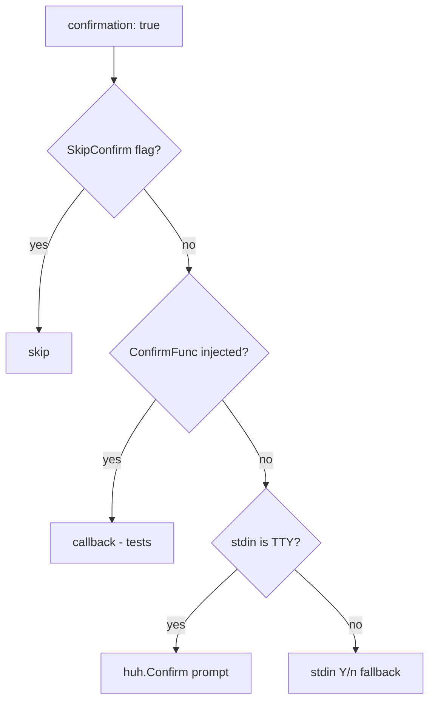
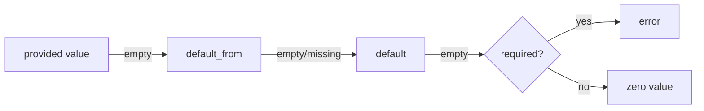

# Command directives

Directives common to **all** command types unless noted otherwise. Type-specific directives are listed in [types.md](types.md).

## Contents

- [Identity and visibility](#identity-and-visibility)
- [Confirmation](#confirmation)
- [Confirmation flow](#confirmation-flow)
- [Messages](#messages)
- [Notifications](#notifications)
- [Params](#params)
- [Param widgets](#param-widgets)
- [Context](#context)
- [Env](#env)
- [Files](#files)

## Identity and visibility

| Field | Type | Default | Description |
|-------|------|---------|-------------|
| `type` | enum | required | One of `shell`, `dwe`, `script`, `service_exec`, `service_run`, `workflow`, `builtin`, `daemon` |
| `description` | string | — | Human-readable description shown in the DWE CLI (selectors, `commands list`, `commands inspect`) |
| `private` | bool | `false` | Hides from `dwe commands list` and blocks direct `commands run`; still callable from workflows and pipelines |
| `notify` | bool | `false` | Fire a desktop notification when the command finishes. See [Notifications](#notifications) below. |

## Confirmation

| Field | Type | Default | Description |
|-------|------|---------|-------------|
| `confirmation` | bool | `false` | If true, prompt the user before executing |
| `confirmation_text` | string | `Are you sure?` | Prompt shown when `confirmation: true`; supports `${...}` templates |

The prompt is bypassed only when `SkipConfirm` is set on the in-process `RunContext`. That happens for:

- `commands --yes` / `-y`,
- workflow children inheriting `SkipConfirm` from a parent that was started with `--yes`,
- callers in tests that construct a `RunContext{SkipConfirm: true}` directly.

A non-TTY stdin does **not** skip the prompt — it routes through the plain Y/n fallback (`render.Writer.Confirm`). That fallback auto-answers "yes" when the `CI` environment variable is set; otherwise an answer other than `y` aborts the command.

```yaml
db.drop:
  type: service_exec
  confirmation: true
  confirmation_text: "Drop database `${param.database}`?"
  ...
```

## Confirmation flow

Every command goes through the same four-tier dispatch when `confirmation: true` (or for builtin/workflow `confirm` steps):



Operational notes:

- `commands --yes` sets `SkipConfirm` and `NonInteractive` on the in-process `RunContext` so every confirm call (top-level command, builtin `confirm`, workflow confirm steps) skips the prompt for the duration of the invocation.
- Subprocess env propagation is **scoped to the script runner**: `type: script` injects `DWE_NONINTERACTIVE=1` (along with `DWE_PARAMS_JSON`, `DWE_CONTEXT_JSON`, etc.) into the script's environment. `type: shell` exports a smaller contract — `DWE_BIN`, `COMPOSE_PROJECT_NAME`, `COMPOSE_FILE` (see [Shell env contract](types.md#shell-env-contract)) — but **not** `DWE_NONINTERACTIVE`. `type: dwe`, `service_exec`, and `service_run` export none of these — confirmation skipping inside them is enforced by the `RunContext` they run under, not by the env.
- Inside a workflow, child commands inherit `NonInteractive` and `SkipConfirm` from the parent `RunContext`.
- The non-TTY fallback is `render.Writer.Confirm`; under `CI=1` it auto-confirms.

## Messages

| Field | Type | Description |
|-------|------|-------------|
| `messages.success` | string | Emitted on success; supports `${...}` and Go templates |
| `messages.error` | string | Emitted on failure (in addition to the runner's own error) |

```yaml
messages:
  success: "Database `${param.database}` is ready."
  error: "Failed to create database `${param.database}`."
```

## Notifications

`notify: true` opts the command into a desktop notification when it finishes (success or failure). The notification only fires when **all** of the following hold:

- the `CommandDef` declares `notify: true` (default is `false`);
- the command is the **top-level** invocation — `dwe commands <id>` typed by the user. Commands invoked transitively as a workflow sub-step (sequential or parallel), from a deploy pipeline action, or from a reset pipeline action are **always suppressed at runtime** regardless of their own `notify:` value;
- the user's `notify_enabled` master switch and `notify_commands_enabled` per-op gate are both true;
- the environment is interactive (not CI / `DWE_NONINTERACTIVE` / non-TTY).

The rule: "the notification fires for the command you typed, not for any command it runs internally."

```yaml
db.import:
  type: script
  notify: true            # fires once when `dwe commands db.import` finishes
  script:
    inline: ...
```

Validation rules:

- `notify: true` on a `type: daemon` command is a **validator error** — daemons have no completion event, so notifications are meaningless. Remove `notify:` or change the type.
- `notify: true` on a direct sub-step inside a `parallel:` block produces an **info** diagnostic — purely an early warning, since the runtime already suppresses it. Make the command top-level if you want a notification.

Full reference: [Notifications](../notifications.md) — user-config keys, file locations, gate matrix, environment-variable overrides.

## Params

`params:` declares typed inputs the command accepts via `--set key=value` or via `with:` from a workflow / deploy step.

```yaml
params:
  database:
    type: string                # string (default), bool, int, path
    description: Database name to create
    required: true
    default: "laravel"          # literal fallback
    default_from: db.database   # dot-path into merged config
    env: DB_NAME                # injected as env var
    pattern: ^[a-zA-Z0-9_-]+$   # anchored regex (string/path only)
```

| Field | Type | Description |
|-------|------|-------------|
| `type` | enum | `string` (default), `bool`, `int`, `path` |
| `description` | string | Human-readable description shown in the DWE CLI (param help in selectors and `commands inspect`) |
| `required` | bool | Error if not supplied and no default resolves |
| `default_from` | string | Dot-path into the merged DWE config; preferred source for the default |
| `default` | string | Literal fallback used when nothing else resolves |
| `env` | string | If set, the resolved value is exported under this env name |
| `pattern` | string | Anchored regex that the resolved value must fully match (string/path only) |

Resolution order:



The config-driven `default_from` is the preferred source — this matches the standard "config wins, code provides safety net" pattern and lets `local.yml` overrides reach commands without rewriting their literal defaults. An empty string returned by `default_from` is treated as not-found so the literal `default` still acts as a true safety net.

## Param widgets

Params can declare a **widget type** to control how they are presented in the interactive form, and a list of **options** that guide the user to valid choices. This is especially useful when the valid options are stored in your DWE config and you want the form to stay in sync without duplicating the list in the command file.

```yaml
params:
  # Static list of options
  format:
    type: string
    widget: select
    description: Output format
    options: [json, yaml, toml]

  # List with custom labels
  driver:
    type: string
    widget: select
    description: Database driver
    options:
      - { value: pg,    label: "PostgreSQL 16" }
      - { value: mysql, label: "MySQL 8" }

  # Dynamic options from config (e.g., defaults.yml or local.yml)
  database:
    type: string
    widget: select
    description: Database to use
    options: ${databases}
    default_from: config.default_db

  # Multiple selections
  services:
    type: string
    widget: multiselect
    description: Services to enable
    options: ${services_list}
    separator: ","
```

| Field | Type | Default | Description |
|-------|------|---------|-------------|
| `widget` | enum | inferred from `type` | One of `input`, `select`, `multiselect`, `confirm`. Inferred as `confirm` for `bool`; `select` if `options` present; `input` for string/int/path without options |
| `options` | list or ref | — | Static list of option values, list of `{value, label}` objects, or a dot-path reference to config (e.g., `${databases}`) |
| `separator` | string | `" "` | Joining separator for multiselect results; used only when `widget: multiselect` |

Widget rendering:

- **`input`** — text field; user types freely. Used for string/int/path with no `options`.
- **`select`** — single-choice dropdown/menu. Used when `options` are available and exactly one must be chosen.
- **`multiselect`** — multi-choice list; selected items are joined with the `separator` into a string. Values are space-separated by default or per your custom `separator`.
- **`confirm`** — yes/no prompt. Used for `bool` params; the resolved value is either `"true"` or `"false"`.

Options resolution:

- **Static list** (`options: [a, b, c]`) — the list is literal.
- **Labeled options** (`options: [{value: x, label: X}, ...]`) — value is used internally, label is shown to the user.
- **Config reference** (`options: ${databases}`) — the form resolves the dot-path from your merged config (workspace.yml + defaults.yml + local.yml) at runtime. The resolved value can be a scalar list (`[a, b, c]`) or a map (`{x: X, y: Y}` → options with value=key, label=value). Empty or missing references are caught with a clear error when you try to open the form.

Validation:

- `options` and `pattern` are mutually exclusive — choose one or the other.
- For `select` or `multiselect`, the `options` field must be present and non-empty (either static or resolvable from config).
- A `default_from` or `default` value must exist in the resolved options list, or the command will error when you try to run it.
- `--set key=value` with an invalid choice (not in options) will error unless `options` resolved empty — in that case, you can bypass validation to supply an explicit override.

## Context

`context:` declares values pulled from the merged DWE config and exposed to the command for templating and (optionally) as env vars. Unlike params, context values are not user-overridable — they always come from config.

```yaml
context:
  internal_workdir:
    from: services.main.work_dir_internal
    required: true
    env: APP_WORKDIR
```

| Field | Type | Description |
|-------|------|-------------|
| `from` | string | Dot-path into merged `DweConfig.Raw` |
| `required` | bool | Error if the path resolves to nil or empty string |
| `env` | string | Optional env var name to inject |

## Env

`env:` is a free-form map of env vars added directly to the child process. Values support full `${...}` and Go template syntax.

```yaml
env:
  MYSQL_PWD: "${db.password}"
  TIMESTAMP: "{{ now | date \"2006-01-02_15-04-05\" }}"
  NON_INTERACTIVE: "{{ if .Params.no_prompt }}1{{ else }}0{{ end }}"
```

Resolution order when the same env name is declared in multiple places:

1. `context.<key>.env`
2. `params.<key>.env`
3. `files.<id>.env`
4. `env:` block (highest precedence)

A duplicate name across any of these is rejected at load time — declare each env var exactly once.

## Files

`files:` declares external file artefacts the command reads or produces. The CLI resolves paths, optionally creates parent directories, exposes them via `${files.<id>.path}` and as env vars, and cleans up failed writes safely.

The file spec declared here is the **single source of truth** for conditional deployment: use `files_gate:` in `deploy.yml` / `lifecycle.yml` / `reset.yml` to skip or run steps based on whether these same files exist. See [files_gate: (pre-condition for files)](../deploy/conditions.md#files_gate-pre-condition-for-files) in the deploy reference for details.

```yaml
files:
  dump:
    access: write
    path: "${param.dump_dir}/${param.database}_{{ now | date \"2006-01-02\" }}.sql.gz"
    mkdir: true
    overwrite: true
    on_error: remove
    env: DUMP_FILE
```

### File ID grammar

File IDs must match `^[a-zA-Z_][a-zA-Z0-9_]*$` — letters, digits, underscore. No hyphens or dots.

### File spec fields

| Field | Type | Description |
|-------|------|-------------|
| `access` | enum | `read`, `write`, `read_write` (required) |
| `path` | string | Literal path (mutually exclusive with `candidates`). Required for `write`. |
| `candidates` | list | Ordered fallback list (read/read_write only) |
| `required` | bool | For `read`: error if not found. For `read_write`: always required regardless. |
| `mkdir` | bool | Create parent directories before writing (write only) |
| `overwrite` | bool | Allow replacing an existing file (write only) |
| `on_error` | enum | `keep` (default) or `remove` (write/read_write only) |
| `env` | string | Inject the resolved absolute path as this env var |

### Candidate fallback

`candidates` is a list. Each entry is either a literal path or a glob with optional regex match and sort.

```yaml
files:
  dump:
    access: read
    candidates:
      - glob: "${param.dump_dir}/${param.database}_*.sql.gz"
        match: '\d{4}-\d{2}-\d{2}'   # regex on basename
        sort: name_desc              # name_asc | name_desc | modtime_asc | modtime_desc
      - path: "${param.dump_dir}/${param.database}.sql.gz"
    required: true
    env: DUMP_FILE
```

The CLI walks `candidates` in order, taking the first that resolves. For glob entries, matches are filtered by `match` (regex against basename) and sorted, then the first sorted match wins.

### Access modes

| Mode | Pre-existence | Allowed fields | Behavior |
|------|---------------|----------------|----------|
| `read` | enforced if `required: true` | `path` or `candidates` | File must exist (or be optional) |
| `write` | not checked | `path`, `mkdir`, `overwrite`, `on_error` | File is created/overwritten |
| `read_write` | always enforced | `path` or `candidates`, `on_error` | File must exist; may be modified |

Cleanup safety: `on_error: remove` only deletes files that did **not** exist before the invocation. Pre-existing files are never removed by failure cleanup, even in `read_write` mode.

### Templating in file paths

`path`, `candidates[].path`, `candidates[].glob`, and `candidates[].match` all support templates. They are rendered before existence checks. The resolved paths become available to subsequent templates via `${files.<id>.path}` (in `confirmation_text`, `cmd`, `argv`, `workdir`, `env:`, etc.).
