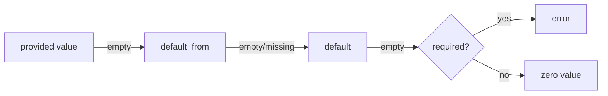

# Command directives

Directives common to **all** command types unless noted otherwise. Type-specific directives are listed in [types.md](types.md).

## Contents

- [Identity and visibility](#identity-and-visibility)
- [Bridge visibility](#bridge-visibility)
- [Confirmation](#confirmation)
- [Confirmation flow](#confirmation-flow)
- [Messages](#messages)
- [Notifications](#notifications)
- [Params](#params)
- [Param widgets](#param-widgets)
- [Pass-through arguments](#pass-through-arguments)
- [Context](#context)
- [Env](#env)
- [Files](#files)

## Identity and visibility

| Field | Type | Default | Description |
|-------|------|---------|-------------|
| `type` | enum | required | One of `shell`, `dwe`, `script`, `service_exec`, `service_run`, `workflow`, `builtin`, `daemon` |
| `description` | string | — | Human-readable description shown in the DWE CLI (selectors, `commands list`, `commands -i`) |
| `private` | bool | `false` | Hides from `dwe commands list` and blocks direct `commands run`; still callable from workflows and pipelines |
| `hide` | string | `""` | Condition expression. When truthy at runtime, the command is treated as if it does not exist: invisible in `dwe commands`, completion, and TUI; rejected on direct invocation; and workflow steps targeting it are auto-skipped with `SkipReason="hidden"`. Same syntax as workflow step `when:` — see [Hide condition](#hide-condition) below. |
| `bridge` | block | absent | Opts the command in to the container surface of the [host bridge](../../concepts/bridge.md) — without it the command is host-only and invisible to the in-container `dwe` shim. See [Bridge visibility](#bridge-visibility) below. |
| `notify` | bool | `false` | Fire a desktop notification when the command finishes. See [Notifications](#notifications) below. |

## Hide condition

`hide:` is a runtime-evaluated visibility gate, distinct from `private:`:

- `private:` is a static developer intent — the command is always invisible to end users.
- `hide:` is a per-invocation condition — the command appears when the condition is falsy and disappears when truthy. Typical use: tie commands to enabled services.

The expression syntax matches workflow step `when:` — supports Go templates (`{{ ... }}`), `${...}` variable substitution, the `cmd:` prefix for shell-command predicates, and hyphenated filesystem predicates like `file-exists` / `file-missing` / `dir-exists` (there is no `file:` prefix). See [conditions](../conditions.md) for the full grammar.

Cascade rules:

- A `hide:` field on a group's `group:` block hides the entire group **and all descendants** (commands and sub-groups). The cascade is one-way: a child cannot opt back in via `hide: false`. To make exceptions, restructure the groups.
- When a workflow step references a hidden command, the step is skipped at runtime with `SkipReason="hidden: <id>"` printed to stderr. The workflow itself continues normally.

Inspect output (`dwe commands -i <id>`) is allowed on hidden commands and shows both the `hide:` expression and the resolved `Hidden: true` line — useful for debugging why a command disappeared.

```yaml
# workspace/services/db/commands.yml — disappears when db is disabled
group:
  title: Database
  hide: '{{ not (index .services "db" "enabled") }}'

commands:
  migrate:
    type: shell
    cmd: db migrate
  # individual command can also be hidden:
  reset_engine:
    type: shell
    hide: '{{ eq (index .services "db" "engine") "sqlite" }}'
    cmd: db reset --engine
```

## Bridge visibility

`bridge:` controls whether the command can be listed and invoked **from inside a container** through the [host bridge](../../concepts/bridge.md) shim. The default is opt-in: a command with no `bridge:` block anywhere is host-only — invisible in container listings/completion and rejected on direct invocation with `command_not_bridged`.

| Field | Type | Default | Description |
|-------|------|---------|-------------|
| `bridge.enabled` | bool | `false` | Opt the command in to the container surface. |
| `bridge.services` | list | all | Restrict visibility to the containers of the named services (`workspace/services/<name>` folder names). Absent means "inherit from the group, or all services when nowhere set"; an explicit `services: []` overrides an inherited restriction back to all services. |

The same block is valid on the file's `group:` header, where it sets the default for every command in the file. Inheritance is **field-wise**: an absent command field inherits the group value, a set one overrides it — so a command can flip `enabled: false` under an enabling group, or widen/narrow `services` on its own. For `services` the absent/empty distinction matters: an omitted field inherits the group list, while an explicit `services: []` is a declared override back to "all services" (`dwe validate` flags the empty list so the intent stays visible).

```yaml
group:
  title: Code style
  bridge:
    enabled: true          # every command in this file…
    services: [main]       # …but only from the main container

commands:
  all:
    type: service_exec
    cmd: composer cs       # inherits: bridged, main only
  fix-deps:
    type: shell
    cmd: brew install something
    bridge:
      enabled: false       # host-only exception
  report:
    type: service_exec
    cmd: composer cs:report
    bridge:
      services: [main, admin]   # widened, still enabled via group
```

Semantics worth knowing:

- **Execution is never gated.** A bridged workflow happily runs non-bridged sub-commands — the gate covers the container *invocation surface*, not what the host may execute on a container's behalf.
- **`extends:` children inherit the parent's rights.** Matching follows the calling service's [`extends:`](../services/extends.md) chain: with `admin` extending `main`, a command listing `services: [main]` is also visible from the `admin` container. The reverse never holds — listing `admin` does not admit `main`.
- **No magic from `service:`.** A `service_exec` command targeting `main` is not auto-restricted to the `main` container; restriction is always explicit via `bridge.services`.
- **The caller identity is advisory.** The shim reports its service via `DWE_BRIDGE_SERVICE` (overlay-injected); a container could claim another name. `bridge.services` is a UX boundary between containers of one project — the security boundary stays the bridge's [top-level command allowlist](../../concepts/bridge.md#command-policy-inside-containers).
- `dwe validate` warns when `bridge.services` names an unknown service or one whose `service.yml` has the bridge disabled (unless a bridge-enabled service extends it — the entry still works for those children).

## Confirmation

| Field | Type | Default | Description |
|-------|------|---------|-------------|
| `confirmation` | bool | `false` | If true, prompt the user before executing |
| `confirmation_text` | string | `Are you sure?` | Prompt shown when `confirmation: true`; supports `${...}` templates |

The prompt is bypassed only when `SkipConfirm` is set on the in-process `RunContext`. That happens for:

- `commands --yes` / `-y`,
- workflow children inheriting `SkipConfirm` from a parent that was started with `--yes`,
- callers in tests that construct a `RunContext{SkipConfirm: true}` directly.

A non-TTY stdin does **not** skip the prompt — it routes through the plain Y/n fallback (`render.Writer.Confirm`). That fallback auto-answers "yes" when the `CI` environment variable is set; otherwise an answer other than `y` aborts the command.

```yaml
db.drop:
  type: service_exec
  confirmation: true
  confirmation_text: "Drop database `${param.database}`?"
  ...
```

## Confirmation flow

Every command goes through the same four-tier dispatch when `confirmation: true` (or for builtin/workflow `confirm` steps):

```mermaid
flowchart TD
    A[confirmation: true] --> B{SkipConfirm flag?}
    B -- yes --> Z[skip]
    B -- no  --> C{ConfirmFunc injected?}
    C -- yes --> D[callback - tests]
    C -- no  --> E{stdin is TTY?}
    E -- yes --> F[huh.Confirm prompt]
    E -- no  --> G[stdin Y/n fallback]
```



Operational notes:

- `commands --yes` sets `SkipConfirm` and `NonInteractive` on the in-process `RunContext` so every confirm call (top-level command, builtin `confirm`, workflow confirm steps) skips the prompt for the duration of the invocation.
- Subprocess env propagation is **scoped to the script runner**: `type: script` injects `DWE_NONINTERACTIVE=1` (along with `DWE_PARAMS_JSON`, `DWE_CONTEXT_JSON`, etc.) into the script's environment. `type: shell` exports a smaller contract — `DWE_BIN`, `COMPOSE_PROJECT_NAME`, `COMPOSE_FILE` (see [Shell env contract](types.md#shell-env-contract)) — but **not** `DWE_NONINTERACTIVE`. `type: dwe`, `service_exec`, and `service_run` export none of these — confirmation skipping inside them is enforced by the `RunContext` they run under, not by the env.
- Inside a workflow, child commands inherit `NonInteractive` and `SkipConfirm` from the parent `RunContext`.
- The non-TTY fallback is `render.Writer.Confirm`; under `CI=1` it auto-confirms.

## Messages

| Field | Type | Description |
|-------|------|-------------|
| `messages.success` | string | Emitted on success; supports `${...}` and Go templates |
| `messages.error` | string | Emitted on failure (in addition to the runner's own error) |

```yaml
messages:
  success: "Database `${param.database}` is ready."
  error: "Failed to create database `${param.database}`."
```

## Notifications

`notify: true` opts the command into a desktop notification when it finishes (success or failure). The notification only fires when **all** of the following hold:

- the `CommandDef` declares `notify: true` (default is `false`);
- the command is the **top-level** invocation — `dwe commands <id>` typed by the user. Commands invoked transitively as a workflow sub-step (sequential or parallel), from a deploy pipeline action, or from a reset pipeline action are **always suppressed at runtime** regardless of their own `notify:` value;
- the user's `notify_enabled` master switch and `notify_commands_enabled` per-op gate are both true;
- the environment is interactive (not CI / `DWE_NONINTERACTIVE` / non-TTY).

The rule: "the notification fires for the command you typed, not for any command it runs internally."

```yaml
db.import:
  type: script
  notify: true            # fires once when `dwe commands db.import` finishes
  script:
    path: workspace/scripts/db-import.sh
```

Validation rules:

- `notify: true` on a `type: daemon` command is a **validator error** — daemons have no completion event, so notifications are meaningless. Remove `notify:` or change the type.
- `notify: true` on a direct sub-step inside a `parallel:` block produces an **info** diagnostic — purely an early warning, since the runtime already suppresses it. Make the command top-level if you want a notification.

Full reference: [Notifications](../notifications.md) — user-config keys, file locations, gate matrix, environment-variable overrides.

## Params

`params:` declares typed inputs the command accepts via `--set key=value` or via `with:` from a workflow / deploy step.

```yaml
params:
  database:
    type: string                # string (default), bool, int, path
    description: Database name to create
    required: true
    default: "laravel"          # literal fallback
    default_from: vars.db.database   # dot-path into merged config
    env: DB_NAME                # injected as env var
    pattern: ^[a-zA-Z0-9_-]+$   # anchored regex (string/path only)
```

| Field | Type | Description |
|-------|------|-------------|
| `type` | enum | `string` (default), `bool`, `int`, `path` |
| `description` | string | Human-readable description shown in the DWE CLI (param help in selectors and `commands -i`) |
| `required` | bool | Error if not supplied and no default resolves |
| `default_from` | string | Dot-path into the merged DWE config; preferred source for the default |
| `default` | string | Literal fallback used when nothing else resolves |
| `env` | string | If set, the resolved value is exported under this env name |
| `pattern` | string | Anchored regex that the resolved value must fully match (string/path only) |

Resolution order:



The config-driven `default_from` is the preferred source — this matches the standard "config wins, code provides safety net" pattern and lets `local.yml` overrides reach commands without rewriting their literal defaults. An empty string returned by `default_from` is treated as not-found so the literal `default` still acts as a true safety net.

## Param widgets

Params can declare a **widget type** to control how they are presented in the interactive form, and a list of **options** that guide the user to valid choices. This is especially useful when the valid options are stored in your DWE config and you want the form to stay in sync without duplicating the list in the command file.

```yaml
params:
  # Static list of options
  format:
    type: string
    widget: select
    description: Output format
    options: [json, yaml, toml]

  # List with custom labels
  driver:
    type: string
    widget: select
    description: Database driver
    options:
      - { value: pg,    label: "PostgreSQL 16" }
      - { value: mysql, label: "MySQL 8" }

  # Dynamic options from config (e.g., defaults.yml or local.yml)
  database:
    type: string
    widget: select
    description: Database to use
    options: ${vars.databases}
    default_from: vars.default_db

  # Multiple selections
  services:
    type: string
    widget: multiselect
    description: Services to enable
    options: ${vars.services_list}
    separator: ","
```

| Field | Type | Default | Description |
|-------|------|---------|-------------|
| `widget` | enum | inferred from `type` | One of `input`, `select`, `multiselect`, `confirm`. Inferred as `confirm` for `bool`; `select` if `options` present; `input` for string/int/path without options |
| `options` | list or ref | — | Static list of option values, list of `{value, label}` objects, or a dot-path reference to config (e.g., `${vars.databases}`) |
| `separator` | string | `" "` | Joining separator for multiselect results; used only when `widget: multiselect` |

Widget rendering:

- **`input`** — text field; user types freely. Used for string/int/path with no `options`.
- **`select`** — single-choice dropdown/menu. Used when `options` are available and exactly one must be chosen.
- **`multiselect`** — multi-choice list; selected items are joined with the `separator` into a string. Values are space-separated by default or per your custom `separator`.
- **`confirm`** — yes/no prompt. Used for `bool` params; the resolved value is either `"true"` or `"false"`.

Options resolution:

- **Static list** (`options: [a, b, c]`) — the list is literal.
- **Labeled options** (`options: [{value: x, label: X}, ...]`) — value is used internally, label is shown to the user.
- **Config reference** (`options: ${vars.databases}`) — the form resolves the dot-path from your merged config (workspace.yml + defaults.yml + local.yml) at runtime. The resolved value can be a scalar list (`[a, b, c]`) or a map (`{x: X, y: Y}` → options with value=key, label=value). Empty or missing references are caught with a clear error when you try to open the form.

Validation:

- `options` and `pattern` are mutually exclusive — choose one or the other.
- For `select` or `multiselect`, the `options` field must be present and non-empty (either static or resolvable from config).
- A `default_from` or `default` value must exist in the resolved options list, or the command will error when you try to run it.
- `--set key=value` with an invalid choice (not in options) will error unless `options` resolved empty — in that case, you can bypass validation to supply an explicit override.

## Pass-through arguments

Everything a caller writes after `--` is offered to the command as `${args}`:

```sh
dwe cmd site.test -- --run src/map/engine.test.ts
```

This is **opt-in per command**. A command reaches the arguments only by naming
`${args}` in its `cmd:` or `argv:`; one that does not is rejected with an error
naming the command and the one-line change that grants them. There is no safe
default placement to guess at — `npm test <files>` needs a `--` that npm would
otherwise eat, `go test -race ./... <pkg>` would name two package sets, and a
multi-line shell script would get the arguments stapled onto its last line.

Valid for `shell`, `dwe`, `service_exec` and `service_run` — the types that
have a `cmd:`/`argv:` to substitute into. A `script`, `workflow`, `builtin` or
`daemon` command has neither, so it cannot take pass-through arguments.

### Placement

In a `cmd:` string the `${args}` slot becomes **`"$@"`**, and the arguments are
handed to the shell as positional parameters. They never appear in the shell
program itself, so nothing in an argument can change the command's structure: a
filename containing a space stays one argument, and `;`, backticks or `$(…)`
stay literal text.

Write the slot **unquoted** — `${args}`, not `"${args}"`. It already expands to
a correctly-quoted `"$@"`; wrapping it in quotes of your own produces `""$@""`,
which still executes nothing but splits arguments on whitespace.

Two placements silently lose the arguments, because `"$@"` is scoped:

- **inside a shell function body** — there `$@` is the *function's* arguments,
  so the slot renders empty. Forward them explicitly (`f() { … ${args}; }; f "$@"`
  does not help either, since the outer `"$@"` is what the slot became). Keep
  the slot in the top-level scope.
- **after `set --`** — that statement replaces the positional parameters, so a
  slot placed later in the script gets the script's own values instead. Put the
  slot before any `set --`.

Neither can execute anything — the failure mode is a missing argument, not an
injected one — but neither is reported, so a multi-line `cmd:` that uses either
construct should place the slot deliberately.

```yaml
test:
  type: service_exec
  service: site
  cmd: "npm test ${args}"
```

In an `argv:` vector an element that is **exactly** `${args}` is spliced
element-wise — the arguments are already separate entries there and must not be
re-quoted. An empty set splices to nothing, so the element vanishes rather than
leaving an empty-string argument behind:

```yaml
test:
  type: service_exec
  service: backend
  argv: [go, test, -count=1, -race, "${args}"]
```

An element that merely *embeds* the token (`--filter=${args}`) is **rejected at
load time**: nothing re-splits an argv element, so it could only ever produce a
single mangled argument.

### The `args:` block

Optional, and only meaningful alongside a `${args}` reference — declaring it
without one is reported as inert.

| Field | Type | Description |
|-------|------|-------------|
| `default` | list | Substituted when the caller passed **no** arguments |
| `prefix` | list | Inserted immediately before the caller's arguments, and **only** when there are some |

The asymmetry is deliberate. `default` exists for a command whose argument slot
is not optional — `argv: [go, test, -race, "${args}"]` must fall back to
`./...` or it would test the current directory instead of the module. `prefix`
carries the separator a wrapper needs to forward flags to the tool underneath,
and is not emitted for `default` (a bare call should not produce `npm test --`).

```yaml
# site: npm eats a bare --run, so the caller's flags need their own --
test:
  cmd: "npm test ${args}"
  args:
    prefix: ["--"]

# backend: the package list is required, so an empty call needs a fallback
test:
  argv: [go, test, -count=1, -race, "${args}"]
  args:
    default: ["./..."]
```

```sh
dwe cmd site.test -- --run x.test.ts   # → npm test -- --run x.test.ts
dwe cmd site.test                      # → npm test
dwe cmd backend.test -- ./internal/api # → go test -count=1 -race ./internal/api
dwe cmd backend.test                   # → go test -count=1 -race ./...
```

`dwe cmd -i <id>` reports whether a command accepts pass-through arguments and
which prefix/default apply.

## Context

`context:` declares values pulled from the merged DWE config and exposed to the command for templating and (optionally) as env vars. Unlike params, context values are not user-overridable — they always come from config.

```yaml
context:
  internal_workdir:
    from: services.main.work_dir_internal
    required: true
    env: APP_WORKDIR
```

| Field | Type | Description |
|-------|------|-------------|
| `from` | string | Dot-path into merged `DweConfig.Raw` |
| `required` | bool | Error if the path resolves to nil or empty string |
| `env` | string | Optional env var name to inject |

## Env

`env:` is a free-form map of env vars added directly to the child process. Values support full `${...}` and Go template syntax.

```yaml
env:
  MYSQL_PWD: "${vars.db.password}"
  TIMESTAMP: "{{ now | date \"2006-01-02_15-04-05\" }}"
  NON_INTERACTIVE: "{{ if .Params.no_prompt }}1{{ else }}0{{ end }}"
```

Each env var name must be declared exactly once across `context.<key>.env`, `params.<key>.env`, `files.<id>.env`, and the `env:` block — a duplicate name across any of these is rejected at load time (there is no override/precedence, collisions are errors).

## Files

`files:` declares external file artefacts the command reads or produces. The CLI resolves paths, optionally creates parent directories, exposes them via `${files.<id>.path}` and as env vars, and cleans up failed writes safely.

The file spec declared here is the **single source of truth** for conditional deployment: use `files_gate:` in `deploy.yml` / `lifecycle.yml` / `reset.yml` to skip or run steps based on whether these same files exist. See [files_gate: (pre-condition for files)](../deploy/conditions.md#files_gate-pre-condition-for-files) in the deploy reference for details.

```yaml
files:
  dump:
    access: write
    path: "${param.dump_dir}/${param.database}_{{ now | date \"2006-01-02\" }}.sql.gz"
    mkdir: true
    overwrite: true
    on_error: remove
    env: DUMP_FILE
```

### File ID grammar

File IDs must match `^[a-zA-Z_][a-zA-Z0-9_]*$` — letters, digits, underscore. No hyphens or dots.

### File spec fields

| Field | Type | Description |
|-------|------|-------------|
| `access` | enum | `read`, `write`, `read_write` (required) |
| `path` | string | Literal path (mutually exclusive with `candidates`). Required for `write`. |
| `candidates` | list | Ordered fallback list (read/read_write only) |
| `required` | bool | For `read`: error if not found. For `read_write`: always required regardless. |
| `mkdir` | bool | Create parent directories before writing (write only) |
| `overwrite` | bool | Allow replacing an existing file (write only) |
| `on_error` | enum | `keep` (default) or `remove` (write/read_write only) |
| `env` | string | Inject the resolved absolute path as this env var |

### Candidate fallback

`candidates` is a list. Each entry is either a literal path or a glob with optional regex match and sort.

```yaml
files:
  dump:
    access: read
    candidates:
      - glob: "${param.dump_dir}/${param.database}_*.sql.gz"
        match: '\d{4}-\d{2}-\d{2}'   # regex on basename
        sort: name_desc              # name_asc | name_desc | modtime_asc | modtime_desc
      - path: "${param.dump_dir}/${param.database}.sql.gz"
    required: true
    env: DUMP_FILE
```

The CLI walks `candidates` in order, taking the first that resolves. For glob entries, matches are filtered by `match` (regex against basename) and sorted, then the first sorted match wins.

### Access modes

| Mode | Pre-existence | Allowed fields | Behavior |
|------|---------------|----------------|----------|
| `read` | enforced if `required: true` | `path` or `candidates` | File must exist (or be optional) |
| `write` | not checked | `path`, `mkdir`, `overwrite`, `on_error` | File is created/overwritten |
| `read_write` | always enforced | `path` or `candidates`, `on_error` | File must exist; may be modified |

Cleanup safety: `on_error: remove` only deletes files that did **not** exist before the invocation. Pre-existing files are never removed by failure cleanup, even in `read_write` mode.

### Templating in file paths

`path`, `candidates[].path`, `candidates[].glob`, and `candidates[].match` all support templates. They are rendered before existence checks. The resolved paths become available to subsequent templates via `${files.<id>.path}` (in `confirmation_text`, `cmd`, `argv`, `workdir`, `env:`, etc.).
