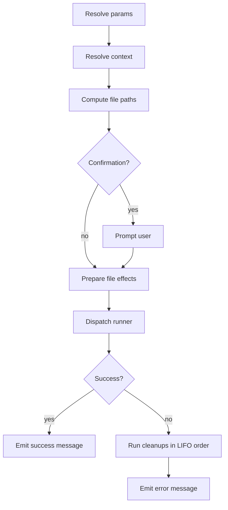

# commands/

Declarative command definitions for the DWE project.

## Contents

- [Purpose](#purpose)
- [File layout and command IDs](#file-layout-and-command-ids)
- [File structure](#file-structure)
- [Execution lifecycle](#execution-lifecycle)
- [Visibility, registration, and discovery](#visibility-registration-and-discovery)
- [End-to-end examples](#end-to-end-examples)
- [Related commands](#related-commands)
- [Interactive browser](#interactive-browser)
- [Further reading](#further-reading)

## Purpose

`workspace/commands/` is the home of every reusable, scriptable action the project exposes through the CLI: container shells, build steps, database operations, multi-step workflows, deploy hooks, custom scripts, etc.

Each YAML file declares one or more named commands. Commands are discovered automatically by walking the directory tree, are addressable by a dot-separated ID, and can be executed directly (`dwe commands <id>`) or referenced from workflows and pipelines (`deploy.yml`, `lifecycle.yml`).

This page is the entry point to the configuration reference. Directives, types, templating, and validation each have their own sibling page — see [Further reading](#further-reading) at the bottom.

## File layout and command IDs

The directory layout determines the **group** prefix and the file's basename determines the leaf segment. Files and subdirectories are entirely up to the project — names below are illustrative, and any number of files at any depth may exist.

```
workspace/commands/
├── <top-group>.yml              → group: <top-group>
├── …                            → any number of top-level groups
└── <parent-group>/              → optional subdirectory expands a group
    ├── <child>.yml              → group: <parent-group>.<child>
    ├── <child>/                 → optional deeper subdirectory
    │   └── <leaf>.yml           → group: <parent-group>.<child>.<leaf>
    └── …                        → any number of children, any depth
```

Concretely, a project might lay things out like this — every name here is the project's choice, not a convention enforced by the CLI:

```
workspace/commands/
├── db.yml                       → group: db
├── app.yml                      → group: app
└── services/
    ├── <service-a>.yml          → group: services.<service-a>
    ├── <service-a>/
    │   └── db.yml               → group: services.<service-a>.db
    └── <service-b>.yml          → group: services.<service-b>
```

Each command's full ID is `<group>.<name>` where `<name>` is its key inside the file's `commands:` map.

Pattern: put the **core** commands of a group in a single file named after the group (`services/<service>.yml`), and split larger groups into a sibling subdirectory only when there are enough commands to warrant logical sub-groups (`services/<service>/db.yml`, `services/<service>/cache.yml`). The subdirectory is optional — small groups stay in one file. There are no required files: a project may have zero, one, or dozens of groups at any depth.

```yaml
# workspace/commands/db.yml  →  group "db"
commands:
  cli:                          # full ID: db.cli
    type: service_exec
    ...
  dump-create:                  # full ID: db.dump-create
    type: script
    ...
```

There are no reserved file names — every `*.yml` file contributes a segment derived from its path.

## File structure

Each file has two top-level keys: an optional `group:` block of metadata, and a required `commands:` map.

```yaml
group:
  title: Database
  description: Database container management commands

commands:
  <local-name>:
    type: <type>
    description: <text>
    # ... directives below ...
```

| Field | Type | Description |
|-------|------|-------------|
| `group.title` | string | Display title shown by `dwe commands list` |
| `group.description` | string | Short description shown next to the group |
| `group.hide` | string | Optional condition expression; when truthy, hides the group and cascades to every descendant (commands and sub-groups). See [Hide condition](directives.md#hide-condition). |
| `commands` | map | Named command definitions (key = local name) |

## Execution lifecycle

Every command, regardless of type, flows through the same execution pipeline:



Phases:

1. **Resolve params** — for each declared parameter try, in order: caller-supplied value → `default_from` (dot-path into the merged config; empty result is treated as missing) → literal `default` → required-error. Then coerce to the declared type and validate `pattern`.
2. **Resolve context** — read each `context.<key>.from` dot-path out of the merged config.
3. **Compute file paths** — render `path` / `candidates` templates, normalise to absolute, discover files. Non-mutating.
4. **Confirmation** — when `confirmation: true`, prompt the user; the prompt is bypassed only by `SkipConfirm` (set by `--yes` / `-y` and inherited by workflow children). Otherwise dispatch is by stdin: TTY → `huh.Confirm`, non-TTY → plain Y/n fallback that auto-answers "yes" when the `CI` environment variable is set (to any non-empty value). Refusal aborts the command. See [Confirmation flow](directives.md#confirmation-flow) for the full decision tree.
5. **Prepare file effects** — `mkdir`, `overwrite` checks, register cleanup callbacks.
6. **Run** — dispatch to the type-specific runner (host shell, DWE CLI, container exec/run, script, or workflow).
7. **Success / error** — emit `messages.success` or `messages.error`. On error, registered cleanups fire in LIFO order before the error message.

## Visibility, registration, and discovery

- Files under `workspace/commands/` are discovered recursively at startup.
- Each file is parsed and validated; a load failure halts startup with a structured error pointing to the file and field.
- `private: true` hides commands from `dwe commands list` and rejects direct invocation via `dwe commands`. Private commands can still be referenced from workflows and pipelines — useful for steps that should only run as part of a larger sequence.

```yaml
db.up:
  type: dwe
  private: true              # used only inside db.start workflow
  cmd: "docker up db"
```

## End-to-end examples

### A self-contained service_exec command

```yaml
db.create:
  type: service_exec
  description: Create a database in the db container
  service: db
  params:
    database:
      type: string
      required: true
      pattern: ^[a-zA-Z0-9_-]+$
  env:
    MYSQL_PWD: "${vars.db.password}"
  messages:
    success: "Database `${param.database}` is ready."
    error: "Failed to create database `${param.database}`."
  cmd: "mariadb -u${vars.db.user} -e 'CREATE DATABASE IF NOT EXISTS `${param.database}` CHARACTER SET utf8mb4 COLLATE utf8mb4_unicode_ci;'"
```

### A script command with file artefacts

```yaml
db.dump-create:
  type: script
  description: Create a database dump file
  params:
    database:
      type: string
      default_from: vars.db.database
      pattern: ^[a-zA-Z0-9_-]+$
    dump_dir:
      type: string
      default_from: vars.db.backup_dir
      required: true
      pattern: ^[^*?\[\]]+$
    dump_date:
      type: bool
      default: true
  env:
    DB_NAME: "${param.database}"
    DB_USER: "${vars.db.user}"
    MYSQL_PWD: "${vars.db.password}"
  files:
    dump:
      access: write
      path: "${param.dump_dir}/${param.database}{{ if .Params.dump_date }}_{{ now | date \"2006-01-02\" }}{{ end }}.sql.gz"
      mkdir: true
      overwrite: true
      on_error: remove
      env: DUMP_FILE
  script:
    path: workspace/scripts/db/dump-create.sh
    shell: bash
  messages:
    success: "Database dump created at ${files.dump.path}"
    error: "Failed to create database dump"
```

### A read-with-fallback file spec

```yaml
db.dump-deploy:
  type: script
  confirmation: true
  confirmation_text: "This will DROP and recreate `${param.target_database}`. Continue?"
  params:
    target_database:
      default_from: vars.db.database
      required: true
    dump_dir:
      default_from: vars.db.backup_dir
      required: true
  files:
    dump:
      access: read
      candidates:
        - glob: "${param.dump_dir}/${param.target_database}_*.sql.gz"
          match: '\d{4}-\d{2}-\d{2}'
          sort: name_desc
        - path: "${param.dump_dir}/${param.target_database}.sql.gz"
      required: true
      env: DUMP_FILE
  script:
    path: workspace/scripts/db/dump-deploy.sh
    shell: bash
```

### A workflow with conditional and confirm steps

```yaml
reset-and-bootstrap:
  type: workflow
  description: Drop, recreate, and bootstrap the main service
  steps:
    - confirm: "Drop and re-bootstrap `${vars.db.database}`?"

    - command: db.drop
      with:
        database: "${vars.db.database}"

    - command: services.main.db.create

    - command: services.main.composer-install
      when: "file-missing services/main/src/vendor/autoload.php"

    - command: services.main.migrate

    - command: optional-cache-warm
      continue_on_error: true
```

### A private composition

```yaml
# workspace/commands/db.yml
db.up:
  type: dwe
  private: true
  description: Start the database container in the background
  cmd: "docker up db"

db.wait:
  type: builtin
  private: true
  description: Wait for the db container to become healthy
  cmd: docker_wait_healthy
  with:
    services: [db]
    timeout: 120s
    interval: 2s

db.start:
  type: workflow
  private: true
  description: Start the database container and wait until healthy
  steps:
    - command: db.up
    - command: db.wait
```

`db.start` cannot be invoked directly via `dwe commands db.start`, but `bootstrap` can reference it from its `steps:`. The composition above is the canonical pattern: a thin `type: dwe` for the start, a `type: builtin` for the wait, and a `type: workflow` that strings them together.

> **Custom network names + partial `up`/`run`.** If your compose file gives a network an explicit `networks.<x>.name:`, be aware of a docker-compose quirk: the first command to *materialize* that network wins its labels. A partial `docker up db` or a `type: service_run` step (which runs `docker compose run --rm --no-deps …`) executed **before** the full stack comes up can create the named network with labels a later `up --wait` then rejects (`network <x> … has incorrect label com.docker.compose.network`). This is upstream compose behavior, not a DWE bug — DWE declares no networks of its own and passes the same project/`-f` set to every invocation. The fix is ordering: bring the whole stack up (`docker up --wait`, the built-in final deploy phase) before any partial `up <svc>` or `run --rm` that touches the custom-named network, or drop the explicit `name:` and let compose scope the network to the project.

## Related commands

- `dwe commands list` — list all public commands grouped by file
- `dwe commands <id> [--set k=v] [--yes] [-- <args>]` — execute a command (alias: `dwe cmd <id>`). Everything after `--` is offered to the command as `${args}`, opt-in per command — see [directives § Pass-through arguments](directives.md#pass-through-arguments)
- `dwe commands --inspect <id>` (or `-i`) — show the resolved definition (params, context, env, runner)
- `dwe docs generate` — regenerate the per-command reference under `docs/reference/commands/`

When `dwe commands` is invoked without an exact command ID on an interactive terminal, an interactive two-panel command browser opens — see [Interactive browser](#interactive-browser).

`--inspect` / `-i` is mutually exclusive with `--set` and `--yes`; it requires an exact command id and prints the definition without running it.

## Interactive browser

The browser runs on the shared `tui` framework: two bordered panels (tree on the left, command list on the right), a bottom status line (brand · breadcrumb · `? help`), and a `?`-triggered modal help that lists the bindings active in the current mode. Panel focus cycles with `Tab` / `Shift+Tab`; the focused panel is highlighted by its border. The mouse is supported (see [Mouse](#mouse)).

It takes no configuration: top-level groups are expanded on entry, empty subtrees collapse during fuzzy filtering, and type badges are on.

### Hotkeys

Focus moves between the two panels with `Tab` / `Shift+Tab`. Navigation and select bindings are dispatched to the focused panel; tree-only verbs (`→/l`, `←/h`) are inert in the list, and the run-mode verbs (`e`, `y`) are absent outside run mode. The `?` modal lists exactly the bindings active in the current mode.

| Binding | Action |
| --- | --- |
| `Tab` / `Shift+Tab` | cycle focus between the tree and the list panel |
| `↑/↓`, `k/j` | move the cursor in the focused panel |
| `→`, `l` | expand the focused group, or step into its first child (tree only; no-op in the list) |
| `←`, `h` | collapse the focused group, or step to its parent (tree only; no-op in the list) |
| `Home` / `End` | jump to the first / last row of the focused panel |
| `PgUp` / `PgDn` | scroll the focused panel one viewport |
| `Enter` | on a tree group: toggle expansion; on a list item: confirm the selection (run, inspect, or edit, depending on entry point) |
| `/` | enter inline filter mode |
| `i` | open the inspect overlay for the highlighted command |
| `y` | toggle skip-confirm (run mode only); the status line shows `[--yes ON]` |
| `e` | confirm the highlighted command and force the param form open (run mode only) |
| `?` | toggle the modal help |
| `Esc`, `q`, `Ctrl+C` | exit the browser |

While the **inline filter** is active (`/`), typed characters refine the fuzzy query — the query line renders inside the tree panel, the tree narrows live with updated `M/N` match counts, `Enter` commits the filtered expansion, and `Esc` restores the prior expansion state. Action letters (`i`, `e`, `y`, …) are typed into the query, not dispatched, while filtering.

While the **inspect overlay** is open (`i`), it captures input: `↑/↓`, `k/j`, `PgUp/PgDn`, `Home`/`End` scroll the centred viewport, `Enter` confirms (returns the same `Result` as `Enter` from the list), and `Esc` closes the overlay.

#### Parameter form (in-TUI overlay)

On the two-panel frame path (TTY ≥ 80 cols), selecting a command that takes parameters opens the **param form as an overlay over the browser** — the browser dims beneath it and the status line stays visible — instead of tearing the TUI down first. You fill the parameters in place; multi-field forms scroll inside the overlay (the focused field stays visible). On submit the overlay closes, the browser exits, and the command runs in the plain terminal (banner + streamed output) with the values you entered. `Esc` cancels the form and returns you to the browser with no command run and the cursor / expansion / filter state intact; `Ctrl+C` quits the whole TUI.

`Enter` auto-skips the form when every required parameter already has a value (from `--set` or a declared default) — the command runs immediately with no overlay. Use `e` (edit-parameters) to force the form open even when the required values are already satisfied. A command with no parameters always runs immediately on `Enter`.

The command still *executes* after the TUI exits (it streams docker / pipeline output to the plain terminal); only parameter entry moves into the overlay. A `confirmation:` prompt, if declared, still shows its yes/no in the plain terminal after the TUI exits, immediately before the run. On the narrow (< 80-col) fallback the browser keeps the flat exit-then-form flow. Direct `dwe commands <id>` (with or without `--set`), piped / non-interactive, and `--output json` invocations are unaffected. (A bare `dwe commands --set …` with no id still opens the browser on a TTY — the `--set` values just prefill the overlay.)

The `e` (edit-parameters) and `y` (skip-confirm) bindings are only registered in run mode (the default when `--inspect` / `-i` is not set); in inspect and the vars-browser edit mode they are absent from both the keymap and the `?` help.

### Fallback ladder

The browser inspects the terminal at startup and degrades gracefully. Below the two-panel minimum (or on a size-read failure) it drops straight to the flat `huh.NewSelect` list — there is no in-TUI single-panel mode.

| Condition | Behaviour |
| --- | --- |
| non-TTY | the call site short-circuits with the existing `no exact command ID given; pass a full command ID or run in an interactive terminal` error; the browser is never reached (and `Run` defensively cancels if it is) |
| TTY, `width < 80` or `height < 15` | delegate to the flat `huh.NewSelect` list (the pre-browser UX) |
| TTY, `width ∈ [80, 99]` | two-panel frame without `(N)` group counts and without type badges |
| TTY, `width ≥ 100` | full two-panel frame with badges and counts (the breadcrumb is always shown in the bottom status line) |

`NO_COLOR=1` is honoured automatically via lipgloss/bubbletea: badges render as plain text and the focus marker uses bold instead of colour.

### Mouse

The frame enables mouse support:

- **Single click** in a panel moves the cursor to the clicked row and sets focus to that panel; it never toggles a group or runs a command.
- **Double click** acts as `Enter` on the clicked row — it toggles a tree group or confirms a list item.
- **Wheel** scrolls the panel under the pointer (the tree, the command list, or an open inspect overlay) without changing focus — it works regardless of which panel is focused.
- Clicking the `? help` hint in the status line toggles the modal help; clicks inside an open modal are swallowed.

## Further reading

- [directives.md](directives.md) — common fields: identity, confirmation, messages, notifications, params, context, env, files
- [types.md](types.md) — the eight command types and their type-specific fields, plus workdir resolution
- [templating.md](templating.md) — render context, command-scope resolvers, template-space reference
- [validation.md](validation.md) — validation rules cheat sheet and common pitfalls
- [`styles.md`](../styles.md) — palette keys consumed by the browser's type badges
