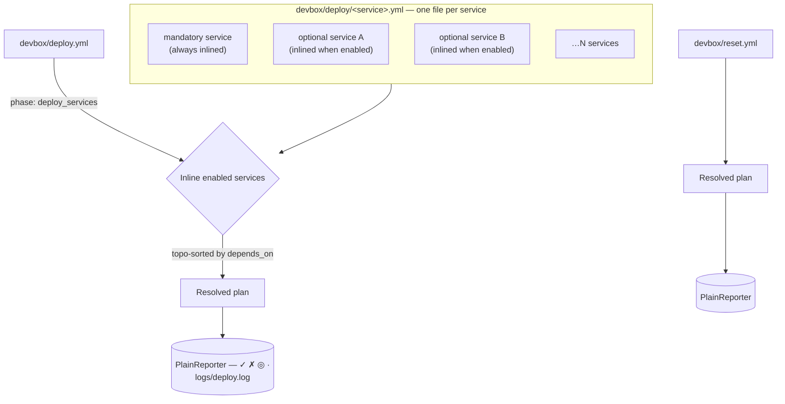

# deploy.yml / reset.yml

Deploy and reset pipeline declarations.

## Contents

- [Purpose](#purpose)
- [File roles](#file-roles)
- [Structure](#structure)
- [Top-level fields](#top-level-fields)
- [Phase fields](#phase-fields)
- [Step fields](#step-fields)
- [Step execution types](#step-execution-types)
  - [`run: <shell command>`](#run-shell-command)
  - [`devbox: "<subcommand>"`](#devbox-subcommand)
  - [`command: <id>`](#command-id)
  - [`builtin: <name>`](#builtin-name)
- [Available builtins](#available-builtins)
  - [`service_dirs_ensure`](#service_dirs_ensure)
  - [`service_configs_copy`](#service_configs_copy)
  - [`message`](#message)
  - [`confirm`](#confirm)
  - [`docker_remove_project_volumes`](#docker_remove_project_volumes)
  - [`remove_paths`](#remove_paths)
- [Conditions (`when` / `check`)](#conditions-when--check)
- [Post-deploy semantics](#post-deploy-semantics)
- [`deploy_services` marker](#deploy_services-marker)
- [Example: orchestrator pipeline](#example-orchestrator-pipeline)
- [Example: per-service pipeline](#example-per-service-pipeline)
- [Common pitfalls](#common-pitfalls)
- [Related commands](#related-commands)

## Purpose

`devbox/deploy.yml` declares the orchestrator deploy pipeline. `devbox/reset.yml` declares the destructive reset pipeline. Per-service deploy pipelines live in `devbox/deploy/<service>.yml`.

All three are loaded separately by `LoadDeployConfig()` and are not merged with the 3-layer config.

## File roles

| File | Loader | Role |
|------|--------|------|
| `devbox/deploy.yml` | `LoadDeployConfig` | Top-level orchestrator: lists phases in order, references service pipelines |
| `devbox/deploy/<svc>.yml` | `LoadServiceDeployConfigs` | Per-service phases and steps (inlined by orchestrator at `deploy_services: true`) |
| `devbox/reset.yml` | `LoadResetConfig` | Separate reset pipeline, executed via `devbox reset run`. `deploy_services` phases are rejected. |



Every service declared in `services.yml` may contribute its own `devbox/deploy/<name>.yml`. At plan time the orchestrator filters that set down to enabled services (mandatory ones are always enabled) and inlines them in topological `depends_on` order. Services without a deploy file are silently skipped — not every service needs one.

## Structure

```yaml
log: true                          # optional: tee output to logs/<pipeline>.log

phases:
  - name: <phase-name>
    description: Human-readable description
    when: "<condition>"            # optional: skip phase if false
    untracked: true                # optional: suppress step output for this phase
    deploy_services: true          # orchestrator marker (deploy.yml only)
    steps:
      - name: <step-name>
        description: Human-readable description
        when: "<condition>"        # optional: skip step if false
        check: "<check-expr>"      # optional: post-condition; abort pipeline if false
        continue_on_error: true    # optional: failure does not abort the pipeline
        <type>: <value>
        with:                      # parameters (for builtin: and command: types)
          key: value
```

## Top-level fields

| Field | Type | Default | Description |
|-------|------|---------|-------------|
| `log` | bool | `deploy.yml`: `true`; `reset.yml`: `false` | Tee devbox status messages and child stdout/stderr to `logs/<pipeline>.log` (ANSI codes stripped). |
| `phases` | list | — | Ordered list of phases. |

## Phase fields

| Field | Type | Default | Description |
|-------|------|---------|-------------|
| `name` | string | required | Unique phase key within the pipeline |
| `description` | string | optional | Shown in `deploy plan` output |
| `when` | string | — | Condition expression; phase skipped if falsy |
| `untracked` | bool | false | If true, phase steps are excluded from the step counter and produce no system output |
| `deploy_services` | bool | false | Orchestrator marker: CLI inlines per-service pipelines here in dependency order |

## Step fields

| Field | Type | Description |
|-------|------|-------------|
| `name` | string | Unique step key within the phase |
| `description` | string | Shown in `deploy plan` output |
| `when` | string | Condition expression; step skipped if falsy |
| `check` | string | Post-condition evaluated after the step succeeds; pipeline aborts when the expression is false. Same expression kinds as `when` except Go templates. Skipped when `continue_on_error: true` and the step failed. |
| `continue_on_error` | bool | When `true`, a failed step is reported via `FailStep` (red ✗) but the pipeline does not abort. The post-step `check` and the next-step hook are skipped for the failed step. Useful for optional hook phases — see [lifecycle.yml](lifecycle.md). |

Exactly one execution type field must be set per step.

## Step execution types

### `run: <shell command>`

Executes a shell command via `sh -c`. Full shell semantics apply: environment variable expansion, globbing, pipes, redirection, and `&&`/`||` operators all work as expected.

```yaml
- name: chmod-scripts
  run: chmod +x scripts/deploy.sh
```

### `devbox: "<subcommand>"`

Invokes a devbox CLI subcommand. The binary path is resolved automatically.

```yaml
- name: up
  devbox: "docker up"

- name: info
  devbox: "info"

- name: render-ide
  devbox: "render ide main"
```

### `command: <id>`

Dispatches a declarative command by ID from the command registry (`devbox/commands/`).

```yaml
- name: composer-install
  command: services.main.composer-install

- name: db-create
  command: services.main.db.create
  with:
    database: laravel_test
```

### `builtin: <name>`

Executes an engine-internal Go function. Builtins run in-process and have access to the full config.

```yaml
- name: create-dirs
  builtin: service_dirs_ensure
  with:
    service: main
    mode: skip

- name: success-msg
  builtin: message
  with:
    level: success
    text: "Deploy completed"
```

## Available builtins

The full registry lives in `internal/builtin/`. Six builtins ship today:

| Builtin | Purpose |
|---------|---------|
| `service_dirs_ensure` | Create service hub directories |
| `service_configs_copy` | Copy template config files into the service hub |
| `message` | Print a styled message at info/success/warning/error level |
| `confirm` | Interactive Y/n prompt (skipped under `--yes`) |
| `docker_remove_project_volumes` | Remove all volumes whose name is prefixed with the compose project name |
| `remove_paths` | Delete project-relative paths from the filesystem |

### `service_dirs_ensure`

Creates service hub directories.

| Parameter | Type | Default | Description |
|-----------|------|---------|-------------|
| `service` | string | required | Service key from `services.yml` |
| `mode` | string | `skip` | `skip`, `error`, or `recreate` |

Resolved dir list: `[src, configs]` + `ServiceConfig.Dirs` (from `services.yml`). Each entry must be a non-empty relative path that does not escape the service `dir`.

Mode behavior:

| Mode | Dir missing | Dir exists | Non-dir at path |
|------|-------------|------------|----------------|
| `skip` | create | no-op | error |
| `error` | create | error | error |
| `recreate` | create | remove + create | error |

Safety: `src` and `configs` always use `skip` semantics in `recreate` mode (never removes source code or templated configs).

### `service_configs_copy`

Copies template config files from `configs/services/<service>/` into `services/<service>/configs/`.

| Parameter | Type | Default | Description |
|-----------|------|---------|-------------|
| `service` | string | required | Service key |
| `mode` | string | `replace` | `default`, `update`, or `replace` |

Mode behaviour:

| Mode | Dest missing | Dest exists |
|------|--------------|-------------|
| `default` | write | no-op |
| `replace` | write | overwrite unconditionally |
| `update` | write | merge new `KEY=VALUE` lines without changing existing keys (env-file aware) |

When the corresponding `configs[]` entry has a `mountpoint`, the builtin also touches an empty file at `<service-dir>/<mountpoint>` so Docker Desktop virtiofs can place a nested file bind mount over it.

### `message`

Prints a message to deploy output.

| Parameter | Type | Description |
|-----------|------|-------------|
| `level` | string | `info`, `success`, `warning`, or `error` (required) |
| `text` | string | Message text (required); supports Go template expressions against `DevboxConfig` |

```yaml
- name: done
  builtin: message
  with:
    level: success
    text: "Deploy of {{ .Project.Name }} completed"
```

### `confirm`

Prompts the user for confirmation before continuing. Skipped when `--yes` flag is set or when `ExecContext.SkipConfirm` is on. On a TTY uses huh.Confirm; on a piped/CI stdin falls back to plain Y/n.

| Parameter | Type | Default | Description |
|-----------|------|---------|-------------|
| `message` | string | `Are you sure?` | Prompt text |
| `ok_msg` | string | `Continuing` | Success message after confirmation |
| `stop_msg` | string | `Aborted` | Error message after rejection / Esc |

### `docker_remove_project_volumes`

Removes all Docker volumes whose name starts with `<project_name>_` (resolved from `docker.yml` against the merged config). No parameters. Aborts if the resolved project name is empty.

### `remove_paths`

Removes paths from the filesystem.

| Parameter | Type | Description |
|-----------|------|-------------|
| `paths` | list of strings | Project-relative paths to remove. Each must be relative and must not escape the project root; absolute paths and `..` traversal are rejected at validate time. |

## Conditions (`when` / `check`)

`when:` is a **pre-condition**. It is evaluated before the step runs; a falsy result skips the step.

```yaml
when: "dir-empty services/main/src"    # true if directory exists and is empty
when: "{{ .Services.Second.Enabled }}" # template expression against config
```

`check:` is a **post-condition**. It runs after the step succeeds and **aborts the pipeline** when the expression is false. The same expression kinds as `when` are supported, except Go templates. Use `check:` to assert that a step had its intended effect — e.g. that a migration produced a certain file or that a service became reachable. Use `when:` for idempotency (skip when already done).

```yaml
- name: composer-install
  command: services.main.composer-install
  when: "file-missing services/main/src/vendor/autoload.php"   # skip if already installed
  check: "file-exists services/main/src/vendor/autoload.php"   # abort if it didn't appear
```

If `continue_on_error: true` is set on the same step, a failed `check:` is **not** evaluated — the step has already been reported as failed and execution moves on.

## Post-deploy semantics

The `post-deploy` phase (by convention, the last phase in `deploy.yml`) runs only if all prior phases succeed. This is not magic — it follows the existing behavior where deploy aborts on first failure. Name the final summary phase `post-deploy` and it naturally benefits from this.

Use `untracked: true` on the `post-deploy` phase to suppress system step messages (the builtin steps produce their own output via the message level):

```yaml
- name: post-deploy
  description: Post-deploy summary
  untracked: true
  steps:
    - name: info
      devbox: "info"
    - name: success
      builtin: message
      with:
        level: success
        text: Deploy completed successfully
```

## `deploy_services` marker

In `deploy.yml`, a phase with `deploy_services: true` is a placeholder. The CLI replaces it with the inlined per-service pipelines at runtime, ordered by dependency (`depends_on` in `services.yml`). Only enabled services are included.

```yaml
phases:
  - name: services
    deploy_services: true
    description: Deploy all enabled services
```

## Example: orchestrator pipeline

```yaml
# devbox/deploy.yml
phases:
  - name: services
    deploy_services: true
    description: Deploy all enabled services

  - name: start
    description: Start containers
    steps:
      - name: up
        devbox: "docker up"
      - name: wait-healthy
        devbox: "docker wait"

  - name: post-deploy
    description: Post-deploy summary
    untracked: true
    steps:
      - name: info
        devbox: "info"
      - name: success
        builtin: message
        with:
          level: success
          text: Deploy completed successfully
```

## Example: per-service pipeline

```yaml
# devbox/deploy/main.yml
phases:
  - name: setup
    description: Create dirs and install
    when: "dir-empty services/main/src"
    steps:
      - name: create-dirs
        builtin: service_dirs_ensure
        with:
          service: main
      - name: install
        command: app.install
      - name: copy-configs
        builtin: service_configs_copy
        with:
          service: main
          mode: replace

  - name: init
    description: Initialize application
    steps:
      - name: db-create
        command: services.main.db.create
      - name: composer-install
        command: services.main.composer-install
      - name: migrate
        command: services.main.migrate

  - name: finalize
    description: Generate IDE config
    steps:
      - name: render-ide
        devbox: "render ide main"
```

## Common pitfalls

- **Direct `docker compose` in `run:`** — use `devbox:` with a `docker` subcommand instead. Docker policy (project name, args) is applied automatically.
- **Missing `with:` for builtin parameters** — builtins require `with:` for their parameters; passing them as top-level step fields does not work.
- **`deploy_services` in `reset.yml`** — rejected at load time. The reset pipeline does not iterate services; if you need per-service cleanup, declare it explicitly in the reset phases.
- **Forgetting `log: false` for noisy reset runs** — reset defaults to `log: false`, deploy defaults to `log: true`. Set the field explicitly when you want behaviour different from the default.
- **Using `continue_on_error` to mask real failures in core phases** — it is meant for hook phases (pre/post). A failed `docker up` should always abort.

## Related commands

- `devbox deploy plan` — show resolved pipeline (with inlined service phases)
- `devbox deploy run` — execute deploy pipeline
- `devbox deploy step <phase> <step>` — run a single step (debugging)
- `devbox reset plan` — show reset pipeline
- `devbox reset run [--yes]` — execute reset pipeline
- See also [lifecycle.yml](lifecycle.md) — `run` / `stop` pipelines reuse the same phase/step grammar with optional update probe and hook phases.
