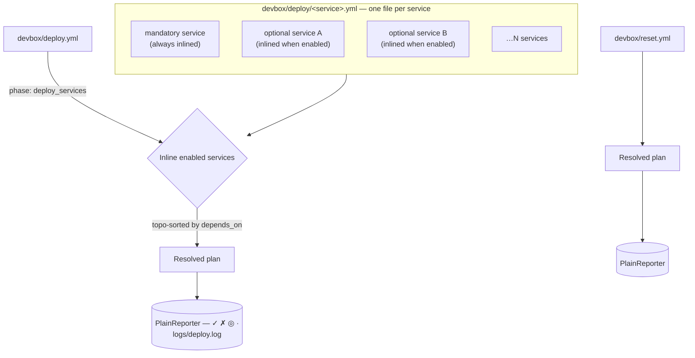

# deploy.yml / reset.yml

Deploy and reset pipeline declarations.

## Contents

- [Purpose](#purpose)
- [File roles](#file-roles)
- [Structure](#structure)
- [Top-level fields](#top-level-fields)
- [Phase fields](#phase-fields)
- [Step fields](#step-fields)
- [Step execution types](#step-execution-types)
  - [`type: shell`](#type-shell)
  - [`type: devbox`](#type-devbox)
  - [`type: command`](#type-command)
  - [`type: builtin`](#type-builtin)
- [Available builtins](#available-builtins)
  - [`service_dirs_ensure`](#service_dirs_ensure)
  - [`service_configs_copy`](#service_configs_copy)
  - [`service_configs_check`](#service_configs_check)
  - [`message`](#message)
  - [`confirm`](#confirm)
  - [`docker_remove_project_volumes`](#docker_remove_project_volumes)
  - [`remove_paths`](#remove_paths)
- [Conditions and checks](#conditions-and-checks)
  - [`when:` (pre-condition)](#when-pre-condition)
  - [`check:` (post-condition)](#check-post-condition)
- [Post-deploy semantics](#post-deploy-semantics)
- [`deploy_services` marker](#deploy_services-marker)
- [Example: orchestrator pipeline](#example-orchestrator-pipeline)
- [Example: per-service pipeline](#example-per-service-pipeline)
- [Common pitfalls](#common-pitfalls)
- [Related commands](#related-commands)

## Purpose

`devbox/deploy.yml` declares the orchestrator deploy pipeline. `devbox/reset.yml` declares the destructive reset pipeline. Per-service deploy pipelines live in `devbox/deploy/<service>.yml`.

All three are loaded separately by `LoadDeployConfig()` and are not merged with the 3-layer config.

## File roles

| File | Loader | Role |
|------|--------|------|
| `devbox/deploy.yml` | `LoadDeployConfig` | Top-level orchestrator: lists phases in order, references service pipelines |
| `devbox/deploy/<svc>.yml` | `LoadServiceDeployConfigs` | Per-service phases and steps (inlined by orchestrator at `deploy_services: true`) |
| `devbox/reset.yml` | `LoadResetConfig` | Separate reset pipeline, executed via `devbox reset run`. `deploy_services` phases are rejected. |



Every service declared in `services.yml` may contribute its own `devbox/deploy/<name>.yml`. At plan time the orchestrator filters that set down to enabled services (mandatory ones are always enabled) and inlines them in topological `depends_on` order. Services without a deploy file are silently skipped — not every service needs one.

## Structure

```yaml
log: true                          # optional: tee output to logs/<pipeline>.log

phases:
  # Normal phase: supports when, untracked, and steps
  - name: <phase-name>
    description: Human-readable description
    when:                          # optional: pre-condition (typed condition)
      type: builtin|shell|template
      cmd: <string>                # for builtin/shell
      expr: <string>               # for template
    untracked: true                # optional: suppress step output for this phase
    steps:
      - name: <step-name>
        description: Human-readable description
        type: shell|devbox|command|builtin  # execution type (required)
        cmd: <value>               # command payload (required)
        when:                      # optional: pre-condition (typed condition)
          type: builtin|shell|template
          cmd: <string>            # for builtin/shell
          expr: <string>           # for template
        check:                     # optional: post-condition (typed action)
          type: shell|devbox|command|builtin
          cmd: <value>
          with:                    # optional: parameters
            key: value
        continue_on_error: true    # optional: failure does not abort the pipeline
        with:                      # parameters (for command and builtin types)
          key: value

  # deploy_services phase (deploy.yml only): no steps or when allowed
  - name: services
    description: Human-readable description
    deploy_services: true          # orchestrator marker; mutually exclusive with steps and when
```

## Top-level fields

| Field | Type | Default | Description |
|-------|------|---------|-------------|
| `log` | bool | `deploy.yml`: `true`; `reset.yml`: `false` | Tee devbox status messages and child stdout/stderr to `logs/<pipeline>.log` (ANSI codes stripped). |
| `phases` | list | — | Ordered list of phases. |

## Phase fields

| Field | Type | Default | Description |
|-------|------|---------|-------------|
| `name` | string | required | Unique phase key within the pipeline |
| `description` | string | optional | Shown in `deploy plan` output |
| `when` | typed condition | — | Pre-condition; phase skipped if falsy (see [Conditions and checks](#conditions-and-checks)). Not allowed on `deploy_services` phases. |
| `untracked` | bool | false | If true, phase steps are excluded from the step counter and produce no system output |
| `deploy_services` | bool | false | Orchestrator marker: CLI inlines per-service pipelines here in dependency order. A `deploy_services` phase must not contain `steps` or a `when` condition — both are hard errors at load time. |

## Step fields

| Field | Type | Description |
|-------|------|-------------|
| `name` | string | Unique step key within the phase |
| `description` | string | Shown in `deploy plan` output |
| `type` | enum | Execution type: one of `shell`, `devbox`, `command`, `builtin` (required) |
| `cmd` | string | Command payload (required); content depends on `type` |
| `with` | mapping | Parameters passed to command or builtin (optional; required for most builtins) |
| `when` | typed condition | Pre-condition evaluated before the step runs; step skipped if falsy |
| `check` | typed action | Post-condition evaluated after the step succeeds; pipeline aborts when the action fails. Skipped when `continue_on_error: true` and the step failed. |
| `continue_on_error` | bool | When `true`, a failed step is reported via `FailStep` (red ✗) but the pipeline does not abort. The post-step `check` and the next-step hook are skipped for the failed step. Useful for optional hook phases — see [lifecycle.yml](lifecycle.md). **Behavior change:** when the step body succeeds but `check:` fails, and `continue_on_error: true`, the step is reported as failed and the pipeline continues to the next step (symmetric with body-failure semantics). |

## Step execution types

### `type: shell`

Executes a shell command via `sh -c`. Full shell semantics apply: environment variable expansion, globbing, pipes, redirection, and `&&`/`||` operators all work as expected.

```yaml
- name: chmod-scripts
  type: shell
  cmd: chmod +x scripts/deploy.sh
```

### `type: devbox`

Invokes a devbox CLI subcommand. The binary path is resolved automatically.

```yaml
- name: up
  type: devbox
  cmd: "docker up"

- name: info
  type: devbox
  cmd: "info"

- name: render-ide
  type: devbox
  cmd: "render ide main"
```

### `type: command`

Dispatches a declarative command by ID from the command registry (`devbox/commands/`).

```yaml
- name: composer-install
  type: command
  cmd: services.main.composer-install

- name: db-create
  type: command
  cmd: services.main.db.create
  with:
    database: laravel_test
```

### `type: builtin`

Executes an engine-internal Go function. Builtins run in-process and have access to the full config.

```yaml
- name: create-dirs
  type: builtin
  cmd: service_dirs_ensure
  with:
    service: main
    mode: skip

- name: success-msg
  type: builtin
  cmd: message
  with:
    level: success
    text: "Deploy completed"
```

## Available builtins

The full registry lives in `internal/builtin/`. Seven builtins ship today:

| Builtin | Purpose |
|---------|---------|
| `service_dirs_ensure` | Create service hub directories |
| `service_configs_copy` | Copy template config files into the service hub |
| `service_configs_check` | Verify that template config files exist in the service hub |
| `message` | Print a styled message at info/success/warning/error level |
| `confirm` | Interactive Y/n prompt (skipped under `--yes`) |
| `docker_remove_project_volumes` | Remove all volumes whose name is prefixed with the compose project name |
| `remove_paths` | Delete project-relative paths from the filesystem |

### `service_dirs_ensure`

Creates service hub directories.

| Parameter | Type | Default | Description |
|-----------|------|---------|-------------|
| `service` | string | required | Service key from `services.yml` |
| `mode` | string | `skip` | `skip`, `error`, or `recreate` |

Resolved dir list: `[src, configs]` + `ServiceConfig.Dirs` (from `services.yml`). Each entry must be a non-empty relative path that does not escape the service `dir`.

Mode behavior:

| Mode | Dir missing | Dir exists | Non-dir at path |
|------|-------------|------------|----------------|
| `skip` | create | no-op | error |
| `error` | create | error | error |
| `recreate` | create | remove + create | error |

Safety: `src` and `configs` always use `skip` semantics in `recreate` mode (never removes source code or templated configs).

### `service_configs_copy`

Copies template config files from `configs/services/<service>/` into `services/<service>/configs/`.

| Parameter | Type | Default | Description |
|-----------|------|---------|-------------|
| `service` | string | required | Service key |
| `mode` | string | `replace` | `default`, `update`, or `replace` |

Mode behaviour:

| Mode | Dest missing | Dest exists |
|------|--------------|-------------|
| `default` | write | no-op |
| `replace` | write | overwrite unconditionally |
| `update` | write | merge new `KEY=VALUE` lines without changing existing keys (env-file aware) |

When the corresponding `configs[]` entry has a `mountpoint`, the builtin also touches an empty file at `<service-dir>/<mountpoint>` so Docker Desktop virtiofs can place a nested file bind mount over it.

### `service_configs_check`

Verifies that all template config files declared in `services.yml` exist in the service hub after a `service_configs_copy` step. Use as a `check:` action to assert that configs were successfully deployed.

| Parameter | Type | Default | Description |
|-----------|------|---------|-------------|
| `service` | string | required | Service key |

Returns an error listing any missing files, which causes the check to fail. Typically used as the post-check of a `service_configs_copy` step:

```yaml
- name: copy-configs
  type: builtin
  cmd: service_configs_copy
  with:
    service: main
    mode: replace
  check:
    type: builtin
    cmd: service_configs_check
    with:
      service: main
```

### `message`

Prints a message to deploy output.

| Parameter | Type | Description |
|-----------|------|-------------|
| `level` | string | `info`, `success`, `warning`, or `error` (required) |
| `text` | string | Message text (required); supports Go template expressions against `DevboxConfig` |

```yaml
- name: done
  type: builtin
  cmd: message
  with:
    level: success
    text: "Deploy of {{ .Project.Name }} completed"
```

### `confirm`

Prompts the user for confirmation before continuing. Skipped when `--yes` flag is set or when the step is being confirmed via `ExecContext.SkipConfirm`. On a TTY uses huh.Confirm; on a piped/CI stdin falls back to plain Y/n.

| Parameter | Type | Default | Description |
|-----------|------|---------|-------------|
| `message` | string | `Are you sure?` | Prompt text |
| `ok_msg` | string | `Continuing` | Success message after confirmation |
| `stop_msg` | string | `Aborted` | Error message after rejection / Esc |

### `docker_remove_project_volumes`

Removes all Docker volumes whose name starts with `<project_name>_` (resolved from `docker.yml` against the merged config). No parameters. Aborts if the resolved project name is empty.

### `remove_paths`

Removes paths from the filesystem.

| Parameter | Type | Description |
|-----------|------|-------------|
| `paths` | list of strings | Project-relative paths to remove. Each must be relative and must not escape the project root; absolute paths and `..` traversal are rejected at validate time. |

## Conditions and checks

### `when:` (pre-condition)

`when:` is a **pre-condition** evaluated before a phase or step runs. A falsy result skips the phase/step without executing it. It is a **typed condition** with three forms:

**Builtin predicates** — test filesystem state using the predicate registry:

```yaml
when:
  type: builtin
  cmd: "dir-empty services/main/src"
```

Available predicates: `dir-exists`, `dir-missing`, `dir-empty`, `dir-not-empty`, `file-exists`, `file-missing`. These are distinct from the *engine builtins* (`service_configs_copy`, etc.) used in step bodies and `check:` actions — a known scope-narrowing documented here explicitly. The predicate registry is intentionally POSIX-portable (uses hardcoded `sh -c`) for consistency regardless of the project's configured shell.

**Shell commands** — execute a shell command; exit 0 = true, non-zero = false:

```yaml
when:
  type: shell
  cmd: "test -f services/main/src/vendor/autoload.php"
```

Shell commands also use hardcoded `sh -c` (not `ShellBin`) for portability.

**Template expressions** — Go template syntax evaluated at plan time:

```yaml
when:
  type: template
  expr: "{{ .Services.Second.Enabled }}"
```

Template conditions do not support `check:` in the same step (no side effects at plan time). They are purely for idempotency checks like "skip this phase if the feature is not enabled" where the result is known before execution.

### `check:` (post-condition)

`check:` is a **post-action** evaluated after a step succeeds. It is a **typed action** — the same `type:` / `cmd:` / `with:` shape as step bodies, but its success/failure determines whether the step is reported as passed or failed.

Use `check:` to assert that a step had its intended effect — e.g. that a migration produced a certain file, that a service became reachable, or that configs were copied successfully.

**Example: verify configs were deployed**

```yaml
- name: copy-configs
  type: builtin
  cmd: service_configs_copy
  with:
    service: main
    mode: replace
  check:
    type: builtin
    cmd: service_configs_check
    with:
      service: main
```

**Example: verify a shell command produces expected output**

```yaml
- name: run-migration
  type: command
  cmd: services.main.migrate
  check:
    type: shell
    cmd: "test -f services/main/src/migrations/.done"
```

**Behavior of `continue_on_error` with `check:`:**

- When a step body fails and `continue_on_error: true` is set, `check:` is **not** evaluated. The step is reported as failed and the pipeline continues.
- When a step body succeeds but `check:` fails, the step is reported as failed. If `continue_on_error: true`, the pipeline continues; otherwise it aborts. **This is a behavior change from prior versions**, where check failure always aborted regardless of `continue_on_error`.

## Post-deploy semantics

The `post-deploy` phase (by convention, the last phase in `deploy.yml`) runs only if all prior phases succeed. This is not magic — it follows the existing behavior where deploy aborts on first failure. Name the final summary phase `post-deploy` and it naturally benefits from this.

Use `untracked: true` on the `post-deploy` phase to suppress system step messages (the builtin steps produce their own output via the message level):

```yaml
- name: post-deploy
  description: Post-deploy summary
  untracked: true
  steps:
    - name: info
      type: devbox
      cmd: "info"
    - name: success
      type: builtin
      cmd: message
      with:
        level: success
        text: Deploy completed successfully
```

## `deploy_services` marker

In `deploy.yml`, a phase with `deploy_services: true` is a placeholder. The CLI replaces it with the inlined per-service pipelines at runtime, ordered by dependency (`depends_on` in `services.yml`). Only enabled services are included.

```yaml
phases:
  - name: services
    deploy_services: true
    description: Deploy all enabled services
```

## Example: orchestrator pipeline

```yaml
# devbox/deploy.yml
phases:
  - name: services
    deploy_services: true
    description: Deploy all enabled services

  - name: start
    description: Start containers
    steps:
      - name: up
        type: devbox
        cmd: "docker up"
      - name: wait-healthy
        type: devbox
        cmd: "docker wait"

  - name: post-deploy
    description: Post-deploy summary
    untracked: true
    steps:
      - name: info
        type: devbox
        cmd: "info"
      - name: success
        type: builtin
        cmd: message
        with:
          level: success
          text: Deploy completed successfully
```

## Example: per-service pipeline

```yaml
# devbox/deploy/main.yml
phases:
  - name: setup
    description: Create dirs and install
    when:
      type: builtin
      cmd: "dir-empty services/main/src"
    steps:
      - name: create-dirs
        type: builtin
        cmd: service_dirs_ensure
        with:
          service: main
      - name: install
        type: command
        cmd: app.install
      - name: copy-configs
        type: builtin
        cmd: service_configs_copy
        with:
          service: main
          mode: replace
        check:
          type: builtin
          cmd: service_configs_check
          with:
            service: main

  - name: init
    description: Initialize application
    steps:
      - name: db-create
        type: command
        cmd: services.main.db.create
      - name: composer-install
        type: command
        cmd: services.main.composer-install
      - name: migrate
        type: command
        cmd: services.main.migrate

  - name: finalize
    description: Generate IDE config
    steps:
      - name: render-ide
        type: devbox
        cmd: "render ide main"
```

## Common pitfalls

- **Using `devbox:` style instead of `type: devbox`** — the old multi-field syntax is no longer supported. Use `type:` + `cmd:` instead.
- **Missing `with:` for builtin parameters** — builtins require `with:` for their parameters; passing them as top-level step fields does not work.
- **`deploy_services` in `reset.yml`** — rejected at load time. The reset pipeline does not iterate services; if you need per-service cleanup, declare it explicitly in the reset phases.
- **Forgetting `log: false` for noisy reset runs** — reset defaults to `log: false`, deploy defaults to `log: true`. Set the field explicitly when you want behaviour different from the default.
- **Using `continue_on_error` to mask real failures in core phases** — it is meant for hook phases (pre/post). A failed `docker up` should always abort.
- **Confusing `when:` and `check:` with the new types** — `when:` is evaluated before the step runs (pre-condition); `check:` is evaluated after success (post-action). Both use the typed `type: builtin|shell|template` / `cmd:` shape for `when:`, and the typed `type: shell|devbox|command|builtin` shape for `check:`.

## Related commands

- `devbox deploy plan` — show resolved pipeline (with inlined service phases)
- `devbox deploy run` — execute deploy pipeline
- `devbox deploy step <phase> <step>` — run a single step (debugging)
- `devbox reset plan` — show reset pipeline
- `devbox reset run [--yes]` — execute reset pipeline
- See also [lifecycle.yml](lifecycle.md) — `run` / `stop` pipelines reuse the same phase/step grammar with optional update probe and hook phases.
