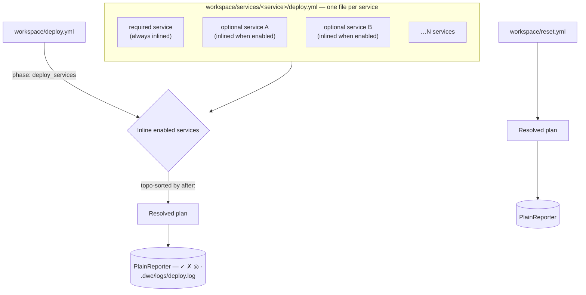

# deploy.yml / reset.yml

Deploy and reset pipeline declarations.

## Contents

- [Purpose](#purpose)
- [File roles](#file-roles)
- [Structure](#structure)
- [Top-level fields](#top-level-fields)
- [Phase fields](#phase-fields)
- [Step fields](#step-fields)
- [Post-deploy semantics](#post-deploy-semantics)
- [`deploy_services` marker](#deploy_services-marker)
- [Idempotent deploy and state](#idempotent-deploy-and-state)
- [Pages](#pages)
- [Related commands](#related-commands)

## Purpose

`workspace/deploy.yml` declares the orchestrator deploy pipeline. `workspace/reset.yml` declares the destructive reset pipeline. Per-service deploy pipelines live in `workspace/services/<service>/deploy.yml`.

All three are loaded separately and are not merged with the 3-layer config.

Both `workspace/deploy.yml` and `workspace/reset.yml` are optional. When absent, DWE substitutes a built-in default pipeline and prints one info line to stderr: `Using built-in default <deploy|reset> pipeline (override with workspace/<deploy|reset>.yml).` The info line is suppressed in `--output json` mode.

To start from that default instead of writing a pipeline from scratch, run `dwe deploy eject` (or `dwe reset eject`) — it emits the built-in pipeline as a commented, editable file. See [Related commands](#related-commands).

**Default deploy pipeline** (fires when `workspace/deploy.yml` is absent):

Phases: `services` (runs `deploy_services: true` to inline enabled service pipelines) → `start` (`type: dwe`, `cmd: "docker up --wait"`) → `post-deploy` (info display + success message).

**Default reset pipeline** (fires when `workspace/reset.yml` is absent):

Phases: `pre` (confirm prompt) → `stop` (`type: dwe`, `cmd: "docker down"`) → `cleanup` (remove volumes, remove `services/` directory).

## File roles

| File | Role |
|------|------|
| `workspace/deploy.yml` | Top-level orchestrator: lists phases in order, references service pipelines |
| `workspace/services/<svc>/deploy.yml` | Per-service phases and steps (inlined by the orchestrator at `deploy_services: true`). Any service type (app, tool, infra) may have a deploy pipeline. |
| `workspace/reset.yml` | Separate reset pipeline, executed via `dwe reset run`. `deploy_services` phases are rejected. |



Any service type (app, tool, or infra) may have a `workspace/services/<name>/deploy.yml`. At plan time the orchestrator filters that set down to **enabled** services (required ones are always enabled) and inlines them in topological `after:` order. Services without a deploy file are silently skipped — not every service needs one.

The `after:` field in `workspace/services/<name>/deploy.yml` declares deploy-time ordering between services (separate from runtime `depends_on:`). See [Top-level fields](#top-level-fields) for details.

## Structure

```yaml
log: true                          # optional: tee output to .dwe/logs/<pipeline>.log

phases:
  # Normal phase: supports when, untracked, and steps
  - name: <phase-name>
    description: Human-readable description
    when:                          # optional: pre-condition (typed condition)
      type: builtin|shell|template
      cmd: <string>                # for builtin/shell
      expr: <string>               # for template
    untracked: true                # optional: suppress step output for this phase
    steps:
      - name: <step-name>
        description: Human-readable description
        type: shell|dwe|command|builtin  # execution type (required)
        cmd: <value>               # command payload (required)
        when:                      # optional: pre-condition (typed condition)
          type: builtin|shell|template
          cmd: <string>            # for builtin/shell
          expr: <string>           # for template
        check:                     # optional: post-condition (typed action, or the scalar `auto`)
          type: shell|dwe|command|builtin
          cmd: <value>
          with:                    # optional: parameters
            key: value
        continue_on_error: true    # optional: failure does not abort the pipeline
        skip_confirm: true         # optional: bypass confirmation prompts for this step
        untracked: true            # optional: exclude this step from [N/M] counter and suppress its output
        files_gate: readable       # short form: state must be readable|missing
        # or long form:
        files_gate:
          state: readable|missing  # required
          command: <cmd-id>        # default: step.cmd (only valid for type: command)
          require: required|all|[id1, id2]  # default: required
          with:                    # default: step.with
            key: value
        with:                      # parameters (for command and builtin types)
          key: value

  # deploy_services phase (deploy.yml only): no steps or when allowed
  - name: services
    description: Human-readable description
    deploy_services: true          # orchestrator marker; mutually exclusive with steps and when
```

## Top-level fields

| Field | Type | Default | Description |
|-------|------|---------|-------------|
| `log` | bool | `deploy.yml`: `true`; `reset.yml`: `false` | Tee dwe status messages and child stdout/stderr to `.dwe/logs/<pipeline>.log`. The file receives one line per **committed** line, with ANSI codes stripped: a run of in-place redraw frames written with a lone `\r` (git clone progress, `curl`) collapses to its last frame instead of landing one line per frame, and a run that ends on a bare `\r` with no closing newline still has its last frame written at step end. Collapsing is not terminal emulation — `abc\rX\n` renders as `Xbc` on a real terminal but is logged as `X`. Trade-off: redraw frames no longer reach the file as they happen, so `tail -f .dwe/logs/deploy.log` no longer shows live clone progress, only committed lines. |
| `phases` | list | — | Ordered list of phases. |
| `after` | list of strings | `[]` | **Per-service `deploy.yml` only.** Declares deploy-time ordering: this service deploys after the named services. Omitted or empty means no deploy-ordering constraint. Distinct from runtime `depends_on:` (which controls container startup order) — use `after:` when you want one service's deploy steps to complete before another's begin. Not valid in `workspace/deploy.yml`, `workspace/reset.yml`, or `workspace/services/<name>/reset.yml` (load-time error). Full deploy (`dwe deploy run`) topo-sorts services by `after:`; `dwe deploy run --service <name>` does NOT cascade to declared `after:` dependencies (explicit intent overrides ordering). |

## Phase fields

| Field | Type | Default | Description |
|-------|------|---------|-------------|
| `name` | string | required | Unique phase key within the pipeline |
| `description` | string | optional | Shown in `deploy plan` output |
| `when` | typed condition | — | Pre-condition; phase skipped if falsy (see [Conditions](conditions.md)). Not allowed on `deploy_services` phases. |
| `untracked` | bool | false | If true, phase steps are excluded from the step counter and produce no system output |
| `deploy_services` | bool | false | Orchestrator marker: CLI inlines per-service pipelines here in dependency order. A `deploy_services` phase must not contain `steps` or a `when` condition — both are hard errors at load time. |

## Step fields

| Field | Type | Description |
|-------|------|-------------|
| `name` | string | Unique step key within the phase |
| `description` | string | Shown in `deploy plan` output |
| `type` | enum | Execution type: one of `shell`, `dwe`, `command`, `builtin` (required). See [Step execution types](steps.md). |
| `cmd` | string | Command payload (required); content depends on `type` |
| `with` | mapping | Parameters passed to command or builtin (optional; required for most builtins) |
| `when` | typed condition | Pre-condition evaluated before the step runs; step skipped if falsy. See [Conditions](conditions.md). |
| `check` | typed action, or the scalar `auto` | Post-condition evaluated after the step succeeds; pipeline aborts when the action fails. Skipped when `continue_on_error: true` and the step failed. See [Conditions](conditions.md). |
| `files_gate` | typed gate | Pre-condition based on file existence/absence from a command's `files:` block. Step skipped if unsatisfied. See [`files_gate:`](conditions.md#files_gate-pre-condition-for-files). |
| `continue_on_error` | bool | When `true`, a failed step is reported via `FailStep` (red ✗) but the pipeline does not abort. The post-step `check` and the next-step hook are skipped for the failed step. Useful for optional hook phases — see [lifecycle.yml](../lifecycle.md). When the step body succeeds but `check:` fails and `continue_on_error: true`, the step is reported as failed and the pipeline continues to the next step (symmetric with body-failure semantics). |
| `skip_confirm` | bool | When `true`, bypasses confirmation prompts for this step only — equivalent to a per-step `-y` / `--yes`. Propagates to the step body and its `check:` action. ORed with the pipeline-wide skip-confirm flag, so the step is non-interactive whenever either is set. Useful when most of the pipeline is interactive but one step (e.g. a `confirm` builtin guarding an idempotent action, or a command that re-prompts internally) should always proceed. |
| `untracked` | bool | When `true`, the step is excluded from the `[N/M]` step counter and its lifecycle output (start/done lines) is suppressed. Failures still surface. ORed with phase-level `untracked` — use the step-level flag to hide a single stack-up or wait-healthy step without moving it into a dedicated untracked phase. Allowed on parallel-group steps; sub-steps inherit untracked status from their group. |
| `timeout` | duration string | Optional wall-clock budget for this step's body, e.g. `30s`, `2m`. **Opt-in — no implicit default anywhere**: absent or `timeout: 0` is unbounded, exactly as if the field didn't exist. A positive value bounds only this one step (or, inside a `parallel:` group, this one substep) via `context.WithTimeout` around the step body; the `check:` action is not bounded by it. The timeout enforces through context cancellation, so it only bounds a body that honors `ctx` — `type: shell`/`type: dwe` subprocesses (terminated with SIGTERM, then force-killed after a grace period), ctx-aware builtins (`http_check`, `docker_wait_healthy`, `tcp_reachable`, …), and `type: command` steps whose own work honors `ctx`. A body blocked on interactive input (e.g. a `confirm` builtin waiting on stdin) is **not** force-interrupted — the deadline fires but the goroutine stays blocked until input arrives; a timeout on a human prompt is meaningless anyway, so this is an accepted limitation, not a bug. A negative duration (`"-1s"`) is rejected during pipeline resolution. General engine field: honored the same way in `deploy.yml`, `reset.yml`, `lifecycle.yml`, and `workspace/tests/*.yml` scenario steps. |

A step may also declare a `parallel:` block instead of leaf body fields (`type` / `cmd`). See [Parallel step groups](examples.md#parallel-step-groups).

## Templates in step fields

`cmd`, the string leaves of `with`, `check`, `timeout`, and shell `when:` are rendered at plan-resolution time — before the step is displayed or executed. A `${...}` reference with a known head (`vars`, `services`, `project`, …) is substituted with its actual value; `dwe deploy plan` therefore prints what will actually run, not the literal `${vars.*}` text from `deploy.yml`. A `${...}` with an unknown head (a shell-style `${HOME}`, a typo) — or a head-only one with no dot-path, such as a `${host}` / `${files}` shell variable — is left as a literal and, if it survives into the plan output, is called out with a trailing `[unresolved: ${...}]` annotation (also carried as the `unresolved` field in `--output json`) — that annotation is a display-only hint and is never added to `--format shell`, which stays a clean line per step.

**Plan output is redacted.** A value the config loader decrypted (see [`secrets.md`](../secrets.md#redaction)) prints as `***` on every plan and dry-run surface — the `deploy plan` table, `--format shell`, `--output json` (including the `unresolved` field), `reset plan` and `reset step --dry-run`. Redaction happens in the display functions that build those lines, before the value is quoted or embedded into a `--set k=v` argument, so `--format shell` is a **preview of what will run, not a script to execute** when a step references a secret. What actually executes is never redacted. Values shorter than 4 runes are not redacted anywhere.

**A step field carrying a known-head `${...}` must not also contain a literal `{{ }}`.** Substitution runs the field through the same Go-template engine the `${...}` shorthand compiles down to, so a `docker` format string in the same command — `cmd: 'docker inspect -f "{{.State.Status}}" ${vars.container}'` — is evaluated as a template and fails the resolve with `can't evaluate field State`. The whole `dwe deploy plan` / `dwe deploy run` stops there. Either keep the two apart (put the format string in a script, or the `${vars.*}` value in a shell variable), or escape the braces as `{{"{{"}}`. A `cmd`, `check`, `timeout` or `when:` field with **no** known-head reference never enters the engine at all, so a plain `docker inspect -f "{{.State.Status}}" app` — or one using only a shell variable like `${CONTAINER}` — is passed through untouched.

The string leaves of `with:` are the one exception, and only where the value ends up in a user command: a `type: command` step or action, a `files_gate:`'s own `with:`, and the step's `with:` when a `files_gate:` declares none of its own (the gate then inherits the step's map as its parameters). There a leaf is rendered whenever it carries a known-head `${...}` **or** a literal `{{`, because that `with:` value has always been passed through this template engine before reaching the command. So `with: {host: '{{ resolve .Raw "vars.db.host" }}'}` still resolves, and the mixed-form restriction above applies to those leaves too.

A `type: builtin` `with:` map keeps the narrow gate — a known-head `${...}` is substituted, a literal `{{ }}` is passed through untouched. That holds even when a `files_gate:` inherits the map: the widening above applies to every other step type, never to a builtin's parameters. Builtins consume their `with:` values raw and some render them against a *different* template space: `message` renders its `text` as a Go template over `DweConfig` (`{{ .Project.Name }}`), and the `shell` predicate takes `docker inspect -f "{{.State.Status}}"` format strings. Both keep working unchanged.

**Only project-config paths and `${host.uid}` / `${host.gid}` resolve in a pipeline step.** The namespaces that belong to a user command or a config render pass — `${param.*}`, `${context.*}`, `${files.*}`, `${generated.*}` and `${args}` — have no source here, so referencing one is a resolve error naming the namespace, not a silent empty substitution:

```
step "checkout": cmd: template uses ${param.branch}: the "param" namespace has no source here
(only project config paths and ${host.*} resolve on this path)
```

`${snapshot.*}` fails the same way outside a snapshot workflow. To pass a value into a step, put it in `vars:` and reference `${vars.*}`; to give a `type: command` step its parameters, use the step's own `with:` map — that map *supplies* the target command's `${param.*}`, it cannot read them. The same rule applies to `workspace/tests/*.yml` scenario steps, which render through the identical substrate.

Because a rendered step's actual text now depends on the `vars:` block, the whole `vars:` block is included in both the project and per-service config hash, so changing a referenced value re-runs the steps that use it instead of the deploy reporting a stale `already up-to-date`. **One-time consequence on upgrade**: this changes the project config hash for every existing project, so the first `dwe deploy run` after upgrading to a dwe version carrying this change re-runs every step once, even without any `vars:` change of your own. The steps are expected to be idempotent and gated, so this is safe, just visible — do not be alarmed if a deploy that has been "up-to-date" for weeks suddenly re-runs everything one time.

## Post-deploy semantics

The `post-deploy` phase (by convention, the last phase in `deploy.yml`) runs only if all prior phases succeed. This is not magic — it follows the existing behavior where deploy aborts on first failure. Name the final summary phase `post-deploy` and it naturally benefits from this.

Use `untracked: true` on the `post-deploy` phase to suppress system step messages (the builtin steps produce their own output via the message level):

```yaml
- name: post-deploy
  description: Post-deploy summary
  untracked: true
  steps:
    - name: info
      type: dwe
      cmd: "info"
    - name: success
      type: builtin
      cmd: message
      with:
        level: success
        text: Deploy completed successfully
```

## `deploy_services` marker

In `deploy.yml`, a phase with `deploy_services: true` is a placeholder. The CLI replaces it with the inlined per-service pipelines at runtime, ordered by dependency (the `after:` field in each service's `workspace/services/<name>/deploy.yml`). Only enabled services are included.

```yaml
phases:
  - name: services
    deploy_services: true
    description: Deploy all enabled services
```

## Idempotent deploy and state

By default, `dwe deploy run` tracks the outcome and hash of every executed step in `.dwe/deploy/state.yml`. On the next deploy run, steps that succeeded with unchanged `action_hash` values are **skipped** (unless they have a `check:` action, which always runs to re-validate idempotency).

This makes deploys idempotent: re-running an unchanged project is fast (unchanged steps are skipped), while editing a step body automatically re-triggers it. Edits to service config files (`workspace/services/<name>/service.yml`) or deploy configs (`workspace/deploy.yml`, `workspace/services/<name>/deploy.yml`) invalidate the affected scope and force those steps to re-run.

Key behaviors:

- **Step hash change** → step re-runs
- **Service config change** → all service steps re-run
- **Project config change** → all project-level steps re-run
- **Has `check:` action** → step always runs (even if hash matches), so the check re-validates idempotency
- **Has `files_gate: state: missing`** → journal skip is bypassed and the gate is re-evaluated on every deploy (the producer pattern: artifact deletion must re-trigger production regardless of journal contents)
- **Has `files_gate: state: readable`** → journal skip is consulted first like any other step; the gate only fires when the journal would otherwise let the step run (the consumer pattern: destructive consumers stay idempotent). Use an explicit `check:` to force re-evaluation on every run
- In both cases the journal records the step for audit/status display using `step_hash`, which includes the gate config — so changing the gate invalidates the recorded hash and re-triggers the step
- **Previous step failed** → step re-runs on next deploy (allows `--resume` to continue from the failure)

Use `dwe deploy state show` to inspect the journal, `dwe deploy state clear` to reset it, and `dwe deploy state repair` to fix corrupted aggregates.

See [state/index.md](../state/index.md) for full details on hashing, skip decisions, and recovery from mid-deploy crashes.

## Pages

- [Step execution types](steps.md) — `shell`, `dwe`, `command`, `builtin`; the `cmd: shell` builtin vs `type: shell` step distinction
- [Available builtins](builtins.md) — every builtin with inputs and examples; internal engine builtins
- [Conditions](conditions.md) — `when:`, `check:`, and `files_gate:` semantics
- [Examples](examples.md) — orchestrator, per-service, infra `after:`, parallel groups, workflow sub-step overrides, common pitfalls

## Related commands

- `dwe deploy plan` — show resolved pipeline (with inlined service phases). `--format table` (default) / `--format shell`, or `--output json` for the machine-readable form: `{service?, phases[]}`, each phase carrying `name` / `service` / `description` / `when` and an ordered `steps[]` of `{name, type, cmd, unresolved[], description, when, files_gate, check, continue_on_error, untracked, parallel{max_concurrent, fail_fast, steps[]}}`. `--output json` supersedes `--format`.
- `dwe deploy run` — execute deploy pipeline with state tracking
- `dwe deploy state show` — inspect deploy state journal
- `dwe deploy state clear` — reset deploy state
- `dwe deploy state repair` — rebuild state aggregates
- `dwe deploy eject [--out PATH] [--force]` — emit the **built-in default** deploy pipeline as a commented, editable `deploy.yml`. It is a constant, not this project's effective plan: nothing is rendered, per-service pipelines are not inlined, and there is no `--service` filter (use `dwe deploy plan` for the resolved instance). With no `--out` (or `--out -`) the document goes to stdout and nothing is written; with `--out PATH` it is written to that file and **refuses to overwrite an existing one unless `--force` is given** — the refusal names the file, and says so explicitly when the file is inert (all comments / empty, or declaring no phases), which is the same file `dwe validate` reports as `has no active content …`. There is no implicit default path: the canonical target is `workspace/deploy.yml`, passed explicitly. Remember that an active `workspace/deploy.yml` **replaces** the built-in pipeline whole.
- `dwe reset eject [--out PATH] [--force]` — the same for the built-in default reset pipeline and `workspace/reset.yml`; see [reset.md](../reset.md).
- `dwe reset plan` — show reset pipeline
- `dwe reset run [--yes]` — execute reset pipeline
- See also [lifecycle.yml](../lifecycle.md) — `run` / `stop` pipelines reuse the same phase/step grammar with optional update probe and hook phases. There is deliberately **no `lifecycle eject`**: the effective `stop` pipeline always carries the engine-synthetic `_auto_reap_daemons` phase, and a user-authored phase whose name starts with `_` is rejected at load time — an emitted `lifecycle.yml` would be a file dwe itself refuses to load back.
