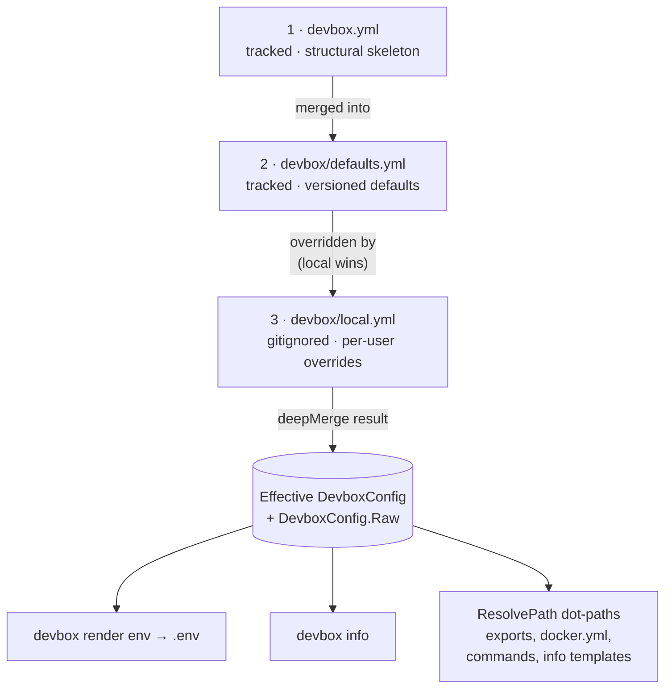

# devbox.yml / defaults.yml / local.yml

The three layers of the merged devbox config.

## Contents

- [Merge overview](#merge-overview)
- [What belongs in each layer](#what-belongs-in-each-layer)
- [Dot-path resolution](#dot-path-resolution)
  - [Where service fields come from](#where-service-fields-come-from)
- [devbox.yml](#devboxyml)
  - [Field reference](#field-reference)
- [devbox/defaults.yml](#devboxdefaultsyml)
  - [`services`](#services)
  - [`debug`](#debug)
  - [`runtime`](#runtime)
  - [`state`](#state)
  - [`exports.env`](#exportsenv)
  - [`db`](#db)
  - [`compose`](#compose)
  - [`ide`](#ide)
- [devbox/local.yml](#devboxlocalyml)
- [Common pitfalls](#common-pitfalls)
- [Related commands](#related-commands)

## Merge overview



Read top-to-bottom: each arrow is "next layer applied on top". `local.yml` sits at the end, so any key it sets shadows the same key from `defaults.yml` or `devbox.yml`. Keys absent from `local.yml` fall through to `defaults.yml`, then to `devbox.yml`, then to the typed Go zero value.

The three files share a single namespace — the same key in different layers is the same setting. Layer 1 establishes structure, Layer 2 fills in defaults, Layer 3 overrides for the local machine. None of the three is required to declare every key; missing keys simply fall through to whatever lower layer set them, with type-zero values as the ultimate fallback.

`devbox/local.yml` is optional: when absent, the merge silently skips layer 3.

## What belongs in each layer

| Concern | Layer |
|---------|-------|
| Project name and prefix | `devbox.yml` |
| Schema version | `devbox.yml` |
| Binary overrides (`binaries:`) | `devbox.yml` only (engine policy, not layered) |
| Service ports / hosts (apps, tools, infra) | [`devbox/services.yml`](services.md) (per-entry `ports:` / `hosts:` maps) |
| Service structural definitions (container / compose / status / render) | [`devbox/services.yml`](services.md) |
| Optional service enabled state (across all types) | `defaults.yml` (overrideable in `local.yml`) |
| Export rules (`exports.env`) | `defaults.yml` |
| IDE config defaults | `defaults.yml` |
| `db` block defaults | `defaults.yml` |
| Active state | `local.yml` |
| Service port / host values | [`devbox/services.yml`](services.md) — project-level definitions; per-developer port / host overrides are not supported |
| Personal credentials (`db.user`, `db.password`) | `local.yml` |
| Enabling debug / optional services | `local.yml` |

Service definitions themselves (apps, tools, infra — including their ports / hosts) live in [`devbox/services.yml`](services.md), which is loaded separately and not part of this merge. The 3-layer overlay only carries `services.<name>.enabled` toggles.

## Dot-path resolution

The CLI stores the merged result in two places: a typed `DevboxConfig` struct (with fields like `DevboxConfig.Services` and `DevboxConfig.Runtime.UseHTTPS`) and a plain `DevboxConfig.Raw` map. The Raw map drives dot-path resolution.

A dot-path is a `.`-separated key chain that navigates the merged YAML map. Examples:

- `services.main.ports.http` → `80`
- `services.adminer.enabled` → `false`
- `services.main.container` → `"app-main"`
- `services.main.hosts.web` → `"app.localhost"`

Dot-paths are consumed by:

- export rules in `defaults.yml` (`from:`, `when:`)
- `${...}` template expressions in `docker.yml` (`project_name`)
- `${...}` template expressions in declarative commands (`devbox/commands/`)
- `{{ ... }}` Go templates in `info.yml` (via the typed struct, not Raw)

### Where service fields come from

`services.<name>.*` paths in the merged map are populated by `LoadConfig`. After loading `devbox/services.yml` (canonical declarations with `type:`), the loader validates every overlay layer against the declared set (`validateServicesOverlay`), merges the 3 layers, then resolves `enabled` per service (mandatory wins; otherwise the merged overlay value, defaulting to `false`). Each resolved service — including its nested `ports` / `hosts` maps and resolved fields like `container`, `dir`, `compose` — is injected into `raw["services"]`. Export rules and templates can therefore use `services.main.container`, `services.main.ports.http`, `services.adminer.hosts.web`, `services.catalog.enabled`, etc. without separate awareness of `services.yml`.

## devbox.yml

**Purpose**: Project identity and structural skeleton. Tracked by git. Rarely changes after initial setup.

**Load order**: Layer 1 (base).

**Example**:
```yaml
schema_version: "2"

project:
  name: laravel
  prefix: devbox
```

### Field reference

| Field | Type | Description |
|-------|------|-------------|
| `schema_version` | string | Config schema version. Must be `"2"` — the CLI rejects v1 projects with a clear error. |
| `project.name` | string | Short project identifier (used in container names, `.env`) |
| `project.prefix` | string | Prefix for Docker project name and container labels |
| `binaries.devbox` | string | Devbox binary name for nested calls and plan display. Default: `devbox`. |
| `binaries.docker` | string | Docker binary name used for all `docker compose` execution. Default: `docker`. Override with `podman` or any OCI-compatible binary. |
| `binaries.shell` | string | Shell used for host-side script and lifecycle step execution. Default: `sh`. |

`project.prefix` and `project.name` combine to form the Docker Compose project name via the template in `docker.yml` (`${project.prefix}-${project.name}`).

### `binaries` block

The optional `binaries:` block overrides the executables devbox shells out to. It is read from `devbox.yml` only — values set in `defaults.yml` or `local.yml` are silently ignored.

```yaml
binaries:
  devbox: devbox          # nested devbox calls and plan display
  docker: docker          # all docker compose execution
  shell: sh               # host-side script / lifecycle step execution
  git: git                # git update probe / pull and `devbox status git` shellouts
```

All four keys are optional; any key omitted uses its default. Partial overrides are safe:

```yaml
binaries:
  docker: podman          # only substitute docker; devbox/shell/git stay at defaults
```

The effective values are accessible as `${binaries.devbox}`, `${binaries.docker}`, `${binaries.shell}`, and `${binaries.git}` in template expressions (commands, docker.yml project_name, export rules).

> **Engine policy, not user state.** The `binaries:` block controls which executables the CLI itself invokes — it is part of the project's engine contract, not per-user configuration. Commit it in `devbox.yml`; do not put it in `local.yml`.

---

## devbox/defaults.yml

**Purpose**: Versioned defaults for the entire project. Tracked by git. Provides all runtime configuration that is not structural identity.

**Load order**: Layer 2 (merged on top of `devbox.yml`).

**Sections**:

### `services`

Toggle optional services of any type (services declared in [`devbox/services.yml`](services.md) without `mandatory: true`). Apps, tools, and infra share one overlay namespace — the `type:` discriminator lives in `services.yml`, not here.

```yaml
services:
  main-debug:        # type: app
    enabled: false
  catalog:           # type: app
    enabled: true
  adminer:           # type: tool
    enabled: false
  mailpit:           # type: tool
    enabled: true
```

`enabled:` is the **only** field allowed under `services.<name>` in any overlay layer. Adding `container:`, `ports:`, `compose:`, etc. here is a layer-aware overlay error — those fields live in `services.yml`. Mandatory services are always active and have no toggle.

### `debug`

```yaml
debug:
  idekey: PHPSTORM
```

| Field | Description |
|-------|-------------|
| `debug.idekey` | Xdebug IDE key exported as `XDEBUG_IDEKEY` in `.env` |

### `runtime`

Runtime settings that affect `.env` generation and the info dashboard but are not per-service. Per-service ports / hosts live in [`devbox/services.yml`](services.md) under each entry's `ports:` / `hosts:` maps (and are reachable as `services.<name>.ports.<port-name>` / `services.<name>.hosts.<host-name>` dot-paths).

```yaml
runtime:
  use_https: false
  spx:
    path: ""
```

| Field | Description |
|-------|-------------|
| `runtime.use_https` | Whether URLs use HTTPS (exported as `USE_HTTPS`). |
| `runtime.spx.path` | SPX profiler URL path (empty = disabled). |

### `state`

```yaml
state: ""
```

Active state name. Empty string means no state. Exported as `STATE` in `.env`. Override in `local.yml` (e.g. `state: staging`).

### `exports.env`

Declarative export rules that drive `.env` generation. Each rule maps a dot-path in the merged config to an env variable name. All per-service fields — `container`, `enabled`, `ports.<name>`, `hosts.<name>` — live under `services.<name>.*`.

```yaml
exports:
  env:
    - name: APP_PORT
      from: services.main.ports.http
      format: int
    - name: TOOL_ADMINER_ENABLED
      from: services.adminer.enabled
      format: bool
    - name: ADMINER_PORT
      from: services.adminer.ports.http
      format: int
      when: services.adminer.enabled
    - name: ADMINER_HOST
      from: services.adminer.hosts.web
      when: services.adminer.enabled
```

| Rule field | Type | Description |
|------------|------|-------------|
| `name` | string | Env variable name in `.env` |
| `from` | string | Dot-path into the merged config |
| `default` | string | Fallback value when path is absent |
| `required` | bool | Error if path absent and no default |
| `format` | string | `string` (default), `bool`, `int` |
| `when` | string | Dot-path; rule skipped when value is falsy |
| `comment` | string | Written as `# comment` above the variable |

#### Implicit system variables

`devbox render env` always emits three variables before any rule runs, regardless of `exports.env`:

| Variable | Source | Notes |
|----------|--------|-------|
| `PROJECT` | `project.name` | Used by Docker labels and Make targets |
| `UID` | host UID | Hard-coded to `1000` on macOS, real UID on Linux/WSL — keeps container builds deterministic across hosts |
| `GID` | host GID | Same logic as `UID` |

These are managed by the CLI; do not redeclare them as export rules.

### `db`

Database settings for the project. The keys are not interpreted by the CLI directly — they are exposed via dot-paths and consumed by export rules in `defaults.yml` (`DB_DATABASE`, `DB_USER`, `DB_PASSWORD`, etc.) and by declarative commands.

```yaml
db:
  database: laravel
  second_database: laravel_second
  user: root
  password: root
  backup_dir: backups/db
```

| Field | Description |
|-------|-------------|
| `db.database` | Primary database name (exported as `DB_DATABASE`) |
| `db.second_database` | Optional secondary database name, referenced by per-service `db.create` commands when the `second` service is enabled |
| `db.user` | Database user (exported as `DB_USER`) |
| `db.password` | Database password (exported as `DB_PASSWORD`) |
| `db.backup_dir` | Project-relative directory for SQL dumps used by `db.dump-create` / `db.dump-deploy` commands |

Add new fields here whenever a command or export rule needs project-wide DB metadata; the YAML map is open-ended.

### `compose`

Compose file configuration used by the Docker control plane.

```yaml
compose:
  base: compose.yaml
```

| Field | Description |
|-------|-------------|
| `compose.base` | Base compose file (always included) |

Service-specific overlays live under `services.<name>.compose` (a list of file paths per service entry) in [`devbox/services.yml`](services.md). The compose-file emission order is `base → tools (sorted) → infra (sorted) → apps (sorted)`.

---

## devbox/local.yml

**Purpose**: Per-user overrides. Gitignored, never committed. Template in `devbox/local.example.yml`.

**Load order**: Layer 3 (merged last — highest precedence).

**Example overrides**:
```yaml
state: staging

services:
  main-debug:
    enabled: true
  redis_insight:
    enabled: false

runtime:
  use_https: true

db:
  user: myuser
  password: mypassword

debug:
  idekey: VSCODE
```

> Per-developer port / host overrides are not supported — the 3-layer overlay carries only `services.<name>.enabled`. Port and host values are project-level definitions in `devbox/services.yml` and are shared by the whole team.

If `local.yml` does not exist, layer 3 is silently skipped.

## Common pitfalls

- **Editing `defaults.yml` for personal settings** — changes are tracked and affect every team member. Personal overrides always go in `local.yml`.
- **Committing `local.yml`** — it is gitignored for a reason (may contain credentials).
- **Setting `state:` in `defaults.yml`** — state is inherently per-user, put it in `local.yml`.
- **Scalar collision** — if `defaults.yml` sets `state: ""` and `local.yml` sets `state: staging`, the effective value is `staging`. If `local.yml` omits `state`, the `defaults.yml` value wins.
- **Lists replace, maps merge** — maps are deep-merged: redeclaring `services` in `local.yml` only overrides the keys you list, the rest fall through from `defaults.yml`. Lists, by contrast, are replaced wholesale: setting `args.global: ["--ansi", "always"]` in `local.yml` discards every entry the lower layers had, so include the full list you want.

## Optional `ui:` block

`devbox.yml` may carry an optional top-level `ui:` block that configures the interactive command browser. See [`ui.md`](ui.md) for the schema, defaults, and the `*bool` omit-vs-`false` semantics. Behaviour is unchanged for projects that omit the block.

## Related commands

- `devbox render env -o .env` — regenerate `.env` from the merged config
- `devbox render ide` / `devbox render ai` / `devbox render git` — pack-based renderers; see [render reference](../render/index.md)
- `devbox info` — show dashboard (uses merged config + `info.yml`)
- `devbox status` — composite read-only view (apps + tools + infra + deploy + topology + git + daemons)
- `devbox status apps` / `devbox status tools` / `devbox status infra` — per-type tables
- `devbox compose argv` — show the effective compose command with all flags (useful for debugging dot-path resolution into `docker.yml`)
